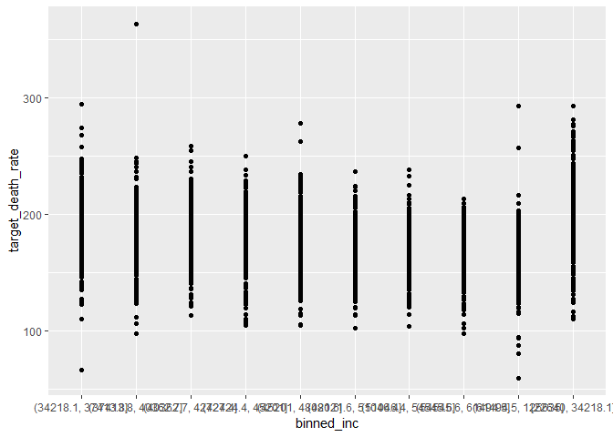
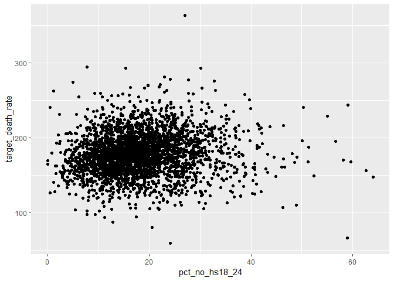

final\_project
================
Annie Clark
December 8, 2018

1.  Lit review
2.  EDA/tidying
3.  lit review and eda to help with variable selection

missing values
--------------

``` r
library(tidyverse)
```

    ## -- Attaching packages ------------------------------------------------------------------ tidyverse 1.2.1 --

    ## v ggplot2 3.1.0     v purrr   0.2.5
    ## v tibble  1.4.2     v dplyr   0.7.6
    ## v tidyr   0.8.1     v stringr 1.3.1
    ## v readr   1.1.1     v forcats 0.3.0

    ## -- Conflicts --------------------------------------------------------------------- tidyverse_conflicts() --
    ## x dplyr::filter() masks stats::filter()
    ## x dplyr::lag()    masks stats::lag()

``` r
cancer_data = read_csv(file = "./data/Cancer_Registry.csv") %>% 
  janitor::clean_names()
```

    ## Parsed with column specification:
    ## cols(
    ##   .default = col_double(),
    ##   avgDeathsPerYear = col_integer(),
    ##   medIncome = col_integer(),
    ##   popEst2015 = col_integer(),
    ##   binnedInc = col_character(),
    ##   Geography = col_character()
    ## )

    ## See spec(...) for full column specifications.

``` r
names(cancer_data)
```

    ##  [1] "avg_ann_count"              "avg_deaths_per_year"       
    ##  [3] "target_death_rate"          "incidence_rate"            
    ##  [5] "med_income"                 "pop_est2015"               
    ##  [7] "poverty_percent"            "study_per_cap"             
    ##  [9] "binned_inc"                 "median_age"                
    ## [11] "median_age_male"            "median_age_female"         
    ## [13] "geography"                  "avg_household_size"        
    ## [15] "percent_married"            "pct_no_hs18_24"            
    ## [17] "pct_hs18_24"                "pct_some_col18_24"         
    ## [19] "pct_bach_deg18_24"          "pct_hs25_over"             
    ## [21] "pct_bach_deg25_over"        "pct_employed16_over"       
    ## [23] "pct_unemployed16_over"      "pct_private_coverage"      
    ## [25] "pct_private_coverage_alone" "pct_emp_priv_coverage"     
    ## [27] "pct_public_coverage"        "pct_public_coverage_alone" 
    ## [29] "pct_white"                  "pct_black"                 
    ## [31] "pct_asian"                  "pct_other_race"            
    ## [33] "pct_married_households"     "birth_rate"

``` r
cancer_data %>% 
  filter(is.na(avg_ann_count)) %>% 
  nrow()
```

    ## [1] 0

``` r
cancer_data %>% 
  filter(is.na(avg_deaths_per_year)) %>% 
  nrow()
```

    ## [1] 0

``` r
cancer_data %>% 
  filter(is.na(target_death_rate)) %>% 
  nrow()
```

    ## [1] 0

``` r
cancer_data %>% 
  filter(is.na(incidence_rate)) %>% 
  nrow()
```

    ## [1] 0

``` r
cancer_data %>% 
  filter(is.na(med_income)) %>% 
  nrow()
```

    ## [1] 0

``` r
cancer_data %>% 
  filter(is.na(pop_est2015)) %>% 
  nrow()
```

    ## [1] 0

``` r
cancer_data %>% 
  filter(is.na(poverty_percent)) %>% 
  nrow()
```

    ## [1] 0

``` r
cancer_data %>% 
  filter(is.na(study_per_cap)) %>% 
  nrow()
```

    ## [1] 0

``` r
cancer_data %>% 
  filter(is.na(binned_inc)) %>% 
  nrow()
```

    ## [1] 0

``` r
cancer_data %>% 
  filter(is.na(median_age)) %>% 
  nrow()
```

    ## [1] 0

``` r
cancer_data %>% 
  filter(is.na(median_age_male)) %>% 
  nrow()
```

    ## [1] 0

``` r
cancer_data %>% 
  filter(is.na(median_age_female)) %>% 
  nrow()
```

    ## [1] 0

``` r
cancer_data %>% 
  filter(is.na(geography)) %>% 
  nrow()
```

    ## [1] 0

``` r
cancer_data %>% 
  filter(is.na(avg_household_size)) %>% 
  nrow()
```

    ## [1] 0

``` r
cancer_data %>% 
  filter(is.na(percent_married)) %>% 
  nrow()
```

    ## [1] 0

``` r
cancer_data %>% 
  filter(is.na(pct_no_hs18_24)) %>% 
  nrow()
```

    ## [1] 0

``` r
cancer_data %>% 
  filter(is.na(pct_hs18_24)) %>% 
  nrow()
```

    ## [1] 0

``` r
cancer_data %>% 
  filter(is.na(pct_some_col18_24)) %>% 
  nrow()
```

    ## [1] 2285

``` r
##2285

cancer_data %>% 
  filter(is.na(pct_bach_deg18_24)) %>% 
  nrow()
```

    ## [1] 0

``` r
cancer_data %>% 
  filter(is.na(pct_hs25_over)) %>% 
  nrow()
```

    ## [1] 0

``` r
cancer_data %>% 
  filter(is.na(pct_private_coverage)) %>% 
  nrow()
```

    ## [1] 0

``` r
cancer_data %>% 
  filter(is.na(pct_employed16_over)) %>% 
  nrow()
```

    ## [1] 152

``` r
## 152

cancer_data %>% 
  filter(is.na(pct_unemployed16_over)) %>% 
  nrow()
```

    ## [1] 0

``` r
cancer_data %>% 
  filter(is.na(pct_private_coverage)) %>% 
  nrow()
```

    ## [1] 0

``` r
cancer_data %>% 
  filter(is.na(pct_private_coverage_alone)) %>% 
  nrow()
```

    ## [1] 609

``` r
##609

cancer_data %>% 
  filter(is.na(pct_emp_priv_coverage)) %>% 
  nrow()
```

    ## [1] 0

``` r
cancer_data %>% 
  filter(is.na(pct_public_coverage)) %>% 
  nrow()
```

    ## [1] 0

``` r
cancer_data %>% 
  filter(is.na(pct_public_coverage_alone)) %>% 
  nrow()
```

    ## [1] 0

``` r
cancer_data %>% 
  filter(is.na(pct_white)) %>% 
  nrow()
```

    ## [1] 0

``` r
cancer_data %>% 
  filter(is.na(pct_black)) %>% 
  nrow()
```

    ## [1] 0

``` r
cancer_data %>% 
  filter(is.na(pct_asian)) %>% 
  nrow()
```

    ## [1] 0

``` r
cancer_data %>% 
  filter(is.na(pct_other_race)) %>% 
  nrow()
```

    ## [1] 0

``` r
cancer_data %>% 
  filter(is.na(pct_married_households)) %>% 
  nrow()
```

    ## [1] 0

``` r
cancer_data %>% 
  filter(is.na(birth_rate)) %>% 
  nrow()
```

    ## [1] 0

variables with missing data: - pct\_private\_coverage\_alone (609 missing) 20% - pct\_employed16\_over (152 missing) 5% - pct\_some\_col18\_24 (2285 missing) 75%

correlation
-----------

``` r
summary(cancer_data)
```

    ##  avg_ann_count     avg_deaths_per_year target_death_rate incidence_rate  
    ##  Min.   :    6.0   Min.   :    3       Min.   : 59.7     Min.   : 201.3  
    ##  1st Qu.:   76.0   1st Qu.:   28       1st Qu.:161.2     1st Qu.: 420.3  
    ##  Median :  171.0   Median :   61       Median :178.1     Median : 453.5  
    ##  Mean   :  606.3   Mean   :  186       Mean   :178.7     Mean   : 448.3  
    ##  3rd Qu.:  518.0   3rd Qu.:  149       3rd Qu.:195.2     3rd Qu.: 480.9  
    ##  Max.   :38150.0   Max.   :14010       Max.   :362.8     Max.   :1206.9  
    ##                                                                          
    ##    med_income      pop_est2015       poverty_percent study_per_cap    
    ##  Min.   : 22640   Min.   :     827   Min.   : 3.20   Min.   :   0.00  
    ##  1st Qu.: 38883   1st Qu.:   11684   1st Qu.:12.15   1st Qu.:   0.00  
    ##  Median : 45207   Median :   26643   Median :15.90   Median :   0.00  
    ##  Mean   : 47063   Mean   :  102637   Mean   :16.88   Mean   : 155.40  
    ##  3rd Qu.: 52492   3rd Qu.:   68671   3rd Qu.:20.40   3rd Qu.:  83.65  
    ##  Max.   :125635   Max.   :10170292   Max.   :47.40   Max.   :9762.31  
    ##                                                                       
    ##   binned_inc          median_age     median_age_male median_age_female
    ##  Length:3047        Min.   : 22.30   Min.   :22.40   Min.   :22.30    
    ##  Class :character   1st Qu.: 37.70   1st Qu.:36.35   1st Qu.:39.10    
    ##  Mode  :character   Median : 41.00   Median :39.60   Median :42.40    
    ##                     Mean   : 45.27   Mean   :39.57   Mean   :42.15    
    ##                     3rd Qu.: 44.00   3rd Qu.:42.50   3rd Qu.:45.30    
    ##                     Max.   :624.00   Max.   :64.70   Max.   :65.70    
    ##                                                                       
    ##   geography         avg_household_size percent_married pct_no_hs18_24 
    ##  Length:3047        Min.   :0.0221     Min.   :23.10   Min.   : 0.00  
    ##  Class :character   1st Qu.:2.3700     1st Qu.:47.75   1st Qu.:12.80  
    ##  Mode  :character   Median :2.5000     Median :52.40   Median :17.10  
    ##                     Mean   :2.4797     Mean   :51.77   Mean   :18.22  
    ##                     3rd Qu.:2.6300     3rd Qu.:56.40   3rd Qu.:22.70  
    ##                     Max.   :3.9700     Max.   :72.50   Max.   :64.10  
    ##                                                                       
    ##   pct_hs18_24   pct_some_col18_24 pct_bach_deg18_24 pct_hs25_over  
    ##  Min.   : 0.0   Min.   : 7.10     Min.   : 0.000    Min.   : 7.50  
    ##  1st Qu.:29.2   1st Qu.:34.00     1st Qu.: 3.100    1st Qu.:30.40  
    ##  Median :34.7   Median :40.40     Median : 5.400    Median :35.30  
    ##  Mean   :35.0   Mean   :40.98     Mean   : 6.158    Mean   :34.80  
    ##  3rd Qu.:40.7   3rd Qu.:46.40     3rd Qu.: 8.200    3rd Qu.:39.65  
    ##  Max.   :72.5   Max.   :79.00     Max.   :51.800    Max.   :54.80  
    ##                 NA's   :2285                                       
    ##  pct_bach_deg25_over pct_employed16_over pct_unemployed16_over
    ##  Min.   : 2.50       Min.   :17.60       Min.   : 0.400       
    ##  1st Qu.: 9.40       1st Qu.:48.60       1st Qu.: 5.500       
    ##  Median :12.30       Median :54.50       Median : 7.600       
    ##  Mean   :13.28       Mean   :54.15       Mean   : 7.852       
    ##  3rd Qu.:16.10       3rd Qu.:60.30       3rd Qu.: 9.700       
    ##  Max.   :42.20       Max.   :80.10       Max.   :29.400       
    ##                      NA's   :152                              
    ##  pct_private_coverage pct_private_coverage_alone pct_emp_priv_coverage
    ##  Min.   :22.30        Min.   :15.70              Min.   :13.5         
    ##  1st Qu.:57.20        1st Qu.:41.00              1st Qu.:34.5         
    ##  Median :65.10        Median :48.70              Median :41.1         
    ##  Mean   :64.35        Mean   :48.45              Mean   :41.2         
    ##  3rd Qu.:72.10        3rd Qu.:55.60              3rd Qu.:47.7         
    ##  Max.   :92.30        Max.   :78.90              Max.   :70.7         
    ##                       NA's   :609                                     
    ##  pct_public_coverage pct_public_coverage_alone   pct_white     
    ##  Min.   :11.20       Min.   : 2.60             Min.   : 10.20  
    ##  1st Qu.:30.90       1st Qu.:14.85             1st Qu.: 77.30  
    ##  Median :36.30       Median :18.80             Median : 90.06  
    ##  Mean   :36.25       Mean   :19.24             Mean   : 83.65  
    ##  3rd Qu.:41.55       3rd Qu.:23.10             3rd Qu.: 95.45  
    ##  Max.   :65.10       Max.   :46.60             Max.   :100.00  
    ##                                                                
    ##    pct_black         pct_asian       pct_other_race   
    ##  Min.   : 0.0000   Min.   : 0.0000   Min.   : 0.0000  
    ##  1st Qu.: 0.6207   1st Qu.: 0.2542   1st Qu.: 0.2952  
    ##  Median : 2.2476   Median : 0.5498   Median : 0.8262  
    ##  Mean   : 9.1080   Mean   : 1.2540   Mean   : 1.9835  
    ##  3rd Qu.:10.5097   3rd Qu.: 1.2210   3rd Qu.: 2.1780  
    ##  Max.   :85.9478   Max.   :42.6194   Max.   :41.9303  
    ##                                                       
    ##  pct_married_households   birth_rate    
    ##  Min.   :22.99          Min.   : 0.000  
    ##  1st Qu.:47.76          1st Qu.: 4.521  
    ##  Median :51.67          Median : 5.381  
    ##  Mean   :51.24          Mean   : 5.640  
    ##  3rd Qu.:55.40          3rd Qu.: 6.494  
    ##  Max.   :78.08          Max.   :21.326  
    ## 

``` r
## binned_inc - character
## geography - character

cancer_data %>% 
  select(-binned_inc, -geography) %>% ##remove characters
  cor() %>% 
  as_tibble()
```

    ## # A tibble: 32 x 32
    ##    avg_ann_count avg_deaths_per_~ target_death_ra~ incidence_rate
    ##            <dbl>            <dbl>            <dbl>          <dbl>
    ##  1        1                0.939          -0.144          0.0736 
    ##  2        0.939            1              -0.0907         0.0627 
    ##  3       -0.144           -0.0907          1              0.449  
    ##  4        0.0736           0.0627          0.449          1      
    ##  5        0.269            0.223          -0.429         -0.00104
    ##  6        0.927            0.978          -0.120          0.0269 
    ##  7       -0.136           -0.0669          0.429          0.00905
    ##  8        0.0821           0.0635         -0.0223         0.0773 
    ##  9       -0.0241          -0.0246          0.00438        0.0181 
    ## 10       -0.125           -0.148          -0.0219        -0.0147 
    ## # ... with 22 more rows, and 28 more variables: med_income <dbl>,
    ## #   pop_est2015 <dbl>, poverty_percent <dbl>, study_per_cap <dbl>,
    ## #   median_age <dbl>, median_age_male <dbl>, median_age_female <dbl>,
    ## #   avg_household_size <dbl>, percent_married <dbl>, pct_no_hs18_24 <dbl>,
    ## #   pct_hs18_24 <dbl>, pct_some_col18_24 <dbl>, pct_bach_deg18_24 <dbl>,
    ## #   pct_hs25_over <dbl>, pct_bach_deg25_over <dbl>,
    ## #   pct_employed16_over <dbl>, pct_unemployed16_over <dbl>,
    ## #   pct_private_coverage <dbl>, pct_private_coverage_alone <dbl>,
    ## #   pct_emp_priv_coverage <dbl>, pct_public_coverage <dbl>,
    ## #   pct_public_coverage_alone <dbl>, pct_white <dbl>, pct_black <dbl>,
    ## #   pct_asian <dbl>, pct_other_race <dbl>, pct_married_households <dbl>,
    ## #   birth_rate <dbl>

``` r
library(corrplot)
```

    ## corrplot 0.84 loaded

``` r
cancer_data %>% 
  select(-binned_inc, -geography,
         -pct_private_coverage_alone, -pct_employed16_over, -pct_some_col18_24) %>% ##remove characters
  cor() %>% 
  corrplot(., method = "square", insig = "blank", diag=FALSE, number.cex = .7)
```


There are clusters of variables that look to be correlated with other variables.

If we choose to use any other following variables, we need to check what other variables are in the model to make sure there is not a multicollinearity issue:

-   med\_income
-   poverty\_percent
-   pct\_public\_coverage\_along
-   pct\_public\_coverage
-   pct\_emp\_priv\_coverage
-   pct\_private\_coverage

Also, noteable pairs highly correlated:

-   pct\_black & pct\_white
-   pct\_married\_household & avg\_household\_size ... there are a dozen more

scatterplots of target\_death\_rate vs. risk factors
----------------------------------------------------

``` r
cancer_data %>% 
  ggplot(aes(x = avg_ann_count, y = target_death_rate)) + 
  geom_point()
```


``` r
## looks like needs a log transformation

cancer_data %>% 
  ggplot(aes(x = log(avg_ann_count), y = target_death_rate)) + 
  geom_point()
```


``` r
## looks curvilinear


cancer_data %>% 
  ggplot(aes(x = avg_deaths_per_year, y = target_death_rate)) + 
  geom_point()
```


``` r
## looks like needs a log transformation


cancer_data %>% 
  ggplot(aes(x = log(avg_deaths_per_year), y = target_death_rate)) + 
  geom_point()
```


``` r
## still looks curvilinear


cancer_data %>% 
  ggplot(aes(x = incidence_rate, y = target_death_rate)) + 
  geom_point()
```


``` r
## linear, with some x extreme outliers

cancer_data %>% 
  ggplot(aes(x = med_income, y = target_death_rate)) + 
  geom_point()
```


``` r
## looks a little curvilinear -- need to do transformation

cancer_data %>% 
  ggplot(aes(x = (1/med_income), y = target_death_rate)) + 
  geom_point()
```


``` r
## looks linear...

cancer_data %>% 
  ggplot(aes(x = pop_est2015, y = target_death_rate)) + 
  geom_point()
```


``` r
## need to do log transformation

cancer_data %>% 
  ggplot(aes(x = log(pop_est2015), y = target_death_rate)) + 
  geom_point()
```


``` r
## still looks a little curvilinear

cancer_data %>% 
  ggplot(aes(x = poverty_percent, y = target_death_rate)) + 
  geom_point()
```


``` r
## looks linear

cancer_data %>% 
  ggplot(aes(x = study_per_cap, y = target_death_rate)) + 
  geom_point()
```


``` r
## need to do a log transformation

cancer_data %>% 
  ggplot(aes(x = log(study_per_cap), y = target_death_rate)) + 
  geom_point()
```


``` r
## looks linear, but also has a weird 0 varlies all along the y values

cancer_data %>% 
  ggplot(aes(x = binned_inc, y = target_death_rate)) + 
  geom_point()
```



``` r
## looks randomly scattered throughout the bins.. should do boxplot

cancer_data %>% 
  ggplot(aes(x = binned_inc,  y = target_death_rate)) + 
  geom_boxplot() + 
  theme(axis.text.x=element_text(angle=45,hjust=1)) 
```


``` r
cancer_data %>% 
  group_by(binned_inc) %>% 
  summarise(n = n())
```

    ## # A tibble: 10 x 2
    ##    binned_inc             n
    ##    <chr>              <int>
    ##  1 (34218.1, 37413.8]   304
    ##  2 (37413.8, 40362.7]   304
    ##  3 (40362.7, 42724.4]   304
    ##  4 (42724.4, 45201]     305
    ##  5 (45201, 48021.6]     306
    ##  6 (48021.6, 51046.4]   305
    ##  7 (51046.4, 54545.6]   305
    ##  8 (54545.6, 61494.5]   306
    ##  9 (61494.5, 125635]    302
    ## 10 [22640, 34218.1]     306

``` r
## oddly a similar number of observations per bin... 

cancer_data %>% 
  ggplot(aes(x = median_age, y = target_death_rate)) + 
  geom_point()
```


``` r
## this looks like an issue - let's look further into median_age

cancer_data %>% 
  group_by(round(median_age)) %>% 
  summarize(n = n()) 
```

    ## # A tibble: 65 x 2
    ##    `round(median_age)`     n
    ##                  <dbl> <int>
    ##  1                  22     1
    ##  2                  23     2
    ##  3                  24     4
    ##  4                  25     6
    ##  5                  26     8
    ##  6                  27     6
    ##  7                  28    14
    ##  8                  29    17
    ##  9                  30    39
    ## 10                  31    32
    ## # ... with 55 more rows

``` r
## there are ages that go from 22 - 65 and then from 349 - 624. This is an error with the data

cancer_data %>% 
  ggplot(aes(x = median_age_male, y = target_death_rate)) + 
  geom_point()
```


``` r
## looks like curvilinear, let's try transformation

cancer_data %>% 
  ggplot(aes(x = median_age_male^2, y = target_death_rate)) + 
  geom_point()
```


``` r
## tried ^2, ^3, inverse, log, nothing really makes it look better

cancer_data %>% 
  ggplot(aes(x = median_age_female, y = target_death_rate)) + 
  geom_point()
```


``` r
## similar to male median age


cancer_data %>% 
  ggplot(aes(x = median_age_female^2, y = target_death_rate)) + 
  geom_point()
```


``` r
## tried ^2, ^3, inverse, log, nothing really makes it look better


cancer_data %>% 
  ggplot(aes(x = avg_household_size, y = target_death_rate)) + 
  geom_point()
```


``` r
## there are a ton of 0 values; this coule potentially be a data quality issue

cancer_data %>% 
  count(avg_household_size)
```

    ## # A tibble: 199 x 2
    ##    avg_household_size     n
    ##                 <dbl> <int>
    ##  1             0.0221     1
    ##  2             0.0222     2
    ##  3             0.0225     1
    ##  4             0.023      1
    ##  5             0.0236     1
    ##  6             0.0237     2
    ##  7             0.0239     1
    ##  8             0.024      3
    ##  9             0.0241     2
    ## 10             0.0242     3
    ## # ... with 189 more rows

``` r
## it looks like there are a ton of 0.02.... not sure what this means?


cancer_data %>% 
  ggplot(aes(x = percent_married, y = target_death_rate)) + 
  geom_point()
```


``` r
## looks linear; potentially curilinear


cancer_data %>% 
  ggplot(aes(x = percent_married^2, y = target_death_rate)) + 
  geom_point()
```


``` r
## looks better

cancer_data %>% 
  ggplot(aes(x = pct_no_hs18_24, y = target_death_rate)) + 
  geom_point()
```



``` r
## looks linear; potentially curilinear


cancer_data %>% 
  ggplot(aes(x = pct_hs18_24, y = target_death_rate)) + 
  geom_point()
```


``` r
cancer_data %>% 
  ggplot(aes(x = pct_some_col18_24, y = target_death_rate)) + 
  geom_point()
```

    ## Warning: Removed 2285 rows containing missing values (geom_point).


``` r
## linear, but missing values

cancer_data %>% 
  ggplot(aes(x = pct_bach_deg18_24, y = target_death_rate)) + 
  geom_point()
```


``` r
## log transformation

cancer_data %>% 
  ggplot(aes(x = log(pct_bach_deg18_24), y = target_death_rate)) + 
  geom_point()
```


``` r
## makes it a little better, but zero values are an issue (inverse and squared do not work)


cancer_data %>% 
  ggplot(aes(x = pct_hs25_over, y = target_death_rate)) + 
  geom_point()
```


``` r
## looks linear

cancer_data %>% 
  ggplot(aes(x = pct_bach_deg25_over, y = target_death_rate)) + 
  geom_point()
```


``` r
## looks a little curvilinear

cancer_data %>% 
  ggplot(aes(x = log(pct_bach_deg25_over), y = target_death_rate)) + 
  geom_point()
```


``` r
## looks good

cancer_data %>% 
  ggplot(aes(x = pct_employed16_over, y = target_death_rate)) + 
  geom_point()
```

    ## Warning: Removed 152 rows containing missing values (geom_point).


``` r
## looks linear

cancer_data %>% 
  ggplot(aes(x = pct_unemployed16_over, y = target_death_rate)) + 
  geom_point()
```


``` r
## looks linear

cancer_data %>% 
  ggplot(aes(x = pct_private_coverage, y = target_death_rate)) + 
  geom_point()
```


``` r
## looks linear

cancer_data %>% 
  ggplot(aes(x = pct_private_coverage_alone, y = target_death_rate)) + 
  geom_point()
```

    ## Warning: Removed 609 rows containing missing values (geom_point).


``` r
## looks linear

cancer_data %>% 
  ggplot(aes(x = pct_emp_priv_coverage, y = target_death_rate)) + 
  geom_point()
```


``` r
## looks linear but also heteroscedastic

cancer_data %>% 
  ggplot(aes(x = pct_public_coverage, y = target_death_rate)) + 
  geom_point()
```


``` r
## looks linear

cancer_data %>% 
  ggplot(aes(x = pct_public_coverage_alone, y = target_death_rate)) + 
  geom_point()
```


``` r
## looks linear

cancer_data %>% 
  ggplot(aes(x = pct_white, y = target_death_rate)) + 
  geom_point()
```


``` r
## log transformation needed


cancer_data %>% 
  ggplot(aes(x = 1/pct_white, y = target_death_rate)) + 
  geom_point()
```


``` r
## does not look linear, log, inverse and quadratics don't work

cancer_data %>% 
  ggplot(aes(x = pct_black, y = target_death_rate)) + 
  geom_point()
```


``` r
## need tranformation


cancer_data %>% 
  ggplot(aes(x = log(pct_black), y = target_death_rate)) + 
  geom_point()
```


``` r
## log looks better, but negative values may be an issue


cancer_data %>% 
  ggplot(aes(x = pct_asian, y = target_death_rate)) + 
  geom_point()
```


``` r
## need transformation

cancer_data %>% 
  ggplot(aes(x = log(pct_asian), y = target_death_rate)) + 
  geom_point()
```


``` r
## log looks better, but negative values may be an issue

cancer_data %>% 
  ggplot(aes(x = pct_other_race, y = target_death_rate)) + 
  geom_point()
```


``` r
## need transformation

cancer_data %>% 
  ggplot(aes(x = log(pct_other_race), y = target_death_rate)) + 
  geom_point()
```


``` r
## log looks better, but negative values may be an issue

cancer_data %>% 
  ggplot(aes(x = pct_married_households, y = target_death_rate)) + 
  geom_point()
```


``` r
## looks linear

cancer_data %>% 
  ggplot(aes(x = birth_rate, y = target_death_rate)) + 
  geom_point()
```


``` r
## data points are a cluster


cancer_data %>% 
  ggplot(aes(x = (birth_rate^3), y = target_death_rate)) + 
  geom_point()
```


``` r
## transformations don't really work
```

Non linear variables
--------------------

-   avg\_ann\_count (transformations don't work)
-   avg\_deaths\_per\_year (transformations don't work)
-   med\_income (inverse transformation worked)
-   study\_per\_cap (log transformation worked, but still has weird 0 values)
-   median\_age\_male (transformations don't work)
-   percent\_married (squared works)
-   pct\_no\_hs18\_24 (potentially curvlinear, squared/log do not work)
-   pct\_bach\_deg18\_24 (log makes a little better, but zeros are an issue)
-   pct\_bach\_deg25\_over (log works)
-   pct\_white (transformation don't work)
-   pct\_black (log works, but negative values clustered)
-   pct\_asian (log works, but negative values clustered)
-   birth\_rate (all values are clustered)

Variables with data quality concerns
------------------------------------

-   median\_age (median ages of 300 - 600)

Other things to note:
---------------------

-   incidence\_rate has some extreme x outliers
-   avg\_household\_size lots of median households of 0.02 size... not sure what this means
