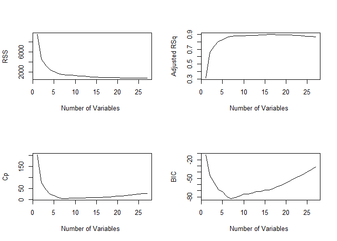
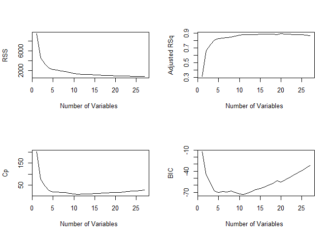
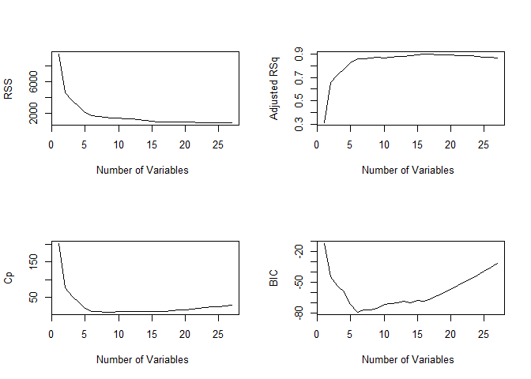
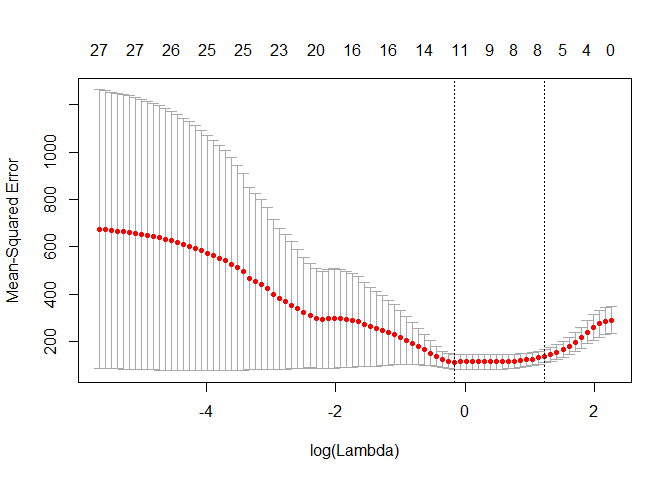
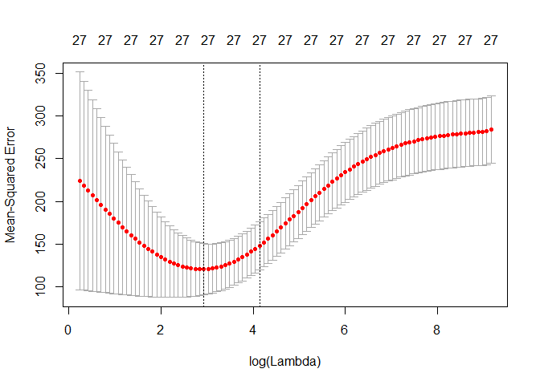
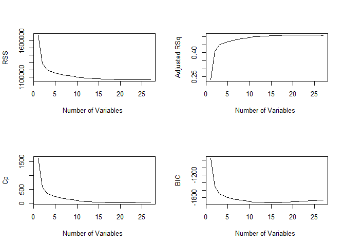
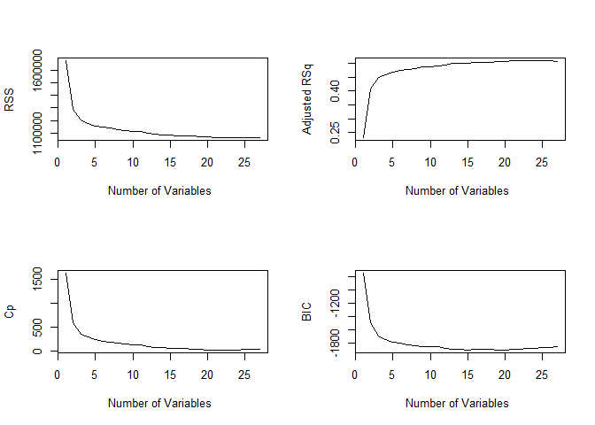
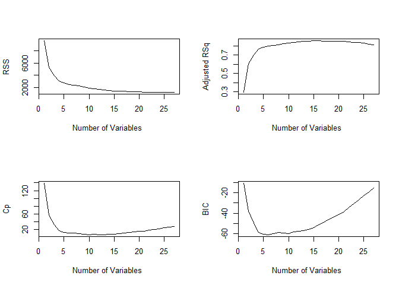

annie\_models
================
Annie Clark
December 15, 2018

``` r
library(tidyverse)
```

    ## -- Attaching packages --------------------------------------------------------------- tidyverse 1.2.1 --

    ## v ggplot2 3.1.0     v purrr   0.2.5
    ## v tibble  1.4.2     v dplyr   0.7.6
    ## v tidyr   0.8.1     v stringr 1.3.1
    ## v readr   1.1.1     v forcats 0.3.0

    ## -- Conflicts ------------------------------------------------------------------ tidyverse_conflicts() --
    ## x dplyr::filter() masks stats::filter()
    ## x dplyr::lag()    masks stats::lag()

``` r
cancer_data = read_csv(file = "./data/Cancer_Registry.csv") %>% 
  janitor::clean_names()
```

    ## Parsed with column specification:
    ## cols(
    ##   .default = col_double(),
    ##   avgDeathsPerYear = col_integer(),
    ##   medIncome = col_integer(),
    ##   popEst2015 = col_integer(),
    ##   binnedInc = col_character(),
    ##   Geography = col_character()
    ## )

    ## See spec(...) for full column specifications.

``` r
cancer_data_grouped = 
  cancer_data %>% 
  separate(geography, into = c("county", "state"), sep = ",") %>% 
  group_by(state) %>% 
  select (-median_age, -binned_inc, -pct_some_col18_24, 
          -pct_private_coverage_alone, pct_employed16_over, -county) %>% 
  summarise(avg_ann_count = mean(avg_ann_count),
            incidence_rate = mean(incidence_rate),
            poverty_percent = mean(poverty_percent),
            pct_no_hs18_24 = mean(pct_no_hs18_24),
            pct_bach_deg18_24 = mean(pct_bach_deg18_24),
            ##pct_employed16_over = mean(pct_employed16_over),
            pct_public_coverage_alone = mean(pct_public_coverage_alone),
            pct_asian = mean(pct_asian),
            birth_rate = mean(birth_rate),
            avg_deaths_per_year = mean(avg_deaths_per_year),
            med_income = mean(med_income),
            study_per_cap = mean(study_per_cap),
            median_age_male = mean(median_age_male),
            avg_household_size = mean(avg_household_size),
            pct_hs18_24 = mean(pct_hs18_24),
            pct_hs25_over = mean(pct_hs25_over),
            pct_unemployed16_over = mean(pct_unemployed16_over),
            pct_emp_priv_coverage = mean(pct_emp_priv_coverage),
            pct_white = mean(pct_white),
            pct_other_race = mean(pct_other_race),
            target_death_rate = mean(target_death_rate),
            pop_est2015 = mean(pop_est2015),
            median_age_female = mean(median_age_female),
            percent_married = mean(percent_married),
            pct_bach_deg25_over = mean(pct_bach_deg25_over),
            pct_private_coverage = mean(pct_private_coverage),
            pct_public_coverage = mean(pct_public_coverage),
            pct_black = mean(pct_black),
            pct_married_households = mean(pct_married_households)) %>% 
  select(-state)

## median for everyone; 

library(leaps)

## best subset selection

regfit.full = regsubsets(target_death_rate ~ ., data= cancer_data_grouped, nvmax = 27)
reg.summary = summary(regfit.full)
##reg.summary

par(mfrow=c(2, 2))
plot(reg.summary$rss ,xlab="Number of Variables ",ylab="RSS", type="l")

plot(reg.summary$adjr2 ,xlab="Number of Variables ",ylab="Adjusted RSq",type="l")

plot(reg.summary$cp,xlab="Number of Variables ",ylab="Cp",type="l")

plot(reg.summary$bic ,xlab="Number of Variables ",ylab="BIC",type="l")
```



``` r
which.min(reg.summary$rss)
```

    ## [1] 27

``` r
which.max(reg.summary$adjr2)
```

    ## [1] 16

``` r
which.min(reg.summary$cp)
```

    ## [1] 7

``` r
which.min(reg.summary$bic)
```

    ## [1] 7

``` r
## forward step wise 

regfit.forward = regsubsets(target_death_rate ~ ., data = cancer_data_grouped, 
                            method ="forward", nvmax = 27)
reg.summary=summary(regfit.forward)
##reg.summary

par(mfrow=c(2, 2))
plot(reg.summary$rss ,xlab="Number of Variables ",ylab="RSS", type="l")

plot(reg.summary$adjr2 ,xlab="Number of Variables ",ylab="Adjusted RSq",type="l")

plot(reg.summary$cp,xlab="Number of Variables ",ylab="Cp",type="l")

plot(reg.summary$bic ,xlab="Number of Variables ",ylab="BIC",type="l")
```



``` r
which.min(reg.summary$rss)
```

    ## [1] 27

``` r
which.max(reg.summary$adjr2)
```

    ## [1] 20

``` r
which.min(reg.summary$cp)
```

    ## [1] 11

``` r
which.min(reg.summary$bic)
```

    ## [1] 11

``` r
## backward step wise 

regfit.backward = regsubsets(target_death_rate ~ ., data= cancer_data_grouped, 
                             method = "backward", nvmax = 27)
reg.summary = summary(regfit.backward)
##reg.summary

par(mfrow=c(2, 2))
plot(reg.summary$rss ,xlab="Number of Variables ",ylab="RSS", type="l")

plot(reg.summary$adjr2 ,xlab="Number of Variables ",ylab="Adjusted RSq",type="l")

plot(reg.summary$cp,xlab="Number of Variables ",ylab="Cp",type="l")

plot(reg.summary$bic ,xlab="Number of Variables ",ylab="BIC",type="l")
```



``` r
which.min(reg.summary$rss)
```

    ## [1] 27

``` r
which.max(reg.summary$adjr2)
```

    ## [1] 16

``` r
which.min(reg.summary$cp)
```

    ## [1] 8

``` r
which.min(reg.summary$bic)
```

    ## [1] 6

``` r
## lasso 

require(methods)
attach(cancer_data_grouped)

library(glmnet)
```

    ## Loading required package: Matrix

    ## 
    ## Attaching package: 'Matrix'

    ## The following object is masked from 'package:tidyr':
    ## 
    ##     expand

    ## Loading required package: foreach

    ## 
    ## Attaching package: 'foreach'

    ## The following objects are masked from 'package:purrr':
    ## 
    ##     accumulate, when

    ## Loaded glmnet 2.0-16

``` r
test.mat = model.matrix(target_death_rate ~ ., data = cancer_data_grouped)[, -1]
lasso.mod = glmnet(test.mat, target_death_rate, alpha = 1)
set.seed(1)
cv.out = cv.glmnet(test.mat,target_death_rate,alpha=1)
par(mfrow=c(1, 1))
plot(cv.out)
```



``` r
bestlam = cv.out$lambda.min
bestlam
```

    ## [1] 0.8488109

``` r
out = glmnet (test.mat, target_death_rate, alpha=1)
lasso.coef = predict (out, type="coefficients", s= bestlam)
lasso.coef
```

    ## 28 x 1 sparse Matrix of class "dgCMatrix"
    ##                                       1
    ## (Intercept)               136.290810444
    ## avg_ann_count              -0.000207463
    ## incidence_rate              0.221154784
    ## poverty_percent             .          
    ## pct_no_hs18_24              .          
    ## pct_bach_deg18_24           .          
    ## pct_public_coverage_alone   .          
    ## pct_asian                  -0.195088451
    ## birth_rate                  .          
    ## avg_deaths_per_year         .          
    ## med_income                  .          
    ## study_per_cap              -0.004726675
    ## median_age_male             .          
    ## avg_household_size          .          
    ## pct_hs18_24                 0.636863215
    ## pct_hs25_over               0.441625909
    ## pct_unemployed16_over       .          
    ## pct_emp_priv_coverage       .          
    ## pct_white                   .          
    ## pct_other_race             -0.800081464
    ## pop_est2015                 .          
    ## median_age_female           .          
    ## percent_married             .          
    ## pct_bach_deg25_over        -1.445534238
    ## pct_private_coverage       -0.355535621
    ## pct_public_coverage         .          
    ## pct_black                   0.066059385
    ## pct_married_households     -1.001646376

``` r
rsq = 1 - cv.out$cvm/var(target_death_rate)

summary(lasso.mod)
```

    ##           Length Class     Mode   
    ## a0         100   -none-    numeric
    ## beta      2700   dgCMatrix S4     
    ## df         100   -none-    numeric
    ## dim          2   -none-    numeric
    ## lambda     100   -none-    numeric
    ## dev.ratio  100   -none-    numeric
    ## nulldev      1   -none-    numeric
    ## npasses      1   -none-    numeric
    ## jerr         1   -none-    numeric
    ## offset       1   -none-    logical
    ## call         4   -none-    call   
    ## nobs         1   -none-    numeric

``` r
lasso.mod
```

    ## 
    ## Call:  glmnet(x = test.mat, y = target_death_rate, alpha = 1) 
    ## 
    ##        Df    %Dev    Lambda
    ##   [1,]  0 0.00000 9.5350000
    ##   [2,]  2 0.06183 8.6880000
    ##   [3,]  3 0.15150 7.9160000
    ##   [4,]  4 0.24560 7.2130000
    ##   [5,]  4 0.32820 6.5720000
    ##   [6,]  4 0.39670 5.9880000
    ##   [7,]  4 0.45360 5.4560000
    ##   [8,]  5 0.50220 4.9720000
    ##   [9,]  5 0.54350 4.5300000
    ##  [10,]  5 0.57790 4.1270000
    ##  [11,]  6 0.60760 3.7610000
    ##  [12,]  7 0.64480 3.4270000
    ##  [13,]  8 0.67890 3.1220000
    ##  [14,]  9 0.70940 2.8450000
    ##  [15,]  9 0.73540 2.5920000
    ##  [16,]  8 0.75490 2.3620000
    ##  [17,]  8 0.77100 2.1520000
    ##  [18,]  8 0.78440 1.9610000
    ##  [19,]  8 0.79560 1.7870000
    ##  [20,]  9 0.80600 1.6280000
    ##  [21,]  9 0.81530 1.4830000
    ##  [22,] 10 0.82320 1.3520000
    ##  [23,] 10 0.83020 1.2310000
    ##  [24,] 10 0.83600 1.1220000
    ##  [25,] 11 0.84090 1.0220000
    ##  [26,] 11 0.84500 0.9316000
    ##  [27,] 11 0.84840 0.8488000
    ##  [28,] 12 0.85150 0.7734000
    ##  [29,] 13 0.85500 0.7047000
    ##  [30,] 13 0.85800 0.6421000
    ##  [31,] 13 0.86050 0.5851000
    ##  [32,] 14 0.86310 0.5331000
    ##  [33,] 14 0.86570 0.4857000
    ##  [34,] 15 0.86800 0.4426000
    ##  [35,] 15 0.86990 0.4033000
    ##  [36,] 15 0.87290 0.3674000
    ##  [37,] 16 0.87810 0.3348000
    ##  [38,] 16 0.88230 0.3050000
    ##  [39,] 16 0.88590 0.2779000
    ##  [40,] 16 0.88880 0.2533000
    ##  [41,] 16 0.89130 0.2308000
    ##  [42,] 16 0.89340 0.2103000
    ##  [43,] 16 0.89500 0.1916000
    ##  [44,] 16 0.89650 0.1746000
    ##  [45,] 16 0.89760 0.1591000
    ##  [46,] 17 0.89870 0.1449000
    ##  [47,] 18 0.89950 0.1320000
    ##  [48,] 18 0.90030 0.1203000
    ##  [49,] 19 0.90140 0.1096000
    ##  [50,] 20 0.90380 0.0998900
    ##  [51,] 20 0.90650 0.0910200
    ##  [52,] 19 0.90870 0.0829300
    ##  [53,] 20 0.91060 0.0755600
    ##  [54,] 20 0.91270 0.0688500
    ##  [55,] 21 0.91450 0.0627300
    ##  [56,] 23 0.91640 0.0571600
    ##  [57,] 24 0.91850 0.0520800
    ##  [58,] 24 0.92020 0.0474600
    ##  [59,] 25 0.92170 0.0432400
    ##  [60,] 25 0.92300 0.0394000
    ##  [61,] 24 0.92410 0.0359000
    ##  [62,] 25 0.92520 0.0327100
    ##  [63,] 25 0.92680 0.0298000
    ##  [64,] 25 0.92810 0.0271600
    ##  [65,] 26 0.92930 0.0247400
    ##  [66,] 27 0.93060 0.0225500
    ##  [67,] 26 0.93150 0.0205400
    ##  [68,] 25 0.93230 0.0187200
    ##  [69,] 25 0.93280 0.0170500
    ##  [70,] 24 0.93320 0.0155400
    ##  [71,] 25 0.93370 0.0141600
    ##  [72,] 25 0.93410 0.0129000
    ##  [73,] 25 0.93440 0.0117600
    ##  [74,] 26 0.93480 0.0107100
    ##  [75,] 26 0.93520 0.0097590
    ##  [76,] 26 0.93560 0.0088920
    ##  [77,] 26 0.93590 0.0081020
    ##  [78,] 26 0.93620 0.0073830
    ##  [79,] 26 0.93640 0.0067270
    ##  [80,] 27 0.93660 0.0061290
    ##  [81,] 27 0.93680 0.0055850
    ##  [82,] 27 0.93690 0.0050880
    ##  [83,] 27 0.93700 0.0046360
    ##  [84,] 27 0.93710 0.0042250
    ##  [85,] 27 0.93720 0.0038490
    ##  [86,] 27 0.93730 0.0035070
    ##  [87,] 27 0.93740 0.0031960
    ##  [88,] 27 0.93740 0.0029120
    ##  [89,] 27 0.93750 0.0026530
    ##  [90,] 27 0.93750 0.0024170
    ##  [91,] 27 0.93760 0.0022030
    ##  [92,] 27 0.93760 0.0020070
    ##  [93,] 27 0.93760 0.0018290
    ##  [94,] 27 0.93760 0.0016660
    ##  [95,] 27 0.93770 0.0015180
    ##  [96,] 27 0.93770 0.0013830
    ##  [97,] 27 0.93770 0.0012600
    ##  [98,] 27 0.93770 0.0011480
    ##  [99,] 27 0.93770 0.0010460
    ## [100,] 27 0.93770 0.0009535

``` r
## ridge regression

test.mat = model.matrix(target_death_rate ~ ., data = cancer_data_grouped)[, -1]
ridge.mod=cv.glmnet(test.mat, target_death_rate, alpha=0, thresh = 1e-12)
bestlam =ridge.mod$lambda.min
par(mfrow=c(1, 1))
plot(ridge.mod)
```



``` r
ridge.mod$lambda.min
```

    ## [1] 18.71739

``` r
coef(ridge.mod)
```

    ## 28 x 1 sparse Matrix of class "dgCMatrix"
    ##                                       1
    ## (Intercept)                1.756027e+02
    ## avg_ann_count             -5.096896e-04
    ## incidence_rate             4.861513e-02
    ## poverty_percent            2.060745e-01
    ## pct_no_hs18_24            -1.781225e-02
    ## pct_bach_deg18_24         -3.169649e-04
    ## pct_public_coverage_alone  1.633545e-01
    ## pct_asian                 -1.357305e-01
    ## birth_rate                -9.009877e-01
    ## avg_deaths_per_year       -1.272182e-03
    ## med_income                -5.800286e-05
    ## study_per_cap             -3.102469e-03
    ## median_age_male           -7.211476e-02
    ## avg_household_size        -3.595385e+00
    ## pct_hs18_24                1.972890e-01
    ## pct_hs25_over              2.671112e-01
    ## pct_unemployed16_over      3.466212e-01
    ## pct_emp_priv_coverage     -1.723107e-02
    ## pct_white                 -1.591861e-02
    ## pct_other_race            -5.094094e-01
    ## pop_est2015               -3.077097e-06
    ## median_age_female         -3.975797e-02
    ## percent_married           -1.356853e-01
    ## pct_bach_deg25_over       -3.182239e-01
    ## pct_private_coverage      -9.024478e-02
    ## pct_public_coverage        1.079199e-01
    ## pct_black                  8.136289e-02
    ## pct_married_households    -1.550741e-01

``` r
## split into test/training datasets

library(ISLR)
train = sample(1:nrow(cancer_data_grouped), nrow(cancer_data_grouped)/2)
test = (-train)
test.data = cancer_data_grouped[test,]
train.data = cancer_data_grouped[train,]
```

``` r
library(tidyverse)

cancer_data = read_csv(file = "./data/Cancer_Registry.csv") %>% 
  janitor::clean_names()
```

    ## Parsed with column specification:
    ## cols(
    ##   .default = col_double(),
    ##   avgDeathsPerYear = col_integer(),
    ##   medIncome = col_integer(),
    ##   popEst2015 = col_integer(),
    ##   binnedInc = col_character(),
    ##   Geography = col_character()
    ## )

    ## See spec(...) for full column specifications.

``` r
cancer_data_clean = 
  cancer_data %>% 
  separate(geography, into = c("county", "state"), sep = ",") %>% 
  select (-median_age, -binned_inc, -pct_some_col18_24, 
          -pct_private_coverage_alone, pct_employed16_over, -county, -state) 


library(leaps)

## best subset selection

regfit.full = regsubsets(target_death_rate ~ ., data= cancer_data_clean, nvmax = 27)
reg.summary = summary(regfit.full)
##reg.summary

par(mfrow=c(2, 2))
plot(reg.summary$rss ,xlab="Number of Variables ",ylab="RSS", type="l")

plot(reg.summary$adjr2 ,xlab="Number of Variables ",ylab="Adjusted RSq",type="l")

plot(reg.summary$cp,xlab="Number of Variables ",ylab="Cp",type="l")

plot(reg.summary$bic ,xlab="Number of Variables ",ylab="BIC",type="l")
```



``` r
which.min(reg.summary$rss)
```

    ## [1] 27

``` r
which.max(reg.summary$adjr2)
```

    ## [1] 22

``` r
which.min(reg.summary$cp)
```

    ## [1] 19

``` r
which.min(reg.summary$bic)
```

    ## [1] 16

``` r
## forward step wise 

regfit.forward = regsubsets(target_death_rate ~ ., data = cancer_data_clean, 
                            method ="forward", nvmax = 27)
reg.summary=summary(regfit.forward)
##reg.summary

par(mfrow=c(2, 2))
plot(reg.summary$rss ,xlab="Number of Variables ",ylab="RSS", type="l")

plot(reg.summary$adjr2 ,xlab="Number of Variables ",ylab="Adjusted RSq",type="l")

plot(reg.summary$cp,xlab="Number of Variables ",ylab="Cp",type="l")

plot(reg.summary$bic ,xlab="Number of Variables ",ylab="BIC",type="l")
```



``` r
which.min(reg.summary$rss)
```

    ## [1] 27

``` r
which.max(reg.summary$adjr2)
```

    ## [1] 22

``` r
which.min(reg.summary$cp)
```

    ## [1] 21

``` r
which.min(reg.summary$bic)
```

    ## [1] 20

``` r
## backward step wise 

regfit.backward = regsubsets(target_death_rate ~ ., data= cancer_data_clean, 
                             method = "backward", nvmax = 27)
reg.summary = summary(regfit.backward)

##reg.summary

par(mfrow=c(2, 2))
plot(reg.summary$rss ,xlab="Number of Variables ",ylab="RSS", type="l")

plot(reg.summary$adjr2 ,xlab="Number of Variables ",ylab="Adjusted RSq",type="l")

plot(reg.summary$cp,xlab="Number of Variables ",ylab="Cp",type="l")

plot(reg.summary$bic ,xlab="Number of Variables ",ylab="BIC",type="l")
```


``` r
which.min(reg.summary$rss)
```

    ## [1] 27

``` r
which.max(reg.summary$adjr2)
```

    ## [1] 22

``` r
which.min(reg.summary$cp)
```

    ## [1] 19

``` r
which.min(reg.summary$bic)
```

    ## [1] 16

``` r
cancer_data_grouped_median = 
  cancer_data %>% 
  separate(geography, into = c("county", "state"), sep = ",") %>% 
  group_by(state) %>% 
  select (-median_age, -binned_inc, -pct_some_col18_24, 
          -pct_private_coverage_alone, pct_employed16_over, -county) %>% 
  summarise(avg_ann_count = median(avg_ann_count),
            incidence_rate = median(incidence_rate),
            poverty_percent = median(poverty_percent),
            pct_no_hs18_24 = median(pct_no_hs18_24),
            pct_bach_deg18_24 = median(pct_bach_deg18_24),
            pct_public_coverage_alone = median(pct_public_coverage_alone),
            pct_asian = median(pct_asian),
            birth_rate = median(birth_rate),
            avg_deaths_per_year = median(avg_deaths_per_year),
            med_income = median(med_income),
            study_per_cap = median(study_per_cap),
            median_age_male = median(median_age_male),
            avg_household_size = median(avg_household_size),
            pct_hs18_24 = median(pct_hs18_24),
            pct_hs25_over = median(pct_hs25_over),
            pct_unemployed16_over = median(pct_unemployed16_over),
            pct_emp_priv_coverage = median(pct_emp_priv_coverage),
            pct_white = median(pct_white),
            pct_other_race = median(pct_other_race),
            target_death_rate = median(target_death_rate),
            pop_est2015 = median(pop_est2015),
            median_age_female = median(median_age_female),
            percent_married = median(percent_married),
            pct_bach_deg25_over = median(pct_bach_deg25_over),
            pct_private_coverage = median(pct_private_coverage),
            pct_public_coverage = median(pct_public_coverage),
            pct_black = median(pct_black),
            pct_married_households = median(pct_married_households)) %>% 
  select(-state)


regfit.full = regsubsets(target_death_rate ~ ., data= cancer_data_grouped_median, nvmax = 27)
reg.summary = summary(regfit.full)
##reg.summary

par(mfrow=c(2, 2))
plot(reg.summary$rss ,xlab="Number of Variables ",ylab="RSS", type="l")

plot(reg.summary$adjr2 ,xlab="Number of Variables ",ylab="Adjusted RSq",type="l")

plot(reg.summary$cp,xlab="Number of Variables ",ylab="Cp",type="l")

plot(reg.summary$bic ,xlab="Number of Variables ",ylab="BIC",type="l")
```



``` r
which.min(reg.summary$rss)
```

    ## [1] 27

``` r
which.max(reg.summary$adjr2)
```

    ## [1] 15

``` r
which.min(reg.summary$cp)
```

    ## [1] 10

``` r
which.min(reg.summary$bic)
```

    ## [1] 6

``` r
## forward step wise 

regfit.forward = regsubsets(target_death_rate ~ ., data = cancer_data_grouped_median, 
                            method ="forward", nvmax = 27)
reg.summary=summary(regfit.forward)
##reg.summary

par(mfrow=c(2, 2))
plot(reg.summary$rss ,xlab="Number of Variables ",ylab="RSS", type="l")

plot(reg.summary$adjr2 ,xlab="Number of Variables ",ylab="Adjusted RSq",type="l")

plot(reg.summary$cp,xlab="Number of Variables ",ylab="Cp",type="l")

plot(reg.summary$bic ,xlab="Number of Variables ",ylab="BIC",type="l")
```


``` r
which.min(reg.summary$rss)
```

    ## [1] 27

``` r
which.max(reg.summary$adjr2)
```

    ## [1] 17

``` r
which.min(reg.summary$cp)
```

    ## [1] 8

``` r
which.min(reg.summary$bic)
```

    ## [1] 6

``` r
## backward step wise 

regfit.backward = regsubsets(target_death_rate ~ ., data= cancer_data_grouped, 
                             method = "backward", nvmax = 27)
reg.summary = summary(regfit.backward)
##reg.summary

par(mfrow=c(2, 2))
plot(reg.summary$rss ,xlab="Number of Variables ",ylab="RSS", type="l")

plot(reg.summary$adjr2 ,xlab="Number of Variables ",ylab="Adjusted RSq",type="l")

plot(reg.summary$cp,xlab="Number of Variables ",ylab="Cp",type="l")

plot(reg.summary$bic ,xlab="Number of Variables ",ylab="BIC",type="l")
```


``` r
which.min(reg.summary$rss)
```

    ## [1] 27

``` r
which.max(reg.summary$adjr2)
```

    ## [1] 16

``` r
which.min(reg.summary$cp)
```

    ## [1] 8

``` r
which.min(reg.summary$bic)
```

    ## [1] 6

``` r
## lasso 

require(methods)
attach(cancer_data_grouped)
```

    ## The following objects are masked from cancer_data_grouped (pos = 8):
    ## 
    ##     avg_ann_count, avg_deaths_per_year, avg_household_size,
    ##     birth_rate, incidence_rate, med_income, median_age_female,
    ##     median_age_male, pct_asian, pct_bach_deg18_24,
    ##     pct_bach_deg25_over, pct_black, pct_emp_priv_coverage,
    ##     pct_hs18_24, pct_hs25_over, pct_married_households,
    ##     pct_no_hs18_24, pct_other_race, pct_private_coverage,
    ##     pct_public_coverage, pct_public_coverage_alone,
    ##     pct_unemployed16_over, pct_white, percent_married,
    ##     pop_est2015, poverty_percent, study_per_cap, target_death_rate

``` r
library(glmnet)
test.mat = model.matrix(target_death_rate ~ ., data = cancer_data_grouped)[, -1]
lasso.mod = glmnet(test.mat, target_death_rate, alpha = 1)
set.seed(1)
cv.out = cv.glmnet(test.mat,target_death_rate,alpha=1)
par(mfrow=c(1, 1))
plot(cv.out)
```


``` r
bestlam = cv.out$lambda.min
bestlam
```

    ## [1] 0.8488109

``` r
out = glmnet (test.mat, target_death_rate, alpha=1)
lasso.coef = predict (out, type="coefficients", s= bestlam)
lasso.coef
```

    ## 28 x 1 sparse Matrix of class "dgCMatrix"
    ##                                       1
    ## (Intercept)               136.290810444
    ## avg_ann_count              -0.000207463
    ## incidence_rate              0.221154784
    ## poverty_percent             .          
    ## pct_no_hs18_24              .          
    ## pct_bach_deg18_24           .          
    ## pct_public_coverage_alone   .          
    ## pct_asian                  -0.195088451
    ## birth_rate                  .          
    ## avg_deaths_per_year         .          
    ## med_income                  .          
    ## study_per_cap              -0.004726675
    ## median_age_male             .          
    ## avg_household_size          .          
    ## pct_hs18_24                 0.636863215
    ## pct_hs25_over               0.441625909
    ## pct_unemployed16_over       .          
    ## pct_emp_priv_coverage       .          
    ## pct_white                   .          
    ## pct_other_race             -0.800081464
    ## pop_est2015                 .          
    ## median_age_female           .          
    ## percent_married             .          
    ## pct_bach_deg25_over        -1.445534238
    ## pct_private_coverage       -0.355535621
    ## pct_public_coverage         .          
    ## pct_black                   0.066059385
    ## pct_married_households     -1.001646376

``` r
rsq = 1 - cv.out$cvm/var(target_death_rate)

summary(lasso.mod)
```

    ##           Length Class     Mode   
    ## a0         100   -none-    numeric
    ## beta      2700   dgCMatrix S4     
    ## df         100   -none-    numeric
    ## dim          2   -none-    numeric
    ## lambda     100   -none-    numeric
    ## dev.ratio  100   -none-    numeric
    ## nulldev      1   -none-    numeric
    ## npasses      1   -none-    numeric
    ## jerr         1   -none-    numeric
    ## offset       1   -none-    logical
    ## call         4   -none-    call   
    ## nobs         1   -none-    numeric

``` r
lasso.mod
```

    ## 
    ## Call:  glmnet(x = test.mat, y = target_death_rate, alpha = 1) 
    ## 
    ##        Df    %Dev    Lambda
    ##   [1,]  0 0.00000 9.5350000
    ##   [2,]  2 0.06183 8.6880000
    ##   [3,]  3 0.15150 7.9160000
    ##   [4,]  4 0.24560 7.2130000
    ##   [5,]  4 0.32820 6.5720000
    ##   [6,]  4 0.39670 5.9880000
    ##   [7,]  4 0.45360 5.4560000
    ##   [8,]  5 0.50220 4.9720000
    ##   [9,]  5 0.54350 4.5300000
    ##  [10,]  5 0.57790 4.1270000
    ##  [11,]  6 0.60760 3.7610000
    ##  [12,]  7 0.64480 3.4270000
    ##  [13,]  8 0.67890 3.1220000
    ##  [14,]  9 0.70940 2.8450000
    ##  [15,]  9 0.73540 2.5920000
    ##  [16,]  8 0.75490 2.3620000
    ##  [17,]  8 0.77100 2.1520000
    ##  [18,]  8 0.78440 1.9610000
    ##  [19,]  8 0.79560 1.7870000
    ##  [20,]  9 0.80600 1.6280000
    ##  [21,]  9 0.81530 1.4830000
    ##  [22,] 10 0.82320 1.3520000
    ##  [23,] 10 0.83020 1.2310000
    ##  [24,] 10 0.83600 1.1220000
    ##  [25,] 11 0.84090 1.0220000
    ##  [26,] 11 0.84500 0.9316000
    ##  [27,] 11 0.84840 0.8488000
    ##  [28,] 12 0.85150 0.7734000
    ##  [29,] 13 0.85500 0.7047000
    ##  [30,] 13 0.85800 0.6421000
    ##  [31,] 13 0.86050 0.5851000
    ##  [32,] 14 0.86310 0.5331000
    ##  [33,] 14 0.86570 0.4857000
    ##  [34,] 15 0.86800 0.4426000
    ##  [35,] 15 0.86990 0.4033000
    ##  [36,] 15 0.87290 0.3674000
    ##  [37,] 16 0.87810 0.3348000
    ##  [38,] 16 0.88230 0.3050000
    ##  [39,] 16 0.88590 0.2779000
    ##  [40,] 16 0.88880 0.2533000
    ##  [41,] 16 0.89130 0.2308000
    ##  [42,] 16 0.89340 0.2103000
    ##  [43,] 16 0.89500 0.1916000
    ##  [44,] 16 0.89650 0.1746000
    ##  [45,] 16 0.89760 0.1591000
    ##  [46,] 17 0.89870 0.1449000
    ##  [47,] 18 0.89950 0.1320000
    ##  [48,] 18 0.90030 0.1203000
    ##  [49,] 19 0.90140 0.1096000
    ##  [50,] 20 0.90380 0.0998900
    ##  [51,] 20 0.90650 0.0910200
    ##  [52,] 19 0.90870 0.0829300
    ##  [53,] 20 0.91060 0.0755600
    ##  [54,] 20 0.91270 0.0688500
    ##  [55,] 21 0.91450 0.0627300
    ##  [56,] 23 0.91640 0.0571600
    ##  [57,] 24 0.91850 0.0520800
    ##  [58,] 24 0.92020 0.0474600
    ##  [59,] 25 0.92170 0.0432400
    ##  [60,] 25 0.92300 0.0394000
    ##  [61,] 24 0.92410 0.0359000
    ##  [62,] 25 0.92520 0.0327100
    ##  [63,] 25 0.92680 0.0298000
    ##  [64,] 25 0.92810 0.0271600
    ##  [65,] 26 0.92930 0.0247400
    ##  [66,] 27 0.93060 0.0225500
    ##  [67,] 26 0.93150 0.0205400
    ##  [68,] 25 0.93230 0.0187200
    ##  [69,] 25 0.93280 0.0170500
    ##  [70,] 24 0.93320 0.0155400
    ##  [71,] 25 0.93370 0.0141600
    ##  [72,] 25 0.93410 0.0129000
    ##  [73,] 25 0.93440 0.0117600
    ##  [74,] 26 0.93480 0.0107100
    ##  [75,] 26 0.93520 0.0097590
    ##  [76,] 26 0.93560 0.0088920
    ##  [77,] 26 0.93590 0.0081020
    ##  [78,] 26 0.93620 0.0073830
    ##  [79,] 26 0.93640 0.0067270
    ##  [80,] 27 0.93660 0.0061290
    ##  [81,] 27 0.93680 0.0055850
    ##  [82,] 27 0.93690 0.0050880
    ##  [83,] 27 0.93700 0.0046360
    ##  [84,] 27 0.93710 0.0042250
    ##  [85,] 27 0.93720 0.0038490
    ##  [86,] 27 0.93730 0.0035070
    ##  [87,] 27 0.93740 0.0031960
    ##  [88,] 27 0.93740 0.0029120
    ##  [89,] 27 0.93750 0.0026530
    ##  [90,] 27 0.93750 0.0024170
    ##  [91,] 27 0.93760 0.0022030
    ##  [92,] 27 0.93760 0.0020070
    ##  [93,] 27 0.93760 0.0018290
    ##  [94,] 27 0.93760 0.0016660
    ##  [95,] 27 0.93770 0.0015180
    ##  [96,] 27 0.93770 0.0013830
    ##  [97,] 27 0.93770 0.0012600
    ##  [98,] 27 0.93770 0.0011480
    ##  [99,] 27 0.93770 0.0010460
    ## [100,] 27 0.93770 0.0009535

``` r
## ridge regression

test.mat = model.matrix(target_death_rate ~ ., data = cancer_data_grouped)[, -1]
ridge.mod=cv.glmnet(test.mat, target_death_rate, alpha=0, thresh = 1e-12)
bestlam =ridge.mod$lambda.min
par(mfrow=c(1, 1))
plot(ridge.mod)
```


``` r
ridge.mod$lambda.min
```

    ## [1] 18.71739

``` r
coef(ridge.mod)
```

    ## 28 x 1 sparse Matrix of class "dgCMatrix"
    ##                                       1
    ## (Intercept)                1.756027e+02
    ## avg_ann_count             -5.096896e-04
    ## incidence_rate             4.861513e-02
    ## poverty_percent            2.060745e-01
    ## pct_no_hs18_24            -1.781225e-02
    ## pct_bach_deg18_24         -3.169649e-04
    ## pct_public_coverage_alone  1.633545e-01
    ## pct_asian                 -1.357305e-01
    ## birth_rate                -9.009877e-01
    ## avg_deaths_per_year       -1.272182e-03
    ## med_income                -5.800286e-05
    ## study_per_cap             -3.102469e-03
    ## median_age_male           -7.211476e-02
    ## avg_household_size        -3.595385e+00
    ## pct_hs18_24                1.972890e-01
    ## pct_hs25_over              2.671112e-01
    ## pct_unemployed16_over      3.466212e-01
    ## pct_emp_priv_coverage     -1.723107e-02
    ## pct_white                 -1.591861e-02
    ## pct_other_race            -5.094094e-01
    ## pop_est2015               -3.077097e-06
    ## median_age_female         -3.975797e-02
    ## percent_married           -1.356853e-01
    ## pct_bach_deg25_over       -3.182239e-01
    ## pct_private_coverage      -9.024478e-02
    ## pct_public_coverage        1.079199e-01
    ## pct_black                  8.136289e-02
    ## pct_married_households    -1.550741e-01
