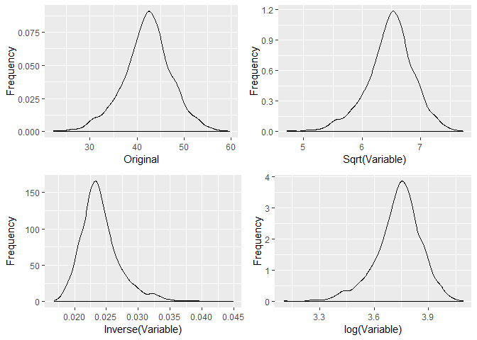
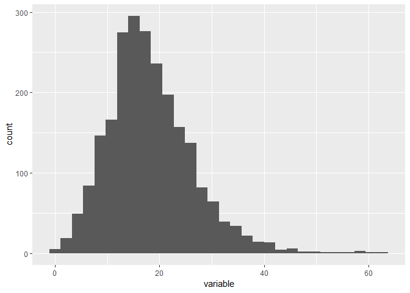
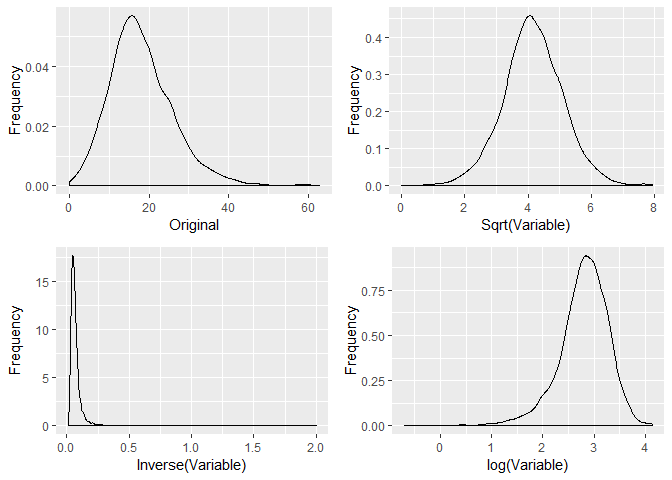
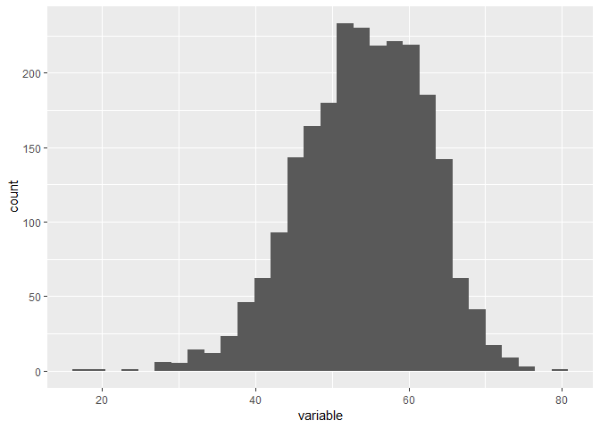

Data Exploration
================

Load the cancer registry data

``` r
cancer_data = read_csv(file = "./data/Cancer_Registry.csv") %>% 
  janitor::clean_names()
```

Obtain summary statistics for all variables

``` r
numerical = cancer_data%>%
  select(-c(binned_inc, geography))

Minimum = sapply(numerical, min, na.rm = 'TRUE')
Maximum = sapply(numerical, max, na.rm = 'TRUE')
Mean = sapply(numerical, mean, na.rm = 'TRUE')
Median = sapply(numerical, median, na.rm = 'TRUE')
SD = sapply(numerical, sd, na.rm = 'TRUE')
IQR = sapply(numerical, IQR, na.rm='TRUE')
Size = sapply(numerical, length)
Missing = sapply(numerical, function(x) sum(is.na(x)))

rbind(Minimum, Maximum, Mean, SD, Median, IQR, Size, Missing) %>%
  round(digits = 2)
```

    ##         avg_ann_count avg_deaths_per_year target_death_rate incidence_rate
    ## Minimum          6.00                3.00             59.70         201.30
    ## Maximum      38150.00            14010.00            362.80        1206.90
    ## Mean           606.34              185.97            178.66         448.27
    ## SD            1416.36              504.13             27.75          54.56
    ## Median         171.00               61.00            178.10         453.55
    ## IQR            442.00              121.00             34.00          60.55
    ## Size          3047.00             3047.00           3047.00        3047.00
    ## Missing          0.00                0.00              0.00           0.00
    ##         med_income pop_est2015 poverty_percent study_per_cap median_age
    ## Minimum   22640.00       827.0            3.20          0.00      22.30
    ## Maximum  125635.00  10170292.0           47.40       9762.31     624.00
    ## Mean      47063.28    102637.4           16.88        155.40      45.27
    ## SD        12040.09    329059.2            6.41        529.63      45.30
    ## Median    45207.00     26643.0           15.90          0.00      41.00
    ## IQR       13609.50     56987.0            8.25         83.65       6.30
    ## Size       3047.00      3047.0         3047.00       3047.00    3047.00
    ## Missing       0.00         0.0            0.00          0.00       0.00
    ##         median_age_male median_age_female avg_household_size
    ## Minimum           22.40             22.30               0.02
    ## Maximum           64.70             65.70               3.97
    ## Mean              39.57             42.15               2.48
    ## SD                 5.23              5.29               0.43
    ## Median            39.60             42.40               2.50
    ## IQR                6.15              6.20               0.26
    ## Size            3047.00           3047.00            3047.00
    ## Missing            0.00              0.00               0.00
    ##         percent_married pct_no_hs18_24 pct_hs18_24 pct_some_col18_24
    ## Minimum           23.10           0.00        0.00              7.10
    ## Maximum           72.50          64.10       72.50             79.00
    ## Mean              51.77          18.22       35.00             40.98
    ## SD                 6.90           8.09        9.07             11.12
    ## Median            52.40          17.10       34.70             40.40
    ## IQR                8.65           9.90       11.50             12.40
    ## Size            3047.00        3047.00     3047.00           3047.00
    ## Missing            0.00           0.00        0.00           2285.00
    ##         pct_bach_deg18_24 pct_hs25_over pct_bach_deg25_over
    ## Minimum              0.00          7.50                2.50
    ## Maximum             51.80         54.80               42.20
    ## Mean                 6.16         34.80               13.28
    ## SD                   4.53          7.03                5.39
    ## Median               5.40         35.30               12.30
    ## IQR                  5.10          9.25                6.70
    ## Size              3047.00       3047.00             3047.00
    ## Missing              0.00          0.00                0.00
    ##         pct_employed16_over pct_unemployed16_over pct_private_coverage
    ## Minimum               17.60                  0.40                22.30
    ## Maximum               80.10                 29.40                92.30
    ## Mean                  54.15                  7.85                64.35
    ## SD                     8.32                  3.45                10.65
    ## Median                54.50                  7.60                65.10
    ## IQR                   11.70                  4.20                14.90
    ## Size                3047.00               3047.00              3047.00
    ## Missing              152.00                  0.00                 0.00
    ##         pct_private_coverage_alone pct_emp_priv_coverage
    ## Minimum                      15.70                 13.50
    ## Maximum                      78.90                 70.70
    ## Mean                         48.45                 41.20
    ## SD                           10.08                  9.45
    ## Median                       48.70                 41.10
    ## IQR                          14.60                 13.20
    ## Size                       3047.00               3047.00
    ## Missing                     609.00                  0.00
    ##         pct_public_coverage pct_public_coverage_alone pct_white pct_black
    ## Minimum               11.20                      2.60     10.20      0.00
    ## Maximum               65.10                     46.60    100.00     85.95
    ## Mean                  36.25                     19.24     83.65      9.11
    ## SD                     7.84                      6.11     16.38     14.53
    ## Median                36.30                     18.80     90.06      2.25
    ## IQR                   10.65                      8.25     18.16      9.89
    ## Size                3047.00                   3047.00   3047.00   3047.00
    ## Missing                0.00                      0.00      0.00      0.00
    ##         pct_asian pct_other_race pct_married_households birth_rate
    ## Minimum      0.00           0.00                  22.99       0.00
    ## Maximum     42.62          41.93                  78.08      21.33
    ## Mean         1.25           1.98                  51.24       5.64
    ## SD           2.61           3.52                   6.57       1.99
    ## Median       0.55           0.83                  51.67       5.38
    ## IQR          0.97           1.88                   7.63       1.97
    ## Size      3047.00        3047.00                3047.00    3047.00
    ## Missing      0.00           0.00                   0.00       0.00

Note that: some\_college = 2285 out of 3047 missing values, employed = 152 out of 3047 missing values, and private\_coverage\_only = 609 out of 3047 missing values. Some college has too many missing values so it might be advisable not include it in the list of potential covariates

Create a separate dataset without the missing values

``` r
clean_cancer_data = cancer_data%>%
  select(-pct_some_col18_24)%>%
  na.omit()
```

Figure out if there are variables that are highly correlated/provide the same information

``` r
continuous_data = clean_cancer_data%>%
  select(-c(binned_inc, geography))

cor(continuous_data)%>%
  corrplot(method = "circle", diag=FALSE)
```


From literature review and preliminary discussions, we decided to remove binned\_inc, pct\_some\_col\_18\_24, median\_age, geography, avg\_eaths\_per\_year, and pop\_est\_2015 from the saturated model.

Now, lets observe the distributions of potential covariates and observe if transformations are needed

``` r
reduced_clean = clean_cancer_data%>%
  select(-c(binned_inc, geography, median_age, avg_deaths_per_year, pop_est2015))
```

Create a function that plots and performs tranformations on the variables

``` r
distribution = function(variable) {

  reduced_clean = tibble(variable)
  
  reduced_clean%>%
    ggplot(aes(variable))+
    geom_histogram()
}

inspection = function(variable) {

  reduced_clean = tibble(variable)

  #Observe transformations

  transformations = reduced_clean%>%
    dplyr::select(variable)%>%
    mutate(log_variable = log(variable),
          sqrt_variable = sqrt(variable),
          inverse_variable = 1 / variable)%>%
    gather(key = type, value = value)
  
  a = transformations%>%
    filter(type == "variable")%>%
    ggplot(aes(value))+
    geom_density()+
    labs(x = "Original",
        y = "Frequency")

  b = transformations%>%
    filter(type == "sqrt_variable")%>%
    ggplot(aes(value))+
    geom_density()+
    labs(x = "Sqrt(Variable)",
        y = "Frequency")

  c = transformations%>%
    filter(type == "inverse_variable")%>%
    ggplot(aes(value))+
    geom_density()+
    labs(x = "Inverse(Variable)",
        y = "Frequency")

  d = transformations%>%
    filter(type == "log_variable")%>%
    ggplot(aes(value))+
    geom_density()+
    labs(x = "log(Variable)",
        y = "Frequency")

  (a + b) / (c + d)
  
}
```

Average annual count has one extreme outlier, making the distribution of the points to be right skewed. Log tranformation most reduces the skewness

``` r
variable = reduced_clean$avg_ann_count

distribution(variable)
```


``` r
inspection(variable)
```


``` r
#perform a log tranformation
model_data = reduced_clean%>%
  mutate(log_avg_ann_count = log(avg_ann_count))
```

The distribution of incidence rate seems to be appropriately clustered, with a few outliers. Transformations result in similar shapes as the original

``` r
variable = reduced_clean$incidence_rate

distribution(variable)
```


``` r
inspection(variable)
```


Median income is slighly right skewed and the inverse transformation reduces most of the skewness. Transformation also may not be necessary in this case

``` r
variable = reduced_clean$med_income

distribution(variable)
```


``` r
inspection(variable)
```


``` r
#perform an inverse tranformation
model_data = model_data%>%
  mutate(inverse_med_income = 1/(med_income))
```

Poverty percent is slightly right skewed and the square root transformation reduces most of the skewness. Transformation also may not be necessary in this case

``` r
variable = reduced_clean$poverty_percent

distribution(variable)
```


``` r
inspection(variable)
```


``` r
#perform a square root tranformation
model_data = model_data%>%
  mutate(sqrt_poverty_rate = sqrt(poverty_percent))
```

Study per cap is highly right skewed and the log transformation reduces most of the skewness

``` r
variable = reduced_clean$study_per_cap

distribution(variable)
```


``` r
inspection(variable)
```


``` r
#perform a log tranformation
model_data = model_data%>%
  mutate(log_study_per_cap = log(study_per_cap))
```

Median age for males has an appropriate shape and does not need transformation

``` r
variable = reduced_clean$median_age_male

distribution(variable)
```


``` r
inspection(variable)
```


Median age for females has an appropriate shape and does not need transformation

``` r
variable = reduced_clean$median_age_female

distribution(variable)
```


``` r
inspection(variable)
```



Average household size has some unusual values. A majority of the points are clustured around 2.5 and there is a slight skewness to the right. However, there are some outliers to the left that are close to 0. None of the transformations are useful - the log transformation removes the slight right skewness but we still see a another bump to the left

``` r
variable = reduced_clean$avg_household_size

distribution(variable)
```


``` r
inspection(variable)
```


``` r
#Perform a log transformation
model_data = model_data%>%
  mutate(log_avg_household_size = log(avg_household_size))
```

Percent married is slightly left skewed but none of the transformation perform better, in terms of skewness

``` r
variable = reduced_clean$percent_married

distribution(variable)
```


``` r
inspection(variable)
```


pct\_no\_hs18\_24 is slightly right skewed and the square root transformation reduces most of the skewness. However, a transformation might not be necessary in this case

``` r
variable = reduced_clean$pct_no_hs18_24


distribution(variable)
```



``` r
inspection(variable)
```



``` r
#Perform a square root transformation
model_data = model_data%>%
  mutate(sqrt_pct_no_hs18_24 = sqrt(pct_no_hs18_24))
```

pct\_hs18\_24 is appropriately shaped

``` r
variable = reduced_clean$pct_hs18_24


distribution(variable)
```


``` r
inspection(variable)
```


################################################################################################## 

pct\_bach\_deg18\_24 is appropriately shaped

``` r
variable = reduced_clean$pct_bach_deg18_24


distribution(variable)
```


``` r
inspection(variable)
```


pct\_hs25\_over is appropriately shaped

``` r
variable = reduced_clean$pct_hs25_over


distribution(variable)
```


``` r
inspection(variable)
```


pct\_bach\_deg25\_over is appropriately shaped

``` r
variable = reduced_clean$pct_bach_deg25_over


distribution(variable)
```


``` r
inspection(variable)
```


pct\_employed16\_over is appropriately shaped

``` r
variable = reduced_clean$pct_employed16_over


distribution(variable)
```



``` r
inspection(variable)
```


pct\_unemployed16\_over is appropriately shaped

``` r
variable = reduced_clean$pct_unemployed16_over


distribution(variable)
```


``` r
inspection(variable)
```


pct\_private\_coverage is appropriately shaped

``` r
variable = reduced_clean$pct_private_coverage


distribution(variable)
```


``` r
inspection(variable)
```


pct\_private\_coverage\_alone is appropriately shaped

``` r
variable = reduced_clean$pct_private_coverage_alone


distribution(variable)
```


``` r
inspection(variable)
```


pct\_emp\_priv\_coverage is appropriately shaped

``` r
variable = reduced_clean$pct_emp_priv_coverage


distribution(variable)
```


``` r
inspection(variable)
```


pct\_public\_coverage is appropriately shaped

``` r
variable = reduced_clean$pct_public_coverage


distribution(variable)
```


``` r
inspection(variable)
```


pct\_public\_coverage\_alone is appropriately shaped

``` r
variable = reduced_clean$pct_public_coverage_alone


distribution(variable)
```


``` r
inspection(variable)
```


pct\_white is appropriately shaped

``` r
variable = reduced_clean$pct_white


distribution(variable)
```


``` r
inspection(variable)
```


pct\_black is appropriately shaped

``` r
variable = reduced_clean$pct_black


distribution(variable)
```


``` r
inspection(variable)
```


pct\_asian is appropriately shaped

``` r
variable = reduced_clean$pct_asian


distribution(variable)
```


``` r
inspection(variable)
```


pct\_other\_race is appropriately shaped

``` r
variable = reduced_clean$pct_other_race


distribution(variable)
```


``` r
inspection(variable)
```


pct\_married\_households is appropriately shaped

``` r
variable = reduced_clean$pct_married_households


distribution(variable)
```


``` r
inspection(variable)
```


birth\_rate is appropriately shaped

``` r
variable = reduced_clean$birth_rate


distribution(variable)
```


``` r
inspection(variable)
```


Create a full model (with all transformations, including questionable ones)

``` r
lm(target_death_rate ~ log_avg_ann_count, incidence_rate, inverse_med_income, sqrt_poverty_rate,
   log_study_per_cap, median_age_male, median_age_female, log_avg_household_size, percent_married,
   sqrt_pct_no_hs18_24, 
   data = model_data
```

Create a full model (with transformations, not including questionable ones)

``` r
lm(target_death_rate ~ log_avg_ann_count, incidence_rate, med_income, poverty_rate,
   log_study_per_cap, median_age_male, median_age_female, avg_household_size, percent_married,
   pct_no_hs18_24, 
   data = model_data
```
