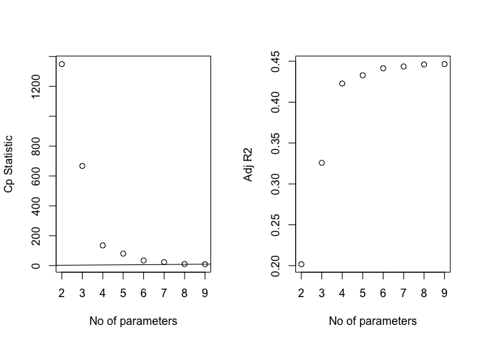

tian\_model\_selection
================

initial full model
==================

``` r
data = read_csv("./data/Cancer_Registry.csv") %>% 
  janitor::clean_names()
```

    ## Parsed with column specification:
    ## cols(
    ##   .default = col_double(),
    ##   avgDeathsPerYear = col_integer(),
    ##   medIncome = col_integer(),
    ##   popEst2015 = col_integer(),
    ##   binnedInc = col_character(),
    ##   Geography = col_character()
    ## )

    ## See spec(...) for full column specifications.

``` r
model_full_notrans =
  lm(target_death_rate ~ avg_ann_count + incidence_rate + med_income + poverty_percent + study_per_cap + median_age_male + median_age_female + avg_household_size + percent_married + pct_no_hs18_24 + pct_hs18_24 + pct_bach_deg18_24 + pct_hs25_over + pct_bach_deg25_over + pct_unemployed16_over + pct_emp_priv_coverage + pct_black + pct_asian + pct_other_race + pct_married_households + birth_rate, data = data) 
```

Transformation decision mainly based on "margaret\_eda.md" Full model variables exclude variables with high-linearity.

``` r
data_trans = data %>% 
  mutate(log_avg_ann_count = log(avg_ann_count)) %>% 
  mutate(study_per_cap = recode(study_per_cap, "0" = 0.001)) %>% #fix "-inf" problem
  mutate(log_study_per_cap = log(study_per_cap)) %>% 
  mutate(sqrt_pct_bach_deg18_24 = sqrt(pct_bach_deg18_24)) %>% 
  mutate(log_pct_bach_deg25_over = log(pct_bach_deg25_over)) %>% 
  mutate(sqrt_pct_unemployed16_over = sqrt(pct_unemployed16_over)) %>% 
  mutate(pct_asian = recode(pct_asian, "0" = 0.001)) %>% #fix "-inf" problem
  mutate(log_pct_asian = log(pct_asian)) %>% 
  mutate(pct_other_race = recode(pct_other_race, "0" = 0.001)) %>% #fix "-inf" problem
  mutate(log_pct_other_race = log(pct_other_race)) %>% 
  dplyr::select(target_death_rate, log_avg_ann_count, incidence_rate, med_income, poverty_percent,  log_study_per_cap, median_age_male, median_age_female, avg_household_size, percent_married, pct_no_hs18_24,  pct_hs18_24, sqrt_pct_bach_deg18_24, pct_hs25_over, log_pct_bach_deg25_over, sqrt_pct_unemployed16_over,  pct_emp_priv_coverage, pct_black, log_pct_asian, log_pct_other_race, pct_married_households, birth_rate)

model_full =
  lm(target_death_rate ~ log_avg_ann_count + incidence_rate + med_income + poverty_percent + log_study_per_cap + median_age_male + median_age_female + avg_household_size + percent_married + pct_no_hs18_24 + pct_hs18_24 + sqrt_pct_bach_deg18_24 + pct_hs25_over + log_pct_bach_deg25_over + sqrt_pct_unemployed16_over + pct_emp_priv_coverage + pct_black + log_pct_asian + log_pct_other_race + pct_married_households + birth_rate, data = data_trans) #21 variables
```

Method 1 stepwise
=================

without
-------

``` r
step(model_full_notrans, direction = 'backward')
```

    ## Start:  AIC=18138.03
    ## target_death_rate ~ avg_ann_count + incidence_rate + med_income + 
    ##     poverty_percent + study_per_cap + median_age_male + median_age_female + 
    ##     avg_household_size + percent_married + pct_no_hs18_24 + pct_hs18_24 + 
    ##     pct_bach_deg18_24 + pct_hs25_over + pct_bach_deg25_over + 
    ##     pct_unemployed16_over + pct_emp_priv_coverage + pct_black + 
    ##     pct_asian + pct_other_race + pct_married_households + birth_rate
    ## 
    ##                          Df Sum of Sq     RSS   AIC
    ## - pct_emp_priv_coverage   1         0 1155707 18136
    ## - study_per_cap           1        35 1155742 18136
    ## - pct_black               1       102 1155809 18136
    ## - median_age_female       1       169 1155876 18136
    ## - pct_no_hs18_24          1       266 1155973 18137
    ## - pct_asian               1       290 1155997 18137
    ## - pct_bach_deg18_24       1       330 1156038 18137
    ## - avg_household_size      1       639 1156346 18138
    ## <none>                                1155707 18138
    ## - med_income              1      1438 1157145 18140
    ## - avg_ann_count           1      1530 1157237 18140
    ## - median_age_male         1      1752 1157459 18141
    ## - pct_hs25_over           1      6641 1162348 18154
    ## - pct_unemployed16_over   1      8054 1163761 18157
    ## - percent_married         1     11647 1167354 18167
    ## - birth_rate              1     11656 1167363 18167
    ## - pct_other_race          1     14465 1170173 18174
    ## - poverty_percent         1     15257 1170965 18176
    ## - pct_hs18_24             1     15717 1171425 18177
    ## - pct_married_households  1     20198 1175905 18189
    ## - pct_bach_deg25_over     1     32165 1187872 18220
    ## - incidence_rate          1    271928 1427635 18780
    ## 
    ## Step:  AIC=18136.03
    ## target_death_rate ~ avg_ann_count + incidence_rate + med_income + 
    ##     poverty_percent + study_per_cap + median_age_male + median_age_female + 
    ##     avg_household_size + percent_married + pct_no_hs18_24 + pct_hs18_24 + 
    ##     pct_bach_deg18_24 + pct_hs25_over + pct_bach_deg25_over + 
    ##     pct_unemployed16_over + pct_black + pct_asian + pct_other_race + 
    ##     pct_married_households + birth_rate
    ## 
    ##                          Df Sum of Sq     RSS   AIC
    ## - study_per_cap           1        35 1155743 18134
    ## - pct_black               1       102 1155809 18134
    ## - median_age_female       1       169 1155877 18134
    ## - pct_no_hs18_24          1       278 1155986 18135
    ## - pct_asian               1       291 1155998 18135
    ## - pct_bach_deg18_24       1       331 1156039 18135
    ## - avg_household_size      1       646 1156354 18136
    ## <none>                                1155707 18136
    ## - avg_ann_count           1      1535 1157242 18138
    ## - med_income              1      1633 1157341 18138
    ## - median_age_male         1      1764 1157471 18139
    ## - pct_hs25_over           1      7177 1162885 18153
    ## - pct_unemployed16_over   1      8244 1163951 18156
    ## - percent_married         1     11814 1167522 18165
    ## - birth_rate              1     11856 1167564 18165
    ## - pct_other_race          1     14609 1170317 18172
    ## - poverty_percent         1     16138 1171846 18176
    ## - pct_hs18_24             1     16230 1171937 18176
    ## - pct_married_households  1     20331 1176039 18187
    ## - pct_bach_deg25_over     1     32242 1187949 18218
    ## - incidence_rate          1    276285 1431992 18787
    ## 
    ## Step:  AIC=18134.12
    ## target_death_rate ~ avg_ann_count + incidence_rate + med_income + 
    ##     poverty_percent + median_age_male + median_age_female + avg_household_size + 
    ##     percent_married + pct_no_hs18_24 + pct_hs18_24 + pct_bach_deg18_24 + 
    ##     pct_hs25_over + pct_bach_deg25_over + pct_unemployed16_over + 
    ##     pct_black + pct_asian + pct_other_race + pct_married_households + 
    ##     birth_rate
    ## 
    ##                          Df Sum of Sq     RSS   AIC
    ## - pct_black               1       106 1155849 18132
    ## - median_age_female       1       173 1155916 18133
    ## - pct_no_hs18_24          1       274 1156016 18133
    ## - pct_asian               1       288 1156031 18133
    ## - pct_bach_deg18_24       1       328 1156071 18133
    ## - avg_household_size      1       641 1156384 18134
    ## <none>                                1155743 18134
    ## - avg_ann_count           1      1553 1157296 18136
    ## - med_income              1      1669 1157412 18136
    ## - median_age_male         1      1752 1157495 18137
    ## - pct_hs25_over           1      7205 1162948 18151
    ## - pct_unemployed16_over   1      8248 1163990 18154
    ## - percent_married         1     11854 1167597 18163
    ## - birth_rate              1     11916 1167659 18163
    ## - pct_other_race          1     14587 1170330 18170
    ## - pct_hs18_24             1     16230 1171973 18175
    ## - poverty_percent         1     16301 1172043 18175
    ## - pct_married_households  1     20312 1176054 18185
    ## - pct_bach_deg25_over     1     32383 1188126 18216
    ## - incidence_rate          1    277179 1432922 18787
    ## 
    ## Step:  AIC=18132.4
    ## target_death_rate ~ avg_ann_count + incidence_rate + med_income + 
    ##     poverty_percent + median_age_male + median_age_female + avg_household_size + 
    ##     percent_married + pct_no_hs18_24 + pct_hs18_24 + pct_bach_deg18_24 + 
    ##     pct_hs25_over + pct_bach_deg25_over + pct_unemployed16_over + 
    ##     pct_asian + pct_other_race + pct_married_households + birth_rate
    ## 
    ##                          Df Sum of Sq     RSS   AIC
    ## - median_age_female       1       139 1155987 18131
    ## - pct_no_hs18_24          1       248 1156097 18131
    ## - pct_asian               1       260 1156109 18131
    ## - pct_bach_deg18_24       1       325 1156174 18131
    ## - avg_household_size      1       629 1156478 18132
    ## <none>                                1155849 18132
    ## - avg_ann_count           1      1546 1157395 18134
    ## - median_age_male         1      1908 1157756 18135
    ## - med_income              1      1910 1157759 18135
    ## - pct_hs25_over           1      7160 1163008 18149
    ## - pct_unemployed16_over   1      8547 1164396 18153
    ## - percent_married         1     11764 1167613 18161
    ## - birth_rate              1     11920 1167769 18162
    ## - pct_other_race          1     15034 1170883 18170
    ## - pct_hs18_24             1     16305 1172154 18173
    ## - poverty_percent         1     17397 1173246 18176
    ## - pct_married_households  1     20941 1176790 18185
    ## - pct_bach_deg25_over     1     32588 1188437 18215
    ## - incidence_rate          1    277711 1433560 18786
    ## 
    ## Step:  AIC=18130.77
    ## target_death_rate ~ avg_ann_count + incidence_rate + med_income + 
    ##     poverty_percent + median_age_male + avg_household_size + 
    ##     percent_married + pct_no_hs18_24 + pct_hs18_24 + pct_bach_deg18_24 + 
    ##     pct_hs25_over + pct_bach_deg25_over + pct_unemployed16_over + 
    ##     pct_asian + pct_other_race + pct_married_households + birth_rate
    ## 
    ##                          Df Sum of Sq     RSS   AIC
    ## - pct_asian               1       270 1156257 18130
    ## - pct_no_hs18_24          1       286 1156273 18130
    ## - pct_bach_deg18_24       1       324 1156311 18130
    ## - avg_household_size      1       717 1156704 18131
    ## <none>                                1155987 18131
    ## - avg_ann_count           1      1613 1157600 18133
    ## - med_income              1      1980 1157968 18134
    ## - pct_hs25_over           1      7161 1163148 18148
    ## - pct_unemployed16_over   1      8690 1164677 18152
    ## - birth_rate              1     11917 1167905 18160
    ## - percent_married         1     12072 1168060 18160
    ## - median_age_male         1     13321 1169308 18164
    ## - pct_other_race          1     14906 1170894 18168
    ## - pct_hs18_24             1     16218 1172205 18171
    ## - poverty_percent         1     17541 1173528 18175
    ## - pct_married_households  1     21062 1177049 18184
    ## - pct_bach_deg25_over     1     32481 1188469 18213
    ## - incidence_rate          1    278054 1434041 18786
    ## 
    ## Step:  AIC=18129.48
    ## target_death_rate ~ avg_ann_count + incidence_rate + med_income + 
    ##     poverty_percent + median_age_male + avg_household_size + 
    ##     percent_married + pct_no_hs18_24 + pct_hs18_24 + pct_bach_deg18_24 + 
    ##     pct_hs25_over + pct_bach_deg25_over + pct_unemployed16_over + 
    ##     pct_other_race + pct_married_households + birth_rate
    ## 
    ##                          Df Sum of Sq     RSS   AIC
    ## - pct_bach_deg18_24       1       291 1156549 18128
    ## - pct_no_hs18_24          1       332 1156590 18128
    ## - avg_household_size      1       733 1156991 18129
    ## <none>                                1156257 18130
    ## - avg_ann_count           1      1375 1157633 18131
    ## - med_income              1      2560 1158817 18134
    ## - pct_hs25_over           1      7035 1163292 18146
    ## - pct_unemployed16_over   1      8785 1165042 18150
    ## - birth_rate              1     12008 1168265 18159
    ## - percent_married         1     12008 1168266 18159
    ## - median_age_male         1     13375 1169633 18162
    ## - pct_other_race          1     14707 1170964 18166
    ## - pct_hs18_24             1     16295 1172553 18170
    ## - poverty_percent         1     18372 1174629 18176
    ## - pct_married_households  1     21322 1177579 18183
    ## - pct_bach_deg25_over     1     32373 1188630 18212
    ## - incidence_rate          1    277888 1434145 18784
    ## 
    ## Step:  AIC=18128.25
    ## target_death_rate ~ avg_ann_count + incidence_rate + med_income + 
    ##     poverty_percent + median_age_male + avg_household_size + 
    ##     percent_married + pct_no_hs18_24 + pct_hs18_24 + pct_hs25_over + 
    ##     pct_bach_deg25_over + pct_unemployed16_over + pct_other_race + 
    ##     pct_married_households + birth_rate
    ## 
    ##                          Df Sum of Sq     RSS   AIC
    ## - pct_no_hs18_24          1       226 1156775 18127
    ## - avg_household_size      1       733 1157282 18128
    ## <none>                                1156549 18128
    ## - avg_ann_count           1      1500 1158049 18130
    ## - med_income              1      2314 1158863 18132
    ## - pct_hs25_over           1      6795 1163344 18144
    ## - pct_unemployed16_over   1      9156 1165705 18150
    ## - percent_married         1     11775 1168324 18157
    ## - birth_rate              1     11814 1168363 18157
    ## - median_age_male         1     13759 1170308 18162
    ## - pct_other_race          1     14890 1171439 18165
    ## - poverty_percent         1     18130 1174679 18174
    ## - pct_hs18_24             1     18762 1175311 18175
    ## - pct_married_households  1     21071 1177620 18181
    ## - pct_bach_deg25_over     1     35090 1191639 18217
    ## - incidence_rate          1    277947 1434496 18782
    ## 
    ## Step:  AIC=18126.85
    ## target_death_rate ~ avg_ann_count + incidence_rate + med_income + 
    ##     poverty_percent + median_age_male + avg_household_size + 
    ##     percent_married + pct_hs18_24 + pct_hs25_over + pct_bach_deg25_over + 
    ##     pct_unemployed16_over + pct_other_race + pct_married_households + 
    ##     birth_rate
    ## 
    ##                          Df Sum of Sq     RSS   AIC
    ## - avg_household_size      1       704 1157480 18127
    ## <none>                                1156775 18127
    ## - avg_ann_count           1      1464 1158239 18129
    ## - med_income              1      2200 1158975 18131
    ## - pct_hs25_over           1      6832 1163607 18143
    ## - pct_unemployed16_over   1      9137 1165912 18149
    ## - percent_married         1     11754 1168529 18156
    ## - birth_rate              1     12246 1169021 18157
    ## - median_age_male         1     14722 1171497 18163
    ## - pct_other_race          1     15554 1172330 18166
    ## - poverty_percent         1     17952 1174728 18172
    ## - pct_hs18_24             1     19557 1176332 18176
    ## - pct_married_households  1     21313 1178089 18180
    ## - pct_bach_deg25_over     1     35422 1192197 18217
    ## - incidence_rate          1    284856 1441631 18796
    ## 
    ## Step:  AIC=18126.7
    ## target_death_rate ~ avg_ann_count + incidence_rate + med_income + 
    ##     poverty_percent + median_age_male + percent_married + pct_hs18_24 + 
    ##     pct_hs25_over + pct_bach_deg25_over + pct_unemployed16_over + 
    ##     pct_other_race + pct_married_households + birth_rate
    ## 
    ##                          Df Sum of Sq     RSS   AIC
    ## <none>                                1157480 18127
    ## - avg_ann_count           1      1403 1158883 18128
    ## - med_income              1      2433 1159913 18131
    ## - pct_hs25_over           1      6719 1164198 18142
    ## - pct_unemployed16_over   1      9660 1167139 18150
    ## - percent_married         1     11207 1168687 18154
    ## - birth_rate              1     12017 1169497 18156
    ## - pct_other_race          1     15069 1172548 18164
    ## - median_age_male         1     16459 1173938 18168
    ## - poverty_percent         1     18562 1176042 18173
    ## - pct_hs18_24             1     20313 1177793 18178
    ## - pct_married_households  1     20634 1178114 18178
    ## - pct_bach_deg25_over     1     35635 1193115 18217
    ## - incidence_rate          1    284429 1441908 18794

    ## 
    ## Call:
    ## lm(formula = target_death_rate ~ avg_ann_count + incidence_rate + 
    ##     med_income + poverty_percent + median_age_male + percent_married + 
    ##     pct_hs18_24 + pct_hs25_over + pct_bach_deg25_over + pct_unemployed16_over + 
    ##     pct_other_race + pct_married_households + birth_rate, data = data)
    ## 
    ## Coefficients:
    ##            (Intercept)           avg_ann_count          incidence_rate  
    ##             98.6453520              -0.0005335               0.1901969  
    ##             med_income         poverty_percent         median_age_male  
    ##              0.0001697               0.9205627              -0.6083708  
    ##        percent_married             pct_hs18_24           pct_hs25_over  
    ##              0.7733015               0.3314931               0.3852064  
    ##    pct_bach_deg25_over   pct_unemployed16_over          pct_other_race  
    ##             -1.3690069               0.7454120              -0.7280352  
    ## pct_married_households              birth_rate  
    ##             -0.9690061              -1.0612396

with transformation
-------------------

``` r
step(model_full, direction = 'backward')
```

    ## Start:  AIC=18159.67
    ## target_death_rate ~ log_avg_ann_count + incidence_rate + med_income + 
    ##     poverty_percent + log_study_per_cap + median_age_male + median_age_female + 
    ##     avg_household_size + percent_married + pct_no_hs18_24 + pct_hs18_24 + 
    ##     sqrt_pct_bach_deg18_24 + pct_hs25_over + log_pct_bach_deg25_over + 
    ##     sqrt_pct_unemployed16_over + pct_emp_priv_coverage + pct_black + 
    ##     log_pct_asian + log_pct_other_race + pct_married_households + 
    ##     birth_rate
    ## 
    ##                              Df Sum of Sq     RSS   AIC
    ## - median_age_female           1        13 1163958 18158
    ## - log_pct_asian               1        36 1163981 18158
    ## - med_income                  1        42 1163987 18158
    ## - log_study_per_cap           1        86 1164031 18158
    ## - pct_emp_priv_coverage       1       117 1164062 18158
    ## - avg_household_size          1       501 1164446 18159
    ## - pct_black                   1       753 1164698 18160
    ## <none>                                    1163945 18160
    ## - pct_no_hs18_24              1       982 1164927 18160
    ## - log_avg_ann_count           1      1103 1165048 18161
    ## - sqrt_pct_bach_deg18_24      1      1457 1165402 18162
    ## - log_pct_other_race          1      2143 1166089 18163
    ## - median_age_male             1      2561 1166507 18164
    ## - poverty_percent             1      7763 1171708 18178
    ## - birth_rate                  1      9706 1173651 18183
    ## - pct_hs18_24                 1     12303 1176248 18190
    ## - pct_hs25_over               1     12498 1176443 18190
    ## - percent_married             1     13603 1177548 18193
    ## - sqrt_pct_unemployed16_over  1     13836 1177781 18194
    ## - pct_married_households      1     21763 1185708 18214
    ## - log_pct_bach_deg25_over     1     24745 1188690 18222
    ## - incidence_rate              1    276426 1440371 18807
    ## 
    ## Step:  AIC=18157.71
    ## target_death_rate ~ log_avg_ann_count + incidence_rate + med_income + 
    ##     poverty_percent + log_study_per_cap + median_age_male + avg_household_size + 
    ##     percent_married + pct_no_hs18_24 + pct_hs18_24 + sqrt_pct_bach_deg18_24 + 
    ##     pct_hs25_over + log_pct_bach_deg25_over + sqrt_pct_unemployed16_over + 
    ##     pct_emp_priv_coverage + pct_black + log_pct_asian + log_pct_other_race + 
    ##     pct_married_households + birth_rate
    ## 
    ##                              Df Sum of Sq     RSS   AIC
    ## - log_pct_asian               1        35 1163993 18156
    ## - med_income                  1        45 1164003 18156
    ## - log_study_per_cap           1        88 1164046 18156
    ## - pct_emp_priv_coverage       1       126 1164084 18156
    ## - avg_household_size          1       532 1164490 18157
    ## - pct_black                   1       741 1164699 18158
    ## <none>                                    1163958 18158
    ## - pct_no_hs18_24              1       996 1164954 18158
    ## - log_avg_ann_count           1      1130 1165088 18159
    ## - sqrt_pct_bach_deg18_24      1      1450 1165408 18160
    ## - log_pct_other_race          1      2142 1166100 18161
    ## - poverty_percent             1      7853 1171811 18176
    ## - birth_rate                  1      9699 1173657 18181
    ## - median_age_male             1     12005 1175963 18187
    ## - pct_hs18_24                 1     12296 1176254 18188
    ## - pct_hs25_over               1     12491 1176449 18188
    ## - percent_married             1     13734 1177692 18191
    ## - sqrt_pct_unemployed16_over  1     14095 1178053 18192
    ## - pct_married_households      1     21900 1185858 18212
    ## - log_pct_bach_deg25_over     1     24732 1188690 18220
    ## - incidence_rate              1    276618 1440577 18805
    ## 
    ## Step:  AIC=18155.8
    ## target_death_rate ~ log_avg_ann_count + incidence_rate + med_income + 
    ##     poverty_percent + log_study_per_cap + median_age_male + avg_household_size + 
    ##     percent_married + pct_no_hs18_24 + pct_hs18_24 + sqrt_pct_bach_deg18_24 + 
    ##     pct_hs25_over + log_pct_bach_deg25_over + sqrt_pct_unemployed16_over + 
    ##     pct_emp_priv_coverage + pct_black + log_pct_other_race + 
    ##     pct_married_households + birth_rate
    ## 
    ##                              Df Sum of Sq     RSS   AIC
    ## - med_income                  1        49 1164042 18154
    ## - log_study_per_cap           1        84 1164077 18154
    ## - pct_emp_priv_coverage       1       126 1164119 18154
    ## - avg_household_size          1       522 1164515 18155
    ## - pct_black                   1       715 1164709 18156
    ## <none>                                    1163993 18156
    ## - pct_no_hs18_24              1      1008 1165001 18156
    ## - log_avg_ann_count           1      1097 1165090 18157
    ## - sqrt_pct_bach_deg18_24      1      1429 1165422 18158
    ## - log_pct_other_race          1      2108 1166101 18159
    ## - poverty_percent             1      7826 1171819 18174
    ## - birth_rate                  1      9688 1173681 18179
    ## - median_age_male             1     12174 1176168 18186
    ## - pct_hs18_24                 1     12349 1176342 18186
    ## - pct_hs25_over               1     12465 1176459 18186
    ## - percent_married             1     13783 1177776 18190
    ## - sqrt_pct_unemployed16_over  1     14462 1178455 18191
    ## - pct_married_households      1     21868 1185861 18210
    ## - log_pct_bach_deg25_over     1     24860 1188853 18218
    ## - incidence_rate              1    276868 1440861 18804
    ## 
    ## Step:  AIC=18153.93
    ## target_death_rate ~ log_avg_ann_count + incidence_rate + poverty_percent + 
    ##     log_study_per_cap + median_age_male + avg_household_size + 
    ##     percent_married + pct_no_hs18_24 + pct_hs18_24 + sqrt_pct_bach_deg18_24 + 
    ##     pct_hs25_over + log_pct_bach_deg25_over + sqrt_pct_unemployed16_over + 
    ##     pct_emp_priv_coverage + pct_black + log_pct_other_race + 
    ##     pct_married_households + birth_rate
    ## 
    ##                              Df Sum of Sq     RSS   AIC
    ## - log_study_per_cap           1        88 1164130 18152
    ## - pct_emp_priv_coverage       1       229 1164271 18152
    ## - avg_household_size          1       568 1164610 18153
    ## <none>                                    1164042 18154
    ## - pct_black                   1       788 1164830 18154
    ## - pct_no_hs18_24              1       963 1165005 18154
    ## - log_avg_ann_count           1      1103 1165145 18155
    ## - sqrt_pct_bach_deg18_24      1      1382 1165424 18156
    ## - log_pct_other_race          1      2091 1166133 18157
    ## - poverty_percent             1      9489 1173531 18177
    ## - birth_rate                  1      9640 1173682 18177
    ## - median_age_male             1     12137 1176179 18184
    ## - pct_hs18_24                 1     13083 1177125 18186
    ## - pct_hs25_over               1     13637 1177679 18187
    ## - percent_married             1     13955 1177997 18188
    ## - sqrt_pct_unemployed16_over  1     14732 1178774 18190
    ## - pct_married_households      1     22811 1186853 18211
    ## - log_pct_bach_deg25_over     1     24893 1188935 18216
    ## - incidence_rate              1    277300 1441342 18803
    ## 
    ## Step:  AIC=18152.16
    ## target_death_rate ~ log_avg_ann_count + incidence_rate + poverty_percent + 
    ##     median_age_male + avg_household_size + percent_married + 
    ##     pct_no_hs18_24 + pct_hs18_24 + sqrt_pct_bach_deg18_24 + pct_hs25_over + 
    ##     log_pct_bach_deg25_over + sqrt_pct_unemployed16_over + pct_emp_priv_coverage + 
    ##     pct_black + log_pct_other_race + pct_married_households + 
    ##     birth_rate
    ## 
    ##                              Df Sum of Sq     RSS   AIC
    ## - pct_emp_priv_coverage       1       208 1164338 18151
    ## - avg_household_size          1       570 1164700 18152
    ## <none>                                    1164130 18152
    ## - pct_black                   1       826 1164956 18152
    ## - pct_no_hs18_24              1       944 1165074 18153
    ## - sqrt_pct_bach_deg18_24      1      1405 1165535 18154
    ## - log_avg_ann_count           1      1407 1165538 18154
    ## - log_pct_other_race          1      2098 1166228 18156
    ## - poverty_percent             1      9455 1173585 18175
    ## - birth_rate                  1      9595 1173725 18175
    ## - median_age_male             1     12099 1176229 18182
    ## - pct_hs18_24                 1     13089 1177219 18184
    ## - pct_hs25_over               1     13747 1177877 18186
    ## - percent_married             1     14000 1178131 18187
    ## - sqrt_pct_unemployed16_over  1     14644 1178774 18188
    ## - pct_married_households      1     22730 1186860 18209
    ## - log_pct_bach_deg25_over     1     25482 1189613 18216
    ## - incidence_rate              1    277242 1441372 18801
    ## 
    ## Step:  AIC=18150.7
    ## target_death_rate ~ log_avg_ann_count + incidence_rate + poverty_percent + 
    ##     median_age_male + avg_household_size + percent_married + 
    ##     pct_no_hs18_24 + pct_hs18_24 + sqrt_pct_bach_deg18_24 + pct_hs25_over + 
    ##     log_pct_bach_deg25_over + sqrt_pct_unemployed16_over + pct_black + 
    ##     log_pct_other_race + pct_married_households + birth_rate
    ## 
    ##                              Df Sum of Sq     RSS   AIC
    ## - avg_household_size          1       537 1164876 18150
    ## <none>                                    1164338 18151
    ## - pct_black                   1       889 1165227 18151
    ## - pct_no_hs18_24              1      1154 1165492 18152
    ## - log_avg_ann_count           1      1272 1165610 18152
    ## - sqrt_pct_bach_deg18_24      1      1300 1165638 18152
    ## - log_pct_other_race          1      2224 1166562 18154
    ## - birth_rate                  1     10066 1174404 18175
    ## - poverty_percent             1     10821 1175159 18177
    ## - pct_hs18_24                 1     12889 1177227 18182
    ## - percent_married             1     13895 1178233 18185
    ## - sqrt_pct_unemployed16_over  1     14437 1178775 18186
    ## - pct_hs25_over               1     14804 1179142 18187
    ## - median_age_male             1     15088 1179426 18188
    ## - pct_married_households      1     22851 1187189 18208
    ## - log_pct_bach_deg25_over     1     25282 1189620 18214
    ## - incidence_rate              1    282957 1447295 18812
    ## 
    ## Step:  AIC=18150.11
    ## target_death_rate ~ log_avg_ann_count + incidence_rate + poverty_percent + 
    ##     median_age_male + percent_married + pct_no_hs18_24 + pct_hs18_24 + 
    ##     sqrt_pct_bach_deg18_24 + pct_hs25_over + log_pct_bach_deg25_over + 
    ##     sqrt_pct_unemployed16_over + pct_black + log_pct_other_race + 
    ##     pct_married_households + birth_rate
    ## 
    ##                              Df Sum of Sq     RSS   AIC
    ## <none>                                    1164876 18150
    ## - pct_black                   1       841 1165717 18150
    ## - pct_no_hs18_24              1      1057 1165932 18151
    ## - sqrt_pct_bach_deg18_24      1      1255 1166131 18151
    ## - log_avg_ann_count           1      1258 1166134 18151
    ## - log_pct_other_race          1      2159 1167035 18154
    ## - birth_rate                  1      9865 1174740 18174
    ## - poverty_percent             1     10966 1175842 18177
    ## - percent_married             1     13373 1178248 18183
    ## - pct_hs18_24                 1     13610 1178485 18184
    ## - pct_hs25_over               1     14516 1179391 18186
    ## - sqrt_pct_unemployed16_over  1     15001 1179876 18187
    ## - median_age_male             1     16927 1181802 18192
    ## - pct_married_households      1     22521 1187397 18206
    ## - log_pct_bach_deg25_over     1     25226 1190102 18213
    ## - incidence_rate              1    282673 1447549 18810

    ## 
    ## Call:
    ## lm(formula = target_death_rate ~ log_avg_ann_count + incidence_rate + 
    ##     poverty_percent + median_age_male + percent_married + pct_no_hs18_24 + 
    ##     pct_hs18_24 + sqrt_pct_bach_deg18_24 + pct_hs25_over + log_pct_bach_deg25_over + 
    ##     sqrt_pct_unemployed16_over + pct_black + log_pct_other_race + 
    ##     pct_married_households + birth_rate, data = data_trans)
    ## 
    ## Coefficients:
    ##                (Intercept)           log_avg_ann_count  
    ##                  118.97526                    -0.58359  
    ##             incidence_rate             poverty_percent  
    ##                    0.19633                     0.58455  
    ##            median_age_male             percent_married  
    ##                   -0.62607                     0.83105  
    ##             pct_no_hs18_24                 pct_hs18_24  
    ##                   -0.08724                     0.28162  
    ##     sqrt_pct_bach_deg18_24               pct_hs25_over  
    ##                   -0.92358                     0.52681  
    ##    log_pct_bach_deg25_over  sqrt_pct_unemployed16_over  
    ##                  -14.91959                     5.22124  
    ##                  pct_black          log_pct_other_race  
    ##                    0.04781                    -0.50749  
    ##     pct_married_households                  birth_rate  
    ##                   -0.97287                    -0.96956

``` r
data_15 = data_trans %>% 
   dplyr::select(target_death_rate, log_avg_ann_count, incidence_rate, poverty_percent, median_age_male, percent_married, pct_no_hs18_24,  pct_hs18_24, sqrt_pct_bach_deg18_24, pct_hs25_over, log_pct_bach_deg25_over, sqrt_pct_unemployed16_over, pct_black, log_pct_other_race, pct_married_households, birth_rate)

model_step = lm(formula = target_death_rate ~ log_avg_ann_count + incidence_rate + poverty_percent + median_age_male + percent_married + pct_no_hs18_24 + pct_hs18_24 + sqrt_pct_bach_deg18_24 + pct_hs25_over + log_pct_bach_deg25_over + sqrt_pct_unemployed16_over + pct_black + log_pct_other_race + pct_married_households + birth_rate, data = data_15)
summary(model_step) 
```

    ## 
    ## Call:
    ## lm(formula = target_death_rate ~ log_avg_ann_count + incidence_rate + 
    ##     poverty_percent + median_age_male + percent_married + pct_no_hs18_24 + 
    ##     pct_hs18_24 + sqrt_pct_bach_deg18_24 + pct_hs25_over + log_pct_bach_deg25_over + 
    ##     sqrt_pct_unemployed16_over + pct_black + log_pct_other_race + 
    ##     pct_married_households + birth_rate, data = data_15)
    ## 
    ## Residuals:
    ##      Min       1Q   Median       3Q      Max 
    ## -108.177  -11.107    0.042   10.900  137.170 
    ## 
    ## Coefficients:
    ##                              Estimate Std. Error t value Pr(>|t|)    
    ## (Intercept)                118.975260  11.701380  10.168  < 2e-16 ***
    ## log_avg_ann_count           -0.583587   0.322505  -1.810   0.0705 .  
    ## incidence_rate               0.196329   0.007239  27.120  < 2e-16 ***
    ## poverty_percent              0.584552   0.109432   5.342 9.89e-08 ***
    ## median_age_male             -0.626067   0.094337  -6.637 3.79e-11 ***
    ## percent_married              0.831046   0.140883   5.899 4.06e-09 ***
    ## pct_no_hs18_24              -0.087241   0.052613  -1.658   0.0974 .  
    ## pct_hs18_24                  0.281616   0.047323   5.951 2.97e-09 ***
    ## sqrt_pct_bach_deg18_24      -0.923579   0.511009  -1.807   0.0708 .  
    ## pct_hs25_over                0.526806   0.085719   6.146 9.00e-10 ***
    ## log_pct_bach_deg25_over    -14.919586   1.841532  -8.102 7.77e-16 ***
    ## sqrt_pct_unemployed16_over   5.221240   0.835731   6.248 4.75e-10 ***
    ## pct_black                    0.047811   0.032320   1.479   0.1392    
    ## log_pct_other_race          -0.507487   0.214112  -2.370   0.0178 *  
    ## pct_married_households      -0.972872   0.127088  -7.655 2.58e-14 ***
    ## birth_rate                  -0.969558   0.191369  -5.066 4.30e-07 ***
    ## ---
    ## Signif. codes:  0 '***' 0.001 '**' 0.01 '*' 0.05 '.' 0.1 ' ' 1
    ## 
    ## Residual standard error: 19.6 on 3031 degrees of freedom
    ## Multiple R-squared:  0.5034, Adjusted R-squared:  0.501 
    ## F-statistic: 204.9 on 15 and 3031 DF,  p-value: < 2.2e-16

delete some variables based on p-value?

``` r
data_11 = data_15 %>% 
  dplyr::select(-log_avg_ann_count, -pct_no_hs18_24, -sqrt_pct_bach_deg18_24, -pct_black)

model_11 = lm(formula = target_death_rate ~  incidence_rate + poverty_percent + median_age_male + percent_married + pct_hs18_24 + pct_hs25_over + log_pct_bach_deg25_over + sqrt_pct_unemployed16_over + log_pct_other_race + pct_married_households + birth_rate, data = data_11)
summary(model_11) 
```

    ## 
    ## Call:
    ## lm(formula = target_death_rate ~ incidence_rate + poverty_percent + 
    ##     median_age_male + percent_married + pct_hs18_24 + pct_hs25_over + 
    ##     log_pct_bach_deg25_over + sqrt_pct_unemployed16_over + log_pct_other_race + 
    ##     pct_married_households + birth_rate, data = data_11)
    ## 
    ## Residuals:
    ##      Min       1Q   Median       3Q      Max 
    ## -105.274  -11.026   -0.056   10.765  138.721 
    ## 
    ## Coefficients:
    ##                              Estimate Std. Error t value Pr(>|t|)    
    ## (Intercept)                113.831602  11.367452  10.014  < 2e-16 ***
    ## incidence_rate               0.193836   0.006907  28.065  < 2e-16 ***
    ## poverty_percent              0.663701   0.104534   6.349 2.49e-10 ***
    ## median_age_male             -0.621618   0.092936  -6.689 2.67e-11 ***
    ## percent_married              0.785063   0.138424   5.671 1.55e-08 ***
    ## pct_hs18_24                  0.317795   0.045574   6.973 3.79e-12 ***
    ## pct_hs25_over                0.524969   0.085561   6.136 9.58e-10 ***
    ## log_pct_bach_deg25_over    -15.439952   1.764078  -8.752  < 2e-16 ***
    ## sqrt_pct_unemployed16_over   5.041357   0.804351   6.268 4.19e-10 ***
    ## log_pct_other_race          -0.627083   0.208038  -3.014   0.0026 ** 
    ## pct_married_households      -0.950238   0.125658  -7.562 5.22e-14 ***
    ## birth_rate                  -0.947401   0.189605  -4.997 6.16e-07 ***
    ## ---
    ## Signif. codes:  0 '***' 0.001 '**' 0.01 '*' 0.05 '.' 0.1 ' ' 1
    ## 
    ## Residual standard error: 19.63 on 3035 degrees of freedom
    ## Multiple R-squared:  0.5017, Adjusted R-squared:  0.4999 
    ## F-statistic: 277.8 on 11 and 3035 DF,  p-value: < 2.2e-16

delete some variables based on high correlation?

``` r
cor(data_11)
```

    ##                            target_death_rate incidence_rate
    ## target_death_rate                 1.00000000    0.449431698
    ## incidence_rate                    0.44943170    1.000000000
    ## poverty_percent                   0.42938898    0.009046252
    ## median_age_male                  -0.02192943   -0.014733235
    ## percent_married                  -0.26682046   -0.119524484
    ## pct_hs18_24                       0.26197594    0.022643795
    ## pct_hs25_over                     0.40458908    0.121724595
    ## log_pct_bach_deg25_over          -0.49618949   -0.038193646
    ## sqrt_pct_unemployed16_over        0.38537952    0.115363969
    ## log_pct_other_race               -0.17071138   -0.139506250
    ## pct_married_households           -0.29332534   -0.152176321
    ## birth_rate                       -0.08740697   -0.118181288
    ##                            poverty_percent median_age_male percent_married
    ## target_death_rate              0.429388980     -0.02192943      -0.2668205
    ## incidence_rate                 0.009046252     -0.01473323      -0.1195245
    ## poverty_percent                1.000000000     -0.21400105      -0.6428569
    ## median_age_male               -0.214001049      1.00000000       0.4499862
    ## percent_married               -0.642856868      0.44998617       1.0000000
    ## pct_hs18_24                    0.094211082      0.24130993       0.1327924
    ## pct_hs25_over                  0.194361157      0.31827705       0.1024337
    ## log_pct_bach_deg25_over       -0.579157162     -0.10338157       0.1453835
    ## sqrt_pct_unemployed16_over     0.630315059     -0.15087925      -0.5508687
    ## log_pct_other_race            -0.017299678     -0.34980245      -0.1691276
    ## pct_married_households        -0.604952784      0.22227774       0.8702605
    ## birth_rate                    -0.012282511     -0.10410516       0.1414039
    ##                            pct_hs18_24 pct_hs25_over
    ## target_death_rate           0.26197594    0.40458908
    ## incidence_rate              0.02264379    0.12172459
    ## poverty_percent             0.09421108    0.19436116
    ## median_age_male             0.24130993    0.31827705
    ## percent_married             0.13279244    0.10243370
    ## pct_hs18_24                 1.00000000    0.43892915
    ## pct_hs25_over               0.43892915    1.00000000
    ## log_pct_bach_deg25_over    -0.40335179   -0.70434687
    ## sqrt_pct_unemployed16_over  0.13824978    0.08396862
    ## log_pct_other_race         -0.11291772   -0.37772181
    ## pct_married_households      0.12004023    0.06217592
    ## birth_rate                  0.05822688    0.01660026
    ##                            log_pct_bach_deg25_over
    ## target_death_rate                      -0.49618949
    ## incidence_rate                         -0.03819365
    ## poverty_percent                        -0.57915716
    ## median_age_male                        -0.10338157
    ## percent_married                         0.14538352
    ## pct_hs18_24                            -0.40335179
    ## pct_hs25_over                          -0.70434687
    ## log_pct_bach_deg25_over                 1.00000000
    ## sqrt_pct_unemployed16_over             -0.40468473
    ## log_pct_other_race                      0.18598752
    ## pct_married_households                  0.11732396
    ## birth_rate                             -0.06056536
    ##                            sqrt_pct_unemployed16_over log_pct_other_race
    ## target_death_rate                          0.38537952        -0.17071138
    ## incidence_rate                             0.11536397        -0.13950625
    ## poverty_percent                            0.63031506        -0.01729968
    ## median_age_male                           -0.15087925        -0.34980245
    ## percent_married                           -0.55086867        -0.16912764
    ## pct_hs18_24                                0.13824978        -0.11291772
    ## pct_hs25_over                              0.08396862        -0.37772181
    ## log_pct_bach_deg25_over                   -0.40468473         0.18598752
    ## sqrt_pct_unemployed16_over                 1.00000000         0.08746980
    ## log_pct_other_race                         0.08746980         1.00000000
    ## pct_married_households                    -0.45744386        -0.06128926
    ## birth_rate                                -0.10384003        -0.01513016
    ##                            pct_married_households  birth_rate
    ## target_death_rate                     -0.29332534 -0.08740697
    ## incidence_rate                        -0.15217632 -0.11818129
    ## poverty_percent                       -0.60495278 -0.01228251
    ## median_age_male                        0.22227774 -0.10410516
    ## percent_married                        0.87026054  0.14140393
    ## pct_hs18_24                            0.12004023  0.05822688
    ## pct_hs25_over                          0.06217592  0.01660026
    ## log_pct_bach_deg25_over                0.11732396 -0.06056536
    ## sqrt_pct_unemployed16_over            -0.45744386 -0.10384003
    ## log_pct_other_race                    -0.06128926 -0.01513016
    ## pct_married_households                 1.00000000  0.10226330
    ## birth_rate                             0.10226330  1.00000000

cov(pct\_married\_households, percent\_married) = 0.8702605 cov(log\_pct\_bach\_deg25\_over, pct\_hs25\_over) = -0.70434687
cov(poverty\_percent, percent\_married) = -0.6428569 cov(poverty\_percent, sqrt\_pct\_unemployed16\_over) = 0.630315059

``` r
data_8 = data_11 %>% 
  dplyr::select(-pct_married_households, -log_pct_bach_deg25_over, -poverty_percent)

model_8 = lm(formula = target_death_rate ~  incidence_rate + median_age_male + percent_married + pct_hs18_24 + pct_hs25_over + sqrt_pct_unemployed16_over + log_pct_other_race + birth_rate, data = data_8)
summary(model_8) 
```

    ## 
    ## Call:
    ## lm(formula = target_death_rate ~ incidence_rate + median_age_male + 
    ##     percent_married + pct_hs18_24 + pct_hs25_over + sqrt_pct_unemployed16_over + 
    ##     log_pct_other_race + birth_rate, data = data_8)
    ## 
    ## Residuals:
    ##      Min       1Q   Median       3Q      Max 
    ## -108.195  -12.018   -1.305   10.873  142.002 
    ## 
    ## Coefficients:
    ##                             Estimate Std. Error t value Pr(>|t|)    
    ## (Intercept)                57.423415   6.231530   9.215  < 2e-16 ***
    ## incidence_rate              0.181437   0.007078  25.634  < 2e-16 ***
    ## median_age_male            -0.421357   0.089194  -4.724 2.42e-06 ***
    ## percent_married            -0.464676   0.074574  -6.231 5.27e-10 ***
    ## pct_hs18_24                 0.359442   0.047540   7.561 5.27e-14 ***
    ## pct_hs25_over               1.203735   0.064785  18.580  < 2e-16 ***
    ## sqrt_pct_unemployed16_over 10.189788   0.748319  13.617  < 2e-16 ***
    ## log_pct_other_race         -0.848812   0.216463  -3.921 9.00e-05 ***
    ## birth_rate                 -0.365919   0.196008  -1.867    0.062 .  
    ## ---
    ## Signif. codes:  0 '***' 0.001 '**' 0.01 '*' 0.05 '.' 0.1 ' ' 1
    ## 
    ## Residual standard error: 20.64 on 3038 degrees of freedom
    ## Multiple R-squared:  0.448,  Adjusted R-squared:  0.4466 
    ## F-statistic: 308.3 on 8 and 3038 DF,  p-value: < 2.2e-16

Method 2 criterion-based (&gt;8?)
=================================

``` r
data_trans = as.data.frame(data_trans)
# Leaps function provides all-subsets analysis
# Printing the 2 best models of each size, using the Cp criterion:
leaps(x = data_trans[,2:9], y = data_trans[,1], nbest = 2, method = "Cp")
```

    ## $which
    ##       1     2     3     4     5     6     7     8
    ## 1 FALSE  TRUE FALSE FALSE FALSE FALSE FALSE FALSE
    ## 1 FALSE FALSE FALSE  TRUE FALSE FALSE FALSE FALSE
    ## 2 FALSE  TRUE  TRUE FALSE FALSE FALSE FALSE FALSE
    ## 2 FALSE  TRUE FALSE  TRUE FALSE FALSE FALSE FALSE
    ## 3 FALSE  TRUE  TRUE  TRUE FALSE FALSE FALSE FALSE
    ## 3  TRUE  TRUE FALSE  TRUE FALSE FALSE FALSE FALSE
    ## 4 FALSE  TRUE  TRUE  TRUE  TRUE FALSE FALSE FALSE
    ## 4  TRUE  TRUE  TRUE  TRUE FALSE FALSE FALSE FALSE
    ## 5  TRUE  TRUE  TRUE  TRUE  TRUE FALSE FALSE FALSE
    ## 5 FALSE  TRUE  TRUE  TRUE  TRUE FALSE FALSE  TRUE
    ## 6  TRUE  TRUE  TRUE  TRUE  TRUE FALSE FALSE  TRUE
    ## 6  TRUE  TRUE  TRUE  TRUE  TRUE  TRUE FALSE FALSE
    ## 7  TRUE  TRUE  TRUE  TRUE  TRUE FALSE  TRUE  TRUE
    ## 7  TRUE  TRUE  TRUE  TRUE  TRUE  TRUE FALSE  TRUE
    ## 8  TRUE  TRUE  TRUE  TRUE  TRUE  TRUE  TRUE  TRUE
    ## 
    ## $label
    ## [1] "(Intercept)" "1"           "2"           "3"           "4"          
    ## [6] "5"           "6"           "7"           "8"          
    ## 
    ## $size
    ##  [1] 2 2 3 3 4 4 5 5 6 6 7 7 8 8 9
    ## 
    ## $Cp
    ##  [1] 1098.120075 1189.524187  148.859122  161.299125   45.525861
    ##  [6]   92.486159   16.877669   18.164681    7.866801   15.144021
    ## [11]    5.833458    9.728073    7.574166    7.811737    9.000000

``` r
# Printing the 2 best models of each size, using the adjusted R^2 criterion:
leaps(x = data_trans[,2:9], y = data_trans[,1], nbest = 2, method = "adjr2")
```

    ## $which
    ##       1     2     3     4     5     6     7     8
    ## 1 FALSE  TRUE FALSE FALSE FALSE FALSE FALSE FALSE
    ## 1 FALSE FALSE FALSE  TRUE FALSE FALSE FALSE FALSE
    ## 2 FALSE  TRUE  TRUE FALSE FALSE FALSE FALSE FALSE
    ## 2 FALSE  TRUE FALSE  TRUE FALSE FALSE FALSE FALSE
    ## 3 FALSE  TRUE  TRUE  TRUE FALSE FALSE FALSE FALSE
    ## 3  TRUE  TRUE FALSE  TRUE FALSE FALSE FALSE FALSE
    ## 4 FALSE  TRUE  TRUE  TRUE  TRUE FALSE FALSE FALSE
    ## 4  TRUE  TRUE  TRUE  TRUE FALSE FALSE FALSE FALSE
    ## 5  TRUE  TRUE  TRUE  TRUE  TRUE FALSE FALSE FALSE
    ## 5 FALSE  TRUE  TRUE  TRUE  TRUE FALSE FALSE  TRUE
    ## 6  TRUE  TRUE  TRUE  TRUE  TRUE FALSE FALSE  TRUE
    ## 6  TRUE  TRUE  TRUE  TRUE  TRUE  TRUE FALSE FALSE
    ## 7  TRUE  TRUE  TRUE  TRUE  TRUE FALSE  TRUE  TRUE
    ## 7  TRUE  TRUE  TRUE  TRUE  TRUE  TRUE FALSE  TRUE
    ## 8  TRUE  TRUE  TRUE  TRUE  TRUE  TRUE  TRUE  TRUE
    ## 
    ## $label
    ## [1] "(Intercept)" "1"           "2"           "3"           "4"          
    ## [6] "5"           "6"           "7"           "8"          
    ## 
    ## $size
    ##  [1] 2 2 3 3 4 4 5 5 6 6 7 7 8 8 9
    ## 
    ## $adjr2
    ##  [1] 0.2017268 0.1841070 0.3848969 0.3824981 0.4050130 0.3959546 0.4107312
    ##  [8] 0.4104828 0.4126627 0.4112581 0.4132483 0.4124963 0.4131053 0.4130594
    ## [15] 0.4130231

``` r
# Summary of models for each size (one model per size)
rs = summary(regsubsets(target_death_rate ~ ., data = data_8))

par(mfrow = c(1,2))

plot(2:9, rs$cp, xlab = "No of parameters", ylab = "Cp Statistic")
abline(0,1)

plot(2:9, rs$adjr2, xlab = "No of parameters", ylab = "Adj R2")
```



Method 3 criterion-based (subsets)
==================================

``` r
best <- function(model, ...) {
  subsets <- regsubsets(formula(model), model.frame(model), ...)
  subsets <- with(summary(subsets),
                  cbind(p = as.numeric(rownames(which)), which, rss, rsq, adjr2, cp, bic))
  return(subsets)
}  

# Select the 'best' model of all subsets for 8-predictor model
round(best(model_8, nbest = 1), 8)
```

    ##   p (Intercept) incidence_rate median_age_male percent_married pct_hs18_24
    ## 1 1           1              1               0               0           0
    ## 2 2           1              1               0               0           0
    ## 3 3           1              1               0               0           0
    ## 4 4           1              1               0               1           0
    ## 5 5           1              1               0               1           1
    ## 6 6           1              1               1               1           1
    ## 7 7           1              1               1               1           1
    ## 8 8           1              1               1               1           1
    ##   pct_hs25_over sqrt_pct_unemployed16_over log_pct_other_race birth_rate
    ## 1             0                          0                  0          0
    ## 2             1                          0                  0          0
    ## 3             1                          1                  0          0
    ## 4             1                          1                  0          0
    ## 5             1                          1                  0          0
    ## 6             1                          1                  0          0
    ## 7             1                          1                  1          0
    ## 8             1                          1                  1          1
    ##       rss       rsq     adjr2         cp       bic
    ## 1 1872027 0.2019888 0.2017268 1349.26319  -671.459
    ## 2 1580533 0.3262475 0.3258048  667.34195 -1179.172
    ## 3 1352825 0.4233153 0.4227467  135.07981 -1645.163
    ## 4 1328572 0.4336540 0.4329093   80.17562 -1692.262
    ## 5 1308149 0.4423600 0.4414431   34.25759 -1731.443
    ## 6 1302548 0.4447476 0.4436517   23.11588 -1736.496
    ## 7 1296312 0.4474058 0.4461330   10.48516 -1743.096
    ## 8 1294826 0.4480390 0.4465855    9.00000 -1738.568

adjr2 = 0.4465855... not good...

Check outliers
==============

``` r
influence.measures(model_8)
```

    ## Influence measures of
    ##   lm(formula = target_death_rate ~ incidence_rate + median_age_male +      percent_married + pct_hs18_24 + pct_hs25_over + sqrt_pct_unemployed16_over +      log_pct_other_race + birth_rate, data = data_8) :
    ## 
    ##         dfb.1_  dfb.inc_  dfb.md__  dfb.prc_  dfb.p_18  dfb.p_25  dfb.s__1
    ## 1     2.75e-03 -8.75e-03  1.82e-03 -3.30e-03 -1.09e-02  1.72e-02 -2.20e-03
    ## 2    -2.29e-03  1.03e-03  1.04e-03  6.18e-04  1.05e-03  4.30e-04  2.55e-04
    ## 3     1.68e-02 -3.68e-02  1.98e-02 -9.30e-04  9.17e-03 -1.71e-02  1.00e-03
    ## 4    -8.98e-03 -4.20e-03  5.66e-03  9.15e-03  8.22e-03 -1.15e-02  1.88e-02
    ## 5    -2.38e-03  7.73e-03 -7.41e-03  2.60e-03 -4.52e-03  3.72e-03  3.22e-03
    ## 6     2.05e-02 -1.49e-02 -1.57e-02 -4.74e-03  1.69e-03  1.03e-02 -1.79e-02
    ## 7     1.44e-04 -8.60e-05 -1.19e-04 -8.44e-05 -1.49e-04  1.49e-04 -8.40e-05
    ## 8    -1.36e-02 -1.03e-02  5.23e-02 -1.28e-02 -7.41e-03 -1.20e-02  8.43e-03
    ## 9    -1.56e-02  3.81e-03  1.83e-02  4.47e-03  2.43e-03 -1.12e-02  1.23e-02
    ## 10    4.30e-03 -1.14e-02  5.99e-03 -4.24e-03 -4.96e-03  7.29e-03 -3.74e-03
    ## 11    6.82e-03  1.72e-03 -5.30e-02  1.02e-02 -6.41e-03  4.55e-02  1.41e-03
    ## 12    3.09e-03 -3.75e-03 -1.64e-03 -1.45e-03 -4.72e-04  3.09e-03 -1.28e-03
    ## 13    1.34e-03 -1.67e-02  2.03e-02  2.24e-04  2.62e-02 -3.11e-02  7.55e-03
    ## 14    1.16e-03 -7.76e-03  2.40e-03 -3.60e-03 -3.94e-03  1.12e-02 -1.21e-03
    ## 15    1.25e-03 -2.09e-04 -9.42e-04  3.68e-04 -1.10e-04 -2.49e-03  8.46e-04
    ## 16   -1.09e-03 -6.05e-04  1.03e-03  1.35e-03 -4.16e-04 -2.70e-04  1.54e-03
    ## 17    1.28e-03 -3.58e-03  7.34e-04 -2.26e-03 -1.17e-03  6.19e-03 -2.10e-03
    ## 18    2.79e-03  9.35e-03 -3.37e-02 -1.09e-02  4.15e-02  2.82e-02 -3.80e-02
    ## 19    1.22e-03  4.71e-05  2.05e-05 -7.26e-04  3.37e-04 -1.29e-03 -7.36e-04
    ## 20   -1.76e-03 -6.61e-03  3.27e-04  4.64e-05  5.38e-03  8.42e-03 -1.62e-03
    ## 21   -4.72e-02  1.85e-02  2.62e-02  1.43e-02  6.93e-03  1.91e-02  4.39e-03
    ## 22   -1.56e-04  1.17e-04  2.62e-04 -5.01e-05 -2.43e-04  1.50e-04 -5.74e-05
    ## 23   -2.81e-03  5.55e-03  7.38e-03 -4.26e-03  4.53e-03 -1.27e-02 -3.86e-03
    ## 24   -4.53e-03  2.08e-03 -7.62e-03  6.92e-03  5.09e-03  4.56e-03  7.16e-03
    ## 25   -2.40e-02  1.43e-02 -1.66e-02  2.10e-02 -1.50e-03  3.83e-02  1.31e-02
    ## 26    2.44e-04  1.29e-02  5.48e-03 -5.39e-03 -2.03e-03 -4.61e-03 -1.50e-02
    ## 27   -1.65e-05 -1.97e-03 -3.93e-03  4.28e-03  5.69e-03 -6.71e-03  3.34e-03
    ## 28    1.04e-02  3.69e-03  1.69e-04 -1.18e-02 -1.89e-03 -2.65e-03 -8.13e-03
    ## 29   -3.45e-02 -4.18e-03  7.51e-03  2.76e-02 -3.09e-02  2.35e-02  4.98e-02
    ## 30    5.37e-02 -4.48e-02  1.28e-04 -1.71e-02 -1.16e-02 -1.32e-02 -2.45e-02
    ## 31    6.92e-02 -8.06e-02 -1.08e-02 -3.96e-02  5.57e-02 -9.22e-03 -2.36e-02
    ## 32   -6.13e-03  2.14e-04  2.00e-03 -5.34e-03  1.58e-02  9.55e-03  7.19e-04
    ## 33    1.40e-02 -7.30e-04 -1.66e-03 -1.29e-02 -1.01e-02  1.28e-02 -3.10e-03
    ## 34   -5.73e-02  1.01e-01 -2.27e-02  4.57e-02  4.60e-03 -9.57e-02  3.46e-02
    ## 35    1.01e-03 -1.05e-03 -1.10e-03  4.25e-04  6.42e-04 -1.78e-03  4.70e-04
    ## 36   -2.73e-03  2.77e-04 -1.93e-03  5.77e-03 -2.09e-03 -3.10e-03  3.60e-03
    ## 37   -2.41e-04 -3.34e-03 -1.61e-03  2.01e-03  1.76e-02 -5.87e-03 -2.31e-03
    ## 38   -3.38e-02  5.60e-02 -3.97e-03  2.70e-02 -5.21e-02 -3.48e-02  2.05e-02
    ## 39   -3.78e-03  8.01e-03 -1.76e-03  7.95e-04  1.88e-03  2.46e-03 -1.02e-03
    ## 40   -1.35e-04  3.96e-04 -6.64e-04  3.99e-04  6.68e-04  4.67e-04 -2.15e-04
    ## 41   -5.23e-05 -4.17e-03  2.14e-04  5.65e-03 -1.08e-02  3.75e-04  6.93e-03
    ## 42    1.59e-03  9.16e-03  3.24e-03 -7.65e-03 -1.84e-03  1.98e-03 -6.26e-03
    ## 43    4.67e-04 -4.93e-03  2.79e-03  1.48e-03 -1.04e-03 -3.54e-03  1.83e-03
    ## 44    2.15e-03  3.63e-03 -9.64e-03  1.38e-03  1.43e-02 -4.88e-03  3.47e-03
    ## 45   -3.21e-02  2.99e-02 -8.49e-03  1.91e-02  2.00e-02  4.80e-03  2.27e-02
    ## 46   -6.16e-03 -4.05e-03  3.05e-03 -1.01e-02  3.02e-02  1.27e-02  1.44e-02
    ## 47   -7.48e-03 -4.92e-03  7.09e-03  4.53e-03 -7.72e-04  5.75e-04  7.85e-03
    ## 48    2.94e-03  7.93e-04  4.09e-03 -6.39e-03 -5.05e-03 -7.50e-03 -3.44e-04
    ## 49   -1.45e-03 -5.41e-04 -1.07e-03  1.12e-03  1.26e-04  4.82e-03  2.13e-03
    ## 50    7.72e-03  1.39e-02  1.42e-03 -1.45e-02  7.36e-03  3.13e-03 -2.27e-02
    ## 51   -1.83e-03  1.10e-03 -5.67e-03  1.66e-02 -6.88e-03 -1.47e-02  7.64e-03
    ## 52   -4.30e-02  2.05e-02 -2.45e-02  4.97e-02  2.04e-02  4.58e-03  5.27e-02
    ## 53   -5.64e-02  8.05e-03  2.66e-02  3.54e-02  4.25e-03 -1.44e-04  3.18e-02
    ## 54   -9.27e-05  4.04e-03  1.84e-03 -1.56e-03  1.71e-04 -4.54e-03 -1.62e-03
    ## 55    5.08e-03 -7.73e-03  1.35e-03 -5.12e-03  1.31e-02 -8.07e-03  5.06e-03
    ## 56   -1.73e-04  1.71e-03  4.44e-03 -3.69e-03 -1.21e-03 -1.92e-03 -2.37e-03
    ## 57   -2.88e-04 -2.62e-04 -2.68e-04  5.08e-04  2.06e-04 -4.29e-05  4.58e-04
    ## 58   -8.24e-03  3.62e-02 -3.46e-02  2.66e-02  4.39e-04 -3.47e-02  2.69e-02
    ## 59    1.76e-03 -2.44e-03 -5.99e-03  2.65e-03  3.10e-03  3.60e-03  1.31e-03
    ## 60   -9.58e-03  1.45e-02  3.58e-04  4.15e-03 -1.56e-02  2.42e-04  5.62e-03
    ## 61   -4.71e-03  1.02e-02  1.27e-02 -2.50e-03 -1.04e-02 -2.97e-02  7.42e-03
    ## 62    8.52e-04 -1.07e-02  4.58e-03 -5.48e-04 -1.21e-02  1.26e-03  1.38e-02
    ## 63    1.96e-03  1.82e-03 -1.87e-03 -1.72e-03  4.62e-03  3.66e-03 -4.68e-03
    ## 64   -1.02e-02  1.63e-02  4.11e-03  2.44e-03  7.54e-03 -2.31e-02  4.49e-03
    ## 65   -2.66e-03  1.66e-03  1.93e-03 -1.08e-03 -1.62e-03  3.23e-03  1.49e-03
    ## 66   -9.90e-04 -1.60e-03 -1.37e-03  2.07e-03  2.34e-03  5.29e-03  1.24e-03
    ## 67   -7.04e-04  1.14e-02 -6.01e-03 -2.51e-05 -5.68e-03 -4.53e-04 -4.95e-03
    ## 68   -3.06e-03  1.68e-02  4.19e-03 -2.37e-04 -7.69e-03 -7.14e-03 -8.04e-03
    ## 69    5.55e-02 -3.99e-02  2.88e-02 -4.96e-02 -3.55e-02 -4.02e-02 -2.00e-02
    ## 70    5.15e-03  2.21e-03  1.29e-03 -5.53e-03 -8.90e-04 -1.11e-02 -8.36e-03
    ## 71   -1.42e-04  2.67e-03  3.73e-03  8.29e-04  2.88e-03 -1.54e-02  2.43e-04
    ## 72   -2.26e-03  4.48e-03  1.55e-04  2.32e-03 -4.88e-03 -2.97e-03 -1.97e-03
    ## 73   -4.17e-02  1.81e-02 -1.41e-02  3.39e-02  5.80e-02 -3.67e-02  6.76e-02
    ## 74    3.01e-03 -9.18e-03  2.27e-03  8.85e-03 -2.03e-02 -1.70e-03  3.99e-03
    ## 75    5.21e-03  7.77e-04 -6.41e-03  1.56e-03  1.08e-02 -1.40e-02 -2.15e-03
    ## 76    3.73e-03 -4.34e-03 -1.65e-03  5.11e-04  5.74e-04 -1.17e-03 -1.50e-03
    ## 77   -3.55e-02 -8.79e-03 -1.40e-02  4.00e-02 -4.17e-02  5.75e-02  4.51e-02
    ## 78   -7.73e-03  1.75e-03  1.40e-02 -4.70e-03  2.25e-03  4.92e-03  1.77e-03
    ## 79    1.72e-02 -1.81e-03  2.22e-02 -3.74e-02 -1.08e-02 -3.38e-03 -1.11e-02
    ## 80   -5.88e-04  3.86e-03 -3.42e-04 -3.53e-04 -4.91e-03 -2.79e-03  2.68e-03
    ## 81   -6.41e-03 -2.54e-02  4.06e-02  4.95e-03 -1.73e-02 -1.78e-02  1.47e-02
    ## 82   -6.78e-04 -1.09e-02  6.03e-03 -1.76e-03  6.62e-03 -1.24e-03  5.73e-03
    ## 83    2.33e-04 -2.60e-03  2.07e-03 -5.64e-04 -2.67e-04  3.28e-03 -2.90e-03
    ## 84   -1.49e-02 -1.66e-02  3.07e-02  7.57e-03 -1.40e-02  8.50e-03  1.14e-02
    ## 85    8.46e-04 -4.34e-03  6.60e-03 -9.43e-03  4.63e-03 -2.61e-03  4.68e-03
    ## 86    1.48e-03 -1.26e-02  1.24e-02 -7.20e-03 -1.05e-03 -9.57e-03  1.24e-02
    ## 87    1.29e-02 -7.21e-03  2.01e-02 -1.46e-02  1.16e-02 -3.34e-02  8.26e-03
    ## 88    3.41e-04 -1.87e-03  5.79e-06 -5.13e-04 -2.12e-03  1.12e-03  1.64e-03
    ## 89    6.63e-04 -3.02e-03 -7.30e-03  1.05e-02 -1.86e-02 -4.40e-03  1.17e-02
    ## 90    5.29e-03 -5.40e-04 -1.14e-03 -1.79e-03 -5.36e-04 -4.76e-03 -2.78e-03
    ## 91   -2.66e-03  1.27e-03  2.98e-04  2.80e-03 -5.17e-03 -2.43e-03  4.58e-03
    ## 92    6.19e-03 -9.96e-04 -7.45e-03 -4.78e-03  3.58e-03  2.39e-03 -2.88e-03
    ## 93    4.77e-02 -5.55e-02  1.19e-02 -2.89e-02 -2.35e-02  2.57e-03 -8.62e-03
    ## 94   -2.07e-02  1.35e-02  1.37e-02  4.12e-03  8.86e-03 -6.61e-03  6.12e-03
    ## 95   -7.64e-03  1.24e-03  4.36e-03  2.35e-03  9.36e-05  3.48e-03  3.23e-03
    ## 96    1.88e-02 -6.39e-02  1.78e-02  1.80e-02 -5.81e-02  9.24e-03  2.79e-02
    ## 97    5.01e-03 -1.14e-02  1.48e-03 -4.59e-03  6.44e-03 -1.75e-02  1.22e-02
    ## 98    1.74e-02 -1.14e-02 -2.04e-03 -1.70e-03 -1.56e-02  2.49e-02 -2.92e-02
    ## 99   -1.12e-02  4.13e-03  9.14e-03  2.95e-03  8.00e-03 -9.68e-03  7.74e-03
    ## 100  -6.57e-03  4.50e-03  1.43e-03  2.14e-03 -6.29e-03 -4.59e-03  1.32e-02
    ## 101   2.82e-04 -1.15e-03  8.75e-04 -1.35e-03  3.05e-03  5.41e-05  1.58e-03
    ## 102   5.75e-02 -4.60e-02  3.92e-02 -3.83e-02 -1.67e-02 -3.27e-03 -7.34e-02
    ## 103  -1.55e-02 -1.89e-02  4.63e-02  4.18e-03 -9.55e-02  6.27e-02 -1.75e-02
    ## 104   4.02e-02 -6.38e-02 -2.46e-02  1.67e-02 -8.95e-03  1.31e-02 -9.70e-03
    ## 105  -8.54e-03  1.17e-02 -4.64e-03 -2.64e-02  4.41e-02  5.63e-03  2.40e-02
    ## 106   6.86e-03 -2.12e-03 -2.51e-02 -4.19e-04 -2.88e-03  4.57e-03  1.65e-02
    ## 107   8.86e-03 -1.14e-02 -2.93e-03  2.04e-03 -1.62e-03  6.22e-03 -1.01e-02
    ## 108   7.02e-03 -4.47e-04 -5.17e-03  8.23e-03 -8.18e-03 -3.38e-04 -1.66e-02
    ## 109   6.68e-03 -2.57e-03 -6.88e-03  2.01e-03 -1.93e-03 -2.75e-03 -2.66e-03
    ## 110   7.54e-03 -1.20e-02 -1.12e-02 -2.54e-03  7.25e-03 -2.80e-03  8.15e-03
    ## 111   2.27e-02 -1.37e-02 -3.66e-03 -6.09e-03 -1.09e-02  6.24e-03 -2.88e-02
    ## 112  -2.17e-02  5.26e-03 -5.38e-03  1.52e-02  3.21e-03  1.86e-03  2.68e-02
    ## 113  -2.31e-03 -2.18e-03 -1.31e-03  5.41e-03 -4.74e-03  6.33e-03 -3.88e-03
    ## 114   2.26e-02 -7.91e-03 -2.98e-02 -1.01e-02 -8.56e-03  2.92e-02 -1.37e-02
    ## 115  -2.30e-03 -7.36e-03  2.58e-02 -2.06e-02 -8.12e-03  1.49e-02  1.13e-03
    ## 116  -1.28e-02  1.26e-03  4.63e-02 -6.72e-02  1.32e-01  1.55e-02 -1.59e-02
    ## 117  -1.58e-02  3.13e-03  3.80e-03  3.00e-02 -3.40e-02  1.59e-02  7.27e-03
    ## 118  -7.80e-05  7.51e-04 -5.00e-03  2.10e-03  2.50e-03  3.53e-03 -2.60e-04
    ## 119   1.01e-01 -2.77e-02  3.06e-02 -5.16e-02 -8.41e-02  1.07e-02 -8.36e-02
    ## 120   4.75e-02 -3.36e-03  5.39e-02 -9.93e-02 -1.36e-02  2.69e-02 -9.41e-02
    ## 121  -1.52e-02  2.65e-03  1.28e-02  7.32e-03  1.41e-04 -9.14e-03  2.06e-02
    ## 122  -7.82e-02  2.37e-02  1.96e-01 -1.15e-01  3.17e-02 -7.09e-02  5.72e-02
    ## 123  -5.99e-02  9.60e-03  6.70e-02  7.46e-03 -2.38e-03 -8.50e-03  4.37e-02
    ## 124   5.25e-02 -3.13e-02 -9.17e-02  8.42e-02  6.00e-02 -2.31e-02 -6.54e-03
    ## 125   2.74e-02  2.68e-04 -1.02e-01  1.28e-02 -4.19e-02  8.00e-02 -2.81e-02
    ## 126  -5.12e-04 -7.21e-04 -8.85e-04  7.38e-04  2.72e-04  2.76e-03 -6.89e-04
    ## 127  -1.32e-03  1.37e-05 -3.51e-04  3.19e-03 -5.51e-03  2.22e-03  9.88e-06
    ## 128  -1.69e-03  2.25e-03  1.55e-02 -8.87e-03  9.09e-04 -9.44e-03  6.30e-03
    ## 129  -1.17e-03  3.23e-03  3.04e-03 -1.22e-03  1.64e-03 -2.76e-03 -2.03e-03
    ## 130   5.39e-03 -4.42e-03 -8.38e-03  2.32e-04 -6.72e-03  1.09e-02  4.58e-04
    ## 131  -3.78e-03 -1.04e-02 -1.17e-02  1.24e-02  1.65e-02 -2.61e-03  1.01e-02
    ## 132   1.05e-03 -7.63e-04 -5.02e-03  3.44e-03 -2.56e-03  2.32e-04  2.10e-03
    ## 133  -8.08e-03  1.56e-03 -4.54e-03  7.97e-03  3.16e-03  5.70e-03  6.66e-03
    ## 134  -1.64e-03 -5.65e-03 -1.88e-03  1.90e-03 -1.78e-03  8.06e-03  3.94e-03
    ## 135  -4.14e-04 -2.54e-03 -1.27e-03  1.01e-03 -2.53e-05  2.27e-03  1.85e-03
    ## 136   1.02e-03 -2.10e-03 -7.48e-04 -7.62e-04 -9.32e-06  1.91e-03  1.75e-04
    ## 137  -1.10e-03 -1.25e-03  4.32e-04  6.56e-04  8.83e-04  8.96e-04  7.64e-04
    ## 138  -2.97e-03 -5.31e-03 -1.03e-02  1.14e-02 -1.36e-02  3.23e-03  1.34e-02
    ## 139   1.17e-02 -1.52e-02 -8.48e-03  3.21e-03  5.47e-03  2.40e-04 -1.21e-02
    ## 140   3.49e-03 -8.01e-03 -6.22e-03 -6.56e-03  7.95e-03  1.18e-02 -1.63e-03
    ## 141   1.35e-02 -2.55e-02 -4.68e-03 -2.67e-03 -3.38e-03  1.18e-02 -3.00e-03
    ## 142   7.45e-03 -1.88e-02 -3.82e-03  5.81e-03  2.11e-04  1.96e-03 -1.33e-03
    ## 143   8.26e-03 -8.01e-03 -6.33e-03 -9.63e-04  2.08e-03  1.25e-03 -2.95e-03
    ## 144   2.25e-03 -1.88e-02 -3.79e-03  2.42e-02 -8.54e-03 -1.54e-02  6.84e-03
    ## 145  -8.92e-03 -4.26e-04 -9.10e-03  2.05e-02  7.28e-03  5.57e-03 -1.07e-02
    ## 146   3.63e-03 -5.12e-03  3.05e-04 -1.93e-03  1.83e-03 -6.51e-04 -1.67e-03
    ## 147  -1.32e-02  7.95e-03 -1.12e-03  1.02e-02  5.42e-03  2.73e-03  1.05e-03
    ## 148   1.22e-02 -1.91e-02 -1.42e-02 -1.10e-02 -4.23e-04  2.98e-02 -2.21e-03
    ## 149   5.56e-03 -1.97e-02 -4.95e-03  3.42e-04  1.12e-02  1.33e-02 -7.21e-03
    ## 150   7.46e-04 -4.74e-03  1.05e-03 -4.80e-03  9.94e-03  4.34e-03 -3.45e-03
    ## 151   9.18e-03 -1.45e-02 -5.87e-03 -4.40e-03  4.64e-03  9.34e-03 -3.78e-03
    ## 152   6.15e-03 -1.07e-02 -4.42e-03 -9.77e-03  4.43e-03  1.48e-02 -3.14e-03
    ## 153   2.41e-02 -2.44e-02 -4.82e-03 -1.09e-02  1.62e-02 -7.54e-03 -1.09e-02
    ## 154  -1.26e-02 -1.87e-04  3.35e-03  1.52e-02  3.38e-03 -1.61e-02  8.50e-03
    ## 155   7.05e-03 -7.48e-03 -2.84e-03  4.30e-04  1.50e-03 -3.50e-03 -3.01e-03
    ## 156   1.75e-03 -3.28e-03 -1.28e-03 -3.42e-03  8.39e-04  6.20e-03 -7.43e-04
    ## 157   1.42e-03 -1.19e-03 -6.78e-04 -1.16e-03  1.07e-03  4.94e-04 -1.01e-03
    ## 158   3.51e-03 -9.00e-03 -5.87e-03  5.05e-03  8.38e-03  1.64e-03 -6.73e-03
    ## 159   6.72e-03 -4.48e-03 -2.43e-03 -5.07e-03  6.86e-03 -1.93e-03 -5.14e-03
    ## 160  -1.23e-02  6.61e-03 -3.58e-03  9.41e-03  3.59e-03  7.59e-03  2.04e-03
    ## 161   1.14e-02 -1.44e-02  3.34e-02 -2.03e-02 -1.32e-02  3.70e-03 -1.37e-02
    ## 162   7.43e-03 -8.35e-03 -2.79e-03 -2.50e-03 -2.59e-03 -1.82e-03 -7.61e-05
    ## 163  -2.41e-02  4.84e-02 -1.02e-02  3.95e-02  1.36e-02 -2.98e-02 -3.12e-02
    ## 164   2.16e-03  2.27e-02 -4.85e-02  2.15e-02  1.60e-02 -5.63e-03 -5.23e-03
    ## 165  -9.94e-03  1.29e-02  1.03e-02 -2.88e-03 -3.74e-03  4.10e-03 -3.77e-03
    ## 166   1.07e-01  1.56e-03  2.57e-01 -2.96e-01 -1.77e-01  1.53e-01 -1.82e-01
    ## 167  -5.50e-03  6.57e-03  5.08e-03 -2.89e-03  5.19e-03  5.00e-03 -7.46e-03
    ## 168   4.13e-03 -4.58e-03 -1.01e-03 -4.05e-03  8.76e-04  2.72e-03 -4.65e-03
    ## 169   2.05e-03 -4.76e-03  7.97e-03 -4.91e-03 -1.09e-03 -3.30e-03  7.99e-04
    ## 170  -6.65e-02  2.56e-02 -2.92e-02  8.39e-02 -1.55e-02 -2.32e-02  8.32e-02
    ## 171  -2.55e-03  6.19e-03 -2.69e-03  2.84e-03 -6.39e-03  3.65e-03 -2.27e-03
    ## 172   1.37e-02 -1.68e-02 -1.66e-02  6.18e-03 -1.65e-04  2.63e-03 -1.83e-03
    ## 173   5.45e-03  1.73e-02 -5.14e-02  1.72e-02  1.82e-02  1.30e-02 -2.50e-03
    ## 174   3.00e-04  5.88e-04 -2.89e-03 -1.01e-02 -1.67e-03  2.08e-02 -1.16e-03
    ## 175   6.17e-04  2.79e-04 -4.87e-04  1.87e-04 -9.12e-04  6.97e-04 -1.22e-03
    ## 176  -8.05e-02  8.69e-02  3.18e-02  5.85e-02 -1.17e-02 -1.05e-02 -2.48e-02
    ## 177  -3.04e-02  2.66e-02 -3.47e-02  3.55e-02  4.45e-02 -3.22e-02  2.43e-02
    ## 178   1.32e-03  7.29e-03  6.31e-03 -6.38e-03  8.53e-04  2.32e-03 -1.38e-02
    ## 179   1.97e-02 -1.02e-02  2.42e-02 -3.47e-02  2.12e-03  1.45e-02 -3.03e-02
    ## 180  -1.01e-02  1.55e-02 -8.78e-03  1.03e-02  2.85e-03 -2.47e-03 -2.33e-03
    ## 181   1.53e-02 -1.53e-02 -1.40e-02  5.20e-03 -1.92e-02  4.97e-03  7.91e-03
    ## 182  -7.88e-03  1.58e-02 -5.44e-03 -1.94e-03  2.43e-03  1.56e-02 -1.16e-02
    ## 183  -3.09e-02  3.99e-02  1.87e-02  3.84e-03  6.93e-03 -9.54e-03 -6.97e-03
    ## 184   1.26e-02 -7.68e-03  1.48e-02 -2.10e-02 -2.99e-03  5.04e-04 -1.12e-02
    ## 185  -1.66e-02  1.94e-02 -2.86e-02  1.54e-02  6.07e-03  2.44e-02  5.66e-04
    ## 186  -8.31e-03  2.20e-04  7.34e-02 -5.01e-02  3.15e-02 -2.19e-02 -2.35e-02
    ## 187  -3.72e-02  1.24e-02 -5.93e-03  4.20e-02 -5.04e-03 -5.62e-03  2.66e-02
    ## 188  -1.58e-02  2.78e-02 -4.19e-02  3.11e-02 -8.16e-03  1.95e-02  4.19e-04
    ## 189   5.35e-02 -6.68e-02 -3.54e-02 -6.47e-03  2.30e-02 -4.54e-04 -2.65e-02
    ## 190   4.20e-02 -3.20e-02  7.88e-03 -3.05e-02 -1.03e-02  1.96e-02 -3.72e-02
    ## 191   3.66e-03  6.76e-03 -1.53e-04 -4.53e-03  3.18e-04 -5.82e-04 -1.28e-02
    ## 192  -3.63e-03 -2.95e-03 -1.41e-03  5.09e-03  1.20e-03  2.14e-03  3.74e-03
    ## 193   2.04e-03 -7.57e-03  5.33e-03 -1.73e-03  2.58e-02 -1.76e-02 -6.32e-03
    ## 194  -2.65e-02 -2.30e-03 -8.02e-03  4.78e-02  9.63e-03  1.75e-03 -1.31e-03
    ## 195  -1.01e-02 -1.40e-02 -7.15e-03  1.94e-02  1.72e-02 -2.20e-03  9.38e-03
    ## 196   1.51e-02 -3.23e-02 -7.65e-03  1.06e-02  1.73e-02 -2.70e-02  4.64e-03
    ## 197  -5.06e-03 -7.31e-03 -1.75e-02  1.98e-02  1.47e-02 -2.15e-03  8.92e-03
    ## 198   1.79e-02 -3.90e-02 -1.82e-02  1.40e-02  2.54e-02 -1.09e-02  5.81e-03
    ## 199  -1.51e-03 -4.07e-03 -9.50e-04  3.93e-03 -4.07e-04 -1.13e-04  4.73e-03
    ## 200   6.83e-03 -1.48e-02 -9.01e-03  7.51e-03  8.69e-04 -5.89e-03  6.54e-03
    ## 201  -9.51e-03 -8.61e-04  1.36e-02 -3.12e-04  5.56e-03 -4.82e-03  8.49e-03
    ## 202  -1.57e-02  3.92e-02 -7.28e-02  4.03e-02  8.25e-03  1.58e-02  4.13e-02
    ## 203  -2.29e-02  9.92e-03  1.18e-02  3.18e-02  9.21e-03 -3.51e-02  2.44e-02
    ## 204   3.31e-04 -2.89e-04  1.42e-03  8.66e-04  6.45e-04 -3.96e-03 -1.09e-04
    ## 205   3.53e-03 -9.78e-03  5.44e-03 -7.11e-03  2.53e-03  5.19e-03 -6.24e-03
    ## 206  -5.90e-03  1.01e-02 -1.20e-02  1.21e-02  1.47e-02 -1.29e-02  4.07e-03
    ## 207   2.19e-03 -2.86e-03  1.10e-03 -1.86e-03  2.29e-04 -1.06e-03  4.30e-04
    ## 208  -3.09e-03 -4.53e-04  3.31e-02 -1.67e-02  1.64e-02 -2.01e-02 -4.01e-03
    ## 209   3.03e-02 -1.31e-01  1.90e-02  2.08e-02 -9.96e-02  2.26e-02  9.54e-02
    ## 210   1.10e-02 -1.14e-02 -9.87e-03  1.66e-02  3.60e-03 -2.83e-02  1.05e-03
    ## 211  -3.05e-03  1.19e-03  1.45e-03  1.20e-03  6.95e-03 -1.31e-03  3.00e-04
    ## 212   1.02e-02 -1.25e-02  3.13e-02 -3.18e-02 -9.14e-03  4.62e-03 -1.24e-02
    ## 213   3.35e-03 -2.79e-03 -8.70e-03  3.55e-03  4.39e-03 -2.34e-03  2.22e-03
    ## 214   1.38e-03 -6.60e-04 -8.13e-03 -1.80e-03 -1.52e-02  9.21e-03  8.04e-03
    ## 215   2.34e-02 -1.29e-04  6.22e-02 -6.99e-02  3.75e-02 -2.51e-02 -4.18e-02
    ## 216  -2.47e-02  3.32e-02  5.37e-02 -8.71e-03 -1.97e-02 -1.48e-02 -5.37e-03
    ## 217  -4.58e-04  1.61e-04  2.30e-04  1.48e-04  1.70e-04  5.79e-05  1.49e-04
    ## 218  -1.93e-03  5.82e-03  5.96e-03 -5.16e-03  6.29e-03 -3.62e-03 -4.92e-03
    ## 219  -8.38e-03  2.98e-03 -1.22e-02  3.42e-02  2.08e-02 -1.53e-02  5.42e-03
    ## 220  -2.37e-02  3.93e-02  4.71e-02 -3.38e-02  1.37e-02 -2.04e-02 -3.86e-03
    ## 221  -1.42e-02 -1.62e-04  2.49e-02  2.54e-03  2.22e-02 -3.81e-02  1.33e-02
    ## 222   3.88e-04 -7.97e-04 -8.54e-04  1.08e-03 -3.13e-04  2.82e-05  7.88e-05
    ## 223   6.95e-03 -1.28e-02  4.48e-03 -8.97e-03 -2.09e-02  8.29e-03 -5.13e-04
    ## 224  -5.74e-03 -3.89e-03  4.70e-03  9.97e-04  2.40e-05  8.85e-03  4.68e-03
    ## 225   1.39e-02 -3.48e-02  1.28e-02 -6.28e-04 -8.70e-04 -8.49e-04  6.73e-03
    ## 226   8.08e-04 -5.36e-03  4.89e-03 -5.68e-04  3.15e-03 -6.05e-04  2.27e-04
    ## 227   3.71e-04  2.16e-03  1.05e-03  5.68e-04  1.01e-02 -9.81e-03 -3.54e-03
    ## 228   2.65e-02 -9.68e-03 -9.64e-03 -2.21e-02 -1.04e-02  9.14e-03 -1.30e-02
    ## 229  -3.11e-04  2.40e-03  6.10e-03 -4.74e-03 -1.35e-03  6.97e-05 -7.54e-03
    ## 230   6.17e-03 -5.55e-03 -5.47e-03  3.27e-03  4.33e-03 -8.18e-03 -9.98e-04
    ## 231   4.55e-03 -1.89e-02  1.51e-02 -3.39e-03 -2.85e-03 -4.92e-03  3.42e-03
    ## 232   9.58e-04 -2.28e-03  6.25e-03  6.82e-04  9.86e-03 -1.15e-02 -5.06e-03
    ## 233   2.64e-03 -9.99e-04 -8.87e-03  9.57e-03  1.11e-02 -9.97e-03  2.46e-04
    ## 234   1.41e-03 -1.24e-03  5.17e-04 -1.38e-04  1.39e-03 -2.78e-03 -6.80e-04
    ## 235   6.54e-03 -1.11e-02  8.91e-03 -7.51e-03  8.09e-03 -1.75e-03 -8.52e-03
    ## 236  -3.47e-03  6.80e-03  2.15e-03 -3.35e-03 -7.41e-03 -2.49e-04  3.94e-03
    ## 237   2.64e-02 -6.63e-02  6.63e-03  9.88e-03  1.33e-02  5.56e-03  1.16e-02
    ## 238   2.08e-02 -7.53e-02 -5.82e-03  3.52e-02  3.33e-03 -5.89e-03  3.82e-02
    ## 239  -5.43e-05 -1.21e-04  1.17e-04 -1.33e-05  1.66e-05  1.76e-04 -7.90e-05
    ## 240   2.86e-02 -3.19e-02  6.64e-04 -1.86e-02  2.67e-02 -1.11e-02 -1.26e-02
    ## 241   7.02e-03 -1.04e-02  2.17e-02 -1.58e-02 -1.16e-02  1.28e-03 -4.48e-03
    ## 242  -9.48e-07  2.18e-06 -7.66e-06  6.88e-06  6.89e-06 -2.44e-06 -9.77e-07
    ## 243   2.95e-03  4.65e-03 -1.77e-02  1.69e-02  1.23e-02 -1.73e-02 -7.04e-04
    ## 244  -5.26e-03 -2.38e-03  1.26e-02  1.56e-05  8.91e-03 -1.35e-02  7.62e-03
    ## 245   7.05e-03  1.10e-03  1.32e-03 -1.14e-02  4.22e-03  2.34e-03 -8.27e-03
    ## 246   2.28e-02 -4.89e-02 -9.89e-03  6.79e-03  2.18e-02 -1.35e-02  1.29e-02
    ## 247   9.62e-03 -8.95e-03 -4.87e-03 -3.83e-03  8.52e-03  3.26e-03 -4.91e-03
    ## 248   9.76e-04 -3.55e-03  4.96e-03 -1.64e-04 -2.21e-04 -3.07e-03  1.41e-04
    ## 249   8.21e-04  1.52e-04 -7.81e-03  4.80e-03 -2.02e-03  3.55e-04 -1.07e-04
    ## 250   6.11e-02 -8.34e-02 -2.65e-02  4.97e-04  1.28e-02 -2.42e-02  3.88e-02
    ## 251   1.79e-04  3.65e-03  1.52e-03 -4.57e-03 -5.55e-03  2.28e-03 -5.19e-03
    ## 252   3.99e-03 -6.36e-03 -7.79e-03  1.31e-02  8.49e-03 -1.88e-02  4.78e-03
    ## 253   4.03e-02 -2.67e-02  9.56e-03 -2.46e-02  6.00e-03 -3.50e-02 -1.79e-02
    ## 254   1.42e-01 -2.31e-01  6.17e-03 -4.65e-02  5.96e-02 -2.17e-02  2.89e-02
    ## 255  -4.91e-03  3.92e-02 -2.76e-02 -1.30e-02  2.63e-02 -1.42e-02 -8.94e-03
    ## 256  -5.30e-02 -1.66e-01  9.16e-03  1.17e-01 -1.73e-02  5.92e-02  1.14e-01
    ## 257   1.93e-03  2.94e-03 -7.41e-03  4.94e-03  6.66e-03 -1.10e-02  1.82e-03
    ## 258  -6.25e-03 -2.32e-02  8.55e-03  1.51e-02 -4.00e-02  6.49e-03  1.49e-02
    ## 259  -6.97e-05  7.98e-03  4.23e-03 -6.78e-03  1.44e-03 -5.81e-03  1.35e-03
    ## 260   5.41e-03  2.28e-03  7.48e-04  3.38e-03 -1.05e-03 -1.85e-02 -1.69e-03
    ## 261   3.39e-02  4.03e-03  1.76e-02 -5.19e-02 -2.18e-02 -3.65e-02  1.81e-02
    ## 262  -2.04e-02 -3.72e-02  7.86e-03  3.60e-02  3.25e-03  8.38e-03  2.05e-02
    ## 263   2.71e-03  2.16e-03 -1.20e-03 -2.87e-03 -1.79e-04 -2.52e-03 -2.59e-04
    ## 264  -1.16e-01 -1.05e-01  6.36e-02  1.24e-01  3.45e-02  4.21e-03  1.04e-01
    ## 265  -3.95e-03  3.96e-02  8.93e-03 -4.40e-02  2.54e-03  1.67e-02 -5.77e-03
    ## 266   1.81e-02  6.18e-03 -1.06e-02 -1.52e-02 -2.98e-03 -6.43e-03 -8.52e-03
    ## 267   4.20e-03 -6.55e-03 -5.84e-03  4.72e-03 -3.43e-03 -1.60e-03  3.27e-03
    ## 268   1.21e-02  4.66e-04 -7.69e-03 -8.29e-03  2.81e-03 -5.22e-03 -2.85e-03
    ## 269   2.47e-03  7.08e-04 -1.24e-03 -2.84e-03  1.19e-03 -1.34e-03 -7.93e-04
    ## 270   4.60e-03  8.62e-03  6.44e-02 -3.35e-02 -2.66e-02 -5.90e-02  1.82e-02
    ## 271   3.12e-03 -4.11e-02 -1.40e-02  3.67e-02 -1.82e-02  1.01e-02  1.25e-02
    ## 272  -4.01e-05  1.76e-04  6.71e-04  2.64e-03 -1.46e-04 -3.62e-03 -4.60e-04
    ## 273   2.29e-02  7.20e-03 -6.70e-03 -3.32e-02  2.56e-02 -2.31e-02 -2.86e-03
    ## 274   3.43e-02 -2.93e-03 -1.56e-02 -2.21e-02 -1.56e-03 -5.79e-03 -1.30e-02
    ## 275   3.83e-02  3.44e-03  1.07e-02 -5.26e-02 -2.15e-03 -1.78e-02 -1.99e-02
    ## 276   4.08e-03  6.38e-03  2.75e-03 -1.19e-02  7.34e-03 -5.12e-03 -6.56e-03
    ## 277   4.63e-03  1.02e-02  6.70e-03 -1.03e-02 -6.16e-03 -3.31e-03 -1.12e-02
    ## 278  -6.79e-03 -1.96e-02 -1.41e-02  2.38e-02 -6.79e-03  9.75e-03  2.05e-02
    ## 279   3.83e-03  8.53e-03 -8.18e-03  1.28e-03  1.45e-02 -2.17e-02  1.68e-03
    ## 280   7.64e-03 -4.32e-04 -5.40e-03 -3.86e-04  4.61e-03 -1.10e-02 -2.79e-03
    ## 281   3.30e-04 -1.37e-03 -5.18e-05  6.25e-04 -8.65e-04 -1.08e-05  9.16e-04
    ## 282   1.76e-01 -1.02e+00  3.47e-02  2.28e-01  6.79e-02  2.62e-01  1.86e-01
    ## 283   4.08e-02 -1.84e-02  6.64e-03 -4.33e-02  1.28e-03 -2.46e-03 -2.70e-02
    ## 284  -9.06e-04  1.94e-02  2.65e-02 -2.55e-02 -5.80e-03  6.26e-03 -1.99e-02
    ## 285   9.56e-03 -3.31e-02  1.50e-02  4.51e-03  8.55e-03 -1.98e-02  1.79e-02
    ## 286   2.55e-05 -2.93e-04  3.53e-04 -3.90e-04 -4.61e-04  7.49e-04 -3.51e-05
    ## 287  -2.37e-04 -2.89e-03  3.10e-03 -6.48e-03 -1.04e-03  4.31e-03 -1.50e-03
    ## 288  -4.01e-03  3.01e-03  8.81e-03 -2.32e-03  1.54e-04 -5.88e-03  2.29e-03
    ## 289   8.76e-04 -2.20e-03 -3.95e-03  7.97e-03  3.39e-03 -1.42e-02  8.09e-03
    ## 290  -2.60e-02  1.44e-02  4.13e-02 -4.83e-04 -8.01e-03 -2.17e-02  1.79e-02
    ## 291  -3.08e-03  1.05e-03  2.22e-03  1.39e-03 -8.56e-04 -2.50e-03  4.43e-03
    ## 292   3.36e-03 -2.95e-03  5.83e-03 -1.02e-02 -5.98e-03  4.59e-03 -1.59e-03
    ## 293   4.76e-05 -9.80e-04  1.18e-03 -2.68e-04 -8.47e-04 -1.49e-04  7.84e-04
    ## 294  -1.73e-03  3.42e-04  3.46e-03 -1.77e-04 -2.56e-03  1.28e-03  7.52e-04
    ## 295   4.24e-04  5.07e-02 -3.36e-02 -3.60e-03  8.31e-03  4.21e-02 -2.82e-02
    ## 296  -1.20e-03 -1.33e-03 -5.79e-03  6.36e-03  4.56e-04 -2.36e-03  6.05e-03
    ## 297   8.01e-03 -7.27e-03 -3.90e-03 -8.86e-04 -1.79e-03  4.50e-03 -8.08e-03
    ## 298   2.47e-02 -1.30e-02 -4.63e-03 -2.91e-02 -2.93e-02  5.00e-02 -2.53e-02
    ## 299   1.34e-02 -7.69e-03 -3.14e-02  4.26e-03  6.37e-03  1.97e-02 -8.07e-03
    ## 300  -8.90e-04 -8.14e-04 -3.79e-04  2.74e-04  1.88e-04  3.06e-03  3.01e-04
    ## 301  -6.59e-03  1.20e-02 -2.79e-04  6.06e-03  1.07e-02 -7.39e-03 -1.08e-02
    ## 302  -9.62e-03  5.67e-04  8.15e-03  3.84e-03 -5.38e-03  2.28e-03  1.27e-02
    ## 303   4.82e-03 -7.59e-03 -1.18e-03  2.61e-03 -4.73e-03 -1.30e-03  1.81e-03
    ## 304  -2.58e-04 -1.52e-04  3.65e-04  1.40e-04  4.40e-05 -1.23e-04  3.65e-04
    ## 305   5.60e-04 -1.16e-02  7.33e-03  4.38e-03 -1.27e-02  1.07e-03  9.95e-03
    ## 306   3.79e-03 -1.10e-02  4.29e-03 -1.52e-03 -4.19e-03  3.58e-03  8.05e-04
    ## 307   3.01e-03 -6.14e-03  2.77e-03  1.12e-03 -3.64e-04 -7.00e-03  3.18e-03
    ## 308   5.39e-03 -4.85e-03 -1.79e-03 -6.11e-03 -1.62e-03  1.01e-02 -5.58e-03
    ## 309   4.22e-03 -7.67e-03 -7.73e-04  8.34e-04  2.82e-03  3.04e-03 -8.34e-03
    ## 310  -7.36e-03  1.75e-03  4.50e-03  3.55e-03 -2.79e-03  4.48e-04  6.33e-03
    ## 311   4.49e-02 -7.01e-02  2.59e-02 -2.93e-02 -1.47e-02  1.15e-02  4.11e-03
    ## 312   9.71e-03 -3.58e-02 -1.01e-02  1.81e-03 -2.94e-03  3.36e-02  4.38e-03
    ## 313  -1.43e-02  6.60e-03  1.27e-02  9.19e-03 -6.26e-03 -2.13e-02  6.43e-03
    ## 314  -6.63e-04 -1.20e-02 -2.44e-04  6.07e-03 -1.40e-02  9.95e-03  1.01e-02
    ## 315  -2.62e-02  1.84e-02  2.15e-02  3.54e-03  1.20e-02 -8.48e-03  2.84e-03
    ## 316   4.18e-03  4.16e-04 -4.38e-03 -1.12e-03  3.83e-03 -5.86e-03 -1.55e-03
    ## 317  -1.46e-02 -1.51e-02  6.12e-03  1.30e-02  1.29e-02  1.39e-02  2.93e-03
    ## 318   6.02e-04  6.11e-03  4.41e-03 -2.02e-03 -1.77e-03 -4.97e-03 -7.26e-03
    ## 319  -9.18e-03 -1.13e-02  2.47e-02 -1.25e-03 -1.29e-02  3.68e-03  1.60e-02
    ## 320  -3.72e-04  6.02e-03 -7.19e-03  3.11e-03  2.69e-03 -3.60e-03 -6.63e-04
    ## 321  -1.88e-02  4.85e-03  1.56e-02  7.80e-03  1.20e-02 -4.87e-03 -1.33e-03
    ## 322  -8.37e-04  1.37e-03  3.18e-04 -9.28e-05 -2.64e-03  3.88e-04  2.81e-03
    ## 323  -8.05e-04 -1.43e-04  5.39e-04  1.37e-04  5.97e-04  8.49e-04 -2.60e-04
    ## 324  -3.02e-03  5.69e-04  2.98e-04  2.23e-03  8.33e-06  1.98e-03  2.93e-03
    ## 325  -2.41e-03 -6.26e-03  5.44e-03 -1.90e-03  3.35e-03  8.25e-03 -1.43e-03
    ## 326  -4.54e-03  5.86e-02 -8.61e-02  2.79e-02  1.57e-02  3.26e-02 -9.36e-03
    ## 327  -1.53e-02 -3.41e-02  7.89e-02 -2.78e-02 -5.51e-02  2.83e-02  3.42e-02
    ## 328   5.19e-03 -2.22e-03 -4.14e-04 -4.36e-03  8.68e-04 -2.46e-04 -4.61e-03
    ## 329   1.64e-03  1.96e-03 -4.99e-03 -1.61e-03  2.97e-03  3.41e-03 -2.46e-03
    ## 330  -1.39e-04  3.06e-04  2.26e-05 -2.73e-05  3.78e-04 -4.30e-04 -1.63e-04
    ## 331   2.05e-04 -6.54e-04 -3.91e-04  4.87e-03  3.70e-04 -6.80e-03  1.64e-03
    ## 332  -8.35e-03  2.32e-02 -5.18e-03  1.29e-02 -1.27e-02 -1.20e-02 -3.83e-03
    ## 333   1.92e-02  8.64e-03 -2.92e-02 -9.22e-03  2.08e-02 -2.65e-03 -2.73e-02
    ## 334   3.13e-03 -7.82e-03 -1.68e-03 -6.02e-04  3.36e-03  4.40e-03 -3.20e-03
    ## 335   1.49e-02 -9.85e-03 -1.42e-02 -1.37e-03 -5.35e-03  9.99e-03 -1.68e-02
    ## 336  -6.02e-03  3.36e-03  3.46e-04  2.53e-03  6.11e-03 -1.05e-03 -3.99e-06
    ## 337  -4.21e-03 -4.47e-02  1.97e-02  1.54e-02 -1.38e-02 -3.08e-03  3.63e-02
    ## 338  -6.60e-03  4.00e-03  1.09e-02 -2.34e-03  1.44e-02 -4.99e-03 -1.17e-02
    ## 339   1.78e-02 -4.68e-02  1.06e-02 -7.49e-03  6.70e-03  7.10e-03  5.09e-03
    ## 340   7.30e-03  7.75e-04  3.92e-03 -1.67e-02 -6.94e-04  1.18e-02 -1.39e-02
    ## 341   8.20e-04  9.26e-04  7.56e-04 -1.50e-03 -1.10e-03 -5.64e-04 -1.56e-03
    ## 342   4.22e-03 -2.08e-02  8.30e-04  5.25e-03 -2.96e-03  3.74e-03  8.32e-03
    ## 343   9.12e-03 -4.44e-03  4.26e-03 -6.15e-03 -5.11e-03 -2.38e-03 -1.14e-02
    ## 344  -1.86e-02  3.39e-03  2.28e-02  2.42e-03 -1.76e-02  6.37e-03  1.81e-02
    ## 345   4.19e-03 -6.07e-03  1.46e-03 -1.30e-03  6.78e-04  1.46e-03 -7.65e-03
    ## 346  -1.08e-02 -1.69e-02 -6.07e-04  1.67e-02 -7.73e-03  1.83e-02  1.94e-02
    ## 347   1.58e-03 -6.62e-03 -2.56e-03 -1.94e-03  4.17e-04  1.35e-02 -2.43e-03
    ## 348   8.56e-04  1.08e-02  5.29e-04 -8.93e-03  4.42e-03 -2.43e-03 -8.28e-03
    ## 349   1.88e-03  1.26e-03 -2.26e-03 -8.47e-04  2.64e-03 -1.24e-03 -2.69e-03
    ## 350   3.79e-03  2.23e-03 -5.75e-03 -1.91e-03  5.82e-03 -2.01e-03 -5.09e-03
    ## 351   2.32e-02 -2.66e-02  2.50e-03 -7.05e-03  2.72e-03 -1.89e-02 -1.09e-02
    ## 352  -2.87e-02 -1.71e-02  3.55e-02  1.52e-02 -3.59e-02  1.42e-02  4.05e-02
    ## 353  -6.18e-03  6.57e-04  1.06e-03  9.39e-03  3.11e-03 -1.24e-03  6.19e-03
    ## 354  -5.40e-03  7.92e-03  1.53e-02 -1.65e-02  1.14e-02 -1.16e-03 -4.93e-03
    ## 355   1.19e-02  5.44e-03 -1.15e-02 -1.01e-02  1.31e-02 -3.77e-03 -1.67e-02
    ## 356  -1.06e-02  3.47e-03  1.18e-02  9.32e-04 -4.84e-03 -1.20e-03  8.66e-03
    ## 357   3.39e-03 -5.19e-03 -4.37e-03  3.75e-03  1.14e-02 -3.90e-03 -8.03e-03
    ## 358   9.39e-04 -5.91e-04 -1.74e-04 -6.89e-04  1.04e-04  1.31e-04 -9.12e-04
    ## 359  -1.92e-04 -6.49e-04 -4.18e-04  4.94e-04  2.30e-04  6.39e-04  4.41e-04
    ## 360   1.91e-03  1.59e-02 -1.46e-03 -5.01e-03  4.77e-03 -1.45e-02 -1.02e-02
    ## 361  -8.09e-03 -2.45e-03  6.90e-03  1.16e-03  5.16e-03  2.46e-03  9.22e-03
    ## 362   1.08e-02 -8.16e-03  3.32e-03 -1.07e-02  4.57e-03 -9.57e-04 -1.10e-02
    ## 363   8.13e-03 -1.04e-03 -3.04e-04 -6.37e-03  4.53e-03 -6.84e-03 -6.87e-03
    ## 364  -8.13e-04 -2.84e-03  4.45e-03  6.11e-04 -2.81e-03  2.77e-03  2.63e-03
    ## 365  -1.48e-03 -3.03e-04  4.74e-04  3.87e-04  8.04e-04  2.05e-03  5.33e-05
    ## 366   2.27e-03 -8.12e-03 -3.02e-03  6.17e-03  1.60e-03  3.56e-03 -5.31e-03
    ## 367   4.31e-03 -4.83e-03  1.75e-03 -3.24e-03 -7.30e-04  9.00e-05 -2.98e-03
    ## 368   2.39e-02 -3.72e-03 -2.79e-02 -3.98e-03 -9.29e-04  4.12e-03 -7.72e-03
    ## 369   6.54e-06  1.91e-04 -1.99e-04  2.83e-04  5.38e-05 -4.17e-04 -3.48e-05
    ## 370   6.10e-03  4.64e-03  2.34e-03 -5.45e-04  1.26e-02 -8.33e-03 -2.30e-02
    ## 371  -1.15e-02  5.17e-04  1.32e-02  1.48e-03  7.24e-03  1.35e-02 -1.03e-02
    ## 372  -1.03e-02 -6.40e-04  1.38e-02 -6.30e-04  1.09e-02  4.18e-03  5.51e-04
    ## 373   6.49e-05 -1.70e-02 -2.15e-03  9.15e-03  3.37e-03 -3.71e-03  9.14e-03
    ## 374  -1.64e-04 -1.00e-03 -3.65e-03  2.10e-03  6.10e-04  1.38e-03  1.21e-03
    ## 375  -7.29e-03 -8.41e-03  5.79e-04  9.39e-03  1.20e-02 -6.80e-03  8.90e-03
    ## 376   6.19e-03 -2.37e-03 -3.69e-02  2.44e-02 -4.40e-03 -4.36e-03  2.02e-04
    ## 377   2.46e-03 -8.27e-03 -7.42e-03  1.56e-03  3.75e-03  8.02e-03 -2.19e-03
    ## 378   1.26e-05 -7.28e-03 -3.09e-03  4.67e-03  1.39e-03  2.43e-03  3.29e-03
    ## 379   1.80e-03 -4.08e-03 -1.52e-02  7.22e-03 -7.80e-03  4.23e-03  3.66e-03
    ## 380  -1.79e-03 -1.87e-03 -1.21e-03  5.70e-03  1.61e-03 -3.24e-03  1.63e-03
    ## 381   7.53e-03 -8.97e-03 -5.49e-03  5.57e-04  1.19e-02 -8.03e-03 -3.95e-03
    ## 382   7.67e-03 -1.12e-02 -4.31e-03  2.40e-04  3.85e-03 -3.86e-03  2.08e-03
    ## 383   3.97e-03 -6.58e-03 -6.97e-03  4.33e-03 -6.12e-04  4.95e-04  1.39e-04
    ## 384   1.16e-03 -2.41e-03 -5.69e-03  4.11e-03 -1.67e-03  2.31e-03  1.12e-03
    ## 385   9.64e-03 -1.54e-02 -1.21e-02  3.85e-04  2.28e-02 -2.36e-03 -1.05e-02
    ## 386   1.62e-02 -1.88e-02  3.53e-02 -2.60e-02 -1.91e-02  5.96e-03 -1.94e-02
    ## 387  -1.96e-02 -2.09e-03  1.29e-03  2.08e-02  7.55e-03  8.89e-03  1.49e-03
    ## 388   1.88e-02 -5.50e-03  8.17e-03 -1.84e-02  1.59e-02 -3.23e-02 -1.11e-02
    ## 389  -1.47e-03 -4.12e-04 -9.97e-04  2.01e-03  1.82e-03 -6.94e-04  1.93e-03
    ## 390  -8.02e-03 -7.12e-03 -1.52e-03  9.22e-03  5.39e-03 -3.59e-04  1.09e-02
    ## 391  -3.33e-03 -6.28e-03 -2.51e-03  5.73e-03  3.18e-03  5.99e-03  2.62e-03
    ## 392   1.07e-02 -2.58e-02 -1.80e-02  2.05e-02  1.98e-02 -1.80e-02  5.67e-03
    ## 393   1.42e-02 -3.22e-02 -1.26e-02 -7.88e-03  1.46e-02  2.02e-02  6.84e-04
    ## 394  -2.35e-02 -4.59e-03 -1.80e-02  3.20e-02  1.93e-03  2.58e-02  1.54e-02
    ## 395   1.58e-03 -1.14e-02 -9.47e-03  9.88e-03  6.16e-03 -1.05e-03  4.75e-03
    ## 396  -2.18e-03 -1.12e-02 -1.00e-02  1.53e-02  7.70e-03 -2.00e-03  8.38e-03
    ## 397  -2.64e-04 -1.33e-03 -4.14e-04  8.26e-04  7.24e-04  7.42e-04  4.69e-04
    ## 398   1.17e-03 -6.07e-03 -7.99e-03  3.50e-03  4.79e-03  5.54e-03  2.37e-03
    ## 399   1.63e-03 -8.22e-03  2.71e-03 -1.20e-03  6.43e-05  1.63e-03  1.28e-03
    ## 400   5.87e-03 -9.49e-03 -5.16e-03  5.05e-03 -9.88e-04 -8.29e-03  1.01e-03
    ## 401   1.92e-03  4.87e-04  5.26e-03 -1.12e-02  4.82e-03 -3.01e-03  1.65e-03
    ## 402  -1.41e-03  1.25e-03 -3.90e-04  1.93e-03  4.65e-04 -1.93e-03  1.97e-03
    ## 403   1.15e-02  6.86e-04 -2.20e-03 -5.13e-03 -1.39e-02  6.85e-04 -5.34e-03
    ## 404  -2.88e-03  2.30e-03 -4.26e-03  6.64e-03  3.04e-04 -2.54e-03  5.12e-03
    ## 405  -1.62e-02  6.46e-03  1.24e-02  6.09e-03  1.14e-02 -1.85e-02  2.04e-02
    ## 406  -1.22e-03  2.15e-03 -8.26e-04  1.80e-03  1.80e-03 -4.73e-03  3.59e-03
    ## 407   6.25e-03 -9.19e-03 -5.69e-03  4.15e-03 -2.29e-03  5.02e-03 -5.16e-03
    ## 408   1.21e-02 -3.64e-03 -1.53e-04 -1.50e-02 -8.23e-05  6.38e-03 -1.41e-02
    ## 409   8.64e-03 -5.06e-03 -4.70e-03 -2.56e-03  9.63e-03 -5.73e-03 -7.83e-03
    ## 410  -1.58e-03  2.39e-04  2.13e-03  1.00e-03 -1.83e-03 -3.19e-04  9.81e-04
    ## 411  -6.29e-04  8.52e-03 -8.65e-03 -7.96e-03  2.88e-02 -1.95e-03 -9.29e-03
    ## 412   2.66e-02 -1.31e-02 -2.15e-02 -2.97e-03  1.32e-02 -6.88e-03 -3.29e-02
    ## 413  -3.44e-03 -8.87e-04  8.80e-04  1.18e-03  3.83e-04  7.28e-03 -1.06e-03
    ## 414  -8.97e-03  6.44e-04  9.77e-03  8.71e-03 -2.07e-02  4.43e-03  1.04e-02
    ## 415   1.87e-03 -1.18e-03 -7.68e-03  6.34e-03 -3.63e-02  3.22e-02 -1.19e-02
    ## 416   7.32e-03 -9.65e-03 -5.35e-03 -8.38e-03 -1.39e-02  2.44e-02 -6.08e-03
    ## 417  -1.20e-03  3.12e-04  2.29e-03 -1.39e-03 -2.51e-03  8.45e-04  2.61e-03
    ## 418  -6.38e-04  5.97e-05 -1.12e-04  3.09e-04  3.32e-04  1.12e-03 -2.31e-04
    ## 419  -2.30e-03  3.17e-03 -1.23e-02  1.16e-02  2.43e-03  1.80e-03 -8.21e-03
    ## 420   6.43e-03 -6.72e-03  2.90e-02 -2.01e-02 -1.38e-02  8.11e-03 -1.50e-02
    ## 421   7.20e-03 -3.13e-04 -1.62e-03 -2.62e-03  1.04e-03 -9.17e-03 -2.31e-03
    ## 422   4.92e-02 -3.19e-02 -5.05e-02 -1.03e-02  5.72e-03  2.17e-02 -2.59e-02
    ## 423   3.33e-03  6.42e-03 -8.71e-03  3.49e-03 -1.71e-02 -6.18e-03  1.41e-02
    ## 424   4.28e-03 -2.40e-03 -4.22e-03 -3.81e-03  2.46e-03  2.27e-03 -5.92e-03
    ## 425   2.49e-02  1.46e-02 -2.00e-02 -1.01e-02 -5.24e-02  3.26e-02 -3.02e-02
    ## 426  -6.94e-03  3.93e-03  7.01e-03 -9.04e-04 -8.72e-03  2.78e-03  7.68e-03
    ## 427  -6.51e-03  6.97e-05  5.02e-03  1.94e-03  8.59e-03  2.05e-03 -4.98e-03
    ## 428   2.60e-03  4.98e-04 -5.79e-03 -8.56e-04  1.54e-03  3.21e-03 -2.54e-03
    ## 429   1.15e-02 -1.14e-02 -1.31e-03 -6.55e-03  3.87e-03 -3.06e-03 -5.87e-03
    ## 430  -1.17e-03  1.57e-03  3.45e-04 -6.96e-04 -1.65e-03  1.18e-03  3.15e-03
    ## 431   8.71e-03 -6.70e-03 -1.26e-03 -9.65e-03  3.57e-04  2.21e-03  1.91e-03
    ## 432   4.64e-03 -5.05e-03 -3.07e-03  3.08e-04  8.35e-04 -9.35e-04 -1.92e-03
    ## 433   2.62e-03 -2.76e-03 -5.75e-04 -1.13e-03  1.74e-03 -2.06e-05 -2.64e-03
    ## 434   3.66e-03 -1.96e-05 -3.57e-03 -1.37e-03  2.29e-03  1.46e-03 -5.75e-03
    ## 435  -4.45e-06 -2.05e-04 -5.10e-04  7.38e-04 -2.49e-04 -9.70e-05 -2.31e-04
    ## 436   3.41e-03 -6.17e-03 -5.64e-03  1.06e-02  6.18e-03  1.99e-04 -1.22e-02
    ## 437   1.35e-02 -9.10e-03 -1.31e-03 -9.60e-03  5.10e-03  2.92e-03 -1.74e-02
    ## 438  -9.83e-04  1.94e-04  5.08e-04  7.15e-04 -6.96e-04  4.19e-04  8.36e-04
    ## 439  -6.82e-03  1.26e-02  1.52e-03  7.36e-03  5.58e-03 -1.15e-02  3.78e-04
    ## 440  -8.60e-03  3.08e-02  9.95e-03 -9.18e-03  6.61e-03 -1.91e-02 -4.23e-03
    ## 441   6.27e-03  8.61e-03 -2.69e-02 -1.63e-03  4.61e-03  1.20e-02 -4.39e-03
    ## 442  -1.16e-02 -7.97e-03  3.76e-02 -3.17e-02  5.96e-03  5.72e-03  2.12e-02
    ## 443   3.52e-04  3.07e-05  6.02e-04 -1.28e-03  2.53e-05  7.22e-04 -7.66e-04
    ## 444  -2.99e-04 -3.84e-03 -4.50e-03  1.04e-02 -2.59e-03 -2.17e-03  1.20e-03
    ## 445   1.97e-03  9.54e-04 -1.25e-03  1.40e-03 -1.05e-03 -5.83e-03  3.83e-04
    ## 446  -1.93e-03  3.68e-04 -8.41e-03  1.02e-02 -8.25e-03  3.67e-03  2.36e-03
    ## 447   2.02e-02  3.06e-03 -3.25e-02  1.16e-03  4.60e-02 -2.21e-02 -3.84e-02
    ## 448  -6.08e-02  2.21e-02  3.42e-02  1.42e-02  2.32e-02  2.52e-02 -3.33e-03
    ## 449  -1.12e-03  1.50e-03 -1.95e-03  9.55e-04 -1.68e-03 -1.49e-03  6.53e-03
    ## 450  -7.40e-03 -6.20e-04  2.58e-03  9.08e-03 -5.23e-03 -1.00e-03  1.15e-02
    ## 451   1.87e-03  1.45e-03  6.84e-03 -9.72e-03 -1.08e-03  1.84e-03  1.48e-03
    ## 452   1.33e-04 -5.05e-05 -1.19e-04  2.49e-07 -2.06e-04  7.63e-05 -2.76e-05
    ## 453   2.43e-02 -1.45e-02 -5.22e-03 -1.95e-02 -6.03e-03  9.96e-03 -1.86e-02
    ## 454  -2.66e-03  3.01e-03 -1.87e-03 -3.53e-03 -3.21e-03  9.15e-05  1.09e-02
    ## 455  -3.50e-03  1.42e-02  1.03e-02 -3.47e-04 -3.06e-02  5.93e-03 -1.78e-02
    ## 456  -1.68e-02 -4.01e-03  7.48e-03  2.21e-02 -9.19e-03  2.96e-03  1.74e-02
    ## 457   9.72e-03 -2.49e-03  2.14e-03  4.93e-03  1.35e-03 -7.50e-03 -2.17e-02
    ## 458  -3.44e-02  5.60e-02  4.15e-02 -4.87e-03  6.58e-02 -4.97e-02 -8.42e-02
    ## 459   5.35e-03  1.91e-03 -1.21e-02  7.09e-03  2.20e-04 -1.33e-03 -9.50e-03
    ## 460  -1.67e-02 -3.18e-04  7.24e-03  5.36e-03 -9.60e-03  1.47e-02  1.89e-02
    ## 461  -2.13e-02 -4.18e-03  8.24e-03  1.12e-02  1.98e-03  1.52e-02  1.82e-02
    ## 462   3.41e-02 -2.19e-02  4.11e-02 -2.69e-03 -3.62e-02 -5.80e-02 -5.35e-02
    ## 463   5.19e-03 -7.64e-03  2.84e-03 -1.72e-03 -5.56e-03 -8.84e-04 -6.25e-03
    ## 464  -3.36e-02  5.42e-02 -6.07e-02  4.48e-02 -2.67e-03  3.98e-02  6.70e-02
    ## 465  -2.96e-02  3.73e-02  8.76e-03 -3.03e-03 -4.02e-03 -4.81e-03  1.73e-02
    ## 466   5.14e-03  9.81e-02  1.29e-01 -1.38e-01  1.28e-01 -1.03e-01 -1.58e-01
    ## 467   1.52e-02 -3.05e-02  2.33e-02 -6.63e-03 -1.07e-02 -1.09e-02 -7.85e-03
    ## 468   8.66e-04  6.99e-03  3.26e-03 -3.40e-03  7.87e-03 -6.98e-03 -1.16e-02
    ## 469   1.34e-01 -3.59e-02  2.05e-02 -8.01e-02  6.37e-02 -1.17e-01 -1.62e-01
    ## 470   3.90e-04  4.79e-05 -2.74e-04 -1.38e-04 -1.05e-04 -8.62e-05 -2.94e-04
    ## 471   3.00e-03  4.15e-03 -1.34e-02  2.47e-03 -1.27e-03  3.99e-04  5.09e-03
    ## 472  -6.99e-02  9.53e-02  6.90e-02 -3.99e-03  6.93e-02 -3.69e-02 -8.18e-02
    ## 473  -2.17e-03  2.30e-03  3.71e-03 -1.09e-03 -2.98e-03 -1.15e-03 -3.13e-03
    ## 474  -7.12e-03  3.03e-02 -5.89e-03 -2.17e-02 -3.80e-02  1.44e-02  3.64e-02
    ## 475  -3.36e-04  5.92e-04 -3.87e-04 -2.64e-04  5.76e-04  6.61e-05  4.83e-04
    ## 476  -4.11e-02  6.37e-02 -5.40e-02  3.03e-02 -8.58e-02  2.62e-02  7.83e-02
    ## 477   4.70e-03 -1.72e-03 -6.35e-03  4.07e-03 -1.73e-03 -1.37e-03  1.44e-02
    ## 478  -1.43e-02  7.55e-03 -2.14e-02  4.89e-03  3.24e-02  9.10e-03  1.99e-02
    ## 479  -7.36e-03  7.30e-03  2.64e-03  1.89e-03 -8.02e-04  7.35e-04  3.27e-03
    ## 480   9.20e-03 -1.64e-02 -1.12e-02 -2.80e-03  4.28e-03  1.82e-03  1.64e-02
    ## 481   8.55e-05 -9.24e-03  2.41e-03 -1.20e-02 -1.70e-02  1.88e-02  1.15e-02
    ## 482  -9.49e-05 -8.67e-04  4.54e-04 -3.60e-04  2.65e-04  1.79e-04  9.56e-04
    ## 483   2.10e-02  1.06e-02 -8.46e-03 -1.96e-02  1.82e-02 -1.31e-02 -2.61e-02
    ## 484   5.90e-02  1.16e-03  1.15e-01 -1.18e-01  6.16e-02 -1.13e-01 -1.51e-01
    ## 485  -1.39e-02 -7.92e-03  8.81e-03  1.33e-02 -3.25e-03 -5.71e-03  5.33e-03
    ## 486  -7.93e-04 -1.54e-02  1.83e-02 -4.04e-03  6.93e-03  7.55e-03 -1.88e-02
    ## 487  -3.10e-02  2.77e-02 -2.74e-02  2.38e-02  4.90e-02 -1.16e-02  4.40e-02
    ## 488   2.92e-02 -3.42e-03  5.41e-03 -2.22e-02 -5.79e-03 -1.48e-03 -3.48e-02
    ## 489   1.21e-02 -8.82e-04 -2.12e-03 -1.05e-02  1.52e-02 -1.14e-02 -1.86e-02
    ## 490  -7.37e-04  3.45e-04  3.59e-04  1.93e-05 -4.09e-04  5.86e-04  5.76e-04
    ## 491  -1.65e-02 -7.98e-03  5.06e-03  7.08e-03 -4.02e-04  1.11e-02  2.91e-02
    ## 492   1.10e-01  1.67e-02 -4.05e-02 -8.63e-02  1.81e-02 -6.80e-02 -7.78e-02
    ## 493  -8.48e-03  2.64e-02  8.70e-03 -3.86e-03  7.83e-03 -5.72e-03 -2.34e-02
    ## 494  -6.40e-03  1.94e-02 -3.26e-02  5.61e-03  6.53e-03 -2.31e-03  2.58e-02
    ## 495   5.13e-02  2.78e-03 -5.55e-02 -6.58e-02 -1.44e-02 -1.29e-02  5.55e-02
    ## 496  -1.07e-02 -1.28e-03  1.07e-02  2.31e-03  1.07e-02 -2.70e-03  2.47e-02
    ## 497  -1.59e-03  2.98e-02 -4.04e-02  3.79e-03 -1.07e-02  2.23e-02  9.40e-03
    ## 498   1.21e-03  5.13e-04  2.08e-05 -1.24e-03 -4.71e-05  5.32e-04 -2.40e-03
    ## 499  -9.19e-04  7.78e-04  7.69e-04 -4.33e-05  1.07e-04 -3.86e-04 -2.38e-04
    ## 500   2.33e-03  1.54e-03  5.31e-04 -6.65e-04 -2.21e-03 -2.36e-03 -3.49e-03
    ## 501   1.67e-03 -2.33e-03  3.44e-03 -3.46e-03 -2.14e-03  1.12e-03 -1.28e-03
    ## 502  -8.60e-04  9.04e-04  1.29e-03  1.11e-03  3.24e-04 -3.27e-03  1.01e-03
    ## 503  -5.68e-03  2.41e-04 -5.12e-03  7.16e-03  2.79e-03  6.49e-03  4.89e-03
    ## 504  -1.49e-03  1.35e-03  6.96e-04 -2.52e-03  4.21e-04  4.29e-03 -5.09e-04
    ## 505  -1.88e-02 -8.15e-03 -2.74e-03  1.97e-02 -1.41e-02  2.52e-02  2.84e-02
    ## 506  -1.47e-02  9.10e-03  1.83e-02  1.45e-03  4.76e-03 -6.46e-03  2.47e-03
    ## 507   4.95e-03 -4.88e-03 -1.26e-02  9.61e-03  7.53e-03 -2.38e-03 -3.74e-03
    ## 508  -1.24e-02 -7.63e-03 -7.07e-03  2.02e-02 -7.76e-03 -5.94e-03  2.25e-02
    ## 509  -1.63e-02  3.52e-03 -4.23e-03  1.19e-02 -2.04e-02  3.87e-02  1.12e-02
    ## 510   1.45e-02 -2.90e-02 -1.86e-02  7.77e-03  1.34e-02  2.21e-02 -8.58e-04
    ## 511   8.62e-04 -3.69e-03  2.05e-03 -4.12e-04  4.08e-03 -1.49e-03 -1.05e-03
    ## 512  -9.66e-03 -2.70e-02  3.13e-02 -3.80e-02 -1.76e-02  5.40e-02  1.37e-02
    ## 513  -1.26e-04  8.47e-05  6.73e-05  2.69e-05  1.60e-04 -7.71e-05 -7.55e-06
    ## 514  -1.97e-02  6.25e-02 -1.19e-02  5.95e-03 -3.32e-02  3.97e-02 -6.31e-02
    ## 515  -3.06e-02 -4.66e-03  2.25e-02 -1.01e-02  2.56e-02  2.66e-02  9.03e-03
    ## 516   3.20e-03 -3.58e-04 -1.38e-03 -2.32e-03 -2.55e-03  7.43e-04 -2.78e-03
    ## 517   2.91e-02  1.16e-03  1.68e-02 -4.75e-02  4.80e-02 -4.60e-02 -3.88e-02
    ## 518   8.18e-03 -1.98e-02 -2.09e-02  7.71e-03 -5.83e-02  4.50e-02  2.30e-02
    ## 519   3.43e-03  4.83e-03  1.59e-02 -1.15e-02 -6.75e-03 -1.57e-02 -6.12e-03
    ## 520   3.12e-02 -2.70e-02 -2.97e-02  3.84e-03 -1.40e-02  1.06e-02  9.45e-04
    ## 521  -6.12e-03 -8.92e-04 -1.05e-02  1.29e-02  9.49e-03  3.45e-03  5.43e-03
    ## 522   8.28e-02 -6.44e-02 -2.51e-02 -8.33e-02  3.66e-02  1.36e-02 -1.93e-02
    ## 523   8.50e-03 -1.67e-02 -3.53e-02  1.07e-02  5.07e-02  2.24e-02 -7.80e-04
    ## 524  -1.06e-02  1.74e-03 -2.09e-02  1.31e-02  2.66e-03  8.59e-02 -4.79e-03
    ## 525   9.78e-03  1.28e-02  1.76e-02 -1.06e-02 -4.16e-02 -5.48e-04 -4.89e-02
    ## 526   1.52e-02  2.68e-03 -2.44e-03  1.18e-03 -1.22e-02 -5.14e-03 -3.48e-02
    ## 527  -1.18e-04 -9.75e-06 -1.96e-04  2.69e-04 -2.42e-04  1.31e-04  3.50e-04
    ## 528   1.12e-03 -7.74e-05 -1.63e-03  3.57e-04 -8.46e-04  2.47e-04 -1.90e-04
    ## 529  -6.00e-03 -1.77e-02 -1.21e-02  1.68e-02  6.53e-04  6.28e-03  2.37e-02
    ## 530   1.22e-03  4.12e-03  7.21e-04 -3.54e-03 -7.38e-04  8.11e-04 -3.54e-03
    ## 531  -7.09e-03  5.19e-03  1.19e-02  3.58e-04 -4.16e-04 -4.48e-03  5.72e-03
    ## 532   1.58e-02 -9.73e-03  1.05e-02 -1.68e-02 -2.21e-03 -9.34e-03 -1.09e-02
    ## 533  -4.76e-05 -4.94e-03 -6.46e-03  4.38e-03  5.73e-05  8.51e-03  3.37e-03
    ## 534   1.10e-02 -1.16e-02  6.56e-04 -1.05e-02  2.75e-03  6.46e-03 -5.34e-03
    ## 535   6.46e-03 -1.00e-02 -1.10e-02  4.89e-03 -3.31e-05  1.38e-02  6.51e-04
    ## 536  -1.78e-03  1.13e-03  1.46e-03  1.85e-04  5.44e-04 -1.00e-04  8.70e-04
    ## 537  -6.87e-04 -5.60e-03  2.24e-02 -9.44e-03 -7.22e-02  3.94e-02  1.02e-02
    ## 538  -2.78e-03  2.96e-03  7.33e-03 -4.84e-03  6.07e-03 -8.80e-03 -3.87e-04
    ## 539  -3.06e-03 -1.92e-03  2.27e-03  2.79e-03 -1.79e-03  1.74e-03  3.92e-03
    ## 540   1.05e-03  2.06e-02  9.95e-03 -3.20e-02  1.32e-02  1.73e-02 -2.17e-02
    ## 541  -4.87e-04 -1.03e-03  4.48e-05  1.79e-03  4.33e-04 -1.05e-03  6.72e-05
    ## 542   3.22e-04 -2.67e-03 -1.98e-03  7.43e-04 -2.33e-04  4.39e-03 -8.44e-04
    ## 543   5.10e-03 -7.15e-03  1.81e-03 -5.18e-03  2.32e-03  1.39e-03  8.69e-04
    ## 544   1.75e-02 -1.11e-02 -9.36e-03 -1.06e-02 -3.27e-02  3.13e-02 -5.90e-03
    ## 545   8.11e-03 -2.37e-02  2.18e-02 -4.63e-02  1.11e-02  2.21e-03  1.59e-02
    ## 546  -8.13e-03  1.37e-02 -7.64e-04  2.26e-02 -8.43e-03 -2.12e-02 -1.54e-03
    ## 547  -5.23e-03  1.32e-03 -3.36e-03  8.17e-03  4.01e-03  1.56e-03  4.54e-03
    ## 548   1.79e-02 -2.79e-02 -9.77e-03 -4.57e-04 -7.73e-04  2.79e-02  8.43e-04
    ## 549  -1.00e-02 -1.17e-02  2.13e-02 -2.19e-02  2.33e-03  3.10e-02 -4.02e-03
    ## 550  -1.41e-02  2.11e-02 -2.99e-02  2.80e-02  8.29e-03  7.74e-04  1.56e-03
    ## 551  -4.80e-03 -1.47e-02 -1.57e-02  2.39e-02  4.79e-03  1.96e-02  8.48e-03
    ## 552  -4.19e-02 -3.13e-03  3.66e-02  1.67e-02 -1.32e-02  1.43e-02  3.27e-02
    ## 553   1.06e-02 -1.20e-02 -6.58e-03 -1.52e-02  2.84e-03  1.54e-02  8.95e-04
    ## 554   1.89e-02 -4.01e-02 -3.54e-02 -6.45e-03  2.26e-02  1.45e-02  3.46e-02
    ## 555  -2.88e-02  2.53e-02  3.80e-02 -2.98e-02 -9.47e-03  1.23e-02  9.03e-03
    ## 556  -2.28e-03  1.23e-02 -1.45e-02 -3.98e-05 -1.58e-02  2.33e-03  1.31e-02
    ## 557   1.33e-02 -1.60e-02 -1.96e-02  2.79e-03  2.72e-02 -8.34e-03  5.20e-03
    ## 558   3.17e-03 -1.63e-03 -1.28e-03  4.23e-04 -1.35e-03 -2.45e-03  7.90e-05
    ## 559   3.50e-02 -3.62e-02 -2.06e-03 -8.86e-03  1.83e-02 -5.10e-03 -2.09e-02
    ## 560   2.82e-03 -3.95e-03  1.74e-03 -5.91e-03  3.68e-03  4.80e-03 -2.30e-03
    ## 561  -1.07e-02  1.01e-02  1.27e-03  9.39e-03 -1.89e-02  2.85e-02 -1.61e-03
    ## 562   3.33e-02 -3.04e-02  1.78e-03 -4.85e-02 -5.89e-02 -2.17e-02  8.57e-02
    ## 563  -9.38e-03 -7.62e-03  7.85e-03  5.05e-03  4.94e-03  4.09e-03  8.29e-04
    ## 564  -2.96e-02  2.28e-02  5.60e-03 -1.46e-02 -2.56e-02  5.18e-02  1.50e-02
    ## 565  -1.62e-03 -8.43e-03  7.20e-03 -2.76e-03  2.36e-04  6.25e-03  2.78e-03
    ## 566  -8.36e-04  1.19e-02 -2.33e-02  1.71e-02 -2.46e-02  1.24e-02  7.31e-03
    ## 567  -1.29e-02  1.59e-03  1.37e-02  2.42e-03 -1.83e-02  1.81e-02 -1.40e-04
    ## 568   4.68e-03  1.80e-03 -7.20e-04 -4.60e-03  1.45e-03 -4.06e-03 -2.84e-03
    ## 569  -6.85e-04 -1.81e-03  2.21e-03  2.71e-03 -5.45e-03  2.15e-03  5.09e-03
    ## 570  -8.44e-05 -9.67e-03 -7.17e-03  4.30e-03  2.12e-02  1.37e-02 -1.70e-02
    ## 571   2.31e-02 -2.64e-02  8.51e-03 -3.29e-02 -1.22e-02  2.19e-02 -8.67e-04
    ## 572  -4.63e-04 -1.06e-03  2.17e-03 -2.09e-03  1.14e-03 -3.91e-04  1.25e-03
    ## 573  -1.42e-02 -1.68e-02 -1.44e-02  3.35e-02  7.24e-03  1.50e-02  2.93e-02
    ## 574  -1.43e-02 -3.09e-03  2.35e-02  9.70e-03  4.30e-04  1.75e-02 -8.55e-03
    ## 575   1.08e-02 -3.15e-03 -6.54e-03 -4.99e-03  7.56e-03 -2.50e-03 -9.60e-03
    ## 576  -5.77e-04 -9.61e-03 -1.04e-02  1.24e-02 -8.97e-03  1.19e-02  9.60e-03
    ## 577   7.48e-03 -3.42e-03 -5.89e-03 -9.99e-04  1.12e-02 -8.71e-03 -3.59e-03
    ## 578  -3.96e-05 -1.08e-03  1.82e-03 -3.50e-04  1.03e-03 -9.16e-04 -5.34e-05
    ## 579  -1.15e-02  1.40e-02 -9.06e-03  1.03e-02 -1.51e-02  9.12e-03  1.56e-02
    ## 580   8.26e-03  5.44e-03 -9.03e-03 -2.77e-03 -7.86e-04 -7.31e-03 -9.22e-03
    ## 581   8.41e-03 -1.51e-03 -1.01e-02  1.68e-03 -4.34e-03  1.11e-03 -3.14e-03
    ## 582  -5.09e-03  7.26e-03 -1.79e-02  1.67e-02 -2.48e-02  2.11e-02  5.83e-03
    ## 583  -1.06e-03  1.51e-03  2.74e-03 -4.35e-03 -1.09e-03  3.36e-03  1.14e-03
    ## 584  -5.63e-03  7.01e-04 -1.30e-02  8.43e-03  1.92e-02  1.51e-02 -4.60e-04
    ## 585  -2.90e-03  1.37e-03 -1.14e-03  6.27e-04  8.67e-04  6.13e-03 -1.04e-03
    ## 586   1.97e-02 -6.66e-03 -2.41e-02 -5.55e-03 -3.54e-03  1.91e-02 -2.14e-02
    ## 587  -5.56e-05 -1.12e-03 -4.25e-04  6.24e-04  6.35e-04  1.87e-03 -1.14e-03
    ## 588   7.79e-03  4.18e-03 -1.49e-02 -5.22e-03  4.92e-04  1.12e-02 -1.30e-02
    ## 589   4.28e-04  3.47e-03  7.58e-03 -9.47e-03 -9.00e-03  1.20e-02 -8.69e-03
    ## 590  -3.01e-04 -7.49e-04  1.15e-03  1.40e-04 -3.32e-03 -2.48e-03  7.54e-03
    ## 591   1.28e-03 -3.71e-03 -2.29e-03 -3.68e-03 -1.69e-03  1.55e-02 -5.15e-03
    ## 592   1.33e-03 -3.91e-04  4.07e-03 -7.13e-03  3.93e-03 -4.21e-03  3.68e-04
    ## 593   1.77e-02 -7.26e-03 -1.49e-02 -1.43e-02 -1.25e-02  3.34e-02 -2.15e-02
    ## 594  -6.56e-03  7.13e-03  1.09e-02 -4.85e-03  3.60e-03  1.23e-02 -1.89e-02
    ## 595   8.58e-03 -4.60e-04  4.31e-03 -1.28e-02  1.01e-02  7.47e-04 -1.86e-02
    ## 596   8.80e-04  3.52e-04  9.32e-04 -1.56e-03 -6.78e-04 -1.35e-03  2.95e-04
    ## 597  -1.15e-03  3.19e-02  2.13e-02 -2.58e-02  1.61e-02  3.68e-02 -8.22e-02
    ## 598  -2.57e-02  1.76e-02 -4.14e-02  4.49e-02 -3.33e-02  2.60e-02  2.71e-02
    ## 599  -3.48e-03  5.73e-03  1.67e-02 -7.63e-03 -7.61e-03  9.01e-03 -1.69e-02
    ## 600   7.84e-03  3.87e-03  1.42e-03 -1.10e-02 -8.42e-03  1.64e-02 -1.82e-02
    ## 601   3.36e-03 -6.63e-04  8.41e-04 -1.65e-03  1.65e-03 -5.32e-03 -2.33e-03
    ## 602  -6.32e-03  7.63e-03 -4.38e-03 -1.72e-03  7.52e-03  8.00e-03  1.03e-03
    ## 603   1.29e-02 -1.31e-03 -1.38e-02 -5.91e-03  5.91e-03  5.86e-03 -1.49e-02
    ## 604  -3.60e-02  4.61e-02 -1.27e-02  2.64e-02 -8.67e-02  1.82e-02  7.17e-02
    ## 605  -6.29e-03  2.48e-02 -5.23e-02  1.74e-02  1.92e-02 -8.05e-03  1.65e-02
    ## 606   9.37e-04 -3.92e-03 -3.36e-03  2.31e-03 -1.39e-03  2.11e-03  2.88e-03
    ## 607   3.17e-02 -3.80e-02 -6.73e-02  4.63e-02 -6.54e-02  2.49e-02  4.98e-03
    ## 608  -8.83e-03  3.49e-03  3.89e-03  1.87e-03 -4.22e-04  7.90e-03 -2.37e-04
    ## 609   1.50e-02 -3.18e-02 -1.06e-02  9.29e-03 -3.83e-02  2.46e-02  1.56e-02
    ## 610  -1.15e-02 -2.66e-03 -3.46e-02  2.03e-02  6.00e-03  1.53e-02  2.08e-02
    ## 611   3.03e-02 -9.52e-03 -2.06e-02 -1.34e-02  2.12e-02 -8.00e-03 -9.49e-03
    ## 612   3.15e-03 -2.07e-03  3.54e-03 -3.11e-03 -4.19e-03  5.27e-04 -2.49e-03
    ## 613  -3.09e-02 -4.02e-03 -2.34e-02  5.47e-02 -2.89e-02  5.85e-03  5.64e-02
    ## 614  -6.19e-04  1.16e-02 -1.65e-02  4.79e-04  1.16e-02  1.81e-03 -6.57e-03
    ## 615   2.52e-04  3.53e-05 -1.30e-04 -3.06e-04  4.91e-04  1.72e-04 -8.59e-04
    ## 616  -3.33e-02 -1.86e-02  3.60e-02  3.64e-02 -2.65e-02 -1.34e-02  3.59e-02
    ## 617   2.13e-02 -1.92e-02  1.63e-02 -2.62e-02 -2.89e-02  1.89e-02 -2.43e-02
    ## 618   5.75e-02 -1.09e-03 -5.41e-02 -1.87e-02  2.77e-02 -1.19e-02 -3.50e-02
    ## 619   9.61e-03 -5.14e-03  1.22e-02 -1.06e-02  2.31e-02 -1.33e-02 -1.95e-02
    ## 620  -1.37e-02  2.49e-03  1.06e-03  1.38e-02 -9.15e-03  1.84e-03  1.07e-02
    ## 621   7.01e-02 -7.62e-02 -2.37e-02 -5.06e-02 -7.29e-02  1.83e-02  4.05e-02
    ## 622   5.05e-04  3.64e-04 -8.71e-06 -3.20e-04 -1.94e-04 -2.64e-04 -1.64e-03
    ## 623   1.61e-03 -7.09e-04 -2.15e-03 -6.16e-05  1.14e-04  4.76e-04  6.36e-04
    ## 624   1.33e-03  1.90e-03  1.75e-03 -2.63e-03 -4.16e-03  2.59e-03 -4.97e-03
    ## 625  -1.46e-02  1.00e-02 -6.69e-03  3.24e-03 -3.17e-02  3.00e-03  4.78e-02
    ## 626  -3.18e-03  5.22e-03 -6.67e-03  3.17e-03 -6.52e-04  2.44e-04  5.87e-03
    ## 627  -7.58e-03 -5.55e-02  1.98e-01 -1.39e-01 -7.38e-02 -4.49e-02 -6.69e-02
    ## 628  -4.88e-03 -3.07e-03  1.67e-03  4.10e-03 -4.87e-03  2.64e-03  8.24e-03
    ## 629  -2.74e-03 -1.08e-02  8.56e-03 -4.32e-03  2.06e-02 -6.46e-03  5.27e-03
    ## 630   9.36e-03 -1.03e-02 -7.30e-03 -9.70e-03  2.00e-02 -4.40e-03  1.16e-02
    ## 631   3.53e-04 -4.54e-03 -1.42e-03  2.60e-04  6.07e-03 -5.43e-03  7.29e-03
    ## 632  -3.54e-04  2.21e-04  4.55e-03 -4.60e-03  9.65e-04 -9.82e-04  1.09e-03
    ## 633   7.62e-04  5.92e-03 -1.50e-02  3.80e-03  1.13e-02 -1.06e-02  1.59e-02
    ## 634   2.71e-02 -2.35e-02 -5.68e-03  3.36e-03 -1.71e-02  1.02e-02 -2.15e-02
    ## 635   6.07e-03  2.13e-04 -4.26e-03 -2.61e-04 -4.48e-03 -4.65e-04 -4.88e-03
    ## 636  -2.21e-02  2.29e-02  2.29e-02 -5.47e-04  7.31e-03  7.29e-03 -2.67e-02
    ## 637  -7.21e-03 -3.77e-03  5.44e-03  4.28e-03 -1.64e-02  1.28e-02 -1.34e-03
    ## 638  -1.57e-02  1.98e-02 -5.68e-03  2.07e-02  5.92e-03 -1.33e-02 -9.96e-03
    ## 639  -2.19e-02  4.38e-02  9.63e-03 -1.73e-02  2.35e-02 -2.60e-02  1.91e-02
    ## 640  -2.80e-03  1.62e-02  4.64e-03  1.47e-02 -3.04e-02  8.63e-03 -4.17e-02
    ## 641  -1.18e-03  1.38e-03  1.37e-03 -1.95e-03 -6.97e-04  1.93e-03  2.94e-04
    ## 642  -2.58e-02 -6.92e-03 -4.83e-03  2.76e-02 -1.40e-03  2.78e-02  5.09e-02
    ## 643   1.56e-02 -2.39e-02 -9.50e-03 -6.70e-03  1.15e-02  7.86e-04  1.55e-02
    ## 644  -1.84e-04  4.20e-04  7.45e-04 -6.10e-04 -6.53e-05 -1.50e-04 -1.27e-04
    ## 645  -1.60e-03  2.27e-02 -9.40e-03 -7.75e-03  1.31e-02 -2.34e-02  1.72e-02
    ## 646   5.52e-04  8.48e-05  5.36e-04  2.49e-03 -1.04e-04 -9.14e-04 -6.65e-03
    ## 647  -4.83e-03 -4.62e-03 -1.10e-02  1.10e-02  4.08e-03  5.72e-03  4.51e-03
    ## 648   2.91e-02 -1.57e-02 -6.84e-03 -1.28e-02 -2.05e-02  5.95e-03 -2.10e-02
    ## 649  -4.33e-03  7.37e-03  1.35e-02 -9.59e-03 -5.49e-04 -6.31e-03  8.90e-03
    ## 650  -2.44e-02  3.81e-02 -4.34e-02  2.06e-03  9.16e-02 -5.50e-02  3.08e-02
    ## 651   1.72e-03 -9.10e-04 -5.93e-04 -1.07e-03  3.89e-04 -2.86e-03  2.35e-03
    ## 652   9.58e-04 -2.19e-03  1.21e-03 -1.04e-03  1.16e-03 -1.09e-03  1.13e-03
    ## 653   1.13e-02  9.62e-03 -5.19e-03 -6.42e-03  2.71e-03 -1.76e-02 -1.00e-02
    ## 654  -2.40e-05  7.11e-04 -2.05e-05 -1.25e-03  7.83e-04  2.39e-04  1.64e-04
    ## 655   1.19e-04  2.80e-03 -1.46e-02  5.53e-03  6.29e-03 -9.90e-03  1.49e-02
    ## 656  -2.07e-02  5.38e-02 -1.47e-02 -7.44e-03  1.54e-03  2.10e-02  6.03e-03
    ## 657  -3.62e-02  1.36e-02  1.50e-02 -1.47e-02  6.51e-02 -1.97e-03  2.18e-02
    ## 658   1.19e-02 -1.38e-02 -1.79e-02 -6.42e-03  2.64e-02 -5.84e-03  1.02e-02
    ## 659   1.55e-03 -2.41e-03 -2.30e-03 -4.05e-04 -1.26e-03  9.62e-04  3.75e-03
    ## 660  -3.08e-04  8.97e-03 -3.44e-02 -1.52e-03 -1.03e-02  2.61e-02  2.00e-02
    ## 661   1.65e-02 -1.74e-02 -6.81e-02  1.79e-02  5.34e-02 -2.54e-02  2.94e-02
    ## 662  -7.03e-03  4.86e-04 -2.60e-03  1.89e-02  3.04e-02 -1.18e-02 -2.60e-03
    ## 663  -2.03e-03  2.21e-03 -2.00e-03  6.25e-04  6.74e-03 -3.71e-03  3.91e-03
    ## 664   6.15e-04 -1.15e-02  9.88e-03  3.35e-03 -2.05e-02  7.65e-03  1.09e-02
    ## 665   2.77e-03 -2.12e-03 -2.22e-03  4.07e-03  6.05e-04 -6.11e-04 -4.53e-03
    ## 666   9.89e-03  4.84e-03  4.77e-02  1.48e-03 -5.53e-02  2.72e-02 -9.31e-02
    ## 667   5.44e-06  4.76e-03  2.16e-03 -2.75e-03 -4.50e-03 -2.34e-03 -5.50e-03
    ## 668   5.79e-03 -3.42e-03  5.43e-03  5.19e-04 -9.26e-03  4.99e-03 -2.51e-02
    ## 669   9.64e-03 -4.43e-03 -9.25e-04 -4.23e-03  2.09e-02 -2.03e-02  8.48e-03
    ## 670   2.30e-02 -5.04e-02  1.15e-02  6.54e-03 -6.12e-02  5.14e-02 -1.83e-02
    ## 671   1.50e-02 -5.07e-03  4.96e-03 -1.67e-02 -5.97e-03  1.86e-02 -2.39e-02
    ## 672   1.75e-02 -1.05e-02 -1.85e-03 -8.01e-03 -1.26e-02  1.42e-02  1.21e-02
    ## 673   2.03e-03 -1.61e-03  2.16e-03 -7.92e-04  2.73e-03 -1.57e-03 -3.86e-03
    ## 674  -2.41e-02 -1.58e-02  4.84e-02 -3.01e-03  2.30e-02 -2.21e-02 -1.19e-02
    ## 675   2.91e-03 -2.07e-03 -3.70e-03 -1.09e-03  2.34e-03 -1.62e-03  3.21e-03
    ## 676   5.57e-04 -9.88e-05 -2.31e-04 -1.60e-04 -3.53e-04 -2.72e-04 -2.43e-04
    ## 677   4.79e-04  6.85e-04  2.72e-05  1.53e-04 -9.84e-04 -1.48e-04 -1.58e-03
    ## 678  -1.21e-03 -1.75e-03  9.40e-04  5.87e-04  2.48e-04  4.35e-04  3.31e-03
    ## 679   3.04e-03 -1.01e-03  1.42e-04 -6.48e-03 -6.81e-03  3.24e-03  1.45e-03
    ## 680  -1.18e-02 -3.52e-03 -1.63e-02  1.31e-02  1.59e-02 -2.26e-03  3.06e-02
    ## 681  -2.68e-02  2.37e-02  1.45e-03  9.82e-03 -3.56e-03  1.06e-02  2.09e-02
    ## 682  -1.39e-03  4.00e-03  2.22e-03 -9.57e-04  2.56e-03 -7.19e-04 -2.31e-03
    ## 683   3.22e-03  1.29e-03 -1.09e-02  9.44e-04  1.31e-02 -1.07e-02  8.56e-03
    ## 684  -5.63e-03  8.70e-03  2.62e-03  2.47e-03 -8.76e-03 -5.67e-03  1.40e-02
    ## 685  -7.90e-04  2.00e-03  8.34e-04 -2.67e-03  5.37e-03 -2.91e-03 -7.66e-04
    ## 686   2.01e-02 -3.06e-02 -6.48e-03  1.31e-02 -1.47e-03 -4.75e-03 -1.76e-02
    ## 687   2.98e-02 -1.44e-02 -1.37e-02  8.59e-03 -5.41e-03  4.64e-03 -3.63e-02
    ## 688   9.86e-04  1.50e-04  6.68e-04 -1.98e-03  1.69e-03 -6.31e-04 -6.28e-04
    ## 689  -1.16e-03  7.09e-04  2.31e-03 -2.41e-03  2.50e-03 -7.80e-04  7.20e-04
    ## 690   2.97e-03 -3.48e-03  3.54e-02 -8.98e-04 -1.73e-02  2.25e-03 -5.61e-02
    ## 691   5.63e-04 -3.38e-04 -8.35e-04  5.13e-04  5.19e-04 -1.51e-04 -3.46e-04
    ## 692  -3.97e-03  1.18e-03  1.50e-02 -3.13e-03  2.48e-03  5.40e-03 -2.09e-02
    ## 693  -6.79e-03  1.64e-02  2.65e-02 -7.90e-03 -2.54e-02  2.28e-02 -3.02e-02
    ## 694   6.95e-04  3.61e-03 -1.46e-03  1.49e-04 -4.01e-03  3.00e-03 -3.38e-03
    ## 695   4.88e-04  8.61e-03 -1.92e-02  2.02e-02 -4.54e-03 -1.65e-02  7.49e-04
    ## 696   2.08e-03 -2.47e-03 -3.22e-03  1.20e-02 -9.49e-03  1.31e-03 -1.00e-02
    ## 697  -7.68e-04  3.83e-04 -3.66e-05  3.14e-04  1.74e-04  2.77e-04  7.09e-04
    ## 698   2.03e-02  8.48e-03  2.30e-03 -2.51e-02  2.06e-03 -1.60e-02 -1.55e-02
    ## 699  -2.07e-02 -8.77e-03  5.19e-03  1.89e-02 -1.05e-02  2.76e-02  2.13e-02
    ## 700   2.96e-03 -5.86e-03 -1.56e-03 -7.06e-03  1.49e-02  1.11e-02 -6.92e-03
    ## 701   2.01e-03 -3.84e-03  3.63e-03 -5.30e-04 -7.23e-03 -3.60e-03  2.13e-03
    ## 702   3.56e-03 -5.92e-03 -1.07e-03 -2.27e-03 -3.36e-04  7.49e-03 -3.19e-03
    ## 703   7.92e-03 -3.71e-03 -2.52e-03 -6.01e-03  7.56e-04 -1.83e-04 -5.05e-03
    ## 704  -2.25e-02  1.44e-02  2.75e-04  6.16e-03  2.50e-02  9.17e-03  1.02e-02
    ## 705   4.23e-03 -1.88e-03  2.92e-04 -3.42e-03  1.46e-03 -2.58e-03 -4.04e-03
    ## 706  -1.78e-03  1.43e-03 -6.45e-03  9.30e-04  1.58e-02  2.44e-03  5.06e-03
    ## 707  -3.48e-03  1.03e-03  3.23e-04  2.13e-03 -2.24e-03  4.89e-03  2.92e-03
    ## 708  -4.40e-03  2.30e-03 -2.00e-03  4.08e-03  4.70e-03  2.24e-03  2.18e-03
    ## 709   1.61e-03 -8.19e-04  2.93e-04 -5.34e-04 -4.52e-03 -1.65e-03 -8.54e-05
    ## 710  -8.42e-05 -1.74e-04 -2.01e-04 -8.46e-03  2.92e-02 -1.60e-03 -8.13e-04
    ## 711   4.84e-03 -3.74e-03  1.36e-03 -1.45e-03 -5.25e-03 -3.98e-03 -1.56e-03
    ## 712  -2.86e-04 -4.79e-04 -2.27e-04  3.26e-04  4.33e-04  8.51e-04 -5.61e-05
    ## 713  -2.41e-02  1.23e-02  7.51e-03 -2.63e-03  5.19e-02 -2.38e-02  1.86e-02
    ## 714   3.69e-03 -2.75e-04  3.49e-03  1.56e-03 -2.04e-03 -6.51e-03 -1.35e-02
    ## 715   1.48e-02  3.12e-03 -3.61e-03 -9.21e-03  9.22e-03 -1.11e-02 -2.56e-02
    ## 716  -3.91e-03  2.88e-03 -2.47e-04  1.49e-03  2.70e-03  2.91e-03  1.81e-03
    ## 717  -8.50e-03  8.38e-04  4.06e-03  2.03e-02 -2.83e-02 -1.32e-02  7.76e-03
    ## 718  -3.50e-03  1.93e-03 -3.84e-03  3.80e-03  2.12e-03  6.05e-03  4.01e-03
    ## 719  -9.44e-03  3.29e-03 -2.92e-03  6.03e-03  1.78e-02  3.11e-03  5.66e-03
    ## 720  -3.23e-03  5.21e-03 -1.49e-04 -2.62e-03  6.26e-03  3.17e-03 -1.97e-03
    ## 721  -1.37e-02 -2.40e-03 -1.43e-02  2.43e-02 -1.46e-02  3.72e-02  1.26e-02
    ## 722  -1.59e-02  1.66e-02 -5.86e-03  1.03e-02  2.57e-03  7.13e-03  7.53e-03
    ## 723   1.57e-02  3.89e-03 -5.21e-03 -3.48e-03 -2.10e-02 -1.16e-02 -1.71e-02
    ## 724   5.44e-03 -3.80e-03  8.38e-04 -4.67e-03  1.57e-03 -4.30e-03 -4.24e-03
    ## 725  -5.63e-03 -1.58e-02  6.95e-03  1.71e-03  2.05e-02  9.87e-03  6.95e-03
    ## 726   3.92e-03  5.06e-03 -2.27e-03 -1.32e-03 -1.17e-03 -6.44e-03 -2.70e-03
    ## 727   7.76e-02 -4.00e-02  3.19e-02 -1.34e-01  6.79e-02  4.18e-02 -6.52e-02
    ## 728  -1.09e-04 -4.24e-04  8.87e-04  1.20e-03 -2.27e-03 -9.79e-04 -1.63e-04
    ## 729   3.45e-03  4.70e-04  1.64e-03 -3.44e-03  1.01e-03 -3.31e-03 -3.98e-03
    ## 730  -5.49e-03  6.51e-03 -2.55e-03  2.81e-03  1.13e-02 -2.24e-05 -9.80e-04
    ## 731  -7.32e-04 -4.40e-03  2.08e-03 -2.18e-03 -6.25e-04  9.67e-03 -1.06e-03
    ## 732   1.75e-02 -5.82e-03 -2.61e-03 -1.74e-02 -2.50e-02  1.53e-02 -1.14e-02
    ## 733  -5.77e-04 -2.54e-04  1.33e-04  1.43e-04  1.01e-03  1.13e-03  3.93e-04
    ## 734  -6.92e-03 -4.41e-03 -4.17e-03  9.28e-03  2.29e-03  6.18e-03  1.43e-02
    ## 735  -6.91e-03  7.64e-03 -3.97e-03  5.09e-03  2.25e-03  6.04e-03  3.17e-04
    ## 736  -1.43e-03  6.24e-04  3.79e-04  1.03e-03  5.11e-04  1.18e-04  1.25e-04
    ## 737  -5.40e-03  2.35e-02 -6.62e-03  6.81e-03  1.81e-02 -5.39e-03 -7.12e-03
    ## 738  -8.27e-03  9.52e-03 -1.12e-02  9.68e-03  9.38e-03  1.41e-02  1.70e-03
    ## 739   6.03e-04 -3.94e-06 -1.51e-03  1.04e-04  1.13e-03  9.13e-04 -3.36e-04
    ## 740  -1.03e-02 -4.80e-03 -1.40e-02  1.63e-02  3.75e-02 -1.90e-02  2.74e-02
    ## 741  -3.93e-03  1.06e-03 -1.74e-03  4.08e-03  2.60e-03 -3.41e-04  3.99e-03
    ## 742  -1.72e-03  4.77e-04 -3.13e-02  2.34e-02  6.11e-03 -4.06e-03  1.59e-02
    ## 743  -4.82e-02  5.57e-02  3.44e-02 -2.71e-02 -2.81e-02  1.93e-02 -6.54e-03
    ## 744   5.88e-03 -7.39e-03  2.61e-02 -6.10e-03 -2.07e-02 -4.14e-02  4.46e-03
    ## 745  -1.03e-02 -3.19e-04 -2.59e-03  7.51e-03  1.61e-02  6.53e-03  1.19e-02
    ## 746  -4.55e-03 -3.28e-03 -3.49e-02  3.53e-02  1.39e-02 -1.70e-03  1.86e-02
    ## 747   3.17e-03 -5.57e-03  6.64e-03  4.45e-03 -3.42e-02  1.74e-02 -2.50e-03
    ## 748   2.68e-02 -1.63e-02  4.25e-03 -2.40e-02 -7.71e-02  5.26e-02  9.93e-04
    ## 749  -4.63e-02  1.19e-02 -1.53e-02  5.70e-02  1.35e-02  3.19e-02  4.59e-02
    ## 750   1.55e-03 -7.29e-04 -2.44e-03  4.19e-04 -3.74e-04  1.25e-03  1.50e-04
    ## 751   1.62e-02 -1.62e-02 -1.85e-03 -3.90e-03 -1.02e-03 -1.80e-03 -8.95e-03
    ## 752  -6.43e-03  3.96e-03  3.66e-03  4.78e-03 -2.42e-03 -1.48e-03  6.50e-03
    ## 753   7.93e-03 -6.48e-03  5.91e-03 -8.21e-03 -5.50e-03 -2.20e-03 -3.51e-03
    ## 754   2.68e-03  1.22e-05 -5.04e-03  1.70e-03  7.00e-04 -1.26e-03 -2.67e-04
    ## 755  -2.80e-02  2.51e-02 -2.85e-02  1.61e-02  3.57e-02  1.19e-02  2.74e-02
    ## 756  -2.16e-02  4.13e-03 -1.42e-02  3.48e-02  8.14e-03  1.51e-02  2.35e-02
    ## 757   3.42e-03 -3.47e-03 -8.69e-04 -8.19e-04 -1.12e-03 -9.95e-04  9.36e-05
    ## 758   1.80e-02  4.06e-03 -2.49e-04 -2.59e-02  1.00e-02 -1.59e-02 -4.98e-03
    ## 759  -1.38e-02  1.31e-02 -2.42e-02  2.36e-02  7.69e-03  4.36e-02 -1.29e-02
    ## 760  -3.53e-02  2.37e-02 -6.49e-03  3.02e-02  1.72e-02  9.62e-03  2.12e-02
    ## 761  -2.49e-03  1.77e-03  2.15e-03  9.27e-04  7.50e-04 -9.67e-04  1.12e-03
    ## 762   2.23e-03 -6.14e-03  5.52e-03 -7.52e-03 -2.04e-03  1.98e-03  1.89e-03
    ## 763  -4.11e-03  3.53e-03 -7.45e-03  4.75e-03  5.66e-03  5.07e-04  5.52e-03
    ## 764   2.05e-03 -1.74e-03 -1.11e-02 -2.16e-03  1.01e-02 -3.70e-03  6.41e-03
    ## 765  -4.40e-03 -2.75e-04  2.42e-03  1.95e-03 -2.53e-03  2.48e-03  4.98e-03
    ## 766  -7.44e-03  7.73e-03 -7.54e-03  8.12e-03  8.04e-03  2.83e-03  4.65e-03
    ## 767   6.48e-03  1.35e-02  1.56e-02 -6.71e-04 -4.56e-02 -1.45e-02 -2.85e-02
    ## 768  -3.60e-03  2.07e-03 -1.58e-03 -5.92e-03  1.42e-02  1.29e-02 -5.59e-03
    ## 769   3.21e-03 -1.63e-05  2.46e-04 -1.16e-03 -9.82e-04 -2.26e-03 -2.00e-03
    ## 770  -1.26e-04 -1.18e-04 -6.70e-05  1.81e-05  3.23e-04  1.45e-04  2.30e-04
    ## 771  -1.62e-03 -5.48e-03 -1.44e-02  1.25e-02 -3.06e-02  2.38e-02  1.90e-02
    ## 772   8.07e-04  1.63e-04  1.16e-03 -9.38e-04 -2.01e-03 -6.85e-04 -1.11e-03
    ## 773   3.18e-04 -6.81e-04  2.29e-03 -5.26e-03 -1.30e-03  6.08e-03 -1.13e-03
    ## 774  -7.81e-04  1.16e-03 -1.39e-03  2.46e-03  2.39e-03 -1.48e-03 -4.82e-06
    ## 775   1.24e-01 -5.62e-02  2.52e-02 -1.59e-01  1.46e-01 -1.90e-03 -1.59e-01
    ## 776   9.69e-03 -7.16e-03 -3.39e-02  1.10e-02  2.77e-02 -1.66e-03 -1.49e-02
    ## 777   9.10e-03 -1.77e-02  7.59e-03 -6.62e-03 -2.27e-04  3.03e-03 -6.80e-03
    ## 778  -2.50e-02  4.49e-03  6.24e-02 -1.67e-02  7.83e-03 -2.51e-02 -2.84e-03
    ## 779   2.77e-03 -5.01e-03 -3.20e-04  9.65e-04  6.94e-04  1.03e-03 -1.74e-03
    ## 780   6.89e-02  1.48e-02  2.17e-02 -3.32e-02  2.25e-01 -1.39e-01 -1.72e-01
    ## 781   7.51e-04 -8.98e-04 -8.94e-04  2.30e-04  1.39e-04  6.52e-04 -2.53e-04
    ## 782  -8.95e-05  1.08e-03  6.88e-04 -1.59e-03 -3.13e-03  1.69e-03 -1.65e-05
    ## 783  -5.44e-02  6.72e-02  4.83e-02 -2.86e-02 -4.80e-02 -4.99e-03  2.80e-02
    ## 784  -3.21e-04  8.02e-03 -2.77e-02  1.11e-02 -2.01e-02  2.13e-02  9.81e-03
    ## 785  -1.97e-03 -4.74e-03 -1.45e-03  7.76e-03  1.99e-03 -3.25e-03  8.83e-03
    ## 786   2.98e-02  2.94e-02  7.80e-02 -7.55e-02  7.06e-02 -4.08e-02 -1.39e-01
    ## 787  -2.18e-02  1.80e-02 -3.82e-03  2.45e-02 -1.07e-02 -8.33e-04  1.44e-02
    ## 788   8.24e-04 -2.95e-03  1.05e-02 -7.27e-03 -4.19e-03  3.22e-03 -4.23e-03
    ## 789  -5.07e-03  2.48e-03  2.16e-03  2.24e-03 -1.40e-03  2.39e-03  1.59e-03
    ## 790  -4.83e-03 -9.29e-03  1.10e-02  1.02e-02 -1.39e-02  3.22e-04  7.20e-03
    ## 791  -5.61e-03 -2.21e-02  1.38e-02  1.87e-02  1.24e-03 -1.34e-03  1.40e-02
    ## 792   9.90e-04 -6.40e-04 -4.25e-04 -1.51e-03  1.39e-03  4.62e-04 -5.95e-04
    ## 793   4.45e-03 -2.23e-04 -6.28e-03  4.56e-03  3.32e-03 -8.78e-03 -3.23e-03
    ## 794  -1.62e-02  2.72e-03  8.60e-03  7.14e-03  6.66e-03  2.47e-03  6.01e-03
    ## 795   3.07e-02 -1.56e-02  1.94e-02 -2.27e-02 -3.40e-03 -2.07e-02 -1.89e-02
    ## 796  -2.23e-02  2.70e-02  3.50e-02  1.87e-02  1.77e-02 -3.59e-02 -4.14e-02
    ## 797   1.62e-02 -7.45e-03 -3.77e-03 -4.04e-03 -6.29e-03  1.65e-02 -1.92e-02
    ## 798  -9.76e-03  1.57e-02  1.43e-02 -2.14e-02 -3.36e-05  1.44e-02 -4.14e-03
    ## 799  -3.19e-03 -4.84e-03  4.66e-03  1.47e-03 -2.36e-03  2.52e-03  4.58e-03
    ## 800   1.14e-02  5.98e-03  4.99e-04 -1.72e-02  1.48e-04  4.02e-04 -1.19e-02
    ## 801  -1.89e-04 -5.90e-04  6.79e-04  2.27e-04 -1.25e-04 -1.70e-04  1.25e-04
    ## 802  -9.59e-03  3.98e-03  1.25e-02 -6.99e-05 -1.90e-03 -1.27e-03 -3.01e-03
    ## 803   1.02e-01 -6.57e-02  2.39e-02 -9.98e-02  3.53e-02 -3.66e-02 -3.89e-02
    ## 804   8.49e-03  7.84e-03 -2.28e-02  7.63e-04  1.21e-02  9.57e-03 -4.30e-03
    ## 805  -2.00e-03 -7.12e-03 -3.04e-02  6.13e-02 -1.06e-02 -7.75e-03 -2.85e-03
    ## 806   4.76e-03  3.23e-04 -7.36e-03 -2.78e-03 -4.45e-04  6.66e-03  2.76e-03
    ## 807   3.81e-04 -6.52e-04 -2.39e-04  3.09e-04  1.18e-03 -1.14e-03 -1.14e-04
    ## 808  -3.54e-03 -1.17e-03  1.14e-03  3.10e-03  9.78e-04  1.23e-03  1.85e-03
    ## 809   1.85e-02  8.04e-03 -1.09e-02 -3.72e-02  2.67e-02 -4.88e-03  8.66e-03
    ## 810  -1.87e-05 -8.65e-04 -3.18e-04  8.00e-04  4.14e-04 -6.00e-04  6.32e-04
    ## 811   2.35e-03  4.85e-03 -2.73e-03 -1.61e-02  2.58e-03  2.03e-03  3.14e-03
    ## 812  -6.42e-02  1.14e-02  7.52e-02  3.56e-02  1.71e-02  4.70e-03 -3.85e-02
    ## 813   3.84e-03  5.76e-03 -9.47e-03 -8.63e-03  2.45e-02  9.58e-03 -7.53e-03
    ## 814   2.36e-03 -5.26e-03  4.19e-03  1.01e-03 -1.83e-03 -4.67e-03 -1.07e-03
    ## 815   1.45e-03  1.77e-02  3.32e-04 -1.37e-02  8.99e-04  2.95e-03 -9.41e-03
    ## 816   2.48e-03  1.21e-02 -2.99e-03 -1.07e-02  9.43e-03  9.69e-03 -1.28e-02
    ## 817   6.67e-03  3.82e-03  3.65e-03 -1.16e-02  9.77e-04 -1.31e-03 -8.60e-03
    ## 818  -7.88e-04  3.35e-03 -2.58e-03 -1.69e-03 -5.14e-04  3.77e-03  5.31e-06
    ## 819   4.17e-03  2.72e-03 -2.32e-03 -3.42e-03 -1.86e-03 -1.52e-03 -3.21e-03
    ## 820   2.89e-03  2.08e-03 -6.57e-03 -1.03e-03  1.89e-03  7.15e-03 -4.21e-03
    ## 821   4.85e-03  7.93e-04 -1.24e-02 -1.19e-03  1.75e-02  6.04e-03 -8.36e-03
    ## 822   4.52e-02 -1.32e-02 -3.40e-02 -1.82e-02 -3.41e-02  4.52e-03  8.93e-03
    ## 823   1.56e-03 -5.63e-03  9.01e-03 -3.69e-03  6.29e-04 -7.63e-03  1.27e-03
    ## 824  -2.54e-02  2.77e-02  1.18e-02  2.01e-02 -6.86e-03 -1.08e-02 -1.33e-02
    ## 825  -9.66e-03  1.31e-03  2.13e-03  1.47e-02 -1.66e-03 -1.44e-02  9.69e-03
    ## 826  -7.78e-03  2.93e-03  7.27e-03  2.71e-03  7.19e-03 -3.90e-03 -4.99e-03
    ## 827   2.29e-02  1.76e-03  1.09e-02 -3.44e-02  1.83e-03 -1.56e-02 -1.11e-02
    ## 828   1.02e-02  4.35e-03 -4.97e-03 -1.16e-02 -1.75e-03 -4.99e-05 -6.13e-03
    ## 829   6.68e-04  8.42e-04 -1.16e-03 -4.89e-04 -2.79e-03  4.22e-03 -2.74e-03
    ## 830   2.18e-03 -6.96e-03 -7.72e-03  7.61e-03  1.50e-02 -1.27e-02  2.34e-03
    ## 831  -5.96e-03 -2.39e-03  5.40e-03  5.05e-03 -1.91e-03 -1.64e-03  2.71e-03
    ## 832  -4.38e-03  6.85e-03 -1.43e-03  2.58e-02  6.22e-03 -2.80e-02  4.78e-03
    ## 833  -9.06e-04  6.36e-04  4.10e-03 -1.75e-03  1.00e-03 -3.75e-03 -1.56e-03
    ## 834   3.66e-03 -2.74e-03 -5.26e-05 -7.14e-04 -2.74e-03 -1.13e-03 -1.87e-03
    ## 835  -5.31e-03  1.83e-02 -1.92e-02 -2.66e-03 -8.72e-03  2.25e-02  1.06e-02
    ## 836   5.85e-04  1.00e-03 -1.56e-03 -4.97e-04 -1.19e-03  1.66e-03 -4.05e-04
    ## 837   1.26e-04 -1.23e-04 -2.06e-04 -1.82e-05 -2.88e-04  2.86e-04  2.63e-04
    ## 838   1.76e-03 -2.78e-03  4.48e-03 -1.30e-03  8.75e-03 -1.09e-02 -4.22e-03
    ## 839   5.16e-03  9.34e-05 -4.81e-03 -4.22e-03 -4.21e-03  7.04e-03 -4.48e-04
    ## 840   1.90e-03  4.75e-03 -1.99e-03 -6.42e-03  6.23e-03  3.04e-03 -6.70e-03
    ## 841   1.91e-04 -1.02e-03  9.93e-04  1.63e-04  4.49e-05 -1.46e-03  5.32e-04
    ## 842   1.59e-03 -1.73e-03  1.96e-04  4.54e-03 -2.68e-04 -7.85e-03 -1.93e-03
    ## 843  -1.12e-03  2.01e-03 -2.16e-04  1.48e-03 -2.40e-04 -2.29e-03  9.85e-04
    ## 844   4.72e-03  3.45e-03 -1.13e-02  1.35e-03 -9.39e-03  5.73e-03  5.42e-03
    ## 845  -6.94e-02  9.03e-02 -4.80e-02  1.08e-01  6.06e-02 -9.92e-02 -2.52e-02
    ## 846   1.17e-02  1.07e-02 -1.60e-02 -1.17e-02  1.60e-02  1.08e-02 -2.16e-02
    ## 847  -1.35e-03  2.45e-03 -2.10e-03 -6.70e-03  6.91e-03  2.91e-02 -9.29e-03
    ## 848   7.61e-03 -3.26e-02  2.51e-02  1.99e-03 -1.67e-02 -1.48e-02  5.16e-03
    ## 849  -1.29e-03  7.07e-03 -3.08e-02  1.57e-02  1.78e-02  4.89e-04  2.35e-03
    ## 850  -5.46e-03  5.62e-03 -2.28e-03  1.56e-03  1.87e-03  6.11e-04  6.20e-03
    ## 851   3.17e-03  2.24e-03  2.70e-04 -7.35e-03  2.84e-03  2.28e-03 -4.69e-03
    ## 852  -3.36e-03 -2.11e-02  1.37e-02  8.91e-03 -2.66e-03 -1.23e-02  1.47e-02
    ## 853   5.57e-04  1.54e-03  1.64e-03  4.82e-04  1.31e-03 -5.86e-03 -3.09e-03
    ## 854  -4.10e-02  1.46e-02 -4.30e-02  7.54e-02  3.65e-02 -5.90e-03  2.39e-02
    ## 855   3.73e-03  2.35e-02  1.85e-03 -2.44e-02  1.92e-02  9.96e-03 -2.58e-02
    ## 856   5.17e-05  1.09e-04  1.98e-05 -1.28e-04 -8.40e-05  9.11e-05 -9.49e-05
    ## 857  -1.62e-03  9.08e-04  2.23e-03 -1.69e-05 -1.10e-03  7.70e-04  3.16e-04
    ## 858   5.48e-03  4.14e-03  4.07e-03 -4.51e-03 -2.38e-03 -9.98e-03 -5.06e-03
    ## 859  -2.56e-03  4.19e-03 -6.16e-03  2.10e-03  6.29e-03 -2.17e-03 -7.61e-04
    ## 860   9.85e-03 -9.16e-03 -1.53e-02 -1.75e-03  1.60e-02  5.72e-03 -6.51e-03
    ## 861  -8.39e-04  3.10e-03  5.48e-03 -4.08e-03  6.37e-04 -1.08e-03 -1.69e-03
    ## 862  -2.64e-03 -8.16e-03 -1.33e-02  1.35e-02 -1.72e-02  1.27e-02  1.37e-02
    ## 863   3.04e-03 -1.02e-03  6.22e-03 -5.24e-03  3.16e-03 -5.90e-03 -4.82e-03
    ## 864   4.23e-03 -2.44e-03 -1.08e-02  8.29e-03  7.87e-03 -1.41e-02 -3.49e-05
    ## 865  -2.68e-05 -9.38e-04 -2.54e-04  3.26e-04  1.60e-03 -3.35e-04 -1.59e-05
    ## 866   4.18e-04 -1.52e-04 -5.32e-04  8.65e-05 -1.87e-05 -1.36e-05 -1.94e-04
    ## 867  -7.91e-04 -2.76e-04 -1.38e-03  1.42e-03 -5.65e-03  4.11e-03  1.98e-03
    ## 868  -1.77e-03 -9.15e-04  3.04e-03 -4.16e-04 -3.23e-03  2.97e-03  3.72e-03
    ## 869   2.12e-03 -2.66e-03 -2.98e-03  3.27e-04 -3.01e-03  3.19e-03  6.50e-05
    ## 870  -2.65e-02  1.97e-02  3.00e-02 -4.56e-03 -1.73e-02  6.35e-03  1.22e-02
    ## 871   5.80e-04 -5.64e-03 -3.92e-03  2.49e-03 -2.82e-03  5.95e-03  3.46e-03
    ## 872   6.99e-03 -3.05e-02 -3.86e-03  2.22e-02  3.01e-02 -3.71e-02 -1.65e-03
    ## 873   3.21e-03  5.28e-03 -1.11e-03  3.47e-04  3.48e-04 -9.97e-03 -3.50e-03
    ## 874  -2.06e-03 -1.34e-03 -7.01e-04  2.44e-03 -1.98e-04  2.56e-03  1.69e-03
    ## 875  -2.45e-04  1.04e-04  1.75e-04 -1.97e-04 -4.72e-04  5.05e-04 -5.89e-05
    ## 876   2.40e-03 -1.85e-03  9.30e-04  3.80e-04 -2.15e-03 -6.12e-03 -2.38e-04
    ## 877   1.12e-03  1.21e-03  1.18e-04  2.05e-03 -1.15e-03 -2.59e-03 -2.66e-03
    ## 878  -2.12e-03  3.61e-03 -1.27e-03  1.95e-03 -1.33e-03  3.45e-03  3.41e-05
    ## 879   1.55e-02 -7.72e-03 -8.97e-03 -3.45e-03  6.77e-03 -2.96e-03 -7.93e-03
    ## 880   4.52e-03 -3.23e-03 -5.35e-03  1.69e-03  6.51e-03 -4.83e-03 -3.09e-03
    ## 881  -9.07e-04  8.78e-05  4.16e-04 -1.15e-03  1.49e-04  2.33e-03  2.10e-04
    ## 882   4.94e-03  1.38e-02 -9.60e-04 -1.04e-02  2.03e-02 -2.10e-02 -7.89e-03
    ## 883   1.36e-03 -3.27e-03  3.16e-04 -1.47e-03 -1.90e-03  3.86e-03  2.58e-04
    ## 884  -3.05e-03  7.37e-04  1.06e-03 -4.70e-03 -1.78e-03  1.38e-02 -4.24e-04
    ## 885   9.48e-04  1.67e-04  2.43e-03 -2.25e-03 -1.32e-03 -6.68e-04 -8.42e-04
    ## 886  -1.17e-02  7.79e-03 -3.61e-03 -4.45e-03  1.20e-03  3.16e-02 -1.79e-03
    ## 887   1.06e-02 -4.72e-03  1.58e-03 -1.02e-02  4.99e-04 -3.09e-03 -4.07e-03
    ## 888   4.96e-04 -1.83e-03  4.68e-03  3.56e-03  2.62e-03 -9.94e-03 -2.39e-03
    ## 889   1.63e-02 -7.05e-03 -1.43e-02  4.78e-03 -4.99e-03 -3.07e-03 -9.59e-03
    ## 890   9.37e-03  6.43e-03  6.13e-03 -2.39e-02 -1.02e-02  1.56e-02 -1.31e-02
    ## 891   1.02e-03 -1.24e-03 -9.11e-03  2.29e-03 -4.42e-03  8.36e-03  1.36e-03
    ## 892   2.95e-04 -4.35e-04 -1.35e-04  1.06e-03  1.97e-03 -3.08e-03 -5.57e-04
    ## 893  -2.95e-04  1.23e-02 -3.29e-03 -3.35e-03 -5.97e-03  1.38e-04 -4.18e-04
    ## 894   2.51e-03 -2.60e-03 -4.38e-03  1.53e-03 -2.82e-03  4.12e-03 -1.03e-03
    ## 895   3.49e-02  1.27e-02  1.63e-02 -6.98e-02  8.84e-04 -9.97e-03 -1.52e-02
    ## 896   6.86e-03 -1.07e-02 -1.99e-02  5.08e-03 -6.31e-03  1.78e-02  1.99e-03
    ## 897  -9.53e-05 -5.48e-03 -3.36e-02  2.29e-02  1.38e-02  6.06e-03  1.79e-03
    ## 898   1.58e-02 -1.53e-03 -1.37e-02 -1.01e-02  1.52e-02  7.44e-03 -2.37e-02
    ## 899  -8.21e-03  2.60e-03 -3.31e-04  5.72e-03  1.64e-03  2.20e-04  7.01e-03
    ## 900  -1.88e-02  1.42e-02  1.39e-02  2.34e-03 -5.24e-03  5.04e-03  4.67e-03
    ## 901  -3.35e-03  1.37e-03  2.45e-03  1.77e-03 -6.07e-03  1.39e-03  2.83e-03
    ## 902  -2.96e-02  9.93e-03 -1.46e-02  5.71e-02 -3.02e-02  1.11e-02 -9.36e-04
    ## 903   2.12e-02 -9.39e-03 -1.14e-02 -1.27e-02  1.33e-02 -7.14e-04 -1.42e-02
    ## 904  -1.73e-04 -1.69e-03  2.46e-04  1.17e-03 -4.09e-03  2.25e-03  1.28e-03
    ## 905  -1.83e-02  2.15e-02  1.79e-02  2.21e-03 -1.85e-02 -8.66e-04 -3.46e-03
    ## 906  -3.22e-03  6.59e-03  1.53e-03 -2.17e-03  8.78e-05 -1.82e-03  7.83e-04
    ## 907   4.68e-02 -2.66e-02 -3.78e-02 -8.15e-05  6.01e-03  1.05e-02 -5.01e-02
    ## 908  -2.18e-03 -1.07e-02 -5.36e-03  1.11e-02 -3.85e-03  6.93e-03  6.93e-03
    ## 909   2.94e-03  8.07e-04 -4.67e-03 -1.33e-04 -4.00e-04  7.57e-04 -1.73e-03
    ## 910   1.71e-03  1.19e-03  5.12e-03 -7.55e-03  1.20e-03  1.59e-04 -4.25e-03
    ## 911  -4.57e-03 -2.95e-03 -5.71e-03  1.31e-02  8.20e-03  4.88e-03 -3.90e-03
    ## 912  -2.76e-02  7.56e-02  1.02e-01 -6.83e-02 -2.14e-02  3.94e-02 -8.21e-02
    ## 913  -6.85e-02  7.39e-02  3.72e-02  1.49e-02 -1.75e-04  6.52e-03 -2.03e-02
    ## 914  -3.04e-03  3.56e-04 -8.69e-03  7.00e-03 -5.33e-03  7.57e-03 -1.83e-03
    ## 915   3.28e-03  1.94e-02  5.18e-02 -4.91e-02 -2.90e-02  5.88e-03 -1.59e-02
    ## 916  -4.63e-02  3.70e-02  9.92e-02 -6.24e-02  2.12e-02  2.14e-02 -1.51e-02
    ## 917   7.39e-04 -2.88e-04  5.49e-03 -5.84e-03  3.60e-04  5.20e-03 -3.59e-03
    ## 918  -1.13e-02 -2.40e-03  6.27e-02 -5.23e-02 -2.53e-02  4.16e-02  2.35e-04
    ## 919   1.48e-02 -6.34e-03  4.16e-02 -3.98e-02 -1.01e-02 -6.50e-03 -8.00e-03
    ## 920  -2.43e-02  6.33e-02  6.67e-02 -6.20e-02 -1.42e-02  3.94e-03 -1.95e-02
    ## 921  -2.28e-03  6.29e-02  8.05e-02 -1.22e-01  3.89e-02 -5.87e-03 -8.33e-02
    ## 922   1.78e-02 -7.65e-03 -3.68e-03 -1.01e-02  3.25e-02 -2.40e-02 -8.89e-03
    ## 923   6.89e-03  8.41e-03  6.10e-02 -5.67e-02  2.38e-02  1.98e-02 -5.43e-02
    ## 924  -2.21e-02  1.81e-02  6.55e-02 -3.70e-02  4.50e-03 -2.30e-02  8.27e-03
    ## 925  -2.93e-02  3.07e-02  1.47e-02  4.45e-03 -1.95e-01  1.12e-01  2.16e-02
    ## 926  -1.76e-03  1.12e-02  1.37e-02 -1.67e-02 -3.58e-03  2.05e-03 -1.44e-04
    ## 927   1.43e-03  5.25e-03  1.62e-02 -2.13e-02 -1.31e-03  6.32e-03 -9.30e-03
    ## 928  -3.79e-03 -2.38e-02 -1.88e-02  3.28e-02 -3.80e-02  2.77e-02  1.73e-02
    ## 929  -1.97e-02  5.14e-03  2.46e-02 -8.63e-03 -1.05e-02  2.35e-02  6.38e-03
    ## 930  -8.36e-02  9.07e-02  5.13e-02  1.12e-02 -1.88e-02  6.99e-04  2.63e-03
    ## 931   3.79e-04 -6.53e-04 -1.06e-03  9.54e-04 -5.59e-04 -1.84e-05  6.34e-04
    ## 932   3.73e-03  1.98e-03  1.26e-02 -1.32e-02  3.08e-03 -2.76e-03 -4.14e-03
    ## 933  -7.25e-03 -1.86e-03  1.00e-02 -1.90e-02 -1.75e-02  3.81e-02  5.57e-03
    ## 934   2.64e-02 -3.34e-02  7.83e-02 -6.86e-02 -3.91e-02  1.03e-02 -1.90e-02
    ## 935  -2.81e-02  3.43e-02  6.81e-02 -2.39e-02 -5.12e-02  2.07e-03  1.16e-02
    ## 936  -1.55e-02  9.83e-03  5.20e-02 -3.94e-02  6.15e-03  2.71e-02 -1.40e-02
    ## 937  -3.70e-02  5.85e-03  7.43e-02 -5.57e-02 -5.46e-02  7.69e-02  4.52e-03
    ## 938   3.69e-03  1.25e-02  4.30e-02 -5.68e-02 -6.09e-03  3.17e-02 -3.29e-02
    ## 939  -2.32e-03 -6.58e-03  2.20e-03  1.29e-02 -2.48e-02 -2.65e-04 -5.15e-05
    ## 940  -9.88e-03  6.80e-03  3.87e-02 -2.31e-02 -7.63e-03  5.38e-03 -1.17e-03
    ## 941   2.92e-03 -9.70e-04  2.85e-03 -3.02e-03 -8.44e-04 -1.69e-03 -2.68e-03
    ## 942  -2.68e-04 -1.27e-03 -1.93e-03  1.45e-03 -1.47e-03  2.00e-03  1.53e-03
    ## 943  -3.12e-03 -1.23e-03 -7.30e-04  3.63e-03 -6.35e-03  3.61e-03  3.08e-03
    ## 944   1.92e-03  3.16e-04 -1.51e-04 -9.45e-04 -1.22e-03 -1.59e-03 -1.04e-03
    ## 945   3.45e-02 -1.67e-02 -3.68e-02  1.14e-03  9.72e-03 -1.58e-02 -1.25e-02
    ## 946   4.97e-03 -2.69e-04 -3.78e-03 -1.31e-03  4.61e-03  2.12e-03 -7.56e-03
    ## 947  -3.39e-02  3.63e-02  2.00e-02  2.08e-02 -4.05e-03 -2.71e-02  1.46e-02
    ## 948   5.59e-03  1.38e-03  2.36e-03 -5.63e-03  3.54e-03 -4.72e-03 -7.54e-03
    ## 949  -2.74e-08  3.27e-06  3.89e-06 -2.07e-06 -2.77e-07 -4.77e-07 -5.10e-06
    ## 950  -5.80e-03  2.50e-03 -4.53e-03  8.62e-03 -1.33e-02  1.99e-03  1.01e-02
    ## 951  -7.97e-04 -1.23e-03 -3.16e-03  2.89e-03 -8.52e-04  1.54e-03  2.05e-03
    ## 952  -5.76e-03 -9.03e-04 -2.05e-03  4.49e-03 -1.42e-03  5.21e-03  5.62e-03
    ## 953   2.41e-03  1.81e-03  9.23e-03 -4.91e-03 -1.42e-03 -7.16e-03 -2.68e-03
    ## 954  -1.19e-03 -3.74e-03 -1.27e-02  7.86e-03 -9.06e-03  1.00e-02  9.79e-03
    ## 955  -9.94e-03  1.34e-02  1.15e-02 -5.00e-03  7.51e-03  1.48e-02 -1.13e-02
    ## 956   1.44e-02 -7.61e-03  1.26e-04 -5.02e-03  5.28e-03 -1.45e-02 -8.41e-03
    ## 957   2.88e-03 -1.51e-02  3.22e-02 -1.91e-02 -6.79e-03  4.12e-03 -1.63e-02
    ## 958  -1.52e-02  3.54e-02 -4.13e-03  1.53e-03  6.37e-02 -3.17e-02 -2.16e-02
    ## 959   3.80e-03 -3.20e-03  6.61e-03 -6.77e-03  1.00e-03  8.23e-04 -5.03e-03
    ## 960   9.62e-05 -9.91e-05 -3.72e-05  1.15e-05  3.31e-04 -1.15e-04 -8.46e-05
    ## 961   3.64e-02 -1.26e-02  6.75e-03 -2.31e-02  3.26e-03 -3.54e-02 -2.12e-02
    ## 962  -1.50e-03  3.45e-03 -6.24e-04  6.82e-04 -8.42e-03 -1.41e-03  5.47e-03
    ## 963   3.12e-04  1.31e-03 -3.07e-03  2.09e-03 -3.88e-03  1.15e-03  1.76e-03
    ## 964   4.80e-03 -1.06e-03 -9.98e-03 -8.76e-05  3.75e-02 -2.42e-02  4.78e-03
    ## 965   2.93e-04  5.43e-03 -3.46e-03 -6.31e-03  5.01e-03 -1.67e-03  6.92e-04
    ## 966  -1.87e-02 -2.97e-04 -2.58e-02  4.58e-02  1.31e-02 -5.81e-03  7.46e-03
    ## 967   7.96e-03 -2.85e-02  7.14e-03 -1.02e-03  3.68e-03 -5.53e-03  1.24e-02
    ## 968  -7.71e-04  1.19e-03 -2.92e-04  1.03e-03 -8.87e-04 -8.48e-04  8.90e-05
    ## 969  -1.94e-03  3.38e-03  1.41e-04 -5.56e-04  1.15e-03 -1.35e-03  5.14e-04
    ## 970  -2.83e-03  5.02e-03 -2.35e-03  1.95e-03  3.57e-03  3.80e-04  7.40e-04
    ## 971   2.02e-03 -6.07e-03  2.17e-03  7.39e-04  4.23e-03 -4.34e-03  5.87e-04
    ## 972  -3.41e-04  9.73e-03  3.07e-02 -3.04e-02  8.97e-03 -2.30e-03 -1.29e-02
    ## 973  -6.44e-03  1.60e-03 -1.44e-03  7.64e-03 -9.44e-03  2.11e-03  7.68e-03
    ## 974   8.21e-04 -7.09e-03  1.56e-03 -2.69e-03 -2.55e-03  9.37e-03  1.24e-04
    ## 975   1.16e-02 -7.50e-03  5.09e-02 -3.87e-02  3.70e-02 -4.31e-02 -2.72e-02
    ## 976  -1.03e-02  1.65e-02 -2.57e-03  1.25e-02 -3.73e-02 -3.89e-03  2.12e-02
    ## 977   2.05e-03 -4.24e-03 -8.84e-03  7.52e-03  1.74e-02 -4.52e-03  2.32e-04
    ## 978  -1.23e-02  8.53e-03  2.48e-05  1.33e-02 -1.17e-02  1.56e-02 -3.50e-03
    ## 979   1.90e-02 -8.69e-02  4.79e-03  2.38e-02 -1.01e-02 -7.23e-03  4.06e-02
    ## 980  -2.18e-03  2.67e-03 -2.07e-03  4.69e-03 -4.77e-03 -4.87e-04  1.22e-03
    ## 981  -3.31e-03  2.22e-03 -3.52e-03  4.76e-03 -2.10e-03 -1.32e-05  1.97e-03
    ## 982  -1.40e-03  9.97e-04  1.30e-04 -8.67e-04  1.34e-04  3.24e-03 -8.87e-06
    ## 983   1.04e-02 -1.45e-02 -1.56e-03  4.13e-03  1.06e-02 -1.21e-02 -4.08e-03
    ## 984  -1.89e-02  3.51e-02  9.66e-03 -1.21e-02 -4.12e-02  1.84e-02  5.07e-03
    ## 985  -1.90e-03  5.35e-04 -2.31e-04  1.25e-02  1.67e-03 -1.16e-02 -1.41e-03
    ## 986   4.53e-04  2.19e-04 -7.86e-04 -4.44e-04 -1.12e-04  5.53e-04 -1.41e-04
    ## 987  -4.93e-04  4.87e-03 -5.86e-03  1.08e-02  4.89e-03 -9.18e-03 -4.04e-03
    ## 988   1.19e-02 -1.33e-02  1.54e-02 -2.20e-02 -1.28e-02  1.78e-02 -2.02e-02
    ## 989  -4.53e-03  1.59e-02 -9.87e-04  7.63e-03  1.58e-02 -1.22e-02 -1.22e-02
    ## 990   5.36e-03 -4.90e-03 -4.16e-03 -8.97e-03  8.07e-03  5.92e-03 -2.88e-03
    ## 991  -2.43e-03 -4.28e-02  2.56e-02  2.60e-03 -1.18e-02  1.55e-02  1.86e-02
    ## 992  -7.26e-04  1.22e-02  1.69e-02 -2.15e-02 -3.05e-02  8.92e-03 -6.28e-03
    ## 993  -3.52e-02 -9.80e-03 -2.29e-02  6.59e-02 -1.32e-02 -2.41e-02  5.13e-02
    ## 994   1.89e-03 -2.40e-03  4.10e-03 -4.11e-03 -5.17e-04  1.09e-03 -1.73e-03
    ## 995   1.08e-03 -3.54e-03  4.46e-04 -2.89e-03  9.95e-05  3.19e-03  1.25e-03
    ## 996   4.76e-03  2.37e-04 -4.32e-05 -3.16e-03  2.92e-03 -6.96e-03 -2.48e-03
    ## 997  -7.38e-03  1.12e-02  8.83e-03 -1.52e-03  1.05e-03  1.58e-02 -2.41e-02
    ## 998  -9.13e-03  3.43e-03  1.60e-02 -4.83e-03 -7.03e-04 -7.49e-03  9.96e-03
    ## 999   4.42e-03 -6.02e-03  3.34e-04 -3.55e-03  7.68e-04 -1.66e-03  1.83e-03
    ## 1000 -1.15e-02  6.04e-03 -2.64e-03  7.69e-03  2.19e-04  1.24e-02 -1.80e-03
    ## 1001 -1.13e-02  3.53e-03  8.21e-03  2.69e-03 -1.12e-03  9.42e-03  1.71e-03
    ## 1002  1.01e-03 -9.60e-03 -1.88e-02  5.79e-03 -2.52e-03  2.88e-02  3.64e-03
    ## 1003  1.61e-02  3.11e-03 -2.13e-02 -4.91e-03  9.71e-03  7.39e-03 -1.58e-02
    ## 1004  2.39e-03 -1.91e-03 -1.09e-02  5.75e-03 -3.03e-03  1.15e-02 -7.26e-03
    ## 1005  1.98e-03  5.27e-03  1.32e-02 -1.26e-02  4.64e-03  6.64e-03 -2.51e-02
    ## 1006 -8.22e-04 -5.79e-04  3.95e-03 -1.37e-03  7.62e-04 -3.03e-03  6.22e-04
    ## 1007 -7.31e-02  9.43e-02 -4.32e-02  3.66e-02 -5.25e-02  1.07e-01 -3.72e-02
    ## 1008  8.43e-03 -5.10e-03 -1.59e-03  3.99e-03 -8.91e-03  3.90e-03 -1.83e-02
    ## 1009  3.62e-03 -1.60e-02  7.82e-03 -1.13e-02 -1.91e-03  8.48e-03  4.77e-03
    ## 1010 -1.41e-02  5.53e-03  4.44e-03  3.50e-03 -3.25e-04  1.84e-02 -1.77e-03
    ## 1011 -1.68e-03  5.89e-03  3.95e-03 -9.89e-06  2.12e-03 -1.03e-02  2.19e-04
    ## 1012  4.39e-03  1.60e-03 -1.69e-02 -1.48e-03  1.75e-03  1.87e-02 -9.10e-03
    ## 1013 -3.84e-03  1.25e-03 -4.65e-04 -9.08e-04 -6.41e-04  1.06e-02 -1.27e-03
    ## 1014  2.61e-03 -2.95e-03 -1.42e-03 -5.80e-03 -1.90e-03  1.25e-02 -5.00e-03
    ## 1015 -3.71e-03 -9.44e-04  6.42e-03  1.65e-03 -2.43e-03 -4.56e-03  6.34e-03
    ## 1016  5.04e-04  7.16e-03  1.03e-02 -1.18e-02 -7.45e-03  1.37e-02 -2.22e-02
    ## 1017 -7.72e-04 -7.01e-04  4.53e-04 -1.82e-07 -1.96e-04  5.00e-03 -3.36e-03
    ## 1018  7.58e-03  9.70e-04  1.31e-02 -1.95e-02 -1.51e-02  2.77e-02 -2.92e-02
    ## 1019 -1.76e-03  2.07e-03  5.15e-03 -2.06e-03 -1.58e-03  3.99e-03 -6.94e-03
    ## 1020 -2.35e-03 -6.72e-03 -9.73e-03  2.04e-02 -9.89e-03  4.86e-03  1.04e-02
    ## 1021 -3.12e-03  1.34e-04  1.34e-03  3.05e-04 -2.82e-03  7.30e-03 -7.32e-04
    ## 1022 -2.50e-03  2.03e-04 -2.08e-03  2.81e-03  3.66e-04  3.15e-03  1.33e-03
    ## 1023  1.88e-03  1.06e-03  5.20e-03 -6.04e-03  1.59e-03  3.83e-03 -1.12e-02
    ## 1024 -3.53e-03 -5.01e-04 -1.79e-03  1.37e-03  3.03e-03  5.86e-03  9.58e-04
    ## 1025 -2.03e-03 -3.44e-03 -5.28e-03 -1.25e-03  2.49e-04  1.89e-02 -6.46e-04
    ## 1026 -1.26e-02  7.76e-04  2.34e-03  3.26e-03  7.35e-03  1.52e-02 -4.22e-04
    ## 1027 -2.63e-03  9.22e-04  1.05e-04 -6.98e-03 -1.41e-04  2.15e-02 -6.23e-03
    ## 1028 -7.55e-03 -2.41e-03 -4.74e-03  5.81e-03  1.70e-03  1.66e-02  1.65e-03
    ## 1029 -5.60e-03  8.79e-03  9.16e-03  2.65e-03 -6.80e-03 -1.52e-02  1.18e-02
    ## 1030  5.15e-03 -1.48e-02  1.60e-02 -6.48e-03  1.95e-03 -3.69e-03 -1.02e-04
    ## 1031 -1.89e-04  2.33e-04 -2.35e-03  1.74e-03  8.44e-04 -6.50e-04  1.92e-03
    ## 1032 -1.84e-02 -3.77e-03  3.34e-02  7.40e-03  5.59e-03 -3.94e-02  3.40e-02
    ## 1033  1.17e-04 -2.98e-04 -4.49e-05 -5.97e-05 -1.31e-04  6.40e-04 -4.20e-04
    ## 1034  1.31e-04  4.85e-04  8.84e-04 -5.05e-04  5.17e-05 -1.43e-03 -4.54e-05
    ## 1035  7.29e-03  3.10e-03  1.64e-02 -1.73e-02 -5.57e-03  9.74e-03 -3.16e-02
    ## 1036  3.64e-03  6.34e-03  7.07e-03 -1.35e-02  1.28e-03  8.59e-03 -1.83e-02
    ## 1037  1.42e-02 -7.25e-03  6.97e-04 -1.24e-02 -1.68e-02  1.41e-02 -2.03e-02
    ## 1038 -6.99e-03  2.27e-03  1.98e-02 -2.54e-03  1.80e-02 -1.42e-02  1.12e-03
    ## 1039 -6.39e-03  9.61e-03  1.50e-02 -7.73e-03 -3.41e-03  8.46e-03 -1.36e-02
    ## 1040  3.52e-02 -1.82e-02 -3.66e-02 -1.12e-02  2.01e-02  1.42e-02 -3.46e-02
    ## 1041 -2.54e-03 -7.29e-05  2.26e-04 -3.81e-03 -5.14e-05  1.62e-02 -5.55e-03
    ## 1042  7.65e-04  3.27e-03  2.87e-03 -9.34e-03  7.99e-04 -2.53e-03  3.23e-03
    ## 1043 -3.42e-03  6.82e-04  1.78e-03  7.80e-04  3.74e-04  2.99e-03 -2.15e-04
    ## 1044 -2.49e-03  5.64e-04 -3.58e-03  4.24e-03  1.01e-03 -3.51e-03  6.82e-03
    ## 1045 -3.41e-03  1.90e-03  5.29e-03 -1.41e-03 -1.40e-03  1.74e-03 -5.92e-04
    ## 1046 -3.21e-03  1.85e-03  4.18e-03 -1.11e-03  2.17e-03  8.62e-04 -2.29e-03
    ## 1047 -9.12e-03  6.37e-04  3.45e-03 -1.63e-03 -7.20e-03  2.50e-02 -4.66e-04
    ## 1048  3.68e-02  2.88e-02 -6.39e-02 -3.96e-02 -5.28e-02  7.34e-02 -3.63e-02
    ## 1049  2.04e-02 -5.14e-02  5.09e-02  4.82e-04 -5.47e-02 -4.50e-03 -1.01e-02
    ## 1050 -2.51e-04  4.29e-04 -1.58e-04  5.02e-04 -2.76e-04 -2.15e-04  2.07e-04
    ## 1051 -2.42e-02  6.86e-03  8.78e-04  4.56e-03  3.79e-03  3.51e-02  3.87e-03
    ## 1052  7.47e-03 -2.67e-03 -8.27e-03  2.01e-02  1.02e-02 -4.43e-02  5.48e-03
    ## 1053 -3.01e-04 -2.50e-03 -1.81e-04  1.69e-03 -2.74e-03  2.88e-03  1.28e-03
    ## 1054 -5.28e-03  9.47e-03 -1.46e-02  4.12e-03 -1.62e-02  2.11e-02  4.50e-03
    ## 1055 -1.71e-02  5.25e-02  2.70e-02 -3.76e-02  5.03e-02 -1.33e-02 -4.39e-02
    ## 1056 -4.50e-03  3.53e-03 -1.75e-02  3.63e-03 -4.02e-02  4.15e-02  8.90e-03
    ## 1057 -1.50e-03  3.09e-02  6.38e-03 -1.71e-02 -1.58e-03 -3.93e-04 -1.96e-02
    ## 1058 -1.86e-03  7.40e-02 -7.67e-02  2.20e-02  7.12e-03  3.97e-02 -5.19e-02
    ## 1059  5.24e-02  1.02e-01 -1.47e-01  1.46e-01  1.13e-01 -7.89e-02 -2.27e-01
    ## 1060 -3.01e-02  2.26e-03  3.54e-02  1.92e-02 -1.72e-02 -2.95e-02  3.47e-02
    ## 1061  1.60e-02  8.88e-03 -1.22e-02 -8.07e-03 -5.02e-03  1.14e-03 -1.81e-02
    ## 1062  1.35e-02  1.76e-04  3.93e-03 -1.38e-02 -1.09e-04 -1.19e-02 -8.66e-03
    ## 1063 -3.23e-02  4.26e-02  1.08e-02 -1.67e-03  2.36e-02 -1.70e-02  3.12e-03
    ## 1064 -1.13e-03  2.87e-03 -2.86e-03  1.56e-03 -4.81e-04  8.58e-04  1.19e-03
    ## 1065 -3.97e-04 -1.70e-04  3.99e-03 -9.18e-03 -2.42e-03  1.24e-02 -2.04e-03
    ## 1066 -9.68e-02  6.99e-02  1.01e-02  1.97e-02 -4.68e-02  9.02e-02  4.57e-02
    ## 1067  2.11e-03  3.13e-03 -1.63e-03 -8.70e-03  6.43e-05  7.60e-03 -5.13e-03
    ## 1068  4.42e-04 -4.23e-03  1.46e-02 -1.61e-02 -2.32e-03  1.93e-02 -1.11e-02
    ## 1069  7.41e-03 -1.90e-03 -6.49e-03  3.59e-03 -3.67e-04 -1.43e-02 -3.67e-03
    ## 1070 -8.74e-03  2.23e-02  2.10e-02 -3.18e-02 -4.39e-03  1.51e-02 -1.32e-02
    ## 1071 -7.39e-03  7.95e-03 -1.83e-02  3.33e-03  8.75e-03  1.30e-02  6.25e-03
    ## 1072 -2.43e-02  3.24e-02 -4.18e-03 -2.08e-04 -1.44e-02  1.65e-02  5.29e-03
    ## 1073 -7.40e-02  7.12e-02  1.70e-03  2.82e-02  9.47e-03  4.77e-02 -1.54e-04
    ## 1074  3.49e-02 -6.07e-03 -7.85e-02  1.36e-02  6.44e-03  3.64e-02 -3.79e-02
    ## 1075 -7.32e-03 -4.62e-05 -3.40e-03  5.24e-05 -1.86e-03  1.95e-02  2.94e-03
    ## 1076  1.33e-01 -9.06e-02 -2.97e-02 -1.51e-02 -1.05e-01  9.15e-03 -6.68e-02
    ## 1077  1.24e-03  1.63e-03 -8.49e-04  5.75e-04  2.14e-03 -2.85e-03  4.20e-04
    ## 1078 -2.90e-03  4.42e-03 -3.22e-05  1.13e-04  2.07e-03 -3.10e-03  1.41e-03
    ## 1079 -1.61e-02  4.74e-03 -4.67e-03  4.49e-03  3.92e-03  2.43e-02  7.52e-03
    ## 1080 -1.38e-02  8.42e-03  4.87e-03 -2.53e-03  5.47e-03  1.59e-02 -1.53e-03
    ## 1081  1.32e-03 -6.99e-03  4.83e-03  1.41e-03 -1.83e-03 -2.68e-03  4.00e-03
    ## 1082 -7.62e-02  5.13e-02  1.29e-02  7.01e-02 -4.77e-02 -3.06e-02  5.82e-02
    ## 1083 -2.70e-02  2.15e-02  1.22e-02  4.23e-03 -3.54e-03  4.79e-03 -2.09e-03
    ## 1084 -2.29e-04  4.22e-03  1.28e-03 -4.10e-03  6.51e-03  3.26e-03 -6.98e-03
    ## 1085 -1.64e-03  6.19e-03  5.03e-04  2.55e-03 -2.71e-03 -6.40e-03  6.76e-03
    ## 1086 -1.01e-02  1.06e-02  1.54e-02  2.14e-03 -2.81e-02 -6.86e-03  1.25e-02
    ## 1087  5.37e-03  3.46e-03 -1.33e-02 -7.57e-03  3.08e-03  1.63e-02 -1.60e-02
    ## 1088  6.41e-03  1.28e-02 -3.62e-04 -1.78e-02 -5.42e-03  6.32e-03 -1.71e-02
    ## 1089 -2.63e-03  2.69e-03  4.51e-03 -2.48e-03 -4.82e-03  1.16e-03  1.19e-03
    ## 1090 -1.13e-03  1.10e-02 -2.86e-03 -6.85e-03  8.95e-03  4.57e-03 -1.49e-02
    ## 1091 -3.72e-02  6.50e-02 -2.29e-02 -1.35e-02 -2.91e-02  9.08e-02 -2.15e-02
    ## 1092 -1.64e-03  8.41e-03 -1.97e-02 -5.14e-04 -1.52e-02  2.89e-02  1.05e-03
    ## 1093  1.13e-02  1.90e-03  3.96e-03 -1.77e-02 -8.07e-03  1.80e-02 -4.85e-03
    ## 1094 -1.69e-01  1.33e-01 -1.66e-01  1.79e-01  8.68e-03  1.90e-01  4.53e-02
    ## 1095  2.16e-03 -9.65e-03 -6.43e-03  5.81e-03 -7.53e-04  4.81e-03  6.15e-04
    ## 1096 -2.70e-03 -5.20e-03 -1.00e-02  7.76e-03  1.13e-03  8.41e-03  6.12e-03
    ## 1097  5.68e-03 -1.96e-02 -1.04e-02  5.49e-03 -2.54e-03  1.36e-02  3.62e-03
    ## 1098 -7.23e-03  4.17e-03 -9.06e-03  8.16e-03 -1.84e-03  8.03e-03  4.39e-03
    ## 1099  3.76e-04 -5.96e-05  2.51e-04 -5.94e-04 -1.74e-04  1.34e-05 -3.47e-05
    ## 1100  1.09e-02 -3.98e-03  9.04e-04 -6.75e-03 -8.56e-03 -1.84e-03 -2.95e-03
    ## 1101 -1.03e-03 -1.41e-03 -3.33e-04  3.46e-04 -2.23e-05  3.40e-03  7.81e-04
    ## 1102 -7.12e-03 -6.64e-02 -1.33e-02  2.68e-02  1.11e-02  2.21e-02  5.32e-02
    ## 1103  6.76e-04 -4.58e-03 -2.13e-03 -8.59e-04  8.22e-04  8.09e-03 -5.59e-04
    ## 1104  4.64e-03 -1.03e-02 -3.99e-03  8.65e-05 -2.08e-03  6.42e-03  6.00e-05
    ## 1105 -5.39e-03 -1.64e-03 -1.24e-03  7.39e-03  9.86e-04  1.80e-03  3.62e-03
    ## 1106 -8.57e-04 -2.19e-03 -1.36e-03  1.73e-03 -6.93e-04  2.78e-03  8.94e-04
    ## 1107  9.38e-04  4.43e-04 -1.26e-03 -5.46e-04  3.61e-04  6.36e-05 -1.07e-03
    ## 1108 -1.68e-02  3.72e-02 -2.09e-02  2.65e-02 -5.53e-02 -5.37e-03 -6.80e-03
    ## 1109 -4.00e-04  1.52e-03  1.07e-03 -1.23e-03 -6.25e-04 -7.76e-04 -2.49e-05
    ## 1110  1.54e-02 -1.64e-02 -1.27e-02 -4.13e-03  1.41e-02  3.78e-03 -9.34e-03
    ## 1111 -1.24e-03 -3.67e-04  1.19e-03  1.28e-03 -1.25e-03 -7.71e-05  1.50e-03
    ## 1112 -3.44e-03  6.09e-04  2.33e-03  7.86e-04  1.69e-03  2.56e-04  2.39e-03
    ## 1113 -2.08e-02  1.47e-02  8.63e-04  2.23e-02 -1.83e-02 -6.02e-03  1.34e-02
    ## 1114  4.04e-04 -3.27e-03 -2.45e-04  1.47e-03  4.41e-04  2.73e-04  1.20e-03
    ## 1115  1.88e-04  1.61e-04 -3.37e-04  5.22e-05  3.82e-04 -1.44e-04 -8.81e-04
    ## 1116  2.23e-03 -1.37e-03 -4.40e-03  2.72e-04 -1.18e-03  2.60e-03 -1.05e-03
    ## 1117  1.34e-03 -1.71e-03 -1.15e-03 -1.72e-04  2.07e-04  1.42e-03 -1.27e-03
    ## 1118 -1.54e-03  2.78e-03  2.34e-04  6.51e-04  1.74e-05 -2.01e-03  5.73e-04
    ## 1119  1.84e-03 -1.90e-03 -1.93e-05 -1.58e-03  3.08e-05  2.98e-04  1.05e-03
    ## 1120  2.15e-03 -4.38e-02  1.41e-02  1.23e-02 -3.00e-02  1.68e-02  2.54e-02
    ## 1121  9.99e-03 -8.15e-03 -1.06e-02 -4.05e-03 -8.13e-03  1.24e-02 -3.72e-03
    ## 1122  1.55e-02  1.34e-03 -5.97e-03 -1.33e-02 -4.60e-03  4.14e-03 -2.00e-02
    ## 1123  3.83e-03  1.07e-03 -3.14e-03 -3.42e-03 -4.22e-03 -1.02e-02  5.01e-03
    ## 1124 -1.98e-03  3.89e-03  1.95e-03 -3.67e-03 -2.28e-02  4.73e-03  1.03e-02
    ## 1125 -2.75e-02  3.14e-03  5.45e-02  4.42e-03 -3.10e-02  1.20e-04  1.05e-02
    ## 1126 -6.53e-03  1.70e-03 -1.16e-03  1.34e-02 -2.34e-02 -7.58e-03  1.83e-02
    ## 1127 -2.15e-03 -1.61e-04  2.91e-03 -1.64e-03  1.63e-03 -6.25e-03  5.46e-03
    ## 1128 -6.43e-03  5.32e-03 -7.45e-03  1.38e-02 -7.60e-03 -8.68e-03  9.88e-03
    ## 1129 -1.53e-04 -2.78e-04  3.97e-04  9.30e-05 -7.02e-04  3.74e-04 -1.73e-04
    ## 1130 -2.39e-04  2.29e-02 -5.06e-04 -1.63e-02  4.16e-02 -7.44e-02  2.32e-02
    ## 1131 -1.08e-02 -1.16e-03  4.39e-03  5.43e-03  1.25e-03  4.86e-03  7.62e-03
    ## 1132 -6.78e-04  9.74e-04  4.28e-04 -4.15e-04  1.61e-03 -4.38e-03  3.20e-03
    ## 1133  1.98e-02 -1.61e-03 -2.32e-02  6.41e-03 -1.92e-02 -6.01e-03 -1.21e-03
    ## 1134  4.56e-03 -4.83e-03 -2.68e-03 -2.08e-03 -2.29e-03 -1.85e-03  1.75e-03
    ## 1135  1.24e-03  1.53e-03 -3.08e-03 -8.83e-04  2.35e-04 -7.11e-03  4.61e-03
    ## 1136  3.62e-03 -1.39e-02  1.58e-02 -1.13e-02 -1.09e-02 -5.86e-04  8.95e-03
    ## 1137  3.69e-03 -1.14e-03 -4.45e-03 -2.86e-04  3.20e-03 -4.66e-03 -4.29e-04
    ## 1138 -2.88e-02  1.26e-02  2.88e-02 -7.63e-03  2.99e-02  7.16e-03 -5.28e-03
    ## 1139  5.03e-04  2.12e-04 -1.72e-03 -1.14e-03  2.66e-03  2.51e-05  1.20e-04
    ## 1140  2.26e-03  1.82e-03  4.65e-05 -3.55e-03 -2.97e-04 -9.20e-04 -1.37e-03
    ## 1141  2.85e-03 -2.55e-03  3.41e-04  1.63e-03 -6.29e-03 -1.70e-03  2.93e-03
    ## 1142  5.14e-03 -3.18e-03 -2.00e-03 -2.24e-03 -1.70e-03 -3.77e-03  1.52e-03
    ## 1143  9.81e-04 -1.13e-03 -1.32e-03  1.36e-04 -9.57e-04  9.30e-04  2.95e-04
    ## 1144 -7.45e-03 -6.72e-03  1.18e-02 -3.81e-03  2.81e-04 -6.46e-03  1.77e-02
    ## 1145 -1.76e-03  3.82e-03  1.60e-03  3.83e-03 -7.88e-05 -8.03e-03 -2.15e-04
    ## 1146 -9.83e-04  5.61e-03 -4.50e-04 -1.51e-03 -4.78e-04 -4.94e-03  2.71e-03
    ## 1147  4.48e-02 -4.79e-02 -1.17e-02 -5.93e-03 -2.17e-02  1.26e-02 -1.53e-02
    ## 1148  5.59e-03 -2.03e-02  1.70e-03  2.90e-03  5.21e-03  3.71e-03  1.19e-03
    ## 1149 -1.47e-02  1.09e-02  1.23e-02 -2.81e-03  1.47e-02 -7.23e-03 -7.58e-04
    ## 1150  6.65e-03 -1.58e-03 -1.28e-02  3.27e-03 -2.20e-02  5.27e-03  1.00e-02
    ## 1151  6.82e-03 -1.45e-02 -3.57e-03  1.42e-03 -8.10e-03  9.15e-03 -5.03e-04
    ## 1152  8.09e-04  6.29e-04 -4.85e-04 -7.65e-04  4.65e-04 -2.06e-03  9.24e-04
    ## 1153  2.17e-05 -8.00e-05  2.15e-04  5.31e-05 -4.65e-04 -8.35e-05 -5.17e-06
    ## 1154 -2.63e-03  2.30e-03  3.49e-03 -8.18e-04  9.61e-04  2.83e-03 -2.27e-03
    ## 1155  3.79e-02 -5.57e-02 -2.64e-02  2.25e-02  3.34e-03 -2.23e-02  1.25e-03
    ## 1156  2.56e-03 -2.00e-03 -2.19e-03  3.73e-04  1.09e-03  1.35e-03 -2.19e-03
    ## 1157 -3.75e-02  1.61e-02  3.64e-02  1.49e-02 -5.59e-03 -1.21e-02  2.45e-02
    ## 1158  8.95e-04 -4.31e-04 -5.15e-04  2.51e-03 -1.78e-02 -2.08e-02  1.79e-02
    ## 1159  5.62e-03 -9.36e-03  2.22e-03 -5.61e-03 -1.86e-03 -4.38e-03  5.00e-03
    ## 1160  1.38e-02  2.72e-02  7.53e-03 -2.16e-02  4.95e-03 -7.03e-02  1.26e-02
    ## 1161 -3.14e-03 -2.72e-03 -1.34e-03  4.02e-03 -3.31e-03 -1.07e-02  1.74e-02
    ## 1162  6.24e-05 -5.11e-04  1.63e-04  1.20e-04  6.15e-04  5.35e-04 -1.25e-03
    ## 1163  2.61e-02 -2.36e-02 -2.27e-02 -7.60e-03  1.02e-02  9.13e-03 -8.72e-03
    ## 1164 -9.33e-04  3.33e-03 -8.39e-04  1.02e-03 -9.55e-04 -2.67e-04 -2.08e-04
    ## 1165 -2.61e-02  1.22e-02  2.74e-02  3.88e-03  3.14e-02 -1.18e-02 -2.56e-03
    ## 1166  3.47e-03 -6.69e-03  3.66e-03 -1.17e-02 -6.88e-03  1.16e-02  3.63e-03
    ## 1167  4.38e-04 -1.48e-03 -4.12e-04 -1.60e-03 -2.73e-05  2.73e-03  6.55e-04
    ## 1168  8.26e-04 -7.06e-04 -5.20e-04  2.75e-04 -1.28e-03 -1.20e-03  1.12e-03
    ## 1169 -3.48e-04 -1.33e-04  5.36e-04  6.39e-05 -1.17e-04  5.09e-04  8.46e-06
    ## 1170 -3.85e-03 -3.16e-03  8.18e-04  3.84e-03  2.11e-03 -1.62e-03  6.37e-03
    ## 1171  7.14e-03 -1.79e-03 -2.26e-03 -6.30e-03 -4.54e-03 -1.10e-02  3.52e-03
    ## 1172 -5.24e-02  1.46e-02  2.21e-02  2.04e-02  8.57e-03  1.88e-02  2.29e-02
    ## 1173  1.51e-04 -1.41e-04  2.11e-04 -7.92e-05  2.55e-04 -2.57e-04 -3.96e-04
    ## 1174  3.31e-02 -4.59e-03 -7.80e-02  3.40e-02  2.60e-02  1.64e-02 -3.72e-02
    ## 1175 -1.34e-02  4.55e-03  5.24e-03  7.20e-03 -1.61e-02 -2.96e-03  2.20e-02
    ## 1176 -9.51e-03  1.92e-03 -8.05e-03  7.18e-03  2.49e-02 -1.86e-05 -8.93e-03
    ## 1177  1.32e-02 -4.35e-02 -1.21e-02  2.64e-02  8.66e-03 -2.41e-03  3.74e-03
    ## 1178  4.46e-04 -5.06e-04 -7.78e-05 -1.65e-04 -2.16e-04 -8.04e-05  6.10e-05
    ## 1179  4.63e-05 -1.97e-04  2.55e-04 -1.15e-04  1.87e-04 -2.03e-04 -6.21e-05
    ## 1180 -9.96e-03  1.03e-02  2.42e-02 -7.74e-03 -2.84e-02  2.49e-03 -6.39e-03
    ## 1181 -9.09e-03  5.68e-03 -1.23e-02  1.57e-02 -1.71e-02  6.63e-05  2.55e-02
    ## 1182 -3.83e-03 -2.83e-04  3.43e-03 -8.48e-04 -4.31e-03  4.70e-03  3.72e-03
    ## 1183 -6.60e-03  2.12e-02  2.21e-02 -2.16e-02 -4.11e-02  2.08e-02 -4.71e-03
    ## 1184  1.34e-03  2.32e-04 -7.39e-04 -4.25e-04  7.09e-04 -1.15e-03 -1.23e-03
    ## 1185  3.27e-02  3.17e-03  1.33e-02 -2.97e-02  3.65e-02 -3.03e-02 -6.46e-02
    ## 1186  7.83e-04 -5.64e-04  1.01e-03 -2.50e-04 -3.73e-04 -8.59e-04 -1.28e-03
    ## 1187 -5.23e-03 -6.84e-04 -2.45e-02  2.43e-02 -3.05e-02  1.73e-02  3.09e-02
    ## 1188  3.09e-03  3.91e-03  3.97e-03 -1.04e-03  7.62e-03 -9.95e-03 -1.08e-02
    ## 1189 -1.47e-02  3.91e-02  3.39e-02 -4.28e-02  3.64e-02 -1.64e-02 -1.73e-02
    ## 1190 -8.58e-03  1.27e-02  2.48e-02 -1.02e-02 -1.03e-03 -1.18e-02  7.09e-03
    ## 1191 -2.06e-03  5.30e-04 -3.62e-04  1.15e-03 -3.81e-04  1.42e-03  1.73e-03
    ## 1192 -2.85e-02  3.41e-02  3.83e-02 -1.36e-02 -1.18e-02 -1.51e-02  1.54e-02
    ## 1193 -4.55e-03  3.14e-03  7.68e-03  3.24e-05  2.15e-02 -1.46e-02 -2.88e-03
    ## 1194 -1.46e-02 -5.43e-03  2.10e-02 -1.43e-02  2.51e-02 -3.08e-02 -5.36e-03
    ## 1195  2.30e-02 -2.05e-03  1.86e-02 -3.98e-02 -3.76e-03  2.91e-02 -4.14e-02
    ## 1196  1.32e-02 -1.65e-02 -2.95e-02  1.11e-02  2.18e-02  1.35e-02  3.64e-03
    ## 1197 -9.11e-03  1.45e-02  3.42e-03  4.48e-03 -3.35e-03 -8.65e-04 -5.86e-03
    ## 1198  2.86e-02  1.65e-02 -5.10e-03 -2.81e-02  9.99e-03 -3.37e-02 -7.17e-03
    ## 1199 -1.54e-03 -3.19e-04  2.41e-03  2.00e-03 -2.58e-03 -3.72e-03  5.27e-03
    ## 1200  4.28e-03  1.35e-02 -9.01e-03 -4.00e-03  4.78e-03 -1.27e-02  3.27e-03
    ## 1201 -1.61e-02 -9.56e-03  9.20e-04  2.20e-02  1.80e-03  1.34e-02  4.94e-03
    ## 1202 -1.21e-03 -6.67e-04  7.96e-04  1.94e-03 -8.37e-04  8.60e-04 -4.23e-04
    ## 1203  5.79e-03 -1.25e-02 -4.25e-03  1.23e-02 -1.24e-03  1.05e-02 -1.60e-02
    ## 1204  6.20e-02 -1.41e-02  1.41e-01 -1.93e-01  1.87e-02 -2.39e-02 -4.26e-02
    ## 1205 -2.36e-03  3.96e-03 -3.39e-03  3.82e-03  1.12e-03 -3.19e-03  3.92e-03
    ## 1206 -5.34e-04  5.10e-03 -1.44e-03 -4.44e-05 -2.56e-03 -1.64e-03  2.23e-03
    ## 1207  6.39e-04  9.47e-04  1.46e-04 -1.21e-03  3.78e-03 -1.84e-03 -5.52e-04
    ## 1208 -4.92e-02  4.77e-03  1.23e-02  5.84e-02 -1.10e-02  1.81e-02 -1.24e-03
    ## 1209 -5.80e-04  6.58e-04  1.29e-02 -1.86e-02  5.38e-03 -1.41e-03  5.21e-03
    ## 1210  3.66e-03  5.26e-04 -1.15e-03 -3.32e-03 -2.80e-04 -5.56e-03 -8.03e-04
    ## 1211 -2.62e-02  1.04e-02  1.85e-03  2.51e-02  1.01e-02  1.32e-02  1.15e-04
    ## 1212  7.37e-04 -9.76e-05 -2.90e-04 -4.28e-04 -2.40e-04 -3.36e-04 -1.49e-04
    ## 1213 -3.03e-04  1.39e-05  1.15e-03 -1.08e-03  7.33e-04  8.46e-04 -8.72e-04
    ## 1214 -1.98e-02  5.74e-03  5.62e-03  1.69e-02 -8.06e-03  9.73e-03  1.97e-03
    ## 1215 -7.37e-03  9.59e-03 -1.92e-03  3.78e-03  6.47e-03 -5.36e-03  6.19e-03
    ## 1216  2.98e-02  1.96e-03 -5.70e-02  2.52e-03  2.53e-02 -1.15e-02  1.33e-02
    ## 1217  1.58e-05  7.45e-02 -2.93e-02  5.92e-03 -6.25e-03 -5.07e-02  1.61e-03
    ## 1218  1.99e-02  1.08e-02 -2.93e-03 -3.91e-02  4.33e-03 -1.14e-03  1.41e-03
    ## 1219  1.94e-02  1.42e-03 -2.32e-02 -4.66e-04  1.48e-02 -6.41e-03 -5.62e-03
    ## 1220  1.67e-04 -5.51e-04 -1.38e-03  8.55e-04 -4.83e-03 -2.01e-03  6.26e-03
    ## 1221  9.52e-02  6.41e-02 -3.11e-02  3.70e-02 -1.59e-02 -2.85e-01 -2.95e-02
    ## 1222 -8.95e-03  3.72e-03 -4.65e-03  6.62e-03 -1.29e-02  7.18e-03  1.50e-02
    ## 1223  2.15e-02 -8.91e-03  7.83e-03 -2.84e-02 -4.51e-03  1.97e-02 -1.40e-02
    ## 1224  7.66e-03 -1.23e-02  6.62e-03 -8.87e-03  1.19e-02  7.80e-03 -2.00e-02
    ## 1225  2.08e-03  1.81e-04 -7.17e-04 -2.02e-03  4.16e-03 -5.23e-03 -4.20e-05
    ## 1226  4.08e-03 -3.66e-03 -2.61e-03 -1.66e-03 -8.19e-03  5.16e-04  3.80e-03
    ## 1227  6.74e-04 -8.78e-05 -1.50e-03  1.16e-03 -8.06e-04 -2.15e-03  2.75e-03
    ## 1228  5.53e-03 -7.88e-03 -5.79e-03 -1.29e-03  2.46e-04 -8.08e-03  1.84e-02
    ## 1229 -5.97e-02  1.96e-02  4.21e-02  1.57e-02  3.29e-02  2.38e-02 -1.90e-02
    ## 1230  1.93e-02  4.76e-03 -8.04e-03 -3.03e-02  1.72e-02 -4.55e-03 -6.98e-03
    ## 1231 -1.79e-02  1.35e-02 -8.62e-04  1.65e-02 -6.35e-03 -9.55e-03  2.55e-02
    ## 1232  1.28e-03 -8.05e-04  1.20e-03 -1.27e-03  2.66e-03 -2.08e-03 -2.82e-03
    ## 1233  1.04e-02  1.20e-02 -4.60e-03 -1.82e-02  7.25e-04  7.39e-04 -6.29e-03
    ## 1234  3.77e-06  4.48e-06 -6.38e-06 -1.33e-06 -3.84e-06  7.02e-06 -5.54e-06
    ## 1235  1.89e-03 -9.99e-03 -1.35e-02  1.40e-02 -5.73e-03  4.10e-04  1.99e-02
    ## 1236 -6.18e-03 -3.17e-02  1.42e-02 -2.22e-02  9.33e-03 -6.64e-02  1.40e-01
    ## 1237 -3.70e-03 -7.90e-03  7.48e-03 -5.18e-03  3.05e-03  8.67e-03  3.43e-03
    ## 1238 -1.41e-03  3.50e-03 -9.80e-04 -5.87e-04 -5.77e-04  9.05e-06  2.05e-03
    ## 1239  2.90e-03 -7.52e-03 -2.51e-04  5.55e-03  1.82e-03  5.74e-03 -1.18e-02
    ## 1240 -3.00e-03  5.05e-04  1.01e-02  9.11e-04  1.08e-03 -6.51e-03 -6.76e-03
    ## 1241  4.07e-02 -4.14e-02 -2.05e-02 -8.86e-03  9.08e-03  1.38e-02 -2.09e-02
    ## 1242 -8.66e-05  1.12e-02 -1.66e-02  4.84e-03  2.07e-03 -9.16e-03  9.58e-03
    ## 1243  2.48e-02 -4.08e-03  2.95e-03 -4.44e-02 -3.48e-03 -2.65e-02  3.38e-02
    ## 1244  3.10e-02 -1.07e-02 -1.14e-03 -4.59e-02  3.62e-02 -1.09e-02  1.69e-02
    ## 1245  1.36e-02  9.29e-03 -1.32e-02 -9.32e-03 -1.35e-03 -1.80e-02  9.10e-03
    ## 1246  1.01e-03  1.38e-03  2.40e-03 -3.68e-03 -6.09e-04  1.41e-03 -4.09e-03
    ## 1247  1.70e-03  2.23e-04 -1.02e-04 -2.11e-03  3.52e-05 -7.21e-04 -2.13e-03
    ## 1248  1.89e-02  3.40e-02 -1.67e-02 -4.12e-02  4.91e-03 -1.02e-02 -2.35e-04
    ## 1249  1.44e-02 -4.74e-03  1.45e-02 -2.93e-02  2.45e-02 -4.52e-03 -3.66e-02
    ## 1250  1.03e-02 -1.72e-02 -1.03e-02  1.08e-04 -1.60e-02  2.08e-02  1.07e-02
    ## 1251  8.08e-03  1.73e-03 -1.60e-03 -6.75e-03  5.30e-03 -6.17e-03 -4.05e-03
    ## 1252  2.33e-03  1.09e-02 -7.50e-03 -2.12e-02  2.65e-03 -2.70e-02  5.23e-02
    ## 1253  2.20e-03 -7.81e-03 -1.31e-02 -3.22e-04 -1.93e-02  1.26e-02  1.44e-02
    ## 1254 -2.15e-02  2.27e-02 -3.51e-03  1.46e-02 -1.68e-02 -2.64e-04  1.94e-02
    ## 1255  4.99e-02 -1.46e-02 -1.64e-03 -5.46e-02  2.55e-02 -4.59e-04 -2.60e-02
    ## 1256 -9.01e-04 -2.40e-03  6.95e-05  3.02e-03 -7.19e-04  6.78e-03 -7.82e-03
    ## 1257 -4.56e-03  5.06e-02 -3.17e-03 -2.24e-02  3.42e-02 -8.84e-03 -3.22e-02
    ## 1258  1.44e-03 -4.06e-03 -1.57e-03  9.78e-03 -3.65e-03 -2.77e-04 -1.15e-02
    ## 1259 -3.49e-02  1.41e-02  2.55e-02  1.08e-02  2.74e-02 -1.54e-02  5.28e-03
    ## 1260 -2.18e-04  1.17e-03  3.26e-04 -6.19e-04  3.35e-04 -6.06e-04 -7.79e-05
    ## 1261  4.48e-02 -7.14e-02  2.22e-02 -3.66e-02  3.37e-02  9.88e-03 -4.86e-02
    ## 1262  1.86e-03 -4.38e-03  7.32e-03  3.39e-03 -8.79e-03 -1.63e-02  3.42e-03
    ## 1263  1.45e-02  5.11e-03 -2.87e-03 -1.21e-02  1.81e-03 -1.08e-02 -1.58e-02
    ## 1264 -3.61e-03 -7.14e-03 -6.76e-03  1.38e-02 -1.51e-03  6.01e-03  5.68e-03
    ## 1265 -5.12e-03  5.26e-04 -4.59e-03  6.82e-03 -4.54e-03  2.97e-02 -5.55e-03
    ## 1266 -2.03e-02  7.41e-03  1.80e-02  8.31e-03 -1.82e-02  1.29e-02  1.30e-02
    ## 1267 -2.03e-03  1.02e-04  1.33e-03  1.69e-03 -1.21e-03 -8.31e-04  2.93e-03
    ## 1268  1.45e-02  1.48e-03 -7.17e-03 -5.49e-03 -8.08e-03 -7.41e-03 -7.05e-03
    ## 1269 -1.41e-04 -6.80e-05  6.84e-05  2.20e-04 -8.97e-05 -8.11e-05  1.63e-04
    ## 1270 -7.03e-03  2.06e-03 -1.16e-02  1.53e-02 -1.85e-02  1.15e-02  2.15e-02
    ## 1271 -6.93e-03  6.88e-03 -9.67e-04  3.57e-03 -2.42e-03  7.30e-03 -2.04e-03
    ## 1272 -2.97e-03 -1.23e-03  1.09e-03  2.72e-03  3.12e-03 -3.71e-03  4.00e-03
    ## 1273  1.37e-02  1.08e-02 -2.68e-02 -3.13e-03  5.44e-04  4.30e-03 -1.23e-02
    ## 1274  3.48e-03 -1.77e-03 -2.09e-03 -1.87e-04 -3.90e-03  1.10e-03 -7.03e-04
    ## 1275  1.17e-04 -2.25e-05 -2.04e-05 -2.17e-05  1.32e-04 -2.02e-04 -4.97e-05
    ## 1276  1.75e-02  3.23e-02  1.92e-02 -4.12e-02  1.14e-01 -8.69e-02 -9.19e-03
    ## 1277 -1.36e-03 -3.49e-03 -1.04e-02  1.52e-02 -4.41e-03  2.95e-03  5.75e-03
    ## 1278  3.36e-03  1.04e-02  2.09e-03 -8.34e-03  9.33e-03 -7.51e-03 -1.33e-02
    ## 1279 -2.36e-02  1.23e-02  8.15e-03  1.40e-02 -1.48e-02 -2.98e-02  3.57e-02
    ## 1280  7.33e-04  7.51e-03  2.12e-02 -2.71e-02 -2.89e-03  6.94e-03 -1.03e-02
    ## 1281 -1.20e-02  2.56e-02 -1.30e-02  1.12e-02 -2.85e-02  1.32e-02 -1.03e-02
    ## 1282 -5.19e-04 -2.15e-03  1.70e-03 -3.98e-04 -2.26e-03  2.12e-03  1.22e-03
    ## 1283 -6.46e-03  4.05e-03 -5.75e-03  7.91e-03  1.10e-02  1.81e-03 -2.81e-03
    ## 1284 -9.98e-04 -4.76e-04 -1.30e-05  1.04e-03  1.95e-04  1.21e-04  1.55e-03
    ## 1285 -6.35e-03 -5.16e-03  1.53e-02  3.16e-04 -3.44e-03 -1.42e-02  1.09e-02
    ## 1286 -4.07e-03  1.91e-03 -1.83e-03  3.07e-03 -2.16e-04 -1.58e-03  7.00e-03
    ## 1287  2.18e-03 -2.69e-02  1.33e-02  5.33e-03 -1.97e-02  2.18e-02  8.52e-03
    ## 1288  2.23e-02  1.52e-03 -8.29e-04 -1.60e-02  2.02e-03 -7.69e-03 -2.41e-02
    ## 1289 -9.32e-03 -7.38e-03 -1.01e-02  2.19e-02 -3.51e-02  2.98e-02  4.89e-03
    ## 1290 -1.43e-01  1.51e-01  4.02e-02  8.62e-02 -6.91e-02 -1.01e-01  7.70e-02
    ## 1291 -1.92e-03 -9.92e-03  4.64e-03  7.77e-04 -1.40e-02  7.11e-03  1.17e-02
    ## 1292 -2.24e-04 -4.01e-03  9.79e-04  1.12e-03  6.28e-04  1.25e-03  1.56e-03
    ## 1293  2.17e-02 -1.90e-02 -5.79e-03 -2.72e-02  1.15e-02  3.02e-02 -1.46e-02
    ## 1294 -1.51e-05  1.30e-05 -1.16e-05  2.42e-05 -5.46e-06 -3.00e-07  1.07e-05
    ## 1295  2.01e-02 -9.58e-03 -6.07e-03 -2.33e-02  1.94e-02 -9.12e-03  1.33e-02
    ## 1296  1.58e-03 -4.77e-03 -3.05e-02  1.09e-02  2.69e-02  2.13e-02  1.75e-02
    ## 1297 -2.94e-02  1.31e-02 -5.26e-02  7.78e-02 -3.99e-03  5.50e-05  3.29e-02
    ## 1298 -2.78e-04  6.94e-04 -1.44e-03  2.52e-03 -7.19e-04 -1.07e-03 -3.93e-04
    ## 1299 -2.85e-02  1.37e-02  4.02e-02  2.41e-02 -8.35e-02  2.38e-02 -6.04e-03
    ## 1300  1.48e-03 -4.26e-03 -2.67e-02  1.70e-02 -3.19e-03 -9.16e-03  2.63e-02
    ## 1301 -1.20e-05  5.64e-04 -1.16e-03  9.40e-04  6.26e-04  5.91e-04 -1.53e-03
    ## 1302  2.99e-03  5.99e-03 -3.57e-03 -4.41e-03  2.23e-02 -1.74e-03 -2.42e-02
    ## 1303 -2.78e-04  8.44e-04 -9.86e-04  2.26e-03 -2.41e-03 -1.59e-05 -5.21e-04
    ## 1304 -9.32e-03 -1.60e-02  3.54e-02 -2.96e-02 -3.37e-02  4.41e-02  1.75e-02
    ## 1305  3.28e-04 -6.41e-03 -9.14e-03 -1.15e-02 -1.29e-02  5.88e-02  1.15e-02
    ## 1306 -3.18e-04 -1.40e-05 -2.48e-03  2.86e-03 -1.80e-03  1.87e-03 -1.58e-04
    ## 1307  7.64e-03 -2.72e-04  4.20e-03 -1.29e-02  2.14e-03 -4.58e-03 -5.92e-03
    ## 1308 -5.93e-03  2.50e-03  1.12e-02  7.68e-04 -1.01e-02  5.76e-03 -5.71e-03
    ## 1309  8.11e-04  6.13e-04 -7.66e-04  1.13e-03  2.74e-04 -3.52e-03 -2.25e-04
    ## 1310  2.95e-02  3.52e-02 -1.17e-01  1.15e-01 -7.64e-02 -2.35e-03 -5.71e-02
    ## 1311  4.72e-03 -7.97e-03  1.39e-03 -1.75e-03 -5.79e-02  4.04e-02  1.59e-02
    ## 1312  1.23e-04 -2.25e-03 -8.50e-04 -1.05e-02  1.76e-02  3.22e-03  3.78e-04
    ## 1313 -9.63e-03 -1.49e-03 -8.27e-03  1.23e-02 -2.33e-03  1.90e-02  1.55e-02
    ## 1314 -1.39e-03 -6.23e-04  2.25e-03 -1.26e-03  6.11e-04  7.17e-04  1.03e-03
    ## 1315 -4.65e-03  1.73e-03  1.43e-03 -3.52e-04 -1.85e-02  2.75e-02 -1.47e-03
    ## 1316 -5.89e-02  8.39e-03  9.91e-03  5.67e-02 -2.34e-02 -7.50e-05  4.91e-02
    ## 1317  1.39e-02 -1.00e-02 -1.46e-03 -2.26e-02  5.37e-02 -2.35e-02  9.49e-03
    ## 1318  2.77e-03  1.14e-03 -2.92e-03 -2.77e-03 -6.30e-03  4.18e-03 -1.81e-03
    ## 1319  4.60e-04  2.59e-03  1.03e-03  3.12e-03 -7.66e-03 -9.38e-04 -5.17e-03
    ## 1320  8.96e-03 -3.11e-03 -1.19e-02 -1.09e-02  4.05e-02 -1.38e-02  4.46e-04
    ## 1321  9.80e-03 -4.10e-03 -1.82e-03 -1.13e-02  2.78e-02 -3.88e-02  1.91e-02
    ## 1322 -1.11e-02  1.33e-02 -4.37e-03  5.94e-03  1.88e-02 -6.93e-03 -1.75e-02
    ## 1323  5.83e-03 -4.23e-03  1.01e-02 -1.80e-02 -5.60e-03  1.10e-02 -2.14e-03
    ## 1324 -1.30e-02 -6.26e-04  1.11e-02 -6.02e-03 -1.63e-02  7.18e-03  2.14e-02
    ## 1325  2.02e-03  2.06e-03 -9.62e-03  4.74e-03 -6.30e-03 -8.42e-03  1.17e-02
    ## 1326 -1.48e-02  1.02e-02  2.52e-02  8.31e-03  1.57e-03 -1.31e-04 -2.51e-02
    ## 1327 -3.15e-03 -2.68e-03  5.33e-03 -1.66e-03 -2.38e-02  6.62e-03  9.14e-03
    ## 1328 -1.25e-02 -3.30e-03  2.32e-02 -8.25e-03 -1.70e-02 -1.86e-02  4.31e-02
    ## 1329  8.47e-04  4.51e-03  7.22e-03 -4.96e-03 -2.52e-02  6.86e-03 -8.99e-03
    ## 1330  2.88e-02 -1.71e-02 -3.71e-02 -3.66e-03  3.14e-02 -1.47e-02  2.39e-02
    ## 1331 -3.39e-02 -2.13e-02 -7.30e-02  9.47e-02  6.88e-02 -3.58e-02  1.13e-01
    ## 1332  2.38e-03  2.38e-04  1.02e-03 -4.00e-03  2.37e-03 -2.54e-03 -2.85e-03
    ## 1333 -2.74e-04  1.01e-04  1.04e-03  5.69e-04 -2.09e-03  5.71e-04 -4.77e-04
    ## 1334  3.42e-03 -5.85e-04  2.30e-02 -3.69e-02 -5.36e-03  5.11e-03 -6.44e-03
    ## 1335  5.45e-02  1.92e-03  2.53e-02 -5.18e-02 -7.04e-03 -7.10e-03 -7.18e-02
    ## 1336 -1.02e-02  3.94e-03  9.79e-03  6.62e-03 -2.88e-02  7.58e-03  1.50e-03
    ## 1337  1.72e-03 -3.60e-03  1.24e-02 -1.22e-02 -2.37e-03  2.74e-03  2.73e-03
    ## 1338  4.93e-03  2.09e-03 -1.13e-02  7.14e-03  9.55e-03 -1.26e-02 -2.09e-03
    ## 1339 -2.15e-02  1.79e-02  5.42e-02 -1.20e-02 -1.77e-02 -1.59e-02 -3.07e-02
    ## 1340  1.54e-03  1.24e-03 -1.16e-03  8.07e-04  1.04e-03 -3.17e-03 -1.93e-03
    ## 1341 -1.71e-03  3.76e-04 -1.63e-02  6.79e-03  1.34e-02  8.38e-03  6.11e-03
    ## 1342 -1.25e-03  2.77e-03 -6.65e-03  9.49e-03 -1.11e-02  3.51e-03  7.71e-04
    ## 1343 -2.00e-02 -1.63e-04  1.30e-02  8.03e-03 -7.82e-04  1.15e-02  8.53e-03
    ## 1344 -5.88e-05 -1.76e-03 -2.49e-03  5.93e-04 -6.36e-03  3.26e-04  8.26e-03
    ## 1345  4.66e-02 -1.79e-02 -9.22e-02  1.60e-02  8.44e-02  1.51e-02 -7.53e-03
    ## 1346  1.51e-02 -4.42e-03 -1.13e-02 -6.67e-03  1.02e-02  1.75e-02 -1.21e-02
    ## 1347  2.04e-03  9.83e-04  4.06e-04 -2.92e-03 -1.42e-03  1.56e-03 -3.98e-03
    ## 1348 -3.87e-04  1.08e-04 -4.61e-05  5.65e-04 -5.57e-04  1.98e-04  2.71e-04
    ## 1349  1.23e-03  5.96e-04 -1.71e-03  2.39e-04 -2.50e-04 -1.53e-03 -2.68e-04
    ## 1350 -6.78e-04 -1.51e-03  4.21e-03 -2.07e-03  2.93e-03  8.15e-04 -2.04e-03
    ## 1351 -6.21e-04 -3.50e-04 -2.39e-05  5.89e-04  1.94e-04  3.41e-04  6.37e-04
    ## 1352 -1.12e-04 -2.30e-03 -1.77e-03 -2.64e-03  9.58e-03 -2.50e-03  8.18e-03
    ## 1353 -7.82e-04  1.42e-03  2.33e-03 -1.49e-04 -9.55e-03  4.19e-03 -1.95e-03
    ## 1354  3.34e-03 -2.15e-03 -1.04e-02  2.90e-03 -7.60e-04  4.04e-03  5.73e-03
    ## 1355  8.60e-03 -1.08e-02 -8.56e-03 -1.90e-02  2.58e-02  3.65e-03  1.40e-02
    ## 1356  2.03e-02 -1.79e-02 -4.42e-03 -1.17e-02  1.23e-02  2.57e-03  1.28e-02
    ## 1357  7.94e-03 -5.00e-03  2.34e-02 -3.23e-02  9.47e-03 -1.51e-02  1.63e-03
    ## 1358  3.09e-03 -1.08e-03  1.30e-03 -4.40e-03  3.70e-03 -2.21e-03 -2.16e-03
    ## 1359 -1.06e-03 -3.68e-04  1.10e-03 -3.83e-04  1.28e-03 -2.03e-04  1.48e-03
    ## 1360 -6.86e-03  1.39e-02  3.80e-02  8.21e-03 -2.49e-02  3.05e-03 -5.17e-02
    ## 1361  1.45e-02 -5.96e-04  1.84e-02 -3.82e-02 -9.42e-03 -5.48e-03 -8.96e-03
    ## 1362 -1.14e-03 -3.38e-04 -6.41e-04  6.09e-03 -1.00e-02 -6.58e-03  4.40e-03
    ## 1363 -5.17e-03  2.44e-03  3.67e-03  8.43e-03 -1.98e-02  1.05e-02 -4.60e-03
    ## 1364 -9.83e-04  9.86e-03 -2.19e-02  2.67e-02 -2.76e-02  7.63e-03 -1.08e-02
    ## 1365  1.48e-03 -1.05e-03 -3.30e-03  1.08e-03  1.56e-03 -1.85e-03  1.59e-03
    ## 1366 -4.54e-03  2.45e-02  1.51e-01 -1.27e-01  1.17e-01 -1.86e-02 -1.42e-01
    ## 1367  1.42e-02  2.42e-03 -1.49e-02 -2.03e-02  7.27e-04  7.65e-03  6.85e-03
    ## 1368 -1.61e-04  3.89e-03 -2.00e-03  3.07e-03 -1.85e-02  9.65e-03  3.09e-03
    ## 1369 -5.99e-03 -6.16e-03 -1.19e-02  2.05e-02  1.24e-02 -2.33e-03  1.35e-02
    ## 1370 -7.19e-03  8.92e-03 -6.71e-03  8.80e-03 -6.22e-04  3.49e-03  2.15e-03
    ## 1371 -1.46e-04  4.87e-04 -1.12e-03  1.05e-03 -1.59e-03  2.01e-03 -9.67e-04
    ## 1372  4.23e-03 -4.20e-03  3.17e-03 -4.04e-03 -3.06e-04 -3.75e-03 -1.21e-03
    ## 1373 -4.61e-02  4.20e-02 -1.97e-03  2.44e-02 -1.80e-02  1.32e-02  3.75e-02
    ## 1374  4.63e-03  6.03e-03 -9.06e-03 -3.54e-03  2.45e-02 -1.71e-02  8.93e-03
    ## 1375 -6.53e-04  2.40e-03 -3.41e-03  3.64e-03  2.14e-03 -2.95e-03  2.71e-05
    ## 1376  8.49e-03 -1.24e-02 -2.28e-03  1.32e-03 -1.29e-02 -6.61e-04 -3.95e-03
    ## 1377  1.25e-03 -1.50e-03  1.33e-04 -8.17e-04  5.58e-04  2.15e-04 -1.26e-03
    ## 1378 -1.92e-03 -5.51e-03 -7.25e-05  4.16e-03  1.36e-03 -2.02e-04  3.53e-03
    ## 1379 -2.94e-02  4.06e-02  7.61e-07  7.01e-03 -6.87e-03  1.35e-02  2.06e-03
    ## 1380 -1.52e-02  2.45e-02 -8.21e-03  5.26e-03  1.34e-02 -2.80e-02  2.89e-02
    ## 1381  6.47e-03 -2.54e-03  6.57e-04 -4.07e-03  8.65e-04 -3.30e-03 -5.04e-03
    ## 1382  2.46e-02 -4.31e-02  2.15e-02 -1.46e-02 -2.80e-02 -1.10e-02  3.67e-03
    ## 1383 -4.42e-04  1.40e-03 -4.07e-03  1.82e-04  2.01e-03  1.38e-02 -6.55e-03
    ## 1384 -4.55e-03  6.20e-03 -4.97e-03  1.02e-03  1.53e-02 -5.18e-03  1.38e-03
    ## 1385  4.34e-03  3.71e-03 -4.99e-03 -7.80e-04 -9.72e-03  1.76e-03  1.41e-03
    ## 1386  2.81e-03  1.25e-02 -3.14e-03 -4.62e-03 -2.49e-03 -3.19e-03 -5.51e-03
    ## 1387 -1.90e-02  2.34e-02 -6.53e-03  1.69e-02 -1.12e-03 -8.37e-04  5.72e-03
    ## 1388  2.56e-03 -3.25e-03  3.90e-03  5.35e-04 -9.71e-03 -1.94e-03 -1.55e-03
    ## 1389 -2.05e-02  2.42e-02 -1.45e-02  1.86e-02 -1.24e-02  1.23e-02  2.12e-02
    ## 1390 -9.29e-02  5.54e-02 -2.10e-02  1.08e-01 -9.81e-02  3.93e-02  8.52e-02
    ## 1391  4.69e-03 -4.58e-03  3.26e-02 -1.83e-02 -1.58e-02  6.17e-03 -1.82e-02
    ## 1392 -7.05e-03  1.65e-02 -4.61e-03  5.06e-03  6.01e-03 -4.97e-03  1.57e-03
    ## 1393 -9.66e-02  9.42e-02 -8.66e-03  3.66e-02 -2.12e-02  2.37e-03  8.64e-02
    ## 1394 -9.10e-03 -2.76e-02 -2.34e-02  6.36e-02 -9.92e-02  6.47e-03  6.93e-02
    ## 1395 -1.18e-03 -4.70e-04 -6.81e-03  7.14e-03 -5.56e-03 -3.96e-03  1.19e-02
    ## 1396  9.40e-04  1.04e-03 -5.53e-03  1.78e-03  6.38e-03  2.70e-03 -8.52e-03
    ## 1397 -5.79e-04  2.41e-03  4.42e-03 -3.67e-03  4.29e-03 -1.77e-03  1.85e-03
    ## 1398  6.99e-04  1.75e-02 -4.00e-03 -1.39e-02  3.80e-03  3.76e-03 -1.17e-02
    ## 1399 -2.23e-02  1.35e-02 -6.62e-03  1.01e-02 -7.27e-03  2.14e-02  1.46e-02
    ## 1400  1.32e-05 -3.86e-03  4.75e-03 -5.94e-04 -1.47e-03 -2.64e-03  2.28e-03
    ## 1401 -8.30e-02  5.63e-02 -3.87e-02  5.40e-02 -5.85e-03  8.11e-02  2.97e-02
    ## 1402 -5.66e-03  2.42e-02 -4.61e-02  2.24e-02  2.52e-02 -8.29e-03  6.95e-03
    ## 1403 -7.07e-02  7.59e-02 -9.91e-03  2.78e-02 -1.23e-02  4.64e-02  2.25e-02
    ## 1404  1.09e-02  2.39e-03 -2.13e-02 -1.29e-02 -2.86e-02  3.76e-02 -1.09e-02
    ## 1405 -1.04e-03  3.53e-02  5.10e-03 -3.05e-02 -2.16e-02  1.54e-03  4.16e-03
    ## 1406  2.76e-03 -9.00e-03 -9.77e-03  8.61e-03 -5.89e-03  1.42e-02  8.88e-03
    ## 1407 -1.56e-03  2.40e-03  3.27e-03 -2.91e-03  1.71e-04  1.24e-03 -9.11e-04
    ## 1408  3.04e-02 -4.93e-03 -1.51e-02 -3.26e-03 -3.90e-03  7.40e-03 -4.30e-02
    ## 1409  1.32e-02 -2.55e-02 -9.43e-03 -1.12e-02  6.13e-03  3.49e-02 -1.60e-02
    ## 1410  4.77e-03 -1.54e-02 -1.14e-02  5.84e-03  1.07e-02  1.08e-02 -5.13e-03
    ## 1411  1.09e-02 -1.45e-02 -2.35e-02 -3.18e-04 -8.56e-04  1.87e-02 -2.40e-04
    ## 1412  1.12e-03 -1.23e-02 -1.43e-02  4.82e-03 -1.12e-03  1.73e-02  6.45e-03
    ## 1413  1.68e-03 -1.55e-02 -8.71e-03  1.02e-02  4.70e-03  3.90e-03  1.49e-04
    ## 1414  3.30e-03 -1.69e-02 -4.69e-03  5.75e-03 -1.05e-02  9.81e-03  2.91e-03
    ## 1415 -1.62e-02 -5.54e-03  2.54e-03  5.85e-03  1.62e-02  6.07e-03  6.72e-03
    ## 1416 -2.06e-03  2.07e-03 -1.68e-03  1.89e-03  3.66e-03 -2.26e-03 -1.09e-03
    ## 1417  2.82e-03  3.61e-03 -8.67e-03  1.55e-04 -4.19e-03  7.59e-03  5.37e-04
    ## 1418 -6.11e-03  3.55e-03  1.59e-03  2.72e-03  2.38e-04  4.53e-04  5.13e-03
    ## 1419  7.71e-04 -1.98e-03  6.10e-04 -2.97e-04  1.32e-03 -4.88e-04 -3.07e-04
    ## 1420 -1.54e-03 -1.89e-03 -1.33e-04  2.14e-03 -3.58e-04  1.50e-03  1.56e-03
    ## 1421  1.45e-02 -1.54e-02 -2.44e-02  9.14e-03 -3.83e-03  2.70e-03  2.77e-03
    ## 1422  1.15e-02  2.81e-03  6.06e-03 -1.74e-02  7.48e-04 -9.36e-03 -6.91e-03
    ## 1423  3.28e-02 -3.38e-03 -1.06e-02 -1.73e-02 -1.61e-02 -1.20e-02 -7.68e-03
    ## 1424 -6.04e-06 -1.70e-05  5.52e-05  1.88e-05 -8.47e-05 -4.44e-05  2.02e-05
    ## 1425 -1.32e-03  4.79e-03  4.64e-04 -6.11e-04 -2.60e-04 -3.21e-03  9.42e-04
    ## 1426  1.82e-02 -1.08e-02 -5.07e-03 -1.32e-02 -1.85e-03  3.16e-03  4.73e-03
    ## 1427 -2.36e-03  1.32e-03  6.11e-03 -1.43e-03 -1.83e-03 -3.41e-03  2.93e-03
    ## 1428 -9.79e-03  2.67e-03 -1.11e-02  1.49e-02  2.72e-03  1.05e-02 -1.37e-03
    ## 1429 -2.78e-02 -2.75e-03 -6.53e-02  1.41e-01  4.87e-02  3.86e-02 -9.60e-02
    ## 1430 -6.87e-03  8.33e-03 -1.32e-03  6.64e-03 -7.13e-03 -4.36e-04  1.09e-03
    ## 1431  2.78e-02  9.51e-03 -6.18e-02  4.20e-03  6.36e-03  1.33e-02 -2.19e-02
    ## 1432  7.50e-03 -3.31e-05 -1.10e-02 -5.22e-04 -1.31e-04  2.16e-03 -6.57e-03
    ## 1433  6.11e-04 -3.98e-04  7.06e-04 -1.31e-03 -1.61e-04  6.68e-04 -1.33e-03
    ## 1434 -7.56e-03  3.41e-02 -3.58e-02  5.74e-03 -1.45e-02  3.03e-02 -6.37e-03
    ## 1435 -1.01e-03 -4.38e-04 -3.75e-04 -2.85e-04  2.64e-03 -7.47e-04  4.79e-03
    ## 1436 -1.07e-02  1.93e-02 -9.85e-03  2.55e-02  2.00e-03 -2.30e-02  4.79e-03
    ## 1437  6.29e-03 -4.09e-03  1.17e-02 -1.58e-02 -4.04e-03  6.29e-03 -7.40e-03
    ## 1438 -4.23e-04 -1.19e-03  3.53e-04  7.88e-04 -3.30e-04  1.03e-03 -9.21e-05
    ## 1439  8.29e-03 -1.47e-03 -1.03e-03 -7.15e-03  9.34e-04 -3.80e-03 -1.58e-03
    ## 1440  1.39e-02 -1.78e-02 -8.37e-03  2.19e-02 -1.01e-02 -1.17e-02 -5.86e-03
    ## 1441  2.22e-03 -1.38e-04 -3.81e-03 -1.34e-04 -1.14e-04  5.24e-04 -1.25e-03
    ## 1442  1.15e-02 -3.23e-02  2.84e-04  1.12e-02 -7.44e-02  3.04e-02  3.30e-02
    ## 1443  3.27e-03 -2.80e-03  1.94e-03 -4.37e-03  2.34e-05  6.43e-04 -2.26e-04
    ## 1444  2.17e-02 -3.62e-02 -1.68e-02 -4.11e-03 -6.67e-03  1.66e-02  1.55e-02
    ## 1445 -3.15e-02  8.93e-02 -2.66e-02  1.54e-02  8.93e-02 -9.54e-02 -4.20e-02
    ## 1446  2.37e-03 -2.02e-03  3.50e-03 -4.65e-03 -7.36e-05 -9.04e-04  7.79e-04
    ## 1447  5.20e-03 -1.02e-02  1.64e-04 -5.45e-03  3.72e-03  1.26e-03  4.57e-03
    ## 1448 -1.33e-02  1.58e-02  2.45e-02  1.80e-02 -2.76e-02 -3.34e-02 -1.06e-03
    ## 1449 -3.74e-03  7.71e-03  4.11e-03 -5.50e-04  3.41e-03 -2.83e-03 -5.69e-03
    ## 1450  1.60e-02  7.90e-05 -1.51e-02 -4.14e-03  7.31e-04  6.88e-04 -1.73e-02
    ## 1451 -3.54e-03  3.61e-03  1.82e-03 -2.25e-04  4.39e-03 -2.65e-03  5.28e-04
    ## 1452  2.22e-02  6.54e-03 -3.05e-02 -5.64e-03  1.26e-02 -2.43e-03 -2.39e-02
    ## 1453 -3.00e-03 -4.48e-03 -2.01e-04  3.83e-03  1.71e-03  4.67e-03 -1.10e-04
    ## 1454  2.98e-02 -1.03e-01 -1.84e-03  1.13e-02 -1.69e-02  1.38e-02  5.97e-02
    ## 1455  6.40e-03  1.04e-03 -1.27e-02  6.13e-04  5.63e-04  6.14e-03 -7.64e-03
    ## 1456  9.33e-03 -1.72e-02  1.53e-02 -1.04e-02 -1.35e-02  5.66e-04  3.90e-03
    ## 1457  7.97e-03 -2.61e-02 -7.66e-03 -8.39e-03  7.12e-03  8.04e-03  2.33e-02
    ## 1458  1.17e-02 -5.33e-03 -9.99e-03 -4.49e-03  4.37e-03  1.62e-03 -7.86e-03
    ## 1459  5.26e-03  1.70e-02 -3.65e-02  7.08e-03  9.13e-03  7.65e-03 -1.52e-02
    ## 1460 -6.74e-03  3.45e-03  2.61e-03  2.19e-03  2.57e-03  3.54e-03 -1.05e-03
    ## 1461  6.60e-04  1.30e-03  6.17e-07 -1.59e-03  9.47e-04 -8.13e-04 -6.18e-04
    ## 1462 -3.19e-02  2.16e-02  3.82e-02 -1.49e-02 -1.42e-02  1.38e-02  1.74e-02
    ## 1463  2.03e-02 -3.46e-02  9.63e-03 -4.25e-02 -3.41e-02  6.14e-02 -2.17e-03
    ## 1464  3.89e-03 -1.27e-02  5.27e-03 -6.74e-03 -6.50e-03  5.28e-03  3.65e-03
    ## 1465 -6.32e-05  1.21e-02 -2.20e-02  4.98e-03 -5.96e-03  1.17e-02 -4.35e-03
    ## 1466  1.37e-02 -7.61e-03 -1.71e-02  2.84e-03  2.08e-03  9.28e-04 -9.10e-03
    ## 1467  6.39e-03  4.61e-03 -3.02e-02  7.25e-03  1.55e-03  1.58e-02 -7.03e-03
    ## 1468 -4.10e-02  2.53e-02 -1.76e-02  4.21e-02  5.40e-03  1.54e-02  3.44e-03
    ## 1469  1.29e-02 -9.18e-03  2.45e-02 -2.26e-02  2.84e-03 -1.20e-02 -1.24e-02
    ## 1470  1.60e-02 -1.02e-02 -7.11e-03 -6.44e-03 -3.56e-03  5.47e-03 -1.07e-02
    ## 1471  9.61e-03 -2.49e-03 -9.94e-03  4.52e-03  5.77e-03 -1.51e-02 -6.43e-04
    ## 1472 -1.97e-02  3.51e-03 -6.28e-03  2.51e-02 -1.62e-02  1.95e-02  2.29e-02
    ## 1473 -1.02e-03 -3.14e-03  3.97e-03 -3.98e-03 -3.24e-03  6.84e-03  8.37e-03
    ## 1474 -8.54e-03  8.98e-04  1.68e-03  5.86e-03  4.14e-03  3.80e-03  3.44e-04
    ## 1475 -1.15e-02  1.39e-02  1.06e-02  2.72e-03  4.06e-03 -1.11e-02 -5.82e-03
    ## 1476 -5.43e-03  6.34e-03 -2.49e-02  1.36e-02  4.92e-03  2.15e-02 -6.11e-03
    ## 1477  4.21e-03 -2.98e-03 -6.09e-03  5.04e-04 -9.30e-04  2.68e-03 -2.99e-03
    ## 1478 -3.33e-03  1.65e-03 -1.10e-02  9.37e-03 -1.71e-04  4.86e-03  2.52e-03
    ## 1479  1.59e-02 -1.73e-02 -5.18e-03  4.80e-04  4.98e-03 -6.82e-03 -1.34e-02
    ## 1480 -5.56e-03  4.72e-03  8.44e-03 -5.98e-03  4.61e-03  1.72e-03  3.40e-03
    ## 1481 -1.90e-03  3.22e-05 -2.25e-03 -3.38e-03 -3.12e-03  1.40e-02 -1.73e-03
    ## 1482  7.20e-03  7.06e-03 -1.36e-02 -2.51e-04  7.62e-03  2.52e-04 -1.60e-02
    ## 1483  5.15e-03  3.13e-03  1.12e-03 -6.68e-03 -5.72e-04 -7.67e-03 -2.92e-04
    ## 1484  7.13e-04 -5.24e-03 -8.49e-03  1.59e-02  1.39e-02 -2.22e-02  1.06e-02
    ## 1485  5.63e-03  8.38e-03 -4.09e-02  1.08e-02 -6.65e-03  2.00e-02 -2.76e-03
    ## 1486 -2.80e-03  1.38e-03 -5.64e-04  7.46e-04  1.87e-03  4.06e-03 -1.77e-03
    ## 1487  4.83e-02 -7.89e-03 -8.47e-02  2.60e-03  3.53e-03  2.85e-02 -1.90e-02
    ## 1488  1.43e-03 -5.15e-03  2.69e-04 -1.21e-03  1.63e-03  5.52e-03  3.45e-03
    ## 1489  4.85e-03 -5.18e-03  1.01e-02 -1.93e-02 -6.91e-03  1.04e-02 -3.73e-03
    ## 1490 -1.74e-01  3.56e-01  5.65e-02 -4.47e-02  3.51e-02 -3.23e-02 -3.45e-02
    ## 1491  9.06e-04 -2.07e-03  7.22e-03 -4.59e-03 -3.17e-03  6.65e-04  9.65e-06
    ## 1492  8.70e-03 -3.16e-03 -1.12e-03 -7.20e-03 -6.23e-03  1.22e-02 -1.67e-04
    ## 1493 -2.22e-05 -4.41e-03  3.23e-03 -1.89e-03 -1.61e-03  1.69e-03  2.97e-03
    ## 1494  2.40e-03  7.58e-03 -3.99e-03 -7.87e-03  2.87e-03  1.56e-02 -1.42e-02
    ## 1495  2.76e-02 -6.57e-03 -2.12e-02 -1.10e-02 -7.91e-03 -7.36e-04 -4.99e-03
    ## 1496 -1.32e-03 -1.45e-03  2.39e-02 -3.42e-02  6.95e-03  2.29e-02 -9.29e-03
    ## 1497  1.08e-02  3.71e-02  1.11e-02  2.17e-02  1.01e-01  3.57e-02 -1.63e-01
    ## 1498  4.59e-03  8.55e-04 -3.81e-03 -5.16e-04 -1.82e-03 -1.45e-03 -3.10e-03
    ## 1499  5.36e-03 -2.13e-02 -6.33e-03  4.16e-03  8.33e-03  1.57e-02  4.68e-03
    ## 1500  3.79e-03 -1.32e-03 -5.13e-03 -1.07e-03  3.72e-03 -2.15e-04 -8.53e-04
    ## 1501 -8.63e-03 -2.23e-02 -1.09e-02  2.67e-02 -3.41e-03  1.81e-02  2.05e-02
    ## 1502  1.18e-03  6.13e-03  5.99e-03 -1.27e-02 -2.51e-03  1.42e-02 -1.25e-02
    ## 1503 -6.61e-03  1.51e-02 -6.80e-03  2.60e-03  1.12e-02  9.91e-03 -1.14e-02
    ## 1504  4.97e-02 -6.74e-03 -5.65e-02 -3.12e-03 -3.67e-02  4.41e-02 -4.45e-02
    ## 1505 -2.26e-03 -3.68e-03  3.64e-03  1.83e-03  3.01e-03 -1.91e-04  3.17e-03
    ## 1506  2.21e-02 -4.69e-03 -3.48e-02  1.83e-02 -1.18e-02  3.40e-02 -3.10e-02
    ## 1507 -1.48e-03 -1.03e-02  2.93e-03  1.26e-02 -1.21e-02  9.88e-03 -2.70e-03
    ## 1508 -1.68e-03  2.51e-03 -8.39e-03  5.95e-03  1.53e-03  5.42e-03 -3.02e-03
    ## 1509 -4.39e-03  3.00e-02 -1.42e-02 -1.31e-02  2.22e-02  3.89e-02 -4.48e-02
    ## 1510  1.56e-02 -1.16e-02 -2.13e-02  9.13e-03  1.02e-02  1.48e-02 -1.93e-02
    ## 1511 -2.89e-03  1.88e-03  3.95e-03  2.33e-03  4.66e-03  6.90e-04 -7.15e-03
    ## 1512  1.19e-03  5.04e-04  2.79e-03 -4.66e-03 -7.61e-04  1.81e-03 -3.96e-03
    ## 1513 -3.10e-02 -8.68e-03 -2.25e-03  5.83e-02  9.16e-02 -7.62e-02  3.81e-02
    ## 1514 -8.23e-03 -4.33e-03  5.54e-03  2.92e-03 -4.74e-03 -8.42e-03  2.30e-02
    ## 1515 -3.00e-03 -5.40e-04 -8.49e-03  8.14e-03  4.14e-03  1.92e-03  6.20e-03
    ## 1516  1.12e-02  2.33e-02 -8.10e-03 -2.44e-02  2.06e-02  7.60e-03 -2.49e-02
    ## 1517  2.24e-03  1.00e-02 -2.98e-02  2.06e-02  1.22e-02 -2.01e-02  6.52e-03
    ## 1518 -1.38e-02  1.56e-02  2.40e-03 -1.61e-02  5.55e-02  2.95e-02 -3.02e-02
    ## 1519  2.70e-02 -2.30e-02  1.66e-02 -3.00e-02 -3.27e-03  1.00e-02 -2.13e-02
    ## 1520  5.46e-04  6.05e-03 -1.01e-03 -4.80e-03  2.43e-03  2.36e-03 -3.29e-03
    ## 1521 -1.08e-03  1.95e-03 -3.24e-03  3.30e-03  1.24e-03  2.10e-03 -2.56e-03
    ## 1522 -8.54e-03  3.51e-02  3.00e-03 -6.35e-03  7.70e-02 -1.71e-02 -3.90e-02
    ## 1523  3.16e-03 -3.20e-02 -5.29e-03  1.57e-02 -1.97e-02  9.61e-03  1.73e-02
    ## 1524  1.14e-02 -5.67e-02 -1.76e-02  1.47e-02  1.51e-02  3.14e-02  1.99e-02
    ## 1525  3.92e-03 -2.16e-02 -1.32e-02  1.40e-02  1.56e-02  8.01e-03  3.87e-03
    ## 1526 -2.41e-03  1.65e-03  7.04e-03 -6.72e-03  4.87e-03 -3.45e-03  4.82e-04
    ## 1527  4.77e-03  3.14e-03 -5.93e-03 -4.82e-03  1.59e-02  1.61e-02 -2.28e-02
    ## 1528  4.35e-03 -8.06e-03  5.17e-03 -6.14e-03 -4.18e-03 -2.87e-04  3.85e-03
    ## 1529 -2.84e-03  2.99e-04 -6.07e-03  4.55e-03 -4.17e-03  1.48e-02  2.15e-03
    ## 1530 -1.39e-02  3.52e-04  8.19e-03  9.05e-03  3.99e-03 -4.88e-03  1.54e-02
    ## 1531 -2.80e-03  1.56e-03 -9.92e-04  3.26e-03 -1.91e-03  3.10e-03  3.91e-04
    ## 1532 -2.19e-02  1.11e-02  1.40e-02  5.11e-03 -7.27e-03  7.69e-03  4.65e-03
    ## 1533  6.21e-03 -7.55e-03 -1.80e-02  9.80e-03  1.76e-02 -5.42e-03  1.79e-03
    ## 1534  1.27e-02  7.36e-03 -3.48e-03 -1.19e-02  2.61e-02  1.14e-02 -3.71e-02
    ## 1535 -3.08e-03  1.29e-02 -6.38e-03 -4.91e-03  1.26e-02  1.50e-03 -3.70e-03
    ## 1536 -1.12e-02  4.81e-03 -3.73e-03  1.41e-02 -2.42e-03  4.69e-05  5.53e-03
    ## 1537  3.36e-03 -1.10e-02 -5.86e-03  5.62e-03 -7.65e-04  1.08e-02  3.35e-03
    ## 1538 -6.38e-03  1.13e-02  7.80e-03 -2.57e-02  1.25e-02  7.43e-03  4.09e-03
    ## 1539  1.76e-02  5.18e-03 -7.82e-03 -1.16e-02  3.95e-03 -1.46e-02 -1.38e-02
    ## 1540 -4.47e-03  1.06e-02 -2.64e-03 -4.74e-03 -7.24e-03  5.65e-03  6.76e-03
    ## 1541 -1.56e-03  4.67e-03  1.57e-03 -1.50e-03 -6.71e-04 -5.34e-03  3.94e-04
    ## 1542  1.06e-02 -3.09e-02 -2.66e-02  1.52e-02  1.22e-02  1.48e-02  2.23e-02
    ## 1543  2.31e-03 -9.45e-03 -1.62e-02  5.90e-03  3.25e-02  1.32e-02 -1.02e-02
    ## 1544  9.67e-03 -7.62e-04 -7.79e-03 -3.51e-03 -3.67e-03 -3.26e-04 -3.67e-03
    ## 1545  9.14e-03 -9.51e-03 -2.33e-03 -3.81e-03  1.42e-02  4.28e-03 -1.11e-02
    ## 1546  1.00e-02  4.99e-03 -1.04e-02 -5.61e-03 -2.09e-03  1.88e-03 -8.57e-03
    ## 1547  1.60e-03  1.76e-03 -4.58e-03  6.36e-04 -3.02e-04  2.64e-03 -2.00e-03
    ## 1548  7.21e-03 -8.73e-02  1.81e-02  1.37e-02  1.04e-02  1.88e-02  4.63e-02
    ## 1549  1.88e-02 -1.15e-02 -9.81e-04 -8.21e-03 -8.82e-03  1.03e-02 -1.95e-02
    ## 1550 -1.25e-03  5.87e-04 -4.04e-03  5.91e-03  1.36e-03 -3.19e-04  1.79e-04
    ## 1551 -3.94e-03  1.09e-02 -5.06e-04 -4.89e-03 -8.20e-04  3.69e-03 -1.89e-04
    ## 1552  5.57e-03 -4.84e-02 -1.53e-02  1.81e-02 -2.82e-03  2.76e-02  2.85e-02
    ## 1553 -3.54e-04 -1.50e-03 -4.58e-03  6.90e-03 -2.85e-03  9.93e-03 -6.60e-04
    ## 1554  4.61e-03 -2.44e-03 -5.39e-03  2.04e-03  1.40e-05  1.17e-03 -3.66e-03
    ## 1555 -8.52e-04  2.21e-03  6.49e-04 -2.70e-04 -7.17e-04 -1.80e-03  4.97e-04
    ## 1556  5.68e-03  7.43e-03 -4.33e-03 -3.28e-03  3.08e-03 -9.91e-03 -5.65e-03
    ## 1557  1.23e-03 -2.78e-03 -5.56e-03  5.72e-03  2.99e-03  9.06e-04 -1.97e-04
    ## 1558  5.63e-04  2.95e-03 -3.45e-03  8.45e-04  8.56e-03 -3.13e-03 -5.05e-03
    ## 1559 -9.60e-04  7.28e-04 -1.63e-02  1.66e-02 -1.00e-02  2.25e-02 -1.12e-02
    ## 1560 -7.74e-02 -3.71e-04  4.37e-02  3.82e-02  2.85e-02 -2.97e-02  8.09e-02
    ## 1561 -1.98e-02  1.85e-02  1.85e-02 -2.01e-03 -6.32e-03 -1.39e-02  1.12e-02
    ## 1562  3.82e-03 -2.94e-04 -4.12e-03 -8.49e-04  4.87e-04  2.58e-03 -3.27e-03
    ## 1563  8.98e-03 -3.15e-03 -4.25e-03  5.98e-05 -5.15e-03 -8.98e-03  2.25e-03
    ## 1564  9.78e-04 -6.40e-04 -7.14e-04 -2.38e-03 -1.34e-03  5.56e-03 -2.32e-03
    ## 1565 -5.41e-03  7.04e-03  1.60e-02 -3.35e-03 -6.41e-03 -1.21e-02  1.82e-03
    ## 1566 -3.18e-03  7.78e-05  1.54e-03  3.40e-03  6.59e-05 -1.21e-03  4.46e-03
    ## 1567 -1.65e-02  3.16e-03  3.18e-02 -6.56e-03  3.06e-03 -1.16e-02  1.44e-02
    ## 1568  9.79e-02 -1.31e-02 -4.33e-02 -6.19e-02  1.14e-02 -4.55e-03 -8.77e-02
    ## 1569 -1.60e-02 -2.31e-02  7.77e-02 -8.70e-03  7.32e-03 -4.08e-02  2.72e-02
    ## 1570  1.27e-02 -1.21e-02 -6.95e-03 -1.33e-02  4.25e-03  2.28e-02 -1.57e-02
    ## 1571 -1.12e-02 -6.58e-03  1.85e-02  4.11e-03 -7.23e-03 -8.18e-03  2.04e-02
    ## 1572  4.64e-02 -3.41e-02 -2.19e-02 -2.48e-02 -6.85e-04  3.57e-03 -2.22e-02
    ## 1573  2.11e-02  2.12e-02 -8.26e-02  2.44e-02 -6.13e-03  4.13e-02 -1.83e-02
    ## 1574  2.07e-02  1.26e-02 -3.47e-03 -2.26e-02 -1.20e-02  1.15e-02 -3.26e-02
    ## 1575  4.91e-03 -4.84e-04  1.28e-03 -2.12e-03  7.83e-03 -7.42e-03 -5.82e-03
    ## 1576  4.36e-04  6.95e-05 -1.36e-03  3.31e-05 -7.74e-04  2.30e-03 -1.48e-03
    ## 1577  1.08e-04  2.81e-03 -7.72e-04 -5.60e-04  6.28e-04  7.27e-04 -3.36e-03
    ## 1578 -1.59e-02  8.96e-03  1.62e-02  5.36e-04  1.31e-03 -8.79e-03  1.20e-02
    ## 1579 -1.85e-03 -1.59e-04  1.66e-03  1.12e-03 -1.24e-03 -1.29e-03  3.25e-03
    ## 1580  8.04e-03  2.93e-02 -4.99e-02  8.90e-03 -6.74e-02  3.82e-02 -1.59e-02
    ## 1581  2.86e-03 -1.99e-03  1.29e-03 -1.35e-03 -2.45e-03 -3.19e-03  1.86e-03
    ## 1582 -1.41e-02  8.06e-03  5.55e-02 -2.00e-02  4.34e-02 -4.66e-02 -5.43e-03
    ## 1583 -1.63e-03  1.16e-03 -4.85e-04  2.03e-03 -4.57e-05 -1.21e-03  2.46e-03
    ## 1584  3.84e-03 -1.41e-03  9.49e-04  1.19e-03 -6.43e-03  7.44e-03 -1.01e-02
    ## 1585  4.19e-03 -6.12e-03  4.24e-03 -4.80e-03 -4.06e-03  8.26e-03 -8.31e-03
    ## 1586 -6.54e-03  4.79e-03 -1.01e-03  3.71e-03  1.26e-03  6.58e-04  2.52e-03
    ## 1587  1.15e-02  3.52e-03  6.46e-03 -1.20e-02  8.97e-05 -2.22e-02 -1.63e-03
    ## 1588  5.58e-03 -4.59e-03  3.78e-03 -1.04e-02  5.64e-03  7.09e-03 -1.29e-02
    ## 1589  5.19e-02 -6.76e-02 -4.11e-02  1.33e-02 -3.58e-02  2.67e-02  5.72e-03
    ## 1590  2.97e-03  7.46e-04 -9.79e-03  2.68e-03  1.03e-03 -2.71e-04  2.58e-05
    ## 1591  1.27e-03 -1.26e-03 -2.30e-03  7.48e-04  1.92e-03 -3.48e-03  3.23e-03
    ## 1592 -3.85e-05 -1.03e-03  1.43e-03 -1.56e-03  9.33e-06  5.93e-04  8.81e-06
    ## 1593  1.86e-04  4.52e-03 -9.65e-03 -9.76e-04  1.49e-02 -1.11e-02  8.72e-03
    ## 1594 -6.65e-03 -4.26e-03  7.74e-03  2.81e-03 -2.51e-03  1.06e-03  1.04e-02
    ## 1595 -1.93e-05 -1.22e-02  5.80e-02 -3.93e-03 -3.64e-02  1.38e-03 -5.45e-02
    ## 1596  2.94e-02 -5.93e-03 -2.22e-02 -1.14e-02  2.90e-02 -1.24e-02 -4.33e-02
    ## 1597 -4.37e-03  1.72e-03 -3.41e-03  4.56e-03  2.88e-03  1.65e-03  6.25e-03
    ## 1598 -1.73e-03  1.54e-04  2.30e-03  2.83e-03  3.49e-03 -5.99e-03 -4.58e-04
    ## 1599 -1.26e-04 -2.98e-03 -3.15e-03  2.94e-03 -5.20e-03  7.76e-03  1.95e-03
    ## 1600  1.51e-03 -2.03e-03 -5.58e-04  1.61e-03 -4.74e-04 -3.09e-03  5.34e-04
    ## 1601 -7.54e-03 -6.56e-04  6.65e-03  3.57e-03  6.31e-03 -2.64e-03 -4.36e-05
    ## 1602  2.18e-04 -2.37e-04  2.48e-04 -2.52e-04 -1.75e-05 -4.42e-04  1.78e-04
    ## 1603 -8.42e-04  2.15e-03  2.75e-04  1.54e-04  1.15e-03 -4.24e-03 -2.84e-04
    ## 1604 -3.83e-03  2.18e-03 -8.35e-04  1.29e-03  3.69e-04  3.43e-03  1.71e-03
    ## 1605  2.68e-03  1.26e-03 -6.05e-03  1.14e-03  2.15e-04  1.09e-03 -1.05e-03
    ## 1606  2.33e-02 -7.49e-03  3.96e-03 -1.77e-02 -2.59e-03 -3.24e-02 -3.13e-03
    ## 1607  4.69e-03 -2.79e-04  5.23e-03 -6.69e-03  8.27e-04 -9.21e-03 -4.50e-03
    ## 1608 -3.45e-03  3.35e-03  2.78e-03 -1.55e-03 -2.22e-03  2.74e-03  4.01e-03
    ## 1609  1.60e-06 -5.02e-04  4.77e-04 -3.26e-04 -3.79e-04  1.71e-04  3.73e-04
    ## 1610 -1.70e-02  1.43e-02 -1.79e-02  1.90e-02 -1.43e-02  2.18e-02  1.72e-02
    ## 1611  8.78e-03  2.97e-03 -2.98e-03  3.60e-04  4.56e-03 -2.44e-02 -4.19e-03
    ## 1612 -8.59e-04 -1.15e-04 -1.23e-03  9.55e-04 -8.59e-04  3.47e-03  3.56e-04
    ## 1613  1.01e-02 -4.91e-03  2.74e-03 -5.13e-03 -1.33e-03 -1.33e-02 -2.90e-03
    ## 1614  3.18e-04  3.86e-04  5.46e-04 -9.12e-04 -7.97e-05 -5.67e-04 -8.96e-06
    ## 1615  8.53e-03  5.12e-03  1.20e-02 -1.05e-02  1.26e-03 -3.02e-02 -3.41e-03
    ## 1616  1.27e-03  3.94e-05  1.14e-03 -1.25e-03  7.94e-04 -3.61e-03 -6.25e-04
    ## 1617  7.29e-04  1.89e-03 -3.00e-03  5.01e-03  1.19e-03 -6.56e-03 -1.29e-03
    ## 1618 -6.28e-04  1.03e-03  1.37e-03 -1.06e-03  3.53e-04  1.02e-03 -7.08e-04
    ## 1619  1.10e-03 -1.45e-03  4.22e-03 -4.09e-03 -3.26e-03  1.46e-03 -7.42e-04
    ## 1620  3.44e-04  4.81e-04  8.77e-04 -3.14e-04  2.36e-04 -2.81e-03 -2.28e-04
    ## 1621 -1.59e-03 -2.26e-02 -1.43e-02  2.16e-02 -7.68e-03  2.28e-02  8.26e-03
    ## 1622  8.58e-05  1.21e-04 -3.62e-03  8.36e-04  3.61e-03  6.81e-03 -1.48e-03
    ## 1623 -1.62e-04 -7.49e-04 -3.47e-03 -7.58e-03 -7.71e-04  1.65e-02  3.11e-03
    ## 1624 -1.96e-03  7.45e-04  1.67e-03 -1.82e-03  3.62e-03  2.58e-03 -1.77e-03
    ## 1625 -4.47e-03  8.64e-04 -5.03e-03  4.89e-03  5.46e-03  5.81e-03  8.11e-03
    ## 1626  4.64e-03  1.21e-03 -1.62e-04 -4.98e-03  1.40e-03 -4.83e-03 -1.41e-03
    ## 1627  1.53e-04 -3.71e-04 -4.43e-04  5.00e-04 -7.02e-04  7.57e-04  6.92e-05
    ## 1628 -3.25e-04  6.72e-03  1.60e-02 -2.76e-03  1.90e-02 -3.33e-02 -6.30e-03
    ## 1629 -6.66e-03 -5.93e-04  3.59e-03  2.60e-06  3.63e-03  1.43e-02 -5.21e-03
    ## 1630  2.69e-03  9.93e-03  2.03e-03 -4.22e-03  2.82e-03 -1.74e-02 -4.68e-05
    ## 1631 -1.72e-04 -1.35e-03 -1.73e-03  8.87e-04  1.14e-03  7.87e-04  2.03e-03
    ## 1632 -5.82e-03 -8.42e-05 -2.27e-03  5.61e-03  2.34e-04  6.41e-03  6.33e-03
    ## 1633  3.48e-03 -4.77e-03 -6.00e-03  3.57e-03 -2.53e-03  1.77e-03  5.60e-04
    ## 1634 -1.64e-03  8.02e-04 -5.80e-03  2.39e-03  1.13e-03  1.27e-02 -1.95e-03
    ## 1635  2.04e-05 -3.81e-03 -7.74e-03  2.27e-03  5.73e-03  4.89e-03  8.07e-03
    ## 1636 -4.02e-06 -8.14e-05  4.97e-04 -4.85e-04 -1.03e-03  1.02e-03  1.89e-04
    ## 1637  5.52e-03 -1.65e-02  1.06e-02 -3.85e-03  1.02e-02 -1.56e-02  3.67e-03
    ## 1638 -3.25e-04  2.39e-03  1.79e-03 -7.16e-04 -2.16e-03  1.01e-04 -1.55e-03
    ## 1639  2.44e-03 -2.22e-03 -2.69e-03 -2.23e-03  2.79e-03  5.16e-03 -1.27e-03
    ## 1640 -1.16e-03  1.53e-03 -1.63e-03  1.99e-03 -1.61e-03  1.38e-03  7.36e-04
    ## 1641 -2.26e-03  2.29e-04 -2.71e-03  1.39e-03  1.97e-04  7.89e-03 -1.04e-04
    ## 1642 -1.98e-04  3.53e-04  3.66e-04 -4.19e-05 -9.42e-04  2.11e-04  3.81e-04
    ## 1643  3.39e-02 -3.71e-02  2.66e-03 -2.34e-02 -1.13e-02  4.16e-04  8.80e-03
    ## 1644  8.07e-03 -1.60e-03 -1.93e-03 -8.36e-03  4.00e-03  6.07e-03 -9.63e-03
    ## 1645  3.85e-05  1.67e-05  1.53e-04 -1.94e-04 -1.22e-04  1.32e-04 -8.90e-06
    ## 1646  1.55e-03 -1.85e-03 -2.01e-04  7.42e-04  5.81e-05 -2.11e-03 -1.90e-04
    ## 1647 -1.76e-04 -1.21e-03  1.78e-03 -2.76e-03 -2.97e-03  2.80e-03  1.59e-03
    ## 1648 -5.61e-03 -5.06e-03 -3.53e-03  7.56e-03  7.29e-05  4.61e-03  1.31e-02
    ## 1649  3.10e-03  1.24e-03  6.92e-03 -6.20e-03  2.70e-03 -1.55e-02  1.76e-03
    ## 1650 -3.45e-04  6.19e-04  2.23e-03 -1.91e-03 -3.59e-03  9.72e-04 -7.24e-04
    ## 1651 -6.25e-04  6.78e-03  3.26e-03 -2.46e-03  2.63e-03 -8.67e-03 -2.56e-03
    ## 1652  6.03e-03 -1.27e-04  2.87e-03 -7.26e-03 -4.51e-03 -5.40e-03  1.09e-03
    ## 1653  9.17e-03  2.70e-03  3.20e-03 -8.92e-03 -8.38e-03 -9.29e-03 -6.56e-03
    ## 1654  2.35e-03  7.43e-04  5.12e-03 -6.03e-03  5.46e-03 -1.01e-02 -2.08e-03
    ## 1655  3.94e-04  1.40e-03 -5.00e-03 -3.23e-03 -1.20e-03  1.40e-02 -1.06e-03
    ## 1656 -1.36e-03  8.86e-02 -1.04e-01  6.11e-02  7.31e-02 -1.31e-01  2.14e-02
    ## 1657 -2.70e-03  1.51e-03  4.61e-03 -5.03e-04  5.76e-03  1.59e-04 -3.49e-03
    ## 1658 -2.30e-02  2.44e-03 -9.92e-03  1.80e-02 -9.00e-03  4.90e-02  1.12e-03
    ## 1659 -2.84e-03 -2.52e-03 -6.27e-03  7.56e-03 -2.68e-03  7.49e-03  6.44e-03
    ## 1660  2.20e-03 -4.95e-04 -5.49e-03  1.06e-03 -4.61e-03  7.63e-03 -8.43e-04
    ## 1661 -5.06e-03  5.36e-04 -2.46e-03  6.30e-04  7.35e-03  3.18e-03  1.02e-02
    ## 1662 -3.41e-04  6.43e-05  2.55e-04  1.22e-04  8.40e-04 -6.33e-04 -8.83e-05
    ## 1663 -1.97e-03  1.61e-03  9.35e-03 -5.87e-03  3.33e-03 -5.09e-03 -2.94e-03
    ## 1664  4.82e-03  2.27e-03  1.15e-02 -1.68e-02  1.12e-02 -2.33e-02  6.28e-03
    ## 1665 -1.85e-03  1.48e-03  1.27e-03  2.54e-03 -2.18e-03 -4.43e-03  8.65e-04
    ## 1666 -1.20e-03 -1.23e-03 -1.40e-03  7.13e-04  6.13e-06  4.27e-03  3.60e-03
    ## 1667  2.98e-04 -3.42e-03 -6.70e-04 -1.33e-03  2.11e-04  1.12e-02 -2.12e-03
    ## 1668  4.50e-05 -3.03e-04  2.40e-04  6.47e-05  9.87e-05 -3.27e-04 -7.69e-05
    ## 1669 -3.38e-03  6.96e-03  1.09e-02 -2.43e-03  2.23e-02 -3.65e-02 -1.06e-03
    ## 1670 -4.98e-04  1.13e-02  1.61e-02 -1.14e-02 -6.63e-03 -1.57e-02 -1.29e-03
    ## 1671 -1.29e-03  1.35e-03 -8.43e-04  2.02e-03  4.56e-03 -4.21e-03 -1.34e-03
    ## 1672  1.02e-03 -5.00e-04  2.82e-04 -7.63e-04 -6.00e-04 -3.46e-04  4.05e-05
    ## 1673 -1.52e-03 -3.35e-03 -1.98e-03  9.94e-03 -4.72e-03 -1.34e-02  8.23e-03
    ## 1674  5.16e-03  4.01e-03  1.79e-02 -1.08e-02 -4.96e-03 -3.79e-02  3.48e-03
    ## 1675 -3.31e-03 -2.63e-03  8.31e-03 -2.84e-03 -8.86e-03 -7.54e-04  9.88e-03
    ## 1676  6.62e-03  9.96e-03  1.20e-02 -1.36e-02  3.80e-03 -3.66e-02 -3.08e-03
    ## 1677  1.31e-02  6.67e-03  2.34e-02 -1.83e-02 -4.65e-03 -4.23e-03 -3.37e-02
    ## 1678  1.47e-04 -6.53e-05  8.62e-04 -1.48e-03  8.60e-05  8.34e-04 -5.33e-04
    ## 1679  1.29e-03 -1.74e-03 -3.80e-04  2.49e-04 -9.88e-04 -2.99e-03  1.47e-03
    ## 1680 -1.07e-03  1.43e-03  2.21e-03 -1.10e-03  1.52e-03 -3.23e-03  1.28e-03
    ## 1681 -1.68e-05  8.36e-04  6.26e-05  5.60e-04 -8.02e-04 -1.90e-03  6.33e-04
    ## 1682  1.10e-02 -8.33e-03 -7.37e-03  1.20e-03 -1.58e-02  5.59e-03  1.08e-03
    ## 1683  1.08e-03 -1.76e-04  6.49e-04 -1.14e-03  2.04e-03 -4.02e-03  2.00e-05
    ## 1684  1.01e-02 -2.02e-02 -3.47e-02  1.07e-02  3.12e-02  2.82e-02 -2.09e-03
    ## 1685 -8.76e-03 -5.28e-04 -2.05e-02  2.69e-02 -2.11e-02 -1.20e-02  3.28e-02
    ## 1686  7.31e-03  6.68e-03  1.25e-02 -9.17e-03 -1.08e-02 -2.36e-02 -9.50e-03
    ## 1687  1.56e-02 -4.04e-02 -5.68e-03  2.89e-02 -1.66e-02  4.37e-02 -2.79e-02
    ## 1688  1.70e-02 -5.11e-03 -6.55e-03 -1.18e-02  4.69e-03  1.07e-02 -1.97e-02
    ## 1689  4.04e-03  1.43e-03 -1.26e-03 -2.29e-03 -4.08e-03  6.83e-03 -7.63e-03
    ## 1690 -7.89e-04  2.83e-04 -3.95e-03  1.26e-03 -9.67e-03  5.86e-03  3.42e-03
    ## 1691  4.88e-03 -8.08e-03 -1.33e-02 -1.52e-03  7.80e-03  2.16e-02  1.17e-03
    ## 1692  3.43e-02 -6.27e-03 -5.20e-02 -7.05e-03 -2.50e-03  2.44e-02 -2.29e-02
    ## 1693 -7.12e-03  1.85e-03  7.82e-03  6.34e-03 -4.14e-03 -8.67e-03  9.89e-03
    ## 1694 -3.06e-03  3.23e-04  3.41e-03 -5.66e-03 -4.76e-03  1.63e-02 -3.58e-03
    ## 1695  9.48e-03  1.14e-02 -2.77e-02 -4.87e-03  1.93e-02 -2.03e-03 -1.10e-02
    ## 1696  4.10e-03 -4.03e-03  3.71e-03 -7.67e-03 -1.18e-04  3.88e-03 -7.57e-03
    ## 1697  1.04e-02 -8.23e-03 -3.26e-03 -5.39e-03  7.34e-03 -2.46e-02  8.41e-03
    ## 1698  1.02e-04  2.05e-04  1.17e-04 -2.25e-04 -1.49e-04 -1.17e-04 -1.22e-04
    ## 1699  1.79e-02  2.32e-03 -5.07e-03 -5.00e-03  3.10e-03 -4.70e-02 -4.67e-03
    ## 1700  1.17e-04 -2.62e-03 -3.62e-03  3.46e-03  5.44e-04 -2.90e-03  3.30e-03
    ## 1701  4.96e-02 -1.86e-02  6.16e-03 -2.65e-02 -2.10e-02 -8.65e-02  3.00e-03
    ## 1702  1.23e-02 -1.18e-02 -8.89e-04 -4.98e-04  6.80e-03 -2.26e-02 -4.01e-03
    ## 1703 -3.02e-03 -5.04e-03  3.12e-03  1.24e-02 -1.86e-04 -3.54e-02  1.77e-02
    ## 1704  5.34e-03 -6.50e-03 -1.92e-03  3.26e-03  3.03e-04 -2.12e-02  1.04e-02
    ## 1705  7.07e-03 -9.29e-03 -3.23e-03 -5.32e-03  2.50e-03  4.88e-03 -2.15e-03
    ## 1706  5.29e-03 -1.39e-02  1.42e-03 -6.79e-03  3.66e-03  2.58e-03  2.25e-03
    ## 1707  1.27e-02 -1.37e-02 -1.61e-02  1.62e-02  3.13e-02 -5.25e-02  3.55e-03
    ## 1708  1.58e-02 -8.73e-02 -7.39e-02  9.47e-02 -4.39e-02 -5.46e-02  1.06e-01
    ## 1709  9.07e-03 -6.63e-03 -3.24e-03 -1.92e-03  2.62e-03 -1.53e-02 -1.34e-03
    ## 1710 -7.81e-02  1.20e-02  4.33e-02  4.08e-02  1.26e-02 -1.13e-02  4.80e-02
    ## 1711  1.13e-03 -4.38e-03  2.11e-04 -3.42e-03  8.77e-05  7.27e-03 -3.44e-04
    ## 1712  8.29e-03 -1.17e-02  7.49e-03 -8.33e-04  2.80e-02 -4.44e-02 -2.75e-04
    ## 1713  9.15e-03 -3.23e-03  2.11e-03  8.12e-04  4.64e-03 -4.42e-02  4.85e-03
    ## 1714 -5.23e-04 -3.65e-04  6.97e-04  5.25e-04  1.14e-03 -2.02e-03  8.46e-04
    ## 1715 -1.68e-03 -2.15e-02  1.11e-03  1.55e-02  3.08e-02 -4.80e-02  2.36e-02
    ## 1716  2.10e-03 -2.08e-03 -1.67e-04  5.68e-04  2.06e-03 -6.21e-03  9.79e-04
    ## 1717 -2.30e-03 -3.74e-03 -1.28e-03 -1.37e-03  2.26e-02 -1.22e-02  6.01e-03
    ## 1718 -3.86e-03 -2.47e-03 -2.73e-03  8.83e-03 -1.61e-03 -2.86e-03  7.02e-03
    ## 1719  4.96e-04 -6.07e-03 -3.43e-04  2.65e-03  7.68e-04  1.26e-03  1.18e-03
    ## 1720  8.74e-03 -1.62e-02 -8.73e-03  1.16e-02 -1.03e-02 -2.65e-02  2.13e-02
    ## 1721 -2.35e-03 -3.72e-03  2.44e-03  5.06e-03  5.62e-03 -1.09e-02  3.31e-03
    ## 1722  3.89e-03 -6.29e-03 -3.24e-03  9.67e-03  4.95e-04 -2.16e-02  5.79e-03
    ## 1723 -2.47e-02  2.47e-03  4.48e-04  3.58e-02 -2.27e-02 -2.24e-02  3.49e-02
    ## 1724  1.13e-02 -8.39e-03  1.75e-02 -1.17e-02 -2.66e-02 -2.92e-02  8.71e-03
    ## 1725  1.94e-02 -3.30e-05  1.30e-02 -1.86e-02 -1.08e-02 -4.19e-02 -2.80e-03
    ## 1726  2.84e-03 -8.47e-03 -1.33e-03  8.57e-03 -2.97e-03 -1.62e-02  1.04e-02
    ## 1727  2.28e-03  1.61e-02  7.84e-03  9.69e-03 -1.91e-02 -5.12e-02  8.60e-03
    ## 1728 -2.16e-02  2.36e-02  2.03e-02  2.99e-04  6.03e-02 -6.53e-02 -1.69e-03
    ## 1729  1.54e-02 -1.41e-02  5.12e-03  1.04e-03 -4.01e-03 -4.04e-02  1.15e-02
    ## 1730 -4.38e-04  2.11e-02  4.16e-03 -1.05e-03 -7.19e-03 -4.70e-02  1.37e-02
    ## 1731 -3.36e-03 -3.05e-03 -4.07e-03  6.84e-03  9.83e-03 -7.13e-03  4.78e-03
    ## 1732  4.08e-03 -3.11e-03  1.11e-02 -9.34e-03  2.49e-03 -1.76e-02  4.99e-03
    ## 1733  4.74e-03 -7.00e-03 -4.48e-03  4.22e-03  7.26e-03 -1.67e-02  4.96e-03
    ## 1734  1.10e-02 -8.00e-03 -1.98e-03 -7.52e-04  1.26e-02 -3.03e-02  4.92e-03
    ## 1735  5.24e-03 -1.14e-02 -4.70e-03  3.99e-03  1.85e-03 -2.59e-03  8.53e-04
    ## 1736  2.93e-03 -1.08e-02 -1.10e-02  1.31e-02  8.21e-03 -1.29e-02  7.54e-03
    ## 1737  1.08e-02 -2.55e-02 -3.26e-04  7.32e-03  5.88e-03 -1.96e-02  7.17e-03
    ## 1738  4.18e-03 -2.52e-03 -1.40e-02  3.09e-02  2.36e-02 -6.21e-02  8.79e-03
    ## 1739  2.73e-03 -9.73e-03 -4.50e-03  8.84e-03  1.82e-03 -1.59e-02  9.40e-03
    ## 1740  1.44e-02 -1.51e-02  2.88e-03  9.48e-03 -7.57e-03 -6.01e-02  2.26e-02
    ## 1741  6.97e-03 -1.38e-03 -3.60e-03 -3.16e-03  3.25e-03 -3.63e-03 -9.88e-03
    ## 1742  1.30e-03 -6.09e-03 -1.14e-03 -2.67e-03  5.32e-04  8.57e-03 -1.02e-04
    ## 1743 -1.69e-02 -2.01e-02  1.01e-02  2.35e-02 -4.98e-02 -3.86e-04  3.37e-02
    ## 1744  1.23e-02 -2.26e-02 -4.78e-03 -2.41e-03  1.26e-02 -7.85e-03  1.47e-03
    ## 1745  6.66e-03 -4.70e-03 -1.83e-03  1.21e-02  7.32e-03 -5.03e-02  1.31e-02
    ## 1746  4.50e-03 -3.45e-03  4.63e-03 -3.94e-03 -7.13e-03 -8.22e-03  2.74e-03
    ## 1747 -8.99e-04 -1.68e-03 -4.35e-04  3.16e-03  2.95e-04 -4.67e-04  4.32e-04
    ## 1748  3.78e-02 -7.30e-03 -2.60e-02 -2.06e-02  2.19e-02 -2.89e-03 -3.72e-02
    ## 1749  1.95e-03 -2.49e-04 -3.12e-03  3.32e-03 -1.61e-03 -6.64e-03  2.83e-03
    ## 1750  9.37e-03 -8.39e-03 -6.35e-03  9.52e-03  6.20e-04 -3.10e-02  4.74e-03
    ## 1751 -5.50e-03 -8.34e-03  2.09e-02 -2.41e-04  2.79e-02 -6.13e-02  2.54e-02
    ## 1752  1.77e-02 -1.22e-04 -8.04e-03  5.28e-03 -4.45e-03 -6.18e-02  1.40e-02
    ## 1753  4.29e-02 -3.57e-02 -4.57e-02  1.37e-02  8.09e-03 -3.71e-02  3.28e-03
    ## 1754  1.20e-02  1.03e-02 -1.01e-02 -6.24e-03  7.18e-03 -3.48e-02 -3.59e-03
    ## 1755  1.10e-02 -1.12e-02 -4.48e-03  5.33e-03  5.98e-03 -2.10e-02  3.04e-03
    ## 1756 -2.30e-02  1.28e-02  6.45e-04  1.75e-02  7.16e-02 -6.47e-02  1.79e-02
    ## 1757  6.13e-03 -3.50e-03 -8.13e-04  5.65e-05 -2.86e-03 -1.15e-02  6.89e-04
    ## 1758  1.43e-02 -1.35e-02 -7.84e-03  3.04e-03 -6.30e-04 -2.42e-02  8.02e-03
    ## 1759  2.55e-04 -5.60e-04 -4.45e-04  2.35e-04  3.99e-04 -5.56e-04  3.86e-04
    ## 1760 -1.58e-04  4.27e-03 -7.58e-03  7.40e-03 -1.16e-02 -9.35e-03  5.54e-03
    ## 1761  4.95e-04 -2.30e-03 -3.90e-03  1.26e-03  4.69e-03 -3.35e-03  3.12e-03
    ## 1762  1.46e-02 -2.04e-02 -1.16e-03  1.59e-03  1.36e-02 -3.24e-02  4.28e-03
    ## 1763  1.06e-02 -1.51e-02  5.24e-03 -3.93e-03 -5.60e-03 -1.98e-02  5.36e-03
    ## 1764 -2.36e-03 -9.80e-03 -1.38e-02 -8.02e-04  9.95e-03  3.37e-02 -3.49e-03
    ## 1765 -2.27e-03  4.86e-03  4.87e-03 -1.58e-03 -1.68e-03 -4.32e-03  6.71e-04
    ## 1766 -3.43e-04 -4.13e-04 -8.75e-04  3.85e-04  4.31e-06  1.41e-03  2.31e-04
    ## 1767 -4.42e-03 -3.60e-03 -2.94e-03  8.80e-03  2.67e-03  1.36e-03  2.16e-03
    ## 1768 -9.04e-04 -4.93e-03 -4.65e-03  1.45e-03 -3.29e-04  9.47e-03  1.71e-03
    ## 1769 -1.12e-03  2.25e-03 -1.39e-03  2.70e-03 -1.71e-03  2.14e-04 -1.84e-03
    ## 1770 -6.04e-04  1.84e-03 -4.35e-04 -6.01e-05  1.41e-04  5.27e-04 -1.17e-03
    ## 1771 -2.44e-03  7.46e-03 -5.03e-03  1.18e-02  7.26e-03 -6.03e-03 -1.14e-02
    ## 1772  1.79e-03 -1.56e-03 -6.53e-04 -1.09e-03  1.50e-03  1.07e-03 -2.04e-03
    ## 1773  7.56e-03  2.01e-04  2.53e-02 -3.28e-02 -1.09e-02 -1.68e-02  7.83e-04
    ## 1774  5.31e-03 -2.39e-02  7.52e-03 -1.32e-02 -1.91e-03  8.99e-03  2.46e-02
    ## 1775  2.65e-03 -3.97e-03 -6.06e-03 -2.49e-03 -2.34e-02  2.94e-02 -5.10e-04
    ## 1776  2.49e-04 -1.79e-03  6.67e-03 -4.00e-03 -1.26e-03  1.78e-03 -4.54e-03
    ## 1777  2.95e-02 -1.38e-02 -3.04e-02 -3.28e-03  1.15e-02 -1.16e-02 -1.09e-02
    ## 1778  7.10e-03  1.22e-03  8.68e-04 -5.99e-03 -1.32e-03 -8.25e-03 -2.28e-03
    ## 1779  4.13e-03 -4.64e-03 -1.53e-03  6.66e-04  5.90e-03 -3.97e-03 -3.58e-03
    ## 1780 -2.78e-03  5.62e-03  7.67e-03 -1.13e-02 -4.34e-03 -1.74e-03  9.14e-03
    ## 1781  3.15e-03 -8.55e-03  5.06e-04 -4.14e-03  2.64e-03  1.02e-02  5.20e-03
    ## 1782  6.86e-03 -3.35e-03 -5.93e-03  3.45e-03  2.38e-03 -3.13e-04 -1.22e-02
    ## 1783 -2.54e-03  9.94e-04  1.34e-02 -1.54e-02  2.26e-03  2.78e-03  5.66e-03
    ## 1784 -5.17e-03 -1.47e-03  1.70e-03  7.44e-04 -5.05e-03  1.17e-03  1.58e-02
    ## 1785  4.62e-03 -4.87e-03 -3.30e-03 -5.22e-03  3.17e-03  3.50e-03  3.90e-03
    ## 1786  3.91e-04 -4.94e-03  4.92e-03 -2.67e-03 -2.28e-03  4.96e-03 -1.47e-03
    ## 1787 -1.58e-02  1.74e-02 -9.54e-03  1.63e-02 -1.68e-03 -6.95e-03  4.25e-03
    ## 1788 -1.15e-04  3.37e-04 -1.63e-03  2.15e-03 -5.11e-03  6.80e-04 -8.48e-04
    ## 1789  1.61e-03 -2.36e-03 -3.21e-03  5.00e-04 -4.57e-03 -4.94e-04  8.43e-03
    ## 1790 -3.42e-03  2.44e-03  4.73e-03 -7.84e-04  2.17e-03 -3.36e-03  2.34e-03
    ## 1791  1.22e-03  1.37e-03 -1.17e-03  7.21e-04 -1.35e-05 -4.14e-03  5.80e-04
    ## 1792  2.41e-03 -1.50e-02 -2.33e-03  1.03e-02 -5.53e-03  1.21e-02  4.28e-03
    ## 1793 -8.40e-04  9.52e-04 -1.26e-03 -2.53e-05 -2.10e-03  1.26e-03  1.83e-03
    ## 1794 -2.78e-02  9.45e-03  1.29e-02  2.19e-02 -3.77e-02 -4.94e-03  3.17e-02
    ## 1795 -8.34e-04 -5.51e-04 -3.37e-03  4.24e-03  3.15e-03 -4.02e-03  1.90e-03
    ## 1796  2.14e-02 -2.56e-02  1.91e-02 -3.56e-02  5.51e-02  4.57e-03 -4.29e-02
    ## 1797 -2.95e-02  3.32e-02  4.15e-02 -1.79e-02 -1.35e-02  2.43e-02 -2.14e-02
    ## 1798  1.12e-03 -8.72e-04 -8.66e-05  2.55e-05  7.55e-04 -1.14e-03 -3.01e-04
    ## 1799  2.73e-02 -2.82e-02  9.92e-04 -5.10e-03 -6.49e-03 -3.42e-03 -2.02e-02
    ## 1800 -1.24e-03  4.00e-03 -3.45e-05  3.27e-04 -7.13e-04 -3.49e-03 -4.44e-04
    ## 1801  4.98e-03 -4.54e-03 -3.24e-03 -1.22e-03  2.82e-03  1.17e-03 -4.43e-03
    ## 1802 -8.40e-03  1.89e-03 -1.15e-02  1.86e-02  8.60e-03 -4.07e-03  8.56e-03
    ## 1803 -1.15e-03 -3.28e-04  9.84e-04  3.37e-04  7.06e-05 -3.84e-04  1.13e-03
    ## 1804  2.68e-03  2.32e-03 -8.90e-03 -8.15e-03 -2.07e-03  1.54e-02 -1.17e-02
    ## 1805  2.92e-03  1.84e-03 -8.71e-04 -4.76e-03  3.29e-03 -3.98e-03 -2.11e-03
    ## 1806 -4.28e-03  7.90e-04 -8.10e-03  1.14e-02 -1.42e-02  1.08e-03  1.13e-02
    ## 1807  1.25e-03 -4.60e-04 -1.56e-03 -4.66e-03  3.87e-03 -1.86e-03  1.64e-03
    ## 1808 -1.01e-02 -9.57e-03  6.05e-03  1.43e-02 -5.20e-03  9.68e-03  1.03e-02
    ## 1809  5.64e-03 -2.85e-02 -2.55e-02  5.06e-02 -7.96e-02  4.52e-02  1.15e-02
    ## 1810  5.14e-03 -1.01e-02  1.05e-02 -7.65e-03 -2.79e-03  1.46e-02 -1.60e-02
    ## 1811  1.07e-05 -1.43e-03  1.56e-03  3.20e-03  7.14e-03 -8.78e-03 -1.81e-03
    ## 1812 -1.13e-02  3.15e-03  3.30e-02 -1.92e-02  1.35e-02  2.84e-03 -2.67e-02
    ## 1813  2.28e-02 -2.06e-02  1.29e-02 -2.87e-02  2.52e-02 -1.07e-02 -3.13e-02
    ## 1814  3.00e-05  3.64e-05  2.12e-05 -7.88e-05 -6.79e-05  9.71e-05 -3.77e-05
    ## 1815  2.36e-04 -3.39e-06 -1.12e-03  4.44e-04  8.65e-04 -3.62e-04  2.42e-04
    ## 1816 -4.59e-02 -6.88e-02  1.23e-03  1.06e-01 -1.03e-01  2.17e-02  8.44e-02
    ## 1817  5.64e-05 -3.84e-04 -2.28e-04  1.08e-04  7.88e-05  1.21e-04 -1.84e-04
    ## 1818  2.70e-02 -2.62e-02 -2.95e-02  2.56e-02  5.30e-02 -1.66e-02 -4.39e-02
    ## 1819  1.02e-02 -2.82e-02 -9.89e-03  1.29e-02  1.09e-02 -6.26e-03  1.41e-02
    ## 1820 -7.15e-03 -4.31e-02  3.38e-02  2.53e-02 -8.44e-02  2.23e-02  4.16e-02
    ## 1821 -3.07e-03  1.45e-03  2.34e-02  2.70e-04 -4.07e-03 -2.00e-02 -2.65e-03
    ## 1822  1.12e-02 -8.90e-03 -2.68e-02  9.67e-03  2.55e-03  3.51e-03 -6.36e-03
    ## 1823 -2.54e-02 -1.19e-02  6.53e-03  2.21e-02 -1.14e-02 -2.94e-03  3.72e-02
    ## 1824 -4.03e-03  2.60e-03 -6.03e-03  1.08e-02 -2.80e-02 -1.79e-03  1.40e-02
    ## 1825 -4.75e-04 -1.93e-02  6.02e-03  8.33e-03 -2.15e-02  1.83e-03  1.95e-02
    ## 1826 -4.86e-02  4.07e-02  9.63e-04  3.38e-02 -2.29e-02  9.14e-03  1.12e-02
    ## 1827  1.10e-01 -5.91e-02 -1.10e-02 -5.00e-02 -9.15e-03  3.31e-03 -6.56e-02
    ## 1828  2.95e-03 -4.87e-03  2.68e-04 -2.47e-03  1.16e-03  5.61e-04  4.66e-04
    ## 1829  3.42e-02 -7.83e-03  1.58e-02 -4.43e-02  1.88e-02  4.65e-03 -4.48e-02
    ## 1830  1.57e-02  4.41e-03 -2.16e-02 -1.14e-02  1.77e-02 -8.72e-03 -2.09e-02
    ## 1831 -2.14e-02  2.96e-02 -2.04e-02  1.63e-02 -1.64e-02  1.20e-02  1.27e-02
    ## 1832 -1.46e-03  3.22e-04 -1.01e-02  1.18e-02  1.48e-03 -2.08e-03  3.03e-03
    ## 1833 -1.98e-02  1.50e-02  1.80e-02 -1.94e-03 -3.28e-03  8.88e-03 -2.35e-03
    ## 1834 -1.53e-02  6.59e-03  8.58e-03  4.15e-03  3.32e-03 -9.57e-04  8.97e-03
    ## 1835 -3.16e-02  2.63e-02 -1.18e-02  3.23e-02  5.05e-03 -1.67e-02  1.91e-02
    ## 1836  4.54e-03 -5.70e-03 -6.71e-04  8.87e-06 -1.69e-03  3.65e-03 -1.94e-03
    ## 1837  3.31e-03 -2.16e-03  3.01e-03 -3.92e-03  4.39e-03 -4.23e-05 -6.96e-03
    ## 1838  1.60e-03  1.82e-03 -4.64e-03  4.57e-04 -7.09e-03  2.78e-03  9.61e-04
    ## 1839  4.45e-03 -1.77e-02 -1.12e-02  2.00e-02 -3.74e-04 -6.64e-03  1.32e-02
    ## 1840 -3.12e-03  2.39e-03  4.50e-03 -6.69e-03 -1.77e-03  9.72e-03 -9.41e-04
    ## 1841  1.62e-03  5.48e-03 -1.83e-03 -5.51e-03 -2.41e-02  9.66e-03  1.99e-03
    ## 1842  1.54e-02 -1.06e-02  8.55e-05 -3.14e-03 -1.90e-04  3.17e-03 -1.28e-02
    ## 1843 -1.03e-02  6.91e-03  2.60e-03  8.39e-03 -3.64e-03 -2.98e-03  7.89e-03
    ## 1844  2.63e-02 -2.71e-02 -4.49e-02  2.07e-02  5.05e-02 -1.81e-02 -1.10e-02
    ## 1845  9.10e-03  2.08e-03 -5.12e-03  5.29e-03  5.25e-04 -2.73e-02  4.11e-03
    ## 1846  1.49e-01 -1.18e-01  5.54e-03 -7.83e-02  5.76e-02 -1.66e-02 -1.07e-01
    ## 1847 -2.98e-03 -5.10e-04  5.63e-03  1.22e-03  1.74e-03 -5.06e-03  1.39e-03
    ## 1848  5.95e-02 -2.93e-03 -3.39e-02 -2.70e-02 -4.37e-02 -1.74e-02 -2.28e-02
    ## 1849  1.12e-02 -1.94e-02  1.83e-03 -5.47e-03  5.85e-03  9.75e-03 -9.08e-03
    ## 1850  1.35e-03 -3.83e-03  1.91e-04  2.52e-04  6.39e-04 -6.26e-04  1.89e-03
    ## 1851 -2.23e-03  2.37e-03  3.93e-04  2.09e-03 -3.95e-03  5.86e-06  1.98e-03
    ## 1852  2.22e-02 -4.51e-04 -8.09e-03 -1.55e-02  5.53e-03 -1.16e-02 -1.67e-02
    ## 1853  5.90e-02 -5.65e-02  1.03e-02 -4.19e-02  2.29e-02  1.60e-02 -3.80e-02
    ## 1854 -2.61e-04  1.17e-04  4.94e-04 -3.55e-04 -4.04e-04  1.74e-04  2.57e-04
    ## 1855  1.17e-03 -1.28e-03 -2.26e-03  5.15e-04  1.40e-03 -7.72e-05  1.91e-04
    ## 1856 -3.05e-02 -1.13e-02  7.17e-02 -2.38e-02  3.93e-02 -6.14e-02  3.91e-02
    ## 1857 -1.40e-03 -2.63e-03  1.59e-02 -7.02e-03  2.53e-02 -1.55e-02 -7.77e-03
    ## 1858 -4.93e-03 -9.68e-03  1.45e-02 -1.50e-02 -1.73e-03  3.97e-03  2.87e-02
    ## 1859  3.72e-03  3.25e-03 -1.88e-02  1.11e-02  2.39e-02 -8.62e-03  4.51e-03
    ## 1860 -3.03e-03  2.76e-03 -8.41e-03  8.71e-03  5.54e-03  4.30e-03 -2.41e-03
    ## 1861 -1.76e-03  7.49e-05  1.30e-03  3.68e-04 -6.54e-04  2.00e-03  3.72e-04
    ## 1862  4.45e-05 -5.08e-04 -1.40e-03  1.32e-03 -1.56e-04  6.01e-04  6.05e-04
    ## 1863 -3.70e-02  4.43e-02 -1.14e-03  2.49e-02 -4.04e-02  3.24e-03  4.13e-02
    ## 1864  5.81e-03 -8.81e-03 -2.18e-03  1.96e-03  6.36e-04  1.34e-03 -6.89e-04
    ## 1865 -3.29e-03  1.44e-03  1.78e-03  2.76e-04  1.51e-03  1.19e-03  4.90e-04
    ## 1866 -2.35e-02 -8.03e-03 -6.54e-02  1.31e-01 -6.44e-02  3.12e-04  2.71e-02
    ## 1867 -3.30e-03  2.06e-03  9.73e-04  1.58e-03  1.01e-02 -4.64e-03  3.55e-04
    ## 1868 -3.12e-02  4.44e-02  5.28e-02 -3.18e-02  6.35e-04  1.92e-02 -3.06e-02
    ## 1869 -8.59e-03  1.05e-03  7.52e-03  2.29e-03 -2.04e-03 -3.08e-03  7.05e-03
    ## 1870  2.39e-03 -2.57e-03 -3.69e-03  2.77e-03 -2.74e-03 -3.52e-04  8.18e-04
    ## 1871 -5.02e-03  2.40e-03  1.09e-02  6.64e-04  3.55e-03 -8.58e-03 -3.32e-03
    ## 1872 -4.73e-03 -3.43e-03 -3.78e-03  7.33e-03  2.72e-03  5.22e-03  2.54e-03
    ## 1873  1.22e-02 -1.13e-02  1.14e-02 -1.68e-02  2.96e-03  5.02e-03 -1.14e-02
    ## 1874  7.10e-03  6.88e-04  4.53e-03 -1.25e-02 -1.76e-03  7.61e-04 -9.10e-03
    ## 1875 -1.50e-02  2.41e-02 -6.76e-03  8.06e-03 -2.62e-03  6.42e-03  3.51e-03
    ## 1876 -6.18e-03  4.16e-03 -2.92e-03  6.16e-03 -1.97e-03  3.25e-03  7.88e-03
    ## 1877 -4.07e-03  1.26e-03  1.72e-03  2.46e-03 -4.09e-03  1.55e-03  5.31e-03
    ## 1878  2.07e-02 -3.29e-03 -7.73e-04 -3.01e-02  2.71e-03 -5.64e-03 -2.92e-03
    ## 1879 -1.09e-03  4.39e-03  1.09e-02 -6.18e-03 -7.25e-03 -8.53e-03  3.75e-03
    ## 1880  9.36e-03 -1.07e-02 -9.50e-03  5.56e-03  2.90e-02 -6.04e-03 -1.31e-02
    ## 1881  4.57e-03  2.19e-03  2.89e-03 -4.23e-03 -1.69e-03 -1.24e-02 -7.13e-03
    ## 1882  2.63e-02 -8.89e-02  8.37e-02  4.38e-03  7.53e-02 -9.56e-02  8.66e-03
    ## 1883  3.24e-03 -3.35e-04 -7.49e-04 -3.89e-03  9.46e-04  3.80e-04 -1.46e-03
    ## 1884 -4.48e-02 -1.84e-02 -3.07e-03  2.28e-02 -6.77e-02  6.39e-03  8.74e-02
    ## 1885  4.85e-03 -6.38e-03 -4.16e-03 -2.62e-04  5.47e-04  2.22e-03 -1.13e-03
    ## 1886 -3.86e-03  1.27e-03 -1.11e-02  1.33e-02  4.37e-03 -3.74e-03  5.64e-03
    ## 1887  4.32e-03 -1.08e-03  5.66e-04 -5.56e-03  2.23e-03  2.51e-03 -5.99e-03
    ## 1888  5.72e-03 -5.03e-04  1.37e-03 -1.04e-02  6.39e-04  5.62e-03 -9.95e-03
    ## 1889 -3.50e-03  4.54e-03 -1.55e-03 -4.46e-03 -3.43e-03  1.00e-02  1.13e-03
    ## 1890  2.45e-04 -1.25e-03  4.90e-03 -2.28e-03  2.45e-03 -3.82e-03 -3.00e-04
    ## 1891 -1.72e-02 -2.04e-02  6.14e-02 -1.33e-02 -2.10e-03 -1.64e-03  2.82e-03
    ## 1892  2.63e-02 -7.17e-02 -2.46e-02  4.57e-02  1.31e-02 -3.24e-02  5.45e-02
    ## 1893 -6.77e-03  6.81e-04  7.92e-03 -3.85e-04  1.05e-02  2.02e-03 -5.64e-03
    ## 1894  1.29e-03 -2.32e-03 -2.64e-04 -1.14e-05  5.80e-04  8.81e-04 -2.94e-04
    ## 1895 -2.35e-03  3.14e-03 -2.71e-03  5.39e-03 -1.29e-02  5.64e-03  3.37e-03
    ## 1896  2.06e-02 -2.90e-02 -3.17e-02  2.00e-02 -5.96e-03  4.75e-03  2.19e-03
    ## 1897 -2.58e-02 -2.14e-02 -6.84e-03  7.86e-02  2.87e-02 -6.83e-02  5.88e-02
    ## 1898 -1.58e-02  3.02e-02  1.04e-03  1.16e-02  2.15e-03 -8.04e-03  9.29e-04
    ## 1899  8.20e-03  4.26e-03 -9.53e-03 -6.54e-03  1.23e-02 -2.60e-02  1.10e-02
    ## 1900 -7.46e-03  2.10e-02 -4.66e-03  7.43e-03  3.94e-03 -2.10e-02  1.07e-02
    ## 1901 -1.23e-02 -1.53e-02  4.42e-02 -2.07e-02  1.58e-02 -4.83e-04 -4.94e-03
    ## 1902 -5.70e-03 -1.58e-02 -1.44e-02  1.63e-02 -5.44e-04  1.64e-02  2.24e-02
    ## 1903  9.53e-03 -5.85e-03 -7.24e-03 -4.98e-03  1.80e-02  1.35e-04 -4.34e-03
    ## 1904 -3.86e-02  7.95e-02  6.53e-02 -2.80e-02  1.01e-02 -5.52e-02  1.12e-02
    ## 1905 -2.74e-03  3.97e-03 -1.64e-03  3.29e-03 -1.81e-03 -6.83e-04  3.08e-03
    ## 1906 -1.05e-02 -1.01e-02  5.81e-02 -1.11e-02  1.62e-02 -3.58e-02 -3.64e-03
    ## 1907  1.72e-03 -2.66e-04 -1.00e-03 -6.69e-04 -1.00e-03  7.05e-05 -7.75e-04
    ## 1908 -1.34e-03  4.11e-03  1.66e-03 -2.07e-03 -1.45e-03  2.08e-04 -2.05e-03
    ## 1909  1.16e-02 -2.10e-03 -3.08e-03 -4.62e-03  4.97e-02 -2.08e-02 -2.20e-02
    ## 1910  1.93e-02 -3.46e-03 -1.35e-02 -4.61e-03 -6.48e-03 -7.65e-04 -8.81e-03
    ## 1911 -1.38e-02  6.20e-03  5.85e-03  1.28e-02 -2.42e-03 -7.35e-03  1.20e-02
    ## 1912 -4.38e-04 -1.83e-02  3.01e-02  2.16e-03  1.72e-04 -5.87e-03  8.44e-03
    ## 1913  4.79e-03 -3.87e-03 -3.08e-03 -2.99e-04  2.26e-04  2.43e-03 -2.92e-03
    ## 1914  2.50e-02 -8.57e-02  5.46e-02 -1.08e-02  1.72e-02 -3.08e-03 -2.92e-03
    ## 1915 -3.64e-03  2.12e-03  2.11e-03  6.64e-03 -1.55e-02  1.69e-03  7.62e-03
    ## 1916 -2.35e-03  9.16e-03  1.28e-02 -1.10e-02 -1.32e-03  7.79e-03 -1.37e-02
    ## 1917  2.27e-03 -6.33e-03 -1.04e-03  9.51e-04 -7.99e-04  6.38e-04  5.46e-04
    ## 1918  2.32e-02 -6.78e-02  3.43e-03  1.34e-02  7.78e-02 -4.51e-02  1.13e-02
    ## 1919  2.56e-03 -1.04e-03 -1.89e-03 -2.59e-04  2.03e-03 -1.70e-03 -2.15e-03
    ## 1920 -1.21e-03 -7.49e-03 -5.77e-03  7.04e-03  1.26e-02  8.76e-03  7.43e-03
    ## 1921 -1.65e-04  2.93e-04 -1.19e-04 -2.27e-04  1.90e-04  1.41e-04  6.10e-05
    ## 1922  5.68e-02 -1.20e-02 -3.76e-02 -2.13e-02  7.24e-03  2.03e-02 -4.26e-02
    ## 1923 -3.14e-02  4.37e-03  2.84e-02  7.88e-03  1.35e-02 -1.23e-02  3.78e-03
    ## 1924  4.38e-04  7.74e-04 -3.85e-03  5.26e-03  2.09e-03 -6.54e-03  8.33e-04
    ## 1925  6.84e-03 -4.79e-03 -4.43e-02  3.29e-02 -2.48e-03 -1.15e-02 -6.42e-03
    ## 1926 -3.32e-02 -2.90e-03  1.57e-02  2.22e-02 -2.71e-02  8.09e-03  3.92e-02
    ## 1927  1.49e-02 -2.47e-03 -1.56e-02 -3.50e-04 -1.90e-02  3.31e-03  2.58e-03
    ## 1928 -1.45e-02  2.37e-03 -4.19e-03  1.29e-02  3.73e-03 -1.11e-02  2.40e-02
    ## 1929  7.58e-03 -1.46e-02 -1.64e-04 -6.99e-03 -2.52e-03  1.37e-02  2.14e-03
    ## 1930  2.04e-03 -1.01e-03 -3.58e-03 -2.03e-03  1.08e-02 -1.60e-03 -2.58e-03
    ## 1931  6.61e-04 -3.40e-04 -1.95e-04 -3.60e-04  2.18e-04 -1.91e-04 -3.36e-04
    ## 1932 -7.29e-04  9.18e-03 -4.49e-02  2.54e-02  1.92e-02 -8.82e-03 -8.65e-03
    ## 1933  5.95e-03  5.26e-03 -2.83e-02  1.27e-02  1.89e-02 -2.18e-02  4.08e-03
    ## 1934 -1.99e-03  2.20e-03 -3.40e-03  2.47e-03  1.96e-03  2.29e-03  9.51e-04
    ## 1935  1.74e-03 -2.28e-03  1.33e-03 -4.84e-04 -8.82e-03 -8.49e-05  9.11e-04
    ## 1936  2.10e-02 -1.63e-02 -1.27e-02  4.23e-03 -2.14e-02  4.66e-03 -4.50e-03
    ## 1937 -3.09e-03  4.09e-03 -4.61e-03  1.18e-02  4.76e-03 -1.10e-02  2.24e-03
    ## 1938 -1.72e-02  9.43e-03  1.77e-02 -1.05e-04 -1.59e-02  1.49e-03  1.70e-02
    ## 1939 -3.88e-02  4.24e-02  6.41e-03  1.61e-02 -1.19e-03 -1.87e-02  2.41e-02
    ## 1940 -2.48e-02  2.27e-02  1.20e-02  2.16e-03 -5.79e-03  4.85e-03  9.97e-03
    ## 1941  1.54e-02  4.47e-03 -3.07e-03 -1.71e-02  8.15e-03 -7.35e-03 -1.72e-02
    ## 1942 -7.40e-02  1.69e-01 -7.73e-03 -3.31e-02  9.30e-03  8.29e-02 -6.63e-02
    ## 1943  1.33e-03  1.39e-04 -2.15e-03  3.87e-04  4.51e-04 -1.00e-03 -1.55e-04
    ## 1944  1.20e-02 -1.28e-03 -8.34e-03  2.85e-03 -1.14e-03 -1.13e-02 -7.99e-03
    ## 1945 -2.31e-02  2.51e-02  3.44e-02 -1.78e-02 -6.24e-02 -8.05e-03  3.85e-02
    ## 1946 -3.34e-02 -4.42e-02  9.16e-02 -3.60e-03 -7.54e-02 -1.50e-02  5.60e-02
    ## 1947  1.09e-02 -7.57e-03  4.18e-03 -8.08e-03  9.03e-03  7.73e-03 -9.50e-03
    ## 1948 -1.06e-02  8.58e-03 -3.21e-04  9.41e-03 -1.33e-02  8.05e-03  6.46e-03
    ## 1949 -3.20e-02  4.47e-02  2.10e-02 -8.32e-03 -2.63e-02  1.93e-02 -8.86e-03
    ## 1950 -3.43e-03  6.97e-03 -7.56e-05  2.11e-03 -1.10e-03 -5.86e-03 -2.14e-03
    ## 1951  9.69e-04 -3.01e-04  4.62e-05 -9.11e-04  1.14e-03  4.30e-04 -1.67e-03
    ## 1952  1.23e-02 -6.85e-03  2.09e-03 -1.17e-02  2.39e-03  6.94e-04 -1.18e-02
    ## 1953 -3.41e-03 -3.08e-03  9.08e-03 -3.64e-03  6.51e-04  2.57e-03  3.41e-03
    ## 1954  5.92e-04  2.15e-02 -1.91e-02  1.54e-02 -2.55e-02  9.89e-04 -1.34e-02
    ## 1955 -1.89e-02  2.19e-03 -6.84e-04  1.41e-02  1.80e-03  1.30e-02  1.76e-02
    ## 1956  1.35e-02  6.61e-03 -1.81e-02 -1.06e-02  2.56e-02 -1.12e-02 -2.57e-02
    ## 1957  1.26e-02 -1.46e-02  4.22e-03 -7.65e-03 -3.05e-03  1.05e-03 -7.65e-03
    ## 1958  2.26e-02 -7.20e-03 -3.41e-02  3.90e-02  9.50e-02 -7.17e-02 -3.93e-02
    ## 1959  2.08e-02  2.09e-02 -1.48e-02 -1.12e-02  2.29e-02 -4.90e-03 -5.37e-02
    ## 1960  1.10e-02 -1.73e-02 -1.33e-02  1.03e-02  5.67e-02 -1.54e-02 -2.11e-02
    ## 1961  8.01e-03 -1.31e-02  5.30e-04 -1.23e-02 -1.19e-02  1.13e-02 -8.65e-04
    ## 1962  5.56e-02 -1.32e-01  8.46e-03  2.22e-02 -1.03e-02 -1.72e-02 -1.82e-02
    ## 1963 -3.52e-03  1.02e-03  2.85e-03 -8.08e-04  6.48e-04  4.25e-03 -3.22e-04
    ## 1964  6.15e-03  4.95e-03  1.41e-02 -8.78e-03  1.46e-02 -2.20e-02 -3.57e-02
    ## 1965 -2.47e-02  3.71e-02  4.52e-02 -2.62e-02 -9.00e-03  2.84e-02 -4.18e-02
    ## 1966  4.09e-03  1.60e-02 -9.26e-03  4.49e-03  3.40e-03  2.10e-02 -4.23e-02
    ## 1967 -2.18e-02 -1.89e-02  2.05e-02  1.28e-02 -1.13e-02  9.29e-03  1.35e-02
    ## 1968  3.34e-05  3.66e-04  2.95e-04 -6.34e-04 -1.84e-04  1.17e-04 -7.81e-05
    ## 1969 -2.46e-02  3.67e-02  4.14e-02 -1.06e-02 -6.91e-02  8.04e-03  1.25e-02
    ## 1970  3.56e-04  4.91e-05 -3.33e-04  1.19e-05  2.09e-04 -5.38e-04 -1.05e-04
    ## 1971  1.45e-02 -4.18e-03 -1.33e-02 -2.87e-03  2.13e-03 -3.60e-04 -8.38e-03
    ## 1972  1.40e-02 -4.05e-03 -6.53e-03 -5.90e-03  2.23e-03 -1.00e-04 -7.51e-03
    ## 1973  3.29e-02 -3.54e-03  4.54e-02 -5.58e-02  8.93e-02 -8.76e-02 -6.29e-02
    ## 1974 -2.93e-03  4.60e-03  5.23e-03 -3.06e-03 -4.49e-03  1.73e-03 -7.68e-04
    ## 1975 -1.51e-02 -2.50e-04  8.86e-03  9.18e-03 -7.57e-03  8.10e-04  1.56e-02
    ## 1976  8.23e-03 -6.98e-03 -1.38e-02  5.28e-03  1.49e-03 -6.38e-03 -1.38e-03
    ## 1977 -1.82e-03 -5.85e-03 -2.84e-03  4.53e-03 -5.31e-04  5.45e-03  6.25e-03
    ## 1978 -2.33e-03 -4.20e-03 -5.82e-03  1.17e-02  3.22e-03 -1.72e-03  6.65e-03
    ## 1979  6.12e-03 -2.92e-02 -2.01e-02  1.40e-02  9.93e-03  2.28e-02 -7.79e-03
    ## 1980  3.89e-03 -4.03e-03 -6.32e-04 -2.46e-03  2.64e-03 -3.77e-03 -3.60e-04
    ## 1981 -1.35e-02  1.93e-02  2.50e-02 -1.47e-02 -7.88e-03  1.04e-02 -1.26e-02
    ## 1982  1.49e-03 -3.12e-03  8.21e-03 -5.72e-03  9.87e-04  8.06e-04 -5.63e-03
    ## 1983 -3.55e-03 -5.78e-04  5.02e-03  2.83e-04 -4.18e-03  1.43e-03  3.24e-03
    ## 1984 -2.68e-02 -3.44e-03 -8.08e-03  3.50e-02  1.72e-02 -1.54e-02  3.14e-02
    ## 1985 -6.47e-03  4.89e-03  6.18e-03 -2.13e-05  2.11e-03 -1.83e-03 -1.25e-04
    ## 1986  6.53e-03 -4.50e-03 -4.00e-03 -7.42e-04  1.52e-03 -5.61e-03  1.70e-03
    ## 1987  6.09e-03  1.34e-03  6.07e-03 -9.28e-03 -1.91e-03 -1.11e-02 -8.23e-04
    ## 1988  7.19e-03 -1.75e-03 -3.26e-03 -2.10e-03 -4.85e-03 -2.44e-03 -1.61e-03
    ## 1989  1.12e-02 -2.86e-03 -1.38e-02 -4.78e-04 -3.40e-02  2.82e-02 -1.97e-02
    ## 1990  5.92e-03 -2.45e-03  4.82e-03 -6.69e-03  6.74e-03 -1.35e-02 -4.55e-04
    ## 1991 -6.91e-03  7.91e-03 -8.61e-03  8.77e-03  1.88e-02 -3.53e-03  3.14e-03
    ## 1992 -1.63e-03 -3.24e-03  2.83e-03  1.85e-03 -6.00e-04  8.83e-04  3.38e-03
    ## 1993 -9.72e-03  2.95e-02  5.00e-03 -6.37e-03 -1.36e-02  1.17e-03  5.76e-04
    ## 1994 -6.59e-03  1.01e-02 -1.65e-04 -3.88e-04  2.90e-02 -1.44e-02 -1.25e-03
    ## 1995 -1.08e-02 -1.18e-02 -1.31e-02  2.11e-02 -5.72e-03  1.55e-02  1.71e-02
    ## 1996 -4.50e-03  4.99e-03 -2.59e-04  1.44e-03  3.69e-03  2.54e-05  2.96e-03
    ## 1997  1.10e-02  1.91e-03  1.60e-03 -1.40e-02  1.82e-03 -4.38e-03 -8.29e-03
    ## 1998  3.05e-03  1.42e-03 -6.77e-03  1.13e-03 -1.23e-03  3.40e-03 -2.98e-03
    ## 1999 -3.85e-03  1.94e-03 -1.57e-02  1.97e-02 -7.16e-03 -3.12e-03  1.50e-02
    ## 2000  1.86e-03  1.10e-03 -7.09e-03  3.13e-03 -4.19e-03  8.26e-04  1.84e-03
    ## 2001 -2.79e-02 -1.30e-02 -3.43e-03  4.53e-02 -5.77e-02  5.31e-02  2.84e-02
    ## 2002 -1.16e-06  3.72e-05  5.92e-05 -6.55e-05  2.51e-05 -3.96e-05 -5.25e-05
    ## 2003  4.32e-03  3.36e-04  6.36e-03 -6.41e-03  6.38e-04 -1.03e-02 -1.29e-03
    ## 2004 -1.82e-05 -7.68e-04 -9.53e-04  1.07e-03  1.27e-03  5.57e-04  8.26e-05
    ## 2005  2.32e-03  7.35e-04 -1.33e-02  2.40e-03 -3.98e-02  5.30e-02 -9.83e-03
    ## 2006  4.17e-03 -1.59e-03  1.03e-02 -7.75e-03 -2.49e-03 -8.81e-03 -4.82e-03
    ## 2007  3.81e-04 -8.44e-04 -1.21e-04  5.45e-04  2.37e-04 -2.24e-03  1.40e-03
    ## 2008 -1.56e-05  4.51e-03  2.41e-03 -8.88e-03  1.74e-02  3.21e-03 -1.36e-02
    ## 2009  3.17e-02 -8.06e-02 -2.89e-02  2.40e-02 -3.14e-02  1.75e-02  3.41e-02
    ## 2010  1.14e-02  1.86e-02  3.74e-03 -4.08e-03 -2.60e-02 -3.65e-02 -9.72e-03
    ## 2011 -8.32e-03  6.44e-03 -3.10e-02  2.98e-02  2.30e-02 -3.25e-02  3.29e-02
    ## 2012  7.56e-03 -7.99e-02  1.42e-02  1.23e-02 -4.71e-02  4.25e-02  3.63e-02
    ## 2013 -1.03e-03 -8.17e-03  7.38e-04  4.89e-03  2.63e-03 -3.17e-03  4.10e-03
    ## 2014  7.24e-04 -1.86e-03  6.79e-04 -6.45e-04 -3.44e-03  5.62e-03 -1.77e-03
    ## 2015 -8.15e-03 -8.51e-03 -2.48e-03  8.57e-03 -1.15e-02  2.36e-02  7.85e-03
    ## 2016  3.05e-02  2.22e-03 -2.22e-02 -5.48e-02  3.19e-02  1.08e-02  1.65e-02
    ## 2017 -7.45e-05 -1.06e-03 -1.07e-03  9.29e-04 -1.18e-03  2.60e-03  1.37e-04
    ## 2018 -1.40e-02  3.90e-02  2.06e-02 -1.73e-02  2.24e-02 -6.61e-02  6.60e-03
    ## 2019  2.77e-02 -2.14e-02  5.82e-03 -2.08e-02  2.48e-03 -1.56e-02 -1.77e-02
    ## 2020 -9.27e-03 -6.00e-03  1.38e-02 -3.21e-03  2.13e-03  3.07e-03  1.14e-02
    ## 2021  2.02e-02 -1.17e-02 -1.46e-02 -2.40e-02  6.92e-02 -2.82e-03 -1.57e-02
    ## 2022  5.73e-02 -1.06e-01 -3.47e-02  3.57e-02 -9.02e-03  5.75e-03  1.29e-02
    ## 2023 -4.14e-02  1.88e-02  4.23e-02  6.96e-03  2.80e-02 -3.14e-02  8.47e-03
    ## 2024  4.85e-04 -6.78e-03  5.40e-03 -3.43e-03  2.73e-03  6.94e-04 -6.97e-04
    ## 2025 -9.14e-03  5.91e-03  1.45e-02 -6.50e-03  1.49e-02 -3.21e-02  1.76e-02
    ## 2026 -1.61e-02 -9.86e-03  1.39e-02  1.06e-02 -1.09e-02  9.81e-03  1.90e-02
    ## 2027  6.76e-02 -6.86e-02 -1.53e-02 -6.75e-02  8.14e-02 -9.32e-03 -5.80e-03
    ## 2028 -1.07e-03  1.71e-03  7.19e-03 -4.87e-03 -1.27e-03 -8.05e-03  4.20e-03
    ## 2029 -1.18e-02  2.21e-02 -1.70e-02  1.89e-02 -1.29e-02  4.20e-03 -1.94e-03
    ## 2030 -9.49e-03  4.67e-03  1.12e-02 -7.76e-05  1.05e-02 -3.36e-03 -3.25e-04
    ## 2031 -1.30e-03 -8.55e-03  4.48e-03  8.28e-03 -1.29e-02 -9.86e-03  1.20e-02
    ## 2032 -7.51e-05  2.46e-05  3.22e-05 -5.28e-05 -7.51e-06  1.80e-04  8.14e-06
    ## 2033  5.73e-04 -3.68e-03 -5.90e-03  6.52e-03 -5.37e-03  4.62e-03  5.06e-03
    ## 2034 -6.50e-04 -1.28e-02  2.98e-02 -9.18e-03 -1.77e-02  5.57e-03 -8.91e-03
    ## 2035 -1.06e-02  1.39e-02  3.71e-02 -4.52e-02  9.38e-03  6.40e-03 -4.93e-02
    ## 2036  1.47e-03 -4.73e-02 -7.57e-03  2.43e-02 -3.77e-02  5.18e-02  1.27e-02
    ## 2037 -4.98e-04  7.64e-06  6.89e-04 -2.13e-05  7.50e-04 -8.07e-04 -1.36e-04
    ## 2038 -3.78e-03  1.07e-03 -3.28e-03  4.52e-03 -4.93e-03  1.02e-02  2.39e-03
    ## 2039  1.05e-03  1.44e-03 -6.73e-04 -9.74e-04  1.06e-03 -1.42e-03 -1.83e-03
    ## 2040 -4.91e-02  2.61e-03 -7.13e-03  5.26e-02 -8.17e-02  4.21e-02  6.74e-02
    ## 2041 -9.42e-05 -2.08e-04  4.00e-04 -4.50e-04  3.10e-05  4.71e-04  3.61e-05
    ## 2042  2.35e-04  3.00e-03 -2.52e-03  5.28e-04 -3.20e-04 -2.06e-03 -6.98e-04
    ## 2043  2.04e-02 -3.30e-02 -1.39e-02  9.41e-03 -4.55e-03  1.13e-02 -1.49e-03
    ## 2044 -4.86e-04  2.04e-02 -7.12e-03 -3.85e-03  5.94e-03 -5.31e-03 -2.15e-03
    ## 2045 -1.14e-03 -3.06e-03 -1.19e-03  1.23e-03 -2.83e-04  6.71e-03  2.38e-04
    ## 2046  1.59e-02 -6.28e-04 -4.90e-03 -1.64e-02 -4.19e-02  4.76e-02 -2.37e-02
    ## 2047  2.05e-02 -5.55e-02 -4.47e-02  3.28e-02 -4.15e-02  3.51e-02  2.87e-02
    ## 2048  7.80e-02 -8.76e-02 -4.83e-02 -1.09e-02 -6.04e-02  3.22e-02 -1.78e-02
    ## 2049 -3.17e-05  3.67e-03 -3.25e-03 -1.63e-03  4.73e-03  3.34e-03 -3.47e-03
    ## 2050 -5.41e-03 -3.94e-02  1.25e-02  7.12e-03  2.06e-02 -1.84e-03  2.23e-02
    ## 2051 -8.87e-03 -2.02e-03  6.12e-02 -2.18e-02 -2.86e-02 -1.93e-02  9.35e-03
    ## 2052 -8.49e-03 -4.19e-03 -2.37e-03  7.13e-03 -1.27e-03  6.86e-03  1.22e-02
    ## 2053  1.22e-03  1.09e-03 -1.06e-03 -1.42e-03  5.80e-04 -3.72e-04 -1.64e-03
    ## 2054 -3.76e-03 -1.54e-03  3.08e-03 -6.77e-03  1.30e-03  1.74e-02 -7.62e-03
    ## 2055  6.60e-04  1.03e-03 -1.22e-03 -2.04e-04  1.67e-03 -1.49e-03 -1.66e-03
    ## 2056 -1.81e-02  2.72e-02  1.42e-03  1.24e-02  6.58e-04 -2.47e-02  5.05e-03
    ## 2057  1.31e-02 -1.10e-02 -1.03e-02 -1.54e-03  3.60e-03  9.44e-03 -9.45e-03
    ## 2058  5.49e-03 -1.01e-03  2.47e-03 -6.58e-03 -5.99e-03  5.10e-04 -4.82e-03
    ## 2059  2.43e-03 -1.16e-02 -9.81e-03  7.31e-03 -8.05e-03  7.80e-03  1.66e-02
    ## 2060 -4.54e-02  4.74e-02  4.58e-02 -1.12e-02  1.30e-02 -2.54e-02  1.66e-02
    ## 2061  9.25e-03 -3.80e-03  1.40e-02 -1.34e-02 -3.49e-03 -1.30e-02 -4.66e-04
    ## 2062  1.43e-02 -2.19e-02 -2.25e-03  3.31e-03 -8.02e-03  4.30e-03 -2.22e-03
    ## 2063 -8.35e-03  4.34e-03 -1.97e-03  6.42e-03 -3.34e-03  7.47e-03  6.08e-03
    ## 2064  4.15e-02  8.66e-03  1.78e-02 -6.50e-02 -1.22e-03 -3.15e-02 -1.12e-02
    ## 2065 -2.77e-02  2.48e-02 -8.11e-03 -9.61e-03  3.65e-02  1.51e-02 -4.20e-03
    ## 2066 -1.53e-03  4.81e-02  1.27e-01 -7.75e-02  2.55e-02 -2.22e-03 -1.60e-01
    ## 2067  8.90e-03 -1.05e-02  9.26e-03 -7.88e-03  1.12e-02  1.35e-02 -2.65e-02
    ## 2068  8.80e-04 -5.34e-03 -6.65e-04  3.71e-03  5.48e-03 -1.37e-04 -1.09e-03
    ## 2069 -2.98e-03  6.43e-03 -3.90e-02  1.33e-02 -1.07e-02  2.51e-02  1.95e-02
    ## 2070 -4.83e-03 -1.21e-03  4.05e-03  1.44e-03 -4.51e-03  2.79e-03  5.99e-03
    ## 2071 -4.17e-03  4.70e-03 -1.06e-02  6.00e-03  2.54e-02 -1.17e-02  1.51e-02
    ## 2072  5.44e-03  1.25e-02  5.09e-02 -3.67e-02  4.83e-02 -3.69e-02 -6.56e-02
    ## 2073  3.95e-03  6.14e-03 -5.62e-03  4.44e-03 -3.48e-03  4.79e-03 -1.26e-02
    ## 2074  2.03e-02 -6.88e-03  2.11e-02 -3.60e-02  3.58e-02 -3.82e-03 -4.03e-02
    ## 2075  2.50e-02 -2.71e-02 -5.00e-04  3.09e-03  8.21e-03  1.11e-02  6.60e-03
    ## 2076  3.32e-02 -4.34e-02 -1.01e-02 -1.42e-02 -2.36e-02  3.55e-02 -4.33e-03
    ## 2077 -2.12e-02  7.58e-03  1.39e-02 -2.98e-03  5.48e-03  2.05e-02  4.26e-04
    ## 2078 -1.71e-03 -1.27e-03  1.04e-02  9.17e-04  1.51e-03 -3.35e-03 -8.28e-03
    ## 2079  1.48e-03  2.79e-02  3.21e-02 -2.09e-02  6.23e-02 -3.08e-02 -4.73e-02
    ## 2080  5.28e-02  4.31e-02 -9.58e-02  7.80e-03  5.73e-02  3.40e-02 -4.71e-02
    ## 2081  4.81e-03  2.65e-03 -4.06e-03 -2.34e-03  2.78e-03 -2.98e-03 -5.63e-03
    ## 2082 -1.23e-02  1.92e-03  2.24e-02  1.22e-02  8.96e-03 -2.87e-02  7.21e-03
    ## 2083 -1.75e-03  1.73e-03  1.79e-03  1.19e-03 -2.12e-04  3.34e-06 -8.70e-04
    ## 2084  3.96e-03 -7.09e-03 -7.64e-04  1.03e-03  8.66e-03 -7.58e-03 -1.94e-03
    ## 2085 -2.19e-03 -3.24e-03 -6.06e-03  7.00e-03  7.91e-03 -2.77e-03  3.72e-03
    ## 2086  1.56e-02 -1.86e-02 -6.10e-03 -1.50e-02  1.28e-02  8.82e-03 -7.01e-03
    ## 2087 -1.46e-02  2.81e-03 -8.77e-03  1.34e-02  2.29e-02  3.08e-03 -3.97e-04
    ## 2088 -9.58e-05 -1.80e-03 -2.47e-04  7.78e-04  1.24e-04  8.93e-04  5.11e-04
    ## 2089  9.21e-03 -2.50e-02  6.60e-04 -4.92e-03  1.60e-02 -4.54e-03  2.49e-03
    ## 2090  1.91e-02 -3.48e-02  1.12e-02 -2.25e-02  5.66e-03  2.95e-02 -1.43e-02
    ## 2091 -2.01e-04 -6.95e-03  2.20e-03  3.25e-03  1.38e-02 -7.92e-03 -3.23e-03
    ## 2092 -5.84e-04  2.35e-03  7.66e-04  5.61e-04 -8.88e-04 -2.44e-03 -1.50e-04
    ## 2093 -9.45e-04 -1.88e-03 -1.91e-03  2.88e-03  1.37e-03  5.01e-04  1.60e-03
    ## 2094  5.16e-03 -2.04e-03 -9.84e-03  2.67e-03  8.40e-03 -7.53e-03 -1.03e-02
    ## 2095 -7.86e-04 -1.10e-02 -7.33e-03  1.25e-02 -1.04e-02  2.36e-03  1.13e-02
    ## 2096 -5.67e-03 -1.60e-02 -1.37e-02  2.48e-02  4.43e-03  1.61e-03  2.08e-02
    ## 2097  2.69e-03 -2.72e-03 -3.93e-03  3.38e-03 -1.33e-03 -5.85e-04  2.49e-07
    ## 2098  9.22e-03 -2.56e-02 -6.26e-03 -3.85e-04  6.19e-03  5.23e-03  5.84e-03
    ## 2099  5.20e-03 -4.06e-03 -9.62e-03  4.56e-03  6.86e-03 -2.02e-03 -5.03e-03
    ## 2100  1.99e-02 -2.58e-02 -3.81e-03 -8.23e-03 -5.08e-03  6.29e-03 -9.13e-04
    ## 2101 -1.63e-02 -2.99e-03  5.32e-03  1.10e-02  6.49e-03  7.33e-03  8.63e-03
    ## 2102  1.40e-03 -4.83e-03 -1.01e-02  5.81e-03  3.19e-03  4.92e-03 -1.34e-03
    ## 2103 -4.53e-04 -8.82e-03 -9.35e-03  8.51e-03 -1.06e-03  4.74e-03  6.43e-03
    ## 2104  8.49e-03 -1.18e-02 -3.51e-03  1.76e-03  1.05e-03 -6.42e-03 -1.13e-03
    ## 2105  1.09e-02 -1.38e-02 -7.48e-03 -7.85e-04  5.47e-03 -4.12e-03 -1.33e-04
    ## 2106  4.28e-03 -1.78e-02 -1.22e-02  4.05e-05  2.64e-03  2.78e-02 -1.88e-03
    ## 2107  2.96e-02 -5.70e-02  2.82e-04 -1.18e-03  1.23e-02 -2.18e-02  6.69e-03
    ## 2108  2.19e-03 -4.71e-03 -8.56e-04 -3.16e-04  1.69e-03  1.17e-03  1.93e-04
    ## 2109  4.62e-05  2.59e-03  1.31e-03 -2.17e-04 -3.55e-03 -1.13e-03  3.11e-04
    ## 2110  3.99e-03 -6.55e-04 -3.88e-04 -3.77e-03  6.85e-03 -1.22e-02 -4.31e-03
    ## 2111  3.97e-02 -6.77e-03 -7.59e-03 -3.92e-02 -1.04e-02  9.38e-03 -3.32e-02
    ## 2112  5.67e-03  9.87e-03 -8.96e-03  2.35e-02 -1.24e-02 -7.94e-03 -2.52e-02
    ## 2113  2.00e-03 -7.01e-04 -1.20e-03 -1.74e-03  1.23e-03  2.62e-04 -1.49e-03
    ## 2114  7.51e-04  2.19e-03 -6.37e-03 -4.36e-04  7.43e-03  1.01e-03 -1.23e-03
    ## 2115  3.49e-03 -3.78e-03 -2.92e-03  1.82e-05 -4.94e-05  1.33e-03 -2.22e-03
    ## 2116 -1.68e-02  1.68e-02 -1.40e-02  3.41e-02 -4.26e-04 -8.94e-03 -9.00e-03
    ## 2117 -9.56e-04  1.00e-02 -8.94e-03  5.06e-03  6.18e-03 -1.03e-03 -8.25e-03
    ## 2118 -4.12e-03 -4.91e-04  5.18e-03  1.81e-03  2.26e-03 -4.92e-03  4.25e-03
    ## 2119 -3.90e-03 -3.41e-03 -3.56e-03  4.06e-03  1.11e-03  9.00e-03  2.13e-03
    ## 2120 -1.37e-03  1.37e-03  1.49e-03 -6.94e-06 -5.66e-04 -9.61e-04  1.45e-03
    ## 2121  6.92e-03 -8.41e-03  5.13e-03 -9.27e-03 -2.59e-03  6.37e-03 -6.64e-03
    ## 2122 -9.12e-03  2.29e-03  9.09e-03  7.20e-04  3.22e-03 -6.86e-03  1.18e-02
    ## 2123 -2.77e-03  9.86e-03  5.43e-03 -2.31e-02 -8.16e-03  3.09e-02 -2.02e-02
    ## 2124 -1.21e-02  1.04e-02  1.15e-02  5.06e-03 -2.07e-03 -1.24e-02  1.02e-02
    ## 2125  1.14e-03 -8.33e-04 -1.34e-03  2.87e-04  1.04e-03 -2.69e-04 -8.35e-04
    ## 2126 -1.57e-04  1.19e-04  5.96e-04  8.39e-04  4.30e-04 -1.27e-03  7.68e-04
    ## 2127  9.08e-03 -2.13e-04 -1.17e-02 -7.52e-03 -2.00e-03  1.66e-02 -1.03e-02
    ## 2128 -2.45e-03  4.87e-04  7.57e-03 -4.21e-05 -4.13e-03 -1.08e-03  2.05e-03
    ## 2129 -6.54e-03 -1.45e-03  6.75e-03  1.39e-03 -1.52e-02  2.27e-03  1.34e-02
    ## 2130  2.69e-02 -5.62e-03 -1.65e-02 -2.10e-02 -5.47e-03  1.79e-02 -2.55e-02
    ## 2131 -1.39e-04  9.24e-05  1.57e-05  9.40e-05 -8.98e-05 -1.99e-05  2.81e-04
    ## 2132  1.25e-02 -1.11e-02  1.67e-02 -1.88e-02 -1.43e-02  1.18e-03 -2.73e-04
    ## 2133  1.01e-04 -6.07e-05  2.90e-04 -2.78e-04 -1.56e-04  2.06e-04 -2.88e-04
    ## 2134  1.03e-03  1.01e-04 -6.07e-03  3.05e-03  1.80e-03 -3.74e-03  4.87e-03
    ## 2135  6.89e-03 -2.62e-02 -1.75e-02  4.03e-02  6.37e-02 -5.12e-02  1.10e-02
    ## 2136 -1.80e-03  1.31e-03  8.21e-03  4.46e-04 -1.10e-03 -7.90e-03  1.35e-04
    ## 2137  1.28e-02 -8.24e-03  5.15e-04 -1.11e-02 -2.38e-03  5.23e-03 -1.35e-02
    ## 2138  1.05e-02 -9.61e-03 -6.93e-03 -3.69e-03 -5.92e-03  5.97e-03 -9.54e-04
    ## 2139  9.07e-04  2.96e-03 -1.51e-03 -8.29e-04  2.86e-03  4.16e-04 -5.78e-03
    ## 2140 -4.70e-04  1.03e-03 -1.74e-03  3.35e-03  1.82e-03 -1.41e-03 -4.03e-03
    ## 2141 -7.69e-05 -7.19e-04  2.81e-05  1.51e-04 -2.85e-04  1.01e-03 -2.16e-04
    ## 2142 -4.14e-04  3.85e-04 -9.03e-05  5.85e-04 -3.07e-05 -2.59e-04  6.65e-04
    ## 2143 -3.23e-03  4.04e-03  1.24e-03  6.63e-04  2.10e-03 -3.82e-03  4.38e-03
    ## 2144  1.13e-03  8.47e-03  7.63e-04 -4.14e-03 -3.84e-03  8.48e-04 -8.47e-03
    ## 2145  4.29e-03  1.23e-02  3.01e-03 -1.90e-02  5.13e-03 -1.04e-03 -2.03e-02
    ## 2146 -6.70e-04  1.72e-03  1.35e-03 -1.03e-03 -6.48e-04 -2.96e-04 -2.86e-04
    ## 2147 -3.92e-04 -4.52e-05 -1.84e-03  3.45e-03 -1.77e-03  1.16e-03 -3.30e-04
    ## 2148 -1.62e-03 -1.38e-02 -2.34e-03  5.84e-03  5.21e-03  1.33e-02 -9.63e-04
    ## 2149 -9.93e-05 -3.19e-04 -1.25e-03  2.02e-03 -2.42e-04  1.05e-04 -8.10e-04
    ## 2150  7.74e-04 -5.90e-04  1.53e-03 -1.58e-03  2.50e-04  1.18e-04 -1.70e-03
    ## 2151  3.06e-03 -1.34e-03 -8.82e-03 -2.18e-03  4.74e-03  6.75e-03 -2.99e-03
    ## 2152  8.09e-03 -7.30e-03 -1.10e-02 -3.92e-03 -1.10e-03  1.23e-02 -3.31e-04
    ## 2153 -8.18e-04  1.05e-03 -2.49e-03  3.18e-03  1.10e-03  4.89e-04 -1.98e-03
    ## 2154 -5.54e-03 -4.70e-03 -2.21e-02  2.29e-02 -7.79e-03 -6.57e-03  3.04e-02
    ## 2155 -4.24e-02  5.20e-02  1.01e-02  1.44e-02 -1.92e-02  8.02e-03  2.14e-02
    ## 2156  1.45e-03 -9.27e-03 -1.22e-02  1.35e-02  4.84e-02 -1.70e-02  4.77e-04
    ## 2157  1.52e-02 -4.16e-02  6.57e-03 -4.16e-03 -3.37e-02  3.53e-02 -1.70e-02
    ## 2158 -1.92e-03  4.92e-03 -2.55e-03  1.66e-03 -1.00e-03  2.08e-03 -6.22e-04
    ## 2159  7.36e-06 -1.90e-05  3.28e-04 -2.99e-04 -4.42e-05  3.27e-05 -2.23e-04
    ## 2160 -5.65e-03  7.12e-03 -1.64e-03  5.42e-03  1.15e-03 -4.12e-03  3.31e-03
    ## 2161 -1.96e-02  2.59e-02 -2.52e-02  1.07e-02  4.39e-02 -3.02e-03  1.90e-02
    ## 2162  5.44e-03  5.22e-03 -7.01e-04 -4.67e-03 -2.18e-03 -7.40e-03 -3.33e-03
    ## 2163  1.63e-02 -1.38e-02  3.65e-03 -1.08e-02 -4.79e-04 -2.63e-03 -9.09e-03
    ## 2164 -2.30e-02  5.99e-02 -1.95e-02  9.58e-03  2.73e-02 -3.23e-02  1.74e-02
    ## 2165 -3.76e-03  2.54e-02  1.46e-02 -1.75e-02  7.43e-03 -1.12e-02 -6.25e-03
    ## 2166 -2.02e-02  2.57e-02  4.35e-03  1.75e-03 -2.00e-02 -5.72e-03  3.96e-02
    ## 2167 -2.30e-02  3.67e-02 -6.59e-03 -1.69e-02  7.62e-02  6.27e-03 -3.17e-02
    ## 2168 -7.40e-03  4.33e-03 -1.33e-03  6.48e-03  1.73e-05  6.34e-04  5.98e-03
    ## 2169 -7.99e-04  9.99e-04 -9.05e-04  4.54e-04  7.26e-04  1.03e-03 -2.70e-04
    ## 2170 -7.76e-03  1.15e-02 -3.19e-03  7.76e-03 -1.07e-02  6.98e-03  2.53e-03
    ## 2171 -3.07e-02  3.19e-02 -1.16e-02  2.06e-02  5.95e-03  1.59e-02  1.13e-02
    ## 2172 -5.19e-04  2.15e-03  2.18e-03 -1.49e-03 -9.92e-04 -7.09e-04 -1.95e-03
    ## 2173 -1.32e-02  1.22e-02 -3.49e-03  1.20e-02  1.16e-03 -2.16e-03  1.06e-02
    ## 2174  6.62e-03 -3.28e-02 -3.65e-02  3.93e-02 -6.61e-02  9.10e-02  3.99e-03
    ## 2175 -4.60e-03  1.17e-02 -1.21e-02  8.08e-03  7.36e-03 -4.92e-03  3.06e-03
    ## 2176 -5.93e-02  6.54e-02 -2.37e-02  6.90e-02 -4.28e-02  1.49e-02  6.65e-02
    ## 2177  1.16e-03 -3.03e-03 -2.11e-04  1.21e-03  4.98e-04 -4.81e-03  1.34e-03
    ## 2178 -6.73e-02  4.95e-02 -9.78e-03  3.34e-02  1.93e-02  8.21e-03  3.25e-02
    ## 2179 -4.33e-03  6.95e-03 -1.35e-03  2.16e-03 -2.86e-03  5.72e-03  1.22e-03
    ## 2180 -2.55e-02  3.95e-02 -6.78e-03  4.54e-03  1.70e-02  2.01e-02 -1.15e-02
    ## 2181 -6.58e-03 -4.13e-03  2.00e-02 -1.14e-02 -1.56e-03  2.94e-03  2.07e-03
    ## 2182 -1.42e-03  3.08e-03 -1.98e-03  1.44e-03  8.01e-04  2.48e-03 -1.05e-03
    ## 2183 -1.23e-02 -3.24e-03 -1.06e-02  1.81e-02 -1.89e-02  2.97e-02  1.42e-02
    ## 2184 -1.76e-03 -1.52e-02 -1.61e-02  2.67e-02 -2.11e-02  2.37e-02  1.08e-02
    ## 2185 -1.04e-02  8.14e-03 -1.63e-03  1.27e-03  1.06e-02  1.88e-02 -9.73e-03
    ## 2186 -9.47e-04  7.55e-04  1.14e-03  5.04e-04 -3.67e-04 -3.28e-03  3.40e-03
    ## 2187  4.78e-04  2.14e-03 -3.87e-05 -1.81e-03 -8.36e-03  8.51e-03  2.84e-05
    ## 2188  1.98e-03 -3.03e-03 -4.41e-03  3.09e-03  2.85e-03  4.58e-03 -4.91e-04
    ## 2189  7.04e-03 -5.95e-03 -1.24e-02  2.01e-02  3.09e-03 -2.80e-02  3.72e-03
    ## 2190  4.43e-03  3.94e-04 -6.71e-03  5.88e-03 -4.05e-03 -1.81e-03 -2.00e-03
    ## 2191 -3.34e-03  3.78e-03  4.64e-03 -4.16e-04 -1.08e-02 -2.78e-03  1.58e-03
    ## 2192  6.36e-05  1.13e-04 -4.58e-04  4.73e-04  1.92e-04 -3.22e-04 -4.00e-05
    ## 2193  2.58e-03 -5.93e-04 -3.87e-04  1.28e-03  1.92e-03 -1.04e-02 -3.98e-03
    ## 2194  6.15e-04  2.64e-03  5.72e-04 -2.04e-03  2.60e-03 -1.99e-03 -3.61e-03
    ## 2195 -3.65e-03  1.53e-03 -2.49e-03  3.16e-03 -3.87e-03  7.02e-03  1.46e-03
    ## 2196 -1.71e-02  1.28e-02 -1.13e-02  8.76e-03 -8.68e-04  3.59e-02 -2.66e-03
    ## 2197 -8.29e-03  6.46e-03 -1.13e-02  1.14e-02 -7.54e-03  2.00e-02 -4.47e-04
    ## 2198  2.30e-03 -1.97e-03  8.05e-03 -3.22e-03 -3.17e-03 -8.26e-03 -7.84e-04
    ## 2199  7.05e-03 -1.39e-03 -4.91e-03  3.35e-03  4.15e-03 -1.21e-02 -4.88e-03
    ## 2200  1.17e-03 -5.27e-04  1.44e-03 -9.51e-04 -6.28e-04 -2.31e-03 -7.76e-04
    ## 2201 -5.87e-04  1.19e-03  4.71e-03 -5.00e-03  1.14e-03 -1.22e-03 -9.88e-04
    ## 2202 -3.37e-03 -2.47e-03  4.45e-03  1.21e-03  2.12e-03 -4.18e-03  3.71e-03
    ## 2203 -7.29e-03  1.96e-03 -9.13e-03  1.34e-02 -4.76e-03  9.55e-03  3.61e-03
    ## 2204  1.86e-03 -4.77e-03 -1.78e-02  1.45e-02 -1.14e-02  3.44e-03  6.07e-03
    ## 2205 -6.23e-04  1.52e-03  4.30e-04 -1.35e-03 -3.12e-04  1.37e-03  4.34e-04
    ## 2206  1.02e-03 -1.26e-03  5.70e-04  1.89e-04 -3.95e-04 -2.09e-03 -7.64e-04
    ## 2207 -5.94e-03  2.76e-03 -2.20e-03  6.42e-03 -7.13e-03  1.34e-02 -2.07e-04
    ## 2208 -2.58e-04  4.90e-04 -2.63e-04 -3.02e-04 -2.95e-04  1.48e-03  3.32e-04
    ## 2209  1.97e-02 -2.47e-04 -7.92e-04 -2.40e-02 -5.65e-03 -5.21e-03 -2.84e-03
    ## 2210  1.18e-02 -5.91e-04  1.26e-02 -1.94e-02  1.41e-02 -2.70e-02 -1.05e-02
    ## 2211  1.41e-03 -3.52e-03 -1.08e-03  1.34e-03  5.12e-03 -4.04e-03  1.36e-03
    ## 2212 -1.53e-03  4.58e-03  4.33e-03 -3.93e-04 -2.69e-03 -7.40e-03 -1.75e-03
    ## 2213  8.08e-03 -1.62e-03 -3.12e-03 -4.52e-03 -1.56e-03 -2.20e-03 -2.98e-03
    ## 2214 -4.62e-04  5.90e-03  5.46e-03 -2.46e-03  9.30e-03 -1.87e-02  5.30e-04
    ## 2215 -3.57e-03  3.27e-03 -3.45e-03  4.57e-03  1.56e-03  3.49e-03  9.61e-04
    ## 2216 -1.80e-03 -1.37e-03  6.88e-04  8.39e-04 -4.64e-03  6.82e-03  1.42e-03
    ## 2217 -1.45e-03 -2.03e-03 -3.42e-03  3.95e-03 -4.91e-04  3.66e-03  2.81e-03
    ## 2218  1.98e-02 -1.82e-02 -4.41e-03 -5.11e-03  1.40e-02 -2.59e-02 -1.81e-03
    ## 2219 -3.79e-03  2.35e-03 -1.43e-03  1.37e-03 -2.49e-03  9.38e-03 -9.09e-04
    ## 2220 -1.82e-02  1.14e-02 -8.18e-05  1.04e-02 -1.09e-03  1.31e-02  6.33e-03
    ## 2221 -3.60e-03  5.59e-03 -4.32e-03  4.77e-03  8.63e-03 -7.57e-03  3.48e-04
    ## 2222  6.12e-04 -1.81e-03 -8.94e-03  8.21e-04 -4.52e-03  2.60e-02 -7.34e-03
    ## 2223 -5.32e-03  1.01e-02  9.63e-03 -5.31e-03 -2.90e-03 -5.43e-03  1.48e-03
    ## 2224  1.23e-03 -2.35e-03  1.52e-03 -1.79e-03  7.37e-04 -1.07e-03 -2.51e-04
    ## 2225  3.55e-03 -6.22e-04  1.24e-03 -5.81e-03  2.79e-03 -4.25e-03  2.71e-04
    ## 2226  1.97e-03  1.26e-04  5.25e-03 -7.14e-03  1.05e-02 -1.75e-02 -8.55e-04
    ## 2227  4.56e-03 -1.75e-03 -2.81e-03 -3.49e-03 -1.03e-03  5.46e-03 -2.94e-03
    ## 2228  1.03e-03 -8.45e-04  4.45e-04 -7.63e-04 -5.75e-05 -1.23e-03 -2.18e-04
    ## 2229 -5.29e-03 -4.33e-04 -9.27e-03  1.08e-02 -2.67e-03  1.44e-02  3.52e-03
    ## 2230 -1.66e-02  1.05e-02 -9.52e-03  1.01e-02 -7.86e-03  4.04e-02 -2.53e-03
    ## 2231 -4.71e-05 -2.13e-05  3.42e-05  3.59e-05  3.50e-06  1.75e-05  5.83e-06
    ## 2232 -9.49e-03  3.29e-03 -7.87e-03  1.06e-02  2.18e-03  1.25e-02  1.21e-02
    ## 2233  9.87e-03 -7.21e-03 -1.02e-03 -1.61e-03  9.04e-03 -1.93e-02 -1.18e-03
    ## 2234  2.16e-03  1.26e-04  2.66e-04 -2.96e-03  2.90e-03 -4.62e-03 -2.27e-04
    ## 2235 -3.13e-02  1.62e-02  4.88e-03  1.10e-02 -2.43e-03  1.76e-02  1.97e-02
    ## 2236 -1.19e-03  1.80e-03  9.50e-04 -7.85e-04 -4.37e-05 -6.73e-04 -9.75e-05
    ## 2237  3.07e-03 -3.09e-03 -1.84e-03 -7.01e-03 -6.70e-03  2.17e-02 -7.61e-03
    ## 2238 -2.85e-02  6.04e-03 -3.24e-02  4.55e-02 -2.17e-02  5.26e-02  3.01e-02
    ## 2239 -9.30e-03  3.46e-04  7.42e-03  3.81e-03  1.12e-03  1.35e-03  3.98e-03
    ## 2240  3.07e-03  5.38e-03 -1.64e-03 -7.00e-03  1.52e-02 -1.69e-02 -5.62e-04
    ## 2241 -6.09e-04 -4.72e-04  7.73e-03 -4.98e-03 -1.02e-03 -2.70e-03 -1.93e-03
    ## 2242  9.04e-03 -3.10e-03 -2.13e-03 -5.86e-03 -2.08e-03  2.83e-03 -6.04e-03
    ## 2243  1.61e-03  5.70e-03  5.59e-04 -4.20e-03 -3.94e-03  1.16e-02 -6.81e-03
    ## 2244  7.59e-03  4.60e-03 -3.40e-03 -8.99e-03 -7.11e-03  3.22e-03 -2.47e-03
    ## 2245  3.03e-04  1.40e-04  1.06e-03 -9.33e-04 -1.37e-05 -3.25e-03  4.79e-04
    ## 2246  4.78e-03 -1.19e-03 -7.37e-04 -3.16e-03  2.12e-03 -5.23e-03  1.76e-04
    ## 2247  3.75e-04 -1.21e-04  3.58e-03 -5.08e-03  6.95e-04  2.93e-04 -4.53e-04
    ## 2248  3.84e-03 -3.09e-03  2.59e-03 -2.82e-03  2.82e-03 -5.32e-03 -3.07e-03
    ## 2249 -5.11e-03  5.81e-03  4.09e-03 -3.49e-03 -1.12e-02  1.07e-02  2.23e-03
    ## 2250 -3.16e-03  6.95e-03  6.85e-03 -6.18e-03  4.63e-03 -1.65e-02  8.59e-03
    ## 2251 -1.65e-02  6.57e-03 -2.25e-03  1.15e-02 -2.18e-03  2.85e-02 -4.21e-03
    ## 2252  9.16e-04 -5.66e-04  1.77e-03 -2.32e-03  1.49e-03 -3.95e-03  9.17e-04
    ## 2253 -7.31e-04  2.85e-04 -6.12e-04  1.14e-03 -1.41e-03 -1.34e-03  2.69e-03
    ## 2254  1.33e-02 -1.88e-02  3.83e-04 -9.84e-03  4.01e-03  6.73e-03  5.30e-03
    ## 2255  3.13e-02  5.17e-03 -8.54e-03 -2.46e-02  7.88e-03 -2.49e-02 -7.51e-03
    ## 2256  3.75e-03 -3.59e-03 -2.52e-03 -2.32e-03  4.79e-03 -3.51e-04 -1.23e-03
    ## 2257  5.24e-04  2.64e-04  5.11e-04  7.77e-05 -2.86e-03  1.09e-03 -1.48e-03
    ## 2258  2.45e-03 -4.38e-04  4.24e-03 -7.86e-03  6.83e-04 -1.14e-03  2.15e-04
    ## 2259 -5.28e-03 -6.52e-03  4.40e-03  4.54e-03  1.16e-02 -5.40e-03  5.08e-03
    ## 2260  1.54e-03 -6.62e-04 -7.71e-04  1.15e-04 -9.40e-04  2.44e-04 -1.12e-03
    ## 2261 -2.01e-02  1.03e-02  2.62e-02 -2.57e-02  5.19e-02 -2.00e-02  8.84e-03
    ## 2262 -2.43e-03  3.57e-03 -4.40e-03  3.95e-03 -5.27e-03  8.30e-03 -3.35e-03
    ## 2263 -5.06e-03  7.13e-04  3.04e-03  4.32e-04  7.23e-03 -4.07e-03  7.03e-03
    ## 2264 -1.21e-02  1.03e-02  3.53e-02 -2.86e-02 -2.09e-02  8.77e-03  5.55e-03
    ## 2265  1.58e-03 -3.54e-03 -1.44e-03  5.48e-04  1.22e-03 -5.08e-04  2.24e-03
    ## 2266  1.79e-03 -4.50e-04 -1.33e-03  3.61e-04 -9.55e-04  3.48e-03 -4.11e-03
    ## 2267 -1.56e-02  2.16e-02  1.22e-02 -1.49e-02 -5.11e-03  4.44e-02 -4.87e-02
    ## 2268  7.72e-03 -2.68e-02  6.68e-03 -1.41e-02  5.74e-03 -9.33e-03  2.79e-02
    ## 2269 -2.99e-03 -2.01e-02 -1.98e-02  2.15e-02 -1.79e-02  1.70e-02  2.88e-02
    ## 2270 -2.48e-02  6.97e-03 -1.55e-02  1.85e-02 -2.95e-02  1.16e-02  4.44e-02
    ## 2271  1.17e-02 -7.43e-03 -1.48e-03 -7.15e-03  1.32e-02 -1.86e-02  8.79e-03
    ## 2272  1.40e-04  1.26e-03 -2.82e-03 -1.80e-03  9.84e-03  3.19e-03 -5.74e-03
    ## 2273 -7.62e-05 -2.11e-03 -2.29e-04  1.38e-04  9.34e-04 -2.05e-03  3.78e-03
    ## 2274  2.69e-03 -9.93e-04 -1.65e-03 -1.48e-03  1.47e-03 -1.32e-02  1.05e-02
    ## 2275  2.10e-03  6.83e-03  3.76e-03 -5.33e-03 -2.72e-03  3.78e-03 -1.12e-02
    ## 2276  1.00e-02 -1.16e-02  4.80e-03 -8.78e-03  1.45e-02 -1.63e-02  9.66e-03
    ## 2277 -6.28e-03 -2.51e-03  1.19e-02 -1.13e-02 -2.42e-03  1.48e-02  7.79e-03
    ## 2278 -6.34e-03  5.98e-03  1.69e-02 -1.10e-02  8.31e-03  1.04e-03 -9.87e-04
    ## 2279  1.05e-02 -1.76e-03 -2.36e-02  6.39e-03 -2.35e-02  1.97e-02  2.92e-03
    ## 2280 -5.72e-03  1.97e-03  6.30e-03 -2.57e-03  1.69e-02 -2.86e-02  2.18e-02
    ## 2281  3.61e-03 -1.66e-02 -7.38e-03  7.60e-03  6.30e-03 -1.24e-03  8.36e-03
    ## 2282  1.54e-02 -1.77e-02 -1.15e-02 -8.56e-03  1.31e-02  7.41e-03  1.13e-03
    ## 2283  4.20e-03 -5.16e-03  1.64e-02 -1.94e-02 -2.15e-03  7.95e-03 -1.53e-03
    ## 2284  1.59e-02 -6.02e-03  1.85e-02 -3.70e-02  3.04e-02  8.91e-03 -7.87e-03
    ## 2285 -9.10e-04  1.83e-02  7.95e-03 -2.92e-02 -2.66e-02  3.23e-02 -1.44e-02
    ## 2286  7.80e-03  3.37e-02 -3.27e-03 -1.76e-02  5.69e-02 -2.52e-02 -6.63e-02
    ## 2287 -5.92e-02  4.65e-02 -2.96e-04  5.39e-02 -2.92e-02 -3.69e-02  5.23e-02
    ## 2288 -2.30e-03  1.40e-02  9.83e-03 -1.33e-02 -4.78e-03 -8.07e-03  9.53e-03
    ## 2289 -4.29e-04  2.87e-03  3.76e-03 -5.87e-03 -2.64e-03 -2.55e-03  5.26e-03
    ## 2290  5.25e-06  4.69e-06 -1.11e-06 -8.00e-06 -4.17e-06  3.91e-06 -7.60e-06
    ## 2291 -3.32e-03  2.22e-03 -9.50e-03  7.63e-03 -4.07e-04  8.14e-03  4.76e-03
    ## 2292 -6.84e-03  5.17e-03  6.67e-03  6.83e-04 -6.32e-03 -1.95e-04  3.46e-03
    ## 2293  2.07e-02 -1.07e-02  7.78e-03 -2.36e-02  1.26e-02  4.55e-03 -2.00e-02
    ## 2294  7.16e-04 -6.73e-03  5.26e-03  6.60e-03 -3.24e-03 -2.11e-03 -5.62e-03
    ## 2295 -2.87e-04 -1.11e-04  3.49e-04 -1.46e-05  9.50e-04 -5.85e-04 -4.63e-04
    ## 2296 -1.22e-02 -2.13e-03 -4.98e-03  1.96e-02 -1.56e-02  1.16e-02  1.16e-02
    ## 2297  4.45e-02 -8.85e-03 -3.96e-02 -2.84e-02  1.48e-02  1.24e-02 -4.50e-02
    ## 2298 -1.72e-03 -2.23e-04  5.81e-03 -2.28e-03 -1.56e-03  8.83e-03 -8.77e-03
    ## 2299  3.10e-03 -1.61e-02 -1.40e-03  5.37e-04 -5.96e-03  1.23e-02  8.61e-03
    ## 2300 -4.07e-03  3.13e-03 -7.28e-03  8.32e-03  4.64e-03 -8.74e-04  3.70e-03
    ## 2301  1.78e-03 -2.71e-03 -7.45e-04 -1.81e-03 -4.72e-03  6.31e-03 -9.93e-04
    ## 2302 -6.07e-04  4.44e-03 -3.17e-03  5.25e-03  6.03e-05 -2.92e-03 -4.13e-03
    ## 2303 -6.60e-03  9.16e-04  6.46e-04  2.13e-02 -1.14e-02 -9.16e-03 -2.98e-03
    ## 2304 -2.41e-03  1.77e-03 -1.53e-03  8.86e-04 -3.27e-03  5.64e-03  2.78e-03
    ## 2305 -3.54e-02  4.42e-02 -3.13e-03  1.83e-02  3.92e-02 -4.47e-02  1.32e-02
    ## 2306 -9.90e-02  8.38e-02  3.73e-02  8.04e-02 -5.59e-02 -4.04e-02  3.59e-02
    ## 2307  2.83e-02 -1.30e-02  3.54e-05 -4.20e-02  5.22e-03  1.01e-02 -1.92e-02
    ## 2308 -3.73e-04 -5.38e-03 -1.27e-02  1.33e-02 -2.75e-03 -3.44e-03  1.40e-02
    ## 2309 -1.05e-02  2.65e-03 -1.66e-03  1.64e-02  1.48e-03 -1.95e-02  1.36e-02
    ## 2310 -3.96e-03  6.36e-03  1.72e-02 -1.96e-02 -5.50e-03  1.42e-02 -7.13e-03
    ## 2311 -2.42e-02  7.12e-03  6.00e-03  3.21e-02 -5.74e-03 -6.14e-02  3.15e-02
    ## 2312 -2.55e-02  2.26e-02  2.24e-02  8.16e-03 -5.34e-02 -4.69e-03 -8.78e-05
    ## 2313 -1.17e-02  1.41e-02 -1.34e-02  1.60e-02 -6.87e-03  7.01e-03  4.06e-03
    ## 2314 -2.92e-02  6.90e-03  1.46e-02  1.05e-02 -2.52e-02  3.09e-02  1.88e-02
    ## 2315 -1.38e-02  1.04e-02 -1.24e-03  7.05e-03 -1.62e-02  1.17e-02  9.98e-03
    ## 2316 -2.13e-02  1.29e-02  2.03e-04  1.79e-02 -4.62e-02  2.84e-02  1.60e-02
    ## 2317 -3.43e-03 -5.95e-03  8.15e-03 -8.01e-03 -4.06e-03  1.89e-02 -1.75e-03
    ## 2318  9.51e-02 -4.02e-05 -1.33e-01  1.49e-02 -4.85e-02  5.96e-02 -6.08e-02
    ## 2319 -6.63e-03  6.01e-03  7.41e-03 -3.10e-03 -7.03e-04  3.27e-03 -1.22e-03
    ## 2320  8.45e-04  1.04e-02  6.99e-03 -1.00e-02 -5.14e-03 -7.50e-03  5.73e-03
    ## 2321 -1.35e-02  4.26e-03  1.24e-02 -4.02e-03  3.43e-02 -8.34e-03  7.10e-03
    ## 2322  2.48e-03  1.38e-03  1.57e-02 -1.59e-02 -9.77e-03  5.96e-03 -5.82e-03
    ## 2323 -7.04e-03  1.78e-02 -3.54e-02 -4.86e-03 -5.39e-02  9.09e-02  1.92e-02
    ## 2324  2.60e-02 -1.59e-02 -3.47e-02 -7.35e-03  3.38e-03  2.91e-02 -2.05e-02
    ## 2325 -1.74e-03  9.76e-04  2.99e-03 -2.28e-04  4.63e-03 -3.99e-03 -6.70e-04
    ## 2326 -6.00e-03  2.61e-03  3.15e-02 -2.08e-02 -2.52e-02  1.72e-02  3.14e-03
    ## 2327 -1.13e-05 -1.15e-04  2.35e-05  1.06e-04  3.66e-05  3.07e-05 -3.81e-05
    ## 2328 -1.87e-02  7.36e-02  1.80e-03 -4.23e-02  1.14e-01 -5.93e-02 -3.24e-02
    ## 2329  1.13e-02 -8.87e-03  3.94e-02 -3.17e-02 -1.88e-02  5.63e-03 -2.08e-02
    ## 2330  1.12e-02 -1.25e-03 -4.58e-02  4.41e-02 -8.09e-03  2.20e-02 -3.52e-02
    ## 2331 -8.38e-03  1.67e-02  2.33e-02 -1.86e-02 -1.36e-02  8.83e-03 -3.76e-03
    ## 2332  3.45e-03 -1.77e-04 -7.12e-03  3.89e-04  2.59e-03  9.35e-04 -1.14e-03
    ## 2333 -2.35e-03  6.06e-04  6.09e-03  1.73e-03 -5.53e-03  9.48e-04 -2.00e-03
    ## 2334  2.45e-03 -2.46e-03  4.03e-03 -4.17e-03 -2.63e-03  1.96e-03 -2.02e-03
    ## 2335 -1.67e-03  2.10e-02  4.22e-02 -3.68e-02 -2.91e-02  5.65e-03 -5.85e-03
    ## 2336  6.85e-03  1.44e-02  2.85e-02 -4.02e-02 -4.56e-03 -4.40e-03 -1.39e-02
    ## 2337  4.04e-02 -3.27e-02  3.09e-03 -1.97e-02 -4.41e-02  1.42e-02 -3.08e-02
    ## 2338  2.91e-03 -1.05e-02  1.68e-02 -1.24e-02 -2.12e-02  3.47e-04  1.63e-02
    ## 2339 -6.48e-04  6.35e-03 -4.18e-03  1.65e-04 -9.65e-03  3.77e-03  1.06e-03
    ## 2340  4.55e-05  1.26e-02  5.42e-02 -5.08e-02 -1.70e-02  4.49e-03 -1.41e-02
    ## 2341  8.84e-03 -4.83e-03  2.92e-02 -3.02e-02 -1.34e-02  1.17e-02 -1.01e-02
    ## 2342  1.33e-03 -1.73e-03  1.37e-03 -2.25e-03 -1.47e-03  3.39e-03 -1.62e-03
    ## 2343 -8.23e-03  3.99e-03  6.90e-03 -1.05e-03  3.63e-03  4.06e-03 -9.73e-04
    ## 2344  1.51e-02  1.06e-04 -5.38e-02  1.76e-02 -8.18e-02  5.06e-02  1.84e-02
    ## 2345  3.06e-03 -3.92e-03 -3.04e-03 -1.32e-04  4.98e-04  1.01e-03  2.75e-04
    ## 2346  2.23e-02 -1.71e-02  5.73e-02 -4.69e-02 -6.23e-02 -1.47e-02  6.60e-03
    ## 2347 -1.99e-02  2.23e-02  5.65e-02 -4.46e-02  1.87e-02  3.11e-02 -3.88e-02
    ## 2348  1.71e-03 -2.24e-03 -7.20e-03  6.70e-03  7.12e-03 -3.02e-03 -1.39e-03
    ## 2349  1.85e-03  1.58e-03  4.33e-04 -2.19e-03  1.22e-03 -3.32e-03 -2.32e-03
    ## 2350 -1.59e-02  4.65e-02  4.13e-02 -3.22e-02 -7.50e-02  1.23e-02 -3.84e-03
    ## 2351  3.55e-02 -6.70e-03  3.67e-03 -1.05e-02 -3.24e-02 -2.23e-03 -3.26e-02
    ## 2352  1.54e-02 -5.44e-03  9.33e-03 -1.74e-02 -6.10e-04  2.65e-03 -1.76e-02
    ## 2353  5.31e-02  3.65e-02  4.66e-02 -5.19e-02  1.61e-02 -6.98e-02 -5.60e-02
    ## 2354 -5.43e-02  2.74e-02  3.34e-02  1.22e-02  1.10e-02 -2.11e-02  3.81e-02
    ## 2355 -1.99e-02  3.06e-02  1.49e-02 -1.05e-02 -7.84e-02  8.66e-02 -1.49e-02
    ## 2356  1.21e-03 -2.42e-03  3.02e-03 -2.87e-03  1.39e-03  9.41e-04 -3.64e-04
    ## 2357 -3.93e-02  2.55e-02 -4.82e-02  3.99e-02 -5.14e-02  6.22e-02  2.98e-02
    ## 2358  1.62e-02 -8.76e-03 -1.11e-02 -2.54e-03  9.32e-05  3.39e-03 -8.20e-03
    ## 2359  1.42e-03 -4.48e-03  1.92e-03 -1.42e-03  3.27e-03 -3.52e-03  1.64e-03
    ## 2360 -1.37e-02  1.28e-02 -2.01e-03  1.55e-02 -9.23e-03  3.29e-03 -3.55e-03
    ## 2361 -2.01e-03 -1.05e-02 -3.43e-03  1.13e-02  2.32e-02 -2.04e-02  1.00e-02
    ## 2362  1.38e-02 -1.73e-03  7.52e-03 -1.95e-02  1.22e-02 -1.21e-02 -1.65e-02
    ## 2363 -5.37e-02 -2.24e-02  1.52e-03  7.04e-02  6.34e-02 -5.01e-02  5.53e-02
    ## 2364  1.75e-02 -1.22e-02 -6.69e-03 -6.35e-03  1.65e-03 -9.96e-03 -2.54e-03
    ## 2365  3.74e-02 -1.51e-02  9.09e-03 -5.39e-02  7.38e-02 -2.62e-02 -2.96e-02
    ## 2366  3.76e-03 -2.41e-03 -2.26e-03 -9.20e-04  3.52e-04 -2.22e-03 -6.52e-04
    ## 2367  5.67e-04  2.82e-04  2.15e-03 -6.09e-04 -1.21e-03 -5.11e-03  3.29e-04
    ## 2368 -3.07e-02  2.17e-03  1.55e-02  1.33e-02  1.34e-02  7.07e-03  1.10e-02
    ## 2369  9.75e-04 -1.21e-02  2.64e-03  4.69e-03 -6.12e-03 -7.99e-03  1.09e-02
    ## 2370 -1.33e-02  4.59e-03  6.31e-04  1.20e-02 -3.04e-03  4.17e-03  9.64e-03
    ## 2371  2.65e-03 -6.58e-03  4.30e-03 -3.74e-03 -1.31e-03  5.05e-03 -1.88e-03
    ## 2372 -2.51e-03 -2.50e-03  1.69e-03 -7.10e-04  4.34e-03 -8.78e-04  3.58e-03
    ## 2373 -8.23e-03  6.47e-04  6.46e-03  2.72e-03  1.40e-02 -3.33e-03 -2.69e-03
    ## 2374  7.46e-05  8.97e-05  4.92e-05 -1.28e-04 -4.80e-05 -1.65e-04  4.97e-05
    ## 2375 -5.31e-04  1.39e-03  6.03e-05  2.72e-04 -4.70e-04 -2.38e-04 -4.51e-05
    ## 2376 -8.29e-04  3.19e-03 -7.61e-03  5.93e-03  1.11e-03 -7.35e-03  5.08e-03
    ## 2377 -7.23e-03 -5.80e-03  9.09e-03  2.41e-03  9.82e-03  2.11e-03 -3.55e-03
    ## 2378 -1.04e-03  9.23e-04  7.26e-05  3.75e-04  4.54e-04  7.48e-05  1.53e-04
    ## 2379  2.92e-04 -2.62e-04  2.88e-04 -4.80e-04  3.42e-04 -2.81e-04 -9.43e-05
    ## 2380  4.52e-04 -1.80e-03  5.83e-04 -3.46e-03  3.81e-04  6.51e-03 -1.95e-03
    ## 2381  6.97e-03  1.04e-03  7.13e-03 -1.29e-02  2.78e-03  3.47e-03 -1.60e-02
    ## 2382  3.23e-03 -3.53e-03  4.31e-04 -1.78e-03  4.04e-03  2.05e-03 -3.45e-03
    ## 2383  2.12e-02 -2.39e-02  1.85e-02 -5.26e-02 -5.61e-03  5.16e-02 -2.25e-02
    ## 2384 -6.46e-03  5.85e-03  1.06e-03  1.54e-03 -5.79e-04  3.80e-03  1.36e-03
    ## 2385 -7.24e-03 -2.57e-03 -1.60e-03  7.38e-03  1.30e-03  1.08e-02  4.53e-04
    ## 2386  4.47e-02  1.41e-02 -2.05e-02 -3.96e-02 -1.04e-02  1.86e-03 -4.25e-02
    ## 2387  8.17e-04  1.97e-03 -8.86e-03  4.54e-03  9.66e-03  4.78e-03 -2.20e-03
    ## 2388  1.52e-04 -1.05e-03 -3.08e-03  2.04e-03 -5.65e-03  7.06e-03 -1.33e-03
    ## 2389 -3.10e-03  3.07e-03 -4.01e-03  4.11e-03 -6.90e-05  1.90e-03  2.17e-03
    ## 2390  2.89e-03 -4.07e-03 -4.68e-03  1.63e-04  2.60e-03  6.10e-03  4.19e-03
    ## 2391 -2.28e-04  1.58e-04  4.79e-04 -1.88e-04  1.86e-05  2.80e-06 -1.11e-04
    ## 2392 -4.06e-03 -9.04e-04  1.51e-02 -1.46e-02 -5.17e-03  1.82e-02 -8.96e-03
    ## 2393  7.66e-04 -7.89e-04  1.82e-04 -5.93e-04 -7.35e-05 -1.56e-04 -2.21e-04
    ## 2394  6.26e-03 -1.87e-02  1.40e-02 -1.07e-02 -1.21e-02  1.47e-02 -1.71e-03
    ## 2395 -5.52e-02  5.84e-02 -3.83e-02  7.84e-02  4.36e-03 -2.54e-02  5.55e-03
    ## 2396 -2.13e-02  1.20e-02 -9.45e-03  2.05e-02 -7.42e-05  3.29e-03  2.19e-02
    ## 2397  5.60e-03  7.37e-03 -7.85e-03 -1.56e-02  1.66e-02  1.52e-02 -1.75e-02
    ## 2398  8.65e-04  1.45e-03 -3.70e-03  3.74e-03 -3.43e-03 -3.08e-03  4.27e-03
    ## 2399  1.62e-02 -1.57e-03  1.46e-02 -2.14e-02  2.69e-02 -2.04e-02 -3.42e-02
    ## 2400  1.54e-03 -4.12e-03  8.66e-03 -7.84e-03 -1.71e-03  3.96e-03 -7.70e-03
    ## 2401 -1.37e-04  3.15e-04  3.06e-03 -2.33e-03 -1.13e-03  1.12e-03 -2.06e-03
    ## 2402  7.18e-04 -3.58e-04 -7.00e-04 -5.21e-04  2.05e-04  1.15e-03 -6.48e-04
    ## 2403 -1.43e-02  1.78e-02 -2.36e-02  2.95e-02  1.54e-02 -6.69e-03  1.17e-02
    ## 2404  3.00e-02 -9.26e-03  3.37e-02 -4.22e-02 -3.94e-02 -4.14e-03 -4.43e-02
    ## 2405  1.86e-05 -4.38e-04 -5.70e-04  6.92e-04 -1.30e-03  1.44e-03  1.73e-04
    ## 2406 -3.37e-04 -2.53e-04 -6.71e-04 -8.47e-05 -6.81e-04  1.46e-03  2.29e-03
    ## 2407  4.58e-02 -2.85e-02  3.61e-03 -4.66e-02 -1.64e-02  2.34e-02 -1.06e-02
    ## 2408 -3.38e-02  2.68e-02  5.38e-03  2.08e-02 -3.56e-03 -3.35e-03  6.13e-03
    ## 2409  1.32e-03 -4.16e-03  3.03e-02 -2.18e-02 -1.68e-02  3.57e-03 -1.88e-02
    ## 2410  2.70e-03 -2.13e-03  3.32e-04 -1.31e-03  4.34e-03 -1.19e-03 -6.31e-03
    ## 2411 -1.04e-02 -1.02e-02 -1.92e-02  2.63e-02 -2.70e-02 -4.87e-03  5.45e-02
    ## 2412 -2.74e-02  5.77e-03  1.22e-02  2.91e-02 -1.36e-02 -2.73e-02  2.86e-02
    ## 2413 -1.09e-02  1.77e-02 -1.05e-02  1.84e-02 -1.34e-02 -5.21e-03  9.22e-03
    ## 2414  7.89e-03  2.55e-03  3.45e-02 -2.61e-02 -1.48e-02  4.85e-03 -2.46e-02
    ## 2415  1.53e-02 -2.17e-02  1.18e-02 -1.36e-02 -2.35e-03  8.75e-03 -9.52e-04
    ## 2416 -2.83e-03  1.15e-02  1.31e-02 -6.08e-03 -1.34e-02 -7.68e-04 -1.16e-02
    ## 2417 -4.94e-03 -5.12e-03  1.34e-02  6.42e-04  5.65e-03  3.15e-03 -9.50e-03
    ## 2418 -1.50e-03 -4.00e-02  1.47e-02 -3.72e-03  2.21e-02  1.53e-02 -3.98e-03
    ## 2419 -4.43e-03  5.57e-03 -8.50e-03  3.49e-03 -3.14e-02  2.87e-02  1.28e-02
    ## 2420 -2.71e-02  4.39e-02 -3.35e-02  3.19e-02 -4.43e-02  1.40e-02  1.11e-02
    ## 2421 -1.90e-03 -1.04e-03  1.34e-02 -1.50e-02 -1.53e-02  6.69e-03  1.39e-02
    ## 2422 -2.85e-02  3.64e-02  4.64e-03  3.15e-03 -7.57e-03  2.15e-02  2.38e-03
    ## 2423  1.32e-02  1.88e-02 -3.15e-02  2.37e-02  1.57e-04 -5.83e-03 -2.00e-02
    ## 2424  1.61e-02 -1.61e-03 -7.77e-03 -4.42e-03  1.98e-02 -1.52e-02 -2.23e-02
    ## 2425  1.02e-02 -3.38e-03 -4.61e-03 -5.09e-03  8.40e-03  3.06e-03 -7.83e-03
    ## 2426  1.01e-02 -3.04e-02  3.13e-03  3.41e-02 -1.62e-02 -1.53e-02 -1.17e-02
    ## 2427  1.90e-02 -4.74e-03  1.82e-03 -2.27e-02  2.44e-02 -6.27e-03 -4.13e-02
    ## 2428 -1.51e-02  6.13e-03  1.08e-03  2.21e-02  2.33e-02 -3.57e-02  1.63e-02
    ## 2429  2.07e-03 -4.24e-03 -5.66e-03  1.46e-03 -1.35e-02  6.96e-03  3.80e-03
    ## 2430 -1.05e-02 -1.88e-04 -1.62e-02  2.40e-02 -6.93e-03  9.87e-03  2.14e-02
    ## 2431 -1.02e-03 -2.54e-03  9.38e-04  2.55e-03 -7.58e-04  1.88e-03 -8.89e-05
    ## 2432 -2.13e-03 -3.28e-03  7.67e-03  1.20e-03 -1.08e-03  4.00e-03 -7.20e-03
    ## 2433 -1.35e-03 -5.55e-03  1.17e-02 -2.26e-02  2.26e-04  2.69e-02 -5.36e-03
    ## 2434  7.96e-04 -7.77e-03 -1.39e-02  1.41e-02 -1.05e-02 -3.66e-03  2.16e-02
    ## 2435  1.29e-02 -1.33e-02  3.09e-02 -3.26e-02 -6.52e-03 -3.27e-03 -1.54e-02
    ## 2436  5.05e-03  1.75e-02 -2.36e-02  1.05e-02 -3.26e-02  6.67e-03  2.45e-02
    ## 2437  1.17e-02 -8.09e-03 -1.63e-03 -1.01e-02 -4.64e-03  6.82e-03 -6.38e-03
    ## 2438 -1.02e-02  1.06e-02 -1.21e-02 -4.39e-04  1.91e-02  1.18e-02  1.27e-03
    ## 2439 -1.67e-02  4.05e-03 -3.21e-02  4.04e-02  1.11e-02  5.03e-03  3.16e-02
    ## 2440 -1.03e-01  1.02e-01 -1.73e-02  9.75e-02 -2.46e-02 -6.34e-02  6.06e-02
    ## 2441 -6.93e-03  2.12e-04  5.65e-03  3.79e-03  7.74e-03  2.51e-03 -1.55e-03
    ## 2442  1.68e-03  2.70e-02  4.45e-02 -7.44e-02  5.75e-02 -4.22e-02 -1.26e-02
    ## 2443  6.34e-03 -3.48e-03 -1.02e-02  4.88e-04 -4.81e-04  1.78e-03 -1.80e-04
    ## 2444 -5.98e-02  6.36e-02 -1.07e-03  7.60e-02  8.75e-04  2.00e-03 -2.69e-03
    ## 2445  4.64e-03 -3.81e-04 -1.44e-03 -5.84e-03  2.94e-03 -1.79e-03 -7.58e-04
    ## 2446 -5.11e-03  3.89e-03  7.36e-03  2.79e-03 -1.51e-02  1.11e-02 -1.13e-02
    ## 2447  2.73e-03  2.19e-02  4.98e-03 -1.69e-02  1.62e-02 -6.91e-03 -2.62e-02
    ## 2448  1.28e-03  2.74e-03 -2.17e-03 -9.97e-03 -7.69e-03  1.06e-02  2.10e-03
    ## 2449 -5.37e-04  1.67e-03 -5.49e-03  2.82e-03  8.81e-03 -6.20e-03 -1.21e-03
    ## 2450  3.65e-03 -6.94e-03  2.14e-03  6.14e-04  1.57e-03 -2.30e-03 -5.66e-03
    ## 2451 -3.69e-02  1.44e-02  2.83e-03  2.62e-02 -3.35e-02  2.20e-02  3.25e-02
    ## 2452  1.62e-02  7.96e-03  9.19e-03 -3.77e-02  7.83e-03  4.87e-03 -1.16e-02
    ## 2453 -4.62e-03 -8.08e-04  1.87e-03  1.01e-02  5.39e-03  3.29e-04 -8.74e-03
    ## 2454 -1.01e-02  2.47e-03  1.05e-02  6.89e-03 -2.46e-02  1.57e-02 -3.96e-03
    ## 2455 -3.18e-02  1.30e-03  2.09e-02  1.15e-02  1.81e-02 -1.59e-03  1.71e-02
    ## 2456 -1.85e-03 -1.37e-03 -2.78e-03  2.49e-03  4.55e-03 -5.07e-03  8.57e-03
    ## 2457  5.85e-03 -1.46e-04  1.02e-03 -5.74e-03  4.82e-04  6.18e-04 -7.42e-03
    ## 2458 -1.70e-05 -5.74e-05  1.51e-04 -2.31e-04  6.77e-06  2.31e-04  2.20e-06
    ## 2459  1.05e-02 -2.31e-03 -8.23e-03 -4.96e-03 -4.81e-03  6.64e-03 -4.85e-03
    ## 2460 -1.75e-04  1.91e-03  3.70e-03 -2.86e-03 -2.52e-03  2.05e-03 -6.42e-03
    ## 2461 -1.03e-03 -3.02e-03  1.66e-02 -1.71e-02 -9.81e-03  2.86e-03  5.35e-03
    ## 2462 -3.43e-03 -5.06e-04  2.78e-03  8.92e-04  1.01e-03  1.23e-03  2.73e-03
    ## 2463 -1.12e-03  9.78e-05 -4.98e-04  1.41e-03 -6.78e-05 -1.78e-04  1.10e-03
    ## 2464  1.32e-02 -7.24e-03 -3.22e-02 -1.41e-02  1.24e-02  2.24e-02  2.48e-03
    ## 2465  1.20e-02 -7.42e-03 -9.42e-03 -2.39e-03  8.20e-04 -6.14e-03  8.02e-03
    ## 2466 -2.82e-04  8.98e-04  2.54e-03  2.13e-03 -3.58e-03 -5.73e-03  1.01e-04
    ## 2467 -3.72e-04 -4.19e-04  3.35e-04 -4.90e-04 -3.64e-04  1.59e-03  3.61e-04
    ## 2468 -3.80e-03 -3.41e-03  1.47e-02 -9.83e-03 -9.41e-03  3.61e-03  1.13e-02
    ## 2469 -2.24e-04  2.23e-04  2.08e-04  6.33e-04 -7.40e-04 -4.98e-04 -4.81e-05
    ## 2470 -6.70e-04 -7.79e-04 -4.44e-03 -2.25e-03  4.94e-03 -1.16e-02  1.26e-02
    ## 2471  1.64e-03 -2.43e-03  1.68e-03 -9.03e-03  7.15e-03 -2.44e-03  6.33e-03
    ## 2472 -9.30e-04 -2.17e-03 -8.21e-03  7.04e-03 -1.29e-03 -2.54e-03  1.01e-02
    ## 2473 -2.59e-04 -1.80e-03 -1.08e-03 -8.62e-04 -3.54e-03  4.90e-03  3.98e-03
    ## 2474  5.64e-04 -4.32e-04 -9.03e-04 -1.60e-04  6.67e-04  1.48e-04  6.25e-04
    ## 2475  2.15e-03  7.59e-04  4.77e-04 -1.38e-03 -4.30e-04 -4.02e-03 -1.13e-03
    ## 2476 -1.52e-03 -8.11e-04 -3.83e-03 -1.42e-02  1.16e-02  3.25e-03  6.74e-03
    ## 2477  6.13e-03 -2.34e-03 -7.41e-03 -8.21e-03 -8.82e-03  1.02e-02  1.24e-03
    ## 2478 -3.79e-05 -3.90e-04  5.72e-03 -2.76e-03 -5.76e-03 -1.09e-03  2.55e-04
    ## 2479 -8.18e-03  2.13e-03  6.94e-03  7.65e-03 -9.27e-03 -3.92e-03  6.69e-03
    ## 2480  1.33e-02 -1.34e-02 -1.97e-02 -3.53e-03  2.50e-02 -1.22e-02  2.57e-02
    ## 2481  1.58e-02  2.63e-03  1.19e-03 -1.89e-02 -3.04e-03 -4.60e-03 -2.32e-02
    ## 2482  2.00e-03 -4.04e-03  2.31e-03 -8.86e-03  8.95e-03  1.78e-03  1.29e-03
    ## 2483  1.17e-03  5.86e-04  3.66e-03 -3.23e-03  1.61e-04 -9.72e-04 -4.45e-03
    ## 2484  5.52e-04  1.60e-03 -4.86e-03 -1.56e-03  1.22e-03  4.18e-03 -3.23e-03
    ## 2485  1.33e-02 -5.55e-03 -2.30e-02 -3.20e-03  9.83e-03 -4.05e-03  1.35e-02
    ## 2486  4.89e-03 -1.67e-03 -6.41e-03 -1.07e-03 -1.61e-03  1.70e-03  1.10e-03
    ## 2487 -1.64e-02  5.77e-03 -2.81e-02  4.28e-02 -6.38e-02  2.28e-02  3.69e-02
    ## 2488  3.21e-03 -1.89e-03 -8.42e-04 -2.39e-03 -1.34e-03 -5.51e-04  1.44e-03
    ## 2489  4.67e-03 -5.81e-03 -1.62e-02  2.44e-03  1.42e-02 -2.28e-02  2.70e-02
    ## 2490 -4.37e-03 -1.46e-03  7.75e-03 -1.60e-03  1.07e-02 -9.65e-03  5.05e-03
    ## 2491 -6.17e-04  9.16e-04 -5.18e-04  9.00e-04 -3.40e-03  3.61e-03 -1.98e-03
    ## 2492  4.38e-03  2.21e-03 -8.07e-03 -1.52e-02  1.40e-02  3.53e-03 -1.55e-03
    ## 2493  9.86e-03 -4.81e-03 -4.88e-03 -1.14e-02  4.60e-03 -6.04e-03  7.91e-03
    ## 2494 -9.97e-05 -1.77e-03 -7.30e-03  5.47e-03  5.40e-03 -4.40e-03  8.78e-03
    ## 2495  8.82e-03 -3.82e-03  5.79e-03 -1.72e-02 -2.65e-04 -6.95e-03  5.93e-03
    ## 2496 -4.22e-04  1.31e-04 -1.30e-03  5.18e-04 -2.14e-03  2.60e-03  7.76e-04
    ## 2497  2.06e-03 -7.06e-04  4.26e-03 -6.22e-03  1.94e-03 -4.39e-03  3.92e-04
    ## 2498  2.17e-04 -2.38e-03  2.78e-03 -5.34e-03  1.70e-02 -4.20e-03 -1.47e-03
    ## 2499  9.18e-03 -3.43e-03 -1.00e-02 -5.09e-03  5.85e-03 -2.21e-03  2.40e-03
    ## 2500 -2.24e-02 -4.38e-03  5.63e-03  5.32e-03  3.51e-02  1.51e-03  1.99e-02
    ## 2501  1.78e-02 -1.25e-02  1.37e-02 -2.03e-02  2.56e-02 -2.30e-02 -5.75e-03
    ## 2502  1.64e-03 -8.25e-04 -2.92e-03  2.35e-04  2.31e-03 -2.32e-03  1.64e-03
    ## 2503 -6.97e-03 -3.46e-03  4.99e-03 -3.24e-03 -1.77e-03  1.62e-02  5.94e-03
    ## 2504  1.82e-03 -1.13e-03 -2.70e-03 -7.65e-04  9.14e-04  1.57e-03  6.94e-04
    ## 2505  4.15e-03  1.84e-04 -1.15e-03 -3.11e-03 -1.38e-03  1.85e-03 -5.61e-03
    ## 2506  2.29e-03  3.27e-04 -9.35e-03  1.09e-02 -4.88e-03 -2.51e-02  1.00e-02
    ## 2507 -1.03e-03  1.12e-03 -1.17e-03  3.08e-03 -2.17e-03  2.41e-03 -2.02e-03
    ## 2508  4.45e-03  6.28e-03 -8.35e-04 -3.66e-03 -1.17e-02  9.59e-04 -1.32e-02
    ## 2509  7.53e-03 -3.48e-03 -4.64e-03 -6.14e-03  3.72e-03  1.02e-03  1.27e-03
    ## 2510  1.76e-03  3.19e-04 -1.84e-04 -1.35e-03 -1.54e-04 -1.97e-03 -7.44e-04
    ## 2511  7.40e-03 -6.30e-03 -6.93e-03  4.19e-03  6.13e-03 -1.47e-02  1.56e-02
    ## 2512  2.21e-03  8.37e-04  1.72e-03 -3.06e-03  1.13e-05  2.60e-03 -7.17e-03
    ## 2513 -9.35e-04  6.15e-04  1.18e-03  8.33e-05  7.76e-04  6.66e-04 -1.28e-03
    ## 2514 -3.86e-04 -4.51e-05  2.35e-04  5.11e-05  7.55e-04 -3.23e-04  2.61e-04
    ## 2515  1.68e-02 -1.05e-02  9.93e-04 -9.16e-03  3.01e-03 -9.81e-03  1.31e-02
    ## 2516 -2.78e-03 -2.59e-03  3.12e-03 -1.15e-03 -7.73e-03 -8.13e-04  1.51e-02
    ## 2517  9.87e-03 -1.03e-04  4.81e-03 -7.87e-03 -1.38e-02 -5.73e-03 -2.90e-03
    ## 2518  1.95e-05 -1.59e-04  3.80e-04 -5.47e-04  3.98e-05  4.34e-04 -3.21e-05
    ## 2519  1.88e-03  1.25e-03 -6.44e-03  4.83e-03  3.04e-03 -6.63e-03 -4.29e-04
    ## 2520 -5.01e-04  1.83e-04 -5.02e-04  8.43e-04 -1.45e-05  1.06e-03 -2.67e-04
    ## 2521 -1.16e-02 -7.33e-04  1.10e-02 -1.56e-03  1.75e-02 -5.50e-03  6.41e-03
    ## 2522  2.37e-03 -7.23e-03 -2.33e-05 -2.85e-03  6.45e-03 -1.32e-02  1.57e-02
    ## 2523 -1.74e-02 -2.78e-03  1.49e-02  2.54e-03  5.66e-03  3.11e-03  1.71e-02
    ## 2524  5.60e-03 -4.19e-03 -7.92e-03  3.39e-03 -6.92e-04 -4.15e-03  8.73e-03
    ## 2525  1.83e-02 -8.07e-03 -1.05e-02 -1.12e-02  2.44e-02 -1.72e-02  2.14e-03
    ## 2526  1.15e-02 -5.38e-03 -2.17e-02 -1.56e-02  5.30e-02 -1.53e-02  8.23e-03
    ## 2527  3.08e-03 -2.19e-03  1.98e-03 -8.07e-03 -4.31e-03 -4.20e-03  8.88e-03
    ## 2528  2.98e-03 -1.41e-06  2.77e-03 -3.91e-03 -9.22e-03  7.88e-03 -6.35e-03
    ## 2529 -1.92e-03 -3.28e-03  8.22e-03 -2.50e-03 -2.03e-02  4.74e-03  1.11e-02
    ## 2530 -7.76e-04 -8.19e-04  9.13e-04 -1.82e-03 -4.33e-04  4.07e-03  4.49e-04
    ## 2531 -1.18e-02 -1.79e-03  1.07e-02  1.72e-03 -9.35e-03 -1.61e-02  2.71e-02
    ## 2532 -3.08e-02 -7.71e-03 -1.32e-02  2.71e-02  3.46e-03  2.81e-02  5.80e-02
    ## 2533 -8.34e-03  2.24e-04  3.70e-03  4.42e-03  3.16e-03  1.23e-03  4.34e-03
    ## 2534 -8.48e-04  9.32e-04 -3.44e-03  4.78e-03 -1.82e-03 -8.58e-04  1.02e-03
    ## 2535  4.11e-03 -6.52e-03 -1.43e-03 -1.75e-03 -3.71e-03 -5.97e-03  1.70e-02
    ## 2536  8.68e-03  2.09e-03  6.54e-03 -2.11e-02  1.41e-02 -1.01e-03 -6.19e-03
    ## 2537  3.89e-04 -1.01e-03 -2.38e-03  1.79e-03 -1.03e-03  2.16e-03  1.95e-03
    ## 2538 -2.93e-02  2.69e-02  4.84e-03  1.63e-02 -2.83e-02  3.18e-02 -1.88e-02
    ## 2539  2.99e-04 -1.07e-02  1.04e-02 -3.96e-03 -7.82e-03 -1.17e-02  2.30e-02
    ## 2540  1.05e-02 -3.55e-02 -1.05e-02  9.49e-03  3.32e-02 -4.07e-03  2.89e-02
    ## 2541  5.49e-02  1.05e-02  9.59e-03 -8.40e-02 -8.40e-03 -4.85e-02  2.18e-02
    ## 2542 -2.88e-02  4.35e-02  9.56e-03 -2.01e-04 -2.43e-02  8.33e-03  1.50e-02
    ## 2543  3.85e-03 -1.14e-02 -3.64e-03  6.39e-03 -4.45e-03 -4.91e-03  1.37e-02
    ## 2544  3.75e-03 -7.53e-03  7.76e-04  2.91e-03  5.02e-03 -2.79e-03 -4.77e-03
    ## 2545 -9.84e-03  3.06e-02 -6.64e-03 -1.74e-03  2.62e-02 -1.23e-03 -2.62e-02
    ## 2546 -4.97e-02  1.88e-02  6.57e-03  5.80e-02 -1.04e-02  2.02e-02 -1.01e-02
    ## 2547 -6.22e-04  2.22e-04  3.45e-04  8.69e-05 -9.07e-04 -6.80e-04  1.85e-03
    ## 2548 -7.63e-04  1.78e-03  8.61e-04 -7.05e-04  2.05e-03  7.68e-04 -4.20e-03
    ## 2549  5.92e-02 -1.70e-02 -2.84e-02 -6.81e-02 -4.94e-02 -5.78e-02  1.12e-01
    ## 2550  3.73e-03 -7.92e-03  2.01e-03  3.98e-04 -4.91e-03  5.81e-03 -8.63e-03
    ## 2551  2.13e-04 -4.68e-04 -2.63e-03 -5.12e-04  1.05e-04 -5.64e-04  5.78e-03
    ## 2552  1.24e-02 -8.56e-03 -2.28e-02  1.69e-02 -1.13e-02 -4.27e-03  9.23e-03
    ## 2553  2.69e-03  1.20e-02 -7.19e-03 -3.78e-03 -1.41e-02 -2.73e-03  9.29e-03
    ## 2554 -7.87e-02  6.04e-02 -6.31e-02  9.37e-02 -4.07e-02  9.01e-03  9.42e-02
    ## 2555  7.75e-04  3.33e-03  4.92e-04 -2.54e-03  6.42e-04 -2.81e-03 -9.75e-04
    ## 2556 -2.92e-03  3.99e-03 -3.66e-03  5.22e-03 -2.29e-06 -3.22e-03  3.70e-03
    ## 2557 -6.27e-02  4.75e-02 -2.13e-02  6.89e-02 -3.30e-02  1.14e-02  5.45e-02
    ## 2558  3.31e-03  1.01e-02 -1.25e-03 -7.55e-03  1.46e-03 -7.57e-03 -4.03e-03
    ## 2559 -1.97e-02 -2.40e-03  3.22e-03  1.78e-02 -4.19e-02  6.21e-04  5.31e-02
    ## 2560  3.80e-03 -4.71e-03  2.87e-03 -2.06e-03 -2.37e-03  8.43e-04 -5.14e-03
    ## 2561  9.32e-03 -1.25e-02  1.52e-03  2.67e-03 -1.29e-02 -1.13e-02  1.63e-03
    ## 2562 -8.26e-03  7.97e-03 -5.83e-03  7.37e-03  3.05e-03 -1.74e-03  9.14e-03
    ## 2563 -4.49e-02  6.27e-02 -7.79e-02  8.02e-02  1.28e-02  2.24e-02  3.17e-02
    ## 2564 -1.96e-03  4.09e-02 -2.30e-02 -1.47e-02 -1.03e-02  2.12e-02  3.47e-02
    ## 2565 -7.10e-02  6.97e-02 -5.93e-03  3.76e-02  6.83e-02 -5.24e-02  7.69e-02
    ## 2566 -4.63e-02  3.16e-02 -3.37e-03  3.89e-02 -3.00e-02  5.60e-04  5.00e-02
    ## 2567 -2.95e-02  2.33e-02 -1.94e-02  3.21e-02  3.51e-03  3.24e-02  1.50e-02
    ## 2568  1.94e-02 -1.57e-02  7.58e-03 -9.37e-03 -8.15e-03 -8.92e-03 -1.01e-02
    ## 2569  6.77e-03 -8.48e-03  2.78e-03 -6.58e-03 -1.46e-03 -2.91e-03 -1.15e-03
    ## 2570 -1.13e-03  2.06e-03 -5.23e-04  2.71e-04  1.00e-03  5.73e-04 -2.98e-04
    ## 2571  6.37e-04  4.81e-04  1.17e-03 -2.03e-03  3.63e-03 -1.07e-03 -1.55e-03
    ## 2572 -3.23e-03 -6.47e-03 -6.31e-03  8.91e-03 -4.59e-03  7.51e-03  7.99e-03
    ## 2573 -4.94e-02  4.34e-02 -3.60e-02  4.28e-02  3.50e-02  3.33e-03  7.28e-02
    ## 2574 -2.13e-02  1.75e-02 -1.25e-02  2.22e-02  1.57e-03 -4.62e-04  1.45e-02
    ## 2575  4.96e-03  1.51e-02 -9.94e-03 -3.03e-03 -7.59e-03 -5.26e-03  1.28e-04
    ## 2576 -3.59e-03  5.24e-03 -3.86e-03  3.33e-03  3.45e-03 -4.76e-03  5.46e-03
    ## 2577  1.35e-02 -1.65e-02  6.39e-03  2.11e-03 -1.45e-02 -1.58e-02  1.11e-03
    ## 2578  7.64e-03 -4.92e-03  2.57e-03 -9.71e-03  1.85e-03 -2.25e-03 -5.56e-03
    ## 2579 -7.96e-02  4.44e-02 -6.55e-02  8.47e-02  5.23e-02 -1.23e-02  1.21e-01
    ## 2580 -3.39e-02  8.62e-02 -1.75e-02  1.12e-02 -1.59e-02  5.74e-03 -1.12e-02
    ## 2581 -2.51e-02  2.05e-02 -1.63e-02  2.28e-02  1.16e-02  3.67e-04  1.91e-02
    ## 2582 -2.67e-02  2.06e-02 -1.70e-03  1.46e-02  1.13e-02 -6.21e-04  2.03e-02
    ## 2583  1.85e-03 -1.43e-03  2.51e-04 -1.22e-03 -6.98e-04  2.24e-05 -1.17e-03
    ## 2584 -6.24e-02  3.51e-02  2.12e-02  1.79e-02 -2.40e-02  2.78e-02  1.54e-02
    ## 2585 -2.93e-02  2.30e-02 -1.35e-02  2.80e-02  5.83e-03  1.81e-02  1.72e-02
    ## 2586 -4.22e-04  6.40e-04 -2.50e-04  7.88e-05  9.60e-05  3.06e-04  2.28e-04
    ## 2587 -3.35e-02  3.70e-02 -7.68e-03  1.34e-02  1.87e-02 -1.35e-02  2.54e-02
    ## 2588 -5.47e-03  1.27e-03 -6.28e-03  7.86e-03  1.80e-03  3.38e-03  7.62e-03
    ## 2589  4.55e-02 -5.01e-02  2.89e-02 -2.79e-02 -3.22e-02 -1.23e-02 -1.60e-02
    ## 2590 -5.66e-02  9.21e-02 -3.34e-02  3.44e-02  2.76e-02  1.09e-02  6.30e-03
    ## 2591 -1.48e-02  1.33e-02 -9.58e-03  1.09e-02  1.34e-02  1.65e-03  6.61e-03
    ## 2592  1.14e-03 -4.82e-03  5.01e-05 -1.79e-03 -1.71e-03  5.11e-03  1.79e-03
    ## 2593  6.36e-02 -5.59e-02  1.03e-02 -1.53e-02 -8.32e-02 -4.74e-02  5.60e-03
    ## 2594 -3.96e-02  4.72e-02  2.25e-02  1.78e-02  3.48e-03 -3.21e-02  3.20e-02
    ## 2595 -2.61e-03 -6.20e-03  2.54e-02 -5.90e-03 -1.89e-02 -8.46e-03  4.96e-03
    ## 2596 -8.72e-02  1.13e-01 -5.56e-02  9.34e-02  9.33e-03 -1.14e-01  1.37e-01
    ## 2597 -5.03e-02  4.25e-02 -1.15e-02  4.28e-02 -8.28e-03 -1.89e-03  4.56e-02
    ## 2598 -7.43e-02  1.92e-01  5.23e-03 -5.01e-02  3.23e-02  2.70e-02 -4.35e-02
    ## 2599 -2.16e-02  2.16e-02  3.17e-03  6.34e-03 -1.60e-02  1.71e-02  8.71e-03
    ## 2600  2.63e-02  5.81e-02  1.01e-02 -3.30e-02  1.72e-01 -1.35e-01 -4.15e-02
    ## 2601 -3.09e-02  2.14e-02 -7.39e-03  2.61e-02 -1.75e-02  2.02e-02  2.61e-02
    ## 2602  3.35e-02  6.16e-02 -3.18e-02 -3.60e-02 -6.26e-02  2.02e-02 -3.59e-02
    ## 2603 -1.34e-02  5.46e-03  4.34e-03  7.55e-03 -2.77e-03  3.35e-03  2.02e-02
    ## 2604  1.65e-03 -3.12e-03  2.44e-03 -2.79e-03 -7.41e-04  9.22e-04 -5.02e-04
    ## 2605  8.74e-03 -1.75e-02  4.63e-03 -9.44e-03 -7.81e-03  5.69e-03  6.37e-03
    ## 2606 -1.71e-02  3.03e-02 -7.89e-03  4.28e-03 -3.26e-04  1.68e-02 -5.20e-03
    ## 2607  1.15e-02 -1.04e-02  5.51e-03 -1.39e-02  5.82e-05  2.40e-03 -5.53e-03
    ## 2608  4.67e-05 -4.75e-03  2.41e-03  2.17e-03 -1.97e-03 -2.21e-03  5.53e-04
    ## 2609  4.24e-03 -1.12e-03  7.17e-03 -5.39e-03 -3.99e-03 -8.87e-03 -1.93e-03
    ## 2610  1.90e-03 -5.33e-03 -4.02e-03  3.48e-02 -3.00e-02 -5.67e-02  4.47e-02
    ## 2611 -1.98e-02  9.92e-03 -8.48e-03  1.93e-02 -2.55e-03  9.42e-03  1.78e-02
    ## 2612 -2.17e-03  4.94e-04  3.29e-03  3.04e-04 -2.01e-03 -4.15e-04  6.64e-04
    ## 2613  3.53e-03  5.35e-03 -8.89e-03  5.37e-04 -1.68e-03  5.12e-04 -9.87e-04
    ## 2614  6.49e-04 -8.49e-04  3.04e-04 -2.59e-04  3.51e-03 -5.20e-03  1.28e-03
    ## 2615 -5.57e-03  2.96e-03  3.22e-03 -1.88e-04  8.00e-04  1.56e-04  5.00e-03
    ## 2616 -1.38e-02  1.47e-02 -1.23e-02  1.46e-02  2.83e-03  1.53e-02  1.52e-03
    ## 2617 -2.06e-02  4.17e-02 -2.13e-02  3.78e-04  3.25e-02 -7.11e-03  8.67e-03
    ## 2618 -4.15e-02  7.89e-02 -2.13e-03 -9.51e-03  7.88e-02 -2.81e-02 -1.98e-03
    ## 2619 -3.75e-03  1.07e-02  2.73e-03  2.84e-03  1.06e-02 -1.06e-02 -7.80e-03
    ## 2620 -1.02e-02  1.96e-02 -1.99e-02  1.28e-04 -4.58e-03  2.17e-02  1.02e-02
    ## 2621 -9.34e-05  2.33e-05  4.64e-07  1.89e-04 -1.03e-04 -1.18e-04  1.00e-04
    ## 2622  3.05e-04 -8.73e-03  1.95e-02 -1.07e-02 -4.02e-03 -3.33e-04  7.19e-04
    ## 2623  1.47e-04  5.99e-04  1.91e-03 -5.20e-04 -3.88e-04 -2.22e-03 -2.12e-03
    ## 2624  2.67e-03  1.31e-02 -8.99e-03 -1.23e-02  4.96e-04  1.60e-02 -2.30e-03
    ## 2625  1.99e-03  4.82e-04 -8.69e-03  3.36e-03  5.77e-03  5.26e-03 -3.47e-03
    ## 2626  3.54e-02  3.90e-02 -3.80e-02  7.10e-02  2.36e-02 -4.69e-02 -8.59e-02
    ## 2627 -3.16e-02  4.49e-03  2.29e-02  3.36e-02 -1.84e-02  3.87e-03 -1.07e-02
    ## 2628 -4.38e-04  4.26e-04  2.61e-03 -6.25e-03 -4.75e-03  3.16e-03  1.23e-03
    ## 2629 -1.20e-03 -6.24e-03  3.62e-03 -6.20e-03  8.91e-04  1.69e-02 -4.80e-03
    ## 2630  1.89e-03 -9.35e-04 -6.51e-04 -2.07e-03  1.08e-03  1.34e-03 -1.33e-03
    ## 2631 -5.52e-04 -1.20e-03  2.07e-03  1.10e-03 -6.86e-04 -2.71e-03  9.78e-04
    ## 2632 -1.10e-04  1.37e-04  2.88e-04 -3.30e-04 -2.10e-04  4.11e-04 -1.54e-04
    ## 2633  1.03e-03 -5.64e-03  4.53e-03  2.54e-03 -4.17e-03 -5.66e-03  5.07e-03
    ## 2634  1.74e-03 -1.03e-03  3.23e-03 -4.50e-03 -1.53e-03  1.83e-03 -1.78e-03
    ## 2635  1.10e-04 -7.84e-04  2.58e-03  2.56e-03 -1.49e-02  1.41e-03  1.01e-02
    ## 2636 -4.23e-03  2.19e-02  1.47e-02 -1.03e-02  1.91e-02 -7.87e-03 -4.00e-02
    ## 2637  1.70e-02 -3.37e-02 -3.60e-02  5.75e-02 -4.06e-02  2.14e-02  1.16e-02
    ## 2638 -1.31e-02  6.91e-03  5.24e-03  1.20e-02 -1.74e-02 -2.18e-03  1.22e-02
    ## 2639  3.89e-02 -1.87e-02 -1.08e-02 -2.65e-02 -1.28e-03  1.68e-02 -2.48e-02
    ## 2640 -1.74e-02 -4.85e-03 -5.05e-03  2.32e-02 -4.54e-03  2.93e-02 -2.25e-03
    ## 2641 -1.93e-03  1.06e-03  1.12e-03  4.37e-03 -1.94e-03 -6.63e-03  1.05e-03
    ## 2642 -1.00e-01  1.33e-01 -3.25e-03  7.85e-02 -4.70e-02 -7.66e-02  1.21e-02
    ## 2643 -1.97e-03 -6.53e-03  3.47e-06  1.09e-02  6.73e-03  5.25e-03 -1.31e-02
    ## 2644  8.00e-04 -2.41e-03  4.28e-03 -1.55e-03 -2.78e-04  1.75e-03 -5.18e-03
    ## 2645  3.64e-03  1.61e-03  4.20e-03 -9.80e-03 -5.15e-03  5.37e-03 -3.17e-03
    ## 2646  7.73e-02 -1.04e-01  4.28e-02 -8.16e-02  2.74e-02 -5.12e-02 -4.99e-02
    ## 2647 -9.22e-04  7.30e-03 -1.44e-02  7.29e-03  7.75e-03  3.68e-03 -3.50e-03
    ## 2648  1.47e-02 -6.81e-04 -7.56e-03  1.87e-03  3.22e-02 -3.90e-02 -1.23e-02
    ## 2649 -3.89e-04 -1.51e-03 -3.50e-04 -5.52e-03 -6.94e-04  6.40e-03  4.02e-03
    ## 2650 -2.66e-03  3.41e-04 -1.30e-03 -2.56e-04 -3.67e-03  7.61e-03  3.29e-03
    ## 2651  4.36e-03  9.77e-04 -5.01e-03 -2.28e-03  4.45e-03  4.13e-04 -6.51e-03
    ## 2652  1.04e-02 -5.03e-03 -3.23e-03 -2.38e-02  5.58e-03  2.56e-02 -1.65e-02
    ## 2653  8.94e-05 -1.51e-03  3.72e-03 -1.26e-03  1.16e-03 -3.34e-03  4.11e-04
    ## 2654 -3.40e-02  1.39e-02  1.48e-03  2.95e-02 -1.55e-02  4.39e-03  2.73e-02
    ## 2655  1.92e-02 -4.92e-02  7.61e-04 -1.20e-02 -2.66e-03  2.53e-02  1.74e-02
    ## 2656 -5.15e-03  9.43e-03  4.49e-03  3.08e-03 -8.95e-03 -8.96e-03  3.10e-03
    ## 2657  1.56e-02 -2.95e-02 -2.08e-02  9.00e-03 -7.32e-02  8.15e-02  5.35e-04
    ## 2658  3.20e-02 -3.29e-02 -2.67e-02  6.18e-03 -2.15e-02  4.85e-02 -2.34e-02
    ## 2659 -8.86e-03 -4.37e-02 -1.37e-02  8.23e-02 -1.41e-01 -1.75e-02  8.02e-02
    ## 2660 -9.27e-03  2.21e-03 -5.89e-05  1.03e-02  5.54e-03 -6.82e-03  5.39e-03
    ## 2661  2.45e-02  2.13e-02  4.19e-02 -5.34e-02 -2.93e-02 -6.22e-02 -2.44e-02
    ## 2662 -6.95e-04  4.26e-04 -5.31e-03  3.84e-03  1.14e-03  8.45e-04  3.00e-03
    ## 2663  1.84e-03  5.04e-03  5.14e-03 -2.21e-02  1.13e-02  1.11e-02 -7.76e-03
    ## 2664  3.34e-03 -1.43e-03 -2.38e-03  5.20e-03 -2.11e-02  3.97e-03  4.18e-03
    ## 2665  5.25e-03  5.69e-03  8.63e-03 -1.10e-02 -2.87e-03 -3.45e-03 -1.74e-02
    ## 2666  9.96e-05  3.58e-05 -2.98e-05 -1.59e-04  4.66e-05 -5.11e-05  1.76e-05
    ## 2667 -4.39e-02  2.33e-02  6.67e-03  3.94e-02 -3.66e-03 -3.63e-02  4.09e-02
    ## 2668  6.97e-04 -1.65e-02 -2.02e-02  1.57e-02 -6.96e-03  2.14e-02  1.83e-02
    ## 2669  4.53e-02 -7.63e-03 -1.40e-03 -2.78e-02  1.98e-02 -2.42e-02 -7.99e-02
    ## 2670 -1.76e-02  2.07e-02 -4.04e-02  4.89e-02  2.02e-02 -3.11e-02  2.96e-02
    ## 2671  2.55e-02 -9.24e-03 -2.03e-02 -6.26e-03 -1.85e-02  5.79e-03 -6.69e-04
    ## 2672  4.86e-03  1.43e-03 -3.49e-03 -6.80e-03  6.79e-04  6.78e-03 -4.67e-03
    ## 2673 -1.44e-02  2.49e-02 -1.78e-02 -3.47e-03 -9.21e-03  4.01e-02  7.08e-03
    ## 2674 -4.76e-02 -2.45e-02 -3.30e-02  1.25e-01 -5.58e-02 -1.23e-02  7.84e-02
    ## 2675  3.41e-03 -1.98e-03  2.48e-03 -4.14e-03  5.15e-04 -1.44e-03 -4.36e-03
    ## 2676 -8.84e-04  5.01e-04  1.45e-02 -9.16e-03 -7.16e-03  3.37e-03 -4.47e-03
    ## 2677  9.95e-03 -9.90e-03 -1.35e-03 -4.80e-03 -4.39e-03  5.98e-03 -2.05e-03
    ## 2678  3.77e-05 -3.78e-05  5.12e-05 -2.59e-05  6.69e-05 -4.66e-05 -7.60e-05
    ## 2679 -1.98e-03  5.21e-03  6.11e-03 -6.22e-03 -1.83e-03  2.88e-03 -4.35e-03
    ## 2680 -1.00e-02  2.64e-02  8.31e-04  3.32e-03 -6.96e-03 -8.31e-03 -1.10e-02
    ## 2681 -8.60e-03 -7.01e-04  2.59e-03  7.41e-03 -1.67e-04  7.57e-03  2.87e-04
    ## 2682 -1.94e-02  2.30e-02 -4.45e-02  2.52e-02  1.47e-02 -1.85e-02  3.89e-02
    ## 2683 -1.80e-04  1.45e-03 -1.29e-03 -1.56e-03 -2.72e-03  6.40e-03  1.95e-03
    ## 2684 -4.54e-02  1.00e-03  1.52e-02  3.50e-02  2.77e-03  1.44e-02  1.65e-02
    ## 2685 -4.21e-03 -7.88e-04 -1.85e-03  7.45e-03 -2.20e-03 -2.95e-04  5.05e-03
    ## 2686  5.64e-02 -2.43e-02 -3.74e-02 -9.02e-03 -3.26e-02 -3.74e-03 -6.23e-03
    ## 2687  4.94e-03 -2.87e-03  4.91e-03 -1.19e-02  1.25e-02 -2.94e-03 -7.72e-03
    ## 2688 -2.85e-03 -3.50e-04  4.57e-04  3.47e-03 -8.74e-04  2.11e-03 -3.05e-04
    ## 2689  2.83e-02 -1.22e-02  1.07e-02 -3.66e-02 -2.57e-02 -1.18e-04  1.51e-02
    ## 2690  1.14e-03 -2.05e-04 -4.15e-04  3.24e-04  5.66e-04 -3.48e-03  8.53e-04
    ## 2691  1.05e-03  3.12e-04 -4.11e-03  4.41e-03  5.92e-03 -8.18e-03 -2.57e-03
    ## 2692 -6.92e-03  2.56e-04 -9.26e-04  1.19e-02 -7.36e-03 -2.40e-03  1.26e-02
    ## 2693 -3.62e-03 -6.90e-04 -4.44e-03  8.88e-03 -1.21e-03 -1.79e-03  8.08e-03
    ## 2694  5.66e-03  5.00e-03 -4.77e-03 -6.65e-03 -1.09e-03 -2.42e-03  2.39e-03
    ## 2695  2.35e-02  1.63e-02  1.39e-02 -1.76e-02  4.04e-03 -1.69e-02 -7.20e-02
    ## 2696 -9.79e-02  8.13e-03  7.49e-03  1.44e-01 -2.05e-01  1.44e-01 -1.72e-03
    ## 2697  2.18e-02 -3.38e-03 -1.92e-03 -2.04e-02  5.30e-03 -1.40e-02 -7.24e-03
    ## 2698 -7.15e-04  7.55e-04 -3.96e-04  9.71e-04  1.63e-04 -8.25e-04  1.27e-03
    ## 2699  8.25e-03  8.14e-03  2.77e-03 -2.01e-02  3.81e-03  8.30e-04 -8.21e-03
    ## 2700  2.98e-03  1.10e-02 -1.23e-02  1.17e-02  1.26e-02 -1.69e-02 -1.64e-02
    ## 2701 -9.42e-03  2.23e-03  8.59e-03  4.17e-03  8.63e-03 -1.50e-03 -2.00e-03
    ## 2702  1.44e-03 -4.15e-04 -6.95e-04 -1.05e-03  2.18e-03 -5.46e-04 -1.82e-03
    ## 2703  2.47e-03  1.13e-02 -1.18e-02 -4.18e-03  4.37e-03 -7.89e-03  7.59e-03
    ## 2704 -7.09e-04 -4.25e-04 -1.40e-03  2.16e-03  1.66e-03 -2.80e-04  1.32e-03
    ## 2705  2.19e-05  2.01e-04 -2.00e-04  5.50e-04 -9.89e-06 -7.56e-04  5.99e-05
    ## 2706  1.83e-02 -1.15e-02  2.57e-03 -2.11e-02 -2.39e-02  1.62e-02  7.65e-03
    ## 2707 -1.27e-03  2.39e-04  5.62e-04  4.37e-04 -1.27e-03  4.64e-04  2.94e-03
    ## 2708 -5.84e-03  2.08e-03  1.45e-02 -4.11e-03 -7.24e-03 -9.99e-04  6.33e-03
    ## 2709 -5.60e-03 -1.72e-03  4.83e-03  3.31e-03  2.87e-03 -2.18e-04  2.25e-03
    ## 2710 -3.81e-02  2.61e-02  1.36e-02  1.32e-02 -1.45e-02  2.48e-03  3.61e-02
    ## 2711  4.27e-03  1.76e-04  1.64e-03 -3.99e-03  1.03e-03 -2.80e-03 -6.58e-03
    ## 2712  1.13e-03 -2.21e-03 -2.08e-03  7.48e-03 -2.31e-03 -2.08e-03 -6.71e-03
    ## 2713 -9.67e-03  6.79e-04  1.17e-02  4.68e-03 -5.78e-03 -1.20e-02  1.73e-02
    ## 2714  3.23e-01 -2.86e-01  3.49e-02 -2.49e-01  1.70e-01  2.91e-02 -2.53e-01
    ## 2715 -1.62e-03 -3.14e-04  1.52e-03  3.78e-04 -1.31e-03  1.99e-03  7.15e-04
    ## 2716  2.72e-02 -4.87e-02 -4.50e-02 -4.16e-03  1.51e-03  2.92e-02  3.34e-02
    ## 2717 -1.56e-03  1.28e-03 -6.35e-04  1.85e-03 -2.62e-03 -5.91e-04  4.48e-03
    ## 2718  1.34e-02 -1.31e-02 -1.72e-02 -2.36e-02  3.38e-02 -2.93e-03  3.97e-03
    ## 2719  1.16e-02 -3.77e-03 -1.92e-02  5.94e-03  3.74e-03 -1.55e-02  4.48e-03
    ## 2720 -4.26e-02  1.07e-02 -3.03e-02  5.44e-02 -1.77e-01  1.02e-01  8.32e-02
    ## 2721  2.42e-02 -1.10e-02 -1.25e-03 -1.34e-02  2.76e-02 -3.02e-02 -1.51e-02
    ## 2722  6.37e-04  1.61e-03 -7.29e-04 -5.08e-04 -8.90e-03  7.64e-03 -5.26e-03
    ## 2723  5.82e-03  6.92e-03 -3.41e-03 -8.42e-03  2.32e-02 -1.22e-02 -6.95e-03
    ## 2724  1.40e-02 -5.99e-03 -2.35e-02  7.42e-03  1.50e-02 -1.26e-02 -3.56e-03
    ## 2725  1.99e-04 -1.17e-03  5.23e-03 -3.42e-03 -5.24e-03  3.21e-03 -2.55e-03
    ## 2726  5.84e-03  3.00e-02 -6.78e-02 -5.95e-02  8.15e-02  1.92e-03  3.27e-02
    ## 2727 -3.37e-02  6.07e-02 -2.48e-04 -4.73e-02  9.39e-02 -1.88e-02 -1.61e-02
    ## 2728  1.28e-03  2.10e-03  1.06e-03 -3.94e-03  2.77e-03 -1.27e-03 -1.57e-03
    ## 2729 -5.30e-03  2.02e-02  2.59e-02  6.02e-03 -2.26e-02 -8.10e-03 -2.56e-02
    ## 2730  5.10e-02 -4.40e-02 -4.11e-03 -1.54e-02  3.25e-02 -3.24e-02 -2.48e-02
    ## 2731  2.94e-03 -1.73e-02 -7.76e-03  7.90e-03  1.63e-02 -7.46e-03  1.03e-02
    ## 2732  1.02e-02 -7.73e-03 -3.89e-03 -5.06e-03  2.28e-02 -2.14e-02  5.53e-03
    ## 2733 -7.22e-04 -1.03e-03  6.16e-03  1.38e-02 -2.48e-02  4.34e-03 -1.45e-02
    ## 2734 -6.53e-02  9.74e-02  1.62e-02  3.59e-02 -1.47e-02  2.28e-03 -3.77e-02
    ## 2735  4.38e-03 -6.91e-03  1.09e-03 -4.24e-04  4.27e-03 -6.68e-03  1.57e-03
    ## 2736 -6.99e-02  5.12e-02  2.05e-02  2.63e-02 -2.93e-03  3.29e-02  3.72e-03
    ## 2737 -8.50e-04 -7.40e-03  7.95e-03 -9.88e-04  5.25e-04 -4.05e-03  5.90e-03
    ## 2738  3.49e-04  3.43e-03  2.47e-03 -1.21e-03  3.12e-03 -1.41e-03 -6.50e-03
    ## 2739 -1.19e-02 -5.25e-03 -2.40e-03  2.37e-02  3.56e-04 -5.53e-03  1.67e-02
    ## 2740 -4.67e-03  1.35e-02  1.05e-02 -4.58e-03  7.44e-03 -1.11e-02 -7.66e-03
    ## 2741  2.49e-02  5.50e-02 -9.73e-02  1.38e-02  6.33e-03 -2.42e-03 -3.00e-02
    ## 2742 -1.12e-02  6.40e-03  2.05e-03  3.71e-03 -3.01e-03  1.11e-02  1.29e-03
    ## 2743 -1.08e-02 -1.74e-04  1.86e-02 -2.86e-03  6.90e-04 -2.20e-03  1.04e-02
    ## 2744 -3.45e-03  4.89e-02  9.05e-03 -1.35e-02  6.47e-04  1.27e-02 -6.17e-02
    ## 2745 -1.98e-04  2.11e-04 -8.60e-05  1.12e-04  3.70e-05  2.13e-04 -8.44e-05
    ## 2746 -1.85e-02  4.43e-02  5.42e-03 -5.80e-03 -5.28e-03  6.24e-03 -1.99e-02
    ## 2747 -5.85e-03  2.11e-02  7.19e-03 -1.13e-02  5.75e-03  2.79e-03 -1.50e-02
    ## 2748 -1.95e-03 -2.47e-03  8.02e-03 -4.13e-04 -1.86e-03 -4.23e-03  3.29e-03
    ## 2749  3.38e-03  4.09e-02  3.51e-02 -5.49e-02  5.35e-03  1.60e-02 -5.98e-02
    ## 2750  4.23e-04 -8.19e-04 -5.16e-04  1.35e-04  2.42e-03  1.19e-03 -3.62e-03
    ## 2751  6.32e-03 -6.96e-03 -2.51e-04 -9.59e-03  1.86e-03  1.17e-02 -1.02e-04
    ## 2752  7.73e-04 -9.58e-04 -1.47e-03  2.58e-04  6.45e-04  3.16e-04 -4.23e-04
    ## 2753 -2.51e-03  4.93e-03  1.68e-03  3.39e-03 -2.51e-03 -3.50e-03 -3.25e-03
    ## 2754 -1.72e-02  1.29e-02  2.08e-03  5.42e-03  4.76e-03 -2.92e-03  1.89e-02
    ## 2755 -5.61e-03  6.38e-03 -2.40e-03  5.89e-03 -4.69e-03  3.01e-03 -3.27e-03
    ## 2756 -3.05e-03  4.95e-03  3.78e-03 -2.05e-03 -6.26e-03  3.84e-03  4.94e-03
    ## 2757  1.48e-02  1.14e-02 -1.06e-03 -4.91e-02  2.37e-02  1.27e-03  5.22e-03
    ## 2758 -1.65e-04  1.05e-04  1.20e-04 -8.34e-05 -2.20e-04  3.73e-04 -4.52e-05
    ## 2759  1.50e-02  7.61e-03 -3.50e-02  5.14e-03 -1.49e-03  2.47e-02 -2.78e-02
    ## 2760 -7.01e-04  1.37e-03 -4.16e-03  1.17e-02 -6.40e-03 -1.09e-03 -3.30e-03
    ## 2761 -6.44e-03  9.19e-03  4.10e-03 -1.62e-02 -8.50e-03  1.61e-02  1.44e-02
    ## 2762  6.15e-04 -1.84e-03  3.50e-03 -3.38e-03 -2.41e-03  2.37e-03  1.28e-03
    ## 2763  1.09e-02 -5.76e-03 -6.57e-03 -4.66e-03  1.05e-03  4.95e-03 -9.04e-03
    ## 2764 -5.24e-04 -2.44e-05 -4.15e-04  1.43e-03  4.54e-04 -1.93e-04 -3.45e-04
    ## 2765 -5.84e-03 -3.12e-03  1.24e-02 -5.19e-03  2.52e-02 -8.02e-03 -8.22e-03
    ## 2766  1.48e-02  2.53e-04 -4.86e-03 -1.07e-02  2.17e-03 -1.18e-02 -2.76e-03
    ## 2767 -1.20e-02  1.96e-02  5.25e-04  6.38e-03 -3.50e-03 -1.75e-02  2.04e-03
    ## 2768  9.49e-05  9.50e-04 -4.33e-04  1.24e-04  9.52e-05 -1.85e-03  1.16e-03
    ## 2769  8.13e-05 -1.16e-03  1.69e-03 -2.72e-04  5.13e-04  1.77e-03 -2.95e-03
    ## 2770 -3.26e-03  5.27e-04  9.34e-03 -6.25e-03 -1.03e-02  2.57e-03  1.02e-02
    ## 2771  3.50e-02 -2.19e-02  8.44e-03 -4.80e-02  3.33e-03  1.80e-02 -7.24e-03
    ## 2772 -3.15e-03  1.20e-03 -5.96e-03  1.36e-02 -6.67e-03 -9.68e-03  1.30e-02
    ## 2773  1.70e-03 -2.66e-03 -1.08e-04 -4.91e-04  1.02e-03 -2.55e-03  5.42e-03
    ## 2774  1.83e-03 -3.91e-04 -1.13e-03 -2.55e-04  1.58e-04  6.42e-04 -3.13e-03
    ## 2775 -2.29e-02  1.85e-02  2.55e-02 -3.27e-03  1.56e-02  1.11e-02 -2.20e-02
    ## 2776 -2.01e-02  5.63e-03 -1.11e-02  3.32e-02 -2.27e-02  4.09e-04  4.21e-02
    ## 2777  1.88e-02 -4.15e-03 -1.06e-02 -7.64e-03 -3.87e-03 -1.62e-04 -1.21e-02
    ## 2778 -2.47e-03  1.12e-03  1.16e-03  4.32e-04  6.99e-04 -2.41e-04  2.05e-03
    ## 2779  1.12e-02  2.00e-03 -6.34e-03  1.16e-03 -2.71e-03 -9.82e-03 -1.83e-02
    ## 2780  2.12e-02  5.05e-05 -1.27e-02 -7.52e-03  4.82e-02 -1.24e-02 -3.48e-02
    ## 2781 -3.09e-03 -8.21e-04  1.70e-03  3.53e-03 -2.08e-03 -1.30e-03  4.55e-03
    ## 2782 -1.17e-02  3.31e-03 -1.30e-02  1.38e-02  1.14e-02 -1.59e-02  3.49e-02
    ## 2783  9.30e-03 -3.69e-03 -5.32e-03 -3.68e-03 -8.39e-04  2.75e-04 -3.22e-03
    ## 2784 -4.19e-03  1.28e-03  2.12e-03  2.58e-03  9.42e-04 -3.68e-03  5.77e-03
    ## 2785  2.12e-03  6.28e-03  5.58e-03 -4.61e-03  4.48e-03 -3.17e-04 -1.72e-02
    ## 2786 -5.86e-03 -1.93e-02  2.64e-02  1.26e-02 -1.42e-02 -8.46e-03  6.59e-03
    ## 2787 -9.58e-03 -7.54e-03  9.72e-03 -7.22e-04 -8.06e-04  8.96e-03  1.36e-02
    ## 2788  6.00e-03 -1.77e-02 -3.02e-02  3.01e-02 -5.20e-02  2.11e-02  4.23e-02
    ## 2789 -3.34e-02  5.56e-02  4.66e-02 -4.64e-02 -1.08e-02  6.79e-03  1.94e-02
    ## 2790  3.24e-03 -7.59e-03  9.85e-03 -3.64e-04 -6.59e-05  3.24e-03 -1.61e-02
    ## 2791  1.02e-03  2.35e-03  4.45e-04  2.96e-04 -5.14e-03  1.92e-03 -6.89e-03
    ## 2792  8.20e-04  8.62e-04  2.28e-03 -1.36e-03  9.35e-04 -6.02e-04 -4.28e-03
    ## 2793 -1.08e-02  2.14e-02  4.27e-02 -2.37e-02  2.60e-03 -1.29e-02 -2.13e-02
    ## 2794 -3.38e-02 -5.68e-04 -1.01e-02  5.60e-02 -6.23e-02  3.92e-02  6.62e-02
    ## 2795  1.36e-02  4.70e-03  1.17e-02 -9.13e-03 -7.22e-02  1.95e-03  2.50e-02
    ## 2796  5.60e-03 -1.28e-02 -9.79e-03  7.87e-03  2.23e-03 -1.90e-03  1.46e-02
    ## 2797  1.77e-03 -1.31e-02  1.59e-02 -1.89e-02  2.54e-03  4.73e-03  6.04e-03
    ## 2798  7.25e-03  6.50e-03  3.12e-02 -2.30e-02 -2.90e-02 -2.05e-02  2.14e-02
    ## 2799 -2.62e-02  2.27e-02 -4.41e-03  7.92e-03 -4.00e-04  1.06e-02  1.87e-02
    ## 2800 -1.73e-02 -7.87e-03  2.57e-02 -9.66e-03  1.63e-02  4.18e-05  1.99e-02
    ## 2801 -9.87e-04 -8.43e-03 -5.40e-04  2.68e-03 -5.25e-03  7.32e-03  9.30e-03
    ## 2802 -6.67e-03  1.41e-03 -2.18e-02  1.02e-02  1.27e-02  3.12e-03  2.84e-02
    ## 2803 -2.81e-03  3.49e-02  1.14e-02 -1.03e-02  1.59e-02 -2.49e-03 -3.73e-02
    ## 2804 -1.32e-04  6.42e-04  1.02e-03 -7.47e-04 -5.47e-04  1.24e-03 -3.02e-03
    ## 2805  2.87e-02 -4.49e-02 -1.16e-02 -8.76e-03 -1.02e-03 -4.14e-03  2.52e-02
    ## 2806 -1.64e-03  5.81e-04 -1.85e-04 -1.25e-03  7.19e-03 -1.64e-03  1.00e-03
    ## 2807  7.83e-03 -5.77e-03  4.88e-04 -3.32e-03 -2.17e-04  8.44e-04 -6.56e-03
    ## 2808 -1.47e-02  4.96e-03  1.89e-02 -1.50e-02  4.55e-03  1.47e-02  1.23e-02
    ## 2809 -8.18e-02  1.34e-02  8.71e-02  1.89e-02 -4.88e-03  2.72e-02  8.41e-03
    ## 2810  8.15e-03  1.42e-02  8.58e-03  1.94e-03 -2.10e-02  7.42e-03 -6.27e-02
    ## 2811 -5.67e-02  1.23e-01 -1.07e-01  1.09e-01 -1.16e-01  1.41e-01  1.77e-02
    ## 2812  8.25e-02 -1.01e-02  2.71e-02 -8.42e-02 -8.00e-03  1.44e-02 -1.36e-01
    ## 2813 -4.26e-04  2.98e-04  1.28e-03 -9.72e-04  5.90e-04 -4.21e-04  1.04e-03
    ## 2814  2.48e-02  1.70e-03 -4.42e-02 -1.48e-02 -2.59e-02 -1.87e-03  2.76e-02
    ## 2815 -8.83e-03 -1.05e-03  1.93e-03  6.25e-03 -6.42e-03  9.66e-03 -6.50e-03
    ## 2816  4.10e-03  8.40e-03 -4.03e-03 -3.78e-03  1.78e-03 -2.60e-03 -9.48e-03
    ## 2817 -3.96e-03 -4.04e-03  4.63e-03  2.88e-03 -1.97e-02  5.58e-03  3.95e-03
    ## 2818 -5.60e-03  1.15e-04  1.97e-03  2.67e-03 -1.29e-03  3.57e-03  4.83e-03
    ## 2819 -4.32e-02 -2.24e-04  9.43e-02 -2.13e-02 -2.27e-02 -2.76e-03 -1.91e-02
    ## 2820 -1.14e-03  6.17e-04 -1.54e-03  1.24e-03  2.06e-03 -6.60e-04  1.97e-03
    ## 2821  1.19e-02 -1.22e-02  1.69e-06 -9.23e-03  1.04e-03  5.21e-04 -3.15e-03
    ## 2822  3.77e-02 -4.53e-02 -2.08e-02 -2.43e-02  5.06e-02 -2.89e-02  1.86e-02
    ## 2823  4.32e-03 -1.91e-03  1.94e-03 -4.64e-03  2.25e-03  8.00e-04 -7.90e-03
    ## 2824 -1.59e-02 -5.03e-02  3.90e-02  1.79e-02 -1.15e-01  6.75e-02  7.28e-02
    ## 2825  1.22e-02 -1.05e-02  2.11e-02 -1.54e-02 -6.90e-02  6.52e-04 -3.07e-02
    ## 2826  4.21e-02 -3.28e-02 -5.82e-02 -4.31e-02  1.06e-02 -8.06e-02  1.07e-01
    ## 2827 -9.34e-03  3.80e-03  9.64e-04  6.29e-03 -1.17e-02  7.97e-03  1.01e-02
    ## 2828  2.12e-04  1.13e-04  4.30e-07 -2.02e-03  2.54e-03 -1.38e-03  1.58e-03
    ## 2829  1.80e-03 -5.71e-03 -2.47e-04 -7.77e-04 -1.03e-03  2.35e-03  4.29e-03
    ## 2830  8.94e-04  1.02e-02 -1.89e-02  8.48e-03  8.90e-03 -9.28e-03  6.52e-03
    ## 2831 -2.84e-02  1.55e-02 -6.94e-03  2.49e-02 -1.94e-03 -7.80e-03  3.67e-02
    ## 2832  2.10e-04  3.41e-03  1.60e-03 -2.54e-03  3.79e-03 -2.75e-03 -1.82e-03
    ## 2833  2.31e-03 -1.46e-03  6.38e-03 -4.80e-03 -2.48e-03 -6.95e-03 -3.86e-04
    ## 2834 -2.39e-02  1.54e-02  4.32e-03  5.75e-03  1.66e-02  2.38e-03  1.65e-02
    ## 2835  1.68e-02 -3.95e-03 -1.27e-02  1.28e-02 -1.76e-02 -6.48e-03 -6.37e-03
    ## 2836  9.31e-03 -1.11e-02  4.02e-03 -1.11e-02 -8.93e-03  6.95e-03 -5.18e-03
    ## 2837  7.05e-04 -2.90e-04  2.42e-04 -6.33e-04 -1.66e-04  5.90e-04 -1.20e-03
    ## 2838 -3.87e-03  4.80e-03 -3.57e-03  7.83e-04  1.56e-02 -1.58e-03  3.27e-03
    ## 2839 -1.09e-03  3.37e-04 -9.65e-05  2.12e-04  2.44e-03 -2.37e-04  7.66e-04
    ## 2840 -6.57e-03  2.23e-03 -1.49e-04  3.99e-03 -5.56e-03  8.10e-03  8.47e-03
    ## 2841  6.12e-03 -1.32e-02 -1.36e-03  3.33e-03 -1.92e-03  4.00e-03  4.60e-03
    ## 2842 -4.27e-02  5.87e-02 -9.47e-03  2.51e-02  1.93e-02  2.34e-03  5.12e-03
    ## 2843  6.44e-04  2.53e-03  1.61e-03 -2.39e-03  4.97e-03 -3.69e-03 -4.86e-03
    ## 2844 -6.50e-03  1.19e-02 -6.09e-03  5.02e-03 -8.76e-04  9.92e-03  1.73e-03
    ## 2845 -1.79e-02 -1.37e-02 -1.60e-04  3.67e-02 -2.18e-02  3.92e-02  1.65e-02
    ## 2846 -7.29e-03  2.01e-03  1.16e-03 -2.64e-03  2.16e-02  2.44e-03  2.00e-03
    ## 2847 -1.23e-04  8.78e-05 -1.33e-04  1.42e-04  2.04e-04  8.49e-05  6.22e-05
    ## 2848 -8.49e-04  7.92e-04  3.41e-04  1.21e-03 -3.39e-03 -1.53e-03  1.63e-03
    ## 2849  1.29e-02 -6.12e-03 -1.05e-02 -3.08e-03 -1.68e-02  8.41e-03 -4.78e-03
    ## 2850  6.68e-04 -5.64e-03  4.67e-03 -2.73e-03  1.95e-03 -2.83e-03  2.68e-03
    ## 2851  1.72e-02 -1.17e-02  3.51e-03 -5.86e-03  2.62e-02 -2.22e-02 -2.20e-02
    ## 2852  1.63e-04 -1.65e-04  3.41e-03 -2.47e-03 -2.29e-03  1.38e-03 -2.48e-03
    ## 2853 -1.05e-02  1.73e-02  1.20e-03  4.23e-03 -5.89e-03 -6.67e-03  1.30e-02
    ## 2854 -7.93e-04  2.03e-03  3.07e-04 -2.30e-04 -1.52e-03  4.98e-04  1.15e-04
    ## 2855 -1.40e-02  1.07e-02  7.31e-03  5.41e-03 -1.50e-02  7.45e-03  7.03e-03
    ## 2856  1.43e-04 -1.14e-04 -7.70e-06 -4.52e-05  1.65e-05 -1.30e-04 -8.28e-05
    ## 2857  1.78e-03 -2.28e-03  1.24e-03 -1.84e-03  1.25e-03 -1.40e-03 -7.05e-04
    ## 2858 -9.41e-03  4.47e-02 -4.29e-02  5.90e-02 -3.34e-02 -3.50e-02  4.91e-03
    ## 2859  8.14e-03 -3.45e-03 -2.08e-03 -8.16e-03  7.01e-04  1.97e-03 -4.31e-03
    ## 2860 -6.37e-03 -3.39e-03  5.05e-03  2.52e-03  1.51e-03 -4.24e-03  1.32e-02
    ## 2861 -5.24e-04 -1.07e-03  1.47e-03  3.07e-04 -1.17e-03  1.46e-03  2.98e-04
    ## 2862 -6.62e-03  7.86e-03  1.19e-03  4.37e-03 -2.06e-03  1.81e-03 -1.34e-03
    ## 2863  7.22e-03 -4.80e-03 -3.11e-03 -1.57e-03 -1.70e-03 -4.25e-03 -9.05e-05
    ## 2864 -1.86e-02 -1.20e-03  1.30e-02  8.74e-03  3.55e-03  8.17e-03  5.56e-06
    ## 2865  9.29e-03 -7.83e-03 -2.02e-03 -6.00e-03  3.73e-03 -5.41e-03  8.83e-04
    ## 2866 -1.76e-03  3.40e-03  8.67e-05  6.29e-04 -1.44e-03 -8.94e-04  1.37e-03
    ## 2867 -2.95e-04  1.46e-03  1.27e-03 -2.70e-03  3.17e-03 -1.54e-03 -2.08e-03
    ## 2868 -1.31e-04 -7.72e-05  2.19e-04  7.60e-05 -2.14e-04  8.45e-05  2.61e-05
    ## 2869  3.91e-03 -5.71e-03 -2.70e-03 -2.94e-03  6.43e-03  7.68e-03 -9.78e-03
    ## 2870  1.00e-03 -1.47e-03  2.17e-03 -4.31e-03 -5.68e-04  4.55e-03 -2.19e-03
    ## 2871 -5.15e-06  9.93e-05 -5.78e-05 -9.81e-06 -3.54e-05  2.48e-05  4.56e-05
    ## 2872  1.11e-03 -1.72e-03  3.53e-03 -4.63e-03 -1.00e-03  2.49e-03 -1.20e-03
    ## 2873 -2.48e-03 -1.81e-03 -4.93e-03  8.11e-03  1.37e-03 -2.81e-03  4.77e-03
    ## 2874  8.19e-04 -2.10e-03  2.26e-03 -4.24e-03 -2.38e-03  7.18e-03 -2.58e-03
    ## 2875  7.23e-03 -8.91e-03 -1.53e-03 -1.49e-03  1.71e-03 -2.57e-03 -3.44e-03
    ## 2876 -5.69e-03 -6.21e-04 -3.97e-04  6.83e-03  3.48e-03 -2.83e-03  5.59e-03
    ## 2877 -2.92e-03  4.38e-03  2.94e-03 -1.39e-03 -5.18e-03  4.58e-03 -6.60e-04
    ## 2878  1.02e-02 -2.69e-02 -6.79e-03  1.62e-02 -1.37e-02 -1.02e-02  1.90e-02
    ## 2879 -4.61e-04  2.11e-03  5.50e-04 -1.24e-03 -1.30e-03  3.83e-04 -5.17e-04
    ## 2880 -1.13e-02  6.55e-04  9.97e-03  2.52e-03  1.00e-02 -9.92e-04 -9.02e-04
    ## 2881 -7.81e-03  6.53e-03 -5.11e-03  1.57e-02  1.14e-03 -1.00e-02  9.04e-03
    ## 2882  2.49e-03  8.79e-04 -1.90e-03 -2.43e-04 -2.98e-03 -5.65e-04 -1.17e-03
    ## 2883  5.85e-03 -9.97e-03 -1.39e-03  3.97e-04  9.63e-04  1.25e-03 -2.88e-03
    ## 2884  5.98e-03 -4.19e-03  7.19e-04 -5.82e-03  5.50e-03 -1.30e-03 -6.56e-03
    ## 2885 -8.66e-04  2.30e-03 -6.24e-04  9.18e-04 -2.20e-03 -6.95e-04  1.67e-03
    ## 2886 -2.28e-02  2.87e-02  4.37e-03  5.30e-03 -3.22e-03 -3.21e-03  1.12e-02
    ## 2887  2.07e-02 -1.90e-02 -1.97e-02  2.68e-03 -1.65e-03 -1.36e-02  8.38e-03
    ## 2888  3.13e-03 -4.39e-03  3.16e-04 -6.26e-04 -3.71e-03  1.36e-03 -1.81e-03
    ## 2889  2.27e-03 -6.77e-03 -6.60e-03  3.20e-03 -9.49e-03  1.51e-02 -3.12e-03
    ## 2890 -6.72e-03  9.02e-03 -8.34e-03  1.21e-02  7.57e-03 -1.63e-03 -1.25e-03
    ## 2891  1.54e-03 -3.49e-04  2.04e-04 -2.09e-03  1.11e-03 -2.04e-03 -4.30e-04
    ## 2892  1.15e-02 -1.28e-02  1.65e-02 -3.22e-02  1.33e-02  7.32e-03 -8.62e-03
    ## 2893 -9.36e-03  1.59e-02  2.71e-03 -5.81e-03 -2.97e-02  2.86e-02 -1.11e-02
    ## 2894 -1.75e-03 -3.39e-03  4.35e-03  1.79e-03  2.16e-03 -7.60e-03  7.50e-04
    ## 2895 -7.40e-06  4.25e-05 -1.36e-04  8.72e-05  4.08e-05 -3.71e-05 -5.89e-05
    ## 2896  1.45e-03  5.27e-04 -1.94e-04 -2.39e-03  1.86e-03 -4.86e-04 -2.01e-03
    ## 2897 -1.65e-03  1.10e-02  1.41e-04 -2.98e-03 -6.89e-03 -4.19e-03  1.40e-03
    ## 2898 -5.83e-03 -1.10e-02 -3.15e-03  1.25e-02  1.56e-02 -1.43e-02  6.87e-03
    ## 2899  2.28e-02 -1.78e-02  2.64e-03 -2.45e-02  9.94e-03  3.21e-03 -1.13e-02
    ## 2900 -4.57e-04 -5.80e-04  7.81e-03 -2.16e-03 -1.47e-02 -5.66e-03  7.66e-03
    ## 2901  5.63e-04 -2.02e-03  3.88e-03 -2.53e-03  1.68e-03 -1.92e-03  3.26e-04
    ## 2902  2.70e-02 -2.40e-02 -1.00e-02  1.98e-03 -2.53e-02  1.96e-02 -2.95e-02
    ## 2903 -1.20e-02  1.91e-03  2.35e-03  9.88e-03 -5.81e-03  6.75e-03  9.68e-03
    ## 2904 -9.34e-03 -2.15e-03 -2.27e-04  1.32e-02 -1.03e-03 -1.60e-02  1.39e-02
    ## 2905 -1.61e-03 -4.27e-03  6.28e-04  1.33e-03 -1.31e-03  4.09e-03  3.16e-03
    ## 2906  4.32e-04 -2.42e-03 -1.60e-03  1.68e-03  1.43e-03  2.25e-04  5.49e-04
    ## 2907  3.02e-03  4.80e-03 -8.73e-04 -3.53e-03 -6.68e-05 -6.14e-03  1.48e-04
    ## 2908  5.47e-04 -4.10e-04 -1.72e-04 -3.22e-04  1.07e-03  1.87e-04 -1.08e-03
    ## 2909 -1.96e-04  3.03e-03  6.08e-04 -7.22e-04 -1.56e-03 -1.76e-03 -4.52e-05
    ## 2910  2.50e-02 -6.12e-03  1.61e-03 -2.11e-02  1.89e-02 -1.92e-02 -2.04e-02
    ## 2911 -4.86e-03  1.93e-02  3.29e-02 -2.14e-02  9.30e-03 -3.50e-02 -2.62e-02
    ## 2912  1.13e-02  1.87e-03  1.89e-02 -2.64e-02 -1.41e-02 -2.06e-02 -1.98e-03
    ## 2913  7.14e-03 -4.34e-03  3.78e-03 -1.91e-02  9.85e-03  1.59e-02 -2.00e-02
    ## 2914 -1.91e-04 -6.48e-03  5.52e-03  1.08e-03 -4.68e-03  1.50e-03  5.92e-03
    ## 2915 -4.97e-03  1.10e-02 -3.35e-03  5.56e-03  8.08e-04 -3.16e-03 -2.22e-03
    ## 2916 -1.30e-02  2.69e-02  1.11e-02 -4.12e-04  5.41e-04 -1.13e-02 -3.79e-03
    ## 2917  3.18e-03 -5.95e-03  1.28e-04  2.24e-03 -9.98e-04 -3.42e-03 -1.08e-03
    ## 2918 -1.37e-02  1.30e-02  1.34e-03  1.31e-02 -1.07e-02 -5.85e-03  1.23e-02
    ## 2919  2.20e-03 -1.17e-03 -2.59e-04 -2.69e-03  1.07e-02 -5.71e-03 -4.22e-03
    ## 2920  1.23e-02 -1.97e-02 -1.01e-02 -1.80e-03  2.05e-02 -5.99e-03  4.67e-03
    ## 2921 -3.36e-03  2.94e-03 -1.70e-03  6.59e-03 -5.77e-03 -1.27e-03  1.61e-03
    ## 2922 -4.44e-02  2.86e-02 -1.12e-02  6.84e-02 -5.23e-02 -1.35e-02  5.93e-02
    ## 2923 -5.62e-03  4.59e-03  4.47e-03  6.73e-04 -1.82e-04  5.94e-04  1.23e-03
    ## 2924 -4.18e-04  6.65e-04 -4.09e-04  7.03e-04  1.68e-04 -5.15e-04  3.13e-04
    ## 2925 -7.95e-03  2.10e-02  4.20e-04  6.10e-03  6.33e-03 -2.35e-02  1.79e-03
    ## 2926 -1.83e-03  1.21e-03  3.90e-04  5.59e-04 -4.97e-04 -1.16e-04  3.02e-03
    ## 2927  5.00e-03 -4.21e-03  3.82e-03 -9.17e-03  3.84e-03  7.42e-04 -2.41e-03
    ## 2928  9.95e-03  3.53e-03  4.20e-02 -3.03e-02  1.38e-02 -4.04e-02 -6.31e-03
    ## 2929 -4.35e-05  1.26e-05  5.81e-05 -1.13e-05  2.61e-05  3.37e-05 -2.09e-05
    ## 2930  2.65e-03  1.46e-03 -6.12e-03  1.68e-03  9.29e-03  5.33e-04 -6.84e-03
    ## 2931 -1.00e-02  8.23e-03  9.03e-03  7.38e-03 -1.11e-02 -1.38e-02  1.31e-02
    ## 2932  2.09e-02 -7.87e-03  1.03e-02 -9.87e-03 -9.23e-03 -2.42e-02 -1.31e-02
    ## 2933  1.26e-02 -3.29e-03 -3.22e-02  3.30e-02  1.91e-02 -3.96e-02 -1.04e-02
    ## 2934  5.98e-03 -1.07e-02  1.24e-02 -9.83e-04 -1.26e-02  1.39e-03 -9.75e-04
    ## 2935  4.30e-03  1.12e-02  1.05e-02 -1.37e-02 -1.82e-02 -5.09e-03 -7.67e-03
    ## 2936 -3.21e-03 -3.11e-03 -8.75e-04  2.73e-03 -1.22e-03  8.57e-03  2.47e-03
    ## 2937  3.28e-03  2.54e-03 -6.22e-04 -4.46e-03  5.57e-04  5.60e-04 -4.41e-03
    ## 2938  1.13e-02 -5.46e-03  3.51e-03 -8.15e-03  5.19e-03 -1.10e-02 -5.00e-03
    ## 2939 -3.09e-04 -2.84e-04 -1.41e-03  5.17e-04  3.14e-04  3.58e-03 -5.43e-04
    ## 2940  1.01e-03  1.72e-03 -2.13e-03  2.97e-03  6.94e-03 -1.88e-02  4.19e-03
    ## 2941  6.99e-04 -3.11e-03 -1.37e-02  1.21e-02 -6.64e-03  8.33e-03  1.83e-03
    ## 2942 -5.56e-03 -4.13e-03 -5.16e-03  1.63e-02 -1.80e-02  1.50e-02  1.08e-02
    ## 2943 -5.30e-05  1.10e-04  1.91e-04 -8.80e-05  7.17e-05 -4.45e-04  9.00e-05
    ## 2944 -8.68e-04 -4.50e-04  5.28e-03 -2.49e-03 -2.88e-03 -4.19e-03  6.65e-04
    ## 2945 -4.75e-03 -1.88e-03  4.71e-03  2.69e-03  1.18e-02 -6.43e-03 -1.97e-03
    ## 2946 -5.84e-04 -7.32e-04 -9.29e-04  1.79e-03 -5.71e-03  1.38e-02 -9.26e-03
    ## 2947  6.24e-04 -3.54e-04  8.84e-03 -4.07e-03  2.47e-04 -7.43e-03 -1.99e-04
    ## 2948 -3.06e-03 -1.18e-02 -6.29e-03  7.93e-03 -2.47e-03  2.42e-02  2.09e-02
    ## 2949 -1.49e-04 -4.98e-04 -2.93e-05  2.00e-04 -7.13e-06  2.85e-04  2.22e-04
    ## 2950 -2.76e-03 -5.64e-03  4.47e-03 -3.78e-04  9.63e-03 -4.81e-03  6.58e-03
    ## 2951 -2.68e-03  1.47e-03 -8.09e-05  3.24e-04  4.61e-03 -2.06e-03  2.20e-03
    ## 2952 -6.52e-04 -9.92e-03 -5.93e-03  1.26e-02  1.60e-02 -1.93e-02  2.07e-02
    ## 2953  1.48e-03 -7.01e-03 -4.26e-03  2.33e-03  6.71e-03 -2.65e-03  8.08e-03
    ## 2954  4.21e-03 -1.14e-02  1.90e-03 -6.65e-03 -6.08e-03 -1.02e-02  1.44e-02
    ## 2955 -2.91e-03  4.27e-03  3.09e-03  3.36e-05  4.01e-03 -8.92e-04 -4.94e-03
    ## 2956 -2.05e-03  2.18e-03 -5.17e-04  1.80e-03 -2.63e-04 -2.46e-03  9.61e-04
    ## 2957  1.30e-02 -1.61e-02  1.04e-02 -2.59e-02  2.30e-02 -5.49e-03  1.07e-03
    ## 2958  1.39e-03  3.54e-04 -9.66e-04 -1.97e-03  2.43e-03 -2.16e-03 -4.06e-05
    ## 2959 -1.84e-03 -1.47e-03  1.19e-03 -7.07e-03 -2.17e-03 -5.39e-04  8.91e-03
    ## 2960 -2.33e-04  5.11e-03  2.14e-03 -8.48e-04 -2.35e-03  2.22e-03 -9.66e-03
    ## 2961  2.06e-03 -5.53e-03 -2.81e-03 -1.90e-04  1.35e-03 -8.83e-04  4.73e-03
    ## 2962  4.84e-04  1.19e-03  5.39e-04 -2.22e-04 -1.82e-03  1.65e-03 -2.76e-03
    ## 2963 -1.73e-04  2.02e-03  1.83e-04 -5.52e-04 -2.91e-03  2.65e-03 -2.11e-03
    ## 2964  1.21e-04 -3.13e-03  2.03e-04  2.90e-04  1.69e-02 -1.92e-02  1.20e-02
    ## 2965 -7.27e-03  2.15e-02 -1.39e-03 -1.61e-02  3.58e-02 -1.99e-02  5.21e-03
    ## 2966  4.80e-02 -5.27e-02 -1.05e-02 -1.94e-02  1.85e-02 -1.60e-02  1.23e-02
    ## 2967 -3.66e-03 -3.11e-03  4.17e-03 -3.52e-04 -1.29e-02  1.08e-03  1.58e-02
    ## 2968  6.75e-03 -1.12e-02 -3.15e-04 -1.26e-03  3.39e-03 -7.29e-03  5.39e-03
    ## 2969 -5.20e-05 -6.73e-04  4.45e-04  3.66e-04 -3.26e-04 -9.62e-04  1.42e-03
    ## 2970  2.59e-04 -1.27e-04  7.79e-05 -1.08e-04 -3.99e-04  1.02e-04 -9.47e-05
    ## 2971  2.79e-03  6.54e-04 -1.02e-03 -1.43e-03 -1.83e-04 -1.86e-03 -2.19e-03
    ## 2972  4.27e-03  4.28e-04 -4.23e-03 -6.78e-03  2.70e-02 -1.96e-02  3.53e-03
    ## 2973  5.94e-03 -3.34e-03 -3.68e-03 -3.42e-03  1.60e-02 -1.58e-02  2.97e-03
    ## 2974  9.72e-03 -1.96e-02 -2.33e-02  2.81e-03  3.87e-02 -2.27e-02  3.43e-02
    ## 2975  1.55e-02 -1.96e-02 -6.85e-03  6.51e-03 -1.44e-03 -1.36e-02  7.84e-04
    ## 2976  1.72e-03  1.79e-03 -8.10e-04 -4.83e-04 -1.78e-03 -1.56e-03 -2.15e-03
    ## 2977  1.73e-02 -1.94e-02 -6.86e-03 -5.78e-03  1.60e-02 -2.14e-02  1.48e-02
    ## 2978 -1.26e-03  1.42e-03  8.50e-04 -8.03e-05  2.58e-04 -7.14e-04  3.01e-04
    ## 2979  7.19e-03 -1.27e-02  2.24e-02 -2.51e-02  2.93e-03 -1.14e-02  1.32e-02
    ## 2980 -1.15e-03 -1.04e-03 -2.62e-03  5.39e-03 -7.29e-03  4.36e-03  2.11e-03
    ## 2981 -5.70e-04  8.12e-04 -1.06e-03  1.35e-03 -1.21e-03  1.11e-03  7.28e-04
    ## 2982  5.91e-04  1.91e-03 -3.48e-03  3.67e-03 -4.83e-03  3.18e-03 -2.59e-03
    ## 2983 -6.26e-03  5.68e-03 -1.38e-04  4.51e-03 -4.82e-03  3.19e-03  8.80e-05
    ## 2984  4.38e-03  8.63e-03 -9.70e-03  1.15e-02 -8.56e-03  6.27e-04 -1.12e-02
    ## 2985 -1.40e-02  1.71e-02  1.77e-02 -7.35e-03 -1.36e-02 -4.44e-02  4.98e-02
    ## 2986  6.85e-03 -9.34e-03 -1.03e-02  1.25e-03  1.36e-02 -2.05e-02  1.09e-02
    ## 2987 -8.56e-03  9.09e-03 -3.70e-03  7.36e-03 -1.70e-02  2.82e-02 -3.48e-03
    ## 2988  5.72e-02 -2.75e-02 -2.59e-02 -2.45e-02  1.24e-02 -9.58e-03 -3.34e-02
    ## 2989  1.31e-03 -3.37e-03  2.10e-03 -2.00e-03  8.44e-04 -1.95e-03  2.66e-03
    ## 2990 -7.90e-03  7.05e-03  4.84e-04  1.08e-02 -2.39e-02  1.86e-02 -1.01e-02
    ## 2991  7.75e-04 -1.23e-04 -4.29e-04 -1.12e-03 -8.24e-04 -1.17e-03  2.19e-03
    ## 2992  1.82e-03 -5.93e-03 -2.21e-03  3.02e-03 -3.74e-03  3.03e-03  4.40e-03
    ## 2993 -2.76e-03  2.69e-04  5.99e-04 -1.02e-03  3.17e-03  1.01e-03  3.54e-03
    ## 2994  2.77e-03 -5.76e-03  2.34e-03 -7.49e-03  7.35e-03 -5.97e-03  8.04e-03
    ## 2995  9.58e-03 -1.94e-03 -3.20e-02  1.15e-02 -9.58e-03 -7.32e-03  2.30e-02
    ## 2996  6.43e-03  1.39e-02 -1.07e-02  1.32e-03  1.45e-03 -1.76e-02 -7.27e-03
    ## 2997  4.09e-04  1.40e-03 -2.10e-04 -7.85e-04  4.35e-05  4.30e-04 -1.74e-03
    ## 2998 -1.00e-02  8.14e-03  1.84e-04  3.83e-03  1.20e-02 -7.47e-03  5.29e-03
    ## 2999 -3.31e-05 -1.09e-03  4.94e-05  1.70e-03 -3.02e-03 -1.13e-03 -4.02e-04
    ## 3000 -3.25e-03  1.64e-03  3.88e-03  6.91e-04 -5.83e-03  3.87e-03 -2.36e-03
    ## 3001  2.54e-03  8.38e-03 -2.15e-03 -1.66e-03  1.06e-03 -5.82e-03 -5.96e-03
    ## 3002 -2.97e-03 -2.78e-03 -2.21e-02  5.48e-03  2.30e-02 -1.89e-02  2.96e-02
    ## 3003 -6.69e-03  5.40e-04  1.26e-02 -8.37e-03  9.16e-03 -7.85e-03  1.09e-02
    ## 3004 -1.90e-02  1.10e-03  1.45e-02  3.37e-03  6.90e-03  7.61e-03  5.64e-03
    ## 3005  1.67e-02 -1.44e-02 -7.70e-04 -8.79e-03 -1.14e-03 -1.20e-02  4.07e-03
    ## 3006  5.57e-04 -3.98e-04  3.63e-04 -7.65e-04 -1.38e-04 -6.96e-04  2.75e-04
    ## 3007 -3.53e-03  2.22e-03  1.12e-03  2.15e-03  4.41e-03 -2.30e-03  1.93e-03
    ## 3008  3.41e-07 -6.51e-08  2.79e-08 -3.76e-07  5.96e-07 -4.27e-07 -2.27e-07
    ## 3009  5.63e-03 -6.45e-03 -4.37e-04 -2.85e-03  9.39e-03 -5.77e-03 -2.19e-03
    ## 3010  2.56e-04 -3.59e-03  3.45e-03 -3.73e-03  3.64e-03 -5.09e-04  1.15e-03
    ## 3011  1.07e-02 -1.28e-02 -2.89e-03 -1.63e-03 -5.46e-03 -3.69e-04  1.04e-02
    ## 3012 -2.16e-02  2.48e-02  4.00e-03  5.69e-03  2.49e-02 -1.50e-02  1.02e-02
    ## 3013 -2.52e-03 -9.03e-03 -8.66e-04  8.30e-03  1.37e-02 -1.75e-03  5.21e-04
    ## 3014  3.18e-03 -7.90e-04 -1.23e-03 -2.26e-03  4.38e-03 -1.02e-03 -1.72e-03
    ## 3015 -1.91e-02  6.91e-03  1.08e-03  7.29e-04  4.19e-02 -2.03e-02  1.95e-02
    ## 3016 -1.02e-03 -9.41e-04  9.38e-04  1.03e-03 -1.55e-04 -8.92e-04  2.02e-03
    ## 3017  2.12e-02 -2.13e-02 -3.68e-02  1.23e-02  9.01e-03 -5.08e-05  2.26e-02
    ## 3018  1.05e-02 -4.65e-03 -9.95e-03 -2.91e-03  3.46e-03 -7.61e-03  3.84e-03
    ## 3019 -2.62e-03  5.22e-03  1.11e-02 -1.10e-02 -5.14e-03 -3.50e-03 -3.96e-03
    ## 3020  3.29e-04  8.85e-04  5.30e-03 -5.25e-03  3.81e-03  8.98e-04 -2.86e-03
    ## 3021 -5.54e-03  1.03e-03  5.55e-03  3.50e-03  1.10e-02 -1.17e-02  2.53e-03
    ## 3022 -2.19e-02  1.35e-02  3.35e-02  6.71e-03 -4.93e-02  1.81e-02 -2.40e-02
    ## 3023 -1.26e-03  9.69e-04 -5.38e-05  8.07e-04  5.91e-04  2.10e-04 -1.71e-04
    ## 3024  1.37e-03  1.03e-03 -1.40e-03 -1.35e-03 -8.40e-04 -7.55e-04 -2.88e-03
    ## 3025 -1.97e-03  1.61e-03  1.47e-03  5.11e-04 -9.80e-03  8.12e-03 -4.83e-03
    ## 3026  2.63e-03  2.21e-03 -7.91e-03  8.53e-03 -1.18e-03 -1.00e-02  5.18e-04
    ## 3027  5.66e-03  2.06e-03  7.62e-03 -9.80e-03  1.48e-02 -7.32e-03 -1.65e-02
    ## 3028  7.67e-03 -4.70e-03 -2.97e-03  7.11e-03  1.51e-02 -1.89e-02 -2.69e-03
    ## 3029 -4.60e-03  3.77e-03  9.16e-03 -1.15e-03 -8.86e-03  1.66e-03 -5.67e-03
    ## 3030  3.76e-03  3.31e-03  4.90e-03 -4.53e-03  3.37e-03 -6.18e-03 -1.29e-02
    ## 3031  1.89e-03  3.92e-03 -1.98e-03  6.11e-03 -8.80e-03  1.71e-03 -1.48e-02
    ## 3032 -1.21e-04  1.04e-03  3.44e-03 -2.83e-03 -5.04e-03  2.12e-03 -1.40e-03
    ## 3033 -1.70e-03  7.34e-04  9.74e-04  1.61e-03 -2.19e-03  4.42e-04 -5.10e-04
    ## 3034 -2.28e-02  1.49e-02  2.08e-02  3.57e-02  1.88e-02 -4.81e-02  7.54e-04
    ## 3035 -4.83e-04  3.36e-03 -2.42e-03  1.27e-03 -7.84e-04 -3.58e-03 -1.93e-04
    ## 3036 -1.40e-02  1.47e-02  1.10e-01 -6.70e-02  1.71e-02 -9.16e-03 -6.42e-02
    ## 3037 -1.83e-03  6.70e-04 -3.51e-04  1.97e-03  2.07e-03 -5.47e-04  4.32e-04
    ## 3038 -7.54e-03  2.21e-03  2.23e-02 -1.34e-02  8.44e-03 -1.17e-02  2.27e-03
    ## 3039 -1.97e-02  4.89e-04  9.17e-03  8.87e-03  7.73e-03  8.16e-03  7.51e-03
    ## 3040 -5.05e-04  2.49e-02  5.37e-02  2.46e-03 -1.84e-02 -6.10e-03 -8.23e-02
    ## 3041 -1.53e-02  7.00e-03  3.33e-02  3.37e-03  9.79e-02 -4.67e-02 -2.49e-02
    ## 3042 -3.39e-02  9.35e-05  1.88e-02  1.27e-02  1.80e-02 -1.18e-03  2.23e-02
    ## 3043 -3.49e-03 -5.51e-03 -1.47e-02  1.48e-02  8.49e-03 -6.47e-04  1.72e-02
    ## 3044 -5.25e-03 -4.90e-03  1.14e-02 -2.37e-03 -6.94e-03  8.53e-03  7.01e-03
    ## 3045 -2.30e-03 -5.77e-03  1.81e-02 -9.72e-03 -2.24e-02  2.00e-02  9.72e-04
    ## 3046  1.59e-03 -6.17e-04  1.52e-03 -2.40e-03  4.24e-05 -7.65e-04 -8.85e-04
    ## 3047 -1.73e-02  9.54e-03 -1.04e-01  8.27e-02  3.65e-02 -2.03e-02  4.57e-02
    ##       dfb.l___  dfb.brt_     dffit cov.r   cook.d      hat inf
    ## 1     7.33e-04 -2.04e-03 -2.22e-02 1.005 5.48e-05 0.002253    
    ## 2    -2.19e-04  1.01e-03 -3.44e-03 1.005 1.32e-06 0.001830    
    ## 3     1.08e-02 -2.18e-02  5.91e-02 1.001 3.89e-04 0.002421    
    ## 4     2.49e-03 -6.13e-03  2.96e-02 1.003 9.71e-05 0.001605    
    ## 5    -1.37e-04 -2.67e-03 -1.43e-02 1.005 2.28e-05 0.002731    
    ## 6    -1.22e-02 -1.44e-03 -3.41e-02 1.004 1.29e-04 0.002394    
    ## 7    -2.25e-04  1.06e-04 -4.25e-04 1.005 2.01e-08 0.001896    
    ## 8     2.04e-02  1.20e-02  5.99e-02 1.003 3.98e-04 0.003438    
    ## 9     2.91e-03  3.25e-03  2.76e-02 1.004 8.46e-05 0.002207    
    ## 10   -3.10e-03  3.29e-04 -1.92e-02 1.004 4.11e-05 0.001507    
    ## 11   -8.78e-03 -1.26e-03 -6.97e-02 1.009 5.40e-04 0.007406    
    ## 12   -3.09e-03 -8.67e-04 -6.86e-03 1.005 5.23e-06 0.001792    
    ## 13   -2.79e-03 -8.18e-03  5.19e-02 1.001 2.99e-04 0.001986    
    ## 14   -9.16e-04  3.31e-03 -1.71e-02 1.004 3.24e-05 0.001628    
    ## 15   -9.13e-04 -3.80e-04  4.03e-03 1.004 1.80e-06 0.001018    
    ## 16    4.61e-04 -1.28e-03  3.09e-03 1.005 1.06e-06 0.001701    
    ## 17    9.34e-04  5.60e-04 -8.33e-03 1.005 7.72e-06 0.001965    
    ## 18    7.61e-02  5.19e-02 -1.27e-01 1.007 1.79e-03 0.009065   *
    ## 19    4.41e-04 -6.79e-04  2.40e-03 1.005 6.38e-07 0.001812    
    ## 20   -1.00e-03  2.77e-03 -1.78e-02 1.004 3.51e-05 0.001843    
    ## 21    1.78e-02  1.86e-02 -6.02e-02 1.007 4.03e-04 0.006067    
    ## 22   -1.90e-04 -5.16e-05 -6.08e-04 1.005 4.11e-08 0.001995    
    ## 23    1.00e-02  1.55e-02 -2.58e-02 1.005 7.41e-05 0.003141    
    ## 24    2.41e-03 -6.07e-03  1.95e-02 1.002 4.21e-05 0.000816    
    ## 25   -2.19e-03 -1.87e-02  6.03e-02 1.001 4.04e-04 0.002420    
    ## 26    2.38e-02  2.58e-03 -3.38e-02 1.009 1.27e-04 0.006544   *
    ## 27    2.65e-03  5.70e-04 -1.34e-02 1.004 1.99e-05 0.001773    
    ## 28   -6.30e-03 -2.90e-03  1.89e-02 1.004 3.97e-05 0.001615    
    ## 29   -1.18e-02 -3.32e-03  6.62e-02 1.008 4.87e-04 0.006576    
    ## 30    7.40e-03 -3.08e-02 -7.42e-02 1.006 6.11e-04 0.005682    
    ## 31   -6.76e-02 -7.72e-03  1.19e-01 1.016 1.58e-03 0.015489   *
    ## 32   -1.36e-03  6.57e-03  3.15e-02 1.002 1.10e-04 0.001444    
    ## 33    6.46e-03 -2.53e-02  4.05e-02 1.002 1.83e-04 0.001830    
    ## 34    9.66e-03  5.50e-02 -1.68e-01 0.987 3.15e-03 0.004148   *
    ## 35   -8.95e-04  6.05e-04 -3.11e-03 1.004 1.07e-06 0.001491    
    ## 36    4.11e-04  2.75e-03 -8.54e-03 1.008 8.11e-06 0.005498    
    ## 37    2.89e-02 -2.06e-03 -4.00e-02 1.007 1.78e-04 0.004962    
    ## 38    5.15e-03  4.93e-02 -1.13e-01 0.998 1.41e-03 0.004075    
    ## 39   -3.67e-03 -2.23e-03  1.44e-02 1.003 2.30e-05 0.000898    
    ## 40   -1.35e-03 -8.45e-04  2.67e-03 1.004 7.91e-07 0.001117    
    ## 41   -1.49e-03 -2.69e-03  1.61e-02 1.003 2.87e-05 0.001133    
    ## 42   -3.50e-03 -5.45e-03  1.93e-02 1.003 4.15e-05 0.001192    
    ## 43    1.05e-02  2.47e-03 -1.59e-02 1.008 2.81e-05 0.005230    
    ## 44   -2.82e-02 -1.42e-02  3.68e-02 1.009 1.50e-04 0.006217    
    ## 45   -9.35e-03 -1.80e-02  6.25e-02 0.999 4.33e-04 0.001893    
    ## 46    4.54e-03 -1.80e-02  6.04e-02 1.001 4.05e-04 0.002346    
    ## 47    2.54e-02  2.93e-03 -3.06e-02 1.007 1.04e-04 0.004832    
    ## 48    1.43e-03  1.15e-02 -1.93e-02 1.004 4.14e-05 0.002043    
    ## 49   -1.46e-03 -3.64e-03  8.56e-03 1.005 8.15e-06 0.001922    
    ## 50   -7.34e-03 -6.72e-03  3.63e-02 1.001 1.46e-04 0.001172    
    ## 51   -8.16e-04 -9.81e-03 -2.93e-02 1.006 9.52e-05 0.003324    
    ## 52   -5.73e-03 -4.09e-02  8.71e-02 1.000 8.42e-04 0.003635    
    ## 53    2.09e-02  1.66e-02 -6.73e-02 1.004 5.03e-04 0.004186    
    ## 54    1.39e-02  2.39e-05 -1.87e-02 1.007 3.87e-05 0.004397    
    ## 55   -2.36e-02 -5.38e-03  3.08e-02 1.009 1.05e-04 0.006594   *
    ## 56    9.12e-03  4.72e-03 -1.23e-02 1.009 1.68e-05 0.005582    
    ## 57    5.24e-05  2.77e-04 -8.86e-04 1.005 8.72e-08 0.002244    
    ## 58    2.75e-03 -2.88e-02 -8.50e-02 0.998 8.03e-04 0.002794    
    ## 59   -1.24e-02 -7.18e-03  1.73e-02 1.009 3.33e-05 0.005783    
    ## 60    2.48e-02  8.69e-03 -3.69e-02 1.009 1.52e-04 0.006394    
    ## 61   -2.07e-03  2.11e-02 -4.77e-02 1.001 2.52e-04 0.001805    
    ## 62    4.54e-03 -1.23e-04 -2.55e-02 1.004 7.21e-05 0.001761    
    ## 63    8.99e-04 -7.45e-03  1.33e-02 1.003 1.97e-05 0.001021    
    ## 64    7.71e-03  1.22e-02 -3.54e-02 1.003 1.40e-04 0.002091    
    ## 65   -1.89e-03  1.64e-03  7.19e-03 1.005 5.75e-06 0.002420    
    ## 66   -3.34e-04 -7.85e-03  1.19e-02 1.005 1.58e-05 0.002414    
    ## 67    2.80e-03  6.94e-03 -2.01e-02 1.005 4.49e-05 0.002424    
    ## 68    1.92e-02 -5.62e-03 -3.58e-02 1.003 1.42e-04 0.002020    
    ## 69    1.09e-01  4.95e-02 -1.89e-01 0.990 3.98e-03 0.005705   *
    ## 70    9.83e-03  1.71e-02 -3.01e-02 1.006 1.01e-04 0.003517    
    ## 71    6.40e-03  2.41e-03 -2.21e-02 1.004 5.41e-05 0.001826    
    ## 72    3.32e-03  5.98e-03 -1.44e-02 1.004 2.31e-05 0.001153    
    ## 73   -1.10e-01 -2.61e-02  1.57e-01 1.000 2.74e-03 0.006956    
    ## 74    3.77e-02 -3.46e-03 -5.42e-02 1.006 3.26e-04 0.005083    
    ## 75   -6.62e-04 -2.91e-03 -2.00e-02 1.005 4.45e-05 0.002269    
    ## 76    1.25e-03 -2.85e-03 -9.17e-03 1.003 9.35e-06 0.000672    
    ## 77   -9.73e-03  3.34e-03  9.06e-02 0.994 9.11e-04 0.002102    
    ## 78    7.10e-03 -3.42e-03  2.08e-02 1.005 4.79e-05 0.002597    
    ## 79   -1.85e-02  2.10e-02  5.79e-02 0.995 3.73e-04 0.001129    
    ## 80   -1.99e-03  4.09e-04 -1.10e-02 1.004 1.34e-05 0.001010    
    ## 81   -5.26e-03  3.47e-03  6.27e-02 1.003 4.37e-04 0.003307    
    ## 82   -9.82e-03 -2.07e-03 -2.53e-02 1.002 7.12e-05 0.000952    
    ## 83    2.31e-03  1.73e-03  7.12e-03 1.005 5.63e-06 0.002204    
    ## 84    4.39e-03 -3.38e-03  4.95e-02 1.002 2.72e-04 0.002349    
    ## 85   -1.14e-03  6.81e-03 -1.82e-02 1.005 3.70e-05 0.002245    
    ## 86    6.15e-03  4.78e-03 -3.51e-02 1.000 1.37e-04 0.000901    
    ## 87   -9.62e-03 -3.80e-02 -6.46e-02 1.002 4.64e-04 0.003071    
    ## 88    5.73e-04  1.91e-03 -5.41e-03 1.004 3.25e-06 0.000755    
    ## 89    3.88e-03  2.07e-03 -3.23e-02 1.002 1.16e-04 0.001497    
    ## 90   -1.17e-03 -1.81e-03  8.35e-03 1.005 7.74e-06 0.002595    
    ## 91   -1.91e-03  3.14e-03 -9.45e-03 1.004 9.92e-06 0.001373    
    ## 92   -1.30e-03  1.79e-03 -1.29e-02 1.005 1.85e-05 0.002533    
    ## 93   -2.08e-02  7.89e-03  7.60e-02 0.997 6.42e-04 0.002068    
    ## 94    1.06e-02  5.87e-03 -2.80e-02 1.004 8.70e-05 0.002030    
    ## 95    5.29e-03  3.24e-03 -1.03e-02 1.005 1.18e-05 0.002061    
    ## 96   -6.23e-02 -2.41e-02  1.17e-01 1.010 1.53e-03 0.010820   *
    ## 97   -1.85e-02  1.11e-02 -3.64e-02 1.001 1.48e-04 0.001170    
    ## 98    1.01e-01 -2.78e-02 -1.22e-01 0.998 1.64e-03 0.004675    
    ## 99    3.50e-03  3.32e-03 -1.93e-02 1.005 4.12e-05 0.002557    
    ## 100  -3.96e-04  3.28e-03 -1.97e-02 1.004 4.31e-05 0.001376    
    ## 101  -6.90e-04 -4.96e-03 -7.86e-03 1.006 6.86e-06 0.002886    
    ## 102   1.61e-03 -5.59e-03  1.09e-01 0.998 1.31e-03 0.003943    
    ## 103   2.74e-02  3.99e-02  1.28e-01 1.001 1.81e-03 0.006029    
    ## 104  -1.32e-02 -1.45e-02  7.59e-02 1.009 6.41e-04 0.008001   *
    ## 105   8.58e-02 -3.21e-03 -1.32e-01 1.001 1.93e-03 0.006326    
    ## 106  -1.26e-02  1.67e-02  4.45e-02 1.005 2.21e-04 0.003761    
    ## 107  -7.68e-03 -5.29e-03  2.25e-02 1.007 5.64e-05 0.004685    
    ## 108  -3.45e-03 -3.37e-03  3.21e-02 1.005 1.15e-04 0.002772    
    ## 109  -3.45e-03 -1.27e-03  1.11e-02 1.008 1.38e-05 0.004816    
    ## 110  -6.08e-03  1.16e-02 -2.98e-02 1.003 9.88e-05 0.001707    
    ## 111   5.20e-04  6.65e-03  4.36e-02 1.003 2.11e-04 0.002397    
    ## 112   1.67e-02  2.12e-02  4.63e-02 1.001 2.38e-04 0.001662    
    ## 113  -1.17e-02  9.77e-04 -2.38e-02 1.003 6.29e-05 0.001374    
    ## 114  -1.38e-02 -1.48e-03 -5.02e-02 1.005 2.80e-04 0.003699    
    ## 115  -2.08e-03 -3.10e-03 -4.42e-02 1.002 2.17e-04 0.001816    
    ## 116   8.16e-02 -2.17e-02  1.95e-01 0.987 4.21e-03 0.005335   *
    ## 117   1.50e-02 -2.52e-02  5.63e-02 1.006 3.52e-04 0.004586    
    ## 118   4.74e-03 -1.41e-03  9.92e-03 1.004 1.09e-05 0.001240    
    ## 119  -3.82e-02 -1.73e-01 -2.45e-01 0.975 6.66e-03 0.005258   *
    ## 120   1.09e-02  4.05e-02 -1.32e-01 0.983 1.92e-03 0.002332   *
    ## 121   1.28e-02 -2.49e-03  3.25e-02 1.004 1.17e-04 0.002316    
    ## 122   7.69e-02  1.66e-01  2.78e-01 0.980 8.56e-03 0.007379   *
    ## 123   4.50e-02  2.28e-02  9.50e-02 1.001 1.00e-03 0.004471    
    ## 124  -6.29e-02 -2.62e-01 -2.80e-01 0.988 8.72e-03 0.009555   *
    ## 125   1.44e-02  6.72e-02 -1.65e-01 0.995 3.03e-03 0.005868   *
    ## 126  -1.47e-03 -5.17e-04 -4.99e-03 1.004 2.77e-06 0.001394    
    ## 127   1.87e-04 -3.08e-05 -7.61e-03 1.004 6.43e-06 0.001525    
    ## 128   1.40e-02 -3.54e-03  3.02e-02 1.003 1.01e-04 0.001824    
    ## 129  -2.00e-04 -3.57e-04  6.06e-03 1.005 4.08e-06 0.001759    
    ## 130   7.58e-03 -5.89e-03 -1.85e-02 1.006 3.79e-05 0.003620    
    ## 131  -1.99e-04  2.16e-03 -3.13e-02 1.002 1.09e-04 0.001428    
    ## 132  -7.73e-04 -1.50e-03 -7.26e-03 1.004 5.85e-06 0.001484    
    ## 133   6.46e-03 -2.68e-03 -1.55e-02 1.004 2.68e-05 0.001751    
    ## 134   3.49e-04  1.30e-03 -1.32e-02 1.004 1.95e-05 0.001045    
    ## 135   5.95e-04  1.44e-03 -5.04e-03 1.005 2.83e-06 0.001662    
    ## 136   2.18e-04  6.65e-04 -3.52e-03 1.005 1.38e-06 0.002021    
    ## 137   8.44e-04  1.17e-03 -3.33e-03 1.005 1.24e-06 0.001788    
    ## 138  -1.78e-03  9.97e-03 -2.73e-02 1.003 8.27e-05 0.001679    
    ## 139  -1.61e-02  1.04e-03 -3.30e-02 1.003 1.21e-04 0.001707    
    ## 140  -1.11e-02  7.87e-03 -2.98e-02 1.003 9.88e-05 0.001855    
    ## 141  -1.04e-02  1.71e-03 -3.38e-02 1.003 1.27e-04 0.001638    
    ## 142  -1.51e-02 -3.09e-03 -2.87e-02 1.004 9.14e-05 0.002033    
    ## 143  -4.14e-03 -1.78e-03 -1.15e-02 1.006 1.47e-05 0.003350    
    ## 144  -2.79e-02 -7.63e-03 -5.04e-02 1.003 2.82e-04 0.002935    
    ## 145  -1.95e-02 -2.01e-03 -4.90e-02 1.002 2.67e-04 0.002077    
    ## 146  -2.40e-03  4.82e-04 -6.74e-03 1.005 5.04e-06 0.001885    
    ## 147  -9.09e-03 -1.28e-04 -2.47e-02 1.004 6.81e-05 0.002114    
    ## 148  -2.77e-03  8.21e-03 -4.53e-02 1.003 2.28e-04 0.002612    
    ## 149  -1.23e-02  2.39e-03 -3.92e-02 1.002 1.71e-04 0.001772    
    ## 150  -4.97e-03  1.78e-03 -1.92e-02 1.004 4.11e-05 0.001398    
    ## 151  -5.62e-03  1.69e-03 -2.24e-02 1.005 5.59e-05 0.002334    
    ## 152  -5.88e-03  9.05e-03 -2.88e-02 1.005 9.25e-05 0.002523    
    ## 153  -1.36e-02 -7.70e-03 -3.65e-02 1.002 1.48e-04 0.001717    
    ## 154  -3.11e-02  9.50e-03 -4.71e-02 1.001 2.47e-04 0.001636    
    ## 155  -6.33e-03 -2.78e-03 -1.25e-02 1.004 1.73e-05 0.001498    
    ## 156  -2.54e-03  1.39e-03 -1.05e-02 1.005 1.23e-05 0.002100    
    ## 157  -5.07e-04  4.00e-04 -2.66e-03 1.004 7.87e-07 0.001459    
    ## 158  -2.77e-02 -5.64e-03 -4.15e-02 1.001 1.91e-04 0.001394    
    ## 159  -5.33e-03  1.17e-03 -1.23e-02 1.004 1.67e-05 0.001550    
    ## 160  -9.65e-03  1.62e-04 -2.55e-02 1.004 7.20e-05 0.001991    
    ## 161   6.14e-03 -1.74e-02  4.84e-02 1.011 2.60e-04 0.008429   *
    ## 162   8.01e-03  1.11e-02  2.27e-02 1.005 5.72e-05 0.002406    
    ## 163  -4.04e-02 -2.58e-02 -1.10e-01 0.996 1.35e-03 0.003555    
    ## 164  -3.61e-02 -1.06e-02 -6.68e-02 1.003 4.95e-04 0.003487    
    ## 165  -4.04e-03 -2.39e-03 -2.33e-02 1.006 6.02e-05 0.003527    
    ## 166   1.73e-01 -7.15e-02  4.47e-01 1.000 2.22e-02 0.022437   *
    ## 167   3.80e-04 -6.30e-05 -1.68e-02 1.006 3.15e-05 0.002960    
    ## 168   6.18e-03  1.17e-02  1.75e-02 1.005 3.42e-05 0.002452    
    ## 169   3.62e-03  2.28e-03  1.17e-02 1.006 1.53e-05 0.003330    
    ## 170  -2.79e-02  1.05e-02 -1.05e-01 1.017 1.23e-03 0.015462   *
    ## 171  -2.25e-03  1.66e-04 -1.20e-02 1.006 1.60e-05 0.003276    
    ## 172   5.40e-03  5.28e-03  3.16e-02 1.004 1.11e-04 0.002416    
    ## 173  -2.67e-02 -3.37e-02 -6.94e-02 1.006 5.35e-04 0.005418    
    ## 174   1.13e-03  1.47e-03 -2.71e-02 1.009 8.19e-05 0.006157    
    ## 175  -7.86e-04 -1.58e-03 -2.86e-03 1.006 9.07e-07 0.002880    
    ## 176   2.50e-03 -2.86e-02 -1.48e-01 0.996 2.43e-03 0.005392    
    ## 177  -4.05e-02  2.65e-02 -8.74e-02 1.011 8.48e-04 0.010415   *
    ## 178  -6.01e-03 -1.02e-02 -2.52e-02 1.005 7.03e-05 0.002609    
    ## 179   2.32e-02 -7.48e-03  5.09e-02 1.004 2.88e-04 0.003465    
    ## 180  -1.27e-02  5.38e-03 -2.78e-02 1.006 8.59e-05 0.003444    
    ## 181   7.05e-03 -7.97e-03  3.61e-02 1.007 1.44e-04 0.004790    
    ## 182  -1.83e-02  7.67e-04 -4.44e-02 1.001 2.19e-04 0.001489    
    ## 183  -1.15e-02 -2.38e-04 -5.81e-02 1.000 3.75e-04 0.001995    
    ## 184   1.06e-02  4.08e-03  2.65e-02 1.012 7.78e-05 0.009062   *
    ## 185  -1.51e-02  8.29e-03 -5.44e-02 1.004 3.29e-04 0.003290    
    ## 186   2.84e-02  3.59e-02  9.05e-02 1.009 9.09e-04 0.009008   *
    ## 187  -8.00e-03  1.19e-02 -5.03e-02 1.009 2.81e-04 0.007142   *
    ## 188  -2.24e-02 -1.01e-03 -6.47e-02 1.007 4.65e-04 0.005818    
    ## 189  -4.06e-02  2.63e-02 -1.03e-01 0.996 1.17e-03 0.003111    
    ## 190   1.97e-02 -1.35e-02  6.08e-02 1.010 4.10e-04 0.008211   *
    ## 191  -1.39e-02 -3.96e-03 -2.49e-02 1.004 6.88e-05 0.002000    
    ## 192  -1.81e-04  1.54e-03 -8.45e-03 1.006 7.94e-06 0.002679    
    ## 193  -1.08e-03  3.28e-03 -3.39e-02 1.003 1.28e-04 0.001987    
    ## 194  -3.36e-02 -1.20e-02 -8.28e-02 1.003 7.61e-04 0.004309    
    ## 195  -4.15e-03  6.24e-03 -4.04e-02 1.001 1.81e-04 0.001475    
    ## 196  -9.57e-03  4.58e-03 -5.68e-02 0.997 3.59e-04 0.001268    
    ## 197  -3.07e-03 -4.98e-03 -3.48e-02 1.001 1.35e-04 0.001052    
    ## 198  -1.92e-02 -1.47e-02 -5.63e-02 1.002 3.52e-04 0.002569    
    ## 199   6.22e-04  3.45e-04 -7.79e-03 1.004 6.74e-06 0.001289    
    ## 200  -5.06e-03  2.79e-04 -2.42e-02 1.003 6.52e-05 0.001108    
    ## 201   1.04e-02  4.96e-03  2.48e-02 1.003 6.86e-05 0.001169    
    ## 202   4.43e-02 -5.58e-02 -1.27e-01 1.014 1.79e-03 0.013781   *
    ## 203   3.92e-03 -2.59e-02  6.58e-02 0.998 4.81e-04 0.001947    
    ## 204  -7.21e-04 -7.35e-04  5.03e-03 1.005 2.82e-06 0.002482    
    ## 205  -2.07e-03  1.57e-02  2.44e-02 1.005 6.61e-05 0.002419    
    ## 206  -6.10e-03  8.59e-05  2.72e-02 1.004 8.21e-05 0.002013    
    ## 207   2.79e-04 -8.49e-04 -4.70e-03 1.004 2.45e-06 0.001477    
    ## 208  -5.91e-03 -1.70e-03  4.33e-02 1.006 2.08e-04 0.004475    
    ## 209  -2.04e-02  1.64e-02  1.91e-01 0.978 4.04e-03 0.003675   *
    ## 210  -4.15e-03 -2.23e-03  4.32e-02 1.007 2.07e-04 0.004759    
    ## 211   3.34e-03 -1.57e-03  9.95e-03 1.004 1.10e-05 0.001656    
    ## 212   1.45e-02  2.39e-02  4.90e-02 1.002 2.67e-04 0.002340    
    ## 213  -5.17e-03 -4.17e-03 -1.26e-02 1.004 1.77e-05 0.001113    
    ## 214  -9.20e-04  1.32e-02 -2.71e-02 1.008 8.19e-05 0.005334    
    ## 215   2.16e-02 -1.06e-03  9.53e-02 0.997 1.01e-03 0.002926    
    ## 216   6.66e-03 -1.93e-02  7.83e-02 1.002 6.81e-04 0.003803    
    ## 217   1.48e-04  1.89e-04 -5.58e-04 1.009 3.46e-08 0.005884   *
    ## 218   2.89e-03  1.66e-03  1.16e-02 1.007 1.51e-05 0.003673    
    ## 219  -3.70e-03 -4.40e-02  6.42e-02 1.000 4.58e-04 0.002216    
    ## 220   7.46e-03  2.62e-02  7.24e-02 0.999 5.83e-04 0.002551    
    ## 221  -3.93e-02  1.27e-02  6.46e-02 1.011 4.64e-04 0.009070   *
    ## 222  -4.26e-04 -9.71e-04 -1.90e-03 1.005 4.00e-07 0.002262    
    ## 223  -3.22e-03  2.50e-02 -3.88e-02 1.004 1.67e-04 0.002682    
    ## 224   4.24e-03  1.92e-03  1.72e-02 1.003 3.30e-05 0.001065    
    ## 225  -7.46e-03 -2.20e-02  4.75e-02 1.004 2.51e-04 0.003017    
    ## 226   3.62e-03 -4.31e-03  1.21e-02 1.004 1.62e-05 0.001270    
    ## 227  -3.92e-03 -7.55e-04  1.43e-02 1.005 2.29e-05 0.002294    
    ## 228  -7.37e-03  1.02e-02  3.80e-02 1.007 1.61e-04 0.004582    
    ## 229  -2.49e-03  4.48e-03 -1.49e-02 1.003 2.47e-05 0.000885    
    ## 230   6.83e-05  1.07e-03  1.54e-02 1.005 2.65e-05 0.002565    
    ## 231  -5.22e-03  5.67e-03  3.25e-02 1.001 1.17e-04 0.001030    
    ## 232  -2.36e-03 -1.77e-03  1.81e-02 1.007 3.64e-05 0.004624    
    ## 233  -4.68e-03 -1.75e-02 -2.51e-02 1.005 6.99e-05 0.002420    
    ## 234  -1.93e-03 -3.89e-04  3.91e-03 1.005 1.70e-06 0.001997    
    ## 235   2.08e-03  2.15e-03  1.99e-02 1.006 4.39e-05 0.003528    
    ## 236  -3.34e-03  6.00e-03 -1.67e-02 1.003 3.10e-05 0.001209    
    ## 237  -2.75e-03 -5.41e-02  9.60e-02 0.991 1.02e-03 0.001927   *
    ## 238  -3.58e-02 -6.19e-02  1.11e-01 0.999 1.37e-03 0.004380    
    ## 239   2.24e-04  1.85e-04  4.51e-04 1.004 2.26e-08 0.001309    
    ## 240  -4.84e-02  2.11e-03  6.83e-02 1.001 5.18e-04 0.002833    
    ## 241   9.01e-04  3.48e-03  3.07e-02 1.003 1.04e-04 0.001917    
    ## 242   5.40e-06 -7.37e-07  1.67e-05 1.004 3.10e-11 0.001288    
    ## 243   3.98e-03 -9.59e-03  3.67e-02 1.004 1.50e-04 0.002526    
    ## 244  -5.11e-05 -9.85e-04  2.27e-02 1.005 5.73e-05 0.002577    
    ## 245   1.58e-03 -1.88e-03  1.36e-02 1.009 2.05e-05 0.006098   *
    ## 246  -4.18e-02 -2.08e-03  7.40e-02 0.994 6.08e-04 0.001601    
    ## 247  -2.83e-03 -3.18e-03  2.56e-02 1.000 7.27e-05 0.000493    
    ## 248  -6.78e-04 -1.72e-03  1.08e-02 1.003 1.30e-05 0.000657    
    ## 249  -4.15e-03  3.41e-03 -1.21e-02 1.004 1.62e-05 0.001608    
    ## 250  -5.89e-02 -5.34e-02  1.24e-01 0.987 1.71e-03 0.002447   *
    ## 251   3.94e-03  1.08e-02 -1.60e-02 1.004 2.86e-05 0.001576    
    ## 252  -8.70e-03 -6.53e-03  2.70e-02 1.007 8.07e-05 0.004084    
    ## 253  -7.22e-03  4.16e-03  5.71e-02 1.008 3.62e-04 0.006495    
    ## 254  -2.15e-02 -7.31e-02  2.62e-01 0.972 7.59e-03 0.005409   *
    ## 255  -6.18e-02  5.51e-02  1.04e-01 1.011 1.21e-03 0.010784   *
    ## 256   2.87e-02  2.34e-02 -2.44e-01 1.008 6.63e-03 0.016067   *
    ## 257  -2.30e-03 -1.06e-03  1.76e-02 1.003 3.44e-05 0.001234    
    ## 258  -1.37e-02  2.95e-02 -6.82e-02 0.996 5.16e-04 0.001560    
    ## 259   1.25e-03 -3.25e-03  1.61e-02 1.006 2.89e-05 0.003010    
    ## 260  -2.01e-03 -6.99e-03  2.44e-02 1.009 6.60e-05 0.006353   *
    ## 261  -1.99e-02  5.44e-03  1.00e-01 0.997 1.12e-03 0.003277    
    ## 262  -6.85e-03  4.09e-03 -6.97e-02 1.005 5.39e-04 0.004765    
    ## 263  -9.42e-04 -7.53e-04  7.18e-03 1.005 5.73e-06 0.001666    
    ## 264   1.96e-02  5.34e-02 -2.50e-01 0.993 6.95e-03 0.009335   *
    ## 265   2.75e-02  1.70e-02  7.96e-02 1.002 7.04e-04 0.003688    
    ## 266  -7.78e-03  2.76e-03  3.13e-02 1.006 1.09e-04 0.003980    
    ## 267   8.52e-04  1.38e-03  1.33e-02 1.005 1.95e-05 0.002383    
    ## 268  -2.47e-03 -1.57e-03  1.98e-02 1.004 4.36e-05 0.001622    
    ## 269  -4.38e-04  8.46e-04  4.95e-03 1.006 2.72e-06 0.003432    
    ## 270   9.28e-04 -2.87e-03  1.05e-01 1.000 1.24e-03 0.004557    
    ## 271  -6.04e-03 -3.75e-03 -6.19e-02 1.011 4.26e-04 0.009022   *
    ## 272  -1.30e-03 -2.26e-03  6.83e-03 1.005 5.19e-06 0.001673    
    ## 273  -7.53e-03  7.88e-03  5.94e-02 1.001 3.92e-04 0.002385    
    ## 274  -1.19e-02 -1.79e-02  4.41e-02 1.012 2.16e-04 0.009680   *
    ## 275  -7.91e-03  4.19e-03  6.40e-02 1.008 4.54e-04 0.006469    
    ## 276   9.50e-04  4.78e-03  1.67e-02 1.006 3.09e-05 0.003241    
    ## 277   5.62e-04 -1.25e-03  2.18e-02 1.004 5.27e-05 0.002118    
    ## 278  -1.75e-03  4.42e-03 -3.74e-02 1.005 1.55e-04 0.003118    
    ## 279  -1.02e-02 -4.81e-05  3.20e-02 1.001 1.13e-04 0.001050    
    ## 280  -3.37e-03 -4.63e-04  1.59e-02 1.004 2.82e-05 0.001740    
    ## 281  -5.25e-04 -5.25e-04 -1.95e-03 1.009 4.21e-07 0.005838    
    ## 282   4.09e-02  2.33e-02 -1.16e+00 0.963 1.47e-01 0.044075   *
    ## 283   8.15e-03  1.45e-02  5.76e-02 1.000 3.69e-04 0.002109    
    ## 284  -1.11e-02 -1.85e-02 -5.59e-02 1.008 3.47e-04 0.006103    
    ## 285  -4.63e-03 -2.10e-02  5.56e-02 1.000 3.43e-04 0.001976    
    ## 286  -5.58e-04 -1.09e-04 -1.52e-03 1.005 2.57e-07 0.001791    
    ## 287  -1.31e-02  1.15e-02 -2.66e-02 1.002 7.84e-05 0.000966    
    ## 288   1.19e-03  2.88e-03  1.13e-02 1.006 1.41e-05 0.002833    
    ## 289   2.42e-03 -5.28e-04  2.36e-02 1.003 6.19e-05 0.001219    
    ## 290   1.98e-02  6.59e-03  5.61e-02 1.003 3.49e-04 0.003104    
    ## 291   1.42e-03  2.19e-03  7.42e-03 1.004 6.12e-06 0.000982    
    ## 292  -1.05e-02  5.81e-03 -2.07e-02 1.005 4.77e-05 0.002545    
    ## 293   1.78e-04  5.50e-05  2.00e-03 1.007 4.44e-07 0.003915    
    ## 294  -2.98e-03 -3.00e-03 -8.22e-03 1.006 7.52e-06 0.002879    
    ## 295   6.77e-02 -7.48e-02 -1.29e-01 1.015 1.84e-03 0.014809   *
    ## 296   6.11e-03  2.18e-03  1.47e-02 1.005 2.41e-05 0.002420    
    ## 297  -2.40e-03 -2.39e-03 -1.43e-02 1.005 2.28e-05 0.002174    
    ## 298   1.91e-03 -3.78e-03 -6.74e-02 1.002 5.05e-04 0.003257    
    ## 299  -1.71e-03 -6.06e-03 -3.84e-02 1.009 1.64e-04 0.006601   *
    ## 300   1.20e-04  6.68e-05 -3.99e-03 1.006 1.77e-06 0.002734    
    ## 301   7.37e-03 -2.58e-03 -2.79e-02 1.003 8.62e-05 0.001438    
    ## 302   2.56e-04 -4.26e-03  1.97e-02 1.004 4.30e-05 0.002036    
    ## 303  -2.23e-03 -3.14e-03  1.12e-02 1.005 1.39e-05 0.002555    
    ## 304   7.69e-05 -1.68e-04  6.87e-04 1.006 5.24e-08 0.002650    
    ## 305  -6.53e-03 -7.40e-03  2.52e-02 1.004 7.04e-05 0.002300    
    ## 306  -4.68e-03  1.08e-03  1.56e-02 1.005 2.70e-05 0.002107    
    ## 307   1.65e-03  9.62e-04  1.67e-02 1.002 3.09e-05 0.000652    
    ## 308   4.54e-03  1.22e-03 -1.45e-02 1.005 2.34e-05 0.002211    
    ## 309   2.24e-03  4.39e-04 -1.65e-02 1.004 3.01e-05 0.001564    
    ## 310  -1.68e-03  2.49e-03  1.06e-02 1.005 1.25e-05 0.002300    
    ## 311  -2.20e-02 -3.45e-02  9.45e-02 1.001 9.92e-04 0.004398    
    ## 312   1.01e-02 -5.66e-03 -5.49e-02 0.999 3.35e-04 0.001678    
    ## 313  -3.24e-03  2.21e-02 -4.26e-02 1.000 2.02e-04 0.001257    
    ## 314  -6.36e-03  2.74e-03  2.47e-02 1.004 6.79e-05 0.001787    
    ## 315   1.38e-02  5.54e-03 -3.66e-02 1.006 1.49e-04 0.003825    
    ## 316  -2.08e-03  4.17e-04 -1.01e-02 1.004 1.13e-05 0.001527    
    ## 317   3.94e-03  3.11e-03 -4.26e-02 1.005 2.02e-04 0.003481    
    ## 318  -1.87e-03 -5.34e-03 -1.76e-02 1.003 3.45e-05 0.000983    
    ## 319  -1.34e-03 -4.20e-03  3.80e-02 1.006 1.60e-04 0.003694    
    ## 320  -1.39e-03  3.44e-04 -1.11e-02 1.008 1.38e-05 0.004981    
    ## 321   1.05e-02  7.65e-03 -3.17e-02 1.007 1.12e-04 0.004879    
    ## 322  -6.71e-04 -5.30e-04  6.39e-03 1.004 4.54e-06 0.000723    
    ## 323   6.15e-04  3.95e-04 -1.97e-03 1.005 4.30e-07 0.002194    
    ## 324  -1.08e-04 -1.84e-03  5.87e-03 1.004 3.83e-06 0.001251    
    ## 325  -1.68e-03 -1.96e-03 -1.96e-02 1.003 4.29e-05 0.001238    
    ## 326   3.13e-02 -4.53e-02 -1.27e-01 1.000 1.79e-03 0.005687    
    ## 327   1.57e-02  2.08e-03  1.14e-01 1.001 1.45e-03 0.005471    
    ## 328  -8.01e-04  2.27e-04 -6.78e-03 1.004 5.11e-06 0.001447    
    ## 329  -1.70e-04 -8.97e-04 -8.24e-03 1.009 7.55e-06 0.005651    
    ## 330  -3.13e-04  3.04e-04 -9.44e-04 1.004 9.91e-08 0.000766    
    ## 331  -3.45e-03 -3.50e-03  1.07e-02 1.005 1.27e-05 0.001753    
    ## 332  -1.83e-04 -1.77e-03 -3.89e-02 1.004 1.68e-04 0.002975    
    ## 333  -8.10e-03  1.08e-02 -5.05e-02 1.005 2.84e-04 0.003659    
    ## 334   1.18e-03  1.71e-03 -1.35e-02 1.004 2.03e-05 0.001050    
    ## 335   1.57e-02  8.56e-03 -4.01e-02 1.002 1.79e-04 0.001885    
    ## 336   3.50e-03  5.77e-03 -1.21e-02 1.004 1.63e-05 0.001623    
    ## 337  -2.47e-03  3.62e-03  6.74e-02 1.000 5.05e-04 0.002410    
    ## 338   9.26e-03  6.76e-03 -2.72e-02 1.004 8.24e-05 0.002314    
    ## 339  -1.79e-02 -3.66e-03  5.71e-02 1.004 3.62e-04 0.003880    
    ## 340   4.42e-03  1.05e-03 -2.53e-02 1.002 7.10e-05 0.001151    
    ## 341   4.11e-04  8.61e-04 -3.10e-03 1.005 1.07e-06 0.002198    
    ## 342  -1.09e-03  1.08e-03  2.73e-02 1.002 8.26e-05 0.001153    
    ## 343   1.60e-03 -9.72e-04 -2.04e-02 1.003 4.63e-05 0.000959    
    ## 344   6.29e-03 -2.72e-03  3.56e-02 1.009 1.41e-04 0.006988   *
    ## 345   2.26e-03  1.31e-03 -1.42e-02 1.003 2.25e-05 0.001029    
    ## 346   1.31e-02 -1.80e-03  3.84e-02 1.002 1.64e-04 0.001775    
    ## 347   3.36e-03 -2.93e-04 -1.69e-02 1.005 3.18e-05 0.002512    
    ## 348  -3.09e-03  4.35e-03 -1.79e-02 1.004 3.55e-05 0.001731    
    ## 349  -2.81e-04 -1.04e-03 -4.73e-03 1.007 2.48e-06 0.003788    
    ## 350  -1.46e-03  1.21e-03 -1.01e-02 1.011 1.14e-05 0.008321   *
    ## 351   1.13e-03  1.04e-02 -4.62e-02 1.002 2.38e-04 0.001978    
    ## 352   5.40e-03  1.45e-03  6.86e-02 1.005 5.23e-04 0.004579    
    ## 353  -8.95e-04 -1.33e-02  2.09e-02 1.003 4.85e-05 0.001287    
    ## 354  -3.37e-03  6.11e-03 -2.93e-02 1.004 9.55e-05 0.001923    
    ## 355   9.96e-04  5.97e-03 -2.74e-02 1.009 8.37e-05 0.005908    
    ## 356  -2.88e-04  3.71e-03  1.68e-02 1.008 3.14e-05 0.005232    
    ## 357  -6.42e-03 -2.41e-03 -2.23e-02 1.003 5.54e-05 0.001117    
    ## 358  -1.33e-04  3.23e-04 -1.52e-03 1.004 2.56e-07 0.001037    
    ## 359   5.75e-04  4.43e-04  1.73e-03 1.004 3.33e-07 0.001213    
    ## 360  -3.69e-03  3.44e-03 -2.61e-02 1.005 7.58e-05 0.002470    
    ## 361   3.01e-04 -1.45e-03  1.82e-02 1.007 3.67e-05 0.003886    
    ## 362   2.31e-03  1.95e-03 -1.79e-02 1.004 3.54e-05 0.001418    
    ## 363  -1.27e-03 -2.33e-03 -1.36e-02 1.004 2.05e-05 0.001158    
    ## 364   1.16e-02 -4.84e-03  1.86e-02 1.003 3.84e-05 0.000807    
    ## 365   9.86e-04  6.14e-04 -3.39e-03 1.007 1.28e-06 0.003814    
    ## 366  -1.54e-03 -3.44e-03 -1.72e-02 1.005 3.29e-05 0.002690    
    ## 367   2.73e-03  6.79e-04 -8.13e-03 1.004 7.34e-06 0.001585    
    ## 368   2.13e-03 -1.84e-02 -4.13e-02 1.005 1.90e-04 0.003205    
    ## 369   1.13e-04  1.07e-04  9.29e-04 1.004 9.59e-08 0.000786    
    ## 370  -2.95e-03 -6.42e-03  3.66e-02 1.001 1.49e-04 0.001178    
    ## 371   1.79e-02 -6.31e-03 -3.55e-02 1.004 1.40e-04 0.002256    
    ## 372   2.10e-02 -1.19e-02 -3.62e-02 1.002 1.46e-04 0.001402    
    ## 373  -6.21e-03  4.48e-03 -2.56e-02 1.003 7.29e-05 0.001643    
    ## 374  -9.11e-04  1.36e-03 -5.17e-03 1.005 2.97e-06 0.001917    
    ## 375  -1.76e-03  7.14e-03 -2.43e-02 1.006 6.57e-05 0.003375    
    ## 376  -9.88e-03  9.72e-03 -5.43e-02 0.998 3.28e-04 0.001397    
    ## 377  -8.09e-03  6.01e-03 -2.20e-02 1.004 5.36e-05 0.001540    
    ## 378  -2.49e-03 -3.06e-04 -1.08e-02 1.005 1.29e-05 0.002462    
    ## 379  -1.01e-02  1.51e-02 -3.13e-02 1.002 1.09e-04 0.001312    
    ## 380  -3.70e-03 -2.04e-03 -1.07e-02 1.003 1.26e-05 0.000845    
    ## 381  -5.33e-03  8.84e-04 -2.00e-02 1.004 4.46e-05 0.001396    
    ## 382  -7.16e-03 -3.26e-03 -1.56e-02 1.004 2.72e-05 0.001376    
    ## 383  -2.93e-03  7.79e-04 -1.25e-02 1.004 1.74e-05 0.001186    
    ## 384  -1.13e-03 -7.04e-04 -7.05e-03 1.009 5.52e-06 0.006197   *
    ## 385  -6.51e-04  6.89e-03 -4.53e-02 0.996 2.27e-04 0.000750    
    ## 386   2.10e-04 -1.25e-02 -5.57e-02 1.004 3.45e-04 0.003400    
    ## 387  -1.46e-02 -7.30e-04 -4.75e-02 1.001 2.50e-04 0.001876    
    ## 388  -1.17e-02  3.62e-03 -4.23e-02 1.002 1.99e-04 0.001729    
    ## 389  -3.98e-04  1.25e-04 -3.76e-03 1.004 1.58e-06 0.001395    
    ## 390   4.74e-03  8.28e-03 -2.19e-02 1.004 5.32e-05 0.002153    
    ## 391  -1.44e-03  6.62e-04 -1.49e-02 1.004 2.46e-05 0.001812    
    ## 392  -3.19e-02 -1.40e-02 -5.45e-02 1.001 3.30e-04 0.002189    
    ## 393  -2.25e-02  6.63e-03 -5.72e-02 1.001 3.64e-04 0.002424    
    ## 394  -5.77e-03  3.14e-03 -4.98e-02 1.009 2.75e-04 0.007266   *
    ## 395  -2.32e-03 -2.70e-04 -2.15e-02 1.003 5.13e-05 0.001196    
    ## 396  -7.50e-03 -4.47e-03 -2.53e-02 1.003 7.10e-05 0.001650    
    ## 397  -3.26e-05 -2.65e-05 -2.37e-03 1.005 6.26e-07 0.002212    
    ## 398  -1.99e-03 -1.48e-03 -1.49e-02 1.004 2.46e-05 0.001339    
    ## 399  -7.55e-03  1.16e-03 -1.45e-02 1.004 2.35e-05 0.001516    
    ## 400  -1.01e-02  4.51e-03 -2.22e-02 1.003 5.46e-05 0.001094    
    ## 401  -1.68e-03  8.13e-03  1.78e-02 1.005 3.50e-05 0.002244    
    ## 402   4.64e-04 -8.31e-04  3.92e-03 1.004 1.71e-06 0.001350    
    ## 403   8.42e-04 -9.46e-03  2.41e-02 1.005 6.46e-05 0.002596    
    ## 404   3.30e-03 -2.07e-03  1.20e-02 1.004 1.59e-05 0.000988    
    ## 405   2.71e-03  9.80e-04  3.71e-02 1.001 1.53e-04 0.001398    
    ## 406   3.71e-03 -6.16e-04  1.02e-02 1.004 1.15e-05 0.001395    
    ## 407  -2.94e-03 -4.88e-03 -1.65e-02 1.005 3.03e-05 0.002128    
    ## 408  -5.20e-03  4.70e-03 -2.23e-02 1.004 5.50e-05 0.001813    
    ## 409  -8.31e-03 -1.87e-03 -1.69e-02 1.004 3.19e-05 0.001663    
    ## 410   1.76e-03  1.06e-04  3.75e-03 1.006 1.56e-06 0.002594    
    ## 411   3.41e-04  7.43e-03 -3.70e-02 1.003 1.52e-04 0.002193    
    ## 412  -1.62e-02  1.27e-02 -5.63e-02 1.001 3.53e-04 0.002258    
    ## 413   7.41e-05  7.44e-05 -1.08e-02 1.005 1.29e-05 0.002184    
    ## 414   6.70e-03 -6.14e-03  2.78e-02 1.005 8.59e-05 0.002774    
    ## 415  -3.54e-04 -2.23e-03 -5.40e-02 0.999 3.24e-04 0.001481    
    ## 416   3.90e-03  1.13e-02 -3.35e-02 1.004 1.25e-04 0.002348    
    ## 417   2.86e-03  1.97e-03  6.55e-03 1.004 4.77e-06 0.001376    
    ## 418   3.87e-04  1.25e-04 -1.74e-03 1.005 3.36e-07 0.001769    
    ## 419   2.61e-03  8.05e-03 -2.66e-02 1.006 7.87e-05 0.003509    
    ## 420   3.38e-03 -9.95e-03 -4.12e-02 1.009 1.88e-04 0.006971   *
    ## 421  -2.04e-03 -2.79e-03  1.29e-02 1.006 1.84e-05 0.003277    
    ## 422  -2.18e-02 -5.03e-03 -7.55e-02 0.998 6.33e-04 0.002329    
    ## 423  -8.63e-03 -3.74e-03  3.61e-02 1.001 1.45e-04 0.001199    
    ## 424  -7.03e-03  8.88e-03 -1.71e-02 1.004 3.25e-05 0.001538    
    ## 425   6.16e-03 -2.11e-02 -8.10e-02 1.005 7.29e-04 0.005338    
    ## 426   5.33e-03  4.81e-03  1.63e-02 1.004 2.95e-05 0.001654    
    ## 427   4.40e-04  3.75e-03 -1.85e-02 1.006 3.79e-05 0.002910    
    ## 428  -1.99e-03  1.55e-04 -8.11e-03 1.006 7.30e-06 0.002949    
    ## 429  -1.11e-02  1.65e-03 -2.00e-02 1.003 4.46e-05 0.001220    
    ## 430   1.02e-03 -1.22e-03  6.37e-03 1.004 4.51e-06 0.001513    
    ## 431   4.44e-03  2.39e-03  1.93e-02 1.004 4.15e-05 0.001904    
    ## 432  -4.28e-03 -3.63e-04 -8.17e-03 1.004 7.42e-06 0.001605    
    ## 433  -1.99e-03  2.40e-04 -5.27e-03 1.004 3.09e-06 0.001499    
    ## 434  -2.48e-03 -1.77e-03 -8.64e-03 1.004 8.29e-06 0.001444    
    ## 435  -1.58e-03  9.59e-05 -2.43e-03 1.004 6.55e-07 0.001225    
    ## 436  -2.03e-03 -1.14e-02 -2.92e-02 1.004 9.51e-05 0.002398    
    ## 437   1.15e-03  2.48e-03 -2.40e-02 1.003 6.38e-05 0.001357    
    ## 438   4.22e-04 -1.72e-04  1.61e-03 1.004 2.87e-07 0.001229    
    ## 439   3.24e-03 -7.77e-03  2.75e-02 1.001 8.41e-05 0.000778    
    ## 440  -3.74e-03  5.01e-03  4.39e-02 0.999 2.14e-04 0.001115    
    ## 441  -1.27e-02  2.59e-03 -3.80e-02 1.004 1.61e-04 0.002650    
    ## 442   3.13e-02  3.10e-02  7.60e-02 0.999 6.42e-04 0.002661    
    ## 443  -1.36e-04  1.36e-04 -1.76e-03 1.005 3.43e-07 0.002154    
    ## 444  -5.98e-03 -5.42e-03 -1.58e-02 1.005 2.76e-05 0.002770    
    ## 445  -6.47e-04 -1.02e-03  8.42e-03 1.006 7.88e-06 0.002697    
    ## 446  -3.08e-03 -2.53e-04 -1.55e-02 1.006 2.65e-05 0.003105    
    ## 447  -2.35e-02  1.44e-02 -7.65e-02 1.003 6.51e-04 0.004215    
    ## 448   2.77e-02  3.48e-02 -8.97e-02 1.002 8.94e-04 0.004600    
    ## 449   4.99e-03  9.45e-04  1.31e-02 1.004 1.90e-05 0.001419    
    ## 450   4.27e-03 -5.31e-03  1.65e-02 1.005 3.04e-05 0.002203    
    ## 451   1.60e-02 -1.35e-03  2.59e-02 1.002 7.48e-05 0.001162    
    ## 452  -1.97e-04 -1.10e-04 -4.04e-04 1.004 1.81e-08 0.001170    
    ## 453  -4.50e-03  8.36e-03 -3.43e-02 1.005 1.31e-04 0.003031    
    ## 454  -2.00e-03  6.90e-03 -1.96e-02 1.006 4.27e-05 0.003564    
    ## 455   7.83e-03  1.99e-02  4.95e-02 1.005 2.72e-04 0.003719    
    ## 456   4.89e-03 -2.29e-02 -3.94e-02 1.005 1.73e-04 0.003662    
    ## 457  -2.57e-03 -1.26e-02  3.91e-02 1.002 1.70e-04 0.001676    
    ## 458   4.63e-02  9.58e-02  1.80e-01 0.989 3.61e-03 0.004994   *
    ## 459  -3.69e-03  3.72e-04  2.17e-02 1.005 5.24e-05 0.002519    
    ## 460   9.96e-03  3.58e-04 -2.94e-02 1.005 9.63e-05 0.002970    
    ## 461   1.12e-02 -3.55e-03 -3.49e-02 1.006 1.36e-04 0.003734    
    ## 462  -1.08e-01  2.24e-02  1.75e-01 1.001 3.40e-03 0.008710   *
    ## 463  -1.50e-03  1.27e-02  2.01e-02 1.010 4.48e-05 0.007062   *
    ## 464   9.01e-02 -1.33e-01 -2.09e-01 1.009 4.87e-03 0.014798   *
    ## 465   8.51e-04  1.86e-02 -5.23e-02 1.000 3.03e-04 0.001783    
    ## 466   2.15e-02  8.66e-02  2.58e-01 0.993 7.40e-03 0.009745   *
    ## 467  -4.57e-02  4.46e-03  7.00e-02 1.008 5.45e-04 0.006732    
    ## 468  -4.19e-03  1.46e-03  1.77e-02 1.008 3.48e-05 0.004898    
    ## 469  -1.02e-01  1.51e-02  2.37e-01 0.977 6.22e-03 0.005276   *
    ## 470  -1.30e-04 -5.32e-05  5.86e-04 1.007 3.81e-08 0.003546    
    ## 471  -3.69e-03 -5.20e-03 -1.83e-02 1.007 3.74e-05 0.003927    
    ## 472   6.04e-03  5.31e-02  1.86e-01 0.989 3.82e-03 0.005169   *
    ## 473  -4.99e-03  1.05e-02  1.41e-02 1.018 2.22e-05 0.014527   *
    ## 474  -1.42e-02 -3.97e-04 -9.17e-02 1.005 9.34e-04 0.006111    
    ## 475   2.36e-04  3.15e-04 -1.59e-03 1.007 2.80e-07 0.003633    
    ## 476   3.27e-02  3.55e-02 -1.67e-01 0.994 3.10e-03 0.005579   *
    ## 477   2.39e-04 -4.11e-02 -4.82e-02 1.006 2.58e-04 0.004635    
    ## 478   3.83e-02  4.56e-03 -7.18e-02 1.011 5.73e-04 0.009238   *
    ## 479   2.61e-03 -1.28e-03 -9.51e-03 1.010 1.01e-05 0.006687   *
    ## 480  -5.34e-03 -3.35e-03 -3.28e-02 1.006 1.20e-04 0.003554    
    ## 481   1.05e-02  2.29e-02 -4.28e-02 1.005 2.03e-04 0.003515    
    ## 482  -2.31e-04 -1.58e-05 -1.97e-03 1.005 4.30e-07 0.001667    
    ## 483  -7.31e-03 -9.28e-04  3.98e-02 1.003 1.76e-04 0.002186    
    ## 484  -1.45e-01  1.29e-01  2.97e-01 0.993 9.81e-03 0.011732   *
    ## 485   4.69e-03  3.62e-02  4.66e-02 1.014 2.42e-04 0.011433   *
    ## 486   1.45e-02  2.07e-02  4.86e-02 1.003 2.63e-04 0.002441    
    ## 487   1.40e-02 -3.75e-02 -9.60e-02 1.007 1.02e-03 0.007481    
    ## 488  -7.00e-03 -1.54e-02  4.42e-02 1.008 2.17e-04 0.005551    
    ## 489  -2.86e-02  1.31e-02  4.09e-02 1.010 1.86e-04 0.007536   *
    ## 490   1.26e-03  3.07e-04 -1.57e-03 1.011 2.75e-07 0.007651   *
    ## 491   1.82e-03 -7.22e-03 -4.27e-02 1.001 2.03e-04 0.001586    
    ## 492  -7.13e-02  2.42e-02  1.65e-01 0.993 3.02e-03 0.005163   *
    ## 493   8.00e-03  4.56e-03  3.85e-02 1.008 1.65e-04 0.005899    
    ## 494  -3.51e-03  5.70e-03 -5.83e-02 1.004 3.77e-04 0.003768    
    ## 495  -7.00e-02  6.23e-02  1.90e-01 0.996 4.00e-03 0.007524   *
    ## 496  -7.52e-03 -4.16e-02 -6.20e-02 1.003 4.27e-04 0.003500    
    ## 497   6.93e-04 -1.42e-02 -6.64e-02 1.004 4.89e-04 0.004032    
    ## 498   3.84e-04 -2.15e-04  2.73e-03 1.005 8.27e-07 0.002297    
    ## 499   1.37e-04  1.83e-03  2.12e-03 1.018 4.98e-07 0.014590   *
    ## 500  -1.57e-03 -1.64e-03  7.20e-03 1.006 5.76e-06 0.002740    
    ## 501  -4.94e-05  2.98e-04 -6.72e-03 1.004 5.02e-06 0.000885    
    ## 502   1.00e-04 -2.08e-04  5.24e-03 1.004 3.06e-06 0.000738    
    ## 503   8.79e-03 -2.72e-04  1.66e-02 1.004 3.05e-05 0.001375    
    ## 504  -6.49e-04  4.37e-03  9.41e-03 1.004 9.84e-06 0.001023    
    ## 505   1.90e-02 -5.23e-03  4.71e-02 1.001 2.47e-04 0.001769    
    ## 506   5.28e-03 -1.29e-03  2.60e-02 1.004 7.50e-05 0.002301    
    ## 507   1.60e-03 -4.12e-03  2.10e-02 1.005 4.89e-05 0.002326    
    ## 508  -2.86e-02  3.04e-02  5.51e-02 1.002 3.37e-04 0.002475    
    ## 509   3.85e-02 -4.82e-03  5.53e-02 1.001 3.40e-04 0.002266    
    ## 510  -1.43e-02 -2.63e-02  5.29e-02 1.006 3.11e-04 0.004516    
    ## 511   8.08e-04  7.17e-04  7.50e-03 1.004 6.25e-06 0.001569    
    ## 512   3.78e-02  7.08e-02  1.13e-01 0.996 1.43e-03 0.003713    
    ## 513   3.84e-05  6.93e-05 -2.37e-04 1.007 6.24e-09 0.003846    
    ## 514   9.78e-02  2.84e-02 -1.48e-01 0.989 2.44e-03 0.003625   *
    ## 515   2.98e-02  5.32e-02  8.88e-02 0.996 8.75e-04 0.002474    
    ## 516   3.32e-04  2.06e-03 -6.45e-03 1.005 4.63e-06 0.001842    
    ## 517   2.43e-03  3.01e-02 -8.30e-02 1.001 7.64e-04 0.003475    
    ## 518   1.20e-02  1.45e-02  8.00e-02 0.999 7.10e-04 0.002855    
    ## 519   7.29e-03  3.33e-03 -3.48e-02 1.000 1.35e-04 0.000973    
    ## 520  -6.65e-03 -1.30e-02  4.95e-02 1.001 2.73e-04 0.001767    
    ## 521   3.33e-03 -2.13e-03  2.21e-02 1.004 5.42e-05 0.001545    
    ## 522  -1.63e-02  5.88e-02  1.51e-01 0.980 2.53e-03 0.002658   *
    ## 523  -1.17e-02 -3.68e-02  8.39e-02 0.999 7.82e-04 0.003106    
    ## 524   3.07e-02 -7.91e-02  1.28e-01 0.994 1.82e-03 0.003723    
    ## 525   2.62e-02  3.76e-02 -9.34e-02 1.003 9.69e-04 0.005185    
    ## 526  -2.68e-03 -3.53e-03 -5.32e-02 1.002 3.14e-04 0.002458    
    ## 527   3.54e-05 -1.15e-04  4.82e-04 1.006 2.58e-08 0.003202    
    ## 528  -3.11e-04 -7.02e-04  2.40e-03 1.005 6.42e-07 0.001698    
    ## 529  -1.57e-02  1.08e-02  4.14e-02 1.003 1.91e-04 0.002190    
    ## 530   9.88e-03 -2.84e-03 -1.32e-02 1.008 1.93e-05 0.005501    
    ## 531   1.29e-02 -8.80e-03  2.66e-02 1.002 7.86e-05 0.001113    
    ## 532  -1.16e-03  2.77e-03 -2.63e-02 1.004 7.66e-05 0.002003    
    ## 533   1.52e-03 -1.64e-03  1.35e-02 1.004 2.03e-05 0.001481    
    ## 534   4.69e-03  2.24e-03  2.00e-02 1.004 4.43e-05 0.001651    
    ## 535  -4.57e-03 -1.47e-02  2.67e-02 1.003 7.91e-05 0.001358    
    ## 536   1.37e-03  1.44e-05  3.19e-03 1.004 1.13e-06 0.000923    
    ## 537   6.40e-02  1.12e-02  1.06e-01 0.988 1.24e-03 0.001988   *
    ## 538   4.27e-04  7.19e-03 -1.58e-02 1.003 2.79e-05 0.001055    
    ## 539   6.49e-04 -1.17e-03  7.02e-03 1.004 5.47e-06 0.001568    
    ## 540   1.06e-02  6.15e-03  4.98e-02 1.004 2.75e-04 0.003413    
    ## 541  -1.95e-04  1.53e-04 -3.37e-03 1.005 1.27e-06 0.001661    
    ## 542   2.81e-03  3.89e-03  8.33e-03 1.005 7.71e-06 0.002043    
    ## 543  -4.56e-03 -3.16e-03  1.20e-02 1.007 1.60e-05 0.004388    
    ## 544  -2.79e-02  2.10e-03  6.14e-02 1.000 4.19e-04 0.002244    
    ## 545  -4.57e-03  6.96e-02  9.65e-02 1.009 1.03e-03 0.009024   *
    ## 546  -8.11e-03 -1.59e-02 -4.62e-02 1.007 2.37e-04 0.004886    
    ## 547   7.24e-04 -6.98e-03  1.45e-02 1.003 2.33e-05 0.001079    
    ## 548   1.73e-02 -3.64e-02  5.83e-02 1.001 3.77e-04 0.002283    
    ## 549   1.25e-02  5.03e-02  7.44e-02 0.997 6.16e-04 0.002016    
    ## 550   5.81e-03  6.99e-03  5.01e-02 1.001 2.79e-04 0.001970    
    ## 551   5.04e-03 -2.22e-02  4.25e-02 1.005 2.01e-04 0.003797    
    ## 552   8.56e-03  8.51e-03  6.47e-02 1.001 4.65e-04 0.002777    
    ## 553   1.56e-03  1.86e-02  4.20e-02 1.000 1.96e-04 0.001250    
    ## 554   4.48e-03  3.20e-02  1.03e-01 0.987 1.17e-03 0.001749   *
    ## 555   2.07e-02  5.32e-02  7.45e-02 1.005 6.17e-04 0.005036    
    ## 556  -3.70e-03  1.34e-02 -3.98e-02 1.003 1.76e-04 0.002132    
    ## 557  -4.28e-02 -9.54e-03  5.40e-02 1.009 3.24e-04 0.007314   *
    ## 558  -1.31e-03 -2.14e-03  7.08e-03 1.003 5.58e-06 0.000654    
    ## 559  -7.66e-02 -3.29e-02  1.00e-01 1.003 1.11e-03 0.005406    
    ## 560  -1.93e-03  1.46e-03  1.27e-02 1.004 1.79e-05 0.001278    
    ## 561   2.06e-02 -2.40e-02  4.73e-02 1.002 2.49e-04 0.002244    
    ## 562  -8.29e-02  4.64e-02  1.82e-01 0.988 3.67e-03 0.004883   *
    ## 563   2.08e-02  2.21e-02  3.93e-02 1.002 1.71e-04 0.001867    
    ## 564   2.18e-02  5.57e-02  9.53e-02 0.989 1.01e-03 0.001704   *
    ## 565   8.82e-03  5.80e-03  1.93e-02 1.003 4.15e-05 0.001321    
    ## 566   7.71e-03 -7.73e-03  4.68e-02 0.999 2.43e-04 0.001285    
    ## 567   7.82e-03  1.28e-02  3.41e-02 1.002 1.29e-04 0.001548    
    ## 568  -1.11e-03 -4.92e-04  8.78e-03 1.004 8.56e-06 0.001379    
    ## 569   3.99e-03 -9.24e-03  1.67e-02 1.003 3.09e-05 0.000860    
    ## 570   4.28e-03  1.90e-02  5.70e-02 0.995 3.61e-04 0.001020    
    ## 571   9.96e-03  1.50e-02  5.55e-02 1.004 3.43e-04 0.003496    
    ## 572   4.60e-04  1.57e-03 -5.66e-03 1.004 3.56e-06 0.000724    
    ## 573   1.62e-02 -2.97e-02  5.94e-02 1.001 3.92e-04 0.002568    
    ## 574   6.99e-03 -2.72e-02  6.65e-02 0.993 4.91e-04 0.001136    
    ## 575   5.38e-03  3.60e-03  2.33e-02 1.002 6.04e-05 0.000800    
    ## 576   1.68e-02 -2.77e-03  2.97e-02 1.005 9.81e-05 0.002796    
    ## 577  -1.51e-03 -4.29e-03 -1.59e-02 1.006 2.80e-05 0.003527    
    ## 578  -4.54e-04 -3.87e-04  3.17e-03 1.004 1.12e-06 0.001480    
    ## 579  -9.01e-03 -7.02e-04  3.64e-02 1.000 1.48e-04 0.001000    
    ## 580  -6.79e-03  5.72e-03 -2.28e-02 1.004 5.78e-05 0.001933    
    ## 581   6.11e-03 -3.21e-03  1.90e-02 1.004 4.02e-05 0.001865    
    ## 582   7.67e-03 -3.65e-03  3.93e-02 1.002 1.71e-04 0.001832    
    ## 583  -7.48e-04  1.83e-03  8.75e-03 1.005 8.50e-06 0.002184    
    ## 584   2.58e-02 -9.46e-03  4.40e-02 1.003 2.15e-04 0.002578    
    ## 585  -1.56e-03  6.54e-04 -9.53e-03 1.005 1.01e-05 0.002330    
    ## 586  -1.17e-02  5.37e-03 -4.23e-02 1.006 1.99e-04 0.004202    
    ## 587  -2.45e-04 -4.61e-04 -3.62e-03 1.005 1.45e-06 0.002322    
    ## 588  -2.39e-03  7.71e-03 -2.68e-02 1.007 7.99e-05 0.004278    
    ## 589  -8.90e-04 -5.36e-04 -2.13e-02 1.006 5.04e-05 0.003818    
    ## 590  -1.15e-02 -4.08e-03  1.60e-02 1.010 2.85e-05 0.007399   *
    ## 591  -4.21e-03  1.00e-03 -2.10e-02 1.005 4.91e-05 0.002493    
    ## 592   2.48e-03  9.21e-03  1.39e-02 1.006 2.14e-05 0.003487    
    ## 593  -6.64e-03  3.32e-03 -4.74e-02 1.005 2.49e-04 0.003654    
    ## 594  -1.03e-02 -2.34e-03 -4.06e-02 1.004 1.83e-04 0.002811    
    ## 595  -8.42e-03 -2.64e-03 -2.60e-02 1.004 7.48e-05 0.002152    
    ## 596   5.69e-04  2.81e-04  3.42e-03 1.005 1.30e-06 0.001782    
    ## 597  -1.89e-02 -2.33e-02 -1.24e-01 0.998 1.70e-03 0.004576    
    ## 598  -1.11e-02  7.43e-03 -7.24e-02 0.999 5.82e-04 0.002480    
    ## 599  -7.43e-03 -4.34e-03 -3.73e-02 1.004 1.54e-04 0.002395    
    ## 600   1.15e-02 -1.35e-02 -3.43e-02 1.002 1.31e-04 0.001350    
    ## 601  -3.01e-03 -5.61e-04  7.00e-03 1.005 5.44e-06 0.001899    
    ## 602   2.27e-03  2.12e-03 -1.91e-02 1.005 4.05e-05 0.002845    
    ## 603   2.12e-03  9.47e-05 -2.36e-02 1.006 6.22e-05 0.003744    
    ## 604   6.99e-02 -2.25e-02 -1.54e-01 1.009 2.64e-03 0.012031   *
    ## 605  -2.32e-02  1.82e-02 -7.36e-02 1.003 6.02e-04 0.004022    
    ## 606   4.80e-03  8.39e-04 -9.12e-03 1.010 9.25e-06 0.007018   *
    ## 607  -1.01e-03  1.27e-02 -1.19e-01 1.003 1.58e-03 0.006549    
    ## 608   8.04e-03  4.88e-03 -1.40e-02 1.006 2.17e-05 0.002787    
    ## 609   3.51e-02 -1.46e-02 -6.95e-02 1.011 5.37e-04 0.009414   *
    ## 610   1.49e-02  2.53e-02 -6.45e-02 0.998 4.62e-04 0.001800    
    ## 611  -1.33e-02 -3.59e-02 -5.24e-02 1.003 3.05e-04 0.002971    
    ## 612   4.11e-04 -7.70e-04  8.36e-03 1.004 7.76e-06 0.001008    
    ## 613   2.02e-03 -8.20e-03 -6.86e-02 1.008 5.23e-04 0.006852    
    ## 614   1.95e-03  8.11e-03 -2.98e-02 1.003 9.84e-05 0.001732    
    ## 615   1.61e-04  6.15e-04  1.30e-03 1.006 1.87e-07 0.003179    
    ## 616   6.89e-03 -7.13e-03 -7.68e-02 1.003 6.55e-04 0.004402    
    ## 617  -1.79e-03  1.59e-02 -5.73e-02 0.999 3.65e-04 0.001819    
    ## 618  -1.01e-02 -4.44e-02 -8.90e-02 1.002 8.79e-04 0.004275    
    ## 619   3.63e-03 -9.45e-03  3.53e-02 1.007 1.39e-04 0.005142    
    ## 620   3.84e-03  5.65e-03 -2.11e-02 1.003 4.93e-05 0.001263    
    ## 621  -4.44e-02  5.30e-02 -1.69e-01 0.986 3.15e-03 0.004022   *
    ## 622  -2.16e-03  1.18e-03  3.52e-03 1.010 1.38e-06 0.007062   *
    ## 623  -1.02e-03 -3.02e-03 -4.39e-03 1.005 2.14e-06 0.001720    
    ## 624   7.73e-04  1.93e-03  8.24e-03 1.005 7.55e-06 0.002293    
    ## 625   1.15e-02  7.25e-03 -7.58e-02 0.996 6.38e-04 0.001981    
    ## 626   2.73e-04  1.25e-03 -1.23e-02 1.005 1.68e-05 0.002293    
    ## 627  -1.44e-01  3.89e-01  4.77e-01 0.994 2.52e-02 0.021419   *
    ## 628  -3.00e-04  1.66e-03 -1.12e-02 1.004 1.40e-05 0.001575    
    ## 629  -3.08e-03  1.49e-03 -3.21e-02 1.003 1.15e-04 0.001565    
    ## 630  -5.66e-03 -1.28e-02 -3.88e-02 1.006 1.67e-04 0.004182    
    ## 631  -6.51e-04  1.94e-03 -1.33e-02 1.008 1.97e-05 0.005190    
    ## 632   2.72e-04  3.44e-04 -7.70e-03 1.005 6.59e-06 0.001734    
    ## 633  -6.15e-03 -1.46e-02 -3.43e-02 1.008 1.31e-04 0.005714    
    ## 634  -3.14e-02 -3.36e-02  6.40e-02 1.014 4.56e-04 0.011845   *
    ## 635   4.32e-04 -2.22e-03  1.14e-02 1.005 1.44e-05 0.002621    
    ## 636   1.84e-02  2.07e-02  5.85e-02 1.001 3.80e-04 0.002208    
    ## 637   8.53e-03  2.39e-02  3.36e-02 1.007 1.26e-04 0.004994    
    ## 638  -5.07e-03  2.11e-02  5.26e-02 1.000 3.08e-04 0.001832    
    ## 639   1.57e-02  3.95e-03 -7.48e-02 1.003 6.21e-04 0.004042    
    ## 640   4.74e-03  1.63e-02  8.09e-02 1.003 7.28e-04 0.004358    
    ## 641   4.35e-03  1.71e-03 -5.62e-03 1.011 3.51e-06 0.007650   *
    ## 642   2.89e-02 -6.98e-02 -1.02e-01 1.004 1.16e-03 0.006103    
    ## 643  -1.06e-02 -1.96e-02 -4.51e-02 1.004 2.26e-04 0.002762    
    ## 644  -1.92e-04  3.46e-05 -1.16e-03 1.005 1.50e-07 0.001696    
    ## 645  -2.35e-02 -1.21e-02 -5.68e-02 1.002 3.59e-04 0.002451    
    ## 646   7.05e-04  2.46e-03  1.26e-02 1.004 1.77e-05 0.001763    
    ## 647   1.45e-02  1.55e-02  3.20e-02 1.006 1.14e-04 0.003822    
    ## 648  -4.91e-03  8.47e-03  4.32e-02 1.006 2.07e-04 0.004395    
    ## 649  -1.44e-02 -1.67e-02 -4.12e-02 1.001 1.89e-04 0.001560    
    ## 650  -4.42e-02  5.79e-02 -1.47e-01 0.988 2.40e-03 0.003422   *
    ## 651  -4.04e-03 -2.06e-03 -7.01e-03 1.004 5.46e-06 0.001384    
    ## 652   3.66e-04 -1.85e-03 -4.91e-03 1.004 2.68e-06 0.001119    
    ## 653   1.24e-03  2.38e-03  3.12e-02 1.003 1.08e-04 0.001966    
    ## 654   5.05e-04  1.76e-04 -2.60e-03 1.004 7.50e-07 0.001513    
    ## 655  -1.13e-02 -3.13e-03 -2.85e-02 1.004 9.01e-05 0.001921    
    ## 656   8.10e-02 -2.25e-02 -1.15e-01 1.004 1.48e-03 0.006683    
    ## 657   8.97e-02  3.32e-02 -1.35e-01 1.004 2.01e-03 0.007669    
    ## 658  -1.13e-02 -7.42e-04 -4.41e-02 1.004 2.16e-04 0.002694    
    ## 659  -1.20e-03 -1.80e-03 -8.17e-03 1.004 7.42e-06 0.000934    
    ## 660   2.02e-02  1.04e-02 -6.94e-02 1.001 5.35e-04 0.003021    
    ## 661  -2.32e-02  1.82e-02 -1.04e-01 1.002 1.20e-03 0.005328    
    ## 662   4.38e-03 -3.17e-02  5.17e-02 1.007 2.96e-04 0.005531    
    ## 663   1.97e-03 -1.30e-03 -1.06e-02 1.008 1.24e-05 0.004650    
    ## 664  -6.49e-03 -2.47e-02 -4.26e-02 1.003 2.02e-04 0.002207    
    ## 665   4.83e-04 -6.48e-03  1.17e-02 1.005 1.51e-05 0.002498    
    ## 666  -1.88e-02 -9.12e-03  1.70e-01 0.976 3.21e-03 0.002824   *
    ## 667  -1.48e-02  1.12e-02  2.31e-02 1.009 5.93e-05 0.006567   *
    ## 668   5.08e-03  1.29e-02  4.08e-02 1.005 1.85e-04 0.003628    
    ## 669  -4.18e-04 -3.50e-02 -5.02e-02 1.004 2.80e-04 0.003350    
    ## 670  -2.40e-02 -1.40e-02  1.09e-01 0.995 1.33e-03 0.003161    
    ## 671   1.44e-02 -6.93e-03  3.49e-02 1.005 1.35e-04 0.002924    
    ## 672   9.61e-04 -7.44e-02 -8.76e-02 1.004 8.53e-04 0.005113    
    ## 673  -8.42e-04 -3.94e-03  7.72e-03 1.006 6.62e-06 0.003168    
    ## 674   1.44e-02  8.42e-02  1.16e-01 0.992 1.49e-03 0.002844    
    ## 675  -2.57e-03 -2.49e-03 -8.85e-03 1.005 8.71e-06 0.001827    
    ## 676  -1.58e-04  7.29e-05  9.23e-04 1.005 9.47e-08 0.002401    
    ## 677   5.28e-04  1.26e-04  3.27e-03 1.004 1.19e-06 0.000910    
    ## 678  -1.18e-03 -1.41e-03 -5.31e-03 1.005 3.14e-06 0.001911    
    ## 679  -1.21e-03  6.42e-03 -1.49e-02 1.004 2.48e-05 0.001531    
    ## 680  -1.49e-02 -3.92e-03 -5.05e-02 0.997 2.83e-04 0.001112    
    ## 681   6.33e-02 -1.17e-02 -7.77e-02 1.005 6.72e-04 0.005244    
    ## 682   3.19e-03 -6.79e-03 -1.07e-02 1.005 1.28e-05 0.001776    
    ## 683  -2.47e-03 -7.05e-03 -2.54e-02 1.005 7.19e-05 0.003071    
    ## 684  -1.65e-03 -1.73e-02 -3.43e-02 1.002 1.30e-04 0.001339    
    ## 685   4.80e-03  4.49e-03 -9.81e-03 1.013 1.07e-05 0.009692   *
    ## 686  -1.09e-02 -1.77e-03  5.29e-02 1.004 3.11e-04 0.003709    
    ## 687  -5.33e-03 -4.05e-02  6.73e-02 1.003 5.04e-04 0.003440    
    ## 688   4.48e-04 -1.65e-03 -3.54e-03 1.006 1.39e-06 0.003123    
    ## 689  -7.19e-04  1.13e-03 -5.50e-03 1.004 3.37e-06 0.001521    
    ## 690   3.21e-02  2.38e-02  9.99e-02 0.994 1.11e-03 0.002504    
    ## 691  -9.32e-04 -1.06e-03  1.73e-03 1.006 3.34e-07 0.003341    
    ## 692  -4.12e-03  1.19e-02  4.20e-02 1.001 1.96e-04 0.001588    
    ## 693   2.05e-02 -1.15e-02  6.03e-02 1.007 4.04e-04 0.005661    
    ## 694   2.68e-03 -2.93e-03  8.49e-03 1.007 8.02e-06 0.004201    
    ## 695  -6.32e-03  6.12e-03  4.02e-02 1.004 1.80e-04 0.003015    
    ## 696   1.04e-04 -5.70e-04  3.16e-02 1.002 1.11e-04 0.001224    
    ## 697  -5.63e-04 -3.43e-04 -1.83e-03 1.004 3.73e-07 0.000777    
    ## 698   5.00e-03  5.41e-03  4.09e-02 1.003 1.86e-04 0.002267    
    ## 699   1.46e-02 -1.26e-02  4.79e-02 1.001 2.55e-04 0.001902    
    ## 700   9.18e-03  2.33e-03  2.80e-02 1.004 8.71e-05 0.001849    
    ## 701  -1.99e-03  2.42e-03 -1.21e-02 1.005 1.64e-05 0.002125    
    ## 702   2.69e-03  2.32e-03  1.31e-02 1.003 1.91e-05 0.000916    
    ## 703  -3.86e-03  8.71e-04 -1.17e-02 1.003 1.53e-05 0.000886    
    ## 704   3.30e-03 -4.78e-03  4.70e-02 1.001 2.45e-04 0.001891    
    ## 705  -3.77e-03  8.16e-04 -8.63e-03 1.003 8.28e-06 0.000736    
    ## 706  -1.25e-03 -8.50e-03  2.94e-02 1.001 9.60e-05 0.000801    
    ## 707   2.84e-03 -2.18e-03  8.00e-03 1.004 7.12e-06 0.001218    
    ## 708   1.16e-03 -4.16e-03  9.92e-03 1.006 1.09e-05 0.003080    
    ## 709  -1.12e-03  3.25e-03 -7.82e-03 1.005 6.79e-06 0.001675    
    ## 710  -5.12e-03 -4.02e-03  3.65e-02 1.004 1.48e-04 0.002473    
    ## 711  -6.26e-03  8.69e-04 -1.22e-02 1.005 1.66e-05 0.002018    
    ## 712   1.10e-04 -4.66e-05 -1.73e-03 1.004 3.32e-07 0.000927    
    ## 713  -2.39e-02  2.68e-02  7.63e-02 1.003 6.47e-04 0.004079    
    ## 714   4.00e-03  2.52e-03 -2.37e-02 1.006 6.23e-05 0.003110    
    ## 715   9.74e-03  3.35e-03 -3.70e-02 1.003 1.53e-04 0.002160    
    ## 716   1.01e-03 -2.61e-03  8.47e-03 1.004 7.97e-06 0.001618    
    ## 717  -1.45e-02  9.67e-03 -4.98e-02 1.003 2.76e-04 0.002511    
    ## 718   3.12e-03 -6.28e-03  1.51e-02 1.003 2.53e-05 0.000846    
    ## 719  -6.91e-03 -8.52e-03  3.03e-02 1.004 1.02e-04 0.002408    
    ## 720   3.13e-03  2.54e-03  1.19e-02 1.005 1.59e-05 0.002071    
    ## 721   1.65e-03 -2.45e-02  5.45e-02 1.001 3.30e-04 0.002060    
    ## 722  -7.90e-03 -3.87e-03  3.04e-02 1.003 1.02e-04 0.001664    
    ## 723  -7.38e-03  1.08e-02 -4.57e-02 1.005 2.32e-04 0.003604    
    ## 724  -1.70e-03  5.48e-03 -1.24e-02 1.003 1.70e-05 0.000944    
    ## 725   8.84e-03 -6.18e-03  4.51e-02 0.999 2.26e-04 0.001224    
    ## 726  -1.83e-03 -2.65e-03  1.35e-02 1.004 2.02e-05 0.001173    
    ## 727   2.84e-02 -7.11e-03  1.70e-01 0.995 3.21e-03 0.006136   *
    ## 728  -4.27e-04  6.83e-05 -3.97e-03 1.006 1.75e-06 0.003365    
    ## 729  -1.41e-03 -2.56e-03 -7.13e-03 1.005 5.64e-06 0.001853    
    ## 730   2.57e-03 -2.91e-03  1.53e-02 1.008 2.59e-05 0.005129    
    ## 731   5.38e-03  4.43e-03  1.56e-02 1.003 2.70e-05 0.000983    
    ## 732  -7.48e-04  1.04e-02 -3.95e-02 1.005 1.74e-04 0.003429    
    ## 733   6.23e-04 -9.34e-04  2.84e-03 1.004 8.98e-07 0.001171    
    ## 734  -7.95e-04 -7.61e-03  2.10e-02 1.005 4.91e-05 0.002868    
    ## 735   4.95e-03 -2.25e-03  1.37e-02 1.005 2.10e-05 0.002480    
    ## 736   8.33e-04 -2.24e-04 -2.45e-03 1.004 6.68e-07 0.000794    
    ## 737  -1.08e-02 -3.65e-02  5.47e-02 1.001 3.33e-04 0.002232    
    ## 738   1.04e-02 -1.86e-02  3.53e-02 1.003 1.38e-04 0.001798    
    ## 739   6.51e-04 -8.01e-04  3.83e-03 1.003 1.63e-06 0.000529    
    ## 740  -4.68e-02 -8.28e-03  6.92e-02 1.010 5.31e-04 0.008996   *
    ## 741  -1.57e-03  3.36e-04  6.69e-03 1.007 4.98e-06 0.003789    
    ## 742  -3.58e-03  4.95e-04  3.94e-02 1.004 1.73e-04 0.002786    
    ## 743   1.32e-01  1.11e-01 -1.81e-01 0.997 3.64e-03 0.007243   *
    ## 744  -3.48e-03  2.59e-02 -6.78e-02 1.002 5.11e-04 0.003331    
    ## 745   7.14e-03 -1.29e-02  3.43e-02 1.003 1.31e-04 0.001671    
    ## 746  -6.34e-02 -2.78e-02  8.22e-02 1.006 7.50e-04 0.005947    
    ## 747   3.81e-02 -1.84e-02 -5.71e-02 1.010 3.62e-04 0.008521   *
    ## 748   7.81e-02 -2.81e-02 -1.29e-01 1.006 1.86e-03 0.008923   *
    ## 749   1.71e-02 -7.95e-02  1.18e-01 0.994 1.55e-03 0.003276    
    ## 750  -9.28e-04 -2.07e-03  3.66e-03 1.005 1.49e-06 0.001600    
    ## 751  -5.30e-03 -7.47e-03 -2.33e-02 1.004 6.05e-05 0.001691    
    ## 752  -3.48e-03 -6.94e-03  1.51e-02 1.004 2.52e-05 0.001765    
    ## 753  -5.09e-03  3.47e-04 -1.55e-02 1.005 2.66e-05 0.001926    
    ## 754  -1.57e-03 -2.08e-03  6.52e-03 1.004 4.72e-06 0.001409    
    ## 755  -2.26e-02 -2.72e-03  7.77e-02 1.003 6.71e-04 0.004277    
    ## 756  -3.57e-04 -4.23e-02  6.71e-02 0.996 5.00e-04 0.001490    
    ## 757  -3.17e-03 -1.59e-03 -6.15e-03 1.004 4.20e-06 0.001036    
    ## 758   1.55e-03  1.06e-02  4.24e-02 1.002 2.00e-04 0.002068    
    ## 759   1.10e-02 -3.22e-02  7.20e-02 1.000 5.76e-04 0.002865    
    ## 760   1.03e-02 -3.01e-02  6.27e-02 1.001 4.37e-04 0.002704    
    ## 761   1.18e-03 -1.03e-03  5.30e-03 1.004 3.12e-06 0.000720    
    ## 762  -3.10e-03  4.97e-03 -1.76e-02 1.002 3.42e-05 0.000731    
    ## 763  -3.75e-03  2.37e-03  1.44e-02 1.004 2.31e-05 0.001621    
    ## 764  -3.27e-02  1.73e-02  4.24e-02 1.009 2.00e-04 0.006705   *
    ## 765   2.13e-03  1.65e-03  7.23e-03 1.005 5.81e-06 0.002408    
    ## 766  -5.81e-03 -9.10e-03  2.12e-02 1.005 5.01e-05 0.002949    
    ## 767   1.08e-01  2.51e-02 -1.51e-01 0.995 2.53e-03 0.005265    
    ## 768   1.44e-02  8.58e-03  3.18e-02 1.003 1.12e-04 0.001734    
    ## 769  -1.84e-03 -3.54e-03  7.44e-03 1.004 6.15e-06 0.000791    
    ## 770  -2.16e-05  7.92e-05  6.47e-04 1.005 4.65e-08 0.001894    
    ## 771   6.24e-04 -5.42e-03  4.24e-02 1.004 2.00e-04 0.002701    
    ## 772   1.39e-03  6.63e-04 -3.90e-03 1.005 1.69e-06 0.002281    
    ## 773   2.15e-03  2.31e-03 -9.01e-03 1.008 9.03e-06 0.005371    
    ## 774   1.02e-03 -2.56e-03  5.58e-03 1.004 3.46e-06 0.001164    
    ## 775   3.94e-02  4.31e-02  2.42e-01 0.971 6.48e-03 0.004701   *
    ## 776   2.37e-03  3.11e-02  6.62e-02 1.006 4.88e-04 0.005115    
    ## 777  -1.17e-02 -1.69e-03 -3.07e-02 1.001 1.05e-04 0.001084    
    ## 778   2.73e-02  4.31e-02  8.02e-02 0.999 7.15e-04 0.002936    
    ## 779   7.66e-04 -2.84e-03  6.81e-03 1.008 5.16e-06 0.004831    
    ## 780   3.83e-02 -9.74e-02  3.11e-01 0.983 1.07e-02 0.009490   *
    ## 781   5.90e-04 -3.38e-04  1.81e-03 1.004 3.62e-07 0.001508    
    ## 782  -7.99e-04  1.45e-03 -4.69e-03 1.006 2.44e-06 0.002783    
    ## 783  -3.30e-02  7.56e-02 -1.34e-01 0.998 1.99e-03 0.005062    
    ## 784  -1.31e-03 -6.66e-03 -4.15e-02 1.007 1.92e-04 0.004622    
    ## 785   9.61e-03 -6.17e-03  2.06e-02 1.003 4.74e-05 0.001364    
    ## 786   3.92e-02  1.67e-02  1.77e-01 0.987 3.48e-03 0.004478   *
    ## 787  -7.78e-03 -1.48e-02 -3.77e-02 1.007 1.58e-04 0.004800    
    ## 788  -7.32e-04  1.54e-03 -1.44e-02 1.006 2.30e-05 0.002994    
    ## 789  -1.56e-03 -2.05e-04 -7.81e-03 1.005 6.77e-06 0.001827    
    ## 790   7.82e-03 -6.64e-03  2.77e-02 1.006 8.50e-05 0.003851    
    ## 791   1.31e-02 -3.09e-02  5.57e-02 1.001 3.44e-04 0.002039    
    ## 792   1.00e-03  1.73e-03  3.86e-03 1.004 1.66e-06 0.001224    
    ## 793   4.13e-03  2.29e-03  2.01e-02 1.003 4.50e-05 0.001323    
    ## 794   3.80e-04  2.95e-03 -2.22e-02 1.008 5.48e-05 0.004999    
    ## 795   1.28e-03 -2.35e-02  5.25e-02 1.006 3.06e-04 0.004372    
    ## 796  -2.17e-02 -1.67e-02 -1.06e-01 1.003 1.25e-03 0.005660    
    ## 797   1.06e-02 -2.62e-02  4.02e-02 1.003 1.80e-04 0.002164    
    ## 798   1.33e-02  2.33e-02  4.19e-02 1.004 1.95e-04 0.002689    
    ## 799  -8.00e-04 -7.56e-05 -1.11e-02 1.004 1.36e-05 0.001380    
    ## 800   5.21e-04  9.29e-04  2.25e-02 1.004 5.63e-05 0.002169    
    ## 801   2.14e-04 -1.77e-04 -1.45e-03 1.004 2.34e-07 0.000888    
    ## 802   2.47e-02  1.40e-02 -3.06e-02 1.009 1.04e-04 0.006576   *
    ## 803  -4.90e-02 -3.75e-02 -1.43e-01 0.989 2.27e-03 0.003427   *
    ## 804  -1.53e-02 -2.65e-02  4.35e-02 1.004 2.10e-04 0.002850    
    ## 805   5.39e-03 -5.71e-02 -9.49e-02 1.000 1.00e-03 0.004021    
    ## 806  -5.01e-03 -1.06e-02  1.94e-02 1.005 4.17e-05 0.002212    
    ## 807  -5.98e-04 -1.52e-04 -1.86e-03 1.005 3.85e-07 0.002041    
    ## 808   1.08e-03  8.03e-04 -5.96e-03 1.005 3.95e-06 0.002517    
    ## 809  -2.08e-02 -5.17e-03  7.18e-02 1.007 5.73e-04 0.006035    
    ## 810  -4.87e-05  8.47e-05 -1.57e-03 1.007 2.76e-07 0.004035    
    ## 811   5.72e-03  3.08e-02  4.44e-02 1.001 2.19e-04 0.001784    
    ## 812   2.17e-01 -4.43e-06 -2.50e-01 0.977 6.90e-03 0.005751   *
    ## 813   8.31e-03 -1.46e-02  3.98e-02 1.004 1.76e-04 0.002564    
    ## 814  -1.25e-03 -2.62e-03 -1.17e-02 1.005 1.51e-05 0.001845    
    ## 815  -8.78e-04  4.70e-04  2.60e-02 1.006 7.54e-05 0.003670    
    ## 816   6.99e-03 -7.82e-03  2.82e-02 1.004 8.87e-05 0.002234    
    ## 817   5.17e-03  3.27e-04  1.61e-02 1.004 2.89e-05 0.001531    
    ## 818  -5.68e-04  3.45e-03  8.88e-03 1.004 8.77e-06 0.001437    
    ## 819  -1.74e-03  1.05e-03  8.92e-03 1.005 8.84e-06 0.001673    
    ## 820   4.27e-03 -4.25e-03  1.44e-02 1.003 2.30e-05 0.001088    
    ## 821  -6.23e-03 -6.10e-03  2.73e-02 1.004 8.31e-05 0.002303    
    ## 822  -1.66e-02 -1.35e-02  7.92e-02 1.003 6.97e-04 0.004504    
    ## 823  -2.32e-03  1.13e-03 -1.48e-02 1.004 2.45e-05 0.001413    
    ## 824   7.68e-03  8.64e-03 -5.39e-02 1.005 3.23e-04 0.004243    
    ## 825  -2.97e-03  2.58e-03 -2.49e-02 1.004 6.91e-05 0.001844    
    ## 826   2.20e-03  6.81e-03 -1.91e-02 1.005 4.04e-05 0.002149    
    ## 827  -3.82e-03  4.08e-03  4.21e-02 1.007 1.97e-04 0.004983    
    ## 828  -4.52e-03  3.38e-03  2.08e-02 1.004 4.80e-05 0.001478    
    ## 829   2.81e-03  1.11e-03  6.58e-03 1.005 4.81e-06 0.001737    
    ## 830  -6.18e-03  1.55e-03 -2.35e-02 1.005 6.13e-05 0.002832    
    ## 831   4.98e-03  4.88e-03 -1.40e-02 1.004 2.18e-05 0.001322    
    ## 832  -2.59e-03 -4.85e-02 -6.57e-02 1.003 4.79e-04 0.003732    
    ## 833   5.30e-04  4.27e-03 -7.37e-03 1.004 6.04e-06 0.001622    
    ## 834  -6.64e-04 -1.32e-03 -6.55e-03 1.004 4.77e-06 0.001483    
    ## 835   6.07e-03  2.14e-03  4.72e-02 1.002 2.48e-04 0.002173    
    ## 836   1.07e-04  6.75e-04  4.23e-03 1.004 1.99e-06 0.000693    
    ## 837  -4.15e-04 -2.41e-04  7.72e-04 1.008 6.63e-08 0.005058    
    ## 838   7.12e-04  3.20e-03 -1.61e-02 1.005 2.88e-05 0.002514    
    ## 839   1.36e-03 -3.46e-03  1.51e-02 1.003 2.53e-05 0.001027    
    ## 840   7.23e-04  2.46e-03  1.27e-02 1.007 1.80e-05 0.004422    
    ## 841  -4.40e-04 -4.13e-04 -2.50e-03 1.004 6.97e-07 0.001474    
    ## 842  -5.32e-03 -3.01e-03 -1.42e-02 1.005 2.23e-05 0.001913    
    ## 843  -4.33e-04 -9.82e-05  3.98e-03 1.004 1.76e-06 0.001270    
    ## 844  -5.32e-03 -9.99e-03  2.33e-02 1.004 6.04e-05 0.002114    
    ## 845  -1.27e-02  4.67e-02 -2.15e-01 0.985 5.12e-03 0.005732   *
    ## 846   2.45e-03 -5.45e-03  3.84e-02 1.003 1.64e-04 0.002111    
    ## 847   1.71e-02 -1.35e-02  4.38e-02 1.001 2.13e-04 0.001551    
    ## 848   5.66e-03  1.46e-03 -5.77e-02 0.999 3.69e-04 0.001711    
    ## 849  -1.97e-03  1.91e-03  3.89e-02 1.006 1.68e-04 0.003835    
    ## 850  -2.22e-03  2.15e-03  1.16e-02 1.005 1.49e-05 0.002555    
    ## 851  -2.16e-03  1.75e-03  1.08e-02 1.004 1.31e-05 0.001561    
    ## 852  -1.60e-03  5.95e-04 -3.73e-02 1.002 1.55e-04 0.001779    
    ## 853  -1.00e-03 -2.74e-04 -8.86e-03 1.004 8.73e-06 0.001474    
    ## 854   1.05e-02 -3.15e-02 -9.66e-02 1.001 1.04e-03 0.004485    
    ## 855  -1.50e-03 -4.20e-03  4.95e-02 1.002 2.73e-04 0.002117    
    ## 856  -6.42e-05 -2.14e-05  3.64e-04 1.004 1.47e-08 0.000630    
    ## 857   3.07e-05 -2.08e-04  3.94e-03 1.004 1.72e-06 0.000932    
    ## 858  -4.53e-03 -4.78e-03  1.75e-02 1.005 3.40e-05 0.002102    
    ## 859   3.91e-03  8.40e-03 -1.75e-02 1.003 3.42e-05 0.001230    
    ## 860   9.07e-03 -1.26e-03 -3.12e-02 1.004 1.08e-04 0.002104    
    ## 861   2.10e-04 -8.90e-04  9.57e-03 1.003 1.02e-05 0.000769    
    ## 862   9.11e-03  4.65e-03 -3.25e-02 1.003 1.18e-04 0.001937    
    ## 863  -6.92e-03  1.10e-03  1.27e-02 1.006 1.80e-05 0.003491    
    ## 864  -9.58e-04  1.85e-03 -2.49e-02 1.004 6.88e-05 0.001841    
    ## 865   5.81e-04  5.05e-04 -2.55e-03 1.005 7.20e-07 0.001785    
    ## 866  -1.16e-04 -2.10e-04 -7.06e-04 1.005 5.55e-08 0.002254    
    ## 867   2.13e-03  5.26e-04 -7.02e-03 1.006 5.47e-06 0.002902    
    ## 868  -6.22e-03 -2.08e-03  1.31e-02 1.004 1.90e-05 0.001309    
    ## 869   1.08e-03  6.89e-04 -7.07e-03 1.004 5.55e-06 0.001047    
    ## 870   9.51e-03  1.11e-02  4.63e-02 1.001 2.38e-04 0.001690    
    ## 871   3.55e-03  6.73e-04 -1.17e-02 1.004 1.53e-05 0.001228    
    ## 872  -9.54e-04  5.84e-03 -7.37e-02 0.996 6.03e-04 0.001838    
    ## 873   1.67e-03 -1.37e-03  1.72e-02 1.003 3.28e-05 0.001148    
    ## 874   2.49e-04  2.37e-04 -5.07e-03 1.004 2.86e-06 0.001104    
    ## 875   2.83e-04  8.02e-04 -1.21e-03 1.004 1.62e-07 0.001054    
    ## 876  -5.89e-03  7.53e-04 -1.17e-02 1.003 1.52e-05 0.000927    
    ## 877  -1.10e-03 -3.79e-03  9.14e-03 1.004 9.28e-06 0.001007    
    ## 878   2.61e-03 -3.96e-03  9.21e-03 1.003 9.42e-06 0.000762    
    ## 879  -2.30e-03 -9.22e-03  2.25e-02 1.002 5.61e-05 0.000842    
    ## 880  -5.79e-03 -1.68e-03 -1.21e-02 1.004 1.63e-05 0.001572    
    ## 881  -1.85e-04  1.42e-03 -4.26e-03 1.004 2.02e-06 0.001192    
    ## 882   1.08e-02 -7.12e-03 -4.20e-02 1.001 1.96e-04 0.001439    
    ## 883  -2.82e-04 -8.80e-04 -6.51e-03 1.004 4.71e-06 0.001103    
    ## 884   2.88e-03  2.09e-03 -1.69e-02 1.007 3.16e-05 0.003818    
    ## 885  -1.13e-03 -2.81e-04  4.19e-03 1.005 1.95e-06 0.001672    
    ## 886  -3.13e-03  2.63e-03 -4.32e-02 1.005 2.07e-04 0.003470    
    ## 887   3.79e-03 -4.96e-04  1.56e-02 1.005 2.70e-05 0.002509    
    ## 888  -2.87e-03 -6.85e-04  1.82e-02 1.003 3.69e-05 0.000897    
    ## 889  -6.98e-03 -6.27e-03  3.01e-02 1.001 1.01e-04 0.001009    
    ## 890   7.61e-03  3.60e-03  3.27e-02 1.008 1.19e-04 0.005942    
    ## 891  -6.26e-04  4.25e-03 -1.44e-02 1.005 2.31e-05 0.002649    
    ## 892  -9.49e-04 -1.15e-03 -6.42e-03 1.003 4.58e-06 0.000525    
    ## 893   8.45e-04  8.52e-04  1.91e-02 1.004 4.05e-05 0.001693    
    ## 894   9.85e-04 -1.13e-03 -7.27e-03 1.005 5.87e-06 0.002514    
    ## 895   5.06e-04  1.29e-02  8.46e-02 1.004 7.96e-04 0.005256    
    ## 896  -3.39e-03  4.12e-03 -2.94e-02 1.006 9.62e-05 0.004084    
    ## 897  -1.06e-02 -2.98e-04 -4.48e-02 1.002 2.23e-04 0.001842    
    ## 898   1.61e-02  6.73e-03  4.09e-02 1.003 1.85e-04 0.002358    
    ## 899  -7.09e-04  1.75e-03 -1.13e-02 1.004 1.43e-05 0.001042    
    ## 900   2.92e-03 -5.04e-04 -2.51e-02 1.007 7.03e-05 0.004234    
    ## 901  -6.71e-04  7.42e-04 -7.95e-03 1.005 7.03e-06 0.001644    
    ## 902   4.56e-02  2.61e-02  1.00e-01 0.995 1.11e-03 0.002683    
    ## 903   1.94e-03 -9.94e-05  2.94e-02 1.004 9.60e-05 0.002114    
    ## 904  -1.41e-03 -6.84e-04 -5.46e-03 1.005 3.31e-06 0.002243    
    ## 905   1.18e-03  9.27e-03 -3.68e-02 1.006 1.50e-04 0.004311    
    ## 906  -2.16e-03  2.27e-03 -9.55e-03 1.004 1.01e-05 0.001299    
    ## 907   1.83e-02  7.64e-03  8.82e-02 0.998 8.64e-04 0.002808    
    ## 908   5.09e-03  4.58e-03  2.24e-02 1.003 5.57e-05 0.001290    
    ## 909  -3.05e-03 -2.46e-03 -6.83e-03 1.005 5.18e-06 0.002012    
    ## 910  -1.06e-03  1.64e-03 -8.92e-03 1.007 8.85e-06 0.003594    
    ## 911   1.40e-02 -8.29e-04  3.19e-02 1.001 1.13e-04 0.000983    
    ## 912   3.70e-02 -5.58e-02 -1.82e-01 0.994 3.66e-03 0.006270   *
    ## 913  -1.88e-03  1.76e-02 -1.07e-01 0.999 1.26e-03 0.004234    
    ## 914   5.14e-03  1.78e-02  2.59e-02 1.009 7.48e-05 0.006326   *
    ## 915  -2.96e-04 -1.36e-02 -8.21e-02 1.004 7.48e-04 0.005209    
    ## 916   1.60e-02 -1.55e-03 -1.36e-01 0.997 2.06e-03 0.005079    
    ## 917  -1.36e-03 -7.46e-03 -1.58e-02 1.004 2.76e-05 0.001645    
    ## 918   8.23e-03 -2.52e-03 -9.94e-02 1.001 1.10e-03 0.004555    
    ## 919  -3.43e-03 -2.15e-02 -6.44e-02 1.006 4.61e-04 0.005562    
    ## 920   2.82e-02 -4.78e-04 -1.12e-01 0.996 1.39e-03 0.003644    
    ## 921   5.97e-02  9.70e-02 -1.78e-01 0.979 3.52e-03 0.003362   *
    ## 922  -1.34e-02 -1.33e-02  3.97e-02 1.011 1.75e-04 0.008283   *
    ## 923   1.27e-02 -4.44e-02 -1.12e-01 1.000 1.40e-03 0.004945    
    ## 924  -2.57e-03  1.06e-02 -7.88e-02 1.004 6.90e-04 0.005044    
    ## 925   3.93e-02  3.13e-02 -2.09e-01 0.999 4.84e-03 0.009454   *
    ## 926  -8.37e-03 -1.04e-02 -3.49e-02 1.006 1.35e-04 0.003573    
    ## 927   4.62e-03  4.25e-03 -2.59e-02 1.010 7.48e-05 0.007095   *
    ## 928   1.14e-02  9.60e-03  6.11e-02 1.007 4.15e-04 0.005747    
    ## 929  -7.04e-03 -3.98e-03 -5.31e-02 1.001 3.14e-04 0.002072    
    ## 930   3.26e-02  2.52e-02 -1.10e-01 1.005 1.35e-03 0.006872    
    ## 931   1.76e-04 -2.84e-04  1.81e-03 1.006 3.62e-07 0.002796    
    ## 932  -1.29e-03 -1.54e-02 -2.72e-02 1.005 8.24e-05 0.002937    
    ## 933   9.04e-03  1.52e-02 -5.17e-02 1.007 2.97e-04 0.005204    
    ## 934  -1.09e-02 -1.76e-03 -1.13e-01 0.997 1.42e-03 0.003912    
    ## 935   1.13e-02 -3.07e-02 -1.08e-01 1.002 1.31e-03 0.005358    
    ## 936   1.67e-02 -1.19e-02 -7.85e-02 1.007 6.85e-04 0.006993    
    ## 937   4.46e-02  5.83e-02 -1.36e-01 0.997 2.04e-03 0.004842    
    ## 938   5.60e-03  3.53e-04 -8.17e-02 0.999 7.42e-04 0.002827    
    ## 939   1.39e-03  2.09e-02  4.13e-02 1.010 1.90e-04 0.008067   *
    ## 940  -1.29e-02 -1.39e-02 -6.26e-02 0.999 4.36e-04 0.001952    
    ## 941  -1.51e-03 -1.31e-03  6.63e-03 1.004 4.89e-06 0.000940    
    ## 942   3.93e-04  1.02e-03 -3.97e-03 1.005 1.75e-06 0.001850    
    ## 943   6.21e-03  6.01e-03 -1.26e-02 1.005 1.78e-05 0.001801    
    ## 944  -1.13e-03 -6.63e-04  3.62e-03 1.006 1.46e-06 0.003211    
    ## 945  -9.32e-03 -9.00e-04 -5.73e-02 1.000 3.65e-04 0.001979    
    ## 946  -1.76e-03 -5.45e-03  1.32e-02 1.003 1.95e-05 0.000963    
    ## 947  -1.08e-02 -9.94e-03  6.18e-02 1.003 4.24e-04 0.003531    
    ## 948  -6.56e-04 -3.60e-03  1.13e-02 1.005 1.41e-05 0.001833    
    ## 949   7.07e-07 -1.78e-06  9.27e-06 1.004 9.55e-12 0.001088    
    ## 950   3.55e-03  4.36e-03 -2.03e-02 1.004 4.57e-05 0.001694    
    ## 951   9.81e-04  1.46e-03 -5.81e-03 1.004 3.75e-06 0.001237    
    ## 952   5.26e-03  5.90e-03 -1.24e-02 1.005 1.71e-05 0.002261    
    ## 953  -3.57e-03 -6.76e-03  1.79e-02 1.004 3.55e-05 0.001366    
    ## 954  -2.42e-04  2.13e-03 -2.19e-02 1.004 5.31e-05 0.001587    
    ## 955   2.07e-02 -1.27e-02  4.29e-02 0.999 2.05e-04 0.001079    
    ## 956  -4.17e-03 -3.04e-03  2.14e-02 1.006 5.10e-05 0.003380    
    ## 957   4.23e-03  3.10e-02  5.41e-02 1.000 3.25e-04 0.001855    
    ## 958  -7.71e-03  7.42e-03  7.95e-02 1.003 7.02e-04 0.004108    
    ## 959   2.68e-03 -4.43e-04  1.27e-02 1.003 1.79e-05 0.000728    
    ## 960  -1.38e-04 -2.09e-04  4.96e-04 1.004 2.73e-08 0.001139    
    ## 961  -3.88e-03 -2.33e-04  5.38e-02 1.009 3.21e-04 0.006917    
    ## 962  -2.20e-03  1.54e-03 -1.32e-02 1.005 1.94e-05 0.001884    
    ## 963   1.38e-03 -3.72e-03 -7.75e-03 1.005 6.68e-06 0.002095    
    ## 964  -6.02e-02 -7.31e-03  7.29e-02 1.006 5.90e-04 0.005734    
    ## 965  -1.57e-03  7.92e-03 -1.69e-02 1.004 3.17e-05 0.001922    
    ## 966  -1.25e-03 -8.43e-04 -5.93e-02 1.000 3.91e-04 0.002102    
    ## 967  -8.61e-03  3.87e-03  3.59e-02 1.004 1.43e-04 0.002838    
    ## 968  -5.18e-04  8.15e-04 -2.56e-03 1.006 7.31e-07 0.002955    
    ## 969  -1.42e-04  1.82e-03 -5.05e-03 1.004 2.84e-06 0.001054    
    ## 970   2.03e-03 -3.31e-03  9.48e-03 1.004 1.00e-05 0.001111    
    ## 971  -6.18e-03 -7.55e-04  1.20e-02 1.004 1.61e-05 0.001577    
    ## 972  -1.93e-04  2.49e-03  4.36e-02 1.004 2.11e-04 0.002754    
    ## 973   1.54e-03  4.38e-03 -1.32e-02 1.008 1.94e-05 0.005571    
    ## 974  -6.49e-04  2.38e-03 -1.44e-02 1.004 2.32e-05 0.001645    
    ## 975   1.90e-02  2.40e-02  8.42e-02 0.996 7.87e-04 0.002320    
    ## 976   1.65e-02 -2.63e-03 -5.54e-02 1.007 3.42e-04 0.005709    
    ## 977   2.53e-03 -1.14e-02  2.49e-02 1.004 6.91e-05 0.002266    
    ## 978   4.28e-02 -9.96e-03 -4.92e-02 1.008 2.70e-04 0.005783    
    ## 979  -4.81e-02  1.13e-02  1.18e-01 0.983 1.55e-03 0.001892   *
    ## 980  -6.57e-04 -4.59e-04 -8.37e-03 1.005 7.78e-06 0.001883    
    ## 981   1.32e-03  5.40e-03 -9.54e-03 1.005 1.01e-05 0.002562    
    ## 982   2.03e-04  4.10e-04 -4.49e-03 1.007 2.24e-06 0.003990    
    ## 983  -4.11e-03 -6.70e-03  2.62e-02 1.004 7.65e-05 0.001799    
    ## 984   2.74e-02  2.66e-02 -6.99e-02 1.001 5.43e-04 0.002881    
    ## 985   5.09e-03 -4.43e-03  2.75e-02 1.002 8.42e-05 0.001062    
    ## 986  -2.80e-04 -1.62e-04 -1.64e-03 1.004 3.01e-07 0.001014    
    ## 987  -1.71e-04 -6.26e-03  2.50e-02 1.002 6.94e-05 0.000876    
    ## 988   3.62e-03  2.53e-02  4.66e-02 1.002 2.41e-04 0.002198    
    ## 989  -7.62e-03 -1.42e-02  3.91e-02 1.001 1.70e-04 0.001427    
    ## 990   2.30e-03  7.82e-03 -2.01e-02 1.007 4.48e-05 0.003827    
    ## 991  -2.89e-03  5.40e-03  6.42e-02 1.000 4.58e-04 0.002379    
    ## 992   1.47e-03  2.45e-02 -4.83e-02 1.004 2.59e-04 0.003378    
    ## 993  -1.32e-02  3.45e-02 -9.07e-02 1.003 9.15e-04 0.004755    
    ## 994   1.81e-03  6.18e-04  6.76e-03 1.004 5.08e-06 0.001164    
    ## 995   2.02e-04  2.67e-03 -7.72e-03 1.005 6.63e-06 0.001833    
    ## 996  -1.21e-03 -6.67e-04  9.41e-03 1.004 9.83e-06 0.001638    
    ## 997  -1.55e-02 -1.06e-02 -5.40e-02 1.002 3.24e-04 0.002398    
    ## 998   1.06e-02  8.72e-03  2.49e-02 1.006 6.87e-05 0.003805    
    ## 999   2.82e-03  4.27e-03  1.17e-02 1.005 1.51e-05 0.002366    
    ## 1000 -8.29e-03  2.70e-03 -2.70e-02 1.005 8.11e-05 0.002560    
    ## 1001 -7.37e-03 -7.59e-03 -2.88e-02 1.003 9.23e-05 0.001564    
    ## 1002 -6.13e-03 -3.77e-03 -3.71e-02 1.008 1.53e-04 0.005746    
    ## 1003 -8.20e-03 -1.86e-02 -3.41e-02 1.009 1.29e-04 0.006789   *
    ## 1004 -7.25e-03 -2.55e-03 -2.29e-02 1.004 5.81e-05 0.001974    
    ## 1005 -8.92e-03 -3.13e-03 -3.79e-02 1.006 1.60e-04 0.003877    
    ## 1006  3.78e-04  2.92e-03  5.58e-03 1.007 3.46e-06 0.003728    
    ## 1007 -2.28e-03  6.62e-02 -1.89e-01 0.996 3.96e-03 0.007313   *
    ## 1008 -7.02e-03 -6.96e-03 -3.30e-02 1.004 1.21e-04 0.002660    
    ## 1009  5.74e-03  2.28e-02  3.68e-02 1.002 1.50e-04 0.001722    
    ## 1010 -8.70e-03 -2.12e-03 -3.59e-02 1.003 1.43e-04 0.002034    
    ## 1011  4.97e-03 -3.78e-04  1.51e-02 1.006 2.52e-05 0.002827    
    ## 1012 -1.45e-03  2.81e-03 -2.84e-02 1.007 8.97e-05 0.004091    
    ## 1013 -3.24e-03  2.11e-03 -1.56e-02 1.005 2.71e-05 0.002489    
    ## 1014 -5.82e-04  3.10e-03 -1.63e-02 1.005 2.96e-05 0.002754    
    ## 1015  8.77e-04 -4.60e-04  1.07e-02 1.009 1.28e-05 0.006136   *
    ## 1016 -1.37e-02  2.79e-03 -4.22e-02 1.003 1.98e-04 0.002420    
    ## 1017 -1.40e-03 -1.11e-04 -8.76e-03 1.005 8.53e-06 0.001984    
    ## 1018 -7.46e-03 -6.38e-03 -5.35e-02 1.002 3.18e-04 0.002486    
    ## 1019 -5.22e-03 -7.58e-04 -1.61e-02 1.005 2.87e-05 0.002210    
    ## 1020  2.63e-04 -1.67e-02  3.08e-02 1.002 1.05e-04 0.001337    
    ## 1021 -5.65e-04  1.28e-03 -9.84e-03 1.005 1.08e-05 0.002360    
    ## 1022 -2.90e-04  4.96e-04 -5.23e-03 1.009 3.04e-06 0.005846    
    ## 1023 -4.63e-03 -1.31e-03 -1.73e-02 1.005 3.34e-05 0.002430    
    ## 1024 -1.70e-03  2.40e-03 -1.11e-02 1.005 1.37e-05 0.002316    
    ## 1025 -5.56e-03  1.27e-03 -2.59e-02 1.005 7.44e-05 0.002853    
    ## 1026 -5.99e-03  4.29e-03 -3.16e-02 1.005 1.11e-04 0.002797    
    ## 1027 -3.50e-03  6.30e-04 -2.92e-02 1.005 9.48e-05 0.003180    
    ## 1028 -3.41e-03  1.91e-03 -2.44e-02 1.006 6.60e-05 0.003213    
    ## 1029  5.04e-03 -7.45e-03  3.15e-02 1.003 1.11e-04 0.001659    
    ## 1030  3.97e-04 -8.37e-03  2.57e-02 1.009 7.33e-05 0.006745   *
    ## 1031 -3.55e-04 -1.06e-03  3.78e-03 1.004 1.59e-06 0.001354    
    ## 1032  3.26e-03 -1.98e-03  6.44e-02 1.002 4.61e-04 0.003174    
    ## 1033 -3.50e-04  2.00e-05 -1.16e-03 1.005 1.49e-07 0.001885    
    ## 1034  7.53e-04  6.91e-05  2.23e-03 1.006 5.51e-07 0.002525    
    ## 1035 -1.07e-02 -1.29e-03 -4.66e-02 1.003 2.41e-04 0.002789    
    ## 1036 -2.40e-03 -2.77e-03 -2.59e-02 1.006 7.44e-05 0.003156    
    ## 1037 -9.79e-03  1.02e-02 -3.84e-02 1.004 1.64e-04 0.002448    
    ## 1038  1.09e-02 -1.72e-02  3.87e-02 1.007 1.66e-04 0.005061    
    ## 1039 -2.94e-03 -3.31e-03 -3.08e-02 1.005 1.06e-04 0.002790    
    ## 1040 -2.17e-02  5.74e-03 -6.51e-02 1.003 4.72e-04 0.003345    
    ## 1041 -3.33e-03  9.76e-04 -2.32e-02 1.004 5.96e-05 0.002184    
    ## 1042 -4.24e-03  8.87e-03  1.70e-02 1.008 3.23e-05 0.004753    
    ## 1043 -7.73e-04  1.79e-03 -6.70e-03 1.006 4.99e-06 0.002636    
    ## 1044  1.57e-03  3.30e-03  1.07e-02 1.007 1.28e-05 0.003764    
    ## 1045 -2.63e-03 -6.10e-04 -1.03e-02 1.004 1.19e-05 0.001199    
    ## 1046 -1.78e-04  1.56e-03 -7.75e-03 1.005 6.68e-06 0.002254    
    ## 1047 -4.00e-03 -3.33e-04 -3.45e-02 1.003 1.32e-04 0.001856    
    ## 1048 -4.82e-02  3.06e-02 -1.53e-01 0.991 2.59e-03 0.004303    
    ## 1049 -7.08e-03 -8.93e-03  1.09e-01 0.992 1.33e-03 0.002646    
    ## 1050 -1.30e-04 -6.74e-04 -1.04e-03 1.012 1.21e-07 0.009068   *
    ## 1051  7.10e-03  9.70e-03 -4.87e-02 1.005 2.63e-04 0.003961    
    ## 1052 -8.09e-03 -8.52e-03  5.52e-02 1.005 3.39e-04 0.003912    
    ## 1053  4.48e-03  1.04e-03  7.26e-03 1.004 5.86e-06 0.001392    
    ## 1054  1.35e-03  3.96e-03 -3.25e-02 1.004 1.17e-04 0.002524    
    ## 1055  2.55e-02  1.42e-02 -9.26e-02 0.995 9.53e-04 0.002374    
    ## 1056  2.66e-03  1.36e-02 -5.75e-02 1.008 3.67e-04 0.006127    
    ## 1057 -8.86e-03 -7.41e-03 -4.56e-02 1.004 2.31e-04 0.002928    
    ## 1058 -1.07e-02 -4.08e-02 -1.35e-01 1.001 2.03e-03 0.006345    
    ## 1059 -9.64e-02 -2.56e-01 -4.76e-01 0.954 2.50e-02 0.010915   *
    ## 1060 -5.11e-03  7.99e-03  6.20e-02 1.016 4.28e-04 0.014070   *
    ## 1061 -8.45e-03 -1.46e-02 -3.40e-02 1.004 1.28e-04 0.002712    
    ## 1062  1.54e-03  1.95e-03  2.28e-02 1.006 5.76e-05 0.003741    
    ## 1063  1.26e-02  2.25e-02 -5.53e-02 1.013 3.40e-04 0.010832   *
    ## 1064 -7.44e-05  2.23e-04  6.56e-03 1.003 4.79e-06 0.000604    
    ## 1065  3.56e-03  3.22e-03 -1.72e-02 1.009 3.27e-05 0.006076   *
    ## 1066 -6.60e-03  2.99e-02 -1.54e-01 0.988 2.63e-03 0.003726   *
    ## 1067  3.43e-03  7.08e-03 -1.59e-02 1.006 2.82e-05 0.002912    
    ## 1068 -5.86e-04 -5.86e-04 -3.42e-02 1.004 1.30e-04 0.002478    
    ## 1069 -1.82e-02 -1.77e-06 -3.13e-02 1.000 1.09e-04 0.000803    
    ## 1070 -1.20e-02  2.13e-02 -5.83e-02 1.001 3.78e-04 0.002358    
    ## 1071 -8.26e-03  9.28e-03 -3.54e-02 1.004 1.39e-04 0.002531    
    ## 1072 -2.09e-03  3.18e-02 -5.24e-02 1.007 3.06e-04 0.005336    
    ## 1073  3.99e-02 -6.83e-03 -1.05e-01 1.005 1.23e-03 0.006653    
    ## 1074 -2.66e-02 -3.66e-04 -9.95e-02 1.005 1.10e-03 0.006325    
    ## 1075  1.03e-03  6.03e-03 -2.58e-02 1.004 7.39e-05 0.001753    
    ## 1076 -1.67e-01 -7.53e-02  2.56e-01 0.992 7.28e-03 0.009299   *
    ## 1077 -2.60e-03 -1.03e-02 -1.17e-02 1.009 1.52e-05 0.005834    
    ## 1078 -3.96e-03  2.66e-03 -7.78e-03 1.005 6.73e-06 0.002551    
    ## 1079  8.18e-04  2.26e-03 -3.65e-02 1.003 1.48e-04 0.002128    
    ## 1080  3.94e-03  5.89e-03 -2.80e-02 1.004 8.72e-05 0.002455    
    ## 1081  5.92e-03 -4.43e-03  1.46e-02 1.005 2.36e-05 0.002234    
    ## 1082 -2.59e-03  1.19e-02 -1.13e-01 0.999 1.41e-03 0.004343    
    ## 1083  6.82e-03  3.03e-02 -4.40e-02 1.001 2.15e-04 0.001734    
    ## 1084 -2.39e-03 -7.63e-03 -1.81e-02 1.003 3.62e-05 0.001129    
    ## 1085 -1.45e-03 -9.11e-03  2.28e-02 1.001 5.78e-05 0.000658    
    ## 1086 -5.76e-03 -2.01e-03 -4.10e-02 1.004 1.87e-04 0.002741    
    ## 1087 -5.40e-03  1.31e-02 -3.80e-02 1.001 1.60e-04 0.001204    
    ## 1088 -6.74e-03  1.29e-02 -3.29e-02 1.004 1.20e-04 0.002678    
    ## 1089 -1.88e-03  2.40e-03 -9.41e-03 1.004 9.85e-06 0.001437    
    ## 1090 -6.64e-03  7.65e-03 -2.81e-02 1.003 8.78e-05 0.001563    
    ## 1091  9.78e-02  4.30e-02 -1.48e-01 1.013 2.44e-03 0.014091   *
    ## 1092  1.13e-02  8.64e-03 -4.20e-02 1.006 1.96e-04 0.003881    
    ## 1093  3.75e-03 -4.12e-02 -5.69e-02 1.004 3.60e-04 0.003389    
    ## 1094  4.75e-02 -2.30e-02 -3.27e-01 0.982 1.18e-02 0.009973   *
    ## 1095 -9.10e-03  1.70e-03 -1.96e-02 1.003 4.27e-05 0.001263    
    ## 1096 -9.57e-04  3.09e-03 -1.71e-02 1.007 3.24e-05 0.003765    
    ## 1097 -1.85e-02  1.16e-03 -3.57e-02 1.003 1.41e-04 0.001974    
    ## 1098  5.93e-04  5.32e-03 -1.68e-02 1.005 3.12e-05 0.002116    
    ## 1099  6.07e-04 -1.25e-04  1.22e-03 1.004 1.66e-07 0.001454    
    ## 1100 -2.50e-03 -6.00e-03  1.70e-02 1.007 3.21e-05 0.004392    
    ## 1101 -1.59e-04  6.49e-04 -4.88e-03 1.005 2.64e-06 0.001828    
    ## 1102 -1.59e-02  9.40e-03 -9.86e-02 1.001 1.08e-03 0.004593    
    ## 1103  6.70e-04  1.04e-03 -1.11e-02 1.005 1.37e-05 0.002211    
    ## 1104 -4.74e-03  2.85e-03 -1.56e-02 1.004 2.71e-05 0.001518    
    ## 1105 -1.47e-03  4.03e-04 -9.96e-03 1.008 1.10e-05 0.005023    
    ## 1106 -2.54e-03  1.43e-03 -7.16e-03 1.004 5.69e-06 0.000876    
    ## 1107  9.12e-06  4.98e-04 -2.14e-03 1.009 5.09e-07 0.005825    
    ## 1108  2.52e-02  5.85e-02 -1.17e-01 0.993 1.51e-03 0.003154    
    ## 1109 -2.65e-04  8.24e-04 -2.88e-03 1.004 9.21e-07 0.001399    
    ## 1110  2.35e-03  1.97e-04 -2.95e-02 1.005 9.67e-05 0.002670    
    ## 1111  3.90e-04 -6.08e-04  2.77e-03 1.006 8.54e-07 0.003216    
    ## 1112  6.86e-04  6.88e-04  5.32e-03 1.005 3.15e-06 0.002379    
    ## 1113  8.80e-03  6.34e-03 -3.63e-02 1.006 1.46e-04 0.004134    
    ## 1114  7.32e-05 -2.42e-04  4.11e-03 1.006 1.88e-06 0.003014    
    ## 1115  2.76e-05  1.57e-04 -2.05e-03 1.003 4.67e-07 0.000492    
    ## 1116  7.61e-04  1.78e-03 -7.12e-03 1.004 5.63e-06 0.001470    
    ## 1117 -1.21e-03 -1.85e-04 -4.00e-03 1.004 1.77e-06 0.000807    
    ## 1118 -3.60e-04 -8.59e-06 -3.98e-03 1.004 1.76e-06 0.001322    
    ## 1119 -9.85e-04 -8.78e-04  4.91e-03 1.004 2.68e-06 0.000700    
    ## 1120  1.29e-02 -1.95e-03  6.38e-02 1.002 4.53e-04 0.002988    
    ## 1121  4.44e-04  5.05e-03 -2.40e-02 1.003 6.41e-05 0.001534    
    ## 1122  5.73e-03  7.10e-03 -2.88e-02 1.006 9.23e-05 0.003477    
    ## 1123 -1.08e-02  1.08e-02 -2.37e-02 1.004 6.24e-05 0.001786    
    ## 1124 -2.61e-03  7.75e-03 -3.10e-02 1.003 1.07e-04 0.001946    
    ## 1125  1.12e-02 -7.40e-03  7.18e-02 1.001 5.73e-04 0.003207    
    ## 1126 -8.17e-03  4.73e-04 -3.50e-02 1.004 1.36e-04 0.002276    
    ## 1127 -6.85e-03  5.39e-03 -1.51e-02 1.003 2.54e-05 0.000839    
    ## 1128 -1.58e-03  3.10e-03 -2.47e-02 1.003 6.79e-05 0.001314    
    ## 1129 -3.52e-05  3.96e-04 -1.38e-03 1.004 2.12e-07 0.000887    
    ## 1130 -2.30e-02  2.41e-02 -1.02e-01 0.989 1.14e-03 0.001890   *
    ## 1131  3.95e-03  2.95e-03 -1.62e-02 1.004 2.92e-05 0.001355    
    ## 1132 -2.86e-03  4.92e-04 -6.76e-03 1.005 5.07e-06 0.001835    
    ## 1133 -7.47e-03 -2.00e-02 -4.84e-02 1.001 2.60e-04 0.001730    
    ## 1134 -1.20e-03  5.97e-03 -1.24e-02 1.004 1.72e-05 0.001592    
    ## 1135 -3.62e-03  3.30e-03 -1.58e-02 1.003 2.78e-05 0.000747    
    ## 1136  1.46e-02  2.19e-03 -4.20e-02 0.998 1.96e-04 0.000829    
    ## 1137 -3.08e-03  1.43e-03 -8.97e-03 1.004 8.95e-06 0.001466    
    ## 1138  2.22e-02  2.00e-02  6.11e-02 1.002 4.15e-04 0.002955    
    ## 1139 -1.05e-03  1.94e-03  4.59e-03 1.013 2.34e-06 0.010152   *
    ## 1140  1.18e-03  5.04e-05  5.89e-03 1.005 3.86e-06 0.002191    
    ## 1141 -3.08e-03 -1.02e-02 -1.49e-02 1.005 2.48e-05 0.002219    
    ## 1142 -3.68e-03  1.26e-04 -9.52e-03 1.005 1.01e-05 0.001745    
    ## 1143 -5.66e-05  1.63e-04 -2.35e-03 1.006 6.12e-07 0.002558    
    ## 1144 -8.69e-03  1.06e-02 -3.23e-02 1.002 1.16e-04 0.001348    
    ## 1145 -2.65e-03 -1.47e-03  1.17e-02 1.006 1.51e-05 0.002725    
    ## 1146  4.61e-04  2.78e-04 -1.12e-02 1.004 1.40e-05 0.001636    
    ## 1147 -1.04e-02 -1.77e-02  6.17e-02 1.007 4.23e-04 0.005878    
    ## 1148  1.26e-03 -3.40e-03  2.49e-02 1.005 6.89e-05 0.002654    
    ## 1149  5.81e-03  1.22e-02 -2.87e-02 1.003 9.13e-05 0.001509    
    ## 1150  3.98e-03 -2.78e-03 -3.38e-02 1.005 1.27e-04 0.003323    
    ## 1151 -1.14e-02 -2.00e-03 -2.67e-02 1.002 7.93e-05 0.001021    
    ## 1152 -1.51e-03 -1.17e-03 -4.04e-03 1.004 1.81e-06 0.001326    
    ## 1153 -1.83e-04 -1.12e-04 -9.04e-04 1.004 9.08e-08 0.000677    
    ## 1154  2.00e-03 -1.71e-03  7.98e-03 1.004 7.08e-06 0.001561    
    ## 1155 -3.74e-02 -5.65e-03  7.93e-02 1.002 6.98e-04 0.003765    
    ## 1156 -2.13e-04 -2.13e-03  5.72e-03 1.004 3.64e-06 0.000764    
    ## 1157  1.04e-02 -7.12e-03  5.84e-02 1.001 3.79e-04 0.002310    
    ## 1158 -4.85e-03  1.79e-02 -4.71e-02 1.001 2.46e-04 0.001807    
    ## 1159 -7.29e-03  5.01e-03 -2.09e-02 1.002 4.85e-05 0.000796    
    ## 1160 -2.23e-02 -8.20e-03 -9.89e-02 0.989 1.08e-03 0.001801   *
    ## 1161 -1.57e-02  5.20e-03 -2.71e-02 1.004 8.16e-05 0.001961    
    ## 1162  4.86e-04  9.82e-04  2.77e-03 1.004 8.55e-07 0.001281    
    ## 1163 -5.18e-03 -1.91e-03 -3.84e-02 1.008 1.64e-04 0.005564    
    ## 1164  2.23e-03 -1.34e-03  6.02e-03 1.004 4.03e-06 0.000864    
    ## 1165  4.77e-03  1.41e-04  5.67e-02 1.001 3.57e-04 0.002295    
    ## 1166  4.10e-03  5.02e-03 -2.50e-02 1.003 6.94e-05 0.001398    
    ## 1167  1.13e-05  1.30e-03 -4.79e-03 1.005 2.55e-06 0.002096    
    ## 1168 -9.69e-04 -2.04e-04 -3.11e-03 1.004 1.07e-06 0.001510    
    ## 1169  5.63e-04 -2.51e-04  1.11e-03 1.005 1.37e-07 0.001701    
    ## 1170 -7.42e-04  1.40e-03 -9.77e-03 1.004 1.06e-05 0.001280    
    ## 1171 -7.32e-03  8.61e-03 -3.13e-02 0.999 1.09e-04 0.000632    
    ## 1172  1.14e-02  1.43e-02 -6.25e-02 1.006 4.34e-04 0.005557    
    ## 1173  1.61e-04  2.04e-04  8.44e-04 1.004 7.91e-08 0.001035    
    ## 1174  9.99e-03 -3.19e-02  1.08e-01 0.990 1.29e-03 0.002281   *
    ## 1175 -8.99e-03  3.65e-03 -3.31e-02 1.002 1.22e-04 0.001324    
    ## 1176  4.19e-03  3.44e-02  5.46e-02 1.003 3.31e-04 0.002789    
    ## 1177 -1.11e-02 -1.40e-02  5.89e-02 1.006 3.85e-04 0.005249    
    ## 1178  9.20e-05  4.14e-04  1.17e-03 1.004 1.52e-07 0.000711    
    ## 1179  2.42e-04  2.57e-04  6.27e-04 1.005 4.37e-08 0.001591    
    ## 1180  7.06e-03  2.92e-02  4.59e-02 1.012 2.34e-04 0.010006   *
    ## 1181 -1.23e-02 -8.22e-03 -3.78e-02 1.003 1.59e-04 0.002118    
    ## 1182 -1.89e-03  2.58e-03 -1.06e-02 1.004 1.25e-05 0.001503    
    ## 1183  1.20e-02  5.39e-03 -5.82e-02 1.005 3.76e-04 0.004484    
    ## 1184 -1.88e-04 -3.63e-04  2.51e-03 1.004 7.01e-07 0.001114    
    ## 1185 -4.35e-04  2.55e-03  7.95e-02 1.001 7.03e-04 0.003417    
    ## 1186  4.48e-04  3.77e-05  2.82e-03 1.004 8.85e-07 0.001311    
    ## 1187 -1.15e-02 -2.67e-02 -5.59e-02 1.008 3.47e-04 0.006737    
    ## 1188  3.26e-03 -5.78e-03  2.05e-02 1.004 4.66e-05 0.001992    
    ## 1189  2.42e-02  1.80e-02 -7.64e-02 1.003 6.48e-04 0.004416    
    ## 1190 -6.54e-03 -2.74e-02 -5.36e-02 1.001 3.20e-04 0.001963    
    ## 1191  5.00e-05  1.44e-03 -3.07e-03 1.008 1.05e-06 0.005431    
    ## 1192 -1.66e-03  3.77e-04 -6.35e-02 1.001 4.48e-04 0.002632    
    ## 1193  7.95e-03 -1.22e-03  2.85e-02 1.005 9.05e-05 0.003094    
    ## 1194 -2.34e-02  1.21e-01  1.33e-01 1.013 1.95e-03 0.013416   *
    ## 1195  9.35e-02 -2.22e-02 -1.13e-01 1.002 1.42e-03 0.005489    
    ## 1196 -1.09e-03 -3.25e-02  5.27e-02 1.003 3.09e-04 0.002668    
    ## 1197  5.57e-03 -1.26e-03 -2.03e-02 1.005 4.59e-05 0.002549    
    ## 1198 -6.88e-02 -2.71e-02  8.87e-02 1.008 8.74e-04 0.008236    
    ## 1199  8.66e-04 -1.35e-03  9.69e-03 1.004 1.04e-05 0.000975    
    ## 1200 -3.67e-03 -2.44e-03  3.08e-02 1.002 1.05e-04 0.001218    
    ## 1201  8.12e-03 -4.14e-03 -3.68e-02 1.005 1.51e-04 0.003280    
    ## 1202  3.02e-03 -2.57e-04 -4.44e-03 1.015 2.19e-06 0.012001   *
    ## 1203  4.17e-03 -1.79e-02 -3.80e-02 1.013 1.60e-04 0.010112   *
    ## 1204  5.85e-03  3.46e-02  2.22e-01 0.979 5.46e-03 0.004913   *
    ## 1205 -1.82e-03 -1.29e-03  9.38e-03 1.004 9.77e-06 0.000876    
    ## 1206  1.33e-03 -1.16e-03  1.12e-02 1.003 1.39e-05 0.000748    
    ## 1207 -3.52e-03 -2.17e-03  7.59e-03 1.004 6.40e-06 0.000822    
    ## 1208  8.04e-02  2.56e-03 -1.12e-01 1.010 1.38e-03 0.010454   *
    ## 1209 -7.14e-03  1.38e-02  3.25e-02 1.004 1.17e-04 0.002334    
    ## 1210 -4.14e-03  8.14e-03  1.33e-02 1.004 1.96e-05 0.001449    
    ## 1211  4.72e-02 -1.77e-02 -6.10e-02 1.011 4.14e-04 0.008854   *
    ## 1212 -3.74e-04 -6.35e-05  1.05e-03 1.007 1.23e-07 0.004287    
    ## 1213  5.42e-04  2.94e-04 -2.31e-03 1.005 5.91e-07 0.002181    
    ## 1214  8.24e-03  1.49e-03 -3.25e-02 1.001 1.17e-04 0.001109    
    ## 1215 -5.28e-03 -1.32e-03  1.69e-02 1.004 3.16e-05 0.001753    
    ## 1216 -5.52e-02 -3.40e-02  8.99e-02 0.996 8.97e-04 0.002470    
    ## 1217 -1.47e-02 -1.30e-02  1.21e-01 0.975 1.62e-03 0.001436   *
    ## 1218 -4.82e-03  1.20e-03  5.99e-02 1.005 3.99e-04 0.004677    
    ## 1219 -2.97e-02 -3.33e-02  5.05e-02 1.003 2.83e-04 0.002827    
    ## 1220 -2.36e-03  3.14e-03  1.07e-02 1.005 1.27e-05 0.001905    
    ## 1221 -5.00e-02 -5.31e-02  3.80e-01 0.873 1.58e-02 0.002984   *
    ## 1222 -3.96e-04  1.37e-02  2.88e-02 1.002 9.23e-05 0.001132    
    ## 1223  1.78e-02 -1.92e-02  5.16e-02 0.999 2.95e-04 0.001412    
    ## 1224  2.51e-02  1.46e-03 -4.13e-02 1.002 1.90e-04 0.001821    
    ## 1225 -9.04e-03  1.59e-03  1.05e-02 1.009 1.21e-05 0.006499   *
    ## 1226 -7.37e-03  7.01e-03  1.58e-02 1.006 2.79e-05 0.003047    
    ## 1227 -3.10e-03 -1.60e-03  5.62e-03 1.004 3.51e-06 0.001324    
    ## 1228 -1.41e-02 -1.98e-03  2.94e-02 1.006 9.60e-05 0.003913    
    ## 1229  3.98e-02  2.42e-02 -1.03e-01 1.006 1.17e-03 0.007209    
    ## 1230 -2.24e-02  1.02e-02  5.12e-02 1.002 2.91e-04 0.002157    
    ## 1231 -1.50e-03 -5.09e-03  3.56e-02 1.002 1.41e-04 0.001546    
    ## 1232  1.13e-03  5.84e-04 -4.97e-03 1.005 2.75e-06 0.002241    
    ## 1233 -3.88e-03 -1.12e-03  3.21e-02 1.003 1.14e-04 0.001589    
    ## 1234  9.26e-06 -2.83e-06  1.93e-05 1.004 4.12e-11 0.001024    
    ## 1235 -5.74e-03 -1.05e-02  3.36e-02 1.000 1.25e-04 0.000862    
    ## 1236 -5.76e-02  3.10e-02  2.00e-01 0.990 4.44e-03 0.006083   *
    ## 1237  4.10e-03  5.89e-03 -2.19e-02 1.003 5.35e-05 0.001374    
    ## 1238  1.35e-04  9.61e-04  5.90e-03 1.005 3.86e-06 0.001963    
    ## 1239  6.94e-03 -7.23e-03 -2.37e-02 1.009 6.26e-05 0.006046    
    ## 1240  7.07e-03  8.39e-04 -2.14e-02 1.003 5.09e-05 0.001063    
    ## 1241 -4.93e-02 -1.34e-02  7.56e-02 1.001 6.35e-04 0.003159    
    ## 1242 -2.96e-02  4.48e-03  3.92e-02 1.004 1.70e-04 0.002482    
    ## 1243 -3.24e-02  1.96e-02  9.61e-02 1.003 1.03e-03 0.005441    
    ## 1244  1.76e-02 -3.37e-02  1.02e-01 1.003 1.15e-03 0.005496    
    ## 1245 -1.77e-02  7.24e-04  4.79e-02 0.998 2.54e-04 0.001088    
    ## 1246  1.87e-03  6.40e-04 -5.57e-03 1.005 3.45e-06 0.002540    
    ## 1247 -1.13e-03  2.12e-03 -4.04e-03 1.005 1.81e-06 0.001750    
    ## 1248 -2.01e-03  1.63e-02  8.54e-02 0.999 8.11e-04 0.002974    
    ## 1249 -4.69e-03  1.81e-02 -5.68e-02 0.996 3.58e-04 0.001191    
    ## 1250 -1.29e-03 -9.46e-03  3.59e-02 1.003 1.43e-04 0.002102    
    ## 1251 -3.45e-03 -7.35e-03  1.58e-02 1.004 2.77e-05 0.001312    
    ## 1252 -3.19e-02  1.34e-02  9.56e-02 1.002 1.02e-03 0.004792    
    ## 1253 -9.33e-03  3.71e-02  5.62e-02 0.999 3.51e-04 0.001743    
    ## 1254 -5.93e-03  9.53e-03  3.76e-02 1.005 1.57e-04 0.002983    
    ## 1255 -1.16e-02 -2.64e-02  7.40e-02 1.003 6.09e-04 0.003901    
    ## 1256  7.03e-03  5.08e-04 -1.74e-02 1.003 3.37e-05 0.001241    
    ## 1257 -1.96e-02  2.11e-03  7.65e-02 1.000 6.50e-04 0.002885    
    ## 1258 -3.55e-03 -1.41e-03 -2.71e-02 1.006 8.14e-05 0.003502    
    ## 1259  1.75e-02  1.45e-02 -5.44e-02 1.007 3.29e-04 0.005357    
    ## 1260  2.71e-04 -3.07e-04 -1.78e-03 1.006 3.51e-07 0.002602    
    ## 1261 -7.06e-02  3.81e-02  1.46e-01 0.985 2.37e-03 0.003057   *
    ## 1262 -5.32e-03  2.82e-03 -2.68e-02 1.004 7.99e-05 0.001982    
    ## 1263 -1.37e-02 -1.56e-03 -2.79e-02 1.004 8.67e-05 0.002070    
    ## 1264  2.69e-03 -3.83e-03  1.84e-02 1.005 3.75e-05 0.002672    
    ## 1265  1.69e-02 -1.67e-02  4.19e-02 1.000 1.95e-04 0.001354    
    ## 1266  5.02e-03 -1.23e-02  3.85e-02 1.007 1.65e-04 0.004502    
    ## 1267  6.55e-03 -1.07e-03 -8.57e-03 1.008 8.15e-06 0.004799    
    ## 1268 -6.29e-03 -1.94e-03  2.39e-02 1.006 6.35e-05 0.003780    
    ## 1269 -4.39e-05 -7.23e-05 -3.83e-04 1.004 1.63e-08 0.001078    
    ## 1270 -8.11e-03 -8.76e-03  4.37e-02 0.996 2.12e-04 0.000696    
    ## 1271  2.32e-03  4.63e-03  1.40e-02 1.005 2.18e-05 0.001944    
    ## 1272 -4.54e-04  1.61e-03 -7.59e-03 1.005 6.41e-06 0.001754    
    ## 1273 -7.31e-03 -3.92e-03 -3.76e-02 1.003 1.57e-04 0.002314    
    ## 1274 -1.45e-03 -1.39e-03  6.39e-03 1.004 4.54e-06 0.001509    
    ## 1275 -7.71e-05 -1.81e-04 -2.96e-04 1.008 9.74e-09 0.004507    
    ## 1276 -4.09e-02 -7.19e-02  1.67e-01 0.980 3.08e-03 0.003162   *
    ## 1277 -1.36e-03 -9.01e-03  2.06e-02 1.003 4.72e-05 0.001311    
    ## 1278  1.12e-02 -2.62e-03 -2.48e-02 1.005 6.86e-05 0.002496    
    ## 1279  2.91e-02  3.50e-02 -7.71e-02 1.003 6.61e-04 0.003997    
    ## 1280  9.89e-03  5.91e-03 -3.64e-02 1.002 1.47e-04 0.001687    
    ## 1281 -8.91e-02  3.44e-02  1.25e-01 0.999 1.75e-03 0.004936    
    ## 1282 -7.06e-05  1.09e-03 -4.80e-03 1.004 2.56e-06 0.001386    
    ## 1283 -1.01e-04  4.62e-03  2.30e-02 1.003 5.89e-05 0.001102    
    ## 1284 -5.63e-04 -5.41e-04 -2.44e-03 1.004 6.59e-07 0.001031    
    ## 1285 -3.00e-03  1.05e-02 -2.76e-02 1.004 8.48e-05 0.001844    
    ## 1286 -7.97e-03  3.91e-03  1.24e-02 1.006 1.71e-05 0.002871    
    ## 1287  3.82e-03 -1.97e-02  5.01e-02 1.002 2.79e-04 0.002138    
    ## 1288 -4.65e-03 -1.89e-02 -3.61e-02 1.005 1.45e-04 0.003245    
    ## 1289 -1.20e-02  2.09e-02  6.31e-02 0.998 4.42e-04 0.001659    
    ## 1290  6.19e-03  9.51e-02 -2.40e-01 0.986 6.38e-03 0.007033   *
    ## 1291 -1.48e-02  1.08e-02  3.31e-02 1.002 1.22e-04 0.001384    
    ## 1292  5.46e-04 -2.36e-05  5.49e-03 1.006 3.35e-06 0.003526    
    ## 1293  2.48e-02  1.00e-02  6.92e-02 0.989 5.31e-04 0.000934   *
    ## 1294  1.30e-07 -3.27e-06  3.57e-05 1.004 1.42e-10 0.000788    
    ## 1295  4.17e-04 -2.60e-02 -6.14e-02 1.004 4.19e-04 0.003776    
    ## 1296  5.46e-02 -5.36e-02 -9.93e-02 1.008 1.09e-03 0.008727    
    ## 1297  3.73e-02 -1.81e-02  1.00e-01 1.001 1.11e-03 0.004336    
    ## 1298 -1.04e-04 -1.82e-04  4.10e-03 1.006 1.87e-06 0.002925    
    ## 1299  4.52e-02  7.45e-03  1.08e-01 1.011 1.30e-03 0.010688   *
    ## 1300 -1.61e-02 -2.20e-03 -4.27e-02 1.003 2.03e-04 0.002415    
    ## 1301  1.45e-03  1.63e-05  3.25e-03 1.006 1.18e-06 0.003184    
    ## 1302  2.17e-03  1.39e-02  4.14e-02 1.002 1.90e-04 0.001714    
    ## 1303  1.04e-03 -9.37e-05  4.94e-03 1.004 2.72e-06 0.001502    
    ## 1304 -1.54e-02  7.08e-03 -8.84e-02 1.000 8.68e-04 0.003559    
    ## 1305  7.57e-02 -3.63e-02 -1.07e-01 1.007 1.28e-03 0.008247    
    ## 1306 -2.33e-03 -5.58e-04  5.54e-03 1.005 3.41e-06 0.002201    
    ## 1307  3.60e-03  4.07e-03 -1.74e-02 1.004 3.38e-05 0.001529    
    ## 1308  5.92e-03  4.32e-03  1.99e-02 1.007 4.40e-05 0.004061    
    ## 1309 -1.13e-03 -3.04e-04  4.49e-03 1.007 2.24e-06 0.003631    
    ## 1310  5.52e-02 -4.50e-02  2.47e-01 0.976 6.77e-03 0.005519   *
    ## 1311  4.69e-02 -3.68e-02 -9.93e-02 0.988 1.09e-03 0.001779   *
    ## 1312  1.47e-03  8.68e-03 -2.79e-02 1.005 8.64e-05 0.003065    
    ## 1313  3.33e-02 -2.23e-02 -4.86e-02 1.010 2.63e-04 0.007884   *
    ## 1314 -1.33e-04  1.33e-03 -5.22e-03 1.004 3.03e-06 0.000684    
    ## 1315  4.67e-02 -7.88e-03 -5.37e-02 1.007 3.21e-04 0.005752    
    ## 1316 -1.32e-02  3.38e-02  9.01e-02 0.993 9.02e-04 0.001989    
    ## 1317 -7.02e-03 -2.70e-02 -7.82e-02 0.997 6.80e-04 0.002225    
    ## 1318  3.47e-03  6.57e-03  1.33e-02 1.005 1.98e-05 0.002030    
    ## 1319  1.92e-03  1.11e-03  1.52e-02 1.004 2.56e-05 0.001847    
    ## 1320  4.06e-03 -5.93e-03 -5.19e-02 1.001 2.99e-04 0.001982    
    ## 1321 -1.36e-02 -4.34e-03 -5.78e-02 1.002 3.71e-04 0.002779    
    ## 1322  1.93e-02  4.28e-02  6.25e-02 1.007 4.34e-04 0.006179    
    ## 1323  1.22e-02 -4.90e-03 -3.29e-02 1.001 1.20e-04 0.001088    
    ## 1324  1.17e-02  2.75e-02 -4.39e-02 1.004 2.15e-04 0.003141    
    ## 1325 -1.18e-02  9.56e-03  3.53e-02 0.998 1.38e-04 0.000620    
    ## 1326  1.66e-02 -5.33e-04  5.92e-02 0.999 3.89e-04 0.001705    
    ## 1327 -1.10e-02  1.51e-02 -3.34e-02 1.005 1.24e-04 0.003220    
    ## 1328  7.59e-03  1.19e-02 -6.73e-02 1.002 5.02e-04 0.003082    
    ## 1329  9.68e-04  2.24e-02  3.93e-02 1.003 1.72e-04 0.002129    
    ## 1330 -3.24e-02 -5.49e-02 -8.83e-02 1.001 8.66e-04 0.004064    
    ## 1331 -4.24e-02 -1.03e-01 -1.86e-01 0.994 3.83e-03 0.006560   *
    ## 1332  1.20e-03  2.45e-03 -6.78e-03 1.004 5.11e-06 0.001269    
    ## 1333 -4.29e-04 -8.01e-04  3.37e-03 1.005 1.26e-06 0.002460    
    ## 1334  6.96e-03  4.24e-02 -5.68e-02 1.004 3.59e-04 0.003937    
    ## 1335  1.18e-02 -4.62e-02  9.93e-02 1.004 1.10e-03 0.005925    
    ## 1336 -5.47e-04  2.03e-02  3.86e-02 1.007 1.66e-04 0.004858    
    ## 1337  1.98e-03 -5.89e-03 -2.26e-02 1.005 5.68e-05 0.002483    
    ## 1338 -6.65e-03 -4.90e-03  2.20e-02 1.004 5.37e-05 0.001757    
    ## 1339  1.28e-02  6.37e-02  9.55e-02 1.003 1.01e-03 0.005036    
    ## 1340  9.39e-04 -1.24e-03  7.13e-03 1.004 5.65e-06 0.000755    
    ## 1341  2.88e-02 -1.25e-02 -4.42e-02 1.008 2.17e-04 0.006152    
    ## 1342  6.85e-03 -1.18e-03  1.99e-02 1.004 4.39e-05 0.001800    
    ## 1343  8.66e-03  3.93e-03 -2.78e-02 1.008 8.60e-05 0.005292    
    ## 1344 -2.00e-03  2.14e-03 -1.44e-02 1.004 2.31e-05 0.001149    
    ## 1345  2.44e-02 -1.29e-01 -1.79e-01 0.992 3.55e-03 0.005741   *
    ## 1346  3.16e-02 -4.48e-02 -6.34e-02 1.005 4.47e-04 0.004471    
    ## 1347  3.06e-03  2.34e-03  6.93e-03 1.004 5.34e-06 0.001324    
    ## 1348  2.57e-04  8.21e-05  8.29e-04 1.007 7.64e-08 0.004230    
    ## 1349  1.25e-04  7.39e-04  4.19e-03 1.004 1.95e-06 0.001075    
    ## 1350 -4.82e-03 -2.11e-03 -1.10e-02 1.006 1.36e-05 0.002688    
    ## 1351 -6.91e-04 -2.81e-04 -2.25e-03 1.004 5.61e-07 0.000564    
    ## 1352  1.06e-03 -4.06e-03 -1.86e-02 1.007 3.84e-05 0.003926    
    ## 1353  4.42e-03  4.32e-03  1.19e-02 1.008 1.58e-05 0.004642    
    ## 1354  3.22e-03 -8.80e-03 -1.74e-02 1.006 3.36e-05 0.003338    
    ## 1355 -1.37e-02 -4.07e-03 -5.60e-02 1.002 3.48e-04 0.002575    
    ## 1356 -2.92e-02 -6.34e-02 -8.12e-02 1.010 7.32e-04 0.008798   *
    ## 1357 -1.81e-02  1.55e-02 -4.74e-02 1.008 2.50e-04 0.005862    
    ## 1358 -1.16e-03 -2.08e-03 -8.15e-03 1.003 7.38e-06 0.000769    
    ## 1359 -1.87e-04  1.81e-04 -3.13e-03 1.005 1.09e-06 0.002372    
    ## 1360  2.26e-02 -1.30e-02  9.81e-02 1.000 1.07e-03 0.004174    
    ## 1361  1.26e-02  2.88e-02 -5.80e-02 0.998 3.74e-04 0.001573    
    ## 1362 -2.33e-02  8.80e-03  3.02e-02 1.009 1.02e-04 0.006133    
    ## 1363  2.53e-03  1.15e-03  2.78e-02 1.005 8.62e-05 0.002935    
    ## 1364  1.33e-02  7.92e-03  6.00e-02 1.002 4.00e-04 0.002859    
    ## 1365 -2.15e-03 -2.30e-03 -7.72e-03 1.003 6.63e-06 0.000542    
    ## 1366  2.32e-02  7.90e-02  2.63e-01 0.916 7.61e-03 0.002187   *
    ## 1367  2.35e-02  1.37e-02  6.35e-02 0.997 4.48e-04 0.001554    
    ## 1368 -1.23e-03 -7.09e-03  2.65e-02 1.002 7.79e-05 0.000983    
    ## 1369 -5.69e-04 -1.69e-02  3.28e-02 1.003 1.20e-04 0.002041    
    ## 1370 -1.20e-03 -2.10e-03  1.58e-02 1.004 2.77e-05 0.001396    
    ## 1371 -7.12e-03  1.06e-03  1.16e-02 1.004 1.48e-05 0.000970    
    ## 1372 -9.57e-04  9.16e-04 -8.71e-03 1.004 8.43e-06 0.001241    
    ## 1373  1.36e-02 -6.17e-04  6.50e-02 1.002 4.70e-04 0.003205    
    ## 1374 -3.00e-02 -1.80e-02  4.81e-02 1.004 2.58e-04 0.002935    
    ## 1375 -7.63e-04 -1.40e-03  6.85e-03 1.005 5.21e-06 0.001862    
    ## 1376 -1.19e-02  1.16e-02 -3.27e-02 1.001 1.19e-04 0.001159    
    ## 1377  8.39e-04  4.10e-04 -2.67e-03 1.004 7.90e-07 0.001530    
    ## 1378  2.15e-03  1.73e-03 -1.18e-02 1.003 1.55e-05 0.000746    
    ## 1379  1.30e-02  8.97e-03  4.61e-02 1.007 2.36e-04 0.005449    
    ## 1380 -5.09e-02  1.00e-02  7.26e-02 1.001 5.86e-04 0.003132    
    ## 1381 -9.56e-04 -3.55e-03 -8.88e-03 1.005 8.76e-06 0.002289    
    ## 1382 -4.13e-03  1.47e-02 -6.85e-02 0.998 5.21e-04 0.001935    
    ## 1383  3.45e-03 -3.84e-03  2.07e-02 1.003 4.78e-05 0.001032    
    ## 1384 -1.86e-02  5.49e-03  2.78e-02 1.010 8.59e-05 0.007055   *
    ## 1385 -3.95e-03 -6.38e-03  1.70e-02 1.005 3.22e-05 0.002796    
    ## 1386 -1.59e-03 -1.92e-03  1.99e-02 1.003 4.40e-05 0.001308    
    ## 1387 -1.33e-02 -1.39e-03  3.71e-02 1.003 1.53e-04 0.001896    
    ## 1388 -2.79e-03  4.72e-04 -1.41e-02 1.007 2.21e-05 0.004420    
    ## 1389 -1.47e-02 -1.34e-02  4.93e-02 1.003 2.70e-04 0.002461    
    ## 1390 -2.16e-03 -1.40e-02  1.62e-01 0.975 2.90e-03 0.002505   *
    ## 1391  8.66e-03 -1.14e-02 -4.57e-02 1.007 2.32e-04 0.005211    
    ## 1392 -6.47e-03 -8.38e-03  2.55e-02 1.003 7.23e-05 0.001232    
    ## 1393  7.44e-03  5.61e-02  1.48e-01 0.991 2.42e-03 0.004041    
    ## 1394  8.25e-04  4.43e-03  1.32e-01 0.993 1.92e-03 0.003689    
    ## 1395 -3.11e-02 -4.29e-04  3.52e-02 1.007 1.38e-04 0.004798    
    ## 1396 -1.45e-02 -1.64e-03 -2.52e-02 1.003 7.08e-05 0.001413    
    ## 1397  1.34e-03 -1.31e-02 -1.86e-02 1.006 3.83e-05 0.003090    
    ## 1398 -2.07e-02  7.85e-03 -4.04e-02 1.002 1.81e-04 0.001808    
    ## 1399  1.97e-03  9.38e-03 -3.56e-02 1.005 1.41e-04 0.003058    
    ## 1400  2.21e-03  2.28e-03  8.24e-03 1.007 7.54e-06 0.004169    
    ## 1401  3.18e-02  2.06e-02 -1.29e-01 0.996 1.85e-03 0.004319    
    ## 1402 -1.89e-02 -1.04e-02 -6.10e-02 1.004 4.14e-04 0.004042    
    ## 1403  2.07e-03 -1.05e-02 -1.07e-01 1.004 1.26e-03 0.006258    
    ## 1404 -1.35e-03  2.60e-02 -6.15e-02 1.007 4.21e-04 0.005537    
    ## 1405 -1.14e-02  3.37e-03 -7.45e-02 0.993 6.15e-04 0.001461    
    ## 1406  1.30e-02 -1.90e-02  3.30e-02 1.003 1.21e-04 0.001720    
    ## 1407 -1.67e-03 -6.78e-04 -7.15e-03 1.005 5.68e-06 0.001784    
    ## 1408  1.42e-02 -1.77e-02  6.15e-02 0.999 4.20e-04 0.002027    
    ## 1409 -1.99e-02  6.74e-03 -6.35e-02 0.999 4.48e-04 0.002051    
    ## 1410 -1.66e-02 -2.76e-03 -3.79e-02 1.002 1.60e-04 0.001490    
    ## 1411 -9.47e-03  1.24e-02 -4.24e-02 1.001 2.00e-04 0.001522    
    ## 1412 -2.07e-03  7.09e-03 -3.08e-02 1.003 1.05e-04 0.001623    
    ## 1413 -1.63e-02  5.17e-03 -3.37e-02 1.002 1.26e-04 0.001520    
    ## 1414 -1.45e-02  7.12e-03 -3.48e-02 1.000 1.35e-04 0.001021    
    ## 1415 -4.70e-04  2.38e-02 -4.22e-02 1.002 1.98e-04 0.001992    
    ## 1416 -3.38e-03  3.49e-03 -9.14e-03 1.004 9.29e-06 0.001063    
    ## 1417 -1.29e-02 -7.29e-03  2.26e-02 1.004 5.68e-05 0.001938    
    ## 1418  2.59e-03  7.42e-04  8.77e-03 1.004 8.54e-06 0.001091    
    ## 1419 -6.14e-04 -5.02e-04 -2.99e-03 1.005 9.94e-07 0.001650    
    ## 1420 -1.04e-03  6.76e-04 -4.88e-03 1.004 2.65e-06 0.001176    
    ## 1421 -1.78e-02 -3.38e-03 -3.49e-02 1.002 1.36e-04 0.001600    
    ## 1422  1.67e-04  1.15e-03  2.23e-02 1.010 5.54e-05 0.007060   *
    ## 1423 -1.17e-02 -1.45e-02  4.86e-02 1.005 2.62e-04 0.004141    
    ## 1424 -1.27e-05  3.02e-06 -1.39e-04 1.005 2.15e-09 0.002315    
    ## 1425 -7.95e-04  1.12e-03  7.83e-03 1.004 6.81e-06 0.000863    
    ## 1426 -1.43e-02 -1.87e-02  3.65e-02 1.004 1.48e-04 0.002667    
    ## 1427  1.40e-03  6.21e-04  8.62e-03 1.005 8.26e-06 0.001999    
    ## 1428 -6.15e-03  2.32e-03 -2.97e-02 1.002 9.81e-05 0.001390    
    ## 1429  2.06e-01 -9.71e-02 -3.37e-01 0.981 1.26e-02 0.010232   *
    ## 1430 -6.17e-04  3.39e-03 -1.47e-02 1.005 2.41e-05 0.002083    
    ## 1431 -1.27e-02 -4.95e-03 -7.21e-02 1.005 5.78e-04 0.005152    
    ## 1432 -1.34e-03  1.25e-03 -1.49e-02 1.007 2.47e-05 0.004360    
    ## 1433  9.88e-05  9.94e-04 -2.24e-03 1.004 5.57e-07 0.001487    
    ## 1434 -1.04e-02  2.72e-03 -6.57e-02 1.002 4.80e-04 0.003181    
    ## 1435 -3.82e-05 -9.31e-04  8.13e-03 1.004 7.35e-06 0.001559    
    ## 1436 -1.90e-02 -2.58e-02 -5.28e-02 1.002 3.10e-04 0.002484    
    ## 1437 -3.48e-03  3.95e-03  2.26e-02 1.004 5.68e-05 0.001890    
    ## 1438  2.10e-04  7.82e-05 -2.56e-03 1.004 7.30e-07 0.001403    
    ## 1439 -1.54e-03 -3.01e-03  1.29e-02 1.004 1.85e-05 0.001362    
    ## 1440 -8.83e-03 -3.41e-02 -5.51e-02 1.004 3.37e-04 0.003572    
    ## 1441 -2.59e-03  9.67e-04 -5.45e-03 1.005 3.30e-06 0.002119    
    ## 1442 -6.79e-03 -1.08e-02  9.31e-02 0.992 9.61e-04 0.001930    
    ## 1443  1.47e-03 -1.21e-03  6.82e-03 1.005 5.17e-06 0.002073    
    ## 1444 -1.73e-02  3.99e-03  5.54e-02 0.999 3.41e-04 0.001601    
    ## 1445 -3.66e-02  7.34e-02 -1.77e-01 0.995 3.48e-03 0.006326   *
    ## 1446 -1.20e-03 -5.21e-04  8.14e-03 1.004 7.36e-06 0.001013    
    ## 1447  7.10e-04  3.46e-03  1.64e-02 1.007 2.98e-05 0.004287    
    ## 1448 -3.37e-02 -1.28e-02 -8.29e-02 0.998 7.62e-04 0.002614    
    ## 1449 -4.44e-03 -3.34e-03 -1.52e-02 1.005 2.58e-05 0.002482    
    ## 1450 -7.63e-03 -2.16e-03 -2.73e-02 1.004 8.29e-05 0.002317    
    ## 1451 -4.91e-04  3.92e-03  8.72e-03 1.004 8.46e-06 0.001098    
    ## 1452 -1.96e-02 -2.78e-03 -4.59e-02 1.006 2.34e-04 0.004115    
    ## 1453 -5.26e-03  1.95e-03 -1.57e-02 1.004 2.73e-05 0.001203    
    ## 1454 -1.39e-02 -9.72e-03  1.22e-01 1.003 1.64e-03 0.006440    
    ## 1455 -3.54e-03 -2.08e-03 -1.71e-02 1.006 3.24e-05 0.002991    
    ## 1456  4.88e-03  4.48e-04  3.07e-02 1.004 1.05e-04 0.002361    
    ## 1457  7.94e-03  2.09e-02  5.73e-02 1.002 3.64e-04 0.002794    
    ## 1458 -7.94e-03 -2.09e-03 -1.77e-02 1.004 3.50e-05 0.001629    
    ## 1459 -2.06e-02  2.78e-03 -5.38e-02 1.001 3.21e-04 0.002006    
    ## 1460  3.37e-03  2.36e-03 -9.96e-03 1.008 1.10e-05 0.004754    
    ## 1461 -8.86e-06  3.58e-04  3.61e-03 1.004 1.45e-06 0.000640    
    ## 1462  8.67e-03  1.92e-02  6.30e-02 0.998 4.41e-04 0.001732    
    ## 1463  3.22e-02  4.59e-02  1.03e-01 0.998 1.17e-03 0.003707    
    ## 1464  1.40e-03  1.52e-02  2.32e-02 1.011 5.99e-05 0.008403   *
    ## 1465 -1.12e-02  5.29e-03 -3.56e-02 1.002 1.41e-04 0.001683    
    ## 1466 -8.56e-03 -3.03e-03 -2.42e-02 1.004 6.53e-05 0.002069    
    ## 1467 -1.17e-02 -4.51e-03 -3.74e-02 1.006 1.55e-04 0.003664    
    ## 1468 -6.30e-03  1.10e-02 -7.00e-02 0.997 5.44e-04 0.001792    
    ## 1469  2.82e-03  1.34e-03  3.37e-02 1.005 1.26e-04 0.003389    
    ## 1470 -3.69e-04 -5.90e-03 -2.28e-02 1.003 5.76e-05 0.001132    
    ## 1471  2.77e-03 -1.87e-03  2.93e-02 1.001 9.55e-05 0.001015    
    ## 1472  1.27e-02 -1.64e-02  4.32e-02 1.001 2.07e-04 0.001664    
    ## 1473  9.96e-03 -3.52e-03  2.27e-02 1.003 5.72e-05 0.001108    
    ## 1474 -4.62e-03  1.82e-03 -1.81e-02 1.004 3.64e-05 0.001527    
    ## 1475 -1.65e-02  7.02e-04 -3.68e-02 1.001 1.51e-04 0.001286    
    ## 1476 -5.92e-03 -2.18e-03 -4.13e-02 1.002 1.89e-04 0.001795    
    ## 1477 -2.96e-03  1.35e-03 -1.10e-02 1.003 1.35e-05 0.000862    
    ## 1478 -1.43e-03  1.16e-04 -1.43e-02 1.005 2.28e-05 0.002517    
    ## 1479 -1.59e-02 -3.34e-03 -3.77e-02 0.999 1.57e-04 0.000879    
    ## 1480  8.48e-03 -1.74e-03  1.86e-02 1.005 3.84e-05 0.002066    
    ## 1481  4.60e-03  7.33e-03 -1.78e-02 1.005 3.51e-05 0.002680    
    ## 1482 -1.08e-02 -4.08e-03 -2.84e-02 1.003 8.97e-05 0.001692    
    ## 1483  5.25e-04  1.68e-03  1.61e-02 1.004 2.87e-05 0.001188    
    ## 1484 -1.41e-03 -5.57e-03  3.78e-02 1.000 1.58e-04 0.001069    
    ## 1485 -6.04e-03  5.73e-03 -4.99e-02 1.005 2.76e-04 0.003642    
    ## 1486  5.50e-04  2.02e-03 -7.86e-03 1.004 6.87e-06 0.001519    
    ## 1487 -2.25e-02 -2.42e-02 -9.50e-02 1.012 1.00e-03 0.011656   *
    ## 1488  3.05e-03 -7.44e-03  1.46e-02 1.004 2.36e-05 0.001522    
    ## 1489  4.71e-03  2.34e-02  3.40e-02 1.004 1.28e-04 0.002472    
    ## 1490  6.22e-02  2.90e-02  3.65e-01 1.071 1.48e-02 0.068765   *
    ## 1491  4.09e-03 -9.75e-04  1.03e-02 1.005 1.18e-05 0.001895    
    ## 1492 -6.13e-04 -2.15e-02  3.21e-02 1.002 1.15e-04 0.001521    
    ## 1493 -1.98e-03  1.14e-03 -8.53e-03 1.005 8.09e-06 0.001751    
    ## 1494  1.45e-02  1.77e-03  3.01e-02 1.002 1.01e-04 0.001140    
    ## 1495 -3.61e-03  1.09e-03  4.65e-02 0.997 2.40e-04 0.000920    
    ## 1496  2.70e-02  2.78e-02  6.41e-02 0.995 4.56e-04 0.001347    
    ## 1497  1.62e-01 -1.60e-01  3.19e-01 0.949 1.13e-02 0.004950   *
    ## 1498 -7.67e-04 -1.77e-03  8.28e-03 1.005 7.62e-06 0.001739    
    ## 1499  7.86e-03 -1.12e-02  3.52e-02 1.003 1.38e-04 0.002154    
    ## 1500 -8.04e-05  8.26e-05  8.01e-03 1.005 7.12e-06 0.001785    
    ## 1501  1.11e-02 -8.98e-03  4.52e-02 1.003 2.27e-04 0.002333    
    ## 1502  1.01e-02  5.02e-03  2.68e-02 1.002 8.00e-05 0.001035    
    ## 1503  8.87e-03 -3.05e-03  3.20e-02 1.002 1.14e-04 0.001221    
    ## 1504  1.22e-02 -9.94e-03  1.00e-01 0.996 1.12e-03 0.003078    
    ## 1505  2.52e-03 -2.76e-03  1.04e-02 1.004 1.20e-05 0.001365    
    ## 1506 -1.25e-02 -5.15e-02  8.12e-02 1.002 7.33e-04 0.003983    
    ## 1507  5.73e-04 -6.24e-03  3.35e-02 1.001 1.25e-04 0.001043    
    ## 1508  9.23e-03  4.30e-03  1.89e-02 1.004 3.99e-05 0.001523    
    ## 1509  3.09e-02  1.26e-02  8.22e-02 0.997 7.51e-04 0.002450    
    ## 1510  8.18e-03 -2.04e-02  4.63e-02 1.001 2.39e-04 0.001587    
    ## 1511  7.80e-03 -2.04e-03  1.63e-02 1.004 2.95e-05 0.001761    
    ## 1512  3.22e-03  4.93e-03  7.65e-03 1.008 6.50e-06 0.004798    
    ## 1513  5.48e-02 -2.72e-02  1.61e-01 0.982 2.87e-03 0.003179   *
    ## 1514 -7.08e-03  8.95e-03 -2.93e-02 1.006 9.53e-05 0.003306    
    ## 1515 -6.48e-03 -1.64e-03  1.68e-02 1.003 3.15e-05 0.000926    
    ## 1516  4.79e-03 -1.05e-02  5.32e-02 0.999 3.15e-04 0.001559    
    ## 1517  2.92e-02  6.70e-03  7.34e-02 0.993 5.98e-04 0.001454    
    ## 1518  4.55e-02  7.87e-03  9.33e-02 0.998 9.68e-04 0.003258    
    ## 1519  9.66e-03  3.30e-03  5.52e-02 0.991 3.39e-04 0.000712   *
    ## 1520  1.33e-02  4.79e-03  2.57e-02 1.000 7.36e-05 0.000600    
    ## 1521  4.15e-03 -7.24e-04  8.28e-03 1.005 7.62e-06 0.002575    
    ## 1522  4.33e-02 -3.27e-02  1.10e-01 0.995 1.34e-03 0.003139    
    ## 1523  3.62e-03  2.36e-02  5.69e-02 0.998 3.59e-04 0.001520    
    ## 1524  2.46e-02 -5.60e-03  8.64e-02 0.994 8.29e-04 0.001948    
    ## 1525 -4.18e-03 -7.18e-03  4.08e-02 1.000 1.85e-04 0.001291    
    ## 1526 -2.46e-04  5.40e-03 -1.50e-02 1.003 2.49e-05 0.000782    
    ## 1527  1.63e-02 -8.56e-03  3.89e-02 1.004 1.68e-04 0.002476    
    ## 1528 -4.53e-03  1.18e-03 -1.48e-02 1.005 2.43e-05 0.002698    
    ## 1529  8.56e-03 -4.64e-03  2.03e-02 1.003 4.57e-05 0.001119    
    ## 1530 -7.25e-03 -1.57e-03  2.63e-02 1.003 7.71e-05 0.001639    
    ## 1531  3.13e-03 -1.45e-04  5.69e-03 1.006 3.60e-06 0.002829    
    ## 1532  3.14e-02  2.46e-02  4.45e-02 1.002 2.20e-04 0.001960    
    ## 1533 -2.57e-02 -5.34e-03  3.84e-02 1.002 1.64e-04 0.001552    
    ## 1534  2.03e-02 -2.58e-02  5.76e-02 1.003 3.69e-04 0.002969    
    ## 1535  8.82e-03  9.72e-03  3.11e-02 1.001 1.07e-04 0.000967    
    ## 1536  2.24e-05  8.30e-03  1.98e-02 1.005 4.37e-05 0.002163    
    ## 1537  2.53e-03 -1.24e-02  2.13e-02 1.004 5.04e-05 0.001988    
    ## 1538  7.46e-03  4.12e-02  6.87e-02 0.990 5.23e-04 0.000968   *
    ## 1539  3.62e-03  6.96e-03  3.60e-02 1.002 1.44e-04 0.001502    
    ## 1540 -2.09e-03  1.16e-02  2.73e-02 1.002 8.28e-05 0.001103    
    ## 1541 -1.62e-03  4.96e-03 -1.00e-02 1.004 1.12e-05 0.001333    
    ## 1542  9.53e-03 -1.32e-02  6.88e-02 0.987 5.26e-04 0.000810   *
    ## 1543 -3.62e-03 -3.79e-03  5.27e-02 0.999 3.09e-04 0.001510    
    ## 1544 -4.48e-03 -1.19e-03  1.39e-02 1.006 2.16e-05 0.003615    
    ## 1545  9.60e-03 -5.67e-03  3.04e-02 1.000 1.03e-04 0.000827    
    ## 1546 -4.10e-03  7.38e-04  2.15e-02 1.003 5.12e-05 0.001099    
    ## 1547  1.34e-03 -1.37e-04  9.87e-03 1.003 1.08e-05 0.000535    
    ## 1548  3.11e-03 -1.92e-02  1.19e-01 0.985 1.57e-03 0.002078   *
    ## 1549 -3.76e-03 -1.08e-02  2.97e-02 1.010 9.83e-05 0.007040   *
    ## 1550  1.58e-03 -2.41e-03  8.81e-03 1.004 8.63e-06 0.001230    
    ## 1551  3.34e-03  9.63e-03  2.33e-02 1.001 6.03e-05 0.000655    
    ## 1552  6.18e-03  5.16e-04  7.23e-02 0.994 5.81e-04 0.001457    
    ## 1553  9.45e-03 -1.40e-02  2.14e-02 1.004 5.08e-05 0.001842    
    ## 1554  4.25e-03 -3.05e-03  1.06e-02 1.006 1.24e-05 0.003413    
    ## 1555 -3.71e-03 -1.74e-04 -5.83e-03 1.004 3.78e-06 0.001281    
    ## 1556  4.09e-03  2.03e-03  2.17e-02 1.003 5.22e-05 0.001275    
    ## 1557  8.06e-04 -5.12e-03  1.11e-02 1.004 1.37e-05 0.001160    
    ## 1558  4.31e-04  1.78e-03  1.34e-02 1.004 1.99e-05 0.001090    
    ## 1559  1.39e-02 -6.39e-03  3.99e-02 1.003 1.77e-04 0.002326    
    ## 1560  6.30e-03  2.04e-02 -1.17e-01 0.993 1.53e-03 0.003199    
    ## 1561 -1.02e-03  1.90e-02 -3.61e-02 1.004 1.45e-04 0.002655    
    ## 1562  2.45e-04 -5.34e-03 -7.86e-03 1.006 6.87e-06 0.003318    
    ## 1563 -5.04e-03 -5.18e-03  1.76e-02 1.007 3.43e-05 0.004585    
    ## 1564  2.46e-04  8.40e-04 -7.16e-03 1.005 5.69e-06 0.001691    
    ## 1565  7.95e-03  6.50e-03  2.62e-02 1.003 7.63e-05 0.001608    
    ## 1566  1.78e-03 -3.18e-03  8.30e-03 1.004 7.66e-06 0.000945    
    ## 1567  1.41e-02  4.41e-03  4.20e-02 1.003 1.96e-04 0.002271    
    ## 1568 -4.83e-02 -2.28e-02 -1.25e-01 0.994 1.75e-03 0.003599    
    ## 1569  1.95e-02 -2.91e-02  1.08e-01 1.003 1.29e-03 0.006074    
    ## 1570 -1.61e-03  3.34e-03 -3.58e-02 1.004 1.43e-04 0.002315    
    ## 1571  1.60e-03  3.35e-03  3.26e-02 1.003 1.18e-04 0.002036    
    ## 1572 -1.70e-04  2.02e-02 -6.66e-02 1.001 4.92e-04 0.002877    
    ## 1573  1.65e-02 -5.12e-02 -1.09e-01 0.999 1.33e-03 0.004358    
    ## 1574  7.74e-05 -1.15e-02 -4.57e-02 1.009 2.32e-04 0.006556    
    ## 1575  4.28e-03 -6.57e-03  1.53e-02 1.005 2.61e-05 0.002356    
    ## 1576 -1.78e-04  1.70e-04 -3.54e-03 1.004 1.39e-06 0.001389    
    ## 1577 -1.36e-03 -1.22e-03 -5.51e-03 1.006 3.37e-06 0.002969    
    ## 1578  6.04e-03  7.63e-03  2.58e-02 1.005 7.39e-05 0.002445    
    ## 1579  7.99e-04  9.21e-04  4.56e-03 1.005 2.31e-06 0.001714    
    ## 1580 -2.29e-02  3.89e-02 -1.17e-01 0.998 1.51e-03 0.004314    
    ## 1581  2.05e-04 -1.83e-03  7.93e-03 1.004 6.99e-06 0.001619    
    ## 1582  2.09e-02 -4.54e-04  8.42e-02 1.001 7.88e-04 0.003616    
    ## 1583  2.61e-04 -9.62e-04  3.89e-03 1.004 1.69e-06 0.001137    
    ## 1584 -1.09e-02 -1.71e-02 -3.15e-02 1.003 1.10e-04 0.001754    
    ## 1585 -8.05e-03 -2.28e-03 -2.18e-02 1.004 5.30e-05 0.001568    
    ## 1586  5.25e-03  7.15e-03  1.15e-02 1.006 1.47e-05 0.003608    
    ## 1587 -6.08e-04 -1.64e-03  3.17e-02 1.005 1.12e-04 0.002736    
    ## 1588 -2.67e-03  3.44e-03 -2.12e-02 1.004 5.00e-05 0.001638    
    ## 1589 -4.49e-03 -3.32e-02 -9.38e-02 1.002 9.77e-04 0.004788    
    ## 1590 -7.94e-03 -9.35e-04 -1.32e-02 1.004 1.95e-05 0.001420    
    ## 1591  4.88e-03  2.35e-03  1.28e-02 1.003 1.82e-05 0.000998    
    ## 1592 -8.99e-04  4.46e-04 -7.26e-03 1.003 5.85e-06 0.000383    
    ## 1593 -1.62e-02 -1.95e-04 -2.82e-02 1.005 8.86e-05 0.003026    
    ## 1594  3.20e-05 -4.12e-03 -1.66e-02 1.006 3.06e-05 0.003545    
    ## 1595  8.75e-03  2.82e-02  1.17e-01 0.997 1.51e-03 0.003988    
    ## 1596  1.62e-03  2.98e-02  7.20e-02 1.005 5.75e-04 0.005127    
    ## 1597 -3.21e-03 -3.56e-03  1.11e-02 1.005 1.36e-05 0.002563    
    ## 1598 -6.23e-05 -2.16e-03 -1.06e-02 1.004 1.24e-05 0.000972    
    ## 1599 -3.73e-05 -8.49e-04  1.05e-02 1.004 1.22e-05 0.001372    
    ## 1600 -1.21e-03 -1.48e-03 -5.51e-03 1.004 3.37e-06 0.001496    
    ## 1601  4.04e-03  5.68e-03 -1.54e-02 1.008 2.63e-05 0.005091    
    ## 1602 -9.79e-05  1.45e-05 -7.69e-04 1.005 6.57e-08 0.001575    
    ## 1603 -4.68e-04  3.49e-03 -6.68e-03 1.004 4.96e-06 0.001429    
    ## 1604  2.46e-04  3.63e-03  7.07e-03 1.006 5.56e-06 0.002742    
    ## 1605  1.12e-04 -1.55e-03  9.91e-03 1.003 1.09e-05 0.000616    
    ## 1606 -1.08e-02  7.37e-03 -4.97e-02 1.001 2.74e-04 0.001806    
    ## 1607 -1.13e-03  4.61e-03 -1.44e-02 1.004 2.30e-05 0.001578    
    ## 1608  4.29e-03  2.51e-04  1.28e-02 1.003 1.83e-05 0.000629    
    ## 1609  1.17e-04  3.14e-04 -1.26e-03 1.004 1.78e-07 0.000810    
    ## 1610 -3.92e-03 -1.02e-03  4.48e-02 0.999 2.23e-04 0.001103    
    ## 1611 -7.53e-03 -4.90e-03 -3.19e-02 1.002 1.13e-04 0.001416    
    ## 1612 -1.82e-04 -1.66e-04  4.21e-03 1.005 1.97e-06 0.002252    
    ## 1613 -1.01e-03 -3.12e-03 -2.24e-02 1.003 5.57e-05 0.001161    
    ## 1614  2.44e-05  5.85e-05  1.51e-03 1.005 2.54e-07 0.001752    
    ## 1615 -1.22e-03 -3.49e-03 -3.93e-02 1.003 1.71e-04 0.002251    
    ## 1616 -2.61e-03 -1.34e-04 -4.73e-03 1.005 2.48e-06 0.001840    
    ## 1617 -2.43e-03 -2.55e-03  1.09e-02 1.006 1.31e-05 0.003438    
    ## 1618  1.25e-03 -6.13e-04  3.32e-03 1.004 1.22e-06 0.000916    
    ## 1619  1.50e-03  3.40e-04 -8.49e-03 1.003 8.02e-06 0.000746    
    ## 1620 -7.67e-04  1.71e-04 -3.40e-03 1.005 1.29e-06 0.001577    
    ## 1621  1.49e-02  1.41e-04  4.40e-02 1.004 2.16e-04 0.002769    
    ## 1622  6.35e-04 -5.27e-03  1.49e-02 1.003 2.47e-05 0.000693    
    ## 1623  1.22e-02 -4.54e-04 -2.75e-02 1.004 8.42e-05 0.001878    
    ## 1624  2.60e-03  1.64e-03 -7.38e-03 1.005 6.06e-06 0.001735    
    ## 1625 -2.74e-03 -1.07e-02  2.07e-02 1.004 4.77e-05 0.001778    
    ## 1626 -2.27e-03 -4.40e-05  9.33e-03 1.004 9.68e-06 0.001398    
    ## 1627  4.19e-04 -2.67e-04  1.73e-03 1.004 3.34e-07 0.000592    
    ## 1628 -5.25e-04 -1.20e-02 -4.24e-02 1.006 2.00e-04 0.004019    
    ## 1629  3.16e-03  6.26e-03  2.40e-02 1.004 6.43e-05 0.002089    
    ## 1630 -1.25e-02 -8.74e-03 -2.70e-02 1.004 8.11e-05 0.002353    
    ## 1631 -2.68e-03  5.98e-04  4.84e-03 1.005 2.61e-06 0.002250    
    ## 1632 -4.32e-03 -2.04e-03  1.55e-02 1.004 2.66e-05 0.001185    
    ## 1633 -3.75e-03  2.24e-04  9.09e-03 1.011 9.18e-06 0.007626   *
    ## 1634  6.59e-03 -4.29e-03  1.65e-02 1.005 3.03e-05 0.002610    
    ## 1635 -7.77e-03 -3.32e-03  2.03e-02 1.004 4.57e-05 0.001401    
    ## 1636 -6.87e-04 -2.23e-04  2.22e-03 1.004 5.49e-07 0.001458    
    ## 1637  5.47e-03  4.94e-04 -3.26e-02 1.002 1.18e-04 0.001430    
    ## 1638  5.06e-04 -1.05e-03  5.67e-03 1.004 3.57e-06 0.000822    
    ## 1639 -4.53e-03 -1.53e-03  1.20e-02 1.004 1.61e-05 0.001079    
    ## 1640 -6.48e-04 -3.86e-04  4.54e-03 1.004 2.29e-06 0.000718    
    ## 1641  9.72e-04  1.16e-03  1.01e-02 1.005 1.13e-05 0.002012    
    ## 1642  5.28e-04 -2.02e-04  1.71e-03 1.004 3.23e-07 0.000741    
    ## 1643  1.82e-03 -3.29e-03  5.82e-02 1.000 3.77e-04 0.002020    
    ## 1644 -2.04e-03 -3.47e-03  1.63e-02 1.004 2.95e-05 0.001222    
    ## 1645  7.93e-05 -6.90e-05  3.86e-04 1.004 1.65e-08 0.001101    
    ## 1646 -1.43e-03 -1.62e-03 -4.16e-03 1.004 1.93e-06 0.001469    
    ## 1647  2.03e-03  3.05e-03 -7.68e-03 1.004 6.56e-06 0.001134    
    ## 1648 -1.06e-02 -8.04e-04  2.16e-02 1.004 5.18e-05 0.002090    
    ## 1649 -2.99e-03  1.78e-04 -1.91e-02 1.005 4.07e-05 0.002534    
    ## 1650  3.86e-03  2.99e-03 -8.28e-03 1.003 7.62e-06 0.000757    
    ## 1651  1.74e-02  5.39e-05 -2.50e-02 1.007 6.93e-05 0.004829    
    ## 1652 -2.86e-03  1.02e-03  1.59e-02 1.003 2.82e-05 0.001110    
    ## 1653 -1.05e-03  2.19e-03 -2.27e-02 1.005 5.72e-05 0.002316    
    ## 1654  2.94e-03  3.80e-03 -1.48e-02 1.005 2.42e-05 0.002013    
    ## 1655 -2.60e-03  4.09e-04  2.20e-02 1.002 5.37e-05 0.000907    
    ## 1656 -5.68e-02 -3.26e-02 -2.06e-01 0.989 4.72e-03 0.006080   *
    ## 1657  4.76e-03 -2.53e-03  1.16e-02 1.005 1.48e-05 0.001893    
    ## 1658  2.75e-02  1.24e-02  6.12e-02 1.003 4.16e-04 0.003209    
    ## 1659 -4.01e-03 -4.43e-03  1.47e-02 1.004 2.42e-05 0.001712    
    ## 1660 -3.86e-03 -2.68e-03  1.22e-02 1.004 1.65e-05 0.001576    
    ## 1661 -4.12e-03 -9.09e-04  2.06e-02 1.004 4.71e-05 0.001581    
    ## 1662  9.99e-05  4.85e-04 -1.33e-03 1.004 1.97e-07 0.001516    
    ## 1663  1.90e-02  7.52e-03 -2.43e-02 1.008 6.56e-05 0.005152    
    ## 1664 -1.51e-02  2.06e-03 -3.63e-02 1.005 1.46e-04 0.003276    
    ## 1665 -4.66e-04  2.00e-03 -9.05e-03 1.004 9.10e-06 0.000845    
    ## 1666 -6.03e-04 -1.59e-03  8.40e-03 1.004 7.85e-06 0.001104    
    ## 1667  9.32e-03 -1.04e-03  1.60e-02 1.004 2.84e-05 0.001511    
    ## 1668  1.26e-04  1.54e-04 -7.82e-04 1.004 6.80e-08 0.001124    
    ## 1669 -8.88e-03  9.69e-03 -4.24e-02 1.003 2.00e-04 0.002495    
    ## 1670  2.06e-03 -1.14e-03 -3.16e-02 1.003 1.11e-04 0.001909    
    ## 1671  2.81e-03  7.40e-04 -1.13e-02 1.003 1.41e-05 0.000633    
    ## 1672 -6.46e-04 -5.77e-04  2.18e-03 1.004 5.28e-07 0.000755    
    ## 1673  1.62e-03  4.98e-03 -2.58e-02 1.003 7.39e-05 0.001428    
    ## 1674 -8.50e-03  9.93e-03 -5.09e-02 1.000 2.88e-04 0.001707    
    ## 1675  2.62e-03  2.98e-03 -1.96e-02 1.003 4.27e-05 0.001230    
    ## 1676 -1.27e-02  1.12e-02 -4.54e-02 1.003 2.29e-04 0.002390    
    ## 1677  6.46e-02 -2.70e-02 -8.69e-02 1.005 8.39e-04 0.006122    
    ## 1678  4.27e-04  6.74e-04 -2.07e-03 1.005 4.74e-07 0.001979    
    ## 1679  1.58e-04  1.41e-03 -6.99e-03 1.004 5.43e-06 0.000762    
    ## 1680  6.20e-05 -1.52e-04 -5.14e-03 1.004 2.93e-06 0.001442    
    ## 1681 -1.10e-03 -1.10e-03 -3.27e-03 1.005 1.19e-06 0.002023    
    ## 1682 -1.65e-03 -5.71e-03  2.30e-02 1.005 5.86e-05 0.002351    
    ## 1683 -1.45e-03  7.41e-04 -4.59e-03 1.005 2.34e-06 0.002520    
    ## 1684  7.04e-03 -1.56e-02  6.79e-02 0.997 5.12e-04 0.001841    
    ## 1685 -2.26e-02  9.32e-03 -5.36e-02 1.002 3.20e-04 0.002375    
    ## 1686 -6.29e-03  2.07e-03 -4.90e-02 0.994 2.66e-04 0.000730    
    ## 1687  5.96e-02 -5.19e-02  1.12e-01 1.000 1.39e-03 0.004735    
    ## 1688  6.32e-03 -8.52e-03  2.66e-02 1.007 7.87e-05 0.004665    
    ## 1689  5.14e-03 -6.81e-03  1.37e-02 1.007 2.08e-05 0.004235    
    ## 1690  1.02e-02  1.40e-02  2.63e-02 1.002 7.66e-05 0.001066    
    ## 1691  1.73e-02 -6.73e-03  3.91e-02 1.002 1.70e-04 0.001563    
    ## 1692 -4.28e-03  3.02e-03 -6.95e-02 1.001 5.36e-04 0.003013    
    ## 1693  1.22e-02 -8.09e-04  2.60e-02 1.002 7.50e-05 0.001113    
    ## 1694 -1.39e-03  2.83e-03 -2.18e-02 1.005 5.30e-05 0.002350    
    ## 1695 -5.62e-03  1.17e-02 -4.23e-02 1.011 1.99e-04 0.008582   *
    ## 1696 -6.51e-03  5.93e-03 -1.78e-02 1.003 3.51e-05 0.001183    
    ## 1697 -2.57e-02  9.78e-03 -3.95e-02 1.002 1.73e-04 0.001810    
    ## 1698 -7.22e-05  1.15e-05  4.78e-04 1.004 2.53e-08 0.001489    
    ## 1699 -8.42e-03  1.65e-02 -6.44e-02 0.999 4.60e-04 0.001956    
    ## 1700  7.10e-04  3.00e-03 -1.10e-02 1.003 1.35e-05 0.000787    
    ## 1701 -2.74e-02  3.05e-02 -1.30e-01 0.986 1.88e-03 0.002513   *
    ## 1702 -3.25e-02  1.17e-03 -4.54e-02 0.999 2.29e-04 0.001137    
    ## 1703 -3.28e-03  1.11e-02 -4.85e-02 1.001 2.61e-04 0.002001    
    ## 1704 -5.64e-03  2.12e-03 -2.95e-02 1.003 9.70e-05 0.001864    
    ## 1705 -2.60e-03  2.87e-03 -1.58e-02 1.003 2.79e-05 0.001146    
    ## 1706  8.02e-03  1.06e-02 -2.67e-02 1.003 7.93e-05 0.001294    
    ## 1707 -1.30e-02  5.03e-03 -7.12e-02 0.997 5.63e-04 0.001934    
    ## 1708 -2.20e-02  2.90e-02 -1.94e-01 0.988 4.17e-03 0.005387   *
    ## 1709 -6.54e-03  1.07e-02 -2.52e-02 1.004 7.08e-05 0.001921    
    ## 1710  2.22e-02  3.21e-02 -9.63e-02 0.999 1.03e-03 0.003635    
    ## 1711  6.67e-04  1.59e-03 -1.09e-02 1.005 1.32e-05 0.001802    
    ## 1712 -4.65e-03  7.29e-03 -5.49e-02 1.001 3.35e-04 0.002241    
    ## 1713 -1.23e-02  1.46e-02 -5.35e-02 1.002 3.18e-04 0.002439    
    ## 1714  2.72e-04  4.54e-04 -2.80e-03 1.005 8.73e-07 0.002359    
    ## 1715 -1.44e-02  1.29e-02 -6.74e-02 1.002 5.05e-04 0.003082    
    ## 1716 -3.78e-04 -1.10e-03 -8.62e-03 1.004 8.25e-06 0.001200    
    ## 1717 -7.94e-03  6.30e-03 -3.13e-02 1.002 1.09e-04 0.001296    
    ## 1718 -8.75e-03 -2.36e-03 -1.68e-02 1.003 3.13e-05 0.000837    
    ## 1719 -7.73e-04 -9.88e-04 -8.54e-03 1.004 8.11e-06 0.001292    
    ## 1720 -1.07e-02  8.64e-03 -4.87e-02 1.004 2.63e-04 0.003229    
    ## 1721 -3.98e-03  2.60e-03 -1.75e-02 1.003 3.41e-05 0.001065    
    ## 1722 -5.05e-03  1.13e-03 -2.97e-02 1.004 9.82e-05 0.002312    
    ## 1723 -1.28e-02  1.69e-02 -5.69e-02 1.016 3.60e-04 0.013446   *
    ## 1724 -1.44e-02  1.77e-02 -6.28e-02 0.997 4.38e-04 0.001545    
    ## 1725 -9.61e-03  1.31e-02 -6.12e-02 1.001 4.16e-04 0.002645    
    ## 1726 -7.14e-03 -2.98e-03 -2.54e-02 1.004 7.14e-05 0.002165    
    ## 1727 -1.21e-02 -1.01e-02 -7.39e-02 1.000 6.06e-04 0.002904    
    ## 1728  9.69e-04  2.37e-02 -8.98e-02 0.998 8.96e-04 0.003043    
    ## 1729 -8.29e-04 -6.68e-03 -5.76e-02 1.001 3.68e-04 0.002421    
    ## 1730 -2.32e-02  4.99e-03 -6.29e-02 1.003 4.40e-04 0.003363    
    ## 1731 -2.89e-03  5.09e-03 -1.74e-02 1.005 3.36e-05 0.001978    
    ## 1732 -1.88e-02 -2.00e-03 -3.38e-02 1.001 1.27e-04 0.001093    
    ## 1733 -7.44e-03  2.74e-03 -2.31e-02 1.004 5.93e-05 0.001649    
    ## 1734 -2.89e-02 -3.69e-03 -4.06e-02 1.003 1.83e-04 0.002351    
    ## 1735 -1.94e-02 -1.36e-03 -2.68e-02 1.002 7.98e-05 0.001163    
    ## 1736 -1.61e-02 -1.69e-03 -2.83e-02 1.004 8.91e-05 0.001986    
    ## 1737 -1.01e-02 -2.18e-03 -4.04e-02 1.001 1.81e-04 0.001298    
    ## 1738 -2.24e-02 -1.64e-02 -7.90e-02 0.998 6.93e-04 0.002457    
    ## 1739 -6.01e-03  3.61e-03 -2.64e-02 1.003 7.72e-05 0.001550    
    ## 1740 -1.01e-02  6.36e-04 -8.19e-02 0.996 7.44e-04 0.002165    
    ## 1741 -8.12e-03  4.23e-03 -1.76e-02 1.003 3.43e-05 0.001251    
    ## 1742  2.52e-04  2.94e-03 -1.37e-02 1.004 2.07e-05 0.001511    
    ## 1743  2.60e-02  4.12e-02 -9.04e-02 0.991 9.07e-04 0.001750   *
    ## 1744 -1.61e-02  6.84e-03 -3.43e-02 1.003 1.31e-04 0.001651    
    ## 1745 -1.42e-02 -1.94e-03 -5.93e-02 1.001 3.91e-04 0.002268    
    ## 1746 -1.63e-03  3.34e-03 -1.75e-02 1.004 3.41e-05 0.001851    
    ## 1747 -1.17e-03 -5.98e-04 -4.78e-03 1.008 2.54e-06 0.004650    
    ## 1748 -1.70e-02 -4.97e-03 -5.67e-02 1.000 3.57e-04 0.001980    
    ## 1749 -2.02e-03 -2.95e-03 -1.10e-02 1.005 1.35e-05 0.001957    
    ## 1750 -1.80e-02  4.44e-03 -4.26e-02 1.002 2.02e-04 0.002028    
    ## 1751 -1.33e-02  1.43e-02 -7.54e-02 0.998 6.31e-04 0.002362    
    ## 1752 -2.25e-02  1.06e-03 -8.11e-02 0.995 7.30e-04 0.001931    
    ## 1753 -3.14e-02  5.60e-03 -8.20e-02 1.002 7.47e-04 0.003989    
    ## 1754 -9.04e-03  1.51e-02 -5.20e-02 1.000 3.00e-04 0.001697    
    ## 1755  9.76e-03 -1.24e-02 -4.19e-02 1.000 1.95e-04 0.001321    
    ## 1756 -2.45e-02  9.06e-03 -9.46e-02 1.000 9.93e-04 0.003692    
    ## 1757 -8.73e-04  1.80e-03 -1.82e-02 1.004 3.66e-05 0.001957    
    ## 1758  2.48e-03  1.52e-03 -4.39e-02 1.001 2.14e-04 0.001657    
    ## 1759  8.11e-05  2.41e-04 -1.63e-03 1.004 2.95e-07 0.000769    
    ## 1760 -6.04e-03  8.88e-03 -2.72e-02 1.004 8.19e-05 0.001872    
    ## 1761  1.22e-03  3.94e-03 -1.18e-02 1.004 1.55e-05 0.001271    
    ## 1762 -8.45e-03  5.67e-03 -4.48e-02 1.003 2.23e-04 0.002458    
    ## 1763 -1.84e-02  1.05e-02 -3.96e-02 1.000 1.74e-04 0.001145    
    ## 1764  1.61e-02  6.31e-03 -4.84e-02 1.002 2.61e-04 0.002327    
    ## 1765  2.09e-03  8.60e-04  9.90e-03 1.004 1.09e-05 0.001181    
    ## 1766 -8.79e-05  9.44e-04 -2.30e-03 1.005 5.88e-07 0.002261    
    ## 1767 -7.66e-03 -2.04e-05 -1.68e-02 1.004 3.15e-05 0.001794    
    ## 1768  1.02e-03  5.29e-03 -1.45e-02 1.005 2.35e-05 0.002316    
    ## 1769  2.23e-03 -8.86e-04 -7.34e-03 1.004 5.99e-06 0.000941    
    ## 1770 -5.75e-04 -4.10e-06 -3.03e-03 1.004 1.02e-06 0.001116    
    ## 1771 -1.25e-03 -1.25e-02 -2.85e-02 1.010 9.03e-05 0.007330   *
    ## 1772 -9.11e-05 -1.33e-03 -4.29e-03 1.004 2.04e-06 0.000834    
    ## 1773 -1.45e-03  4.41e-02  6.01e-02 1.007 4.01e-04 0.006109    
    ## 1774  6.53e-03  7.34e-03  5.18e-02 1.001 2.99e-04 0.002021    
    ## 1775 -5.94e-03 -4.67e-03 -3.90e-02 1.004 1.69e-04 0.002454    
    ## 1776 -1.21e-03  7.61e-04 -1.16e-02 1.004 1.49e-05 0.001036    
    ## 1777 -3.26e-02 -4.34e-03 -5.38e-02 0.997 3.21e-04 0.001147    
    ## 1778 -3.57e-03 -9.11e-04  1.38e-02 1.005 2.11e-05 0.002290    
    ## 1779 -4.02e-03 -3.81e-03 -1.15e-02 1.004 1.46e-05 0.001374    
    ## 1780 -8.18e-03  1.03e-02  2.73e-02 1.004 8.29e-05 0.002266    
    ## 1781  5.68e-03 -9.24e-03  2.60e-02 1.002 7.50e-05 0.000970    
    ## 1782 -2.41e-03 -5.48e-03 -2.00e-02 1.004 4.45e-05 0.002080    
    ## 1783  6.29e-03  8.13e-03  2.86e-02 1.003 9.09e-05 0.001530    
    ## 1784 -2.07e-03  4.03e-03  2.07e-02 1.004 4.77e-05 0.001885    
    ## 1785 -6.68e-04 -1.77e-04  1.52e-02 1.004 2.58e-05 0.001698    
    ## 1786  6.72e-04 -6.10e-04 -1.15e-02 1.004 1.48e-05 0.000957    
    ## 1787 -1.02e-02  1.48e-02 -3.60e-02 1.002 1.44e-04 0.001530    
    ## 1788 -4.35e-04  4.30e-03 -8.64e-03 1.006 8.30e-06 0.003480    
    ## 1789 -5.41e-03  5.82e-04  1.45e-02 1.004 2.33e-05 0.001191    
    ## 1790  2.06e-03  4.16e-04  7.74e-03 1.005 6.66e-06 0.002016    
    ## 1791 -6.65e-04 -8.75e-04  6.74e-03 1.004 5.05e-06 0.000903    
    ## 1792  1.75e-02 -1.69e-02  3.44e-02 1.003 1.31e-04 0.001873    
    ## 1793 -1.83e-03  2.23e-03 -5.42e-03 1.004 3.26e-06 0.001342    
    ## 1794 -2.19e-02  1.22e-02 -5.98e-02 1.005 3.98e-04 0.004483    
    ## 1795  3.44e-04  5.34e-03  1.36e-02 1.003 2.05e-05 0.000702    
    ## 1796  1.93e-02  1.75e-02  8.96e-02 0.993 8.92e-04 0.001959    
    ## 1797  3.59e-03  3.62e-03 -7.35e-02 1.001 6.00e-04 0.003025    
    ## 1798 -2.07e-03 -2.55e-03 -3.71e-03 1.005 1.53e-06 0.002321    
    ## 1799 -6.46e-03 -9.91e-04  4.24e-02 1.006 2.00e-04 0.004288    
    ## 1800 -1.75e-03  2.47e-03 -6.72e-03 1.005 5.02e-06 0.002280    
    ## 1801  3.41e-03  2.87e-03  1.09e-02 1.005 1.33e-05 0.002062    
    ## 1802  4.82e-03 -3.47e-03  2.47e-02 1.005 6.76e-05 0.002878    
    ## 1803 -8.31e-04  8.23e-04 -3.12e-03 1.004 1.08e-06 0.000614    
    ## 1804  1.06e-02  3.31e-02  4.39e-02 1.007 2.14e-04 0.005468    
    ## 1805 -3.25e-03  3.06e-03 -9.10e-03 1.004 9.21e-06 0.001609    
    ## 1806  1.38e-02  1.31e-02  3.50e-02 1.002 1.36e-04 0.001490    
    ## 1807 -4.39e-03  9.02e-03 -1.33e-02 1.009 1.95e-05 0.005981   *
    ## 1808  1.02e-02 -1.14e-02  2.94e-02 1.005 9.62e-05 0.002884    
    ## 1809  4.37e-02 -2.37e-02  1.15e-01 0.997 1.48e-03 0.004090    
    ## 1810  2.11e-02  3.29e-03  3.38e-02 1.003 1.27e-04 0.002112    
    ## 1811  2.61e-03  5.30e-04  1.44e-02 1.005 2.30e-05 0.002113    
    ## 1812  2.58e-02  5.08e-02  7.26e-02 1.000 5.85e-04 0.002618    
    ## 1813  1.01e-02  3.72e-02  6.33e-02 1.009 4.45e-04 0.007551   *
    ## 1814 -6.17e-06 -1.65e-04 -3.23e-04 1.004 1.16e-08 0.000758    
    ## 1815 -8.99e-05 -1.44e-04  1.54e-03 1.006 2.64e-07 0.003042    
    ## 1816  3.81e-02  5.57e-02  1.86e-01 0.990 3.85e-03 0.005448   *
    ## 1817  8.62e-04  1.35e-03  1.97e-03 1.008 4.32e-07 0.005472    
    ## 1818  4.28e-02 -2.43e-02  1.13e-01 1.003 1.41e-03 0.006122    
    ## 1819  3.19e-03 -1.49e-02  4.10e-02 1.004 1.87e-04 0.002982    
    ## 1820 -1.15e-02 -3.59e-02 -1.16e-01 1.008 1.50e-03 0.009140   *
    ## 1821 -2.44e-02 -1.92e-02 -5.31e-02 1.002 3.14e-04 0.002505    
    ## 1822  1.19e-02  2.22e-02  5.11e-02 1.003 2.90e-04 0.002656    
    ## 1823  4.19e-03  3.85e-02  5.85e-02 1.007 3.81e-04 0.005862    
    ## 1824 -2.39e-02  1.01e-02 -4.32e-02 1.005 2.08e-04 0.003639    
    ## 1825  3.33e-03  4.86e-03  3.49e-02 1.010 1.35e-04 0.007399   *
    ## 1826 -2.81e-04  2.56e-02 -6.60e-02 1.006 4.84e-04 0.005420    
    ## 1827 -4.96e-02 -1.02e-01  1.49e-01 0.997 2.48e-03 0.005527    
    ## 1828  2.29e-03  2.31e-03  7.53e-03 1.007 6.30e-06 0.003722    
    ## 1829  1.44e-02 -1.28e-02  5.99e-02 1.002 3.99e-04 0.003017    
    ## 1830  1.16e-02  4.53e-02  7.01e-02 1.003 5.46e-04 0.003890    
    ## 1831 -3.60e-03  1.73e-02 -4.76e-02 1.012 2.51e-04 0.009784   *
    ## 1832  5.35e-03 -2.00e-03  1.86e-02 1.004 3.83e-05 0.001602    
    ## 1833 -4.40e-03  4.14e-03 -3.57e-02 1.004 1.41e-04 0.002321    
    ## 1834 -1.31e-03  3.75e-03 -1.91e-02 1.006 4.06e-05 0.003025    
    ## 1835 -1.25e-02  1.17e-02 -5.04e-02 1.003 2.82e-04 0.002853    
    ## 1836  4.32e-03 -5.25e-03  1.26e-02 1.003 1.75e-05 0.000767    
    ## 1837  2.45e-03 -9.48e-04  9.32e-03 1.008 9.65e-06 0.004651    
    ## 1838 -6.76e-03 -5.37e-04 -1.33e-02 1.004 1.96e-05 0.001485    
    ## 1839  2.04e-03 -1.35e-02  3.50e-02 1.003 1.36e-04 0.001885    
    ## 1840 -2.23e-04  2.62e-03 -1.56e-02 1.006 2.70e-05 0.003279    
    ## 1841 -7.30e-03  8.25e-03 -3.25e-02 1.004 1.17e-04 0.002323    
    ## 1842  4.85e-03 -2.31e-02  3.20e-02 1.003 1.14e-04 0.001719    
    ## 1843 -5.12e-03 -4.06e-03 -1.61e-02 1.008 2.89e-05 0.005368    
    ## 1844 -4.64e-03 -1.37e-02  7.63e-02 1.010 6.47e-04 0.009140   *
    ## 1845  2.13e-03 -3.88e-03  4.27e-02 0.999 2.03e-04 0.001074    
    ## 1846  1.46e-02 -8.70e-02  1.92e-01 1.003 4.10e-03 0.010531   *
    ## 1847  1.87e-03  2.33e-03  9.12e-03 1.006 9.25e-06 0.002930    
    ## 1848 -8.83e-02 -1.82e-03 -1.25e-01 0.993 1.73e-03 0.003516    
    ## 1849  3.28e-02  2.69e-03  4.62e-02 1.003 2.37e-04 0.002429    
    ## 1850 -3.04e-03 -2.40e-03 -6.12e-03 1.005 4.16e-06 0.001878    
    ## 1851  3.32e-03  1.87e-03  8.79e-03 1.003 8.58e-06 0.000680    
    ## 1852 -1.97e-03  8.51e-03  3.59e-02 1.001 1.43e-04 0.001206    
    ## 1853  2.94e-02 -4.06e-02  9.66e-02 0.998 1.04e-03 0.003255    
    ## 1854 -6.60e-04  2.89e-04 -1.39e-03 1.004 2.16e-07 0.001431    
    ## 1855  7.24e-04  8.25e-04  4.04e-03 1.005 1.82e-06 0.001748    
    ## 1856  4.55e-02  7.19e-02  1.42e-01 0.987 2.23e-03 0.003077   *
    ## 1857  1.19e-03  9.42e-04  3.42e-02 1.005 1.30e-04 0.003304    
    ## 1858 -1.59e-02 -5.70e-03 -5.71e-02 1.001 3.62e-04 0.002247    
    ## 1859 -1.76e-02 -4.23e-02 -5.31e-02 1.006 3.13e-04 0.004579    
    ## 1860  3.69e-03 -3.62e-03  1.77e-02 1.003 3.49e-05 0.001254    
    ## 1861 -9.76e-04 -2.26e-04 -4.33e-03 1.005 2.08e-06 0.001669    
    ## 1862  1.20e-03 -2.35e-04  3.13e-03 1.004 1.09e-06 0.000750    
    ## 1863 -1.22e-02 -3.08e-02 -8.49e-02 1.009 8.02e-04 0.008521   *
    ## 1864  6.37e-03 -6.34e-03  1.60e-02 1.003 2.86e-05 0.001166    
    ## 1865 -3.48e-04  1.50e-03 -5.16e-03 1.006 2.96e-06 0.002794    
    ## 1866  4.21e-02 -2.83e-02  1.74e-01 0.991 3.36e-03 0.005101   *
    ## 1867  2.00e-03 -4.74e-06  1.33e-02 1.004 1.95e-05 0.001313    
    ## 1868  6.11e-03 -2.99e-04 -8.80e-02 1.002 8.59e-04 0.004330    
    ## 1869  4.97e-03  1.37e-02  1.99e-02 1.003 4.42e-05 0.001220    
    ## 1870  1.89e-03  5.79e-04  8.20e-03 1.005 7.47e-06 0.002140    
    ## 1871  7.89e-03  6.02e-03  1.99e-02 1.004 4.38e-05 0.001870    
    ## 1872  9.87e-03  7.22e-03  1.95e-02 1.004 4.24e-05 0.001767    
    ## 1873  1.00e-02 -4.54e-03  2.56e-02 1.006 7.30e-05 0.003517    
    ## 1874  9.05e-03  9.06e-03  2.04e-02 1.004 4.64e-05 0.001656    
    ## 1875 -1.98e-03 -8.69e-03 -3.01e-02 1.011 1.01e-04 0.007817   *
    ## 1876  9.70e-03 -4.15e-03  1.67e-02 1.004 3.10e-05 0.001664    
    ## 1877 -3.74e-03 -3.94e-03 -1.16e-02 1.004 1.49e-05 0.001200    
    ## 1878 -2.43e-02  5.65e-03 -4.57e-02 1.004 2.32e-04 0.002873    
    ## 1879 -4.63e-03 -2.01e-03 -2.17e-02 1.004 5.26e-05 0.001719    
    ## 1880  9.07e-03 -1.08e-02  4.34e-02 1.001 2.09e-04 0.001641    
    ## 1881 -8.50e-03  1.07e-02 -2.28e-02 1.004 5.78e-05 0.002006    
    ## 1882  2.49e-02 -9.64e-02  2.08e-01 1.004 4.78e-03 0.011911   *
    ## 1883  1.80e-03  7.13e-04  6.92e-03 1.004 5.32e-06 0.000970    
    ## 1884  1.07e-02  1.74e-01  2.07e-01 1.012 4.77e-03 0.016360   *
    ## 1885  1.94e-03  3.49e-03  1.08e-02 1.005 1.30e-05 0.002334    
    ## 1886  1.33e-03  1.48e-03  2.04e-02 1.003 4.62e-05 0.001213    
    ## 1887  3.43e-03  7.87e-05  8.28e-03 1.007 7.61e-06 0.004117    
    ## 1888  9.92e-03  9.55e-03  1.90e-02 1.008 4.01e-05 0.004868    
    ## 1889 -6.22e-04  8.03e-03 -1.71e-02 1.006 3.23e-05 0.003404    
    ## 1890  1.76e-03  3.07e-04  7.20e-03 1.005 5.76e-06 0.002246    
    ## 1891  3.64e-02  1.74e-02  7.56e-02 1.003 6.35e-04 0.004171    
    ## 1892 -4.42e-02 -7.47e-02  1.22e-01 1.009 1.66e-03 0.009942   *
    ## 1893 -3.01e-04  8.30e-04 -2.05e-02 1.007 4.69e-05 0.004104    
    ## 1894  1.18e-03 -1.33e-03  3.37e-03 1.005 1.26e-06 0.002181    
    ## 1895  1.99e-03 -1.19e-03  1.65e-02 1.004 3.02e-05 0.001302    
    ## 1896  1.13e-02  2.98e-03  5.90e-02 0.999 3.87e-04 0.001857    
    ## 1897  1.17e-02 -4.05e-02  1.32e-01 0.984 1.94e-03 0.002399   *
    ## 1898 -1.75e-02 -3.63e-02 -5.80e-02 1.007 3.74e-04 0.005883    
    ## 1899 -3.39e-02  1.03e-03 -4.57e-02 1.004 2.32e-04 0.003334    
    ## 1900 -2.50e-02 -2.00e-02 -4.72e-02 1.003 2.47e-04 0.002590    
    ## 1901  3.31e-02  4.46e-02  7.73e-02 0.997 6.63e-04 0.002077    
    ## 1902  1.89e-02  4.32e-04  4.49e-02 1.002 2.24e-04 0.001867    
    ## 1903  5.26e-03 -9.77e-03  2.91e-02 1.002 9.42e-05 0.001026    
    ## 1904 -3.88e-02 -6.17e-02 -1.57e-01 0.994 2.75e-03 0.005286    
    ## 1905 -1.99e-03 -4.62e-03 -8.08e-03 1.008 7.26e-06 0.005491    
    ## 1906  7.38e-03  3.19e-03  7.20e-02 1.006 5.76e-04 0.005688    
    ## 1907  5.22e-04 -2.00e-04  2.77e-03 1.006 8.53e-07 0.002559    
    ## 1908 -9.27e-04  2.63e-03 -6.04e-03 1.008 4.05e-06 0.005113    
    ## 1909  5.05e-03 -2.00e-02  5.78e-02 1.006 3.71e-04 0.005295    
    ## 1910  4.26e-03 -6.84e-03  3.01e-02 1.003 1.01e-04 0.001569    
    ## 1911 -4.42e-03 -9.96e-03 -2.46e-02 1.005 6.74e-05 0.003058    
    ## 1912 -1.60e-02 -4.56e-02  7.34e-02 1.000 5.99e-04 0.002882    
    ## 1913  1.81e-03 -4.14e-03  7.49e-03 1.009 6.23e-06 0.006114   *
    ## 1914  3.26e-02 -3.13e-02  1.23e-01 0.996 1.69e-03 0.004157    
    ## 1915 -5.67e-03 -1.32e-02 -2.54e-02 1.005 7.16e-05 0.002617    
    ## 1916  2.73e-03 -5.79e-03 -2.54e-02 1.008 7.15e-05 0.005652    
    ## 1917  2.56e-03  5.84e-03  1.11e-02 1.005 1.37e-05 0.002560    
    ## 1918 -1.39e-02 -3.38e-02  1.17e-01 1.008 1.52e-03 0.009069   *
    ## 1919  4.33e-04  3.80e-04  4.72e-03 1.006 2.47e-06 0.003330    
    ## 1920  1.86e-02 -2.03e-02  4.02e-02 1.001 1.79e-04 0.001481    
    ## 1921 -2.27e-05  4.96e-04 -8.05e-04 1.007 7.20e-08 0.004376    
    ## 1922  2.36e-02 -5.14e-02  9.15e-02 0.996 9.30e-04 0.002544    
    ## 1923  2.24e-02  5.80e-02  8.05e-02 0.993 7.20e-04 0.001701    
    ## 1924  1.55e-03 -1.32e-04  1.20e-02 1.004 1.60e-05 0.001573    
    ## 1925  1.24e-02  5.13e-02  9.81e-02 1.000 1.07e-03 0.004189    
    ## 1926  2.34e-02  2.77e-02  6.03e-02 1.003 4.04e-04 0.003467    
    ## 1927 -1.15e-03 -4.94e-03  3.35e-02 1.004 1.25e-04 0.002555    
    ## 1928  1.08e-02  2.39e-02  4.56e-02 1.000 2.31e-04 0.001535    
    ## 1929 -1.52e-03 -2.20e-03  2.29e-02 1.007 5.85e-05 0.004567    
    ## 1930  3.41e-03  3.80e-03  1.45e-02 1.005 2.33e-05 0.002585    
    ## 1931  1.95e-04 -2.18e-05  9.25e-04 1.004 9.52e-08 0.001452    
    ## 1932  2.14e-02  4.93e-02  9.55e-02 0.998 1.01e-03 0.003364    
    ## 1933 -1.56e-02  7.44e-03  4.28e-02 1.011 2.04e-04 0.008147   *
    ## 1934  1.04e-03 -9.61e-04  6.75e-03 1.004 5.06e-06 0.001120    
    ## 1935 -5.69e-03  3.46e-03 -1.31e-02 1.004 1.92e-05 0.001723    
    ## 1936 -1.25e-02 -8.70e-03  4.09e-02 1.000 1.86e-04 0.001234    
    ## 1937  2.15e-03 -6.01e-03  2.14e-02 1.004 5.11e-05 0.001462    
    ## 1938 -8.84e-03 -1.72e-03 -3.69e-02 1.005 1.51e-04 0.003101    
    ## 1939 -2.20e-02  6.95e-03 -6.14e-02 1.003 4.19e-04 0.003309    
    ## 1940  1.38e-02  1.57e-02  3.54e-02 1.003 1.39e-04 0.001766    
    ## 1941  2.84e-03  8.05e-03  2.86e-02 1.004 9.12e-05 0.002300    
    ## 1942  2.30e-02  1.27e-03 -2.13e-01 0.997 5.04e-03 0.008805   *
    ## 1943 -2.18e-03 -1.37e-03 -3.39e-03 1.005 1.27e-06 0.002190    
    ## 1944 -1.93e-03 -4.78e-03  2.43e-02 1.004 6.57e-05 0.002069    
    ## 1945 -3.70e-02  3.96e-02 -1.06e-01 1.009 1.24e-03 0.009422   *
    ## 1946  5.41e-03  8.42e-02  1.53e-01 1.011 2.59e-03 0.013296   *
    ## 1947  6.79e-03 -3.09e-02  4.00e-02 1.003 1.78e-04 0.002255    
    ## 1948 -2.65e-03 -7.32e-03 -2.20e-02 1.008 5.37e-05 0.005218    
    ## 1949  4.34e-02  4.39e-02  7.82e-02 1.000 6.79e-04 0.002886    
    ## 1950 -5.63e-03  5.52e-03 -1.71e-02 1.003 3.26e-05 0.000779    
    ## 1951  7.99e-04 -7.44e-04  2.35e-03 1.006 6.12e-07 0.003259    
    ## 1952  1.25e-03  4.53e-03  1.81e-02 1.004 3.62e-05 0.001506    
    ## 1953  5.78e-04  7.63e-04  1.35e-02 1.006 2.02e-05 0.003053    
    ## 1954 -3.01e-03 -1.32e-03 -5.17e-02 1.007 2.96e-04 0.005500    
    ## 1955  9.99e-03 -3.72e-03  3.02e-02 1.004 1.01e-04 0.002372    
    ## 1956  1.03e-02  4.18e-02  7.09e-02 0.998 5.58e-04 0.002058    
    ## 1957  5.50e-03  3.84e-03  2.15e-02 1.005 5.13e-05 0.002435    
    ## 1958  5.86e-02 -3.61e-02  1.69e-01 0.985 3.16e-03 0.003892   *
    ## 1959  3.19e-02 -2.19e-03  7.89e-02 0.996 6.92e-04 0.002011    
    ## 1960  9.10e-03 -1.29e-02  7.20e-02 1.004 5.75e-04 0.004630    
    ## 1961  6.18e-03  3.74e-02  4.92e-02 1.002 2.69e-04 0.002141    
    ## 1962  2.77e-02  6.45e-02  1.90e-01 0.986 4.00e-03 0.004764   *
    ## 1963  3.91e-04 -9.38e-05 -8.76e-03 1.004 8.53e-06 0.001035    
    ## 1964  1.65e-02  3.42e-02  6.62e-02 1.003 4.87e-04 0.003438    
    ## 1965  1.27e-02  6.63e-03 -8.35e-02 1.003 7.75e-04 0.004776    
    ## 1966  4.82e-02 -8.18e-03  7.95e-02 0.993 7.01e-04 0.001560    
    ## 1967  2.12e-02  4.75e-02  6.66e-02 1.006 4.92e-04 0.005333    
    ## 1968 -3.66e-04  8.31e-05 -1.05e-03 1.007 1.23e-07 0.004248    
    ## 1969 -8.33e-03 -8.55e-03 -9.91e-02 0.998 1.09e-03 0.003313    
    ## 1970  1.59e-04  2.75e-05  1.02e-03 1.004 1.15e-07 0.001466    
    ## 1971  6.11e-03  5.16e-04  2.51e-02 1.003 6.98e-05 0.001645    
    ## 1972  3.62e-03 -1.24e-02  2.02e-02 1.005 4.54e-05 0.002541    
    ## 1973 -9.97e-02  3.62e-02  1.67e-01 1.005 3.08e-03 0.010076   *
    ## 1974 -4.64e-03 -2.22e-04 -1.27e-02 1.005 1.80e-05 0.001993    
    ## 1975 -6.22e-03  2.30e-03 -2.46e-02 1.004 6.73e-05 0.002064    
    ## 1976 -7.78e-03  8.63e-03 -2.45e-02 1.005 6.67e-05 0.002339    
    ## 1977  2.70e-03  2.07e-04  1.19e-02 1.005 1.56e-05 0.002116    
    ## 1978  7.31e-03 -5.64e-03  2.18e-02 1.002 5.26e-05 0.000867    
    ## 1979  3.00e-02  2.51e-02  6.91e-02 1.008 5.31e-04 0.006906    
    ## 1980 -3.35e-04  5.46e-03  9.51e-03 1.008 1.00e-05 0.004670    
    ## 1981  3.43e-03  1.98e-03 -4.04e-02 1.004 1.81e-04 0.002787    
    ## 1982  4.98e-03  5.64e-03  1.61e-02 1.003 2.86e-05 0.000737    
    ## 1983 -3.56e-03 -6.30e-04 -1.17e-02 1.003 1.52e-05 0.000940    
    ## 1984 -8.19e-03  6.53e-03 -5.00e-02 1.006 2.78e-04 0.004629    
    ## 1985  9.02e-04  2.60e-03 -9.56e-03 1.006 1.01e-05 0.002955    
    ## 1986  4.28e-03 -5.01e-03 -1.70e-02 1.004 3.20e-05 0.001324    
    ## 1987 -2.31e-03 -1.70e-03 -2.01e-02 1.003 4.49e-05 0.001337    
    ## 1988 -2.89e-03 -7.00e-04  1.20e-02 1.004 1.60e-05 0.001201    
    ## 1989 -2.30e-02  2.93e-02  7.32e-02 0.996 5.95e-04 0.001868    
    ## 1990 -2.96e-03 -2.39e-03 -1.70e-02 1.006 3.23e-05 0.002930    
    ## 1991 -3.95e-02 -9.60e-03  5.61e-02 1.000 3.49e-04 0.001966    
    ## 1992  1.56e-04 -3.60e-03  7.59e-03 1.009 6.40e-06 0.006109   *
    ## 1993  5.06e-02 -7.61e-03 -6.80e-02 1.006 5.14e-04 0.005571    
    ## 1994  3.64e-04 -5.58e-03 -3.34e-02 1.005 1.24e-04 0.003270    
    ## 1995  1.49e-03  1.62e-02  4.35e-02 0.999 2.10e-04 0.001167    
    ## 1996 -6.26e-04 -2.95e-03  9.64e-03 1.005 1.03e-05 0.001939    
    ## 1997  7.02e-03  2.60e-03  2.27e-02 1.003 5.74e-05 0.001272    
    ## 1998  3.13e-04 -1.02e-03  1.05e-02 1.004 1.23e-05 0.000915    
    ## 1999 -1.30e-02 -7.11e-03  3.36e-02 1.000 1.25e-04 0.000842    
    ## 2000 -2.79e-03  1.70e-04  9.84e-03 1.006 1.08e-05 0.002848    
    ## 2001  1.36e-02 -1.36e-02  8.83e-02 0.994 8.66e-04 0.002042    
    ## 2002  4.15e-05  6.05e-05 -1.29e-04 1.004 1.86e-09 0.001228    
    ## 2003  2.29e-03 -4.30e-03 -1.90e-02 1.003 4.02e-05 0.001005    
    ## 2004  7.39e-04 -1.12e-03  2.77e-03 1.005 8.52e-07 0.001719    
    ## 2005  8.10e-03 -4.10e-03  6.28e-02 1.003 4.38e-04 0.003538    
    ## 2006 -1.69e-03  3.13e-03 -1.70e-02 1.004 3.22e-05 0.001790    
    ## 2007 -1.11e-03 -5.61e-05 -2.99e-03 1.006 9.93e-07 0.003000    
    ## 2008  1.41e-03  6.32e-03  2.65e-02 1.004 7.80e-05 0.002312    
    ## 2009 -1.29e-02  2.17e-02  1.07e-01 0.992 1.27e-03 0.002534    
    ## 2010  2.30e-03  1.74e-03 -7.99e-02 0.987 7.08e-04 0.001077   *
    ## 2011 -8.66e-02 -5.74e-03  9.96e-02 1.004 1.10e-03 0.005851    
    ## 2012 -6.76e-04  2.41e-02  1.08e-01 1.002 1.30e-03 0.005608    
    ## 2013  4.93e-03  2.47e-03 -1.61e-02 1.004 2.87e-05 0.001312    
    ## 2014  1.65e-03 -8.78e-04  6.74e-03 1.007 5.05e-06 0.004124    
    ## 2015  9.15e-03  9.80e-03  3.41e-02 1.001 1.30e-04 0.001254    
    ## 2016 -7.17e-02 -4.85e-03  1.36e-01 0.979 2.05e-03 0.002062   *
    ## 2017  8.99e-04  4.23e-04  3.40e-03 1.005 1.28e-06 0.001778    
    ## 2018  6.03e-02  4.18e-02 -1.28e-01 0.990 1.81e-03 0.003015   *
    ## 2019  3.63e-03  1.26e-02 -4.75e-02 1.000 2.51e-04 0.001432    
    ## 2020 -8.33e-04  9.89e-03  2.74e-02 1.004 8.32e-05 0.001792    
    ## 2021 -1.47e-02 -1.15e-02  8.29e-02 0.999 7.63e-04 0.002975    
    ## 2022 -2.34e-02 -4.26e-02  1.25e-01 0.994 1.73e-03 0.003695    
    ## 2023  2.97e-02  2.30e-02 -7.27e-02 1.006 5.87e-04 0.005970    
    ## 2024  1.01e-03  8.64e-03  1.38e-02 1.007 2.10e-05 0.004024    
    ## 2025 -4.15e-03  1.67e-02 -4.48e-02 1.005 2.23e-04 0.003783    
    ## 2026  5.87e-03  2.18e-03  3.20e-02 1.007 1.14e-04 0.004356    
    ## 2027 -3.29e-02  2.01e-02  1.43e-01 0.987 2.27e-03 0.003197   *
    ## 2028  1.21e-03  3.82e-03 -1.47e-02 1.005 2.40e-05 0.002019    
    ## 2029  2.65e-02  2.13e-02  6.45e-02 0.991 4.62e-04 0.000961    
    ## 2030  1.02e-02 -5.20e-03 -2.21e-02 1.005 5.40e-05 0.002936    
    ## 2031 -5.79e-03  2.18e-03 -2.63e-02 1.004 7.70e-05 0.002236    
    ## 2032  5.68e-05  3.08e-05 -2.50e-04 1.005 6.94e-09 0.001586    
    ## 2033 -1.73e-03 -6.14e-03  1.19e-02 1.006 1.57e-05 0.003102    
    ## 2034  1.53e-03  5.70e-03 -4.11e-02 1.007 1.88e-04 0.004999    
    ## 2035 -1.65e-02  1.31e-01  1.50e-01 1.006 2.50e-03 0.009868   *
    ## 2036 -3.09e-02  6.61e-04  9.37e-02 1.000 9.76e-04 0.003863    
    ## 2037  3.71e-04  1.18e-03 -1.95e-03 1.005 4.21e-07 0.001782    
    ## 2038  1.65e-03 -3.06e-03  1.27e-02 1.005 1.79e-05 0.002097    
    ## 2039  5.28e-05 -2.32e-04 -3.30e-03 1.005 1.21e-06 0.002289    
    ## 2040 -1.17e-02  3.49e-02  1.18e-01 0.987 1.54e-03 0.002230   *
    ## 2041  2.56e-04  2.20e-04 -9.85e-04 1.005 1.08e-07 0.001573    
    ## 2042 -8.54e-04  1.54e-03 -5.75e-03 1.006 3.68e-06 0.003106    
    ## 2043 -3.45e-02 -1.97e-02  5.59e-02 1.004 3.47e-04 0.003499    
    ## 2044 -6.94e-03 -7.94e-03  3.32e-02 1.001 1.23e-04 0.000993    
    ## 2045  2.00e-03 -3.78e-06 -8.64e-03 1.005 8.30e-06 0.001913    
    ## 2046  3.17e-02  6.16e-03  7.11e-02 1.000 5.61e-04 0.002598    
    ## 2047 -9.06e-02  1.12e-02  1.30e-01 1.003 1.88e-03 0.007184    
    ## 2048 -1.23e-01  6.29e-02  1.91e-01 1.002 4.05e-03 0.009925   *
    ## 2049 -1.50e-03 -4.10e-05  1.09e-02 1.004 1.32e-05 0.001256    
    ## 2050 -5.75e-03  2.08e-02  7.02e-02 0.995 5.47e-04 0.001522    
    ## 2051  1.40e-01 -1.42e-03 -1.74e-01 0.988 3.36e-03 0.004640   *
    ## 2052 -9.25e-03  1.29e-02  3.00e-02 1.001 1.00e-04 0.000956    
    ## 2053 -4.05e-04  9.52e-04 -3.05e-03 1.007 1.04e-06 0.004464    
    ## 2054  1.38e-02  2.02e-02  3.17e-02 1.007 1.11e-04 0.004269    
    ## 2055 -2.64e-03 -6.26e-05 -5.50e-03 1.003 3.36e-06 0.000623    
    ## 2056  1.60e-03  9.65e-03 -4.36e-02 1.002 2.11e-04 0.001767    
    ## 2057 -1.27e-02 -7.79e-03  2.79e-02 1.003 8.65e-05 0.001377    
    ## 2058 -1.77e-03  1.37e-03 -1.27e-02 1.004 1.78e-05 0.001053    
    ## 2059 -2.08e-02 -7.20e-03  3.33e-02 1.005 1.23e-04 0.002799    
    ## 2060 -2.13e-02  2.48e-02  8.97e-02 0.992 8.94e-04 0.001900    
    ## 2061 -6.37e-03 -1.17e-02 -3.21e-02 1.003 1.14e-04 0.001536    
    ## 2062 -2.84e-02 -1.42e-02  4.15e-02 1.009 1.92e-04 0.006813   *
    ## 2063  4.41e-03  1.21e-04  1.43e-02 1.003 2.26e-05 0.001040    
    ## 2064 -1.45e-02  4.33e-03  8.69e-02 1.004 8.39e-04 0.005183    
    ## 2065  2.77e-02  5.65e-02 -9.17e-02 0.993 9.33e-04 0.002125    
    ## 2066  9.18e-02 -1.23e-02 -2.23e-01 0.985 5.52e-03 0.005974   *
    ## 2067  1.19e-02 -2.15e-02 -4.60e-02 1.004 2.36e-04 0.002785    
    ## 2068 -1.09e-04 -5.32e-03  1.15e-02 1.007 1.47e-05 0.003905    
    ## 2069 -6.36e-03 -1.55e-03 -5.47e-02 1.003 3.32e-04 0.002763    
    ## 2070  1.24e-03  5.89e-04 -1.10e-02 1.003 1.34e-05 0.000868    
    ## 2071 -9.21e-03 -2.71e-02 -4.81e-02 1.001 2.57e-04 0.001788    
    ## 2072  1.65e-02  3.58e-02  1.07e-01 0.996 1.26e-03 0.003262    
    ## 2073  1.88e-03 -1.60e-02  2.56e-02 1.006 7.27e-05 0.003991    
    ## 2074  3.61e-03 -1.51e-03  5.90e-02 1.003 3.87e-04 0.003440    
    ## 2075  4.47e-02 -1.21e-01 -1.37e-01 1.027 2.08e-03 0.025617   *
    ## 2076 -1.61e-03 -1.95e-02 -6.72e-02 0.998 5.01e-04 0.001844    
    ## 2077  1.63e-02  1.03e-02 -3.77e-02 1.004 1.58e-04 0.002828    
    ## 2078  6.59e-03 -5.05e-03 -2.04e-02 1.005 4.65e-05 0.002737    
    ## 2079 -7.43e-02 -5.83e-02  1.47e-01 1.004 2.39e-03 0.008245    
    ## 2080  8.30e-02 -2.14e-01 -2.65e-01 1.018 7.80e-03 0.023207   *
    ## 2081 -2.47e-03 -3.25e-04  9.50e-03 1.005 1.00e-05 0.002251    
    ## 2082 -5.59e-03 -1.24e-02  4.83e-02 1.002 2.59e-04 0.002154    
    ## 2083  5.51e-04 -2.48e-03  4.97e-03 1.007 2.75e-06 0.003558    
    ## 2084 -3.90e-03  4.68e-04 -1.47e-02 1.005 2.41e-05 0.001914    
    ## 2085 -2.53e-03  9.24e-04 -1.44e-02 1.004 2.30e-05 0.001490    
    ## 2086 -1.01e-02  7.89e-03 -3.57e-02 1.004 1.42e-04 0.002397    
    ## 2087 -2.95e-02  4.34e-03 -5.63e-02 0.999 3.51e-04 0.001645    
    ## 2088  1.18e-04  4.59e-04 -2.68e-03 1.005 7.99e-07 0.001793    
    ## 2089 -1.89e-02  7.35e-03 -4.10e-02 1.001 1.87e-04 0.001560    
    ## 2090 -1.94e-02 -1.74e-02 -6.89e-02 1.000 5.27e-04 0.002463    
    ## 2091 -1.76e-03  5.83e-04 -2.16e-02 1.004 5.19e-05 0.001684    
    ## 2092 -7.83e-04 -7.01e-04  4.51e-03 1.005 2.26e-06 0.001809    
    ## 2093 -2.12e-03 -3.52e-04 -5.39e-03 1.004 3.23e-06 0.001391    
    ## 2094 -6.96e-04  1.46e-02 -3.25e-02 1.001 1.17e-04 0.001122    
    ## 2095  6.85e-03  2.57e-03 -2.61e-02 1.004 7.54e-05 0.001715    
    ## 2096  3.72e-03 -1.93e-02 -4.08e-02 1.002 1.85e-04 0.001676    
    ## 2097  6.45e-04 -6.06e-03 -1.15e-02 1.003 1.48e-05 0.000679    
    ## 2098 -1.74e-02  5.26e-03 -3.70e-02 1.003 1.52e-04 0.001928    
    ## 2099 -9.64e-03 -3.26e-03 -1.80e-02 1.004 3.59e-05 0.001786    
    ## 2100  6.31e-03 -8.15e-03 -3.97e-02 0.999 1.75e-04 0.000882    
    ## 2101  5.86e-03  2.90e-03 -2.52e-02 1.008 7.06e-05 0.004888    
    ## 2102 -4.63e-03  2.10e-03 -1.72e-02 1.004 3.29e-05 0.001279    
    ## 2103  1.41e-03  5.35e-03 -1.92e-02 1.004 4.08e-05 0.001739    
    ## 2104 -4.78e-03  1.55e-03 -1.79e-02 1.004 3.56e-05 0.001549    
    ## 2105 -7.38e-03  4.02e-04 -2.15e-02 1.003 5.13e-05 0.000974    
    ## 2106 -1.59e-02  1.46e-03 -4.61e-02 1.003 2.36e-04 0.002444    
    ## 2107 -1.28e-02  3.78e-03 -6.87e-02 1.000 5.24e-04 0.002489    
    ## 2108  2.45e-03 -1.89e-03 -8.35e-03 1.003 7.74e-06 0.000767    
    ## 2109  4.97e-03 -1.90e-03  9.67e-03 1.004 1.04e-05 0.001217    
    ## 2110 -1.11e-02  1.13e-02 -2.29e-02 1.003 5.84e-05 0.001265    
    ## 2111 -2.19e-02  6.66e-03 -5.90e-02 1.003 3.87e-04 0.003451    
    ## 2112  6.29e-04 -3.88e-02 -6.91e-02 1.004 5.30e-04 0.004260    
    ## 2113 -1.44e-03  4.41e-04 -3.36e-03 1.005 1.25e-06 0.002250    
    ## 2114 -5.25e-03 -2.72e-03 -1.40e-02 1.003 2.19e-05 0.001069    
    ## 2115 -2.03e-03  7.68e-04 -6.52e-03 1.005 4.72e-06 0.001923    
    ## 2116  1.40e-02  1.61e-03 -5.74e-02 1.001 3.66e-04 0.002379    
    ## 2117 -6.13e-03 -7.86e-03 -2.18e-02 1.004 5.29e-05 0.002172    
    ## 2118  1.69e-03  1.60e-03  9.29e-03 1.007 9.59e-06 0.003974    
    ## 2119  2.76e-03  3.07e-03 -1.42e-02 1.004 2.25e-05 0.001571    
    ## 2120  1.27e-03 -1.62e-04  3.44e-03 1.005 1.31e-06 0.001645    
    ## 2121 -3.84e-03  1.49e-03 -1.73e-02 1.004 3.34e-05 0.001827    
    ## 2122  7.87e-03  4.92e-03  2.21e-02 1.003 5.42e-05 0.001447    
    ## 2123  1.67e-02  3.36e-02 -5.43e-02 1.005 3.28e-04 0.004233    
    ## 2124  2.37e-03 -3.26e-03  2.47e-02 1.004 6.80e-05 0.002221    
    ## 2125 -9.79e-04 -7.00e-04 -2.40e-03 1.005 6.41e-07 0.001603    
    ## 2126  2.78e-03 -2.39e-03  5.62e-03 1.004 3.51e-06 0.000946    
    ## 2127 -6.80e-03 -2.48e-03 -2.68e-02 1.005 7.98e-05 0.002694    
    ## 2128  1.89e-03 -5.27e-03  1.22e-02 1.005 1.65e-05 0.002356    
    ## 2129  1.54e-03  1.11e-02  2.35e-02 1.005 6.12e-05 0.002667    
    ## 2130 -5.38e-03  5.08e-03 -4.25e-02 1.007 2.00e-04 0.004933    
    ## 2131 -1.17e-05 -1.31e-04  4.19e-04 1.004 1.96e-08 0.001223    
    ## 2132  1.25e-02  9.08e-04  3.83e-02 1.001 1.63e-04 0.001266    
    ## 2133  3.53e-05 -6.87e-05 -5.42e-04 1.005 3.27e-08 0.002484    
    ## 2134 -1.36e-03 -3.48e-04  1.00e-02 1.005 1.11e-05 0.002517    
    ## 2135 -2.21e-02 -5.12e-02  1.05e-01 0.997 1.22e-03 0.003546    
    ## 2136  4.75e-03 -1.43e-03  1.46e-02 1.005 2.36e-05 0.001991    
    ## 2137 -2.39e-03  2.63e-03 -2.11e-02 1.003 4.93e-05 0.001281    
    ## 2138 -9.68e-03 -1.92e-03 -1.94e-02 1.004 4.17e-05 0.001635    
    ## 2139 -6.76e-03 -2.92e-03 -1.27e-02 1.004 1.79e-05 0.001593    
    ## 2140 -1.95e-03 -2.85e-04 -9.27e-03 1.005 9.55e-06 0.002015    
    ## 2141 -2.29e-04  3.35e-04 -1.77e-03 1.004 3.48e-07 0.001422    
    ## 2142  5.68e-04 -8.41e-04  1.65e-03 1.004 3.03e-07 0.001228    
    ## 2143  4.18e-03 -8.07e-04  1.11e-02 1.004 1.36e-05 0.001214    
    ## 2144  2.57e-03 -6.26e-04 -1.45e-02 1.005 2.33e-05 0.002221    
    ## 2145 -3.08e-04  2.48e-02 -3.70e-02 1.004 1.52e-04 0.002824    
    ## 2146  1.21e-03  7.48e-04  2.83e-03 1.005 8.88e-07 0.001880    
    ## 2147 -2.14e-03 -3.88e-03 -6.69e-03 1.006 4.97e-06 0.002777    
    ## 2148 -3.81e-03 -2.13e-03 -2.88e-02 1.003 9.20e-05 0.001675    
    ## 2149 -3.17e-04 -4.38e-04 -3.47e-03 1.005 1.34e-06 0.001921    
    ## 2150 -7.85e-04 -3.08e-07 -3.01e-03 1.005 1.01e-06 0.001776    
    ## 2151 -2.16e-04  4.52e-03 -1.64e-02 1.004 3.00e-05 0.001630    
    ## 2152 -7.25e-03 -2.41e-03 -2.25e-02 1.004 5.63e-05 0.001772    
    ## 2153 -4.16e-04 -1.43e-03 -6.19e-03 1.005 4.26e-06 0.001940    
    ## 2154  2.43e-03  9.57e-03  4.59e-02 1.004 2.34e-04 0.002995    
    ## 2155  1.62e-02 -5.24e-03  7.40e-02 0.990 6.08e-04 0.001147   *
    ## 2156 -2.59e-02 -2.32e-02  6.55e-02 1.000 4.77e-04 0.002480    
    ## 2157  9.03e-02  3.61e-02 -1.23e-01 1.002 1.68e-03 0.006204    
    ## 2158  5.33e-04 -1.28e-03  7.25e-03 1.004 5.84e-06 0.001293    
    ## 2159  7.42e-04  4.15e-04 -9.37e-04 1.009 9.75e-08 0.005752    
    ## 2160  8.51e-04 -2.79e-03 -1.07e-02 1.006 1.26e-05 0.003174    
    ## 2161 -6.64e-02 -1.44e-02  1.01e-01 1.005 1.13e-03 0.006761    
    ## 2162 -6.92e-05 -7.78e-04  1.49e-02 1.005 2.48e-05 0.002593    
    ## 2163 -2.72e-03 -6.66e-03 -2.18e-02 1.004 5.29e-05 0.001999    
    ## 2164 -5.17e-02 -1.32e-02  9.91e-02 0.993 1.09e-03 0.002377    
    ## 2165  1.17e-02 -5.46e-03  4.35e-02 1.000 2.10e-04 0.001338    
    ## 2166 -1.80e-02 -6.23e-05  7.20e-02 0.991 5.75e-04 0.001162   *
    ## 2167  2.78e-02  4.61e-02  1.11e-01 1.005 1.36e-03 0.007308    
    ## 2168  9.21e-04 -2.41e-04  9.31e-03 1.005 9.64e-06 0.002449    
    ## 2169  8.49e-04  5.84e-04  2.38e-03 1.006 6.29e-07 0.003303    
    ## 2170  3.14e-03 -4.67e-03  2.18e-02 1.003 5.27e-05 0.001104    
    ## 2171  1.43e-02 -8.23e-03  4.97e-02 1.002 2.75e-04 0.002347    
    ## 2172  7.82e-03  1.42e-03 -9.40e-03 1.008 9.82e-06 0.004630    
    ## 2173 -5.77e-03 -5.88e-03  2.23e-02 1.004 5.54e-05 0.002067    
    ## 2174 -1.69e-03 -4.46e-02  1.22e-01 0.993 1.66e-03 0.003416    
    ## 2175 -1.18e-03 -8.27e-04  2.14e-02 1.004 5.08e-05 0.001669    
    ## 2176  5.16e-03 -8.26e-02  1.57e-01 0.956 2.73e-03 0.001481   *
    ## 2177 -3.45e-03  3.59e-03 -8.58e-03 1.004 8.18e-06 0.001625    
    ## 2178 -2.23e-03  5.74e-02  1.01e-01 0.995 1.14e-03 0.002763    
    ## 2179  6.47e-03 -3.23e-03  1.76e-02 1.002 3.45e-05 0.000555    
    ## 2180  2.23e-02 -1.46e-03  5.79e-02 1.003 3.73e-04 0.003354    
    ## 2181 -3.44e-03  2.10e-02  3.27e-02 1.004 1.19e-04 0.002554    
    ## 2182  5.93e-04 -2.40e-03  6.91e-03 1.004 5.31e-06 0.000877    
    ## 2183  1.59e-03 -2.33e-03  4.10e-02 1.001 1.87e-04 0.001533    
    ## 2184 -8.69e-04 -2.06e-02  4.50e-02 1.005 2.25e-04 0.003719    
    ## 2185  1.95e-02  6.84e-03  3.67e-02 1.003 1.49e-04 0.001821    
    ## 2186 -1.60e-03 -2.52e-03 -6.82e-03 1.004 5.18e-06 0.001415    
    ## 2187  2.29e-03 -5.21e-03  1.39e-02 1.005 2.14e-05 0.002234    
    ## 2188 -7.30e-03 -9.44e-03  1.73e-02 1.003 3.34e-05 0.001162    
    ## 2189 -1.10e-02 -4.74e-03  4.14e-02 1.006 1.91e-04 0.004426    
    ## 2190 -9.69e-03 -9.06e-03  1.93e-02 1.003 4.16e-05 0.001128    
    ## 2191  3.86e-03  1.14e-02 -1.92e-02 1.004 4.09e-05 0.001964    
    ## 2192 -1.17e-04 -2.98e-04  8.79e-04 1.004 8.58e-08 0.001420    
    ## 2193 -2.08e-03  6.39e-03 -1.77e-02 1.003 3.47e-05 0.001250    
    ## 2194 -1.42e-04 -6.63e-04 -7.23e-03 1.003 5.81e-06 0.000641    
    ## 2195  1.30e-03  3.65e-03  1.03e-02 1.004 1.17e-05 0.001483    
    ## 2196  2.63e-02  5.55e-03  4.84e-02 1.004 2.60e-04 0.003024    
    ## 2197  6.55e-03  1.18e-03  2.88e-02 1.003 9.20e-05 0.001428    
    ## 2198  4.25e-03 -1.94e-04 -1.55e-02 1.005 2.68e-05 0.002474    
    ## 2199 -8.66e-03 -1.08e-02 -2.57e-02 1.001 7.33e-05 0.000757    
    ## 2200 -1.17e-04  1.98e-04 -3.71e-03 1.005 1.53e-06 0.001866    
    ## 2201 -5.04e-04  3.49e-03 -7.86e-03 1.004 6.87e-06 0.001240    
    ## 2202  3.41e-04  4.50e-03 -1.02e-02 1.004 1.16e-05 0.001449    
    ## 2203  9.67e-03  2.82e-03  2.20e-02 1.004 5.36e-05 0.001666    
    ## 2204 -1.10e-02  9.57e-03  2.93e-02 1.009 9.57e-05 0.006198    
    ## 2205  3.55e-03  5.38e-04  5.27e-03 1.004 3.09e-06 0.001437    
    ## 2206 -2.05e-03  4.81e-04 -4.75e-03 1.004 2.51e-06 0.000849    
    ## 2207  4.84e-03 -2.44e-03  1.85e-02 1.003 3.82e-05 0.001234    
    ## 2208  9.18e-04 -5.03e-04  2.86e-03 1.004 9.11e-07 0.000696    
    ## 2209  8.46e-03  7.80e-03  4.29e-02 1.002 2.04e-04 0.001731    
    ## 2210 -2.24e-02  7.56e-03 -4.17e-02 1.002 1.94e-04 0.001696    
    ## 2211  7.74e-04 -1.90e-03 -8.26e-03 1.006 7.59e-06 0.002976    
    ## 2212 -9.12e-04  2.96e-03 -1.32e-02 1.004 1.95e-05 0.001167    
    ## 2213 -2.91e-03 -2.17e-03  9.81e-03 1.008 1.07e-05 0.004620    
    ## 2214 -4.99e-03 -3.80e-03 -2.28e-02 1.004 5.76e-05 0.001692    
    ## 2215 -2.87e-04 -3.76e-03  9.83e-03 1.004 1.07e-05 0.001242    
    ## 2216  2.59e-03  4.69e-04  7.95e-03 1.006 7.02e-06 0.003312    
    ## 2217  9.86e-04  4.04e-04  7.19e-03 1.004 5.75e-06 0.001477    
    ## 2218 -4.47e-03  2.95e-03 -3.89e-02 1.004 1.68e-04 0.002841    
    ## 2219  3.33e-03  2.74e-03  1.18e-02 1.004 1.53e-05 0.001692    
    ## 2220 -1.54e-04  2.06e-03  2.89e-02 1.002 9.29e-05 0.001216    
    ## 2221  3.67e-03  7.15e-04 -1.66e-02 1.004 3.07e-05 0.001314    
    ## 2222  3.14e-03 -1.50e-03  2.97e-02 1.005 9.79e-05 0.002828    
    ## 2223  2.73e-02  9.15e-04 -3.48e-02 1.007 1.34e-04 0.004847    
    ## 2224 -1.50e-03  1.17e-03 -5.66e-03 1.003 3.56e-06 0.000567    
    ## 2225  5.33e-04 -6.84e-05 -1.12e-02 1.004 1.40e-05 0.000964    
    ## 2226 -6.11e-03  1.50e-02 -2.50e-02 1.006 6.95e-05 0.003697    
    ## 2227 -1.39e-03 -2.46e-03  9.11e-03 1.005 9.22e-06 0.001696    
    ## 2228 -4.35e-04  4.36e-04 -2.16e-03 1.004 5.19e-07 0.001353    
    ## 2229  2.69e-03 -5.51e-03  2.09e-02 1.004 4.83e-05 0.001713    
    ## 2230  1.49e-02  1.12e-03  4.95e-02 1.001 2.72e-04 0.001831    
    ## 2231 -2.82e-05  3.89e-06 -1.45e-04 1.004 2.33e-09 0.000673    
    ## 2232  3.34e-03 -1.41e-02  2.89e-02 1.003 9.27e-05 0.001563    
    ## 2233 -1.47e-02 -3.17e-03 -2.55e-02 1.004 7.21e-05 0.001817    
    ## 2234 -3.12e-03  1.34e-03 -6.66e-03 1.005 4.94e-06 0.002343    
    ## 2235  2.04e-02  1.52e-02  4.40e-02 1.002 2.15e-04 0.001946    
    ## 2236  1.21e-03  2.34e-03 -3.61e-03 1.004 1.45e-06 0.001337    
    ## 2237  4.44e-03  8.21e-03  3.05e-02 1.001 1.03e-04 0.000972    
    ## 2238  8.60e-03 -3.23e-02  8.08e-02 0.999 7.25e-04 0.002804    
    ## 2239  3.17e-03  1.57e-03 -1.28e-02 1.006 1.83e-05 0.003178    
    ## 2240 -8.12e-03  4.52e-03 -2.59e-02 1.003 7.46e-05 0.001351    
    ## 2241  1.01e-02  7.23e-03 -1.55e-02 1.005 2.66e-05 0.002753    
    ## 2242 -1.32e-04 -3.92e-03  1.24e-02 1.004 1.70e-05 0.001032    
    ## 2243  1.29e-03 -1.47e-02  2.38e-02 1.005 6.28e-05 0.002577    
    ## 2244 -4.50e-04 -1.56e-03  2.04e-02 1.003 4.64e-05 0.001245    
    ## 2245 -1.53e-03  2.48e-03 -5.09e-03 1.004 2.87e-06 0.001201    
    ## 2246 -1.07e-03 -4.60e-03 -1.02e-02 1.004 1.17e-05 0.001675    
    ## 2247  2.15e-03  2.80e-03 -7.30e-03 1.004 5.92e-06 0.001575    
    ## 2248  1.11e-03 -1.89e-06 -8.84e-03 1.005 8.68e-06 0.002024    
    ## 2249  8.28e-03  6.72e-03  2.08e-02 1.003 4.79e-05 0.001148    
    ## 2250 -6.26e-03  3.94e-03 -2.57e-02 1.003 7.33e-05 0.001652    
    ## 2251  2.63e-02  2.31e-03  4.26e-02 1.002 2.02e-04 0.001971    
    ## 2252 -1.22e-03  1.94e-03 -6.03e-03 1.004 4.04e-06 0.001403    
    ## 2253 -7.82e-05  6.58e-04 -3.98e-03 1.005 1.76e-06 0.002424    
    ## 2254  3.33e-02 -1.86e-02 -5.27e-02 1.008 3.09e-04 0.006135    
    ## 2255 -7.94e-03 -3.60e-02 -6.81e-02 0.997 5.15e-04 0.001760    
    ## 2256  2.65e-03 -3.54e-04 -9.64e-03 1.004 1.03e-05 0.001243    
    ## 2257 -3.72e-03 -6.28e-04  6.27e-03 1.009 4.38e-06 0.006030   *
    ## 2258  2.08e-03  3.75e-04 -1.18e-02 1.004 1.55e-05 0.001217    
    ## 2259 -3.10e-03 -6.66e-04 -2.06e-02 1.004 4.73e-05 0.001685    
    ## 2260 -1.60e-03 -1.29e-03  3.33e-03 1.004 1.24e-06 0.001211    
    ## 2261  1.45e-02  2.89e-02 -7.90e-02 1.000 6.93e-04 0.003055    
    ## 2262  1.50e-03  2.72e-03  1.35e-02 1.005 2.03e-05 0.002397    
    ## 2263 -6.45e-03 -3.11e-03 -1.62e-02 1.005 2.93e-05 0.002049    
    ## 2264  7.07e-02  2.86e-02 -8.94e-02 1.005 8.87e-04 0.005900    
    ## 2265 -1.27e-04 -1.79e-03 -5.42e-03 1.005 3.27e-06 0.002025    
    ## 2266  2.55e-04 -2.75e-03  7.19e-03 1.005 5.75e-06 0.001664    
    ## 2267  1.89e-02  5.92e-02  1.00e-01 0.996 1.12e-03 0.003005    
    ## 2268 -6.54e-04  1.13e-02 -5.82e-02 0.999 3.77e-04 0.001804    
    ## 2269 -2.85e-03 -5.53e-03 -4.65e-02 1.001 2.41e-04 0.001785    
    ## 2270  1.22e-02  3.42e-02 -7.33e-02 0.997 5.97e-04 0.001919    
    ## 2271 -2.42e-03 -1.79e-02 -3.75e-02 1.003 1.57e-04 0.002321    
    ## 2272  4.15e-03  1.83e-03  1.41e-02 1.007 2.20e-05 0.004489    
    ## 2273 -2.32e-03  1.24e-03 -6.34e-03 1.004 4.47e-06 0.001303    
    ## 2274  5.49e-03 -4.72e-04 -2.76e-02 1.003 8.44e-05 0.001540    
    ## 2275  3.13e-03 -3.95e-03  1.84e-02 1.003 3.76e-05 0.001001    
    ## 2276 -2.31e-02 -2.32e-02 -4.67e-02 1.001 2.43e-04 0.001797    
    ## 2277  4.02e-03  6.89e-05 -3.02e-02 1.005 1.01e-04 0.003222    
    ## 2278  3.41e-02 -9.92e-03 -4.30e-02 1.009 2.05e-04 0.006506    
    ## 2279 -1.72e-02 -5.92e-03  4.49e-02 1.001 2.24e-04 0.001601    
    ## 2280  1.77e-02  2.18e-03 -5.52e-02 1.001 3.39e-04 0.002049    
    ## 2281  6.46e-04 -3.31e-03 -2.64e-02 1.002 7.73e-05 0.000990    
    ## 2282  1.30e-03 -9.71e-03 -3.27e-02 1.006 1.19e-04 0.003846    
    ## 2283 -3.86e-03 -2.68e-04  3.03e-02 1.004 1.02e-04 0.002514    
    ## 2284 -1.13e-03 -4.49e-02  7.94e-02 1.004 7.01e-04 0.004934    
    ## 2285  3.64e-02  4.11e-02  7.38e-02 1.001 6.06e-04 0.003141    
    ## 2286 -7.37e-03  1.21e-02 -9.35e-02 1.006 9.71e-04 0.006586    
    ## 2287 -1.09e-02  2.84e-02 -9.44e-02 1.010 9.91e-04 0.009741   *
    ## 2288 -4.62e-03 -2.34e-03  3.42e-02 1.004 1.30e-04 0.002764    
    ## 2289  1.67e-03  6.22e-03  1.80e-02 1.003 3.60e-05 0.000785    
    ## 2290  4.35e-06  2.99e-06  1.49e-05 1.005 2.48e-11 0.002450    
    ## 2291  7.22e-03 -5.63e-03  1.74e-02 1.004 3.36e-05 0.001840    
    ## 2292  8.45e-04  4.52e-03  1.12e-02 1.010 1.40e-05 0.006576   *
    ## 2293 -9.70e-04 -1.69e-02  3.60e-02 1.008 1.44e-04 0.005655    
    ## 2294 -2.54e-03 -9.29e-03 -2.48e-02 1.003 6.86e-05 0.001407    
    ## 2295 -1.18e-04  1.29e-03 -1.98e-03 1.007 4.36e-07 0.004282    
    ## 2296  3.07e-02  6.13e-05 -4.07e-02 1.008 1.84e-04 0.006153    
    ## 2297 -1.53e-02  2.74e-02 -7.99e-02 1.004 7.10e-04 0.004852    
    ## 2298  2.70e-02  2.59e-04 -2.93e-02 1.008 9.51e-05 0.005248    
    ## 2299  6.57e-04  9.64e-03  3.87e-02 0.995 1.67e-04 0.000544    
    ## 2300 -9.42e-04 -1.78e-03  1.28e-02 1.004 1.83e-05 0.001318    
    ## 2301  3.13e-03  3.96e-03  9.60e-03 1.005 1.02e-05 0.002393    
    ## 2302 -2.26e-04 -5.30e-03 -1.25e-02 1.007 1.73e-05 0.003786    
    ## 2303  6.31e-03 -5.93e-03 -4.04e-02 1.002 1.81e-04 0.001740    
    ## 2304  3.41e-03  1.07e-04  8.35e-03 1.005 7.75e-06 0.001718    
    ## 2305 -8.93e-03  2.08e-02 -7.34e-02 1.011 5.99e-04 0.009652   *
    ## 2306  9.33e-02  1.73e-02 -1.74e-01 1.010 3.35e-03 0.013537   *
    ## 2307 -1.28e-02  2.26e-02 -5.75e-02 1.001 3.68e-04 0.002223    
    ## 2308  3.81e-03  1.09e-03  2.57e-02 1.003 7.32e-05 0.001667    
    ## 2309 -8.79e-03  8.40e-03 -2.92e-02 1.008 9.45e-05 0.005333    
    ## 2310  1.58e-02  1.47e-02  3.28e-02 1.006 1.19e-04 0.003564    
    ## 2311 -8.23e-03  5.04e-02 -9.58e-02 1.001 1.02e-03 0.004229    
    ## 2312  2.43e-02  6.01e-02 -9.47e-02 0.996 9.96e-04 0.002751    
    ## 2313 -8.53e-03 -5.89e-03 -3.27e-02 1.001 1.19e-04 0.000999    
    ## 2314  1.22e-02 -5.61e-03 -5.25e-02 0.999 3.07e-04 0.001465    
    ## 2315  4.01e-03  6.20e-03 -2.51e-02 1.004 7.00e-05 0.001836    
    ## 2316  5.87e-03 -7.00e-03 -5.97e-02 0.997 3.95e-04 0.001453    
    ## 2317  4.80e-03  5.97e-03 -2.65e-02 1.004 7.81e-05 0.002051    
    ## 2318 -1.51e-02 -1.19e-01 -2.03e-01 0.984 4.58e-03 0.004990   *
    ## 2319  2.86e-03  2.60e-03 -1.19e-02 1.005 1.57e-05 0.002033    
    ## 2320 -7.17e-03 -1.32e-02 -3.16e-02 1.006 1.11e-04 0.003695    
    ## 2321 -9.56e-03 -3.81e-03  5.01e-02 1.002 2.79e-04 0.002094    
    ## 2322 -3.31e-03 -2.77e-03 -2.69e-02 1.005 8.07e-05 0.002676    
    ## 2323 -2.15e-02 -3.44e-02 -1.29e-01 0.997 1.85e-03 0.004695    
    ## 2324  9.85e-03  5.23e-03 -5.61e-02 1.006 3.50e-04 0.005195    
    ## 2325 -1.87e-04  1.52e-03  6.99e-03 1.006 5.44e-06 0.002596    
    ## 2326 -8.45e-03 -1.24e-02 -5.92e-02 1.002 3.89e-04 0.002592    
    ## 2327  4.86e-05 -4.52e-05  2.82e-04 1.004 8.81e-09 0.001311    
    ## 2328 -9.16e-03  3.16e-02 -1.48e-01 0.994 2.42e-03 0.004633    
    ## 2329 -1.11e-02 -7.37e-03 -6.23e-02 1.000 4.31e-04 0.002101    
    ## 2330  8.76e-03 -2.49e-02  9.15e-02 1.000 9.29e-04 0.003855    
    ## 2331 -8.61e-04 -4.69e-03 -4.09e-02 1.006 1.86e-04 0.004425    
    ## 2332 -2.26e-03 -2.83e-03 -8.90e-03 1.004 8.81e-06 0.001595    
    ## 2333  1.95e-03 -2.52e-03  1.14e-02 1.006 1.44e-05 0.003389    
    ## 2334 -6.24e-04 -2.01e-03 -7.45e-03 1.009 6.17e-06 0.005542    
    ## 2335  4.63e-03 -1.94e-02 -7.36e-02 1.006 6.02e-04 0.005986    
    ## 2336 -6.84e-03  5.18e-03 -5.12e-02 1.004 2.91e-04 0.003505    
    ## 2337 -1.11e-02  1.08e-02 -7.51e-02 1.003 6.26e-04 0.003949    
    ## 2338 -2.08e-02 -2.79e-03 -4.73e-02 1.003 2.49e-04 0.002816    
    ## 2339  1.78e-03  1.56e-03 -1.48e-02 1.006 2.43e-05 0.002937    
    ## 2340 -3.07e-03  2.71e-03 -7.50e-02 1.002 6.25e-04 0.003725    
    ## 2341 -5.76e-03 -1.46e-02 -5.19e-02 1.004 2.99e-04 0.003304    
    ## 2342  1.80e-03 -1.51e-03 -5.59e-03 1.004 3.47e-06 0.001448    
    ## 2343  5.35e-03  3.95e-03 -1.32e-02 1.007 1.94e-05 0.004588    
    ## 2344 -2.31e-03  7.15e-04 -1.10e-01 1.001 1.34e-03 0.005130    
    ## 2345 -8.48e-04  4.48e-05 -5.59e-03 1.005 3.48e-06 0.002126    
    ## 2346 -4.14e-02  5.53e-05 -1.16e-01 0.996 1.48e-03 0.003792    
    ## 2347  3.03e-02  2.09e-04 -9.06e-02 1.008 9.12e-04 0.008146    
    ## 2348  3.18e-03 -3.69e-03  1.46e-02 1.006 2.36e-05 0.003002    
    ## 2349 -2.72e-03  1.69e-03  6.64e-03 1.004 4.89e-06 0.000848    
    ## 2350  1.81e-02  2.42e-02 -1.05e-01 1.003 1.22e-03 0.005597    
    ## 2351 -3.35e-02 -5.65e-02 -9.49e-02 0.996 9.99e-04 0.002640    
    ## 2352 -4.52e-03 -1.69e-02 -3.28e-02 1.003 1.19e-04 0.001922    
    ## 2353 -7.57e-02 -1.75e-01 -2.39e-01 0.985 6.33e-03 0.006706   *
    ## 2354 -5.17e-03  4.27e-02  7.88e-02 1.000 6.89e-04 0.002928    
    ## 2355  2.26e-03 -2.92e-02 -1.27e-01 0.997 1.79e-03 0.004563    
    ## 2356 -9.27e-04 -3.95e-03 -7.79e-03 1.005 6.75e-06 0.002032    
    ## 2357  4.22e-02  5.21e-02 -1.18e-01 1.001 1.55e-03 0.005567    
    ## 2358 -7.87e-03 -1.76e-02 -2.51e-02 1.004 7.03e-05 0.002310    
    ## 2359 -4.26e-04 -1.34e-03 -1.44e-02 1.002 2.32e-05 0.000435    
    ## 2360  7.84e-03  4.37e-03 -2.84e-02 1.005 8.97e-05 0.002966    
    ## 2361 -5.64e-03 -4.42e-03 -3.64e-02 1.003 1.47e-04 0.001883    
    ## 2362 -1.83e-02  1.60e-03 -3.32e-02 1.003 1.23e-04 0.001765    
    ## 2363  3.56e-02  1.42e-02 -1.34e-01 1.001 2.01e-03 0.006451    
    ## 2364 -1.71e-02 -4.05e-03 -2.75e-02 1.002 8.40e-05 0.001211    
    ## 2365  7.03e-02 -1.43e-02 -1.30e-01 1.003 1.87e-03 0.007282    
    ## 2366 -2.47e-03  3.50e-04 -5.55e-03 1.005 3.42e-06 0.001801    
    ## 2367 -3.77e-03  1.67e-03 -7.35e-03 1.006 6.00e-06 0.002591    
    ## 2368  1.00e-02  1.30e-02 -4.31e-02 1.006 2.07e-04 0.004141    
    ## 2369  4.26e-04  6.70e-03 -2.34e-02 1.005 6.09e-05 0.002350    
    ## 2370  2.82e-03  6.32e-04  1.96e-02 1.002 4.26e-05 0.000856    
    ## 2371  2.15e-02 -1.92e-03 -2.52e-02 1.007 7.07e-05 0.004588    
    ## 2372  5.37e-04  5.26e-03 -1.07e-02 1.004 1.28e-05 0.001298    
    ## 2373  7.55e-03  3.40e-03 -2.17e-02 1.006 5.22e-05 0.003146    
    ## 2374  1.41e-04  1.13e-06  4.26e-04 1.005 2.02e-08 0.001968    
    ## 2375 -3.53e-04 -5.90e-04  2.01e-03 1.005 4.47e-07 0.001621    
    ## 2376 -2.90e-02  3.29e-03  3.21e-02 1.007 1.14e-04 0.004692    
    ## 2377 -2.70e-03  3.99e-03 -2.59e-02 1.005 7.45e-05 0.002386    
    ## 2378  4.66e-04  7.88e-04  1.59e-03 1.005 2.81e-07 0.001991    
    ## 2379 -1.97e-04 -6.63e-05 -8.11e-04 1.004 7.31e-08 0.001261    
    ## 2380  2.25e-04  1.48e-03 -9.07e-03 1.005 9.15e-06 0.002510    
    ## 2381  2.99e-02 -2.99e-03 -3.74e-02 1.004 1.56e-04 0.002928    
    ## 2382  1.04e-02 -7.32e-03 -1.50e-02 1.010 2.52e-05 0.006809   *
    ## 2383  5.27e-03  1.05e-02 -8.25e-02 1.002 7.56e-04 0.003933    
    ## 2384  6.95e-03  4.09e-03  1.15e-02 1.004 1.48e-05 0.001247    
    ## 2385  3.03e-03  1.08e-03 -1.74e-02 1.006 3.36e-05 0.003514    
    ## 2386 -3.85e-02 -1.26e-02 -8.32e-02 0.996 7.69e-04 0.002318    
    ## 2387 -1.20e-03 -1.62e-02  2.18e-02 1.007 5.30e-05 0.004635    
    ## 2388 -2.84e-03 -8.93e-04 -1.17e-02 1.004 1.51e-05 0.001190    
    ## 2389  3.07e-03  1.11e-03  8.44e-03 1.004 7.92e-06 0.001138    
    ## 2390  8.62e-03 -1.00e-02  2.07e-02 1.003 4.75e-05 0.001292    
    ## 2391  3.67e-04  2.59e-04  6.47e-04 1.005 4.66e-08 0.001779    
    ## 2392 -7.82e-03  9.47e-03 -3.83e-02 1.003 1.63e-04 0.001882    
    ## 2393 -1.14e-03 -1.93e-04 -1.84e-03 1.004 3.77e-07 0.000940    
    ## 2394 -1.54e-02 -5.99e-03 -4.38e-02 1.001 2.13e-04 0.001462    
    ## 2395 -1.01e-02  1.78e-02 -1.14e-01 1.005 1.45e-03 0.006992    
    ## 2396  4.17e-03  1.86e-03  3.15e-02 1.004 1.10e-04 0.002081    
    ## 2397  7.30e-03 -1.99e-03 -3.81e-02 1.002 1.61e-04 0.001710    
    ## 2398 -6.02e-03 -9.88e-03 -1.56e-02 1.004 2.71e-05 0.001352    
    ## 2399  2.84e-02  1.46e-03 -5.95e-02 1.002 3.93e-04 0.002767    
    ## 2400 -4.65e-04  8.62e-03 -1.80e-02 1.004 3.61e-05 0.001408    
    ## 2401 -4.32e-04  6.09e-04 -5.03e-03 1.004 2.81e-06 0.001351    
    ## 2402  9.07e-05 -1.61e-04  1.76e-03 1.005 3.45e-07 0.001816    
    ## 2403 -2.03e-03 -2.21e-02  4.91e-02 1.000 2.67e-04 0.001621    
    ## 2404  2.31e-03  3.65e-02 -8.82e-02 0.997 8.64e-04 0.002666    
    ## 2405  9.41e-04 -4.20e-04  2.10e-03 1.006 4.89e-07 0.003237    
    ## 2406  1.59e-04 -6.20e-04  3.83e-03 1.005 1.63e-06 0.002424    
    ## 2407  5.91e-03 -1.88e-02  7.45e-02 0.999 6.16e-04 0.002567    
    ## 2408  3.00e-02  2.26e-02 -5.16e-02 1.005 2.96e-04 0.004117    
    ## 2409  2.98e-02  2.98e-02 -5.95e-02 0.997 3.93e-04 0.001469    
    ## 2410  2.89e-03  1.12e-03 -9.64e-03 1.006 1.03e-05 0.002768    
    ## 2411 -8.48e-03  1.52e-02  6.97e-02 1.000 5.39e-04 0.002589    
    ## 2412  2.94e-03  1.33e-02 -5.63e-02 1.000 3.52e-04 0.002003    
    ## 2413 -1.81e-03 -1.93e-03  3.27e-02 1.004 1.19e-04 0.002347    
    ## 2414  1.33e-04 -1.72e-02 -5.39e-02 1.008 3.23e-04 0.006196    
    ## 2415 -9.69e-03 -2.31e-02  4.23e-02 1.005 1.99e-04 0.003736    
    ## 2416 -2.32e-03  2.90e-03 -2.76e-02 1.008 8.46e-05 0.005043    
    ## 2417  3.30e-03 -2.97e-03 -2.73e-02 1.005 8.26e-05 0.002574    
    ## 2418  1.43e-02  2.40e-02 -7.11e-02 0.999 5.62e-04 0.002238    
    ## 2419  9.73e-03 -1.19e-03  4.87e-02 0.998 2.64e-04 0.001154    
    ## 2420 -8.51e-03  3.13e-02 -8.61e-02 1.003 8.24e-04 0.004646    
    ## 2421  2.81e-03  1.03e-02  3.52e-02 1.007 1.38e-04 0.004762    
    ## 2422  3.12e-02  3.72e-03  5.36e-02 1.000 3.19e-04 0.001917    
    ## 2423 -2.38e-02 -6.98e-02 -8.74e-02 1.008 8.48e-04 0.007790    
    ## 2424 -1.24e-02 -9.94e-03 -3.73e-02 1.002 1.55e-04 0.001768    
    ## 2425 -8.36e-03 -1.71e-02  2.46e-02 1.004 6.70e-05 0.002157    
    ## 2426 -1.08e-02 -3.29e-02 -8.42e-02 0.997 7.87e-04 0.002474    
    ## 2427  2.62e-03  1.87e-02 -6.54e-02 0.988 4.74e-04 0.000811   *
    ## 2428 -1.27e-02 -1.30e-02 -5.11e-02 1.002 2.90e-04 0.002322    
    ## 2429 -8.75e-04  9.13e-03 -2.15e-02 1.004 5.13e-05 0.001505    
    ## 2430  7.63e-03 -1.58e-02  3.61e-02 1.003 1.45e-04 0.002010    
    ## 2431 -3.56e-04 -2.23e-03 -6.42e-03 1.005 4.59e-06 0.002355    
    ## 2432  5.97e-03 -3.07e-03 -1.88e-02 1.003 3.93e-05 0.001318    
    ## 2433  1.92e-02  1.71e-02 -4.46e-02 1.005 2.21e-04 0.003819    
    ## 2434 -1.87e-02 -1.34e-02 -4.00e-02 0.999 1.78e-04 0.001027    
    ## 2435 -1.71e-03  1.97e-02 -4.65e-02 1.003 2.40e-04 0.002718    
    ## 2436  1.92e-02 -3.83e-02  8.13e-02 0.997 7.34e-04 0.002341    
    ## 2437 -2.07e-03  7.55e-04 -1.68e-02 1.006 3.13e-05 0.003090    
    ## 2438  1.56e-02  2.11e-02  4.81e-02 1.000 2.57e-04 0.001526    
    ## 2439 -1.77e-02 -3.49e-02  6.48e-02 1.000 4.66e-04 0.002227    
    ## 2440 -1.81e-02  3.97e-02 -1.65e-01 0.990 3.03e-03 0.004600   *
    ## 2441  1.06e-02 -2.92e-03  1.95e-02 1.004 4.22e-05 0.001758    
    ## 2442 -8.02e-02  5.53e-02  1.44e-01 1.006 2.32e-03 0.009587   *
    ## 2443 -7.46e-03 -1.79e-04 -1.39e-02 1.004 2.16e-05 0.001714    
    ## 2444  5.10e-02 -1.18e-01 -1.72e-01 0.990 3.27e-03 0.004946   *
    ## 2445 -1.24e-03  1.53e-03  9.12e-03 1.006 9.24e-06 0.002745    
    ## 2446 -2.86e-03 -1.19e-03 -3.42e-02 1.001 1.30e-04 0.001083    
    ## 2447 -3.26e-03 -1.79e-03 -3.89e-02 1.004 1.68e-04 0.002882    
    ## 2448 -1.23e-02  1.58e-02  3.16e-02 1.004 1.11e-04 0.002178    
    ## 2449 -2.40e-03  5.71e-03 -1.43e-02 1.006 2.28e-05 0.003073    
    ## 2450 -1.89e-03  5.72e-04 -1.42e-02 1.004 2.25e-05 0.001310    
    ## 2451  2.12e-02  2.12e-02  5.88e-02 1.001 3.84e-04 0.002279    
    ## 2452  1.57e-02 -7.60e-03  4.96e-02 1.010 2.73e-04 0.007916   *
    ## 2453 -1.88e-03 -8.99e-03 -2.70e-02 1.004 8.13e-05 0.002320    
    ## 2454  2.15e-03  8.26e-03  3.53e-02 1.006 1.39e-04 0.003989    
    ## 2455  1.29e-02  8.99e-03 -4.68e-02 1.005 2.43e-04 0.003468    
    ## 2456 -3.53e-03 -2.03e-04 -1.31e-02 1.004 1.90e-05 0.001555    
    ## 2457 -4.81e-03 -1.71e-03  1.28e-02 1.003 1.81e-05 0.000817    
    ## 2458  1.00e-04  6.32e-05 -4.22e-04 1.006 1.98e-08 0.003172    
    ## 2459  3.12e-03 -8.64e-03 -1.91e-02 1.005 4.04e-05 0.002371    
    ## 2460  3.07e-03  6.72e-03  1.13e-02 1.006 1.41e-05 0.002783    
    ## 2461  5.64e-03  1.33e-02 -3.63e-02 0.999 1.47e-04 0.000843    
    ## 2462  1.62e-03 -1.02e-03 -6.28e-03 1.005 4.38e-06 0.001948    
    ## 2463 -2.43e-03  1.61e-03  4.13e-03 1.004 1.89e-06 0.001363    
    ## 2464 -1.07e-02  2.25e-02 -6.24e-02 1.005 4.33e-04 0.004513    
    ## 2465 -2.01e-02 -1.81e-02 -3.36e-02 1.003 1.25e-04 0.001718    
    ## 2466 -8.66e-03  2.08e-03  1.47e-02 1.004 2.41e-05 0.001285    
    ## 2467 -8.59e-05  2.34e-04 -2.32e-03 1.005 5.99e-07 0.001831    
    ## 2468  5.73e-03  6.54e-04 -2.88e-02 1.003 9.19e-05 0.001633    
    ## 2469 -5.06e-04  1.93e-04  1.76e-03 1.005 3.43e-07 0.001544    
    ## 2470 -4.49e-03  1.59e-02 -3.07e-02 1.003 1.05e-04 0.001525    
    ## 2471  5.32e-03  1.97e-03 -2.50e-02 1.002 6.95e-05 0.000969    
    ## 2472 -6.39e-03 -2.24e-03 -1.65e-02 1.003 3.02e-05 0.001017    
    ## 2473  3.56e-03 -1.62e-03 -1.26e-02 1.003 1.77e-05 0.000670    
    ## 2474 -1.48e-04 -1.29e-03 -2.30e-03 1.005 5.87e-07 0.001931    
    ## 2475 -2.75e-04  6.10e-04  5.75e-03 1.005 3.68e-06 0.002523    
    ## 2476  1.32e-02  2.91e-02 -5.06e-02 0.999 2.85e-04 0.001427    
    ## 2477 -1.64e-05  1.16e-02 -2.55e-02 1.005 7.23e-05 0.002544    
    ## 2478  1.86e-03  7.86e-04 -1.14e-02 1.003 1.43e-05 0.000763    
    ## 2479 -2.02e-03  3.46e-03  1.87e-02 1.004 3.88e-05 0.001499    
    ## 2480 -2.35e-02 -3.28e-02 -6.77e-02 0.998 5.09e-04 0.002054    
    ## 2481  1.39e-02  1.52e-02 -4.47e-02 0.999 2.22e-04 0.001078    
    ## 2482 -7.65e-03  4.79e-04 -2.08e-02 1.004 4.80e-05 0.001580    
    ## 2483 -1.24e-03  2.02e-03  6.79e-03 1.005 5.13e-06 0.002539    
    ## 2484  1.24e-02  7.52e-03 -1.93e-02 1.005 4.16e-05 0.002317    
    ## 2485  2.02e-03 -1.28e-02 -4.61e-02 1.001 2.36e-04 0.001767    
    ## 2486 -1.95e-03 -3.11e-03 -9.92e-03 1.005 1.09e-05 0.002283    
    ## 2487  5.69e-02 -4.47e-03 -1.05e-01 1.008 1.23e-03 0.008378    
    ## 2488 -3.95e-03 -3.06e-03 -8.45e-03 1.004 7.93e-06 0.001076    
    ## 2489 -2.16e-02  3.11e-04 -4.96e-02 1.002 2.74e-04 0.002267    
    ## 2490 -6.48e-03  4.53e-04 -1.97e-02 1.004 4.33e-05 0.001730    
    ## 2491  2.57e-03  2.07e-03  6.76e-03 1.004 5.08e-06 0.001507    
    ## 2492 -1.18e-03  2.97e-02  4.67e-02 1.000 2.42e-04 0.001488    
    ## 2493 -1.31e-03 -3.09e-03 -3.42e-02 1.000 1.30e-04 0.000852    
    ## 2494 -1.46e-03 -7.91e-03 -1.65e-02 1.005 3.02e-05 0.002050    
    ## 2495  3.76e-03 -5.37e-05 -3.53e-02 1.000 1.38e-04 0.000968    
    ## 2496 -1.62e-03  2.36e-03  6.85e-03 1.003 5.22e-06 0.000618    
    ## 2497  1.92e-03  1.28e-03 -1.24e-02 1.003 1.72e-05 0.000761    
    ## 2498 -1.95e-03 -3.53e-03 -2.31e-02 1.002 5.92e-05 0.001002    
    ## 2499 -5.77e-03 -4.49e-03 -2.00e-02 1.004 4.43e-05 0.001562    
    ## 2500  1.49e-03  2.59e-03 -5.63e-02 1.001 3.52e-04 0.002312    
    ## 2501 -4.07e-02 -3.22e-02 -7.18e-02 0.996 5.73e-04 0.001737    
    ## 2502 -2.58e-03 -1.42e-03 -5.94e-03 1.004 3.92e-06 0.001206    
    ## 2503  5.65e-03  6.23e-04 -2.37e-02 1.004 6.24e-05 0.002185    
    ## 2504 -7.29e-04 -2.40e-03 -5.29e-03 1.005 3.12e-06 0.001773    
    ## 2505 -9.09e-04  1.46e-04  7.23e-03 1.005 5.80e-06 0.002110    
    ## 2506 -1.41e-02  8.09e-03 -4.33e-02 0.998 2.09e-04 0.000974    
    ## 2507  2.44e-03 -7.44e-04  7.37e-03 1.004 6.03e-06 0.001157    
    ## 2508  6.99e-03  1.87e-02  3.44e-02 1.002 1.32e-04 0.001366    
    ## 2509 -1.77e-03 -8.84e-03 -1.73e-02 1.004 3.31e-05 0.001876    
    ## 2510 -3.48e-04  5.60e-04  3.47e-03 1.005 1.34e-06 0.001941    
    ## 2511 -1.19e-02 -2.97e-02 -4.12e-02 1.005 1.89e-04 0.003144    
    ## 2512  7.50e-04  2.33e-04  9.71e-03 1.004 1.05e-05 0.000992    
    ## 2513  2.20e-03  1.01e-04  3.54e-03 1.004 1.40e-06 0.001306    
    ## 2514 -2.08e-04  2.38e-04 -1.12e-03 1.005 1.39e-07 0.001805    
    ## 2515 -3.14e-03 -5.16e-02 -6.57e-02 1.003 4.80e-04 0.003352    
    ## 2516  2.43e-03 -6.80e-04 -2.30e-02 1.004 5.86e-05 0.001656    
    ## 2517 -9.48e-03 -1.94e-03  2.62e-02 1.003 7.61e-05 0.001431    
    ## 2518  5.12e-05  4.36e-05 -9.47e-04 1.005 9.97e-08 0.002319    
    ## 2519 -5.64e-03  4.27e-04  1.23e-02 1.005 1.69e-05 0.001973    
    ## 2520  6.86e-04 -2.70e-04  1.95e-03 1.004 4.23e-07 0.001125    
    ## 2521  1.23e-05  7.29e-03 -2.83e-02 1.004 8.90e-05 0.002302    
    ## 2522 -2.39e-02 -4.31e-03 -3.92e-02 0.999 1.71e-04 0.000992    
    ## 2523  4.30e-03 -4.17e-04 -3.17e-02 1.004 1.11e-04 0.002451    
    ## 2524 -8.47e-03 -1.62e-02 -2.29e-02 1.005 5.82e-05 0.002683    
    ## 2525 -2.15e-02 -2.14e-02 -4.61e-02 1.002 2.36e-04 0.001912    
    ## 2526 -5.55e-03  3.62e-03 -6.98e-02 1.004 5.41e-04 0.004375    
    ## 2527 -2.79e-04  5.63e-03 -2.30e-02 1.003 5.90e-05 0.001416    
    ## 2528 -1.91e-03  4.13e-04  1.67e-02 1.003 3.11e-05 0.001175    
    ## 2529 -4.78e-04 -1.00e-03 -2.77e-02 1.003 8.50e-05 0.001773    
    ## 2530  1.25e-03  9.91e-04 -5.75e-03 1.005 3.68e-06 0.001973    
    ## 2531 -1.48e-02  2.18e-02 -4.36e-02 1.004 2.11e-04 0.003092    
    ## 2532  4.69e-02 -3.28e-02 -9.81e-02 0.998 1.07e-03 0.003319    
    ## 2533  3.69e-03  2.30e-03 -1.20e-02 1.004 1.60e-05 0.001520    
    ## 2534 -2.88e-04 -8.17e-05  6.73e-03 1.005 5.03e-06 0.001956    
    ## 2535 -1.17e-02 -1.35e-02 -3.28e-02 1.003 1.20e-04 0.001594    
    ## 2536  7.79e-03 -5.31e-03  3.09e-02 1.005 1.06e-04 0.002752    
    ## 2537  1.19e-03 -2.83e-03  6.37e-03 1.003 4.51e-06 0.000692    
    ## 2538  8.41e-02  2.82e-02 -1.01e-01 1.005 1.13e-03 0.006819    
    ## 2539 -1.07e-02  8.22e-03  3.91e-02 1.001 1.70e-04 0.001484    
    ## 2540 -1.96e-03 -4.66e-02  7.63e-02 1.008 6.48e-04 0.007319    
    ## 2541 -1.76e-02  6.99e-03  1.48e-01 0.990 2.44e-03 0.003880   *
    ## 2542  2.64e-02  1.18e-02  6.47e-02 0.997 4.65e-04 0.001647    
    ## 2543 -2.69e-02 -8.09e-03  3.27e-02 1.009 1.19e-04 0.006329    
    ## 2544  1.28e-03 -7.22e-03 -1.61e-02 1.005 2.88e-05 0.002080    
    ## 2545  1.75e-02  3.69e-03 -5.10e-02 1.007 2.89e-04 0.005290    
    ## 2546  3.66e-02 -8.43e-03 -9.42e-02 1.005 9.85e-04 0.006148    
    ## 2547 -1.88e-03  1.15e-03  3.44e-03 1.005 1.31e-06 0.001677    
    ## 2548  3.47e-03  1.66e-03 -6.55e-03 1.007 4.77e-06 0.003617    
    ## 2549 -1.07e-01  3.84e-02  2.47e-01 0.978 6.75e-03 0.005804   *
    ## 2550 -2.77e-05  2.80e-03 -1.87e-02 1.004 3.87e-05 0.001943    
    ## 2551 -5.81e-03  1.70e-03  1.08e-02 1.005 1.30e-05 0.001762    
    ## 2552 -5.65e-03 -1.59e-02  4.07e-02 1.000 1.84e-04 0.001098    
    ## 2553 -4.38e-03 -7.67e-04  3.19e-02 1.005 1.13e-04 0.003266    
    ## 2554 -1.16e-01  1.59e-02  1.87e-01 0.998 3.89e-03 0.008048   *
    ## 2555 -7.03e-04  7.38e-04  5.87e-03 1.005 3.83e-06 0.001764    
    ## 2556 -1.29e-03 -6.23e-04  8.63e-03 1.005 8.28e-06 0.001674    
    ## 2557 -1.59e-02 -1.57e-02  1.05e-01 0.985 1.21e-03 0.001606   *
    ## 2558  1.26e-03  7.75e-03  2.22e-02 1.003 5.48e-05 0.001037    
    ## 2559 -2.82e-02  1.45e-02  7.42e-02 1.001 6.12e-04 0.003266    
    ## 2560  4.79e-03  8.84e-04 -1.04e-02 1.007 1.20e-05 0.003996    
    ## 2561 -1.27e-02  3.03e-03 -3.06e-02 1.003 1.04e-04 0.001845    
    ## 2562 -5.88e-03  5.86e-05  1.65e-02 1.005 3.02e-05 0.002470    
    ## 2563 -7.15e-02 -6.85e-02  1.64e-01 0.976 2.99e-03 0.002658   *
    ## 2564 -9.02e-02 -6.41e-02  1.61e-01 0.983 2.88e-03 0.003273   *
    ## 2565 -1.10e-02 -3.82e-02  1.49e-01 0.995 2.47e-03 0.004969    
    ## 2566 -1.26e-02  3.71e-03  7.11e-02 1.001 5.61e-04 0.002963    
    ## 2567  9.17e-03 -3.71e-02  7.52e-02 0.993 6.27e-04 0.001419    
    ## 2568  3.00e-04 -1.06e-02 -3.25e-02 1.004 1.18e-04 0.002380    
    ## 2569  5.49e-03  9.58e-03 -1.81e-02 1.008 3.63e-05 0.005655    
    ## 2570  5.79e-04 -4.41e-04  2.95e-03 1.005 9.65e-07 0.001718    
    ## 2571 -3.65e-04 -1.66e-03  4.76e-03 1.008 2.52e-06 0.004828    
    ## 2572  2.14e-03 -3.99e-04 -1.70e-02 1.003 3.21e-05 0.001073    
    ## 2573 -8.34e-04 -6.39e-02  1.31e-01 0.999 1.90e-03 0.005505    
    ## 2574 -1.69e-02  7.23e-03  3.87e-02 1.004 1.66e-04 0.002859    
    ## 2575 -7.98e-03 -3.69e-03  2.98e-02 1.003 9.85e-05 0.001901    
    ## 2576 -1.26e-02  4.03e-04  1.61e-02 1.009 2.87e-05 0.006468   *
    ## 2577 -1.07e-02 -1.04e-02 -3.87e-02 1.003 1.66e-04 0.002177    
    ## 2578  8.18e-03  6.98e-03 -1.87e-02 1.004 3.89e-05 0.001955    
    ## 2579 -2.51e-02 -3.12e-02  1.69e-01 0.996 3.16e-03 0.006203   *
    ## 2580 -3.66e-02  3.01e-03  1.12e-01 0.993 1.39e-03 0.002797    
    ## 2581 -2.54e-03  5.64e-03  4.04e-02 1.005 1.81e-04 0.003450    
    ## 2582  9.43e-03 -2.92e-03  3.77e-02 1.005 1.58e-04 0.003602    
    ## 2583 -5.00e-04 -3.13e-05 -2.45e-03 1.006 6.67e-07 0.002691    
    ## 2584  3.77e-02  8.49e-02  1.06e-01 1.001 1.24e-03 0.004811    
    ## 2585  1.40e-02 -2.45e-02  5.54e-02 1.001 3.42e-04 0.002092    
    ## 2586  2.77e-04  7.69e-05  1.05e-03 1.004 1.23e-07 0.001323    
    ## 2587 -2.02e-02  2.49e-02  7.39e-02 0.989 6.06e-04 0.001042   *
    ## 2588 -5.75e-03 -2.12e-03  1.49e-02 1.004 2.47e-05 0.001585    
    ## 2589 -1.31e-02 -1.45e-02 -8.28e-02 1.000 7.62e-04 0.003385    
    ## 2590 -3.08e-02 -1.93e-02  1.31e-01 0.980 1.90e-03 0.002050   *
    ## 2591 -1.66e-03  4.54e-03  2.74e-02 1.006 8.35e-05 0.003381    
    ## 2592 -3.87e-04  1.33e-03 -8.48e-03 1.006 7.99e-06 0.002767    
    ## 2593 -5.44e-02  1.31e-02 -1.50e-01 0.987 2.50e-03 0.003408   *
    ## 2594 -3.53e-02 -2.62e-02  1.09e-01 0.966 1.32e-03 0.000926   *
    ## 2595  5.50e-02  7.10e-03 -7.18e-02 1.005 5.72e-04 0.004951    
    ## 2596 -2.16e-01 -1.56e-02  2.98e-01 0.980 9.82e-03 0.008355   *
    ## 2597 -7.00e-03 -7.96e-03  7.68e-02 0.993 6.54e-04 0.001557    
    ## 2598  3.50e-02  2.62e-02  2.20e-01 0.977 5.34e-03 0.004590   *
    ## 2599  8.87e-03  6.57e-03  3.60e-02 1.002 1.44e-04 0.001605    
    ## 2600 -2.07e-01 -1.36e-01  3.22e-01 0.978 1.14e-02 0.008811   *
    ## 2601 -4.58e-04 -1.14e-02  4.99e-02 1.002 2.77e-04 0.002418    
    ## 2602  1.04e-03 -5.23e-03  1.32e-01 0.993 1.93e-03 0.003651    
    ## 2603  7.39e-03 -1.34e-02  3.48e-02 1.001 1.35e-04 0.001092    
    ## 2604 -1.27e-03  8.62e-04 -5.53e-03 1.005 3.40e-06 0.001648    
    ## 2605 -1.37e-02  1.14e-04 -3.34e-02 1.001 1.24e-04 0.001087    
    ## 2606  1.19e-02  1.61e-03  3.99e-02 1.004 1.77e-04 0.002534    
    ## 2607  4.71e-03 -4.20e-04 -1.93e-02 1.006 4.14e-05 0.002931    
    ## 2608  1.92e-03  3.19e-03 -1.00e-02 1.004 1.12e-05 0.001608    
    ## 2609 -8.55e-03 -3.75e-04 -1.74e-02 1.004 3.36e-05 0.001841    
    ## 2610 -1.26e-01 -2.54e-02  1.50e-01 0.998 2.50e-03 0.006151    
    ## 2611  2.18e-03 -3.19e-03  2.74e-02 1.008 8.32e-05 0.005603    
    ## 2612  3.16e-03  1.55e-03 -5.16e-03 1.006 2.96e-06 0.002729    
    ## 2613  3.15e-03 -2.39e-03  1.60e-02 1.004 2.85e-05 0.001278    
    ## 2614 -3.42e-03  3.24e-04 -6.81e-03 1.004 5.15e-06 0.001607    
    ## 2615  3.16e-03  4.37e-03  9.96e-03 1.004 1.10e-05 0.001492    
    ## 2616  1.09e-02 -8.64e-03  3.26e-02 1.003 1.18e-04 0.001915    
    ## 2617 -7.65e-03  2.12e-02  7.12e-02 0.998 5.64e-04 0.002084    
    ## 2618 -1.45e-02  1.36e-03  1.22e-01 0.994 1.65e-03 0.003580    
    ## 2619  8.05e-03 -3.79e-03  2.45e-02 1.004 6.69e-05 0.001708    
    ## 2620  7.89e-03  1.78e-02  5.30e-02 0.998 3.12e-04 0.001298    
    ## 2621 -3.52e-05 -2.98e-05 -2.90e-04 1.005 9.32e-09 0.002352    
    ## 2622  5.55e-03 -1.71e-05 -2.62e-02 1.003 7.62e-05 0.001359    
    ## 2623  4.19e-04  9.62e-04 -5.69e-03 1.004 3.59e-06 0.000739    
    ## 2624 -4.76e-03 -3.99e-03  3.82e-02 1.001 1.62e-04 0.001281    
    ## 2625  1.27e-04 -7.82e-03  1.47e-02 1.005 2.40e-05 0.002602    
    ## 2626  1.83e-02 -2.33e-01 -2.85e-01 0.996 9.00e-03 0.012230   *
    ## 2627 -5.80e-03  4.62e-03 -7.89e-02 0.998 6.92e-04 0.002575    
    ## 2628  3.80e-03  1.51e-02  1.81e-02 1.007 3.63e-05 0.004656    
    ## 2629 -1.73e-03  4.42e-03 -2.54e-02 1.004 7.19e-05 0.002250    
    ## 2630  1.19e-03  3.84e-05  3.71e-03 1.005 1.53e-06 0.002248    
    ## 2631 -4.11e-03 -7.25e-04 -7.08e-03 1.004 5.57e-06 0.001268    
    ## 2632  1.60e-04  1.54e-04 -6.68e-04 1.005 4.96e-08 0.002279    
    ## 2633 -4.89e-03 -7.52e-03 -1.67e-02 1.004 3.11e-05 0.001600    
    ## 2634  2.58e-04 -7.81e-04 -6.83e-03 1.004 5.18e-06 0.001149    
    ## 2635 -1.08e-02 -1.27e-02  2.71e-02 1.006 8.19e-05 0.003226    
    ## 2636  1.33e-02  5.65e-03 -5.60e-02 1.002 3.49e-04 0.002470    
    ## 2637 -2.53e-02 -7.07e-02  1.20e-01 0.972 1.60e-03 0.001286   *
    ## 2638  5.44e-03  7.15e-03  2.64e-02 1.005 7.74e-05 0.002598    
    ## 2639  1.46e-02 -1.64e-02  5.36e-02 1.001 3.19e-04 0.001986    
    ## 2640  2.79e-03 -6.92e-03 -4.83e-02 1.003 2.59e-04 0.002792    
    ## 2641 -4.28e-03  1.18e-03 -1.17e-02 1.004 1.53e-05 0.001405    
    ## 2642 -5.13e-02  1.01e-01 -2.23e-01 0.983 5.51e-03 0.005666   *
    ## 2643  3.94e-03 -7.52e-03 -3.19e-02 1.006 1.13e-04 0.003834    
    ## 2644 -3.26e-03 -2.34e-03 -1.32e-02 1.003 1.93e-05 0.000942    
    ## 2645  3.63e-03  5.14e-04  1.42e-02 1.005 2.24e-05 0.002251    
    ## 2646 -1.07e-01  1.33e-01 -2.29e-01 0.969 5.82e-03 0.004027   *
    ## 2647 -8.84e-04 -4.78e-03  2.14e-02 1.004 5.07e-05 0.001676    
    ## 2648 -2.30e-02 -1.73e-02 -5.29e-02 1.004 3.11e-04 0.003329    
    ## 2649  4.97e-03  1.00e-02  1.78e-02 1.005 3.50e-05 0.002638    
    ## 2650  1.02e-02  6.19e-03  1.60e-02 1.004 2.84e-05 0.001861    
    ## 2651  4.46e-03  2.73e-04 -1.16e-02 1.006 1.49e-05 0.003469    
    ## 2652  1.88e-03  1.51e-02 -4.38e-02 1.004 2.13e-04 0.003228    
    ## 2653  2.05e-03  1.95e-03  6.78e-03 1.004 5.11e-06 0.001355    
    ## 2654  5.90e-03  1.32e-02  4.26e-02 1.004 2.01e-04 0.003060    
    ## 2655  4.86e-04  1.74e-03  6.66e-02 0.999 4.92e-04 0.002241    
    ## 2656 -5.61e-03 -4.09e-04 -2.08e-02 1.004 4.79e-05 0.002106    
    ## 2657  6.56e-02 -6.92e-03  1.20e-01 0.994 1.60e-03 0.003383    
    ## 2658  2.68e-02 -3.52e-02  7.93e-02 1.001 6.98e-04 0.003463    
    ## 2659 -3.25e-02  5.82e-03 -1.93e-01 0.967 4.11e-03 0.002789   *
    ## 2660 -1.23e-03  4.09e-03 -1.59e-02 1.007 2.81e-05 0.004257    
    ## 2661 -1.94e-02  5.14e-02 -1.22e-01 0.985 1.64e-03 0.002160   *
    ## 2662  6.71e-04 -1.56e-03  7.29e-03 1.004 5.91e-06 0.001564    
    ## 2663  9.74e-03  1.62e-02  3.71e-02 1.003 1.53e-04 0.002192    
    ## 2664 -9.54e-03 -4.29e-03  3.03e-02 1.001 1.02e-04 0.000981    
    ## 2665 -5.94e-04  4.89e-03 -2.37e-02 1.004 6.24e-05 0.001842    
    ## 2666 -7.01e-05  1.96e-05  2.79e-04 1.005 8.68e-09 0.001940    
    ## 2667 -1.28e-02  1.87e-02 -6.82e-02 1.005 5.16e-04 0.004996    
    ## 2668 -1.46e-02 -1.03e-02  4.20e-02 1.004 1.96e-04 0.002647    
    ## 2669 -3.67e-02  1.92e-02 -1.06e-01 0.993 1.26e-03 0.002591    
    ## 2670 -1.51e-02 -1.72e-02  7.31e-02 1.001 5.93e-04 0.002972    
    ## 2671 -5.69e-03 -1.04e-02  4.01e-02 1.007 1.78e-04 0.004727    
    ## 2672  3.33e-03 -3.94e-04  1.36e-02 1.004 2.07e-05 0.001574    
    ## 2673  1.33e-02  7.96e-03  6.31e-02 0.998 4.42e-04 0.001752    
    ## 2674 -3.55e-02 -4.50e-02 -1.50e-01 0.998 2.49e-03 0.005916    
    ## 2675  4.51e-03  2.14e-03 -9.28e-03 1.004 9.57e-06 0.001404    
    ## 2676  4.08e-03 -1.61e-04 -1.81e-02 1.006 3.64e-05 0.003271    
    ## 2677  5.13e-03 -5.72e-03  1.67e-02 1.005 3.09e-05 0.002159    
    ## 2678 -2.52e-05 -6.66e-05 -1.62e-04 1.005 2.92e-09 0.001984    
    ## 2679  4.51e-03  1.86e-03 -1.15e-02 1.004 1.48e-05 0.001448    
    ## 2680 -2.62e-04  1.08e-02 -3.60e-02 1.006 1.44e-04 0.003891    
    ## 2681  2.65e-03 -1.68e-03 -1.70e-02 1.004 3.21e-05 0.001665    
    ## 2682 -6.61e-03  4.57e-02  8.88e-02 1.010 8.77e-04 0.009293   *
    ## 2683  2.52e-03 -3.52e-03  1.18e-02 1.003 1.56e-05 0.000914    
    ## 2684  9.99e-03  1.40e-02 -6.17e-02 1.007 4.23e-04 0.005555    
    ## 2685  9.04e-04  2.34e-03  1.01e-02 1.004 1.14e-05 0.001167    
    ## 2686 -1.19e-02 -2.09e-02  8.11e-02 0.999 7.30e-04 0.002895    
    ## 2687 -6.01e-03  3.27e-03 -2.16e-02 1.003 5.21e-05 0.001130    
    ## 2688  6.65e-03  1.06e-03 -8.38e-03 1.011 7.80e-06 0.007594   *
    ## 2689 -1.00e-02 -1.45e-02  7.14e-02 1.005 5.66e-04 0.005205    
    ## 2690 -1.31e-03 -4.81e-04  4.25e-03 1.005 2.01e-06 0.001831    
    ## 2691 -4.76e-03  9.41e-04 -1.39e-02 1.004 2.15e-05 0.001757    
    ## 2692 -8.72e-03 -5.84e-03  2.03e-02 1.005 4.57e-05 0.002200    
    ## 2693  1.03e-02  2.68e-03  2.41e-02 1.001 6.46e-05 0.000678    
    ## 2694 -3.52e-03 -1.24e-03  2.16e-02 1.002 5.16e-05 0.000790    
    ## 2695  3.43e-02 -5.98e-03 -9.41e-02 1.002 9.84e-04 0.004470    
    ## 2696  2.02e-01  2.21e-02 -3.26e-01 1.001 1.18e-02 0.016391   *
    ## 2697 -6.93e-03  2.14e-03  3.21e-02 1.003 1.14e-04 0.002017    
    ## 2698  3.22e-04 -6.15e-04  2.54e-03 1.004 7.18e-07 0.000833    
    ## 2699 -3.95e-03  6.94e-04  2.50e-02 1.009 6.96e-05 0.006298   *
    ## 2700 -3.20e-03 -9.98e-03 -4.02e-02 1.003 1.80e-04 0.002151    
    ## 2701  1.36e-02 -2.22e-03 -2.16e-02 1.007 5.17e-05 0.004750    
    ## 2702 -1.73e-04 -3.40e-04 -3.09e-03 1.004 1.06e-06 0.001535    
    ## 2703 -6.79e-03  6.13e-03  3.16e-02 1.002 1.11e-04 0.001385    
    ## 2704  1.74e-04 -1.41e-03  3.98e-03 1.004 1.76e-06 0.000937    
    ## 2705  1.15e-04 -3.56e-04  1.28e-03 1.005 1.83e-07 0.002161    
    ## 2706 -7.72e-03 -1.33e-02  4.84e-02 1.010 2.61e-04 0.007497   *
    ## 2707  2.45e-04 -5.84e-04  4.13e-03 1.004 1.89e-06 0.001355    
    ## 2708  5.28e-03  2.67e-03  2.48e-02 1.001 6.84e-05 0.000657    
    ## 2709  2.34e-03  2.85e-04 -1.05e-02 1.005 1.23e-05 0.002029    
    ## 2710  5.84e-03  1.23e-02  5.88e-02 0.995 3.84e-04 0.001121    
    ## 2711 -5.41e-04 -2.61e-04 -7.82e-03 1.008 6.80e-06 0.004908    
    ## 2712  1.35e-04 -1.03e-03 -1.75e-02 1.007 3.42e-05 0.004190    
    ## 2713 -1.68e-02  5.34e-03  3.56e-02 1.001 1.41e-04 0.001078    
    ## 2714  4.00e-02 -6.27e-02  4.37e-01 0.985 2.11e-02 0.016208   *
    ## 2715  5.42e-04 -2.37e-05 -3.43e-03 1.005 1.31e-06 0.001822    
    ## 2716 -2.05e-02  2.60e-02  9.55e-02 1.007 1.01e-03 0.007787    
    ## 2717 -1.09e-05 -1.33e-03  6.65e-03 1.004 4.92e-06 0.001307    
    ## 2718 -1.22e-02  5.18e-02  8.00e-02 1.007 7.11e-04 0.006686    
    ## 2719 -1.10e-02  6.35e-03  3.23e-02 1.004 1.16e-04 0.002505    
    ## 2720  1.71e-02  1.16e-02 -1.97e-01 1.005 4.30e-03 0.011858   *
    ## 2721 -8.72e-03 -2.40e-03  4.26e-02 1.005 2.01e-04 0.003753    
    ## 2722  3.02e-03 -2.09e-04 -1.68e-02 1.002 3.15e-05 0.000701    
    ## 2723 -3.57e-03 -5.08e-03  2.97e-02 1.003 9.81e-05 0.001431    
    ## 2724 -7.82e-04  2.39e-03  3.75e-02 1.003 1.57e-04 0.001867    
    ## 2725  1.94e-03  2.52e-03 -8.97e-03 1.005 8.95e-06 0.002029    
    ## 2726 -5.56e-02  1.29e-01  2.27e-01 0.993 5.71e-03 0.008318   *
    ## 2727  2.80e-02  1.28e-01  1.85e-01 0.986 3.80e-03 0.004639   *
    ## 2728 -3.76e-03 -9.44e-04  7.41e-03 1.005 6.11e-06 0.002363    
    ## 2729  1.02e-02 -3.71e-02 -7.40e-02 1.014 6.08e-04 0.011875   *
    ## 2730 -1.41e-02 -2.72e-02  7.12e-02 1.007 5.63e-04 0.006286    
    ## 2731 -1.66e-03  6.35e-03  3.31e-02 1.003 1.22e-04 0.001955    
    ## 2732 -6.27e-03 -2.02e-03  3.40e-02 1.003 1.28e-04 0.002104    
    ## 2733  1.14e-02 -8.86e-03 -4.66e-02 1.006 2.41e-04 0.004380    
    ## 2734  2.25e-02 -7.91e-03 -1.28e-01 1.005 1.83e-03 0.007785    
    ## 2735  1.89e-03 -9.04e-04  1.25e-02 1.005 1.73e-05 0.002624    
    ## 2736  1.12e-02  1.20e-02 -8.88e-02 1.000 8.77e-04 0.003441    
    ## 2737  1.79e-03  2.15e-03  1.40e-02 1.007 2.18e-05 0.004116    
    ## 2738 -1.74e-03 -6.73e-03 -1.23e-02 1.006 1.69e-05 0.003318    
    ## 2739 -1.50e-02 -9.96e-03  3.52e-02 1.003 1.38e-04 0.002030    
    ## 2740 -5.01e-03 -7.51e-03 -2.59e-02 1.005 7.46e-05 0.002802    
    ## 2741 -5.89e-02 -1.06e-04 -1.33e-01 1.003 1.97e-03 0.007100    
    ## 2742 -3.12e-03  1.52e-03 -2.08e-02 1.004 4.80e-05 0.001623    
    ## 2743  1.07e-02 -1.89e-04  2.60e-02 1.005 7.50e-05 0.002907    
    ## 2744  1.63e-03 -2.26e-02 -8.98e-02 1.005 8.95e-04 0.005805    
    ## 2745 -1.05e-04 -1.30e-05 -4.89e-04 1.005 2.66e-08 0.002195    
    ## 2746 -1.02e-02  3.71e-03 -5.84e-02 1.001 3.78e-04 0.002479    
    ## 2747 -5.79e-03 -9.02e-04 -3.18e-02 1.007 1.12e-04 0.004900    
    ## 2748  2.42e-03  4.66e-04  1.07e-02 1.007 1.28e-05 0.004134    
    ## 2749 -1.42e-02  3.61e-03 -9.42e-02 1.003 9.86e-04 0.005059    
    ## 2750 -5.06e-04  6.81e-04 -6.51e-03 1.004 4.71e-06 0.001461    
    ## 2751  7.53e-03 -3.91e-03  2.27e-02 1.004 5.71e-05 0.001819    
    ## 2752 -1.42e-03  6.05e-04 -3.06e-03 1.004 1.04e-06 0.000933    
    ## 2753 -5.27e-03 -2.89e-03 -1.43e-02 1.004 2.27e-05 0.001648    
    ## 2754  9.73e-03  7.83e-03  3.85e-02 0.998 1.65e-04 0.000718    
    ## 2755  6.98e-04  3.31e-03 -1.78e-02 1.002 3.53e-05 0.000707    
    ## 2756  6.86e-03 -5.59e-03  1.80e-02 1.003 3.62e-05 0.001160    
    ## 2757 -2.16e-02  1.70e-02  8.18e-02 1.001 7.43e-04 0.003513    
    ## 2758  3.10e-05  6.63e-05 -6.07e-04 1.004 4.10e-08 0.000806    
    ## 2759  8.53e-03 -1.41e-02 -5.45e-02 1.005 3.30e-04 0.003952    
    ## 2760 -9.26e-04 -1.21e-02 -2.23e-02 1.005 5.52e-05 0.002922    
    ## 2761  8.59e-03  1.26e-02  4.43e-02 1.003 2.18e-04 0.002591    
    ## 2762  5.68e-03  1.02e-03  9.59e-03 1.004 1.02e-05 0.001273    
    ## 2763 -4.46e-03 -5.72e-03 -1.66e-02 1.004 3.08e-05 0.001399    
    ## 2764 -4.48e-05 -6.43e-04 -2.34e-03 1.005 6.09e-07 0.001884    
    ## 2765  1.20e-03  9.46e-03 -3.57e-02 1.003 1.42e-04 0.002145    
    ## 2766 -4.82e-03 -3.15e-03  2.39e-02 1.005 6.33e-05 0.002555    
    ## 2767 -2.22e-02  1.75e-02 -4.17e-02 1.003 1.93e-04 0.002486    
    ## 2768  9.22e-04  4.50e-04  4.87e-03 1.003 2.64e-06 0.000625    
    ## 2769  9.54e-04 -1.32e-03 -5.78e-03 1.004 3.71e-06 0.001486    
    ## 2770 -6.19e-03  3.24e-03  2.43e-02 1.004 6.58e-05 0.001644    
    ## 2771 -6.25e-03 -1.47e-02  6.90e-02 1.000 5.28e-04 0.002604    
    ## 2772 -1.21e-03 -3.85e-03  2.52e-02 1.002 7.05e-05 0.001110    
    ## 2773 -3.52e-03 -7.70e-03 -1.20e-02 1.007 1.59e-05 0.004223    
    ## 2774  1.04e-03  3.52e-04  4.51e-03 1.005 2.26e-06 0.001570    
    ## 2775  5.10e-02  1.58e-03 -6.33e-02 1.013 4.45e-04 0.011265   *
    ## 2776 -5.07e-03 -3.15e-02 -5.82e-02 1.013 3.77e-04 0.010410   *
    ## 2777 -5.66e-03 -3.76e-03  2.24e-02 1.008 5.56e-05 0.005352    
    ## 2778  1.60e-03  8.78e-04 -3.61e-03 1.006 1.45e-06 0.002757    
    ## 2779 -1.84e-02  8.61e-03  3.81e-02 1.003 1.62e-04 0.002170    
    ## 2780 -3.80e-03 -3.05e-02  6.40e-02 1.006 4.55e-04 0.005076    
    ## 2781  6.08e-04 -1.66e-03 -6.90e-03 1.004 5.28e-06 0.001596    
    ## 2782 -1.26e-02 -7.70e-03 -4.87e-02 1.001 2.64e-04 0.001751    
    ## 2783 -2.38e-03 -4.65e-03  1.07e-02 1.009 1.26e-05 0.005564    
    ## 2784  5.37e-05 -1.45e-03 -8.13e-03 1.005 7.35e-06 0.002416    
    ## 2785  4.87e-03 -6.86e-03 -2.17e-02 1.014 5.24e-05 0.010735   *
    ## 2786  2.29e-03 -8.40e-03  4.91e-02 1.005 2.68e-04 0.003710    
    ## 2787  5.86e-03  1.75e-03 -2.63e-02 1.004 7.69e-05 0.001911    
    ## 2788  2.14e-02 -4.25e-02 -9.37e-02 0.999 9.75e-04 0.003629    
    ## 2789  1.45e-01  5.99e-03 -1.84e-01 0.990 3.76e-03 0.005478   *
    ## 2790  1.29e-02 -4.19e-03 -2.84e-02 1.011 8.95e-05 0.007985   *
    ## 2791 -7.33e-03  1.95e-03  1.52e-02 1.011 2.56e-05 0.008216   *
    ## 2792  7.99e-04 -1.16e-03  5.75e-03 1.006 3.68e-06 0.002843    
    ## 2793  1.63e-02  1.33e-02  5.24e-02 1.007 3.06e-04 0.005221    
    ## 2794  5.67e-02 -8.00e-02 -1.35e-01 1.023 2.02e-03 0.021535   *
    ## 2795  2.38e-02 -4.45e-02 -1.12e-01 1.001 1.39e-03 0.005034    
    ## 2796 -1.14e-03 -2.02e-02 -2.95e-02 1.008 9.67e-05 0.005478    
    ## 2797  3.30e-02  1.75e-02 -4.99e-02 1.009 2.77e-04 0.007250   *
    ## 2798 -1.08e-02 -4.07e-02 -8.66e-02 1.006 8.33e-04 0.006546    
    ## 2799  3.56e-02  1.35e-02 -5.14e-02 1.010 2.94e-04 0.007917   *
    ## 2800  4.11e-02  1.01e-02 -6.19e-02 1.011 4.26e-04 0.008948   *
    ## 2801 -2.79e-05 -4.08e-03 -1.62e-02 1.005 2.90e-05 0.002536    
    ## 2802 -6.56e-04 -1.83e-02 -5.15e-02 1.000 2.95e-04 0.001693    
    ## 2803  7.30e-03 -3.86e-02 -6.93e-02 1.011 5.34e-04 0.009538   *
    ## 2804  6.72e-04  2.59e-03  4.79e-03 1.008 2.55e-06 0.005032    
    ## 2805 -2.03e-02 -9.34e-03 -6.19e-02 1.006 4.25e-04 0.005022    
    ## 2806  8.71e-04  2.24e-03 -9.02e-03 1.006 9.03e-06 0.002817    
    ## 2807 -2.88e-04 -5.27e-03  1.13e-02 1.005 1.41e-05 0.001906    
    ## 2808  9.88e-03 -1.89e-03 -4.35e-02 1.006 2.10e-04 0.003935    
    ## 2809  1.92e-01  1.51e-02 -2.09e-01 0.987 4.87e-03 0.005787   *
    ## 2810  1.64e-02  2.66e-02  1.00e-01 0.990 1.11e-03 0.001985   *
    ## 2811  1.63e-01 -2.17e-01 -3.53e-01 1.007 1.38e-02 0.020913   *
    ## 2812  2.97e-02  1.98e-02  1.50e-01 0.997 2.48e-03 0.005507    
    ## 2813 -2.07e-04 -1.47e-03 -3.33e-03 1.006 1.24e-06 0.003412    
    ## 2814 -1.11e-01  3.98e-02  1.40e-01 1.003 2.18e-03 0.007384    
    ## 2815  2.20e-03  3.19e-02  4.22e-02 1.004 1.98e-04 0.002721    
    ## 2816  2.71e-03  1.59e-03  1.65e-02 1.004 3.02e-05 0.001818    
    ## 2817  1.34e-03  2.30e-02  3.16e-02 1.007 1.11e-04 0.004667    
    ## 2818  2.17e-03 -1.49e-05 -8.67e-03 1.004 8.36e-06 0.001140    
    ## 2819  6.95e-03  1.07e-01  1.48e-01 0.992 2.43e-03 0.004232    
    ## 2820  1.58e-03 -2.56e-04 -4.25e-03 1.015 2.01e-06 0.011539   *
    ## 2821 -1.05e-02  4.60e-03  1.96e-02 1.005 4.29e-05 0.002737    
    ## 2822 -1.80e-02  5.33e-03 -9.37e-02 0.998 9.75e-04 0.003160    
    ## 2823  1.48e-03  1.69e-03  9.05e-03 1.008 9.11e-06 0.004570    
    ## 2824  9.76e-02 -5.25e-02 -1.85e-01 1.011 3.79e-03 0.014896   *
    ## 2825 -7.82e-02  1.09e-01  1.70e-01 1.009 3.20e-03 0.012655   *
    ## 2826 -1.02e-01  1.47e-01  2.64e-01 1.006 7.74e-03 0.015661   *
    ## 2827  1.51e-02 -6.13e-04 -2.15e-02 1.012 5.15e-05 0.008620   *
    ## 2828 -1.48e-04  9.25e-04 -5.32e-03 1.005 3.14e-06 0.002355    
    ## 2829 -1.13e-03 -2.64e-03 -9.20e-03 1.005 9.41e-06 0.002443    
    ## 2830 -1.72e-02 -1.62e-02 -3.42e-02 1.003 1.30e-04 0.002091    
    ## 2831 -5.83e-03 -6.22e-03 -4.75e-02 1.000 2.51e-04 0.001559    
    ## 2832 -8.87e-04 -2.66e-03  7.87e-03 1.004 6.88e-06 0.001237    
    ## 2833 -6.71e-03  3.63e-03 -1.37e-02 1.005 2.07e-05 0.001914    
    ## 2834 -3.44e-03  1.42e-06  3.90e-02 1.005 1.69e-04 0.003573    
    ## 2835  1.00e-02 -4.30e-02 -6.17e-02 1.001 4.23e-04 0.002346    
    ## 2836  5.59e-03  1.01e-02 -2.59e-02 1.002 7.46e-05 0.001119    
    ## 2837  2.81e-04 -7.45e-04 -1.84e-03 1.004 3.78e-07 0.001185    
    ## 2838 -1.08e-02 -7.16e-03  2.56e-02 1.004 7.30e-05 0.002077    
    ## 2839  3.51e-04  4.87e-04  3.17e-03 1.007 1.12e-06 0.004327    
    ## 2840  2.70e-03 -3.69e-03  1.58e-02 1.004 2.76e-05 0.001270    
    ## 2841 -1.19e-02 -1.43e-02  2.66e-02 1.003 7.85e-05 0.001384    
    ## 2842  2.53e-02 -1.37e-02  8.02e-02 0.993 7.14e-04 0.001639    
    ## 2843 -1.09e-03  3.40e-04 -7.89e-03 1.006 6.92e-06 0.002906    
    ## 2844 -5.54e-03 -1.37e-02  2.79e-02 1.003 8.68e-05 0.001540    
    ## 2845  5.05e-04 -5.48e-02  8.59e-02 0.998 8.20e-04 0.002902    
    ## 2846  1.08e-03  2.57e-03  2.85e-02 1.006 9.05e-05 0.003814    
    ## 2847  1.43e-04 -1.46e-04  4.29e-04 1.004 2.04e-08 0.001445    
    ## 2848 -2.61e-03  1.37e-03 -5.77e-03 1.005 3.70e-06 0.002004    
    ## 2849  2.10e-03  2.81e-03 -2.77e-02 1.005 8.56e-05 0.002519    
    ## 2850 -3.41e-04  3.06e-03 -1.07e-02 1.004 1.28e-05 0.001303    
    ## 2851  5.15e-03 -1.60e-02 -5.10e-02 0.998 2.89e-04 0.001220    
    ## 2852  8.83e-03  1.80e-03 -1.08e-02 1.005 1.30e-05 0.001950    
    ## 2853 -1.29e-02 -5.69e-03  3.44e-02 1.001 1.31e-04 0.001157    
    ## 2854 -2.89e-04  1.96e-04  3.44e-03 1.004 1.31e-06 0.000911    
    ## 2855 -2.28e-02  4.57e-03  4.29e-02 1.002 2.05e-04 0.001814    
    ## 2856 -4.64e-05  3.31e-05 -2.95e-04 1.004 9.65e-09 0.000811    
    ## 2857 -1.40e-03  6.62e-04 -3.83e-03 1.005 1.63e-06 0.002229    
    ## 2858 -1.54e-01 -2.94e-02  1.94e-01 0.989 4.18e-03 0.005553   *
    ## 2859  8.85e-03 -6.27e-04 -1.89e-02 1.003 3.98e-05 0.001120    
    ## 2860 -1.51e-03  4.28e-03  1.69e-02 1.006 3.19e-05 0.003619    
    ## 2861  1.83e-04 -1.06e-03  3.34e-03 1.005 1.24e-06 0.002423    
    ## 2862  6.27e-03  6.07e-04  1.34e-02 1.004 1.99e-05 0.001061    
    ## 2863 -7.35e-03 -2.66e-03 -1.20e-02 1.004 1.59e-05 0.001513    
    ## 2864  8.53e-03  1.18e-02 -3.23e-02 1.005 1.16e-04 0.003156    
    ## 2865 -6.05e-03 -1.86e-03 -1.55e-02 1.004 2.68e-05 0.001349    
    ## 2866 -9.36e-04 -7.78e-05  5.01e-03 1.004 2.79e-06 0.001282    
    ## 2867  2.66e-03  4.26e-03 -7.21e-03 1.005 5.78e-06 0.001843    
    ## 2868 -2.75e-05  1.65e-04  4.64e-04 1.005 2.39e-08 0.001640    
    ## 2869  1.07e-02  3.59e-03 -2.18e-02 1.004 5.27e-05 0.001547    
    ## 2870 -4.52e-03  4.13e-04 -1.07e-02 1.005 1.27e-05 0.001944    
    ## 2871  4.45e-05 -6.42e-05  2.41e-04 1.004 6.48e-09 0.000858    
    ## 2872 -7.07e-04  1.35e-03 -6.84e-03 1.006 5.20e-06 0.003026    
    ## 2873 -4.50e-03 -7.46e-04 -1.12e-02 1.004 1.38e-05 0.001472    
    ## 2874 -1.07e-05  1.42e-03 -1.00e-02 1.005 1.12e-05 0.002256    
    ## 2875 -4.31e-03  1.19e-03 -1.32e-02 1.004 1.93e-05 0.001155    
    ## 2876 -1.64e-03 -2.30e-04 -1.05e-02 1.004 1.22e-05 0.001699    
    ## 2877  4.05e-03  1.59e-03  1.06e-02 1.003 1.24e-05 0.000854    
    ## 2878 -1.31e-02 -1.69e-02 -4.62e-02 1.001 2.37e-04 0.001843    
    ## 2879  1.13e-03  1.95e-03  3.89e-03 1.004 1.68e-06 0.001514    
    ## 2880  7.12e-03  8.33e-03 -2.21e-02 1.006 5.41e-05 0.003687    
    ## 2881  3.25e-03 -7.71e-03  2.36e-02 1.004 6.16e-05 0.002026    
    ## 2882 -7.35e-04 -1.17e-03  5.73e-03 1.005 3.66e-06 0.002476    
    ## 2883 -5.40e-04 -1.89e-03 -1.23e-02 1.004 1.69e-05 0.001711    
    ## 2884  3.63e-03  1.16e-03 -1.22e-02 1.004 1.65e-05 0.001408    
    ## 2885 -1.13e-03 -3.18e-04  5.19e-03 1.004 3.00e-06 0.000875    
    ## 2886  8.73e-04  1.07e-02  3.72e-02 1.001 1.54e-04 0.001383    
    ## 2887 -2.24e-02 -2.72e-03 -4.26e-02 1.000 2.02e-04 0.001286    
    ## 2888  6.73e-03  1.50e-03 -1.12e-02 1.005 1.40e-05 0.002436    
    ## 2889  9.99e-03  2.16e-03 -2.46e-02 1.002 6.72e-05 0.001081    
    ## 2890 -7.68e-03 -5.60e-03  2.50e-02 1.003 6.95e-05 0.001206    
    ## 2891 -1.17e-03  1.55e-03 -3.84e-03 1.005 1.64e-06 0.001731    
    ## 2892  2.86e-02  8.89e-03 -5.29e-02 1.002 3.11e-04 0.002543    
    ## 2893  4.88e-03  3.27e-02  5.59e-02 1.002 3.47e-04 0.002623    
    ## 2894  6.06e-03  7.59e-03 -1.82e-02 1.003 3.68e-05 0.001175    
    ## 2895 -2.79e-04  2.13e-04  4.69e-04 1.005 2.45e-08 0.002019    
    ## 2896 -1.69e-03 -1.16e-04 -4.82e-03 1.004 2.58e-06 0.000704    
    ## 2897  1.52e-03  7.17e-03  1.98e-02 1.004 4.35e-05 0.001581    
    ## 2898 -1.74e-03  1.78e-02 -3.93e-02 1.002 1.72e-04 0.001663    
    ## 2899  6.54e-03 -5.25e-03 -3.63e-02 1.004 1.47e-04 0.002260    
    ## 2900  8.91e-03  2.91e-03 -2.73e-02 1.003 8.30e-05 0.001565    
    ## 2901  4.73e-04  6.20e-04  5.61e-03 1.005 3.50e-06 0.002490    
    ## 2902  6.93e-03 -1.13e-02 -5.91e-02 1.003 3.88e-04 0.003158    
    ## 2903  3.01e-03 -1.52e-04  1.66e-02 1.005 3.07e-05 0.001997    
    ## 2904 -3.31e-03  1.68e-02 -3.26e-02 1.003 1.18e-04 0.001723    
    ## 2905  8.23e-03  1.54e-03 -1.18e-02 1.005 1.54e-05 0.001926    
    ## 2906 -2.82e-03 -1.38e-03 -5.82e-03 1.004 3.76e-06 0.000851    
    ## 2907 -2.41e-03 -1.18e-03  1.28e-02 1.004 1.83e-05 0.001086    
    ## 2908  7.99e-04 -3.57e-04 -1.87e-03 1.006 3.88e-07 0.003417    
    ## 2909 -2.23e-04 -1.93e-04  5.09e-03 1.004 2.87e-06 0.001434    
    ## 2910 -7.82e-02 -5.48e-03  8.99e-02 1.002 8.98e-04 0.004484    
    ## 2911  9.61e-02  4.49e-02 -1.32e-01 0.998 1.93e-03 0.005189    
    ## 2912  1.99e-02  2.36e-02 -6.10e-02 1.000 4.14e-04 0.002117    
    ## 2913  8.35e-02  1.50e-02 -9.75e-02 1.001 1.06e-03 0.004387    
    ## 2914  2.26e-03 -5.92e-03  1.52e-02 1.004 2.57e-05 0.001320    
    ## 2915 -1.71e-03 -2.41e-04  1.63e-02 1.003 2.95e-05 0.001155    
    ## 2916  1.35e-02 -1.54e-05  3.93e-02 1.000 1.72e-04 0.001044    
    ## 2917 -2.16e-03 -5.29e-04 -1.05e-02 1.004 1.22e-05 0.001357    
    ## 2918 -7.08e-03 -1.83e-03  2.69e-02 1.004 8.06e-05 0.001854    
    ## 2919 -5.59e-03  1.91e-03 -1.39e-02 1.004 2.16e-05 0.001692    
    ## 2920 -6.70e-03 -7.21e-03 -3.47e-02 1.003 1.33e-04 0.001671    
    ## 2921 -7.57e-03  2.69e-03  1.48e-02 1.004 2.44e-05 0.001760    
    ## 2922 -7.00e-02 -3.12e-02  1.29e-01 0.993 1.85e-03 0.003693    
    ## 2923  7.07e-03  1.65e-03  1.13e-02 1.003 1.41e-05 0.000839    
    ## 2924  5.06e-04 -2.21e-04  1.48e-03 1.005 2.42e-07 0.001745    
    ## 2925 -1.53e-02  3.76e-03  4.10e-02 0.999 1.87e-04 0.000965    
    ## 2926  2.39e-03  4.29e-04  5.60e-03 1.004 3.49e-06 0.000930    
    ## 2927  1.12e-04 -1.60e-03 -1.36e-02 1.004 2.04e-05 0.001101    
    ## 2928 -7.16e-03 -2.90e-02 -7.31e-02 1.003 5.93e-04 0.004057    
    ## 2929 -1.68e-05 -4.35e-05 -1.66e-04 1.004 3.05e-09 0.000800    
    ## 2930  7.41e-03 -4.21e-03  1.81e-02 1.004 3.64e-05 0.001378    
    ## 2931  2.17e-03 -4.75e-03 -2.96e-02 1.004 9.76e-05 0.002324    
    ## 2932  1.77e-02 -1.11e-02 -5.47e-02 1.002 3.33e-04 0.002475    
    ## 2933 -3.49e-02  3.56e-03  7.83e-02 0.998 6.82e-04 0.002429    
    ## 2934 -1.97e-02 -1.78e-02  4.13e-02 1.003 1.89e-04 0.002340    
    ## 2935  4.91e-03  5.25e-03 -3.49e-02 1.002 1.36e-04 0.001603    
    ## 2936  1.03e-02  3.14e-03  1.51e-02 1.005 2.54e-05 0.001904    
    ## 2937  1.83e-03  5.65e-04  9.86e-03 1.003 1.08e-05 0.000602    
    ## 2938 -1.49e-03 -9.88e-03 -2.04e-02 1.005 4.61e-05 0.002211    
    ## 2939  2.64e-03 -6.76e-04  4.84e-03 1.005 2.60e-06 0.002308    
    ## 2940 -2.13e-03  2.91e-03 -2.25e-02 1.005 5.62e-05 0.002239    
    ## 2941  1.03e-03 -1.72e-03  1.97e-02 1.005 4.33e-05 0.002543    
    ## 2942  2.78e-03 -1.64e-02  3.19e-02 1.004 1.13e-04 0.002092    
    ## 2943 -1.18e-04  2.19e-04 -5.70e-04 1.005 3.61e-08 0.001784    
    ## 2944 -8.40e-05  7.76e-03 -1.16e-02 1.004 1.50e-05 0.001406    
    ## 2945  1.54e-03  4.68e-03 -1.84e-02 1.005 3.75e-05 0.002503    
    ## 2946  1.12e-02  3.38e-03  2.14e-02 1.005 5.11e-05 0.002411    
    ## 2947 -8.02e-03 -5.15e-03 -1.82e-02 1.004 3.67e-05 0.001321    
    ## 2948  5.33e-03 -3.29e-02  5.39e-02 1.001 3.22e-04 0.002013    
    ## 2949 -1.60e-04  3.18e-04 -1.31e-03 1.003 1.90e-07 0.000530    
    ## 2950  3.21e-03 -4.27e-04 -1.80e-02 1.004 3.59e-05 0.001671    
    ## 2951  4.53e-04  2.13e-03 -7.10e-03 1.004 5.61e-06 0.001588    
    ## 2952  4.92e-03 -2.44e-02 -5.06e-02 0.998 2.85e-04 0.001210    
    ## 2953 -1.48e-03 -4.87e-03 -1.61e-02 1.004 2.89e-05 0.001808    
    ## 2954 -2.07e-02  2.32e-02 -4.07e-02 1.004 1.84e-04 0.002999    
    ## 2955  2.87e-03  8.23e-04  1.01e-02 1.005 1.14e-05 0.001847    
    ## 2956 -6.76e-03  4.41e-03  9.42e-03 1.009 9.87e-06 0.006387   *
    ## 2957  1.11e-02 -1.79e-04 -4.77e-02 1.003 2.53e-04 0.002421    
    ## 2958 -9.42e-04  9.67e-04 -4.97e-03 1.004 2.74e-06 0.001300    
    ## 2959 -8.20e-03  1.91e-02 -2.75e-02 1.004 8.41e-05 0.002379    
    ## 2960  1.94e-03  1.40e-03  1.38e-02 1.006 2.11e-05 0.002838    
    ## 2961 -3.73e-03  2.36e-03 -1.14e-02 1.004 1.44e-05 0.000998    
    ## 2962 -3.89e-05 -1.79e-03  5.28e-03 1.005 3.10e-06 0.001619    
    ## 2963  1.93e-03  4.75e-04  5.48e-03 1.004 3.34e-06 0.001335    
    ## 2964  1.62e-03 -5.58e-03 -3.12e-02 1.004 1.08e-04 0.002573    
    ## 2965  9.07e-03  7.81e-03 -6.07e-02 0.997 4.09e-04 0.001426    
    ## 2966 -1.23e-02 -4.54e-02 -8.40e-02 1.002 7.83e-04 0.004104    
    ## 2967  3.73e-03  3.17e-03 -2.39e-02 1.006 6.34e-05 0.003222    
    ## 2968  2.57e-03 -2.76e-03 -1.87e-02 1.005 3.90e-05 0.002596    
    ## 2969  1.06e-03 -1.29e-03 -3.66e-03 1.004 1.49e-06 0.000921    
    ## 2970  1.15e-04 -3.14e-04  6.47e-04 1.006 4.65e-08 0.002643    
    ## 2971 -6.01e-04 -8.59e-04  4.33e-03 1.008 2.09e-06 0.004741    
    ## 2972 -4.34e-03 -8.53e-04 -3.58e-02 1.003 1.42e-04 0.001738    
    ## 2973 -6.22e-03 -1.25e-03 -2.35e-02 1.004 6.14e-05 0.002104    
    ## 2974 -1.32e-02 -1.81e-02 -7.30e-02 1.002 5.91e-04 0.003299    
    ## 2975 -8.94e-03 -1.07e-02 -3.48e-02 1.001 1.34e-04 0.001196    
    ## 2976 -3.06e-04  2.27e-04  5.66e-03 1.004 3.57e-06 0.001315    
    ## 2977 -3.28e-02 -1.86e-02 -5.36e-02 0.999 3.19e-04 0.001617    
    ## 2978  4.29e-03  1.00e-03 -5.21e-03 1.007 3.01e-06 0.004440    
    ## 2979 -5.44e-03  6.94e-04 -4.62e-02 1.004 2.38e-04 0.003098    
    ## 2980 -8.65e-04 -1.87e-03  9.75e-03 1.006 1.06e-05 0.003366    
    ## 2981 -9.90e-05 -1.64e-03  3.19e-03 1.004 1.13e-06 0.001081    
    ## 2982 -2.30e-04 -3.43e-03  1.02e-02 1.005 1.15e-05 0.001708    
    ## 2983  1.16e-02  7.96e-03  1.78e-02 1.004 3.54e-05 0.001741    
    ## 2984 -2.06e-02 -2.24e-02  4.44e-02 1.003 2.19e-04 0.002350    
    ## 2985  1.43e-02  5.34e-03 -9.79e-02 0.990 1.06e-03 0.001947   *
    ## 2986  8.96e-03  1.15e-02 -4.62e-02 1.000 2.37e-04 0.001551    
    ## 2987  1.64e-02 -1.12e-02  3.72e-02 1.004 1.54e-04 0.002590    
    ## 2988 -2.93e-02 -2.70e-02 -7.26e-02 0.993 5.86e-04 0.001411    
    ## 2989 -3.39e-03 -1.31e-03 -7.97e-03 1.004 7.05e-06 0.001290    
    ## 2990  1.66e-02  7.61e-03  3.96e-02 1.005 1.74e-04 0.003308    
    ## 2991 -2.57e-03 -9.92e-05 -5.07e-03 1.005 2.85e-06 0.001816    
    ## 2992  2.03e-03 -6.83e-03 -1.17e-02 1.005 1.53e-05 0.002033    
    ## 2993  3.29e-03  2.19e-03 -8.76e-03 1.005 8.52e-06 0.002024    
    ## 2994 -5.55e-03  1.89e-03 -2.16e-02 1.004 5.20e-05 0.001499    
    ## 2995 -1.54e-02 -1.02e-02 -5.43e-02 0.997 3.27e-04 0.001244    
    ## 2996 -1.63e-03  6.14e-03  3.55e-02 1.002 1.40e-04 0.001426    
    ## 2997  7.54e-04 -4.09e-05  2.80e-03 1.004 8.73e-07 0.001060    
    ## 2998  2.41e-03  4.57e-03 -1.87e-02 1.005 3.89e-05 0.002816    
    ## 2999 -7.37e-03  5.66e-03  1.20e-02 1.005 1.61e-05 0.002387    
    ## 3000  1.73e-03  5.68e-03  1.11e-02 1.005 1.38e-05 0.002257    
    ## 3001 -2.43e-04 -1.76e-03  1.50e-02 1.004 2.52e-05 0.001246    
    ## 3002 -2.45e-02  1.64e-02 -5.89e-02 1.002 3.85e-04 0.002651    
    ## 3003 -7.03e-03  4.06e-03 -2.69e-02 1.006 8.06e-05 0.003996    
    ## 3004  1.17e-02  8.18e-03 -2.84e-02 1.009 8.99e-05 0.006219    
    ## 3005 -1.38e-02 -6.85e-03 -3.00e-02 1.003 9.98e-05 0.001523    
    ## 3006 -6.57e-04  3.66e-04 -1.57e-03 1.005 2.75e-07 0.002257    
    ## 3007  7.91e-03 -3.62e-03 -1.19e-02 1.006 1.57e-05 0.003217    
    ## 3008  8.84e-08 -2.03e-07 -8.42e-07 1.006 7.88e-14 0.003186    
    ## 3009 -6.23e-03 -2.37e-03 -1.35e-02 1.006 2.02e-05 0.002736    
    ## 3010  1.20e-03  3.02e-03 -9.17e-03 1.005 9.34e-06 0.001680    
    ## 3011 -8.63e-03 -2.37e-02 -3.41e-02 1.004 1.29e-04 0.002330    
    ## 3012  5.49e-02 -9.13e-03 -7.57e-02 1.005 6.37e-04 0.005464    
    ## 3013 -4.97e-05 -8.72e-03 -2.62e-02 1.003 7.60e-05 0.001231    
    ## 3014 -2.57e-04 -6.00e-03 -8.15e-03 1.007 7.38e-06 0.003828    
    ## 3015  2.13e-03  1.86e-02 -5.84e-02 1.004 3.80e-04 0.003861    
    ## 3016 -1.65e-03 -5.31e-04 -3.64e-03 1.004 1.47e-06 0.001479    
    ## 3017 -2.47e-03 -5.05e-02 -7.57e-02 0.995 6.37e-04 0.001709    
    ## 3018 -1.68e-02 -6.40e-03 -2.51e-02 1.003 6.99e-05 0.001239    
    ## 3019  1.02e-03  3.12e-02  3.73e-02 1.001 1.55e-04 0.001363    
    ## 3020  1.68e-02 -5.48e-03 -2.06e-02 1.008 4.70e-05 0.005292    
    ## 3021  5.74e-04 -1.20e-03 -1.80e-02 1.005 3.59e-05 0.002367    
    ## 3022  7.29e-03  4.78e-02  9.44e-02 0.996 9.89e-04 0.002808    
    ## 3023  2.60e-03  1.81e-03  4.43e-03 1.004 2.18e-06 0.000938    
    ## 3024 -2.21e-03  7.20e-03  9.25e-03 1.008 9.50e-06 0.005207    
    ## 3025 -1.63e-03  9.91e-03  1.97e-02 1.004 4.30e-05 0.001690    
    ## 3026 -7.27e-03 -1.79e-03  1.99e-02 1.003 4.38e-05 0.001313    
    ## 3027  2.44e-04 -2.09e-03  2.35e-02 1.006 6.15e-05 0.003133    
    ## 3028 -4.51e-02 -2.37e-02  5.67e-02 1.007 3.57e-04 0.005800    
    ## 3029  7.28e-03  1.25e-02  1.98e-02 1.010 4.35e-05 0.006904   *
    ## 3030  2.97e-03  3.08e-03  1.73e-02 1.006 3.34e-05 0.003375    
    ## 3031 -3.55e-03  3.68e-03  2.94e-02 1.004 9.63e-05 0.002270    
    ## 3032  3.30e-03  4.21e-03  8.70e-03 1.004 8.41e-06 0.001373    
    ## 3033 -2.14e-03  3.16e-03  7.06e-03 1.004 5.54e-06 0.001187    
    ## 3034  7.88e-03 -2.19e-02  8.95e-02 0.989 8.88e-04 0.001535   *
    ## 3035  3.60e-03  9.12e-03  1.68e-02 1.003 3.14e-05 0.000815    
    ## 3036  2.79e-02  4.76e-02  1.35e-01 0.993 2.02e-03 0.003922    
    ## 3037  5.90e-04  6.80e-04  4.26e-03 1.004 2.02e-06 0.001038    
    ## 3038  1.83e-02  1.43e-02 -3.84e-02 1.001 1.64e-04 0.001439    
    ## 3039  9.05e-03  5.40e-03 -2.81e-02 1.007 8.80e-05 0.004618    
    ## 3040  6.49e-02 -3.33e-02  1.50e-01 0.984 2.50e-03 0.002975   *
    ## 3041  3.25e-03 -4.61e-02  1.30e-01 0.998 1.86e-03 0.004926    
    ## 3042  5.89e-03  1.53e-02 -5.02e-02 1.003 2.80e-04 0.002909    
    ## 3043 -1.06e-02 -1.81e-02 -3.29e-02 1.003 1.20e-04 0.001861    
    ## 3044 -6.37e-03 -7.88e-03 -2.64e-02 1.006 7.73e-05 0.003312    
    ## 3045 -1.37e-03 -7.12e-03 -3.87e-02 1.006 1.67e-04 0.003978    
    ## 3046 -1.19e-03 -1.22e-03 -3.82e-03 1.004 1.62e-06 0.001522    
    ## 3047 -1.97e-02  2.40e-02  1.36e-01 1.002 2.05e-03 0.006919

26 1.27e-04 0.006544 * 31 1.58e-03 0.015489 * 34 3.15e-03 0.004148 \*

Cross-validation
================

``` r
set.seed(1)
data_train = trainControl(method = "repeatedcv", number = 10, repeats = 10)

# Fit the model
model_caret = train(target_death_rate ~  incidence_rate + median_age_male + percent_married + pct_hs18_24 + pct_hs25_over + sqrt_pct_unemployed16_over + log_pct_other_race + birth_rate, data = data_8, 
                    method = 'lm', na.action = na.pass)
model_caret
```

    ## Linear Regression 
    ## 
    ## 3047 samples
    ##    8 predictor
    ## 
    ## No pre-processing
    ## Resampling: Bootstrapped (25 reps) 
    ## Summary of sample sizes: 3047, 3047, 3047, 3047, 3047, 3047, ... 
    ## Resampling results:
    ## 
    ##   RMSE      Rsquared   MAE     
    ##   20.85816  0.4400466  15.49152
    ## 
    ## Tuning parameter 'intercept' was held constant at a value of TRUE

RMSE:20.85816 Rsquared: 0.4400466
